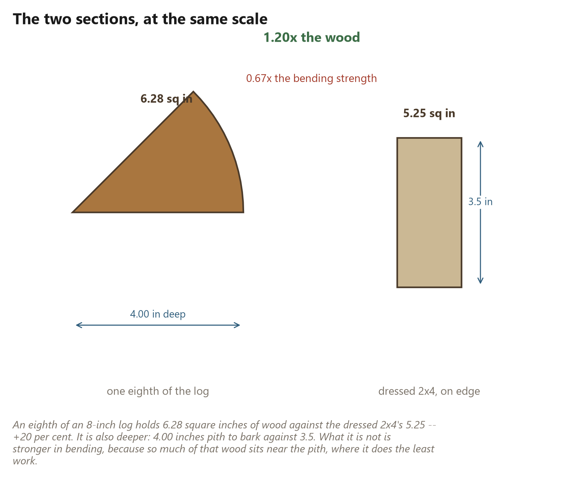
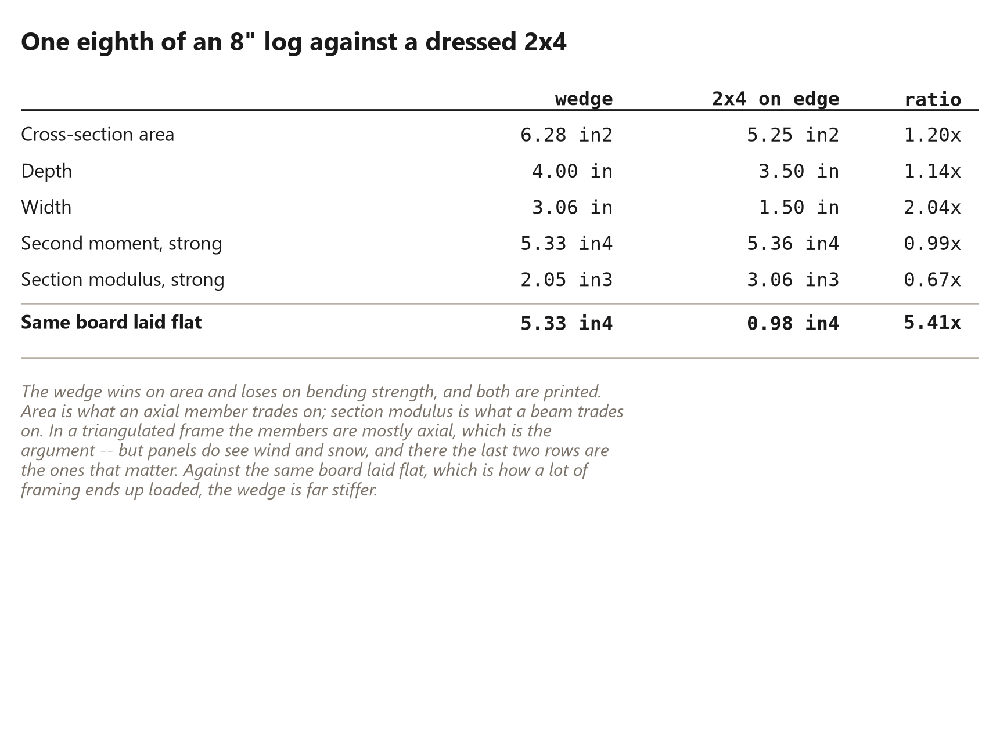

# 7. Not a Worse Two-by-Four

*The head-to-head nobody runs honestly, run honestly*

<!-- Every number in this chapter must come from:
     - book_math.wedge_versus_board
     - book_math.sector_section
     - book_math.board_section
     Quote them as live tokens in double braces, never as
     typed digits. The Numbers panel lists every one. -->

## Not a Worse Two-by-Four

Everybody asks the same question, and they are right to ask it.

*Is a split log actually as good as a board?*

The honest answer has three parts, and only two of them are flattering. This
chapter gives all three, because a method defended only with its good numbers
is a method nobody should trust with a roof over their head.

## The rectangle is not the tree's idea

Modern construction has trained us to think of wood as something that
naturally arrives in rectangles. A tree goes into a sawmill and a stack of
2x4s comes out, and the form is so familiar that it stops looking like a
choice.

It is a choice. The rectangle is not a property of wood. It is the output of
a manufacturing process designed around a particular kind of building — one
made of vertical studs, horizontal plates, flat walls, right-angle corners
and rectangular openings. For that building the rectangle is close to
perfect, and the industry that produces it is very good indeed at what it
does.

A geodesic dome is almost the opposite of that building. Its structural
language is triangles, changing face planes, radial geometry and repeated
angular joints. Nothing in it is a right angle. Nothing in it is a flat wall.

So the question reopens, and it is worth asking properly rather than
assuming the answer in either direction: *for this building, is the
rectangle still the right thing to make out of the tree?*

## More wood, from a modest tree

Start with the simplest measure: how much wood is actually in the stick.

Take an {{versus.diameter_in}}-inch log — not a monster, a tree most people
could fell and move without help. Split it {{tree.sectors}} ways and each
sector holds **{{versus.wedge_area_in2}} square inches** of wood.

A dressed 2x4 — the board actually on the rack, which is 1.5 by 3.5 inches
whatever it says on the label — holds **{{board.dressed_in2}}**.

That is **{{versus.area_gain_pct}} per cent more wood** in the wedge, from a
tree you could carry out of a wood lot in sections.

And it is the conservative version of the claim. A larger log widens the gap
sharply, because area grows with the square of the radius while a 2x4 stays a
2x4. The book quotes the small log deliberately: a claim is worth more made at
its weakest.

The wedge is also deeper. Pith to bark is {{versus.wedge_depth_in}} inches
against the board's 3.5, and depth is where bending resistance comes from.

## And now the number that does not help

Here is where an honest chapter parts company with a sales pitch.

**Area is not strength.** How much a section resists bending depends not only
on how much wood is in it but on *where that wood sits* — material far from
the middle does most of the work, material near the middle does almost none.

And a wedge puts a great deal of its wood near the pith, in the narrow part
of the pie slice, where it contributes very little.

Run the numbers properly and the comparison comes out like this:

| | wedge | 2x4 on edge |
|---|---|---|
| Wood in the section | **{{versus.area_gain_pct}}%** | — |
| Resistance to bending (stiffness) | **{{versus.stiffness_pct}}%** | — |
| Bending strength | **{{versus.strength_pct}}%** | — |

Read that middle row again. The wedge has {{versus.area_gain_pct}} per cent
more wood in it and is **not stiffer**. It comes out within a per cent of a
2x4 stood on edge — effectively identical, having spent twenty per cent more
material to get there.

And the bottom row is worse: in bending *strength* the wedge is
{{versus.strength_pct}} per cent against the same board.

That is the number this method's advocates do not usually print, and it is
printed here, in a table, near the front.

## One consolation, before the argument

There is a caveat to the caveat, and it is a fair one.

The comparison above puts the 2x4 **on edge** — the orientation in which a
board is strongest, and the way a carefully framed floor joist is installed.
A great deal of real framing does not get that. Sheathing battens, blocking,
purlins and plenty of cheerfully improvised structures end up loading boards
the flat way, and against a 2x4 laid flat the wedge is
**{{versus.flat_stiffness_ratio}} times stiffer**.

So the honest summary is: worse than a well-oriented board, dramatically
better than a badly-oriented one.

That is still not the argument.

## Which is the right question

The argument is that *the comparison itself is the wrong shape*.

Asking "is this wedge as good a beam as a 2x4?" assumes that being a beam is
the job. In a rectangular building it usually is: a stud, a joist and a
rafter all spend their lives resisting bending, largely alone.

A triangulated frame does not work that way. That is the entire point of
triangulating it. A properly designed triangle converts an external load into
forces running *along* its members — compression down one, tension along
another — instead of asking any single member to bend. The network carries the
load; the sticks mostly just push and pull.

And for a member being pushed or pulled along its length, the property that
matters is **cross-sectional area**. Not section modulus. Area.

Which is the column the wedge wins, by {{versus.area_gain_pct}} per cent.

So the useful question is not:

> Is this wedge as good a rectangular beam as a 2x4?

but:

> Is this wedge an effective axial member inside this triangulated system?

And there the answer is straightforwardly yes, with more wood in the section
than the board it replaces, from a tree that never went near a mill.

## Mostly

One more piece of honesty, because "mostly axial" is doing real work in that
paragraph.

Panels are not purely axial. Wind pushes on the skin between the members and
snow sits on it, and those loads reach the frame as bending in the individual
sticks. It is not the dominant case and it is not nothing, and it is exactly
where the wedge's {{versus.strength_pct}} per cent deficit is a real deficit
rather than an academic one.

Two things about that:

* The wedge is deep. {{versus.wedge_depth_in}} inches pith to bark is more
  depth than the board has, and depth is what resists the bending it does
  see — which is why the stiffness came out level rather than behind despite
  the shape being worse.
* Panel span is short. The distance between supports in a 2V panel is a few
  feet, not the fifteen a floor joist crosses, and bending demand falls away
  fast as spans shorten.

None of which is a substitute for somebody competent checking your particular
building for your particular snow load. Chapter {{ch.forces}} says the same
thing at more length and names who to ask.

## What this chapter does not claim

It is worth fencing the argument, so nobody quotes it doing work it cannot do.

This chapter does **not** claim that a split-log wedge is better than a 2x4
as a wall stud, a floor joist, a roof rafter, a shelf, a header or a piece of
furniture. For all of those the board wins, often easily, and the reasons are
in the table above.

It claims something narrower and much more defensible:

> For a purpose-designed geodesic dome whose geometry, connectors and jigs
> are built around radially split timber, the wedge is a better use of the
> tree than first converting that same tree into ordinary dimensional
> lumber.

That is the whole claim. It depends on the building being designed around the
material from the beginning — which is what the rest of this book is about.

We are not asking an unconventional piece of wood to imitate a 2x4.

We are building something in which it does not have to.
