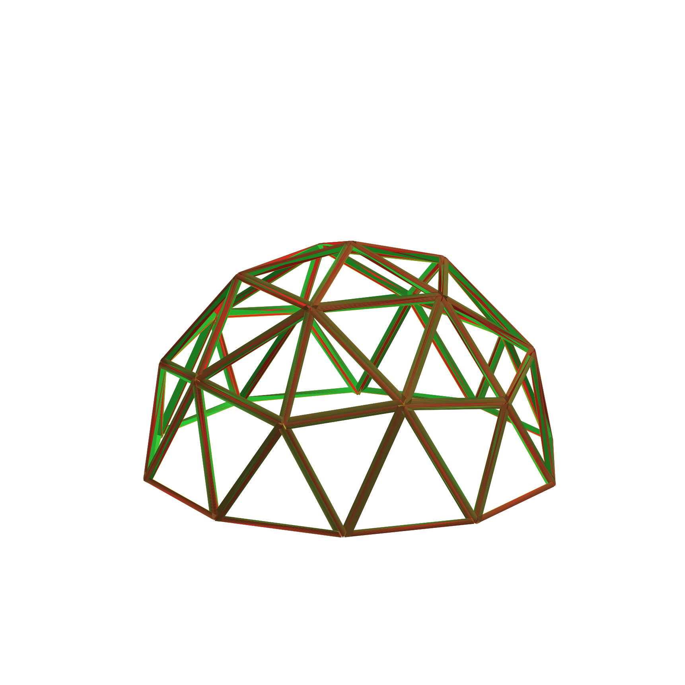
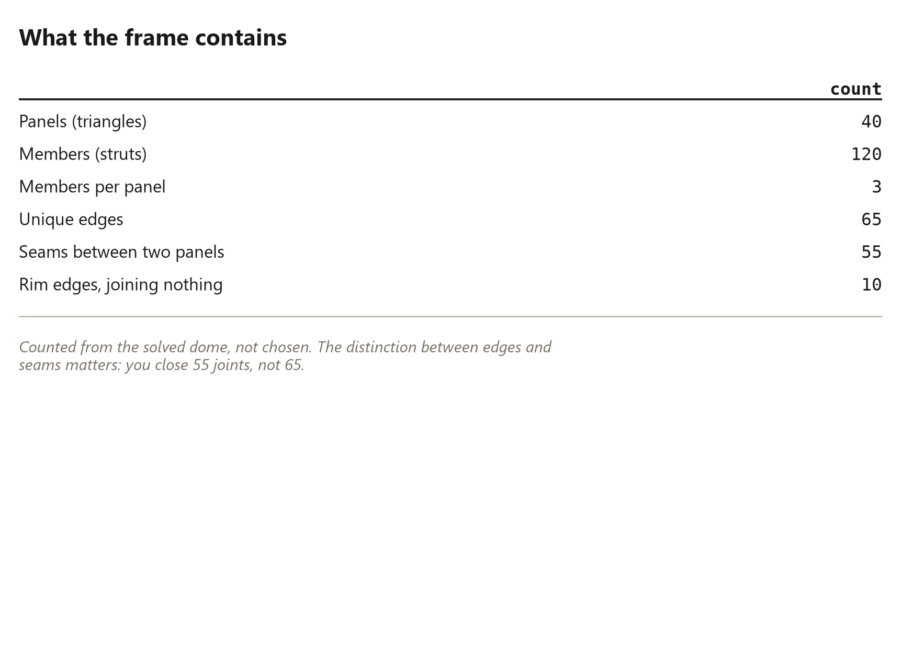

# 7. Forty Panels, One Hundred and Twenty Members

*The 2V hemisphere, counted*

<!-- Every number in this chapter must come from:
     - book_math.frame_counts
     - book_math.panel_seam_count
     Quote them as live tokens in double braces, never as
     typed digits. The Numbers panel lists every one. -->

## Forty Panels

<!-- [opener] Introduce the frame itself.
     target: about 350 words
-->

## Where 2V comes from

<!-- [text] Icosahedron, one subdivision, projected to a sphere, cut at the equator.
     target: about 1000 words
-->

## The frame, exploded

<!-- [plate] Full page: forty panels pushed apart along their own normals.
     figure [frame-exploded] (raw_wedge_world): Forty panels, {{frame.members}} members, {{frame.seams}} seams between them.
-->

## What the frame contains

<!-- [table] Counts, straight from the geometry, with the rim edges separated from the seams.
     target: about 300 words
     figure [frame-counts] (book_plot): Counted from the solved dome, not chosen.
-->

## Why hemispheres and not spheres

<!-- [text] The rim is where the frame meets the ground and where ten edges join nothing.
     target: about 700 words
-->

