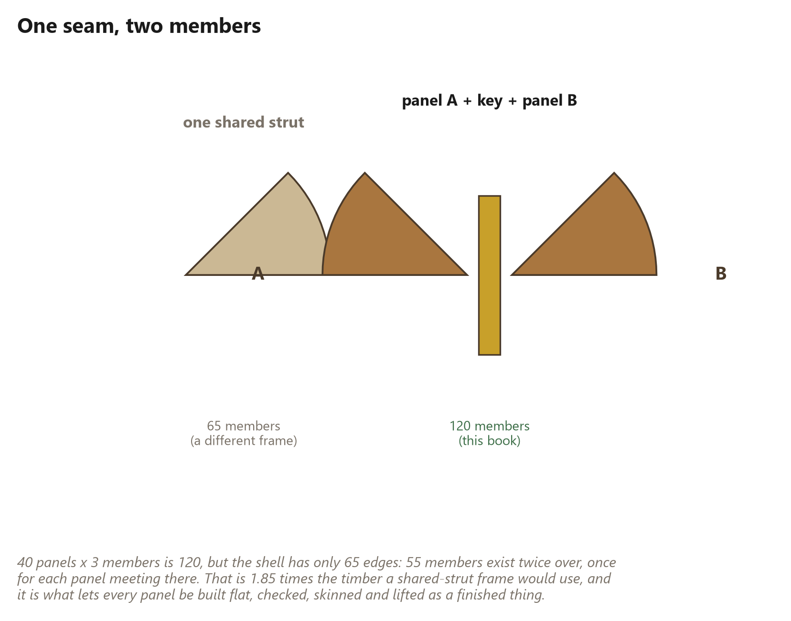

# 18. Why Every Panel Keeps Its Own Edge

*One hundred and twenty members for sixty-five edges, and what the difference
buys*

<!-- Every number in this chapter must come from:
     - book_math.edge_accounting
     Quote them as live tokens in double braces, never as
     typed digits. The Numbers panel lists every one. -->

## Every Panel Keeps Its Own Edge

If you have been adding up as you read, something has not been adding up.

## The arithmetic that does not look right

The frame has {{frame.panels}} triangular panels. Each panel has
{{frame.members_per_panel}} members. So:

> {{frame.panels}} × {{frame.members_per_panel}} = **{{frame.members}}
> members**

But the shell only has **{{frame.edges}} edges**. Count the lines on a
drawing of the dome and that is what you get: {{frame.seams}} interior edges
where two panels meet, plus {{frame.rim_edges}} around the open bottom where
a panel meets nothing.

So there are {{edges.duplicated}} more members than there are edges for them
to be.

That is not an error. It is the single biggest deliberate decision in this
frame, and it costs **{{edges.duplication_ratio}} times** the timber a
conventional geodesic skeleton would use.

It is worth being clear about the size of that, because it is not a rounding
difference. If you built the same dome with one shared strut per edge you
would need {{frame.edges}} members instead of {{frame.members}}. The panelised
frame uses almost twice as much wood in the frame.

Here is why it is worth it anyway.

## What is actually at a seam

In a classical geodesic frame, an edge is one strut, and the two triangles
either side of it both fasten to that same strut. Efficient, and the standard
way it is done.

In this frame, each panel is built complete — three of its own members, closed
into its own triangle — before it goes anywhere near its neighbours. So where
two panels meet there are two members, one belonging to each, with the key
between them.

Panel A's member. The key. Panel B's member.

The duplicated edge is not lumber somebody forgot to remove. It is the price
of a panel being a *thing* rather than a position in an assembly.

## What the extra wood buys

Six things, and the first three are why the fortnight in Part 5 is a fortnight
rather than a season.

**A panel can be built flat.** All three of its members exist and belong to
it, so the whole triangle can be assembled on a bench, at waist height, on the
ground, in the dry. Nothing about building it requires any other panel to
exist yet. In a shared-strut frame you cannot finish a triangle without the
struts its neighbours also use, which is why those domes tend to get assembled
in the air, strut by strut, at the top of a ladder.

**A panel can be checked before it goes up.** It has a measurable shape while
it is still somewhere you can measure it. A panel that came out wrong is
firewood and half an hour; a panel discovered wrong when it is the
thirty-eighth thing lifted into place is a much longer day.

**A panel can be finished before it goes up.** Skin it, seal it, insulate it,
run a cable through it, paint it — all on the ground. This is a genuine
transformation of the work: it turns awkward three-dimensional construction at
height into repetitive two-dimensional production at a bench, which is
manufacturing rather than improvisation.

**The seam gets room for a gasket.** Two members with a gap between them is a
place a key, a spline or a compressible seal can live. One shared strut has no
such space — the panels either side bear directly on it, and weatherproofing
that joint is a separate problem solved with tape and hope. Chapter
{{ch.connector}} is about what can be done with that space, and Chapter
{{ch.seams}} about what has to be.

**A panel can be taken out again.** Undo one seam's fasteners and a panel
lifts out, leaving its neighbours standing and complete. Nothing else in the
shell depended on that panel's members. Replace a rotted one in year fifteen,
cut a window into one in year three, take three out to get a bathtub in —
these become ordinary jobs rather than partial demolitions.

**The frame gains redundancy.** Every interior edge has two members in it. One
splitting, checking or being damaged does not leave that edge unsupported. It
is not a designed redundancy and nobody should rely on it, but it is real.

## The check that has to close

Two independent ways of counting the members have to give the same answer, and
this is worth doing yourself once, because it is the check that tells you the
frame in your head is the frame on the ground.

**Count panel by panel.** Every panel has {{frame.members_per_panel}} members.

> {{frame.panels}} × {{frame.members_per_panel}} = {{frame.members}}

**Count edge by edge.** Every interior seam holds two members, one from each
panel. Every rim edge holds one, because there is nothing on the other side of
it.

> ({{frame.seams}} × 2) + {{frame.rim_edges}} = {{frame.members}}

Both give {{frame.members}}. The software in this project runs exactly this
check every time the book is built, and refuses to print anything if the two
disagree — because if they ever did, one of the two pictures would be of a
building that does not exist, and there would be no way to know which.

## When to share a strut instead

This chapter should not pretend the choice is obvious in every case.

Share the strut if:

* **Timber is your scarcest resource.** {{edges.duplication_ratio}} times the
  members is {{edges.duplication_ratio}} times the trees, and if you have one
  tree rather than two that decides it.
* **You have a crew and scaffolding.** The panelised method's main advantage is
  that one person can do it on the ground. With four people and a lift, in-air
  assembly is not the ordeal it is alone.
* **The dome is small.** Below a certain size the members are short enough to
  handle comfortably at height, and the panel machinery is overhead you do not
  need.
* **You want the lightest possible frame.** For a temporary structure, a
  greenhouse, or anything that has to be carried in, the weight of the
  duplicated members is a real cost.

Keep the panel if:

* **You are building alone**, which is what this method was designed for.
* **You want to finish panels on the ground**, which is most of the reason the
  build fits in a fortnight.
* **You want a weatherable seam**, because the gap is where the seal goes.
* **You expect the building to change**, because panels come out.

This book chose the panel, and every number in it follows from that choice.
Chapter {{ch.method_b}}'s two trees are two trees precisely *because* the
frame duplicates its edges. A shared-strut dome of the same diameter would
come out of about one.

That is the trade, stated plainly: **roughly twice the wood, for a building
one person can make on the ground and take apart again.**
