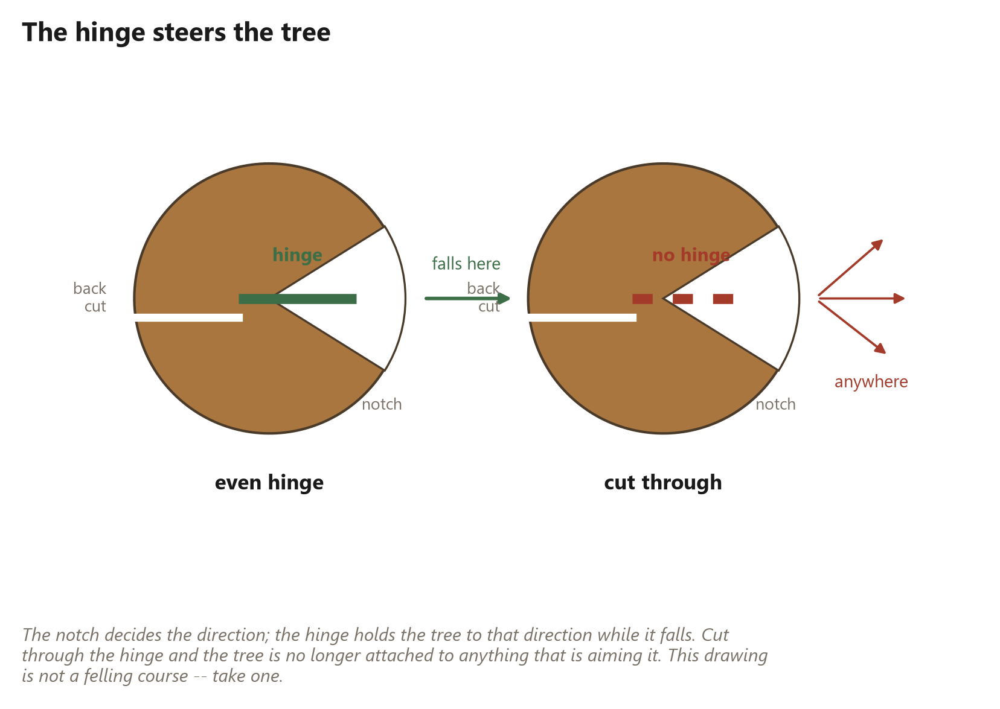

# 24. Days One and Two: Felling

*Putting two trees on the ground where you want them*

## Felling

<!-- [opener] The most dangerous two days.
     target: about 300 words
-->

## Read this before the notch

<!-- [safety] Escape route, hinge, barber chair, and widow-makers.
     target: about 600 words
-->

## The notch and the back cut

<!-- [steps] The procedure, with the hinge dimension called out.
     target: about 900 words
-->

## The hinge, drawn

<!-- [spread] What the hinge does and what happens when it is wrong.
     target: about 350 words
     figure [felling-hinge] (book_diagram): The hinge steers the tree. Everything else is timing.
-->

## Limbing without pinching

<!-- [text] Working a downed trunk, tension and compression sides.
     target: about 750 words
-->

## What actually happened

<!-- [text] The story half: the second tree did not go where it was supposed to.
     target: about 700 words
-->

