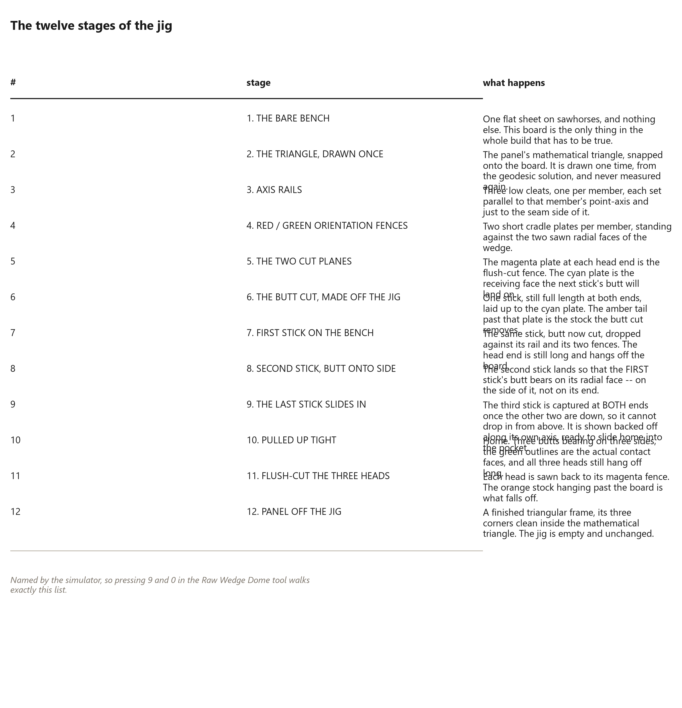

# 30. One Bench, Forty Panels

*What the jig is and what each part of it does*

<!-- Every number in this chapter must come from:
     - raw_wedge_bridge.jig_stages
     Quote them as live tokens in double braces, never as
     typed digits. The Numbers panel lists every one. -->

## One Bench

<!-- [opener] The fixture, part by part.
     target: about 300 words
-->

## The twelve stages

<!-- [table] Every stage of the jig, named, straight from the simulator.
     target: about 300 words
     figure [jig-stages] (book_plot): The twelve stages, in order.
-->

## The jig, labelled

<!-- [spread] Every component called out.
     target: about 400 words
     figure [jig-labelled] (raw_wedge_jig): Bench, triangle, rails, fences, cut planes.
-->

## Setting it out on a real floor

<!-- [text] How to lay the triangle out full size with a string and a pencil.
     target: about 800 words
-->

