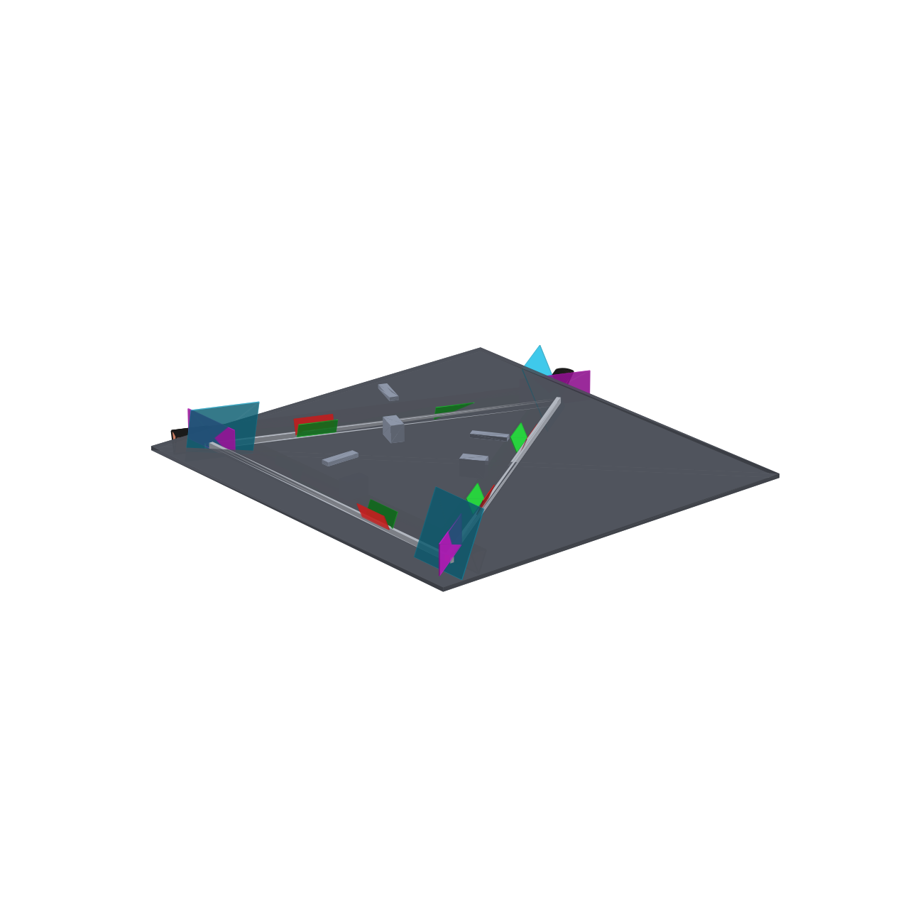
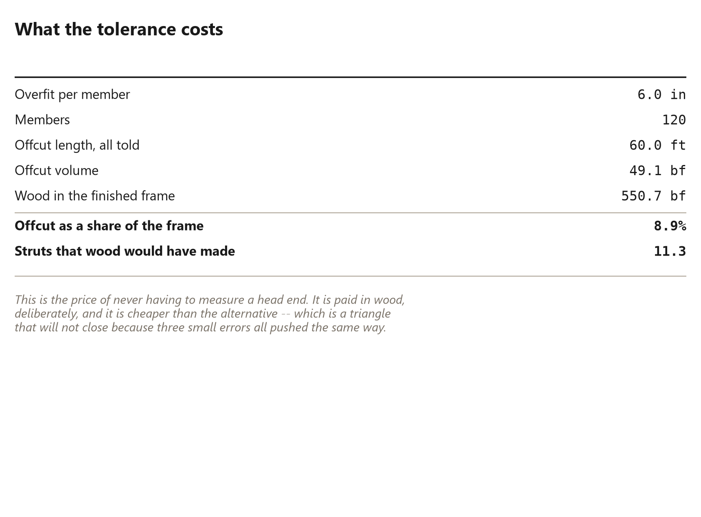

# 32. The Head Overfit

*Deliberately cutting it too long*

<!-- Every number in this chapter must come from:
     - book_math.DECLARED
     - raw_wedge_bridge.model
     Quote them as live tokens in double braces, never as
     typed digits. The Numbers panel lists every one. -->

## The Head Overfit

<!-- [opener] The idea that makes the whole method tolerant.
     target: about 400 words
-->

## Where error goes

<!-- [text] The core argument: overshoot, pull tight, then cut in place.
     target: about 850 words
-->

## Long, then flush

<!-- [spread] The same panel before and after the flush cut.
     target: about 350 words
     figure [head-overfit] (raw_wedge_jig): {{jig.head_overfit_in}} inches of deliberate overshoot, sawn off against the fence.
-->

## How much to leave

<!-- [text] Sizing the overfit against your own stock variation.
     target: about 700 words
-->

## Offcut per dome

<!-- [table] What the tolerance costs in wood.
     target: about 250 words
     figure [offcut-total] (book_plot): The price of the tolerance, in board feet.
-->

