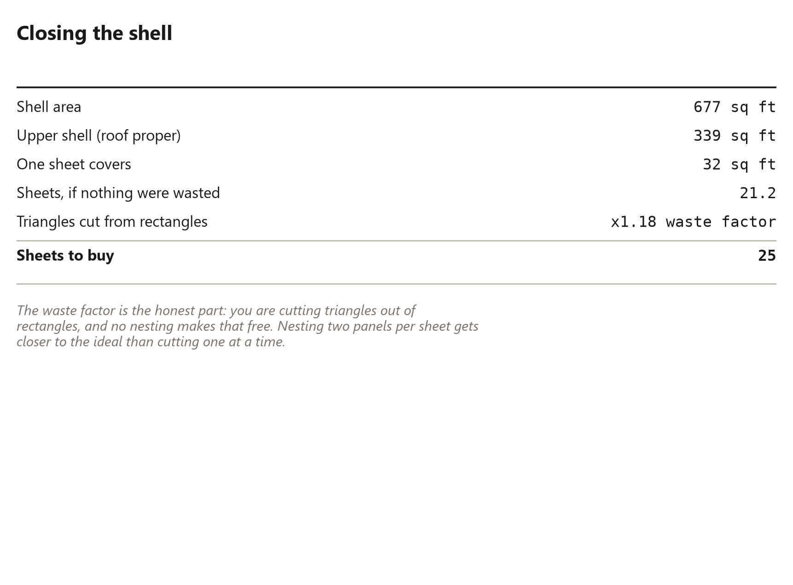

# 37. Closing the Shell

*Forty triangles of something over forty triangles of nothing*

<!-- Every number in this chapter must come from:
     - dome_costing.shell_sqft
     Quote them as live tokens in double braces, never as
     typed digits. The Numbers panel lists every one. -->

## Closing the Shell

<!-- [opener] The options, ranked by how much they cost and how well they work.
     target: about 400 words
-->

## Sheathing a triangle

<!-- [text] Cutting sheet goods to a triangle without wasting half of every sheet.
     target: about 850 words
-->

## Nesting the cuts

<!-- [text] The layout that gets two panels from one sheet.
     target: about 700 words
-->

## Sheet count

<!-- [table] How many sheets the shell takes, computed.
     target: about 250 words
     figure [sheet-count] (book_plot): Shell area and sheets, from the solved geometry.
-->

## The alternatives

<!-- [text] Fabric, shingle, living roof, and what each demands of the frame.
     target: about 800 words
-->

