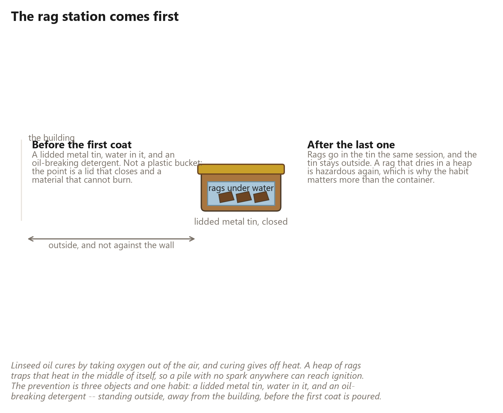
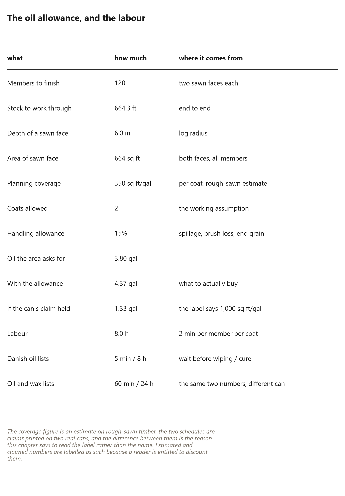

# 43. Finishing the Wood

*What oil does to split timber, what it does not do, and the afternoon it costs*

An oiled member is not a protected member. It is a member that has been
finished — and the difference between those two sentences is the whole
chapter.

The weather chapter said where the water goes and what keeps it out: a skin
that sheds, flashing at the openings, a ring that drains, and a member
allowed to dry. None of that changes here. What changes is the exposed sawn
face inside the building, and the ends of every member you can see: bare,
pale, slightly furry from the saw, and — left alone — they will grey, check
and take on the look of scrap timber while the building around them is
perfectly sound.

Finishing is how you decide what the inside of the building looks like. It is
a cosmetic decision with a structural edge: an oiled face is easier to wipe, a
sealed surface can trap water where an oiled one lets it go, and a member with
a coat on it can still be inspected through it. This chapter is the whole
practice, from reading the can to the rag station, with the quantities worked
out for the frame in this book: {{finish.area_sqft}} square feet of sawn face
and {{finish.hours}} hours of work.

The source material for the finishing practice is a video claiming
{{finish.topics}} things about linseed oil. This chapter is what survives when
those claims are checked against product labels and against the arithmetic of
the building — including the ones that do not survive.

## Read the can before the rag

Linseed oil is three products wearing one name, and the differences matter
before you buy anything.

**Raw linseed oil** is what comes out of the seed press. It cures slowly — it
takes oxygen out of the air and slowly sets, which is why it is safe and quiet
and why a coat in a cold damp workshop may still be tacky next week.

**Boiled linseed oil** is not boiled in the sense of a pot on a fire in any
modern product. It is raw oil with metallic driers added so that it sets in
hours rather than weeks. That is a real convenience with a real cost: the
driers are the reason the label carries warnings, and they are the reason the
drying behaviour of a can is not something you can assume from the word
"linseed".

**Heat-polymerised oil** — the third thing you will meet — is oil that has
been thickened with heat and no driers, and it is what several traditional
woodworking products actually are. A name like *natural*, *boiled* or *Danish*
does not describe a formulation. The label does.

So the rule is the one the label gives you, not the one the video gives you.
Two real cans make the point better than any warning could:

| the can says | wait before wiping | minimum cure |
|---|---|---|
| Danish oil | {{finish.danish_wait_min}} minutes | {{finish.danish_cure_h}} hours |
| oil and wax | {{finish.wax_wait_min}} minutes | {{finish.wax_cure_h}} hours |

The same furniture finish, the same manufacturer, and two different
schedules by a factor of twelve. If you pick one number and apply it to every
can on the shelf, you will either be rubbing off a coat that has already
started to set, or waiting a day for nothing.

And the same video's cleanest rule is too broad: it says raw oil only for
anything that touches food. That is a sensible instinct and it is not what the
labels say — some polymerised finishes are sold specifically for kitchen wood,
and the question a buyer should ask is not "raw or boiled" but "is this
product rated for this use", which is printed on the can.

## The rag station comes first

This is the dangerous part of the chapter and it comes before the pleasant
part on purpose.

Linseed oil cures by taking oxygen out of the air, and curing gives off heat.
A single rag on a bench sheds that heat into the room. A *heap* of rags traps
it in the middle of the pile, and a pile of rags with no spark anywhere near
it can reach ignition temperature and catch fire — often hours after you have
left the shop. It is the classic workshop fire, and it is the one part of
finishing that can burn a building down.

The prevention is three objects and one habit, and all four are cheaper than a
fire:

* **A lidded metal tin.** Not plastic, not a bucket, not a bag. A tin with a
  lid that closes.
* **Water in the bottom of it**, enough to cover what goes in.
* **An oil-breaking detergent** in the water, so the rags stop being a pile of
  oil and become a wet heap of cloth.
* **The habit**: rags go in the tin in the same session they were used, the
  tin stays outside and away from the wall, and it is emptied into whatever
  your local rules say is right. A rag that dries out in a heap becomes
  hazardous again — which is why the habit matters more than the container.

Set the station up before the first coat is poured. A rag station improvised
after the fact is a rag station that gets improvised at the end of the
afternoon, when you are tired and the shop is about to be shut with forty oily
cloths in a bucket by the door.

## How much oil, and how long it takes

The frame in this book is {{frame.members}} members, {{finish.stock_ft}} feet
of stock, and each member has two sawn faces {{finish.depth_in}} inches deep —
the flat radial faces the saw left. That is the surface a finish is for:
{{finish.area_sqft}} square feet of it, and it is the same area whether you
count it as members or as feet because the two are the same wood.

The allowance:

* **Coverage** is planned at {{finish.coverage_sqft_gal}} square feet per
  gallon per coat. That is an estimate for rough-sawn timber, which drinks
  more than a planed board.
* **{{finish.coats}} coats**, which is what a working finish means in practice
  on a softwood face.
* **{{finish.handling_pct}} per cent handling**, for the spillage, the brush
  loss and the end grain, which takes up oil like a wick.

The arithmetic that falls out: {{finish.gal_base}} gallons for the area, and
{{finish.gal_allowance}} gallons to actually buy. A little over four gallons
of oil for a whole building's interior faces — which is the point of the
estimate being printed rather than guessed at.

Now the number that argues against the whole business, and it belongs here
rather than in a footnote. The can's label claims
{{finish.label_sqft_gal}} square feet per gallon, which is
{{finish.label_ratio}} times the planning figure — and that claim is a
manufacturer's coverage on a prepared surface, not a measurement on a
rough-sawn wedge. If you plan to a label you will run out halfway through the
pile, which is the sort of thing that turns a pleasant afternoon into a second
trip.

And the labour: {{finish.minutes_member}} minutes per member per coat comes to
{{finish.hours}} hours of active work for the frame, and that figure excludes
every part of the job that is not rubbing oil into wood — preparation, getting
to the members, inspection, and the cure time between coats. A cheap can of
oil can still make an expensive job. That is not an argument against
finishing; it is an argument for knowing that you have bought eight hours of
work when you buy the can.

## What oil cannot do

Four things the video implies and the building refuses:

**It cannot restore strength.** A member that has split along its pith, or
that has decay in it, is a repair — and if the decay is in a member doing
structural work, it is a replacement. Oil on a compromised member is paint on
a cracked beam: it hides the problem from the next person who inspects the
building. The grading passes in the small-units chapter are where that
decision is made, and this chapter does not get a vote.

**It cannot stop decay or insects.** Nothing in a linseed oil can carries a
preservative rating. The ground-contact ring at the base of the building, the
footings, and any timber that stays wet want a product rated for that job, not
a food-grade oil.

**It is not an air seal and it is not a rain seal.** This is the one that
matters most, because the seal is the thing that keeps the water out and a
finish is the thing that makes the wood look right. An oiled face will still
pass air and still pass water vapour — which is what you want on the inside
faces, and exactly the wrong thing to rely on for a weather surface.

**It cannot be used where something else has to bond.** Keep oil off the lands
that a sealant, tape or gasket has to stick to, and keep it off the printed
key and its gaskets. Marine epoxy systems say it plainly: bonding surfaces
must be free of oil and wax. A coat of oil in the wrong place turns a sealed
joint into a joint that leaks in year two — which is precisely the failure the
seam chapter spent its whole length preventing.

So the honest summary of what a finish buys is this: a face that wipes clean,
that stays pale rather than greying, that lets the wood dry, and that can be
renewed in an hour. That is a real thing to want. It is just not protection,
and a builder who confuses the two will leave a weather surface unfinished
because it "has oil on it".

## Inspection, and the second coat

The finish record is the last piece of kit and it costs nothing. Write down
the product, the batch, what you did to prepare the wood, the date, and where
the coat went. Keep a sample board with the same treatment on it, because grey
wood darkens under oil and it is easy to convince yourself that a weathered
face has been protected when it has only been darkened.

Then the renewal question, which is where most finishing advice goes wrong by
being too tidy. An oiled interior face on a dry frame does not need a schedule;
it needs an inspection. Once a year, look at the faces that see water — around
the openings, under the floor edge, at the base ring — and treat what is
actually dry and worn rather than the whole building on a timetable. And when
you do renew, clean first: a second coat over dust and grease sets the dirt
in rather than sealing it under.

The one place to be genuinely suspicious is the base of the building, because
that is where water sits and where a member is closest to the ground. If a
member there looks dark and soft rather than merely grey, the answer is a
repair and the answer is this year, not a coat of oil and a note in the
record.

Which is the shape of the whole chapter: the finish is what you do to a sound
building to keep it looking like one, and the inspection is how you find out
whether it still is one.
