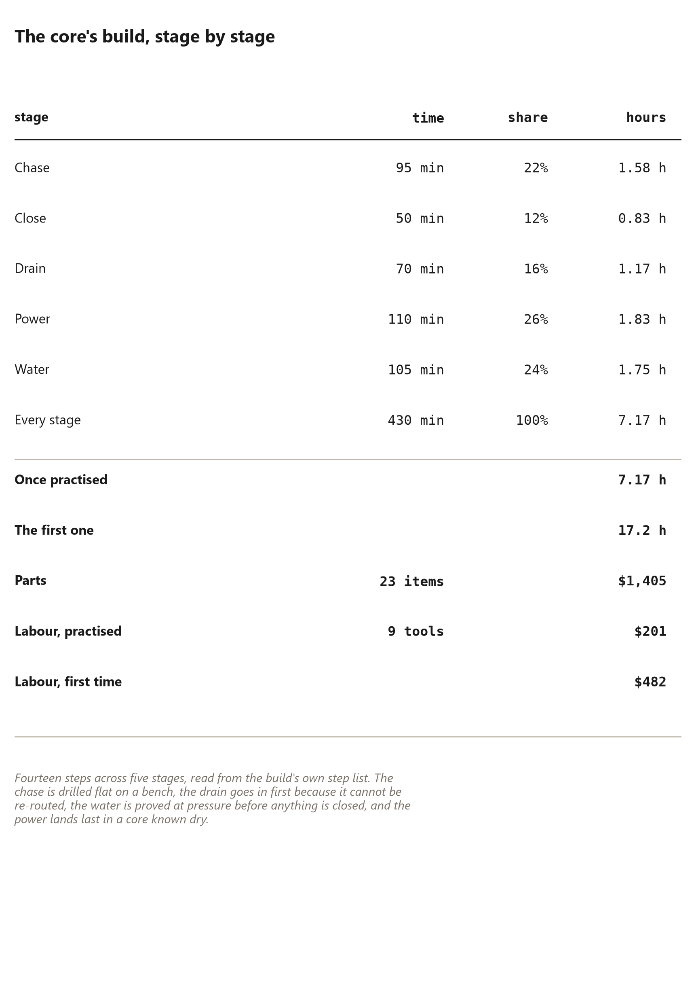

# 45. Heat, Power and the Small Systems

*Making a shell into somewhere you can be in February*

## The Small Systems

A shell keeps weather out. Somewhere you can be in February needs
the small systems: insulation in the walls, power in the dark,
heat in the cold, and a decision about the grid. This chapter is
those systems, at the scale the book's method implies — small,
deferrable, and run through the same voids the frame was built
around.

The dome's gift to its systems is the wedge frame itself: the
cavity between the members, the channel of the seams, the column
of the centre. The systems ride in those voids instead of
requiring a stud wall's worth of drilling, and the chapter's
sections follow the voids: insulation between the wedges,
services in the seam channel, heat in the round volume, and the
grid decision stated without romance. The chapter closes the
home-making half of the book; after it, the dome is a house.

## Insulating between wedges

The frame's wedges are {{member.depth_in}} inches deep, and the
depth is a cavity: between the skin outside and the inside face
lies the whole thickness of the member, interrupted by nothing —
no studs, no plates, no bays that were not drawn in from the
start. Insulation goes in that cavity, and the shape does the
rest.

The options are the ladder of Chapter {{ch.shell_ladder}},
rung by rung: nothing first, then the quilted layers, each one
a size up, each winter warmer than the last. The book's own
preference is the quilt — layers of recycled clothing, sewn by
the network of Chapter {{ch.quilt_network}} — because it is the
one insulation that matches the frame's own economy: it fits the
cavity loosely, it comes off in order, and it costs what a
sewing machine costs. Rigid board fits too, cut to the panels'
triangles and pressed into the cavity; it insulates better per
inch and gives up the removability the quilt was designed for.
Either way the principle is the cavity's: **insulate the space
between the members, never in front of them** — the members are
the frame's structure and its look, and burying them under a
blanket of foam throws away the only thing the building's walls
ever had to say.

The one rule the chapter will not soften is the moisture rule
from Chapter {{ch.weather_and_water}}: insulation without a path
for vapour is a rot factory. The cavity must breathe toward the
seam channel, and the seam channel drains at the rim — the
system Chapters {{ch.seam_jobs}} and {{ch.dew_point}} engineer
in full. Insulate the dome as a living shell, not as a sealed
box, and it gets warmer every winter instead of wetter.

## Running services in a frame with no studs

A conventional wall hides its wires and pipes in the stud bays.
A wedge frame has no stud bays — and it does not need them,
because the seam channel is the chase, and it runs everywhere.

The seams of Chapter {{ch.seam_jobs}} are the building's
service corridor: a continuous void between the panels that
follows the frame from rim to crown, wide enough for cable,
small pipe and the sensor wiring the later chapters assume.
The rules from the channel chapter bind here: water and wire
fit, a round duct does not, no pressure fitting inside a seam,
and the cable-in-chase question is the inspector's call, asked
before the skin closes over it. Power runs from the utility
column — the centre, where the core of Chapter {{ch.the_core}}
lives — outward along the seams to the points of use, and the
dome's own geometry makes the routing obvious: centre to rim,
like the spokes it is.

The discipline the chapter adds is the *deferral* discipline,
borrowed from the stem-cell chapters and stated once here: run
the services where the building will never be cut open again —
the channel, the column, the chase — and leave the end
connections surface-mounted, where a change of mind is a
screwdriver, not a renovation. Threaded inserts in the wedge
faces, set at panel time, are the cheap version of the same
promise: the services bolt on, they unbolt, and the frame never
learns their names. The building that can change its mind — Chapter
{{ch.growth_path}} is the argument in full — is the building whose services were run
as if change were coming, because it always is.

## Heating a round volume

Why a dome is easier to heat than a rectangle, and the one way
it is not, stated together because both are true.

The easy half is geometry: the dome has less skin per floor
than a box — Chapter {{ch.less_skin}} computed the margin — and
heat loss is a skin phenomenon. Less skin, less loss, less
heat to buy; and the round volume mixes itself, so a single
small source warms the whole room instead of leaving the far
corner cold while the thermostat argues with the window.

The hard half is the one the book's own audit keeps repeating:
a dome is not *automatically* cheaper to heat. The skin is
cheaper to insulate well, and the shell ladder exists because
an uninsulated dome loses heat faster than an uninsulated box —
less skin, but skin with a seam every few feet, and air moving
through a seam carries heat with it. The heating claim the
book will make is narrow and honest: **the same build quality,
spent on a dome, buys more warmth per dollar than on a box** —
the margin is geometry's, the build quality is yours, and
Chapter {{ch.honest_limits}} keeps the metered version of the
claim in its audit, marked as not yet metered.

The practical system follows the shape: a small stove or a
single heat source at the centre, the round volume mixing the
air, the quilted layers doing the retention. February in the
dome is a solved problem, not a promised one.

## Off grid, or not

The last decision, treated without romance, because the dome's
audience includes both the grid-connected and the gridless, and
the book refuses to pretend the choice is free.

Off grid is a battery question before it is a panel question.
The panels are cheap and getting cheaper; the storage is the
real purchase, and the arithmetic of Chapter {{ch.honest_limits}}
already printed the honest version of a solar budget — the
demand, the array, the bank, the price, and the days of
autonomy the bank actually buys. Off grid means the lights go
out when the bank is empty, the fridge becomes a weather
gamble, and the system's owner becomes its operator — none of
which is a romance, all of which is survivable for the person
who chose it.

On grid, the dome is simply a small building with a small
bill, and the chapter's recommendation for the first build is
the unglamorous one: connect, if the line is there, and let
the off-grid system be an upgrade bought with the money the
dome saved. The deferred-order rule of Chapter
{{ch.growth_path}} applies: run the conduit for
the future array while the walls are open, buy the panels
later, and never cut the shell twice for a decision that could
have waited.

The small systems close the home chapter the way the dome
closes its shell: one layer at a time, each one bought when
the last one proved itself. Insulate first — the cheapest
warmth. Then power — the difference between a room and a
home. Then heat, then the grid question last, when the
building's own behaviour has answered it. The dome does not
need its systems all at once, and the builder who remembers
that spends the winter warm instead of broke.

### The set, priced

The films quote a small off-grid set for a building like this one, and the
model's own components reproduce it line by line: a {{power.array_watts}} watt
array at {{power.array_usd_watt}} dollars a watt self-installed, a
{{power.battery_kwh}} kilowatt-hour bank at {{power.battery_usd_kwh}} dollars a
kilowatt hour, and a {{power.inverter_watts}} watt inverter. That is
{{power.battery_usd}} of storage, {{power.inverter_usd}} of inverter, and the
array on top: **{{power.set_usd}} all in** — printed here because the films
print it, and because a reader deserves to see that the *battery* is three
quarters of the set.

Three things about that set are worth knowing before buying it.

**The battery is the purchase.** Power electronics have got cheap and cells
have not, which is why the storage line dominates. Every kilowatt hour added to
the bank costs {{power.battery_usd_kwh}} dollars and nothing else in the system
cares — so a reader sizing a system should decide the days of autonomy they
want and buy *that*, rather than buying panels until the lights stay on.

**A derated array is the honest array.** The model applies a
{{power.derate_pct}} per cent derate to a nameplate rating, because wires,
heat, angle and dust are real. Sizing on nameplate watts is how a system comes
up short in its first February — and February is the month it was bought for.

**And the surplus is the real argument.** On this building's roof the array
makes {{sun.of_panels}} panels' worth of power across {{sun.area}} square feet,
and {{sun.surplus_pct}} per cent of what it makes is surplus the building
cannot use at the moment it is made. That surplus is worth {{sun.retail}}
dollars a kilowatt hour if it displaces bought power and {{sun.export}} if it
is exported — and the gap between those two numbers, not the price of the
panels, is what decides whether an off-grid system pays. It is also why the sun
chapter's rotating ring loses at grid prices and wins off grid: the same
numbers, read at two different rates.

For a reader who is genuinely off grid, the surplus argues for storage rather
than for more array — the same conclusion the battery-dominates-the-set note
reached from the other direction, and the reason this book's off-grid advice is
"bigger bank, smaller array" rather than the reverse.

## Build one utility core

Everything in this chapter so far has been about the building's skin and its
services as *decisions*. This section is the one place where the services are
a *build*, because the utility core is the one part of the building an owner
cannot make, and it is worth seeing exactly why.

The core is the centre column: the chase, the drain stack, the water
manifold, the electrical panel, the riser and the seal cap. Everything the
building needs passes through it, and it is assembled and tested as one object
before it is stood up on the pad's service port.

It is {{core.steps}} steps across {{core.stages}} stages, {{core.hours}} hours
once you have done it once and {{core.first_hours}} hours the first time, for
{{core.parts_usd}} of parts. The stage that decides the build is
{{core.longest_stage}}, at {{core.longest_stage_min}} minutes. And the build
uses {{core.tools}} tools, of which the two people skip are worth naming,
because skipping them is the exact failure this chapter exists to prevent.

**The chase first, on the bench, upside down.** The whole core is built on a
bench and stood up at the end, which is the difference between a four-hour job
and a day of kneeling. Every penetration is drilled and grommeted while the
sections are apart and at waist height, because the same hole later is a hole
saw inside a finished core. The chase is also the one part where an error at
the bottom is an inch of error at the apex, where the seal cap has to seat:
plumb is checked over the whole run, dry, before anything is fastened.

**The drain next, because it cannot be re-routed.** A two-inch stack running
the full height with the trap at its foot, dry-fitted and marked across every
socket first — solvent cement gives you about five seconds and no second
chance at alignment. Work bottom to top so gravity is not pulling a fresh
joint apart, and then do not touch it for fifteen minutes.

**Then water, and prove it before anything closes.** Manifold at chest height,
isolating valve at knee height, both opposite the panel, and four capped tails
so a building with no plumbing still ships with them. Every crimp gets the
go/no-go gauge — this is the first tool people skip, and an uncrimped ring
will pass a pressure test and fail in a year. The proof is a gauge on the
system for half an hour, and it happens *before* the panel goes in, because
after that a leak costs the panel.

**Then power, into a core known dry.** Every lug torqued to the figure printed
inside the panel door rather than by feel — the torque screwdriver is the
second tool people skip, and a terminal that feels tight is not tight. Four
breakers: outlet ring, lighting, the window unit, and one spare, so the first
snap-on module never needs the door opened again. Label them in writing now,
not from memory in a year.

**Then close it and prove the cap.** Sleeve on the chase, cap on the sleeve,
six catches set so the gasket compresses evenly, and then open and close it
five times on the bench. The cap is the one thing between the building and the
weather.

Two things follow from doing it in that order, and both are the chapter's
argument in miniature. The first is that **the sequence is the specification**:
drain before water, water before power, power before closing, closing before
standing up. Get the order wrong and you are cutting into a finished
assembly, which is exactly what the chase's grommets exist to prevent. The
second is that **the core moves**: it unbolts from four joints and a lift and
goes into the next dome, so those {{core.hours}} hours are spent once for a
lifetime of buildings rather than once per building. Which is the reason the
price of the standard article puts {{product.column_usd}} into this part and
almost nothing into the frame.

A reader who has built the frame in this book can build the core. A reader
who has built neither should practise on the core first: it is small, it is on
a bench, its mistakes are recoverable, and it teaches the same lesson the
whole building teaches — that the order you do things in is part of the design.

## The plates, and what they are honestly worth

One piece of hardware in this chapter's list deserves its own page, because the
films spend two chapters on it and this book had only mentioned it in passing:
the thermoelectric plate that lives in the seam channel.

**It is a heat pump, not a cooler.** A Peltier plate moves heat from one face
to the other, and reversing the current reverses the direction. That single
fact decides how it is used: throw heat to the side you want warmer — into the
room in winter, outside in summer. The first film in the series showed the
plate heating the room and called it right, which was right in winter and wrong
in the other half of the year, and the correction is worth knowing before
anybody wires one up.

**What it makes, and what that is worth.** A dome's worth of plates is
{{plate.watts}} watts, and run six hours a day it condenses
{{plate.litres_day}} litres a day — {{plate.gal_year}} gallons in a year. That
sounds like a water supply until it is put next to the roof: one inch of rain
on this shell is {{roof.gal_per_in}} gallons, so a year of plate output is the
rain of a single {{plate.rain_in}}-inch shower. And it costs
{{plate.kwh_per_litre}} kilowatt hours per litre, against the roughly one a
compressor-driven dehumidifier uses — which is already a poor way to make
water.

So the honest statement, and it is the films' own: **the plates are a
dehumidifier that happens to make water, and the roof is the water supply.**
Buy them to keep the wood dry where nothing else can — in the seam channel, in
the wettest weeks of the year — and let the gutter do the water. A reader who
installs plates to be independent of a well has bought the wrong machine, and
will find out in August.

## The wall that could be a filter

The last idea in this chapter is the one the project has computed and never
built, so it belongs here with its arithmetic and its caveats side by side.

The idea: run air in at the base ring, let it cross the whole shell, and the
building's wall becomes a distributed filter — warmer and drier on the way in.
Reverse it and the sky is the supply, drawn inward through the structure:
dynamic insulation, in which the wall is warmed by the air being drawn through
it. Both directions are one machine — a fan, a ring main, and a shell that is
porous on purpose.

The airflow side is arithmetic a reader can check. The shell encloses
{{filter.volume_ft3}} cubic feet behind {{filter.skin_sqft}} square feet of
surface, and the fresh air a dome needs is about {{filter.cfm}} cubic feet a
minute — so air would cross the wall at {{filter.ft_min}} feet a minute,
{{filter.in_min}} inches a minute, which is {{filter.ach}} air changes an hour.
That is a crawl no occupant can feel, and feeling it is what would make the
idea unacceptable. So far so good — and this is exactly where the films stop,
and where this book stops too.

Four things decide whether the idea is *good* rather than merely quiet, and none
of them is computable from the airflow:

**The wall is untested as a plenum.** Nobody has built a strut lattice at
building scale and measured how air actually spreads through it. A model that
treats the shell as an even filter is an assumption, and the first place it
will be wrong is at the joints.

**Direction is the risk.** Air moving outward through a warm, damp structure
carries moisture into the wood; the same flow in the other season carries it
out. A dynamic-insulation wall works because it is engineered to keep the outer
face warm and dry — a designed assembly with a moisture profile, not a gap
between wedges.

**A sealed skin cannot breathe.** The weather membrane that keeps rain out also
kills this idea, so the wall-as-filter needs a deliberately permeable shell,
which is the opposite of what the weather chapter spent its length achieving.

**An unreachable filter is never cleaned.** If the shell is the filter, the
filter is the building. Nobody takes a dome apart to clean it, and a filter
nobody cleans is a blockage with a fan behind it.

The position this book takes is the one the films took: the airflow arithmetic
stands, the idea is not refuted, and the project has not built one. A reader
who wants to try it should treat the first winter as the experiment —
instrument the members, vent the cavity rather than sealing it, keep the filter
somewhere reachable — and should not build a house on the assumption that it
works. The chapter's rule about honesty applies to an idea as much as to a
number: say what is computed, say what is not, and leave the reader the
decision.
