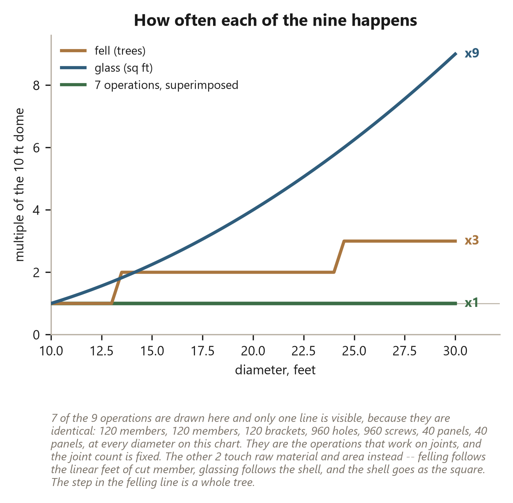
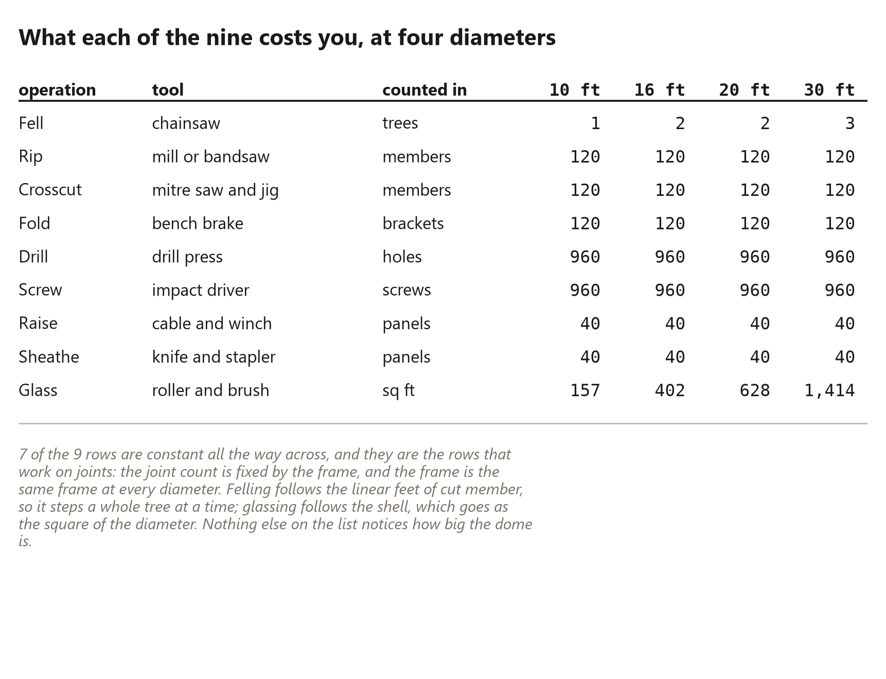
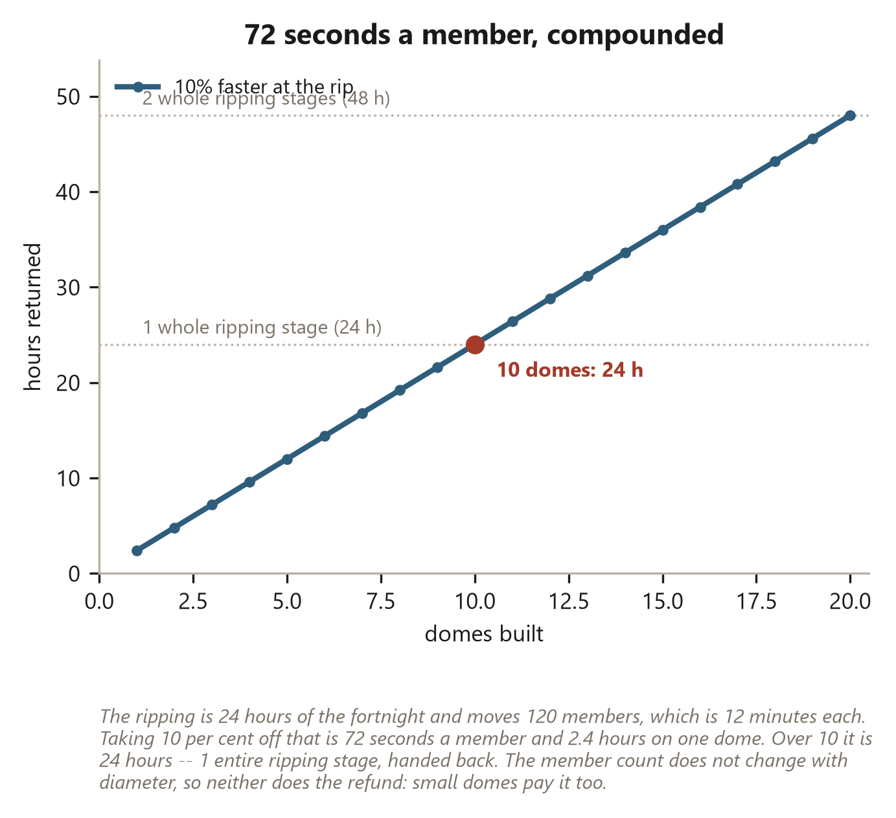

# 54. Nine Processes at Any Size

*Fix one of them and every dome you ever build gets cheaper.*

## Nine Processes at Any Size

The last chapter counted parts. This one counts *verbs*, and the verb list is
the shorter of the two.

There are {{nine.count}} things you do to turn standing timber into a shell.
Nine. Not nine categories with sub-steps hiding inside them -- nine operations,
each one a distinct setup with its own tool, its own bench and its own way of
going wrong. You can learn them in an afternoon of reading and be bad at all of
them by the end of the first week, which is exactly the right number of things
to be bad at.

Here they are, in the order they happen:

> {{nine.names}}

That is the whole shop. Everything in this book that is not thinking is one of
those nine.

And the reason it matters more than the parts count is this: parts are things
you buy, and processes are things you *get better at*. A list this short is a
list you can actually attack. Nine places to put your attention is a manageable
number of places. A list you cannot hold in your head is not a list, it is a
fog.

## The nine, in the order they happen

**Fell.** Drop the tree, limb it, buck it to section length. This is the one
process with weather in it, and a chain, and a thing above you that is about to
be somewhere else. It is also the only operation on the list whose count
follows the timber rather than the joints: a {{flat.small_ft}} foot dome takes
{{nine.trees_small}} tree, a {{flat.large_ft}} foot dome takes
{{nine.trees_large}}. Everything after this happens on a bench.

**Rip.** Split each round section lengthwise into wedges. This is the longest
of the nine by a distance -- {{work.ripping_hours}} hours, {{work.afternoons}} full
afternoons, {{work.ripping_days}} of the fortnight's {{work.days}} days. Hold that
thought; the whole back half of this chapter is about it.

**Crosscut.** Cut each member to its solved length, both ends. The angles are
not measured here, they are held: the jig knows the angle, and your job is to
put wood against the fence and pull the handle {{flat.struts}} times. If you
find yourself reading a protractor during a crosscut, something upstream has
gone wrong.

**Fold.** Bend flat stock to the connector angle, {{flat.brackets}} times. Same
principle as the crosscut and worth naming twice, because it is the design idea
of this entire build: *the angle lives in the tool, not in the operator.* You
set the brake once. After that a bracket is a repetition, and repetitions are
cheap.

The fold is also where the geometry of the whole book shows up in one number.
The dome's seams fold at {{seam.fold_a_deg}} degrees and {{seam.fold_b_deg}}
degrees -- two angles, not forty -- so the brake gets set twice for the entire
frame. A frame whose corners are all different would need the brake set once
per corner, and the fold would stop being one process and become a puzzle with
{{flat.brackets}} solutions. The nine stay nine because the frame keeps its
angles on a short leash.

**Drill.** Pilot the bracket legs. {{nine.holes}} holes, one per screw, which
makes this the largest number on the list and the one most worth a drill press
and a stop. Nobody has ever regretted clamping a fence early.

**Screw.** Drive the frame together. {{flat.screws}} screws, fixed by the
bracket pattern, and therefore -- this is the part that surprises people --
*identical at every diameter*. A {{flat.large_ft}} foot dome takes the same
{{flat.screws}} screws as a {{flat.small_ft}} foot one.

**Raise.** Lift each assembled triangle into place and tie it to its
neighbours. {{nine.panels}} panels go up, not {{flat.struts}} members, and that
distinction is what keeps this a one-person job: you are lifting a stiff,
finished, self-supporting object on a cable, not balancing three loose sticks
in the air and hoping.

**Sheathe.** Close each triangle. Still {{nine.panels}} of them, whatever they
measure.

**Glass.** Lay up the shell. The second of the two processes that scale, and
the one that scales hardest, because it is priced by area and area goes as the
square: {{nine.glass_small}} square feet at the small dome,
{{nine.glass_large}} at the large one.

## Seven of the nine do not move at all

Now put the counts side by side across the diameters, because the result is
sharper than the last chapter's version of it.

It is not merely that all nine operations are *still on the list* at every size.
{{nine.flat_count}} of the {{nine.count}} happen the **same number of times**.
Not proportionally fewer, not roughly similar -- the identical count.
{{flat.struts}} rips, {{flat.struts}} crosscuts, {{flat.brackets}} folds,
{{nine.holes}} holes, {{flat.screws}} screws, {{nine.panels}} raises,
{{nine.panels}} sheathings, at {{flat.small_ft}} feet across and at
{{flat.large_ft}}.

Only {{nine.moving_count}} move, and look at *which* two. Felling and glassing:
the one at the very start that touches raw material, and the one at the very
end that touches area. Everything in between -- every operation that touches a
**joint** -- is frozen, because the joint count is frozen, because the frame is
the same frame.

That is the sentence I would put on the wall of a dome shop. **Work at the
joints does not scale.** A dome is mostly joints. Therefore a dome mostly does
not scale.

## Why a short list compounds

Here is what a short process list buys you that a short parts list does not.

Improvement has to land somewhere. When you work out a better way to do
something, that improvement attaches to a *process*, and it only pays off as
many times as that process runs. This is the whole reason factories look the
way they do, and it is why a stick-frame house resists getting better.

Try the same count on a conventional house. I am not a framer, so take this as
one man's list rather than a figure this book has solved -- but off the top of
my head: footings, sill plates, rim joists, subfloor, plates, studs, headers,
cripples, blocking, sheathing, housewrap, rafters or trusses, fascia, soffit,
roof deck, felt, shingles, flashing, siding, trim. Twenty, and I have not
touched anything electrical or wet, and a real framer would double it. Each is
a distinct skill with its own tools, its own tolerances, its own way of failing.
Get {{rip.gain_pct}} per cent better at hanging rafters and you have improved a
slice of one build, once, and the slice is small because rafters are a small
share of a very long list.

Now do the same on nine. {{rip.gain_pct}} per cent at the rip is
{{rip.gain_pct}} per cent of {{rip.day_share}} per cent of the whole job. The
share is enormous because the list is short. A short list *concentrates*
improvement.

And it repeats. The nine do not change between domes. Not between sizes -- the
last section proved that -- and not between builds. Whatever you work out about
the rip on dome one is still true on dome nine, because it is the same rip, on
the same bench, with the same wedge coming off it. Nothing about it was
specific to a diameter.

This is what people mean, usually without being able to say it, when they claim
a dome "gets easier". It is not that the work is lighter. It is that there are
only nine places for the learning to go, so none of it leaks away.

A short list also buys you a *rhythm*, and the rhythm is worth more than the
learning on a solo build. Nine processes means you can batch like a kitchen
rather than juggle like a handyman: all the folds in a morning, all the holes
in an afternoon, all the raises in a day. Batching is only possible when each
process is a clean stage with a setup, and a long, tangled list is precisely
what a clean stage is not. On a stick-frame job the trades overlap and the
order is negotiated; on this list the order is printed at the top of the
chapter, and you run it like a production line with one worker. That is not a
small thing. It is most of why the fortnight closes.

The flip side is a warning. A short list also *concentrates mistakes*. If your
jig holds a bad angle, it does not hold it on one member, it holds it on
{{flat.struts}} of them, on every dome, forever, and you will not notice until
the last panel refuses to close. Nine processes means nine things worth
checking obsessively before you do them {{nine.holes}} times.

## What one process is worth, in hours

Take the longest of the nine and price an improvement in it properly.

The ripping is {{work.ripping_hours}} hours: {{work.afternoons}} afternoons,
{{work.ripping_days}} days of the {{work.days}}, {{rip.day_share}} per cent of the whole
fortnight. It moves {{flat.struts}} members through the mill, which is
{{work.struts_per_hour}} an hour, which is {{rip.minutes_per_strut}} minutes
per member. That last figure is the one to hold, because it is the scale you
can actually aim at. Nobody improves a fortnight. People improve
{{rip.minutes_per_strut}} minutes.

So: find {{rip.gain_pct}} per cent. A better infeed roller, a stop that does not need
resetting, a second pair of trestles so the offcut has somewhere to go, the
sections stacked at hand height instead of on the ground. Any of that is
credible.

{{rip.gain_pct}} per cent of {{rip.minutes_per_strut}} minutes is
**{{rip.gain_seconds}} seconds per member.**

Over one dome, {{rip.gain_seconds}} seconds times {{flat.struts}} members is
{{rip.gain_hours}} hours. That is an afternoon that finishes before dark
instead of after it. Nice. Not life-changing.

Over {{rip.builds}} domes it is {{rip.run_hours}} hours. Which is
{{rip.run_afternoons}} afternoons. Which is -- and this is the number worth
sitting with -- **{{rip.run_stages}} entire ripping stage**. {{rip.builds}} builds
of {{rip.gain_seconds}} seconds and you have been handed back the whole ripping
of a dome, free.

Nothing was invented to get that. No new tool, no new material, no cleverness
about geometry. {{rip.gain_seconds}} seconds, found once, at one of {{nine.count}} benches.

The same arithmetic runs backwards, and the backwards version is the reason
the nine deserve fear as well as respect. A stop that is {{rip.gain_seconds}}
seconds *slow* -- loose, sticky, in the wrong place -- is not
{{rip.gain_seconds}} seconds lost once. It is {{rip.gain_seconds}} seconds on
every member, {{rip.gain_hours}} hours on the dome, {{rip.run_hours}} hours
over the run, and {{rip.run_stages}} whole stages of the same run eaten by a
detail nobody thought was worth ten minutes to fix. The list concentrates
losses exactly as hard as it concentrates gains, and the only difference
between the two directions is which one you noticed. The nine are not nine
chores. They are nine levers, and every one of them works in both
directions, on every dome you will ever build.

And the arithmetic is indifferent to size. The improvement is per member and
the member count does not change with diameter, so that {{rip.run_hours}} hours
is the same whether those {{rip.builds}} domes were garden pods or the largest
thing one person can frame. You do not get a smaller refund for building small.

That is what I mean when I say the first dome is the expensive one. It is not
sentiment. It is that the first dome is where you find the {{rip.gain_seconds}} seconds,
and every dome after it is where you get paid for finding them.

## The processes that are not on the list

I have to be straight about what the nine leaves out, because it leaves out
things that can eat a project whole.

The nine is a **shop count**, not a project count. It covers what happens
between a standing tree and a closed shell, on your own ground, with your own
hands. It does not cover:

**Permits and inspections.** These are real, they are sometimes long, and they
are emphatically not flat -- a bigger building draws more scrutiny, and a round
one drawn by its builder draws more still. A plans examiner who has never seen
a hubless pinwheel will ask questions a rectangle never gets asked.

**Siting and access.** Getting a mill to the trees, or the trees to the mill.
This is invisible on a flat site with a track to it and dominant on a slope
without one.

**Delivery and waiting.** Anything bought arrives on somebody else's schedule.
Screws and resin are the two that stop a build dead.

**Waiting for a crew.** Not on the list, because at the top of the handling
band there is no crew. That is the trade: the nine stay small precisely because
nothing on them needs a second person. Go past the band and you add a tenth
process called *coordinating people*, which is the least flat operation there
is and the one that does not get better with repetition, because the people
change.

None of these belong in the nine, and I am not going to smuggle them in to make
the list look honest. They belong in a different count, and they get one --
the money chapter counts dollars, the hours chapter counts days, and both of
them include the waiting.

What I will say is that the nine is the part you control. Everything on it gets
better because you made it better. Almost nothing off it does.
