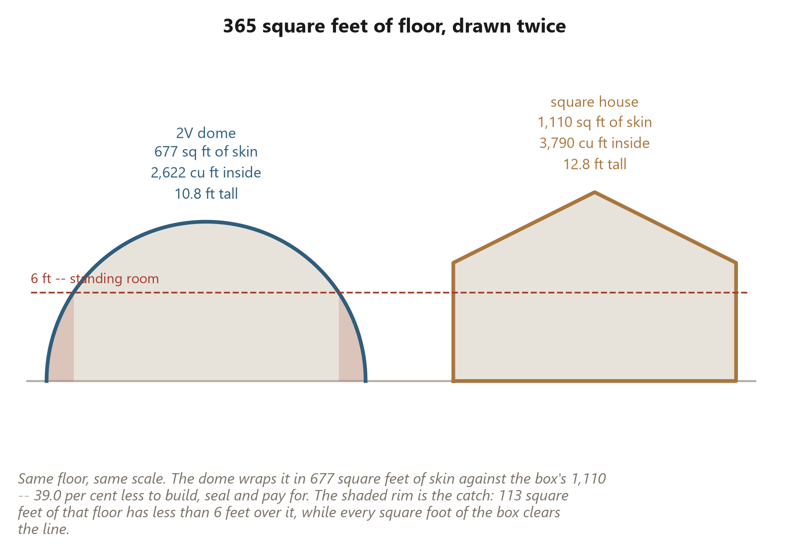
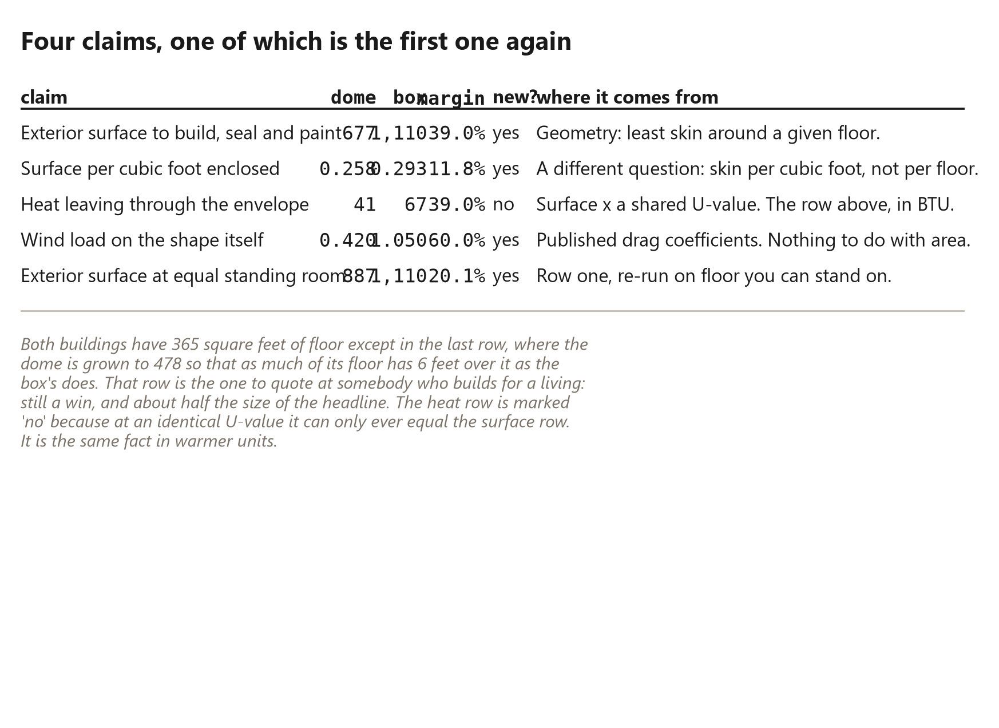
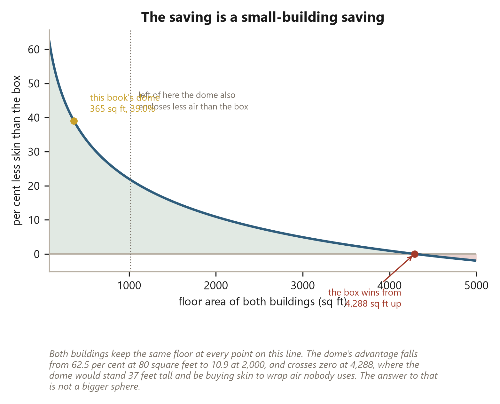

# 57. Less Skin for the Same Floor

*The cheapest square foot of wall is the one that is not in the drawing.*

## Less Skin for the Same Floor

A wall gets paid for four separate times.

It is paid for the day the sheathing is bought. Again the day it is
insulated. Again every time it wants paint, flashing, membrane or a walk
round with a caulk gun. And again every winter for as long as the building
stands, in heat that leaves through it. Four bills, one surface, and only
the first of them ever appears on a materials list.

Which makes the cheapest square foot of wall in any building the one that is
not in the drawing.

That is the whole argument for building round, stated without enthusiasm. A
sphere is the shape that wraps a given volume in the least surface. Cut one
in half, stand it on the ground, and most of that property survives the cut.
The same floor, enclosed the round way, takes less skin around it.

It is true. It is also smaller than the people who repeat it believe, a good
part of it turns out not to be efficiency at all, and it is a property of
*small* buildings rather than a property of domes. There is a size above
which the box wins outright, and this chapter finds it.

None of that is an argument against building round. It is an argument
against quoting the good number on its own, which is what I did for about a
year, in public, with a straight face.

## The same floor, two envelopes

So here are two buildings with exactly the same floor.

One is this book's dome: {{skin.floor}} square feet of floor,
{{skin.dome_ht}} feet to the crown -- which for a hemisphere is also its
radius, a coincidence that stops being charming later in this chapter. The
other is a square house of identical floor area, {{skin.box_side}} feet on a
side, with {{skin.wall_ht}}-foot walls and a gable roof reaching
{{skin.box_ridge}} feet at the ridge.

The box is drawn fairly. It is square rather than oblong, which is the least
perimeter a rectangle can have for its floor, so it is the best case for its
own shape rather than a straw man. Its corners are not penalised, even
though corners are where boxes leak heat and where boxes rot. And the dome
is measured as what it actually is -- flat triangles -- rather than as the
ideal sphere it approximates, which costs it a little surface it would not
have if geometry were doing the building.

The dome's shell comes to {{skin.dome_env}} square feet. The box's comes to
{{skin.box_env}}. The difference is {{skin.saved_sqft}} square feet of
building that simply does not exist in the round version:
**{{skin.saving_pct}} per cent less.**

That is the number. Now the part that gets left off the poster.

Read the volumes in the drawing. The dome holds {{skin.dome_vol}} cubic
feet. The box holds {{skin.box_vol}}. At this size the dome is not only
wrapping the same floor in less skin -- it is wrapping
{{skin.vol_deficit_pct}} per cent less building. Some of that saving is
shape. Some of it is that you bought less house.

Ask the question the other way round, then. Not skin per square foot of
floor, but skin per cubic foot enclosed. The dome still wins, and it wins by
{{skin.per_cuft_pct}} per cent rather than {{skin.saving_pct}}. That is the
shape-only figure at this size, and it is roughly a third of the headline.

The two do not stay apart. Past {{skin.vol_cross}} square feet of floor the
dome begins enclosing *more* air than the box rather than less, because a
hemisphere has to gain height to gain width and a stud wall does not. Above
that line the volume deduction disappears and the surface margin is real all
the way through. Below it -- which is where this book's dome sits, and where
almost every dome anybody actually builds sits -- part of the win is a
smaller building wearing the same floor plan.

Both of those are worth knowing. Only one of them ever gets said.

## What the saved skin is worth four times over

Take the {{skin.saved_sqft}} square feet at face value for a moment and walk
them through the four bills.

**Bought once.** The dome's shell is {{skin.dome_sheets}} sheets of
four-by-eight against the box's {{skin.box_sheets}}, so it starts
{{skin.saved_sheets}} sheets lighter before anything else has happened. Each
of those sheets is also a delivery, a lift, a set of fasteners and a stretch
of the work {{ch.fuel_ledger}} prices in calories rather than money.

**Insulated once.** The same area over again, in whatever is chosen to fill
it, priced per square foot like everything else.

**Sealed repeatedly.** This is the bill nobody budgets and everybody pays,
and it is the only one of the four that arrives forever.

**Heated every winter.** At a wall assembly of {{skin.wall_u}} BTU per hour
per square foot per degree -- an ordinary insulated wall, handed to both
buildings identically -- the dome loses {{skin.dome_btu_f}} BTU an hour per
degree against the box's {{skin.box_btu_f}}. Across a season of
{{skin.hdd}} heating degree days that is {{skin.dome_mbtu}} million BTU
against {{skin.box_mbtu}}.

And this is where I have to take something back.

**{{skin.heat_pct}} per cent less heat is not a second finding.** It is the
first one wearing warmer units. Heat through an envelope is area multiplied
by a U-value, both buildings were given the same U-value, so the heat margin
*cannot* come out any different from the surface margin. It is arithmetically
forbidden. Saying "less skin, and less heat" sounds like two wins and is one
win said twice, and I have said it that way on camera.

The wind figure is genuinely independent. {{skin.cd_dome}} against
{{skin.cd_box}} -- {{skin.wind_pct}} per cent less drag -- comes from
published coefficients for a hemisphere and a cube and has nothing to do
with area at all. That one may be quoted beside the surface number without
double counting.

Then one deduction larger than everything above it.

Equal floor area is not equal usable area. A hemisphere meets the ground at
a tangent, so its ceiling arrives at its floor around the whole perimeter.
Call standing room {{skin.head_ft}} feet -- generous; habitable ceilings are
held higher than that -- and only {{skin.stand_sqft}} square feet of this
dome's {{skin.floor}} qualify. That is {{skin.stand_pct}} per cent of the
floor, and {{skin.stand_lost}} square feet of it that you can reach on your
knees. {{ch.round_room}} draws the whole curve; the shaded rim in the
drawing above is the same fact in elevation. Every square foot of the box
clears the line.

So grow the dome until it stands up over as much ground as the box does. It
needs {{skin.stand_floor}} square feet of floor to get there, and
{{skin.honest_env}} square feet of skin to wrap it, and the margin falls to
**{{skin.honest_pct}} per cent.**

Still a win. Roughly half the one on the poster, and the only version of it
I would put in front of somebody who builds for a living.

## Where the box wins

The margin is not a property of domes. It is a property of small domes, and
the chart says so more bluntly than I would like.

{{skin.sweep_n}} sizes, from {{skin.sweep_lo}} square feet to
{{skin.sweep_hi}}, both buildings holding the same floor at every point. The
saving starts at {{skin.save_80}} per cent for something hut-sized. It is
{{skin.saving_pct}} at this book's dome. At {{flat.large_floor}} square feet
-- the largest dome in the flat-rate table of {{ch.flat_rate}} -- it is
{{skin.save_707}}. By {{skin.vol_cross}} it is {{skin.save_vol_cross}}, and
by then the dome has stopped being the smaller building too.

And at {{skin.env_cross}} square feet it is gone. Zero. Above that floor
area **the box takes less skin than the dome**, and every sentence in this
chapter runs backwards.

The reason is in the drawing and not in the arithmetic. A stud wall is
{{skin.wall_ht}} feet tall whether the house is small or enormous. A
hemisphere cannot do that: to cover more ground it must stand taller, and at
the crossover it is {{skin.env_cross_ht}} feet to the crown and buying skin
to wrap a column of air that nobody will ever use, heat or reach.

That is not the only place the box wins, and the others do not need a chart.

Boxes stack. A second storey doubles the floor for the price of a deck,
adding no roof and no foundation, and a dome cannot do it at all -- a dome's
second floor is a mezzanine inside the same shell, competing for the same
volume. Boxes share walls: two terraced houses each delete an entire
elevation, and a row of them beats any dome on skin per floor so decisively
that there is no argument to have. Boxes take sheet goods whole, where a
triangle takes a rectangle and hands you the offcut. And boxes fit
furniture, appliances, cabinets, baths and doors, every one of which is
manufactured for a flat vertical wall that a dome does not have.

The honest summary is narrow and worth having anyway. For a single, small,
detached, one-storey building, on its own ground, the round shape wraps the
same floor in less skin, and that saving lands four times on every bill the
building will ever send you.

Outside those conditions, build a box.

Inside them, the dome still has the rim problem this chapter kept pointing
at -- {{skin.stand_lost}} square feet of floor with no room to stand up in.
The fix for that is not a bigger sphere. It is the cheapest wall in the
whole build, and it is {{ch.pony_wall}}.
