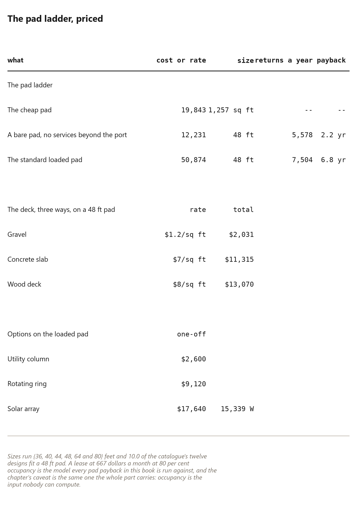

# 65. A Pad, Not a Plot

*A serviced pad is the unit a dome site is actually built from: a deck, a set of services and a diameter, priced as one thing*

## A Pad, Not a Plot

Land is sold in acres, and an acre is not a unit of building. It is a unit of
hope: somewhere in there is a place a building could go, and everything --
trench, track, clearing, pad -- is your problem to turn the hope into a site.

A dome site does not work that way. The unit a dome site is built from is the
pad: a prepared deck, a set of services, and a diameter, priced as one thing.
When you say "a pad" you have said the whole agreement. The deck is where the
dome stands. The services are the wire and pipe that reach it. The diameter
is which domes fit.

The pad is also the answer to the previous chapter's hinge. The ground is
what you cannot take with you -- so the way to build a site people *come* to
is to make the ground somebody else's job, done once, done well, and rented
by the month. The dome moves; the pad stays; and the pad is the thing with a
price.

The pad catalogue is derived, not invented, which is why it is trustworthy.
Every shipped dome's foundation disc is measured, rounded up to the next
{{pad.step}} foot step -- because decking comes in even lengths and a host
building a second pad wants the same cut list as the first -- and the
distinct results are the catalogue: {{pad.sizes_count}} sizes, from
{{pad.smallest}} to {{pad.biggest}} feet. Add a bigger dome to the Creator
and a bigger pad size appears in this list on the next run. The sizes are
{{pad.sizes_list}}, and a {{pad.standard_ft}} foot pad -- the one the rest
of this part prices -- takes {{pad.fits_48}} of the shipped domes outright.
One pad is not one dome. One pad is ten of them, and that is the sentence
the whole site is built on.

The pad also replaces the plot, and it does it twice -- once as a matter of
law, once as a matter of what a dome actually needs. Legally, a plot is a
parcel with a deed, and a deed is a standing liability: you buy the zoning,
the setbacks, the taxes, and the duty to keep the land whether a dome ever
stands on it or not. A pad is a contract. The dome owner rents a serviced
spot for as long as the dome is there, and owes nothing to the dirt the day
it leaves. Practically, the dome never wanted the plot. It wanted the three
things a plot promises and rarely delivers -- a level deck, power and water.
A pad is those three things, priced. A plot is those three things plus a lot
of land you do not need, priced as one. That is the whole difference, and it
is why the unit of this site is the pad, not the acre.

## What a pad is made of

The loaded pad this part of the book prices its worked examples on is
{{pad.standard_ft}} feet across -- {{pad.standard_area}} square feet -- and it
is made of these lines:

| line | cost | what it is |
|---|---|---|
| concrete deck, {{pad.standard_area}} sq ft | ${{pad.concrete_48}} | the slab the dome stands on |
| electrical pedestal | ${{pad.pedestal}} | the 50-amp outlet, breaker and conduit run |
| water and drain | ${{pad.water_line}} | supply stub, frost protection, drain tie-in |
| site infrastructure, per pad | ${{pad.infra}} | share of the access road and trunk services |
| permits | ${{pad.cheap_permits}} | siting, septic or sewer, electrical |
| rotating base | ${{pad.rotating}} | the turntable ring, bearings and drive |
| utility column | ${{pad.column}} | toilet, sink, shower and outlets in one column |
| solar, {{pad.solar_watts}} W | ${{pad.solar_cost}} | the array the pad carries |
| **whole pad** | **${{pad.standard_build}}** | |

Every line has a different life. The deck outlives everything on it. The
pedestal and the water line last decades if the trench is right. The permits
last as long as the code that issued them. The rotating base and the utility
column are the ones that want maintenance, and the chapter on the sun is
honest about what the rotation actually returns. The point of the table is
not the total -- {{pad.standard_build}} dollars is a *loaded* pad, not a
starting point. The point is that every part of "a place to put a dome" is a
named line with a price, and the total is the sum of the lines.

## Gravel, concrete or wood

The deck is the line with a choice in it, and the choice is the same one
everywhere in building: cheap to build, or cheap to own.

Gravel, at {{pad.gravel_rate}} dollars a foot: {{pad.gravel_48}} dollars for
the {{pad.standard_ft}} foot pad. Owner-built in a weekend over fabric.
Drains beautifully, moves under the dome as frost heaves it, and *heaves* --
the dome on top moves with it, which a wooden frame forgives and a poured
one would not. Its failure mode is the slow one: the surface walks away, the
weeds come through, and in five years you rake it and add another load.

Concrete, at {{pad.concrete_rate}} dollars a foot: {{pad.concrete_48}}
dollars. Poured by somebody else, flat forever, the heaviest thing on the
site and the one that cracks if the ground under it was not right. Its
failure mode is binary: it is perfect for thirty years and then it is a
crack that tells you everything about the day it was poured.

Wood, at {{pad.wood_rate}} dollars a foot: {{pad.wood_48}} dollars -- more
than the concrete, and this is the honest surprise. A framed deck costs more
to build than a slab *and* it rots at the ground line in a decade unless it
is built like a piece of furniture. Its virtue is not price. It is that it
can be level on ground a slab would need a truckload of fill to reach, and it
is the one deck you can take apart and reuse.

The cheapest to build is not the cheapest to own, and the difference is not
small. Gravel is the honest default for a first pad: it forgives a bad
decision about where the pad goes, which is the decision you are most likely
to get wrong first.

Run the three decks forward a decade and the sticker price and the owned
price stop being the same purchase. Gravel wants an hour of raking a year
and a load of stone now and then, and after that attention it is the same
pad in its tenth year that it was the day it was laid -- the one deck whose
wear is answered by a person with a rake rather than a contractor with a
jackhammer. Concrete asks for nothing for a decade, and then, if the ground
under it was wrong, it asks for everything at once: the crack is permanent,
and the slab is now a liability you cannot un-pour. Wood is the deck you
keep like a boat, a little at the ground line each year, and it is the one
deck of the three you can take apart and stand again somewhere else. Cheap
to build, cheap to own, and portable are three different decks, and no site
gets all three. The decade is where they stop being the same purchase, which
is why the choice is named out in the open here rather than folded into the
loaded pad's total.

## The cheap pad, costed honestly

The least a pad can cost and still be a pad, every line named:

| line | cost |
|---|---|
| deck on blocks, {{pad.cheap_area}} sq ft | ${{pad.cheap_deck}} |
| share of one hub panel, 1 of {{pad.hub_served}} | ${{pad.cheap_hub}} |
| spur from the hub | ${{pad.cheap_spur}} |
| permits | ${{pad.cheap_permits}} |
| **total** | **${{pad.cheap_total}}** |

Read what is *not* on that list, because the list of omissions is the honest
part. No excavation. No concrete. No pedestal -- the pad shares a hub panel
with three neighbours instead. No trench -- a short spur from the hub. No
rotating base, no utility column, no solar.

That is the number this part of the book compares everything against:
{{pad.cheap_total}} dollars is what "a place a dome can stand, with power and
water within reach" costs at its floor. The loaded pad is
{{pad.standard_build}} dollars. The difference between them is not waste --
it is the rotating base, the column, the solar and the slab, each of which
has to earn its keep in the chapters that follow. The cheap pad is the
baseline. Everything above it is an argument.

And the argument has to earn its keep, so price the year both ways. The bare
pad -- gravel, no rotation, no column, no solar -- costs
{{pad.basic_build}} dollars to build and nets its host {{pad.basic_net}}
dollars a year: paid back in {{pad.basic_payback}} years. The loaded pad
costs {{pad.standard_build}} and nets {{pad.standard_net}} -- paid back in
{{pad.standard_payback}} years. The loaded pad makes more money and takes
longer to repay, and the honest question is not which number is bigger. It
is which pad the site needs, because every extra line on the loaded pad is
an extra thing to maintain, insure and explain, and the chapters on the sun
and the iris are exactly the arithmetic of whether those lines earn their
place. The pad is the product; the cheap pad is the product at its honest
floor; and everything the site adds on top is a bet this book prices before
you make it.

Behind both of those payback numbers sits one assumption, and it is the
softest number on the page, so it gets its own line. The loaded pad rents
for {{pad.lease_mo}} dollars a month, and the host plans to lease it
{{pad.occupancy_pct}} of the year -- not all of it. A full year of rent is
the number a brochure prints; the net above already wears the empty months,
plus the carrying cost a pad keeps accruing whether it is occupied or not.
Payback is stated on that net, never on gross. If the real occupancy lands
below {{pad.occupancy_pct}}, every
payback figure in this part stretches out with it, and no geometry saves it.
Occupancy is the one input the model cannot solve. It is a bet, and it is
the bet the whole site is placed on.

Say the pad sits empty instead, and say it plainly, because an empty pad is
the failure case this whole part is priced against. An empty pad still
carries its fixed lines -- permits to renew, a share of the hub or of the
trunk services, insurance on a loaded pad -- and on the loaded pad the
rotating base and the solar are lines that age whether anyone stands on them
or not. A bare pad left empty costs almost nothing; that is its virtue. A
loaded pad left empty keeps costing, and that is the honest reason the
loaded pad is the riskier bet. The loaded pad earns its extra money only
while it is full. The bare pad forgives being empty, and on a first site
that forgiveness is the product.

## The centre of the pad belongs to the column

One construction detail is worth a page here rather than in the drawings,
because it is the thing a first-time host gets wrong and cannot fix later.

**Reserve the centre.** The pad's middle is where the utility column lands,
which means that is where the drain stack, the water entry and the electrical
feeder have to arrive — and a slab poured without a service port in the middle
is a pad you drill through afterwards or build a different building on. The
films state it as a rule: the pad is designed around the port, not the other
way round. The port is the one hole in the ground the building cannot do
without, and it is put in before the concrete, not after.

The same reservation drives the foundation-size dial in the tool's menus: the
pad is sized from the dome's radius and priced by area, so a host who wants to
change the building later is changing the pile of concrete underneath it. That
is why the network's whole argument is about pads rather than buildings — the
dome can be swapped, lifted or taken away, and the concrete cannot.

**And what the pad returns.** A complete serviced pad at the modest end of
this chapter's build list is the interesting case, because the site's payback
is the only number the model cannot compute: it depends on occupancy, on what
a host charges, and on how often the pad is full. What the arithmetic can say
is the shape of it — a bare pad earns its money back slowly and forgives being
empty, a loaded pad earns faster and needs to be used — and the rest is the
host's own judgement about their road, their town and their tenants. This book
prints the costs and refuses to print a promise.

The zone plan matters for the same reason. A pad is not a plot: the pad is the
part with the port, the ring and the latch pattern, and a reader who buys land
thinking in plots will size the wrong thing. The pad's footprint comes off the
dome's radius, and the chapters on the park do the multiplication for every
size in the catalogue.

## The ladder, from bare to loaded

A pad is not one product either. It is a ladder, and each rung is a decision
about how much of the building's future you pay for now — which is the same
shape of decision the shell ladder made about insulation, and it deserves the
same treatment: prices, returns, and no pretending that the loaded version is
automatically the right one.

**The bare pad** is the honest minimum that is still a pad: a gravel deck, the
service spur, the permits and a share of the hub. It costs
{{pad.basic_build}} to build and returns {{pad.basic_net}} a year, which is a
payback of {{pad.basic_payback}} years — the fastest on the ladder, because
the thing it does not have is the thing that costs money.

**The cheap pad**, costed line by line in the section above, lands at
{{pad.cheap_total}} for {{pad.cheap_area}} square feet of deck, and the lines
that dominate it are instructive: {{pad.cheap_deck}} of deck, then
{{pad.cheap_permits}} of permits, {{pad.cheap_hub}} for the hub share and
{{pad.cheap_spur}} for the spur. Even the cheapest version of a pad is mostly
*deck* and *paperwork* — not services, and not the dome.

### What the cheap pad does not reach

The campaign aims at a different number: **{{pad.target_usd}} for a complete
serviced pad**, so that the ground under a dome costs less than the dome. The
computed cheap pad misses that aim by {{pad.target_gap_usd}} — it costs
{{pad.cheap_total}} — and the gap is the most useful thing in this chapter,
because it is not a gap in the arithmetic. It is a gap in what a *pad* is.

Two honest readings, and a host should pick one deliberately.

**Read it as a target still open.** The cheap pad is gravel, a spur, permits
and a hub share; it has no column, no ring, no array and no finished edge. The
{{pad.target_usd}} aim was for a pad with services at it and something
worth standing on — and the difference between that and {{pad.cheap_total}} is
the finish. A host who wants the aim met has to decide which of the loaded
pad's lines they are prepared to buy first, and the chapter above prices them
one at a time: column {{pad.column}}, ring {{pad.rotating}}, array
{{pad.solar_cost}}.

**Read it as a schedule rather than a price.** Ten years of infrastructure is
the way the network model actually thinks about a pad: not what one costs today
but what it is worth after a decade of being used, maintained and paid for. The
payback column in the ladder above is where that shows up — the bare pad
returns {{pad.basic_net}} a year for {{pad.basic_build}} of build, and the
loaded pad returns {{pad.standard_net}} for {{pad.standard_build}} — and the
honest difference between them is not the money, it is the maintenance a loaded
pad needs while it waits to be full.

So when the campaigns say "a pad for ten thousand dollars", read it as the aim
rather than the quote. The book's computed floor is {{pad.cheap_total}}, the
aim is {{pad.target_usd}}, and everything between those two numbers is a
decision about whether the ground under a dome is a parking space with services
or a small piece of infrastructure. Both are legitimate; only one of them is
ten thousand dollars.

**The loaded pad** adds the three options this part has spent its chapters on:
the utility column at {{pad.column}}, the rotating ring at {{pad.rotating}} and
the solar array at {{pad.solar_cost}} for {{pad.solar_watts}} watts. It comes
to {{pad.standard_build}} and returns {{pad.standard_net}} a year — a
{{pad.standard_payback}}-year payback against the bare pad's
{{pad.basic_payback}}. Everything the loaded pad earns, it earns by being
*used*, and the section below says so in the language a host needs.

**And the deck has three prices**, which is the choice a host actually makes
first. On a {{pad.standard_ft}} foot pad, gravel costs
{{pad.gravel_48}} at {{pad.gravel_rate}} dollars a square foot, a concrete
slab {{pad.concrete_48}} at {{pad.concrete_rate}}, and a wood deck
{{pad.wood_48}} at {{pad.wood_rate}}. Gravel is a fifth of the concrete and
the chapter's honest position is that it is the right answer for a first pad:
it drains, it takes a re-levelling with a rake, and it does not need to be
broken up when the building's footprint changes. Concrete buys a flatness
gravel never has and a permanence a first site has not earned yet.

The ladder's real lesson is the one every other ladder in this book teaches:
buy the rung the building has proved it needs. A host who puts a rotating ring
on a pad nobody has rented has bought a machine for a business they do not
have yet — and a host who pours concrete under a dome whose size is still
being decided has bought a mistake in the most permanent material available.
