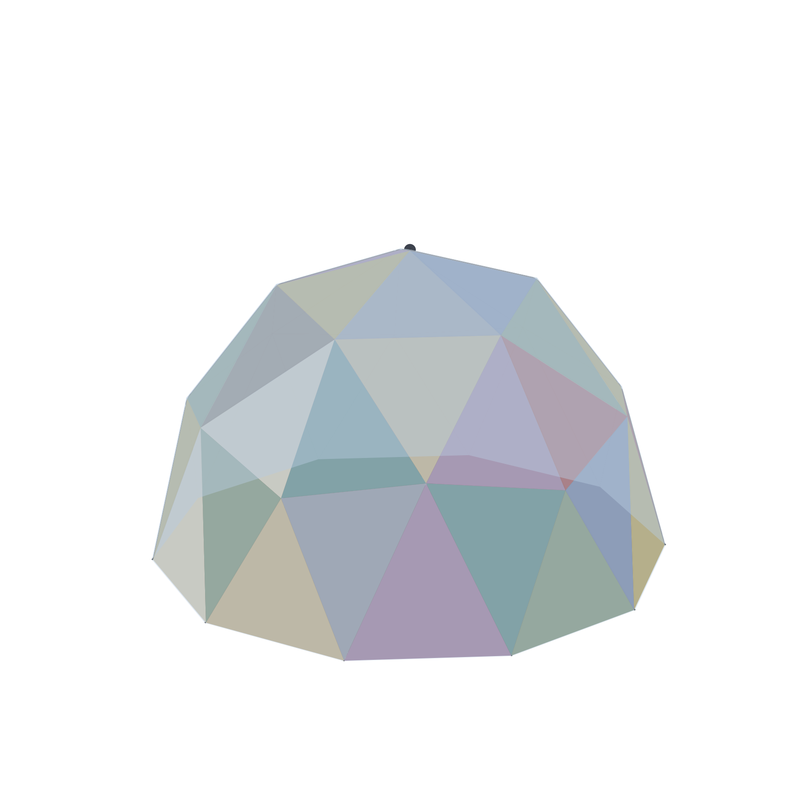

# 69. The Dome That Stacks Hats

*A soft shell instead of a hard one: the frame wears quilted layers of recycled clothing and a rain-slick shower cap, and each new hat is a size up from the last*

## The Dome That Stacks Hats

A hard shell is made once, at one size. That sentence sounds like a fact
about manufacturing and it is actually a limit on the building, and it took
building this frame to see which.

The laminated hull that the manufactured version of this dome ships with is
a fifty-year object -- glass, resin, gelcoat, made in a mould. It is also
done. The cavity behind it holds {{hat.cavity_limit}} quilted layers and then
it is full; after that, insulating further means losing floor on the inside
or building a second shell outside the first, and neither happens. So the
hard shell quietly caps how good the building is ever allowed to get.

The soft shell is the other answer, and the image for it is a shower cap
for the house. From the frame outwards: wood panels on the outside face, a
monolithic polymer membrane over all of it, quilted layers of recycled
clothing -- and a rain-slick outer cap pulled over the lot and strapped
down.

The point is the last layer. A cap is a bag: when the stack under it gets
thicker, you buy a bigger bag. A dome that wears hats can keep getting
warmer, one winter at a time, for as long as somebody owns it. A dome with
a hull cannot. That is the whole argument, and the rest of this chapter is
the arithmetic of it.

## The cap against the hull

The numbers come out of the same model the campaign film quotes, and the
table is the one worth reading slowly, because the saving is not the
interesting column:

| layers | cap stack | hull plus its bays | the cap saves |
|---|---|---|---|
| 0 | ${{hat.soft_0}} | ${{hat.hard_3}} | -- |
| 3 | ${{hat.soft_3}} | ${{hat.hard_3}} | ${{hat.saving_3}} |
| 7 | ${{hat.soft_7}} | ${{hat.hard_7}} | ${{hat.saving_7}} |

At three blanket quilts the cap stack is {{hat.soft_3}} dollars against
{{hat.hard_3}} for the hull and the bay sandwich it needs --
{{hat.saving_3}} dollars less, which is the six thousand dollars the
campaign leads with. At seven quilts the saving is {{hat.saving_7}}.

But look at the row the table does not show. The hull's cavity holds
{{hat.cavity_limit}} layers and then its R-value stops moving. The cap has
no cavity. Its seventh quilt is a hat {{hat.growth_7}} per cent bigger than
the first one -- area goes as the square of the radius, so every layer
makes the next cap a size up -- and it keeps buying R-value for as long as
the owner keeps quilting.

The list price moves with the materials. The standard article with the cap
lists at {{hat.standard_list}} dollars -- {{hat.per_sqft}} dollars a square
foot of floor -- where the same dome with the hull lists at
{{hat.hard_list}}. The cap is not a discount shell. It is the standard
article, and the hull is the upgrade.

## What the cap gives up

The honest list, because a cap that was only upsides would be a tarp with a
marketing budget.

**It is not structural.** The laminated hull was a stressed skin; a
strapped cap is not. Uplift is carried by the ground anchors and the frame
alone, so the frame has to be good for the whole wind load rather than
sharing it.

**The outer layer is sacrificial.** A rain-slick cap lasts
{{hat.cap_life}} years and the membrane under it {{hat.membrane_life}};
they are meant to be replaced, and the thirty-year arithmetic prices the
replacements rather than pretending a cap is bought once.

**Two impermeable layers with fabric between them is a moisture trap.**
In a cold climate the dew point lands in the quilt, and fabric that gets
damp stops insulating and starts rotting. The seam duct -- the airflow
through the frame's own channels -- is the answer to this, and the seam
duct is an experiment, not a solved problem. This chapter would rather
name the dependency than hide it.

**It looks like a tarp.** That is a planning objection, a resale problem
and a neighbour problem, and no amount of arithmetic answers it.

## Why the hull becomes the upgrade

None of that makes the hull a worse thing. It makes it a *later* thing.

The frame does not know which skin it is wearing. The cap dome and the
hull dome are the same {{frame.members}} members, the same bays, the same
column. The buyer who starts with the cap can buy the hull in year five
and it fits -- which is the way the whole system is meant to run: the
cheap hat first, the fifty-year hat when the money exists, and the quilts
carried over between them.

That is what "the dome stacks hats" means. The building is not a shell. It
is a frame with a choice of skins, and the choice can be made again.
