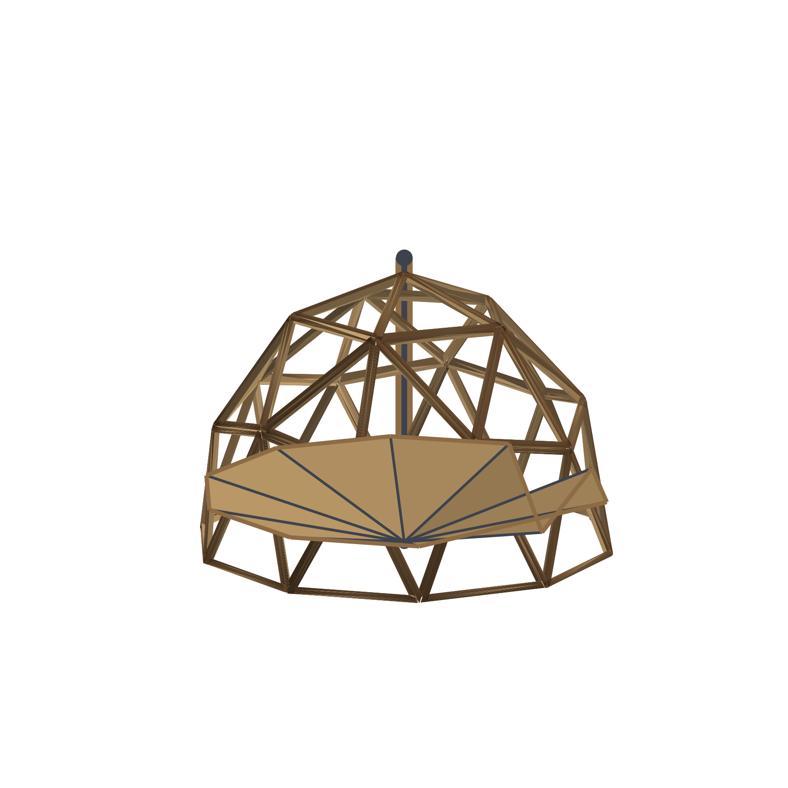

# 70. The Mast and the Floor

*A steel-core mast through the utility column, a wooden floor that clamps to it -- the upgrade bought after the dome -- and an apex ring that hoists the whole structure*

## The Mast and the Floor

The dome's floor is the upgrade, and that is the sentence this chapter is
built on.

On a pad, the floor is somebody else's problem -- the deck the dome stands
on belongs to the host and stays when the dome leaves. But a dome that
wants to move, or to stand where there is no pad at all, needs a floor of
its own. And the way to give it one is not four legs and a skirt. It is a
mast.

The mast runs up the middle of the utility column -- the insulated chase
that already goes from the service port to the apex -- and out through the
top. It is {{mast.rise_ft}} feet of steel core clad in timber: metal where
the strength is, wood everywhere else, because everything else in the room
is wood and a bare steel pipe reads as scaffolding. The services ride
inside the chase around it, so the structure and the plumbing share one
penetration and one object to look at.

At the top, under the seal cap, sits the lifting ring -- a
{{mast.ring}} dollar forging whose whole job is to be the point the
building hangs from when it is hoisted. At the bottom, a flange bolts the
mast to the service port. Between them, the floor clamps on.

## Why the mast runs through the column

The column was already the right shape before the mast existed.

It is floor-to-apex. It is centred. It is the one part of the building
that touches the ground, the walls and the sky. The design decision is
therefore not "where do we put a mast" but "the chase gets a spine" -- a
steel core inside the chase, so the services keep their route and the
structure gets its one load path in the same twelve inches of the plan.

The floor follows the same idea. Its hub is a {{floor.hub}} dollar steel
ring that clamps the mast; from the hub, {{floor.spokes}} radial steel
spokes run to the base ring; timber decking covers the spokes, and a low
rail runs the edge. {{floor.deck_sqft}} square feet of floor that did not
exist until the buyer wanted it, held up by the mast instead of by the
ground -- which is what makes the next chapter possible.

## What it costs, and what it lifts

The upgrade, line by line, out of the same model the campaign quotes:

| line | dollars |
|---|---|
| the mast through the column | ${{mast.total}} |
| the dome's own floor | ${{floor.total}} |
| the floating rig (next chapter) | ${{rig.total}} |
| **all three** | **${{float.all}}** |

And the weight. The frame alone -- the {{frame.members}} members of green
pine -- is {{float.frame_lb}} pounds. The shell or cap, the column, the
floor and the rig all add to it, and the honest thing has to be said
before anybody ties a rope to the ring: **this book prices the parts. It
does not rate them.** The mast's section, the ring's forging and the
hoist's capacity are an engineer's numbers, computed for a specific
building on a specific site, and nothing in these pages is a substitute
for them. What the model can say is that the geometry of the lift is
simple -- one point, one axis, one load path -- which is the kind of lift
engineers like to be handed.

The floor, in other words, is the purchase that turns a dome from a thing
that stands somewhere into a thing that can be picked up and put somewhere
else -- including somewhere with no ground under it at all.
