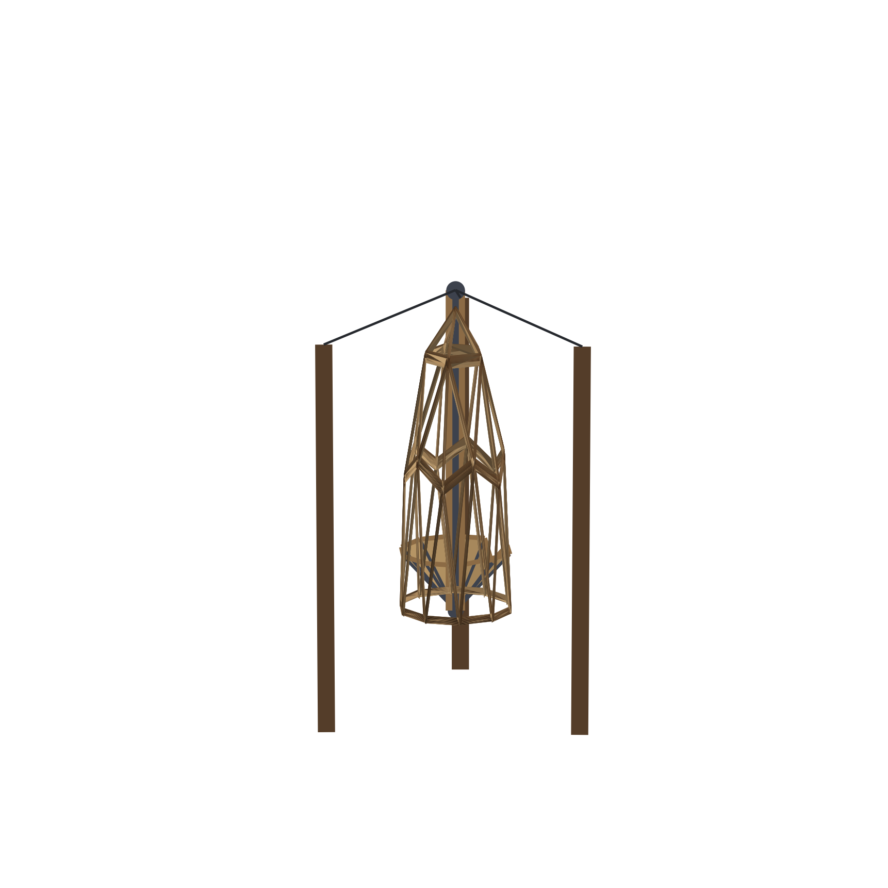

# 71. The Floating Dome

*Hang the mast from three cables between trees and the dome floats with its own floor under it -- a design possibility, with the loads named as the engineer's job*

## The Floating Dome

The mast that hoists the dome can also hang it. That is the whole of this
chapter, and it is the reason the previous one built the floor first.

Three cables run from the apex ring to three trees. The rig is
{{rig.total}} dollars of galvanized cable -- three legs of
{{rig.span}} feet -- a forged hanger that rides the ring, tree-hugger
slings that put no holes in the trees, and a brake winch to do the
hoisting. Winch the dome up, tie the cables off, and the building hangs
in the air with its own floor clamped to the mast under it.

That is the floating dome: no pad, no piers, no ground at all between the
trees -- the same {{frame.members}} members, the same cap, the same
column, held from one point like a lamp.

## What changes when the ground goes away

Everything the earlier chapters assumed about the ground quietly reverses.

The base ring stops being what holds the building up; the mast is. The
floor stops being something the dome stands on and becomes something the
dome *carries* -- clamped to the mast, hanging under the shell, level
because the mast is level. The utility column keeps its job: services
come up a flexible drop along one cable, into the chase at the apex, and
down through the column the same way they would on a pad. The only
difference is that the water line is a hose and the power line is a
cable, and both arrive from above instead of below.

The trees do the work the ground did, and the deal is made without a
single hole in the bark -- saddles, not bolts -- because a tree that is
still alive is a foundation that maintains itself.

## What would have to be true

Now the honest page, because this is the least-built idea in the whole
book and it should be read as a drawing rather than a report.

The loads are real and none of them has been rated here: the cables in
tension, the trees in bending, the mast in compression, the ring under
the weight of {{float.frame_lb}} pounds of frame before the floor and the
skin are even counted. Three points of support mean the building hangs
steady in still air and *moves* in wind -- a dome hung from cables is a
pendulum, and the trees flex with it, and the arithmetic of that is an
engineer's, not a builder's.

So the conditions this idea would have to meet are the same conditions
the closing audit of the last part named, restated for the air: a site
with three sound anchors and the room for them; a mast, ring and rigging
sized for the lifted whole; a way in -- a ladder, a stair, a bridge --
that does not pull the building sideways; and an authority that will
permit a dwelling hanging from living trees, which most will not without
a stamp.

And yet the arithmetic worth keeping is the one this chapter opened with.
The same mast, the same floor, the same building: hoisted onto a pad one
month, hung between trees the next, winched onto a trailer the month
after that. The floating dome is not a product. It is the same product
with the ground removed -- and the ground, as the pad chapters spent a
part of this book proving, was always the part you could not take with
you anyway.
