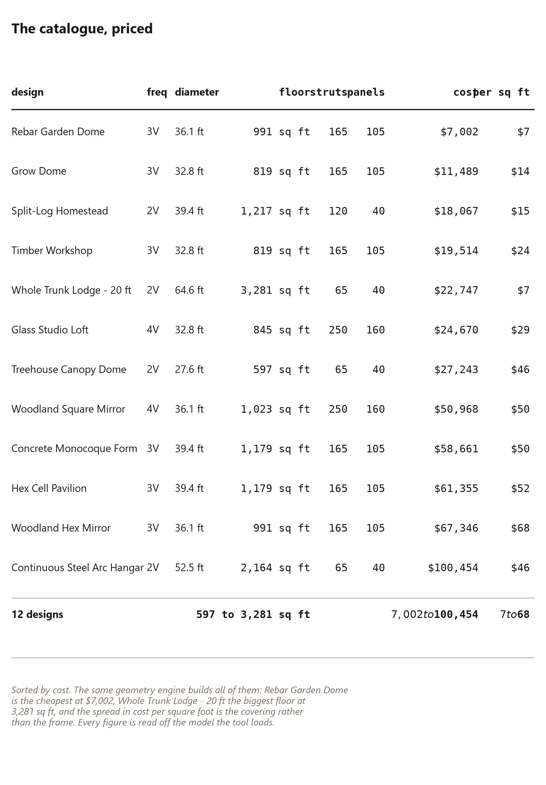

# 81. Fifteen Buildings From One Body

*The fit-out catalogue, priced cheapest first: the same frame as gym, guest house, workshop, garage, studio and nursery*

## Fifteen Buildings From One Body

The stem cell's promise, priced: the same body, fifteen
fit-outs, and the ladder that orders them. This chapter is
the catalogue Chapter {{ch.stem_cell}} promised — the
reference page a builder or a backer reads to see what the
one frame actually becomes, with every row priced by the
same model so the rows can be compared.

The catalogue is ordered cheapest first, and the ordering is
the argument: the differences between the rows are panels
and services, not structure, so the ladder's rungs move in
small steps — a gym is the body plus racks, a guest house
the body plus a bed wall — and the whole ladder is
reachable from the same undifferentiated frame the fortnight
built.

## The catalogue

The table is the complete list: every named fit-out, the
panels it changes, and its price from the stem-cell model's
own quotes. The frame under every row is the same body, the
core is the same core, and only the walls' faces differ —
which is why the prices cluster the way they do, and why the
cheapest rung is not a smaller building but a *barer* one.

## Snap-on services

The plate shows the discipline that makes the ladder real:
everything else snaps onto the outside. A fit-out never
plumbs into a wall, never wires through a member, never
drills the frame for a decision the next owner may reverse —
the services hang off the frame's own faces and the
column's own ports, the way Chapter {{ch.the_core}} built
them to, and the fit-out is the set of things that bolt on.
That is the difference between the catalogue and a showroom
of fifteen houses: a house has its services buried in its
walls, and this frame has fifteen faces it can wear
*without* burying anything.

## Reading the ladder

What moves between rungs, and what the ladder is actually
telling the builder.

Between the cheapest rung and the dearest, the frame does
not change by one member. What moves is panels — the
windows, the walls, the benches — and services — the sink,
the rack, the bed — and the ladder's lesson is the stem
cell's lesson made countable: **the building's purpose is
its cheapest part.** The builder who reads the ladder
correctly stops asking "which dome should I build" and
starts asking "which rung can I afford now" — because the
rung is a purchase, not a construction, and the next rung
is always one set of panels away. The catalogue closes the
stem-cell chapters the way the shell ladder closed the
warmth chapters: the body is built once, the decisions come
one at a time, and the book has just priced the whole
staircase.

## The same engine, twelve finished designs

The fit-outs above are one body wearing fifteen purposes. The same software
also ships {{design.count}} *designs* — complete buildings, framed, paneled,
fitted and priced — and the table is worth reading because it is the fastest
way to see what the geometry does and does not decide.

Read it in four passes.

**The floors span {{design.floor_ratio}} times.** From
{{design.floor_min}} square feet in the smallest to {{design.floor_max}} in
the largest: {{design.floor_ratio}} times the building. Nothing in the
frame's list of operations changes across that span — which is the flat-rate
chapter's argument, restated as a price list.

**The prices span {{design.cost_ratio}} times.** From
{{design.cheapest_usd}} for the {{design.cheapest_name}} to
{{design.dearest_usd}} for the {{design.dearest_name}}. That is the widest
spread in the book, and it is not the structure: it is steel arcs,
mirror tile and poured concrete, all of it skin and hardware.

**Per square foot it runs {{design.cheapest_sqft}} to
{{design.dearest_sqft}}.** Look at which designs sit at the cheap end — the
rebar garden dome and the whole-trunk lodge with canvas over it — and at the
dearest: a shell wearing sixty-eight dollars of mirror tile per square foot.
The cheapest floor in the catalogue is the one with the least building on it,
which is the same conclusion the envelope chapter reached from the other
direction.

**Only {{design.frequencies}} frequencies are used**, and
{{design.twos}} of the twelve designs are two-frequency domes — including the
one this book builds. A reader who has followed the method to this point has
not learned the beginner's version of a bigger catalogue. They have learned
the version {{design.twos}} of the tool's own products are made from.

Between the lightest shell in that table and the heaviest there is a factor of
{{design.weight_max_lb}} against {{design.weight_min_lb}} pounds, and the
whole of the difference is materials rather than geometry. A foot of dome is a
foot of dome; what you hang on it is a decision, and the catalogue is what
that decision looks like when somebody has already costed it.
