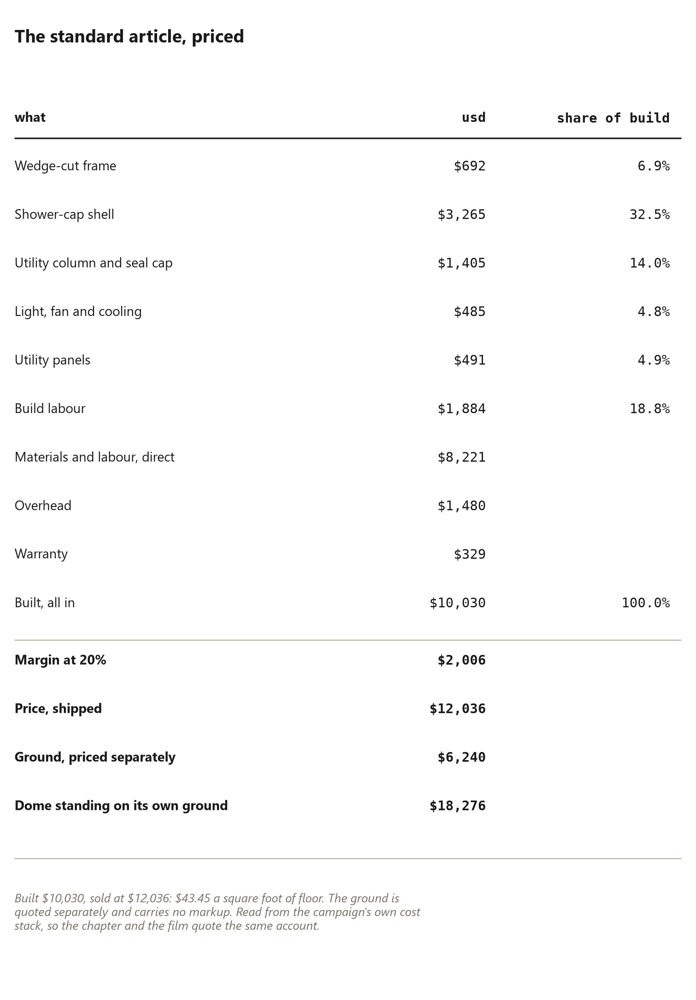

# 84. The House as a Product

*What the finished article costs to build, what it sells for, and the difference between a target and a quote*

Everything up to this point has been a build. You fell the trees, you split
the wedges, you cut the compound ends, you bolted forty panels into a shell
and you laid a floor in it. That is the method.

This chapter is the article. One standard dome, priced the way a
manufacturer prices anything: materials, labour, overhead, margin, and a
price at the end with a number on it. It exists because the films quote that
price — {{product.price_usd}} — and a book that teaches the method and then
leaves the arithmetic of the product to the marketing has broken its own
rule. Every figure here comes out of the same cost stack the campaign's own
films read. Change the model and this chapter changes with it.

It also exists because of a specific honesty this project has had to
practise twice already, in the money chapter and in the hours chapter: state
the number that does not help the argument. The product's price is one of
those numbers. It is {{product.per_sqft_usd}} a square foot finished, which
sounds reasonable until you remember that this book's whole claim is that
building it yourself costs a fraction of that — and both statements are true,
because they are prices for different things. One is a building you make.
The other is a building somebody else makes for you, and ships.

## One standard article

The article is one dome of the reference size, complete and habitable: the
frame, the watertight cap, the utility column with its seal cap, the panels,
the fittings, and the labour to put it together. Frame, cap, column,
services, utility panels and build labour, in the order the money is
actually spent.

**The frame first**, because it is the cheapest part of the product and the
most expensive part of the method. The standard article's frame is
{{product.frame_usd}} of the build. That is not a typo: the entire
structure — one hundred and twenty split members, the hardware that joins
them, the hardware that is a set rather than a pile — costs less than a tenth
of what the finished article costs. This book has spent fifty chapters
teaching you the hardest and cheapest part of the job.

**The cap is the expensive layer.** {{product.cap_usd}} of the build goes
into the watertight shell that goes over the top, and it is the correct place
for the money to go. The frame is allowed to be imperfect because the skin
closes the shell; the skin is not allowed to be imperfect because there is
nothing above it. A building whose cheapest component carries the load and
whose most expensive component keeps the weather out is a building whose cost
distribution tells you exactly where the risk lives.

**The column, {{product.column_usd}}**, is the one part an owner cannot
make. Water manifold, drain stack, electrical sub-panel, riser, seal cap: the
centre of the building arrives as a tested object, which is why the campaign
in the next chapter spends its largest single line on tooling for it.

**Light, fan and cooling, {{product.services_usd}}**, and the **utility
panels**, {{product.polyps_usd}} — the framed inserts that turn a bay into
something that does a job. Between them they are under a thousand dollars,
and they are what make the difference between a shell and a room.

**Build labour, {{product.labour_usd}}**, at a burdened wage rather than a
friend's afternoon. This is the line a self-builder deletes entirely, and it
is worth knowing how much they are deleting: about a fifth of the build.

Add those and you have the direct cost, {{product.direct_usd}}. Add overhead
and the warranty provision and you have what it actually costs to deliver
the thing: **{{product.built_usd}}**.

The price is that, plus the margin: {{product.margin_usd}} at
{{product.markup_pct}} per cent, for a shipped price of
**{{product.price_usd}}** — {{product.per_sqft_usd}} a square foot of floor,
finished, on a pad the customer built or bought separately.

Two remarks on the margin, because a reader is entitled to hear them from
the person taking it. First, twenty per cent on a manufactured article is
not greedy; it is at the thin end of what small manufacturing runs on, and it
is stated here as a fraction rather than buried in a price list. Second, it
is a *planning* margin on a product that has been built once or twice, not a
production margin on a product built a thousand times. The honest comparison
is not against a furniture factory. It is against the fact that the same
money in a conventional house buys roughly a third of the square footage,
because that money is carrying land, a builder's overhead, a seller's
commission and a mortgage.

## The price the films quote

{{product.price_usd}}. It is worth walking that number back to its parts,
because a price that cannot be taken apart is a price that cannot be checked.

{{product.built_usd}} to make, {{product.margin_usd}} of margin at
{{product.markup_pct}} per cent, and {{product.price_usd}} shipped. Over the
area of the standard article that is {{product.per_sqft_usd}} a square foot.

Now the comparisons the films make, all of them computed rather than
asserted:

**Against a car.** The completed article costs less than a new mid-range
pickup, and it is a building. That is not a boast, it is a category
observation: the reason a manufactured home can be priced like a vehicle is
that both are products made in small factories in low volume, and the reason
this one can be priced *below* most of them is that its structure costs
almost nothing.

**Against the same floor in a conventional house.** At the published cost of
a new site-built house per square foot, {{product.per_sqft_usd}} buys a
fraction — and the difference is not the shape. It is land, financing,
labour at market rates, and the chain of hands the second chapter counted.

**Against building it yourself.** That is the whole book. The price of the
article is the price of *not* building it, and the difference is the reason
the method exists.

And the two numbers a buyer should ask for and rarely gets: what the article
costs to *run*, and what it costs to *change*. Running costs are in the
climate chapter, computed at seventeen cents a kilowatt hour. Change costs
are the next chapter but one, and they are the product's real feature — the
modules are priced separately precisely so that a building can be upgraded
rather than replaced.

## The target, and the gap

The campaign states a design target for the barest version: the trailer
model, {{product.target_usd}}, relying on the pad for services the way a
caravan relies on a campsite. It is the number the project would like the
standard article to reach, and it is a good target because it is specific:
{{product.target_usd}}, not "affordable".

The computed price of the standard article is {{product.target_gap_usd}}
above that target, and this book prints both numbers side by side on
purpose. A target that is never compared with the real price is not a target,
it is a slogan; and a project that quotes the target in public while
computing the real number in private has started lying to its own readers.
So: the target is {{product.target_usd}}, the achieved price is
{{product.price_usd}}, the gap is {{product.target_gap_usd}}, and the ways to
close it are visible in the cost stack — the frame is already negligible, so
the gap lives in the cap, the column, and the labour of assembling them. That
is a design problem with three named parts, which is a much better position
than a vague promise of cheapness.

Three points about the target, in the order they matter:

1. **A target is a decision; a price is an account.** The {{product.target_usd}}
   was decided by somebody who had not yet priced a moulded strut. Deciding
   is legitimate. Quoting the decision as though it were the account is not.
2. **The ground is real money and it is priced separately.**
   {{product.ground_usd}} of the {{product.standing_usd}} it takes to stand
   the article on its own serviced pad. That is more than a fifth of the
   whole proposition, it is on the pad chapters' arithmetic rather than this
   chapter's, and it is marked up by nobody — the ground section is quoted at
   cost, which is a deliberate choice and a good one.
3. **None of this is a quote.** Local labour rates, freight to your site,
   permits, the engineer's stamp on your wind load and your snow load: all
   outside this account and all somebody else's numbers. A price in a book is
   a planning figure. A price for your building is a conversation with a
   builder who has seen your ground.

## What the price does not include

Read the exclusions before the headline. That is the rule this project has
applied to every claim it has made, and the product is not exempt from it.

**The ground.** Priced separately, at {{product.ground_usd}} on the reference
pad, and not marked up. If you have a level site with power and water, that
number shrinks; if you have a slope and no access, it grows past the price of
the dome.

**The modules.** The catalogue in chapter {{ch.modules}} is priced module by
module, and the standard article ships with one blank utility panel. A
building's fit-out is the customer's list, not the product's: the
advertiser's forty lit triangles and the sauna's heater cost different
amounts of money and neither is included in {{product.price_usd}}.

**The engineer.** The frame's wind and snow loads, the mast, and any hoist
carrying people are somebody else's signature. The campaign funds that
signature as a line item rather than pretending the arithmetic in this book
is a structural rating — and this book has said so since page one.

**The appliances, the furniture and the site work.** Everything that makes a
shell into a home is priced in the chapter on the round room, in the money
chapter, and in the catalogue, and none of it is in the article's price.

What that leaves is a claim that survives all the exclusions: a complete,
habitable shell of {{frame.panels}} panels and {{frame.members}} members,
made of {{dome.trees}} trees' worth of split timber or of bought members, for
{{product.price_usd}} delivered as a product — or for the price of your own
labour if you take the method the rest of this book teaches, which is the
comparison that made the project worth doing in the first place.
