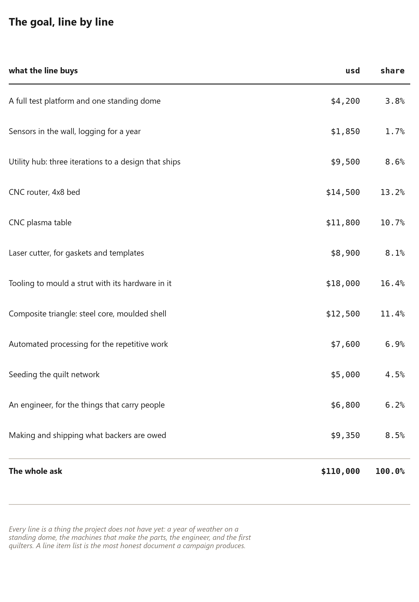
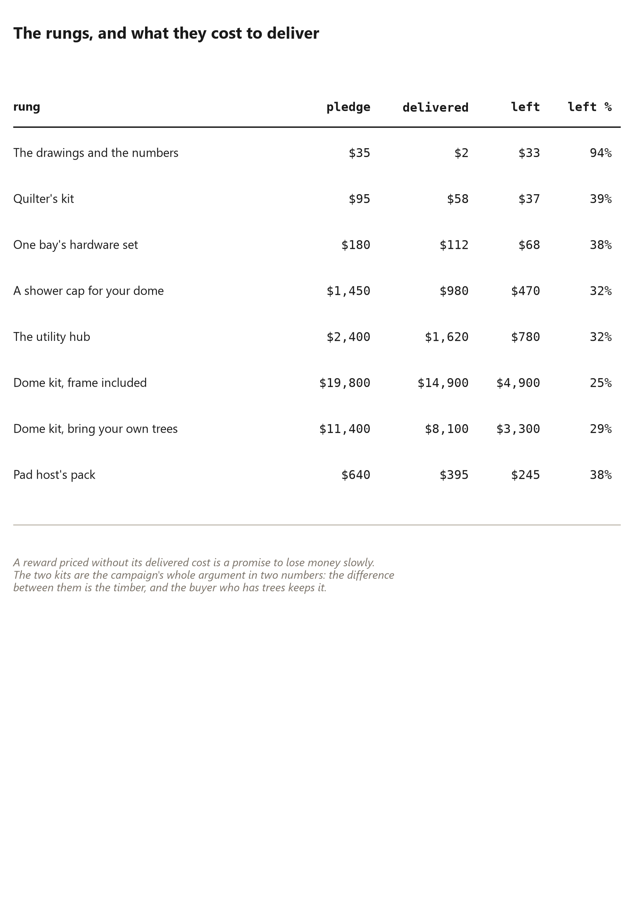

# 85. What the Campaign Is For

*The {{campaign.goal_usd}} list, the rungs on offer, and the promises the money is meant to keep*

A campaign document is the most honest thing a project produces, because it
has to name what it does not have. A finished building hides its gaps; a
budget cannot. The films put this list on screen — {{campaign.lines}} lines,
{{campaign.goal_usd}} — and every line is a thing that does not exist yet.

This chapter is that list, with the arithmetic around it. It is in the book
for two reasons. The first is completeness: the films state these numbers, so
a book that claims to be the master repository of what this project has said
has to carry them. The second is more useful to a reader who has no interest
in a campaign at all: a line-item budget is a map of where a project like
this is actually hard, and the map is instructive whether or not you ever
fund one.

## The goal, line by line

{{campaign.lines}} lines, adding to {{campaign.goal_usd}}. The largest single
line is {{campaign.biggest_usd}}, and it is worth pausing on what it buys:
{{campaign.biggest_what}}. Not software, not marketing, not salaries —
tooling. The largest thing this project needs money for is the ability to make
the same part again, correctly, a hundred times.

Read the list as a reader rather than a backer and it divides into four
honest kinds.

**The measurements.** {{campaign.test_usd}} buys a serviced pad and a
complete standard dome standing on it through a full winter, with the
instruments to log it. This project is almost entirely solved and almost
entirely unmeasured: the geometry is proved, the arithmetic closes, and
nobody has watched a real one go through a wet season with sensors on it.
That line is the project admitting it in public, and it is the single most
useful thing on the list.

**The machines.** A CNC router, a plasma table, a laser cutter, tooling to
mould a member with its hardware already in it, and the automation to feed,
index, cut and repeat. A dome is one hundred and twenty members, a hundred
and sixty threaded inserts and forty panels, and every one of them is the
same operation done many times. There is no version of this product that is
made by hand, and the list says so with prices rather than adjectives.

**The parts that carry people.** {{campaign.engineering_usd}} for an engineer
to rate the wind and snow loads, the mast, and any hoist that lifts a person.
This book has refused to rate those things on every page and pointed the
reader at a licensed engineer each time. Here is the cost of that refusal,
and putting it on the list means nobody has to wonder whether it was quietly
skipped.

**The people.** {{campaign.quilt_usd}} to seed the quilt network: machines,
shipping, and paying the first quilters for the first layers. The insulation
in this building is a waste stream and somebody's evening, which only works if
the network exists *before* the first dome needs quilting. That ordering is
the whole reason the line is in the goal rather than in the delivery budget.

And one line that is unusually candid: some thousands of dollars budgeted for
fulfilment at *cost* rather than at the reward price, because a campaign that
funds its tooling out of its shipping money delivers neither the tooling nor
the shipping.

## The line that buys a year of weather

Singled out, because it is the one line a sceptic should fund first.

{{campaign.test_usd}} buys a platform and a dome on it, and instrumentation in
the wall, logged for a year: temperature and humidity at each layer of the
cap stack, inside and out, recorded continuously. What that measurement
decides is the moisture question — the one thing in this method that is
argued rather than computed. The films have said, in public, that they will
publish the result whichever way it comes out. That promise is the reason to
trust the rest of the arithmetic, and it is also the reason the number is in
this book rather than only in a film.

A reader building their own version can do a small piece of this for almost
nothing: put a cheap logging thermometer under the cap and another inside the
room, and write down the days the two disagree. The project's own version
costs {{campaign.test_usd}} because it buys a building and a year, not because
the sensors are expensive.

## The rungs, and what they cost to deliver

{{campaign.tiers}} rungs, from {{campaign.cheapest_usd}} to
{{campaign.dearest_usd}}, and each one has a delivered cost printed beside
its price. That is unusual and it is deliberate: a reward priced without its
delivered cost is a promise to lose money slowly, and a backer deserves to
see the margin on what they are buying rather than read it later in a post
about a campaign that overran.

The rungs fall into three groups, and the middle one is the interesting one.

**The drawings and the numbers**, at {{campaign.cheapest_usd}}: every table in
this book, the cut list for any diameter, and the solver that made them. It is
a download, and the price is card fees and hosting. A reader who buys nothing
else can build the whole frame from this rung.

**The objects.** A quilter's kit. One bay's hardware set. The watertight cap,
made to the reference diameter, hemmed and grommeted — the only layer in the
building you cannot sew at home. The utility column, assembled and tested,
which is the part an owner cannot make and the part the goal exists to get
right. These rungs are the building sold as components, in the order a
self-builder actually needs them.

**The buildings.** The two kit rungs, and they are the campaign's whole
argument expressed as a price difference. {{campaign.kit_trees_usd}} buys
everything except the frame: you fell, split and cut your own members from
your own trees, which is the entire premise of this book, and the kit sends
the rest. {{campaign.kit_notrees_usd}} buys the same thing *with* the timber
included — the expensive version, honestly priced at
{{campaign.kit_gap_usd}} more. Nobody is pretending the difference is
anything other than the wood, and nobody is pretending the wood is the
cheapest way to get it.

The dearest rung is {{campaign.dearest_label}}, at
{{campaign.dearest_usd}} against a delivered cost of
{{campaign.dearest_cost_usd}}. Look at that pair: the most expensive thing on
offer is a building with somebody else's timber in it, which is precisely the
thing this method exists to avoid.

## Bring your own trees, priced

The two kit prices are worth one more paragraph, because the
{{campaign.kit_gap_usd}} between them is the book's thesis with a dollar sign
on it.

Everything in the product that is not the frame — the cap, the column, the
hardware sets, the panels, the fittings — is the same in both kits. The
difference is whether a pallet of graded, dried, dimensioned members arrives
at your site, or whether you walk into your own woodlot with a chainsaw and
make them. That is {{campaign.kit_gap_usd}}. Not a discount, not a subsidy: the
price of the timber plus the price of the work the factory would have done to
it.

A reader who has trees and a saw has just been told what their trees are
worth in this building, and it is the same number the value ladder in the
earlier chapters reaches from the other direction. A reader who has neither
has been told what the convenience costs. Both of those are useful, and
neither of them is hidden.

## The promises worth holding it to

Three promises are made in the campaign, and a reader should keep them where
they can be checked.

**Open source.** The geometry, the solver and the tables are published, which
is why this book can print every number and point at the code that made it.

**A model anybody can run.** Every figure in this book comes out of the same
programs, with the same commands, and the software chapter at the back lists
them. A reader does not have to take a number on faith: change the tree,
re-run the build, and the book's tables describe their tree. That promise is
the difference between a book and a brochure, and it is why this project's
corrections can be checked by strangers.

**Publish the measurement.** The winter of logged temperature and humidity
under the cap, whichever way it comes out. Of the three, this is the one that
costs the most credibility if it is broken, because everything else here is
arithmetic that anybody can re-run and this one is a fact that only the
project can produce.

A campaign that promises a number and then buries it has spent the only
credibility it had. That is the standard this chapter holds the project to,
and it is the standard a reader is entitled to hold this book to as well.

## What the earlier cuts asked for

There is an earlier version of this ask, and the book prints both because the
difference between them is instructive.

The first campaign montage asked for {{campaign.tooling_ask_usd}}, and it asked
for it in one sentence: tooling rather than salary, every dollar of it turning
back into machines. No line items, no delivered costs, no tiers — an argument
that a workshop is the thing standing between the design and the product.

The line-item goal in this chapter is {{campaign.goal_usd}}, which is
{{campaign.ask_gap_usd}} more than that first number. The extra is not
inflation and not scope creep in the ordinary sense. It is what happens when
you cost the same intention line by line and discover the parts the sentence
omitted: a year of weather on a standing dome, the instruments, the engineer's
signature, the quilters, and the shipping of what backers are owed. A single
figure states a need. A line-item list states a *plan*, and the second is
always larger, because the first was guessing.

Of the {{campaign.goal_usd}}, **{{campaign.equipment_usd}} is machines** —
{{campaign.equipment_pct}} per cent of the ask, and every line of it an object
that still exists on day three hundred: the router, the plasma table, the
laser, the tooling that moulds a member with its hardware already in it, and
the automation to feed, index, cut and repeat. That share is the honest answer
to what this project needs money *for*, and it is why the goal is described as
tooling rather than as funding a build.

## What it is up against, stated plainly

A campaign film is allowed to be cheerful. This book is not, and a chapter
about a product launch that did not describe the opponent would be a brochure.

**The opponent is not a competing dome.** It is a market that buys houses at
scale. Institutional capital buys single-family housing by the thousand, with
financing, appraisals, insurance and title work all designed around a
rectangular building on a permanent foundation. This project arrives with one
prototype, a chainsaw, a building that can be taken apart, and a set of costs
that are honest about being small. That is not a fair fight in either
direction, and the sensible response is not to pretend it is one.

**The arithmetic has already stopped working for somebody the reader knows.**
That is the argument the films make and the one this chapter will not
sentimentalise: there are people who will not buy a house, not from laziness
or bad decisions but because the numbers no longer close where they live. A
method that turns three trees and an autumn into a shell is an answer to that
specific problem — and it is an answer that a mortgage, a permit schedule and
an appraisal process can each refuse independently.

**The ask on a reader is small and specific.** Not to buy anything: to send it
to one person who can carry it further. One share from somebody with reach
does more than a month in a field with a chainsaw, which is the most honest
thing a small project can say about the difference between working and being
heard.

And the reason underneath all of it, which deserves a paragraph because it
predates every film and every number in this book. Buckminster Fuller wanted
housing cheap enough that a mother would not be so daily burdened by it that
she could not get on with raising her child. That is a domestic, unglamorous
reason to care about a structural system — and it is the reason this project
has measured everything it could rather than asserting what it could not. The
arithmetic is the respect the idea deserves, and printing the numbers that do
not help the argument is how a reader knows the rest were not chosen for
effect.
