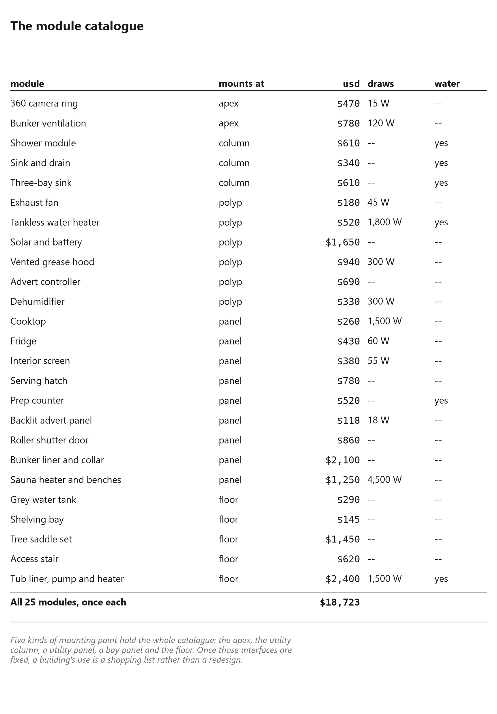
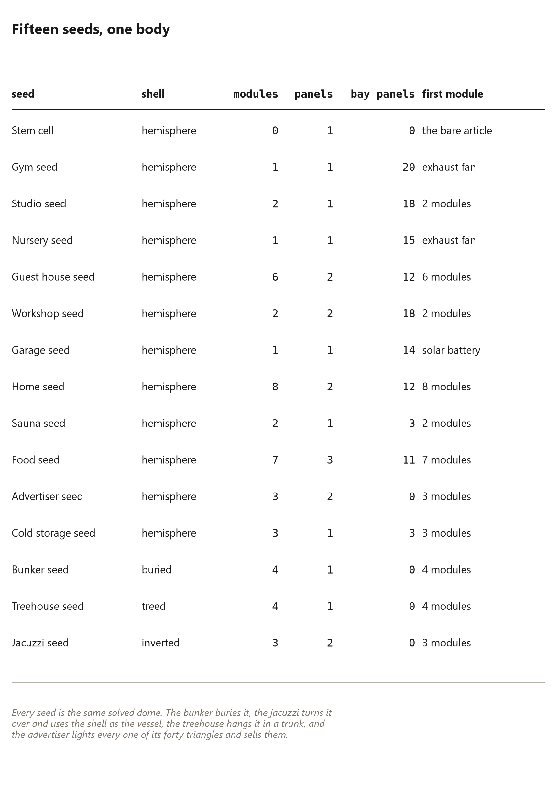

# 86. The Module Catalogue

*{{module.count}} snap-in modules, {{seed.count}} named seeds, and five places on a dome where anything can attach*

The frame is the product. Everything else is a module.

That sentence is the design position of this whole project, and this chapter
is what it looks like when it is finished: a catalogue of
{{module.count}} parts that snap onto the building, {{seed.count}} named
buildings assembled from them, and only {{module.mounts}} places on a dome
where anything can attach at all.

The reason it matters to a builder is not commerce. It is that every one of
these parts is a *decision deferred*. A reader who builds the frame in this
book does not have to know, on the day they bolt the tenth panel, whether the
building will end up a workshop, a sauna, a food stall or somebody's bedroom.
The frame takes all of them, and the difference is a shopping list. That is
what a kit of parts buys you, and it is why this chapter sits at the end of
the book rather than at the beginning: you have to believe in the frame first.

## Five kinds of mounting point

{{module.count}} modules mount at {{module.mounts}} places, and the short
list is the important part.

**The apex.** The top of the dome is a single point where every seam arrives,
which makes it the one place in the building where a hole is structurally
free: the ring around the crown is already carrying itself. The camera ring
looks out from here and the bunker's only above-ground object is a vent.

**The utility column.** The centre of the floor, where the services arrive.
Anything needing water, waste or significant power lands here, because this
is where the manifolds and the drain stack are — shower, sink, three-bay
sink, grey tank, the electrical sub-panel.

**A bay panel.** Forty triangles, forty places to put something flat. Windows,
insulated panels, a fridge, a cooktop, a lit advert, a roller shutter, a
sauna heater. The panel is the building's real estate and the catalogue
treats it that way.

**The floor.** Shelving, a stair, a tub, a tree saddle. Anything whose load
wants to go straight down rather than into the shell.

**A utility panel.** The framed insert the column carries — where the exhaust
fan, the tankless heater, the dehumidifier and the power wall live, because
they want outside air, a drain, or both.

That is the whole interface. Five places, and because they are fixed, the
catalogue can grow forever without the building changing.

## From {{module.cheapest_label}} to {{module.dearest_label}}

The catalogue runs from {{module.cheapest_usd}} to
{{module.dearest_usd}}, and buying every module once would cost
{{module.total_usd}} — which is more than the building, and exactly the
point. Nobody buys the catalogue. A building buys the two or three things it
is for, which is why the catalogue is priced per module rather than as
packages with names.

Three notes on reading the prices.

**They are delivered prices, not installed ones.** A module is a part; the
labour to fit it is your afternoon, counted in the hours chapter's terms
rather than in dollars here.

**The draw is part of the price.** The heaviest electrical load in the
catalogue is {{module.watts_dearest_label}}, at
{{module.watts_dearest}} watts, and a sauna or a tankless heater changes what
the electrical panel and the battery bank have to be. A cheap module that
needs a bigger system is not a cheap module.

**Water implies drain.** Every module that wants water also wants a drain,
and both arrive on the column. That is a design rule rather than a catalogue
rule: nothing in this building takes water anywhere that cannot also take it
away, which is the difference between a wet room and a rot problem.

## {{seed.count}} seeds, one body

{{seed.modules_total}} module slots across {{seed.count}} named seeds. A seed
is a complete shopping list on the standard frame: a name, a shape, the
modules it carries, and the panels it swaps for bay windows, skylights,
louvres and doors. The fullest is the {{seed.most_modules_label}}, at
{{seed.most_modules}} modules.

The list is worth reading as a measure of what one frame can be:

**Household.** The home seed: shower, sink, grey tank, cooktop, fridge,
tankless heater, camera ring, interior screen. A starter domicile, which is
what this book has been building towards since the first chapter. Guest house
for visitors; nursery for a room that attaches to a house and then becomes
something else when it is outgrown; studio and gym as outbuildings for the
things that do not fit indoors.

**Working.** Workshop, garage, cold storage. Light, air and power in a shell
where skylights do the work a strip light would, because on a dome the upper
ring *is* the roof. Food service — hatch, hood, three bays of sink and a
cold box — which is a food truck's fit-out in a building that never moves.

**Commercial.** The advertiser seed is the blunt one: forty lit advert panels,
one per triangle, controller included. Park it beside a road and the shell is
the product. Every one of the forty triangles faces somewhere, and the
catalogue is honest about what that is worth.

**The strange ones**, which are where the argument gets interesting. The
{{seed.buried}} buries the dome and leaves one riser above grade: the same
frame, the same port, the shell now doing what a basement does. The treehouse
hangs it in a trunk on a saddle. The jacuzzi turns the dome over and uses the
shell as the vessel and the frame as its cradle. In each case the interface
did the work and the building did not change — which is the payoff for having
fixed the interfaces in the first place.

## What the catalogue admits

The bare standard article is the stem cell: frame, floor, shell, column,
seal cap, and one blank utility panel. Everything a reader recognises as a
building — a kitchen, a bedroom, a workshop, a shop — is an add-on, and the
catalogue says so in its own prices.

That is an unusual thing for a product catalogue to admit, and it is worth
naming why the book prints it. A building whose use is a module is a building
that can change its mind. The chapter on the round room said the same thing
from the inside: headroom and floor area decide what furniture fits, and
furniture is what a room is *for*. The catalogue is that idea, priced: the
frame is the permanent decision, and almost everything else is reversible.

Which brings the book back to where it started. Three trees, forty panels,
one hundred and twenty members, forty hours or less — and then a lifetime of
shopping lists, in the best sense: a building you can keep changing without
ever taking apart the part that was hard to make.
