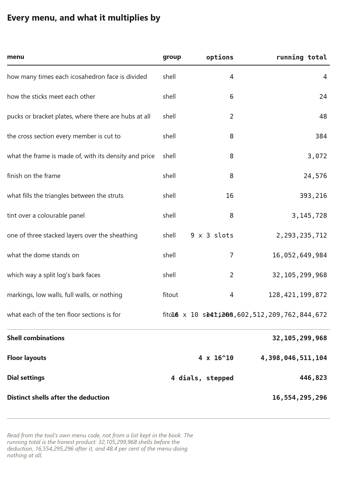

# 87. Sixteen Billion Shells

*Every building the menus can make, counted from the menus themselves — and the honest deduction that half of them are the same building*

The Dome Creator offers {{space.menus}} menus and {{space.dials}} dials.
Multiply them honestly and the thing you have is not a catalogue at all: it is
a space so large that "which one should I build" stops being a search and
becomes an argument.

This chapter counts that space, off the tool's own menu code rather than off a
list kept in a book — the same discipline as every table in the book: read the
code, print what it says, and let a reader run it. And then it does the part
that almost nobody does, which is the deduction: a great many of those
combinations are the same building twice, and the honest count is smaller than
the impressive one. Both numbers are printed here, which is the point.

## The menus, and how many options each one has

{{space.shell_menus}} menus change the building you look at, and
{{space.fitout_menus}} change what the floor is for. Between them they carry
{{space.options}} options.

The shell menus are the ones this book has spent its length on, and the list
is worth reading as an inventory of everything a reader has already decided by
the time they open the tool:

* **Frequency**, {{space.frequencies}} options — how many times each
  icosahedron face is divided. This is the one that changes the part count,
  and it is the only menu that does.
* **Frame style**, {{space.frames}} ways the sticks can meet, from hub and
  strut through hubless doubled to poured concrete formwork.
* **Hub style**, {{space.hubs}} — and note that this one does nothing at all
  on a frame that has no hubs, which is where the deduction starts.
* **Strut shape**, {{space.sections_shapes}} cross-sections; **frame
  material**, {{space.materials}} materials; **frame colour**, a finish that
  changes nothing structural.
* **Panel type**, {{space.panels}} types, from open to precast concrete;
  **panel colour**; and the **cladding layer**, which is not one choice but
  {{space.layers}} stacked slots.
* **Foundation**, {{space.foundations}} kinds, from bare ground to a treehouse
  platform.
* **Wedge curve**, two ways round — the rotation this book gave a whole
  chapter to, reduced here to a single switch that changes which face the
  weather lands on.

And the two fit-out menus: **partitions**, and the **room type** assigned to
each of the {{space.floor_sections}} floor sections — which is where the
four-trillion number comes from, because ten sections each taking
{{space.rooms}} values multiply out very fast.

## Multiply it honestly

The shell space is {{space.shell_permutations}} combinations. Not a typo, not
a rounding: multiply every shell menu out, counting the cladding as the
{{space.layers}} stacked slots it actually is, and that is the number.

On top of the shell, the floor layout gives
{{space.fitout_permutations}} arrangements. And the dials — radius, strut
width, recess depth and foundation size — are continuous in principle and
countable in practice, because the tool moves them in fixed steps:
{{space.dial_settings}} settings between them. That the tool quantises its own
sliders is what makes this chapter possible: a continuum cannot be counted,
and a tool that steps its dials has already turned the continuum into a list.

Three numbers, then, and they multiply:

    {{space.shell_permutations}}  shell combinations
    x {{space.fitout_permutations}}  floor layouts
    x {{space.dial_settings}}  dial settings

Which is a number too large to be useful, and that is the honest conclusion of
this section rather than a failure of it. A space that size does not need a
catalogue. It needs a *decision procedure*, and the rest of this book is one:
choose the frequency that fits your trees, the material your land gives you,
the foundation your ground will take, and let the arithmetic of the previous
chapters fix everything else. The tool exists to show you what you chose, not
to choose for you.

## The deduction that matters

Now the part that most product catalogues would leave out.

A large fraction of those combinations change nothing you can see. A hub style
on a frame that has no hubs. A strut cross-section under a different material
that overrides it anyway. A panel colour on a panel that is defined as open.
The tool's own arithmetic notices, counts the combinations that are genuinely
a different building, and gets {{space.distinct_shells}}.

That is {{space.inert_pct}} per cent of the shell menu doing nothing at all —
very nearly half. It is not a bug and it is not a scandal; it is what happens
when you offer a colour for a thing that has no surface, and the honest
response is to count it, print it, and let the reader see which menus are
decoration. A catalogue that quietly reported the bigger number would be
selling browsing rather than building.

Two lessons for a reader who is actually building something:

**Count the decisions, not the options.** Four menus matter to this book's
frame — frequency, material, section, foundation — and every other menu is a
finish or a fit-out. That is why the earlier chapters spent their length on
those four and treated colour as a paragraph.

**A menu can lie about its own size.** {{space.panels}} panel types sounds
like sixteen buildings. It is one building and sixteen surfaces, and the
chapter on skins said so in its own terms: the shape is fixed, the skin is
chosen.

## Why the book does not describe sixteen billion buildings

At {{space.seconds}} seconds each, showing every distinct shell would take
{{space.years}} years of film.

That number is worth sitting with, because this project has made films — a
great many of them, over a long time — and the honest total of what has been
shown on screen is a rounding error against it. Which is exactly why the films
are organised the way they are: not a walkthrough of a catalogue, but a
handful of decisions, each demonstrated once, so that a viewer can rebuild any
of the {{space.distinct_shells}} themselves from a small number of rules.

Three points for a reader deciding what to build:

1. **A space this large is an argument against shopping and for deciding.**
   Nobody can browse sixteen billion options. Everybody can answer four
   questions about their own land.
2. **The menus that cost nothing are the ones to change your mind about.**
   Frame colour, panel colour and the wedge curve cost nothing and can be
   reconsidered on the day; the material, the section and the foundation
   cannot.
3. **The three expensive menus are the ones this book already chose.** The
   earlier chapters did the collapsing — one frequency, one section, one
   foundation, one frame whose parts list does not grow with the floor — and
   this chapter is the arithmetic that shows why that was a kindness rather
   than a limitation.

## What the count is for

Not to impress anybody with a number. The purpose of counting the space is to
show *where the decisions are*, which is the one thing a catalogue can never
do.

A reader who knows there are {{space.panels}} panel types and exactly one
geometry can stop looking for a better shape and start choosing a skin. A
reader who knows the hub style is inert on a hubless frame stops agonising
over hubs. A reader who knows that half the menu is decoration stops treating
the tool as an authority and starts treating it as a calculator — which is
what it is, and what this book has been all along.

The dome this book builds is one shell out of {{space.distinct_shells}}. It is
not the only good one. It is the one that three trees and a small chainsaw can
make, and being able to say that — as an arithmetic result rather than a
preference — is the whole reason there is a count at all.
