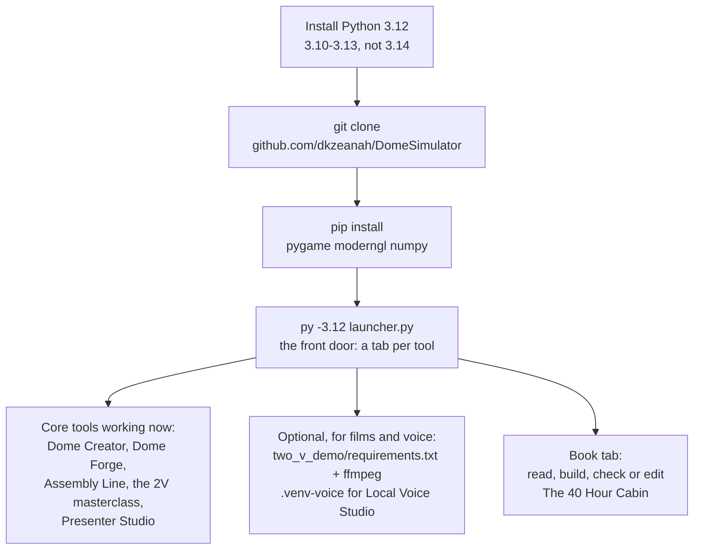
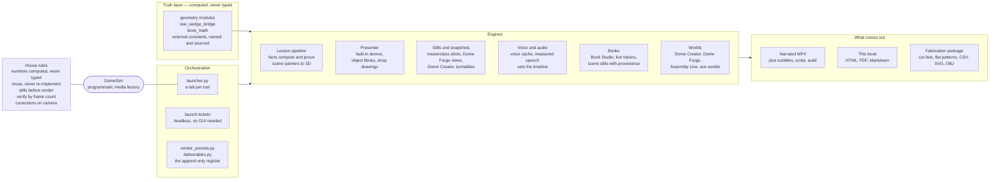
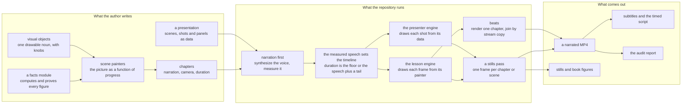
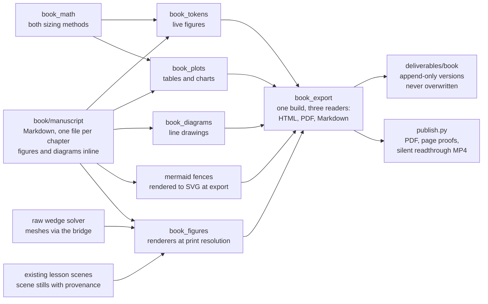
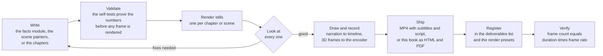

# The Software in This Book

## What generated these numbers

Every figure in this book comes from one of the programs below, and each
program is included with the book. They are named here so a reader can
find the exact line behind any number printed in these pages.

**`geodesic_raw_wedge_dome_dihedral.py`** -- the live solver and 3-D world.
This is the heart of the project: it solves the raw-wedge dome, its seams,
its dihedral angles and its jig, and it is where the standing dome's own
mesh lives. The book's figures of the frame are this program's mesh, not a
sketch of it.

**`two_v_demo/book_math.py`** -- the book's arithmetic. The two sizing
methods, the tree model, the fortnight, the round trip and the declared
constants. Where a chapter works a number through by hand, this module is
the hand.

**`two_v_demo/wedge_geometry.py`** -- the tree and pinwheel arithmetic the
book and the films share: member classes, splits, yield, recovery.

**`two_v_demo/book_tokens.py`** -- the {{book.chapters}}-chapter book's
living figures. Every figure a sentence quotes -- a token in double braces
-- resolves here, from the modules above, at export time.

**`two_v_demo/book.py`** -- the outline: the parts, the chapters, the pages
and where each figure sits.

**`two_v_demo/book_plots.py`** and **`two_v_demo/book_diagrams.py`** -- the
charts and tables, and the line drawings. Both draw from the same geometry,
never from a number typed beside the drawing.

**`two_v_demo/book_figures.py`** -- the renderers, and the rule that a
re-rendered figure gets a new name rather than replacing the old one.

**`two_v_demo/book_manuscript.py`** and **`two_v_demo/book_export.py`** --
the manuscript itself, and the readable forms: this HTML, the PDF, and the
Markdown source. The diagrams on this page are drawn by that exporter.

**`two_v_demo/book_app.py`** -- Book Studio, the desk the book is written
at, including the reader built into it.

Nothing in this list restates a figure another module already derives, and
nothing draws a dome that the solver has not solved. That is what "the
numbers are computed, not typed" means in practice: every one of them
traces to a function in one of these files.

## How to get it, and start it

The project is a repository, and this is the whole install path, from
nothing:

```text
# 1. Python 3.10-3.13 (not 3.14 -- pygame and moderngl have no wheels yet)
#    https://www.python.org/downloads/

# 2. the code
git clone https://github.com/dkzeanah/DomeSimulator.git
cd DomeSimulator

# 3. the three libraries the core tools need, and the front door
py -3.12 -m pip install pygame moderngl numpy
py -3.12 launcher.py
```

That is enough to open every tool in the project, including this book:
`launcher.py` is a window with a tab per tool and no command-line flags to
remember. Two optional extras turn on the parts of the project that make
films and narration:

```text
# video export (the films, the narration, the MP4s)
py -3.12 -m pip install -r two_v_demo/requirements.txt
winget install ffmpeg        # or brew/apt install ffmpeg
```

```text
# local voice cloning and transcription (heavier AI packages, Python 3.11)
py -3.11 -m venv .venv-voice
.\.venv-voice\Scripts\python.exe -m pip install -r .\local_voice_studio\requirements-core.txt
```

The full setup guide, including what each optional tool needs and what it
reports when something is missing, is `SETUP.md` beside the code.



## The map of the code

One picture of the whole factory, because the project is larger than the
book and the book is one of its products. Read it left to right: the truth
layer at the bottom is what everything computes from, the middle is the
engines that make things, and the right is what comes out.



The house rules in that diagram are not decoration: they are the checks
that run before a render or an export, and the reason a figure in this book
can be traced back to a line of code. The truth layer is the same geometry
the films draw, which is why the book and the films cannot disagree about
the dome.

## The video and presenter pipelines

The factory makes two kinds of film, and the two engines are worth knowing
before anything else on this page, because every rule below is the same
rule twice: **a film is data plus painters, and nothing else.**



**Lesson films** (`two_v_demo/`) bind copy to painters. A `Lesson` carries
no logic at all: it holds chapters, a dictionary of scene painters, a
selftest and a report. A chapter carries its spoken narration, its fixed
equation lines, a duration *floor*, a camera and the name of the painter
that draws it. The painter is a pure function of progress --
`def scene(app, opaque, transparent, p)` with `p` running 0 to 1 across the
chapter -- so the same frame is drawn at the same `p` on every machine, and
a film can be re-rendered from its own source years later.

**Presenter films** (`presenter/`) are even more data: a `Presentation`
holds scenes, a scene holds shots, and a shot holds a camera, a lens, a
focus target, narration, a caption and an overlay panel. Animation is
interpolation of one named parameter, and the camera follows any moving
focus target for free. Both engines take their timing the same way --
narration is synthesized and measured **first**, and the chapter or shot
duration is the larger of its floor and the measured speech plus a tail --
which is why a voice change is a timing change, and why the house voice is
stated in the presets rather than left to whatever the tab was showing.

**The bridges between them** are three, and they are what make the two
engines one factory:

* **Visual objects** (`two_v_demo/visual_objects.py`) are the elements
  either engine can draw by name. Written once, they are available to the
  lessons as `draw(stage, "key", ...)` and to the presenter as
  `vo:<key>` -- see the next section.
* **Dome Forge layers** are available to the presenter as
  `forge:<layer>`, so a film about a water-harvesting dome shows the
  modelled dome rather than a picture of one.
* **The raw-wedge solver** reaches the lessons through
  `two_v_demo/raw_wedge_bridge.py`, which converts the solver's own meshes
  into lesson geometry. This is the bridge behind the rule at the top of
  this book: a film that talks about the wedge dome shows the simulator's
  dome.

Long films are cut into **beats** (`two_v_demo/beats.py`): a chapter, or a
claim and the math screen that proves it, rendered as its own file and
joined by stream copy. A beat that is already on disk is skipped, so
fixing one chapter costs one beat re-render instead of a whole film, and
`verify_renders.py` is the check that says whether what came out of the
encoder is the film the timeline promised.

## Adding to the pipeline

Four kinds of addition, and the same four-step shape every time: *write the
thing, register it, check it with a still, then render it.* The table is
the whole answer to "which files do I touch":

| you want to | you create | you alter | the check that proves it |
|---|---|---|---|
| **a new element** (a noun the renderer can draw) | `two_v_demo/visuals_<group>.py` | nothing, unless a film should use it | `validate_visual_objects()` then a still |
| **a new scene and chapter** in a film | -- | `two_v_demo/lesson_<key>.py` (`SCENES` + chapters) | the lesson's own `selftest`, then a still per chapter |
| **a whole new film** | `two_v_demo/lesson_<key>.py` and `<key>_facts.py` (make them with `scaffold_lesson.py`) | `two_v_demo/lesson_registry.py`, `render_presets.py`, `two_v_demo/deliverables.py` | `validate_render_presets()` then `verify_renders.py` on the MP4 |
| **a presenter object or demo** | `presentations/<name>.py`, or an object in `presenter/library.py` | `presenter/library.py` for the catalogue | `PresenterApp(..., headless=True).screenshot(...)` |

### 1. A new element the renderer can draw

This is the addition most people mean by "a new element", and it is the
best-supported one: write the noun once, and both pipelines can use it.

**Where it goes.** `two_v_demo/visual_objects.py` holds the contract and
the registry. The objects themselves live in their own modules beside it --
`two_v_demo/visuals_forest.py` is the worked example, holding the pine, the
bucked log and the figures that go with them -- and each module registers
its objects on import, so nothing else needs editing. `registry()` imports
the known groups and returns everything.

**The contract**, in the code's own words:

```python
VisualObject(
    key="log_sections",                    # the name a film draws by
    label="Log, bucked and split",         # the name a person reads
    category="wood",                       # must be a taxonomy key
    blurb="The usable trunk on the ground, cut into the plan's "
          "sections and every section split into the plan's sectors...",
    knobs=(...),                           # the dials, with ranges
    draw=_draw_log_sections,               # drawer(stage, knobs) -> anchors
    source="new",                          # or the dotted path it wraps
    reach=18.0,                            # how far it extends, for cameras
    words=("tree", "log", "section", "sector", "split"),
)

register(VisualObject(...))                # refuses a duplicate key
```

A **knob** is one dial, declared with its range so it can never be set to
something undrawable:

```python
_k("fell", "Felled", 1.0, 0.0, 1.0, "x", "0 standing, 1 on the ground",
   animate=True)
```

The drawer's signature is `draw(stage, knobs) -> anchors`: it builds
triangles on the stage and returns named points -- an anchor called
`top`, say -- which the caller can aim a camera at or hang a label on. A
knob marked `animate=True` is one the caller may sweep across a chapter,
which is how an element performs rather than just appears. `category` must
be one of the taxonomy's keys, because the catalogue sorts the nouns by it:
`structure, members, wood, envelope, base, geometry, math, measure, tools,
processes, forces, money, buildings, land, services, materials, people,
body, time, media, computing, ideas, quantities, story, names`.

**What to draw with.** Inside the drawer the vocabulary is the engine's own:
`TriangleBatch` primitives from `two_v_demo/render_kit.py` (`cylinder` --
where `cylinder(a, b, r, colour, 3)` is a wedge and `4` is square,
`box`, `sphere`, `triangle`, `cone`, `arrow`, `disc`), procedural wood from
`two_v_demo/timber.py` (`draw_timber`, `wood_colour`, `draw_glue`,
`draw_patch`), pictograms from `two_v_demo/icons.py` (`draw_icon`), and the
easing helpers in `render_kit` (`clamp`, `smoothstep`, `ease_in_out`) so
movement in a frame has the same feel as movement in every other film.
Figures that must be *spoken* rather than drawn belong in the chapter's
callouts, not in the element: `two_v_demo/callouts.py` times them to the
measured voice.

**How a film calls it.** Two lines, in the scene painter:

```python
def scene_hv_fell(app, opaque, transparent, p: float) -> None:
    stage = stage_for(app, opaque, transparent, origin=ORIGIN)
    anchors = draw(stage, "pine_tree", fell=p, units_per_ft=UPF)
```

`stage_for` puts the element in the world at an origin; `draw` resolves the
knobs -- defaults, overridden by what you gave, clamped to what is
drawable, and a misspelt knob is a hard error rather than a silent nothing
-- and returns the anchors.

**It reaches the presenter for free.** `presenter_emitters()` wraps every
registered object as `vo:<key>` with five placement knobs (across, along,
up, heading, size), and `presenter_object_specs()` lists the same objects
in the presenter library's own terms. So a new element is usable in a
presenter shot the moment it exists, under a prefixed name that cannot
collide with the presenter's own objects.

**The check.** One command, then one still:

```text
py -3.12 -c "from two_v_demo.visual_objects import validate_visual_objects; validate_visual_objects()"
```

which draws every object at its defaults and at both ends of every knob --
a cheap way to find the element that collapses at its own limit, before a
render finds it for you.

### 2. A new scene, and the chapter that shows it

A scene is a painter; a chapter is the copy, the camera and the clock. In
the lesson module you are changing, three edits, in this order:

**Write the painter.** It takes the app, two triangle batches (opaque and
transparent) and `p`, and it must be a pure function of `p` -- no clocks,
no randomness that is not seeded, no state kept between frames. Draw into
the batches; put text on screen with the engine's label list; return
nothing.

**Register it in the lesson's `SCENES` dictionary** under the name the
chapter will use:

```python
SCENES = {
    "wg_open": scene_wg_open,
    "wg_split": scene_wg_split,
    ...
}
```

**Add the chapter**, giving it that scene name, its narration, its camera
and its duration floor:

```python
Chapter(
    "split", "07", "Split like a cake",
    "Three passes and the stick is already the right shape",
    ("Spoken narration line one.",
     "Spoken narration line two."),
    ("fixed equation line",),          # only when the stage is a math screen
    12.0,                              # duration FLOOR, not a promise
    (34.0, 24.0, 16.0),                # camera: yaw, pitch, distance
    "wg_split",                        # the SCENES key that paints it
    None,                              # or "math" for a derivation screen
    callouts=(...),                    # figures cued to the measured voice
)
```

Two things are worth stating because they are the whole reason this
pipeline is reproducible. The duration is a **floor**: the real length is
the measured speech plus a tail, so a chapter never races its own narrator.
And every figure the chapter shows should come out of the lesson's **facts
module** rather than the painter, because that module is what the selftest
proves -- which is why the generated pair from `scaffold_lesson.py` is a
facts module *and* a lesson module, never just a lesson.

Look at a still before you render. A staging bug -- a camera pointing at the
back of an element, a label under the horizon -- is invisible in code and
obvious in one frame. The headless way, with no window open:

```text
py -3.12 -c "import launcher_common as lc; lc.write_config('two_v_masterclass', {'action':'shots','lesson':'wedge','shots':'8,24,40','no_narration':True})"
py -3.12 two_v_masterclass.py
```

which writes `two_v_demo_output/<lesson>/<prefix>_<seconds>s.png` for each
second you asked for.

### 3. A whole new film

Start with the generator, because the boilerplate it writes is boilerplate
that already passes:

```text
py -3.12 scaffold_lesson.py trusses "Truss Masterclass"
```

That writes a facts module and a lesson module that render, prove
themselves and pass a selftest, laid out along the right axis because this
renderer's cameras sit on +Y. The first real work is deleting the
placeholder facts and putting real ones in -- which is the point.

Then register it in **three** places, because a film is a lesson, a preset
and a deliverable, and the project refuses to let them disagree:

| file | what you add |
|---|---|
| `two_v_demo/lesson_registry.py` | an import, and the lesson in the `LESSONS` tuple -- this is what makes it launchable by key |
| `render_presets.py` | a preset built with the `_video(key, lesson, filename, summary)` helper, so the exact settings that produced the film are one click away |
| `two_v_demo/deliverables.py` | a `Deliverable(lesson, filename, note, compose=True)` -- the rendered output and the lesson that reproduces it |

`validate_render_presets()` is the gate, and its last assertion is the one
that keeps the three in step: *deliverables with no render preset* is a
failure, not a warning. The check runs both ways, which is the part people
miss -- `validate_deliverables()` also refuses a lesson that has been
registered and never given a deliverable, so a new film cannot be
half-registered and still pass a selftest. The preset's summary must be a
real sentence -- there is a length assertion on it, because a preset nobody
can read is a preset nobody will use.

Then render, headless, and check what came out:

```text
py -3.12 -c "import launcher_common as lc; lc.write_config('two_v_masterclass', {'action':'selftest','lesson':'trusses'})"
py -3.12 two_v_masterclass.py

py -3.12 -c "import launcher_common as lc; lc.write_config('two_v_masterclass', {'action':'export_video','lesson':'trusses','export_video':'deliverables/masterclass/truss-masterclass.mp4','orientation':'both'})"
py -3.12 two_v_masterclass.py

py -3.12 verify_renders.py deliverables/masterclass/truss-masterclass.mp4
```

`verify_renders.py` fails when the video and audio disagree by two seconds
or more, when the frame count is under about 29 frames a second, or when
the duration is zero. That is the house check -- a film is not finished
because the encoder exited cleanly, it is finished because the frame count
agrees with the timeline. The export also writes the `.srt`, the timed
script and the release folder (landscape cut, phone cut, thumbnails and
platform copy), because one render is a release rather than a file.

### 4. Adding to the presenter instead

The presenter is the faster path when the film is about *showing* rather
than *deriving*: its objects are already placed and lit, and its shots are
data.

**A new object** is an `ObjectSpec` in `presenter/library.py` -- a key, a
label, a category, a blurb and a tuple of `ParamSpec`s (the same parameter
description Dome Forge uses, imported from `dome_forge.layers`, so one
vocabulary serves both). Before writing one, check the bridge: if the
element exists in `two_v_demo/visual_objects.py`, the presenter already has
it as `vo:<key>`, and you do not need to write anything.

**A new demo** is a module in `presentations/` -- `dome_accessibility.py`
and its neighbours are the thirteen worked examples -- built out of
`Presentation`, `Scene`, `Shot` and `OverlayPanel` from
`presenter/script.py`. Keep the numbers in `presentations/_numbers.py`,
which computes them once from `al_build` and `two_v_demo.geometry`, so a
presenter film and a lesson film quote the same arithmetic.

**The check** is a screenshot, not a render:

```text
py -3.12 -c "import launcher_common as lc; lc.write_config('presenter', {'action':'shots','demo':'dome_accessibility','shots':'4,20,38'})"
py -3.12 presenter_studio.py
```

or, programmatically, `presenter.engine.PresenterApp(presentation, headless=True)`
and then `.render(t, present=False)` followed by `.screenshot(path)` -- a
frame for the price of a frame, which is what you want while placing an
object. When the film is ready, the same class exports it:

```text
py -3.12 -c "import launcher_common as lc; lc.write_config('presenter', {'action':'export','demo':'dome_accessibility','export':'deliverables/presenter/accessibility.mp4'})"
py -3.12 presenter_studio.py
```

`PresenterApp.export(path, fps=None, narration=True, ffmpeg=None,
overlay=None)` is the whole film export: narration measured first, frames
rendered deterministically, audio muxed by stream copy. The `overlay`
option is the presenter's version of the lesson styles -- `full`,
`no_captions`, `titles_only` or `clean`.

The
studio itself (`presenter/studio.py`) is a real editing suite -- library,
viewport, timeline, inspector -- over the same pure-functional edit API, and
it saves and reopens a film as JSON, so a presentation can be drafted by a
tool and finished by hand.

### Adding an element to a world instead

The visual-object route is the right one for an element a *film* needs. An
element that only makes sense inside a world -- a forge layer, a jig
stage, an assembly-line station, a piece of furniture -- is added where
that world keeps its registry, and the world's own viewer is how you look
at it. The table is the whole map:

| world | the element | where it is declared | what else changes |
|---|---|---|---|
| Dome Forge | a **layer** (anything from the frame to the rain) | `emit_<kind>(...)` in `dome_forge/build.py`, then the `EMITTERS` dictionary | a `LayerKind` with its `ParamSpec`s in `dome_forge/layers.py` -- and it then appears in the presenter as `forge:<key>` automatically |
| Dome Forge | a **jig stage** | `STAGE_ORDER` in `dome_forge/jigs.py` | the drawing inside `emit_jig`, gated on the stage's position in that order |
| Dome Forge | a **camera view** for the stills pass | the views list in `dome_forge/cli.py` | nothing |
| Assembly Line | a **station** | a `StageDef` in `_STAGE_LIST` (`al_build.py`) | a key in `HOME_STAGE_KEYS`, an entry in `CATEGORY_ECON` and `CATEGORY_LABEL`, and an `_emit_<stage>` called from `build_dome_catalog` |
| Assembly Line | a **part** | `cat.begin("<category>")` / `cat.end("<stage>")` inside the relevant `_emit_*` (`al_build.py`) | the `CATEGORY_ECON` triple -- material cost, labour minutes, weight per element |
| Dome Composer | a **prop or piece of furniture** | `dome_interiors.py`: a `_prop(...)` plus its builder in the `BUILDERS` table | a placement rule only if it needs one |
| Dome Composer | a **placement rule** | a branch in `check(...)` and its constant, in `two_v_demo/scene_composer.py` | an assertion in `validate_scene_composer()` so the rule is proved |
| Dome Creator | a **preset building** | `(name, config_dict)` appended to `PRESETS` in `presets.py` | nothing -- it registers itself in the menus |
| Dome Creator | a **model option** | a field on `DomeConfig` in `dome_model.py` | its `to_dict`/`from_dict`, the menu entry, and `build_dome_mesh` if it changes geometry |

Two of those rows are worth the extra sentence. An Assembly Line part is
declared between `begin` and `end`, and `end` sizes its cost, labour and
weight from the category's per-element figures unless you override them --
which is why the parts catalogue and the economics cannot drift apart. And
a Dome Forge layer is the cheapest way to get a real, modelled *thing* into
a presenter film: write the layer once and it is both an option in the
forge's own viewer and an object in every presenter shot.

### The other worlds, and their stills

The remaining three worlds are where an element is checked in three
dimensions before it ever appears in a film, and each answers the same
ticket:

```text
py -3.12 -c "import launcher_common as lc; lc.write_config('dome_forge', {'action':'shots'})"
py -3.12 dome_forge.py

py -3.12 -c "import launcher_common as lc; lc.write_config('assembly_line', {'action':'shots','shots':'74,97','shot_speed':6})"
py -3.12 assembly_line.py

py -3.12 -c "import launcher_common as lc; lc.write_config('dome_composer', {'action':'shots'})"
py -3.12 dome_composer.py
```

Dome Forge writes exterior, cutaway, top and ground views to
`dome_forge_shots/`; the Assembly Line writes `shots/shot_<t>s.png`; the
Composer writes a four-frame turntable of the scene as PNGs. A fifth
world, the Dome Creator, has no stills action on purpose -- its check is
the smoke test (`DOME_SMOKE` for a frame count, `DOME_SHOT_DIR` to ask for
screenshots along the way), because the thing being checked there is the
world itself rather than a frame of it. That smoke test still opens a real
graphics context, so it is a check to run while watching, not a background
job.

Every ticket above lands in `.launcher_configs/` and is read, then
archived, when the tool starts: the tool is launched with no arguments,
which is also how the launcher itself launches it. The archive is the point
-- the exact input a run used stays readable in
`.launcher_configs/used/`, so a film can be reproduced from what was
actually asked for rather than from what somebody remembers asking for.
The last check of all is the repository's own: `LAUNCHER_SMOKETEST=1 py
-3.12 launcher.py` builds every tab, every launch button and every render
preset without opening a window, and it is an environment variable rather
than a flag.

### The commands, in order

A new element, from nothing to used in a film, in the order the project
expects:

```text
# 1. write the object and register it, then prove every knob draws
py -3.12 -c "from two_v_demo.visual_objects import validate_visual_objects; validate_visual_objects()"

# 2. put it in a scene painter, then look at a still before rendering anything
py -3.12 -c "import launcher_common as lc; lc.write_config('two_v_masterclass', {'action':'shots','lesson':'wedge','shots':'8','no_narration':True})"
py -3.12 two_v_masterclass.py

# 3. run the lesson's selftest: the numbers before the pixels
py -3.12 -c "import launcher_common as lc; lc.write_config('two_v_masterclass', {'action':'selftest','lesson':'wedge'})"
py -3.12 two_v_masterclass.py

# 4. render, then verify by frame count
py -3.12 -c "import launcher_common as lc; lc.write_config('two_v_masterclass', {'action':'export_video','lesson':'wedge','export_video':'deliverables/masterclass/wedge-v2.mp4','orientation':'both'})"
py -3.12 two_v_masterclass.py
py -3.12 verify_renders.py deliverables/masterclass/wedge-v2.mp4

# 5. register the film so it stays reproducible, and run the repository's own gate
py -3.12 -c "import render_presets as rp; rp.validate_render_presets()"
LAUNCHER_SMOKETEST=1 py -3.12 launcher.py
```

### The rules a new element has to obey

Four, and they are the book's rules applied to code:

**Its numbers are computed, or declared.** An element that shows a figure
takes it from a facts module; if the figure cannot be derived, it is a
declared constant with a stated reason. No number is ever typed into a
painter, a caption or a knob's default.

**It reuses the geometry.** An element that depicts the dome asks
`raw_wedge_bridge` for the solver's own mesh. An element that depicts wood
uses `timber.py`. A second drawing of the same thing is a second version of
the truth.

**It is proved before it is rendered.** `validate_visual_objects` for an
element, the lesson's `selftest` for a chapter, `verify_renders.py` for a
film. The order matters: the cheapest check that can fail is the one to run
first.

**It never overwrites.** A re-render writes `-v2`. An element that changes
what a published film looks like is a new film, not a quieter edit of the
old one -- which is the same rule the book keeps about its own chapters.

## The chain that made this book

This book is one of the factory's outputs, and its own chain is worth
drawing because it is the shortest way to see how the "no number is typed"
rule is enforced:



Read the arrows into `book_export` as the gate: that is where the tokens are
resolved, the figures are found, and the book either builds or fails. A
token that does not resolve is a hard error, not a blank, which is the
reason a typo in a sentence cannot reach a reader.

## The loop an agent runs

The project is written so that a person or an agent does the same thing,
in the same order, and can check every step:



The loop is the method this book teaches, applied to software: measure,
build, look at the result, and write down what went wrong. The render
presets and the deliverables register exist so that the last two boxes are
not optional — an unregistered or unverified artifact does not pass as
finished in this repository.

## Reproducing every figure in this book

The whole book rebuilds from these commands, run from the project's folder
with Python 3.12:

```text
py -3.12 -c "from two_v_demo.book import validate_everything; validate_everything()"
```

checks the arithmetic, the outline, every token, every figure and the
manuscript machinery, and reports what passed. It is the gate the book
must pass before it is exported.

```text
py -3.12 launcher.py
```

opens the project's launcher. Its **Book** tab carries the
actions: `read_html` and `read_pdf` build the book you are reading;
`export` writes the Markdown source; `audit` prints every number the book
states and the calculation behind it; `progress` shows what is written;
`render_figures` redraws every illustration. Each build writes a new,
versioned file -- nothing in this project is ever overwritten by a
rebuild, so the copy you have and the copy a build makes cannot be the
same file by accident.

The 3-D figures are rendered by the solver's own renderers; the film-still
figures come from the project's films through the launcher's Masterclass
tab; the diagrams on this page are drawn from the manuscript's own mermaid
source at export time, by the mermaid CLI the repository already carries.
The photographs that remain are the author's to take;
until then the book simply leaves their pages out.

## The ten commands worth knowing

Everything in the factory is reachable from the launcher, and everything
the launcher does is reachable without it. These are the commands a person
or an agent actually types:

```text
# the front door, and a new lesson to hang a film on (key, title)
py -3.12 launcher.py
py -3.12 scaffold_lesson.py trusses "Truss Masterclass"

# headless: any launcher action, as a ticket, with no GUI open
py -3.12 -c "import launcher_common as lc; lc.write_config('two_v_masterclass', {'action':'selftest','lesson':'wedge'})"
py -3.12 -c "import launcher_common as lc; lc.write_config('two_v_masterclass', {'action':'shots','lesson':'look','shots':'8,24,40','no_narration':True})"

# the book you are reading: check it, write it, rebuild it
py -3.12 -c "from two_v_demo.book import validate_everything; validate_everything()"
py -3.12 book_studio.py
py -3.12 -c "from two_v_demo import book_export; print(book_export.export_html().path)"

# find the stills that match a passage, then draw one
py -3.12 two_trees_codex/scene_catalog.py --query "eight wedges from six six-foot trunk sections"

# check a finished film before it is called finished
py -3.12 verify_renders.py deliverables/masterclass/whey-wedges-no-sawmill.mp4
```

A ticket is the launch configuration without the window: it writes the same
settings the GUI would, so a film or a book can be rebuilt from a script,
a test or another tool. That is how this repository keeps its films and its
book reproducible by somebody who never clicks anything.

## The launcher

Every tool in this project opens from one window, `launcher.py`:

```text
py -3.12 launcher.py
```

Its tabs are the project's own: the simulator, the lessons and their
films, the dome park, the presenter, and the book this page belongs to.
The book tab is the one to use for anything in this book: read it, build
it, check it, or sit down and change it -- the same files this book was
written in are the files you would write in, plain Markdown in
`book/manuscript/`, one file per chapter.

The launcher also runs the films' smoketests, and the book's, which is the
last line of this section and the one worth repeating: a copy of this book
exists only if every check passed.
