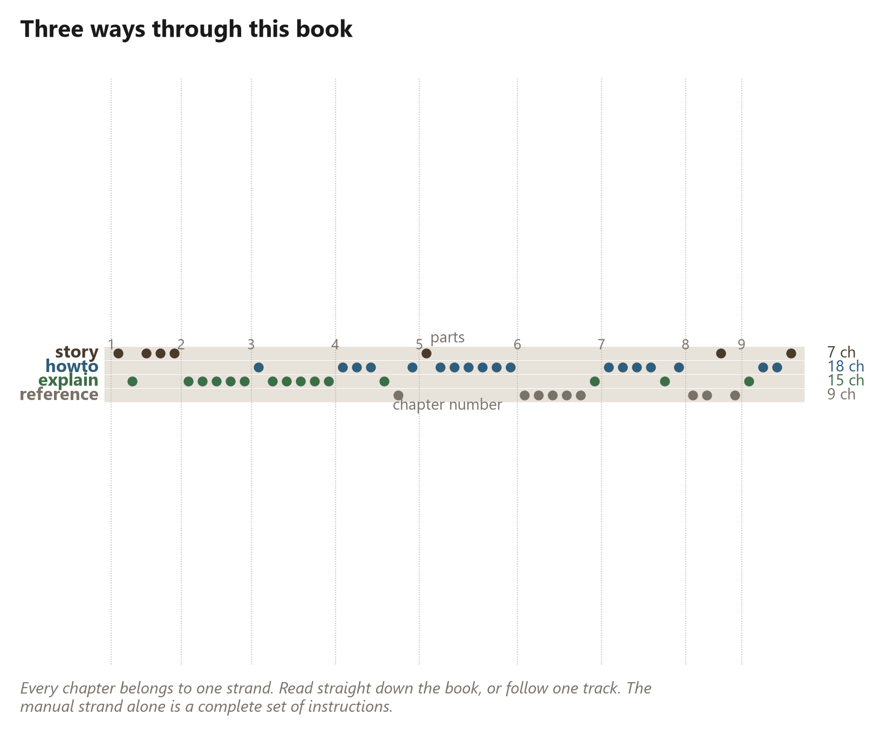

# What this book is

Two pine trees, one chainsaw off a hardware-store shelf, one hundred and
twenty structural members, and a geodesic dome standing in fourteen days.

That is the whole claim, and everything in this book exists to either explain
it, prove it, or teach you to do it.

## It is a real build

The dome in the photographs was not rendered, proposed, or costed on a
spreadsheet. It was cut, and the process of cutting it produced a number of
surprises, most of which are in here. Several chapters exist specifically to
report a figure that does not flatter the method — Chapter {{ch.recovery}} revises the
recovery claim downward, Chapter {{ch.money}} halves an hourly rate this project
publicised, and Chapter {{ch.corrections}} lists everything else that has had to be taken
back. A book about a new building method that contains no corrections is a
brochure.

## It is three books at once

The reader I had in mind wanted three different things, and they read at
three different speeds, so rather than blend them into a mush each chapter
declares which one it is.

**The story** is what happened, in order, to somebody with a saw: the
frankendome that came first, the afternoon the wedge was found, and the week
lost to a problem that turned out not to exist. Seven chapters, and you can
read them straight through as a narrative.

**The manual** is do this, then this. Eighteen chapters, and if you follow
only those you get a dome. It is a complete set of instructions on its own.

**The explanation** is why any of it works — why a triangulated frame will
accept a stick no mill would sell, why splitting a round log is free and
squaring it is not, and why this method does not transfer to a rectangular
house. Fifteen chapters, all skippable, all there because a method you do not
understand is a method you cannot adapt.

The rest is reference: the tables you come back to at the saw rather than
read in an armchair.

## Every number here is computed

This is the unusual part, and it is worth a paragraph.

Not one figure in this book was typed into a sentence. Every dimension, count,
angle, percentage and price is a token in the manuscript that gets filled in,
at the moment the book is made, by the same software that draws the
three-dimensional models. When it says the dome is {{dome.diameter_ft}} feet
across, that number came out of a solver about a second before it reached
this page.

The reason is not showing off. It is that a number typed into a paragraph is
correct on the day it is typed and silently wrong from the first time anybody
changes anything — and there is no way to find those. Nothing fails. The book
just quietly becomes untrue in places nobody remembers.

So the arithmetic in this book is a test suite. It runs, it checks itself
against the geometry, and where two ways of computing something disagree the
book prints both and says which is which. Chapter {{ch.round_trip}} is nothing but a proof
that the two methods in Part IV are the same calculation, and it prints the
residual — {{roundtrip.residual_in}} inches — rather than asking you to take
it on trust.

Every tool that produced these numbers is named in the back, and every one of
them is included with this book. You can change the tree and rebuild the
whole thing around your own.

## What it is not

It is not an engineer's stamp. Nothing here has been checked by a licensed
structural engineer, and where a figure depends on species, grade or moisture
this book says so and tells you who to ask instead of guessing.

It is not a code compliance document. Your jurisdiction has opinions about
round buildings and they are not in here.

And it is not a promise that you will do this in a fortnight. I did, on the
second attempt, having already made every mistake in Chapter {{ch.what_broke}}.
