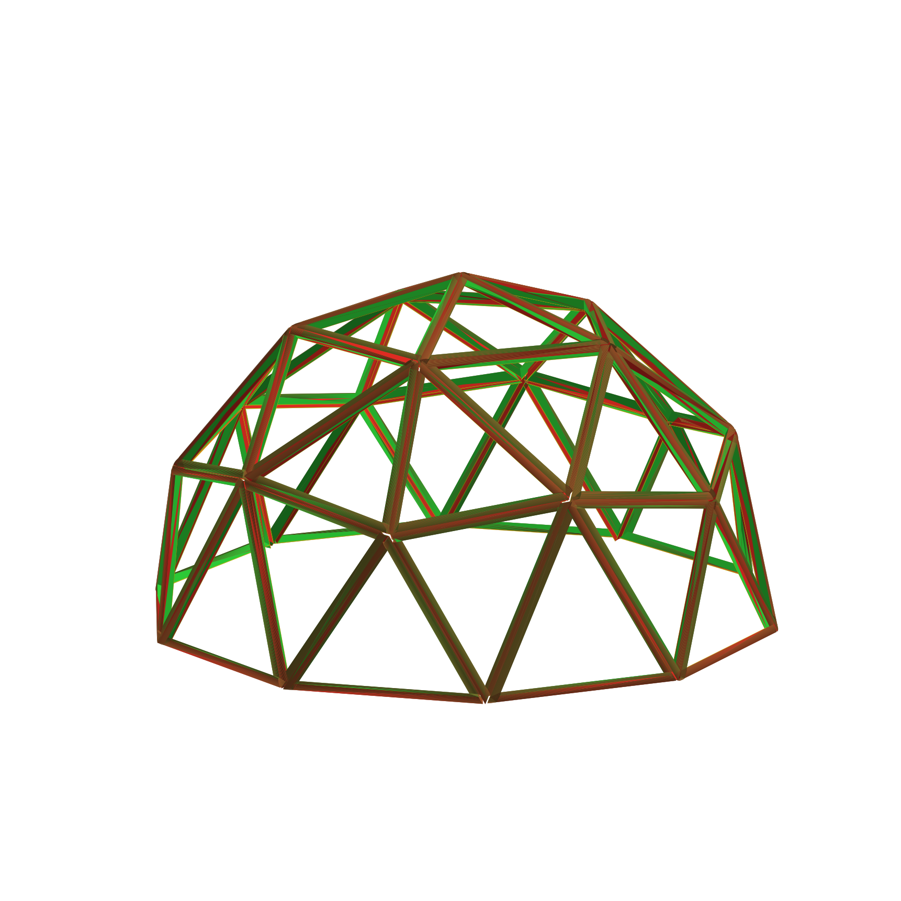

# Title pages

## Title page

The 40 Hour Cabin: 3 Trees

*One small chainsaw, three trees, forty hours or less: a geodesic wedge
cabin, winched up between the trees, skinned and floored in any order.*

A builder's manual: the geometry, fabrication, construction and variations
of a hubless timber geodesic system, documented from one standing
prototype — raised between two trees on three cables, because that is how
this one was actually built.

By the builder. Built with the tools included with this book, which are
named in the back.

That is the whole claim in one picture: a frame of {{frame.members}} members,
cut from {{dome.trees}} trees, standing on day fourteen of the fortnight this
book teaches — and the fortnight's hands-on total is the title's other
claim, counted below.

## The forty hours

The title is an arithmetic, not a slogan. The clock is the one the
companion wedge book prints, and every rate in it is a measured session
figure rather than a process estimate:

**At the log.** The frame's {{frame.members}} members, split at the
measured {{hr.session_wedges}} wedges per {{hr.session_hours}}-hour
session: **{{hr.split_hours}} hours** of splitting.

**From wedge to standing.** Each member erected at
{{hr.minutes_per_member}} minutes: **{{hr.erect_hours}} straight hours**
of assembly.

**With the error allowance.** A {{hr.error_pct}} per cent allowance on
the erection, because a first build always pays its tuition:
**{{hr.with_error}} hours** — inside the {{hr.week}}-hour week the title
is named after, with {{hr.spare}} hours to spare.

The honest reading, stated once and used everywhere after: the forty
hours is the *building* — the frame, from split wedges to standing, in
forty hours or less. The harvest that produces the wedges is a further
{{hr.split_hours}} hours at the log, and the skin, the floor and the
ground are added later, in any order, which is the point of the next
page and of the whole book.

## The part you are allowed to get wrong

Your skull is not symmetrical either, and it protects the brain just
fine. This book builds on that sentence.

A frame's job is to be a *frame*: forty triangles whose lengths set
their angles, standing because the shape cannot fall without stretching
a stick. It does not have to be pretty, milled, graded or symmetrical —
the lumpy skull protects the brain, and the lumpy frame holds the
cabin. The parts that must be right are the two that touch the
weather and the earth: the **skin**, and the **ground**. Those are the
chapters this book treats with the most care, and they are the parts
that can be added, replaced or removed in any order — the frame is
hot-swappable by design, because every panel, every layer, every floor
and every pad is a separate object that bolts on and off.

The build order this book actually used is the order its title page
promises: frame first, winched between the trees, then whatever the
winter asks for — skin before floor, floor before skin, the ground
last of all. The book is written so that any order works.

## Copyright, and the engineer's note

Copyright © 2026, the author.

This book documents construction methods, geometric principles, prototype
builds and design possibilities. It is not a substitute for site-specific
structural engineering, and nothing in it is offered as code-compliant
design. Codes, loads, materials, soil conditions and permitting
requirements vary by place and by site. A structure intended for permanent
occupancy -- and anything carrying snow, wind or people you are not
prepared to lose -- should be reviewed by a qualified engineer and the
local authority before it is built. The floating rig of the closing
chapters is a design possibility, priced but not rated: the trees, the
cables, the mast and the hoist all carry real loads, and none of those
ratings is in this book.

Three kinds of claim run through this book, and each is labelled so they
cannot be mistaken for one another:

**Known geometry.** A fact of the solved frame, true at every size: a 2V
dome of this configuration has this many members, at these ratios. These
are calculations, and the book shows the calculation behind each one.

**Tested construction.** Something that happened on the standing prototype
this book is written around: the joint that was used, the fortnight that
was clocked, the winch raise that put the cabin between the trees, the
mistake that was made and corrected. These are reports, not promises.

**Design possibilities.** Things that are priced or drawn but not yet
built: the rotating pad, the iris, the network. Each is marked as such
where it appears, and the closing chapter restates every claim in the book
as the condition it rests on.

A method whose three kinds of claim are kept apart is a method a reader
can check. That separation is the point of this book, and the rest of it
is the working out.
