# 2 Trees: Build Your (D)Home

*One small chainsaw, 120 wedge struts, and a geodesic dome in a fortnight*

Exported 2026-09-08. Every figure in this file was computed at export time from the geometry in this repository.

---

# Title pages

## Half-title

*The title alone, on a field of bark.*

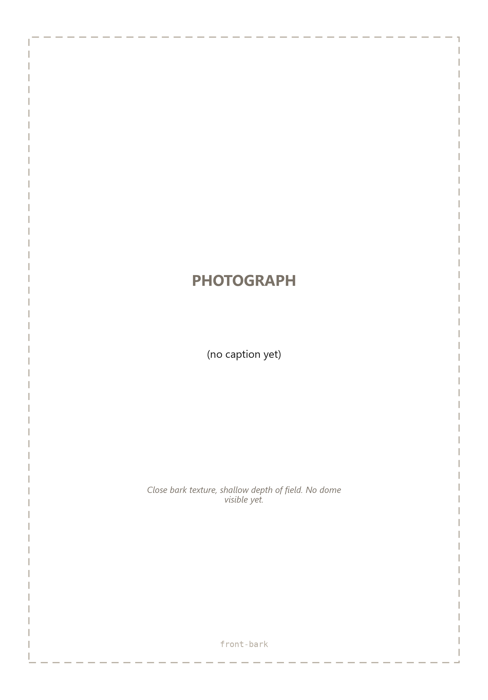

**(not written yet)**

## Frontispiece

*The finished frame against sky, so the reader knows on page two what the book is for.*

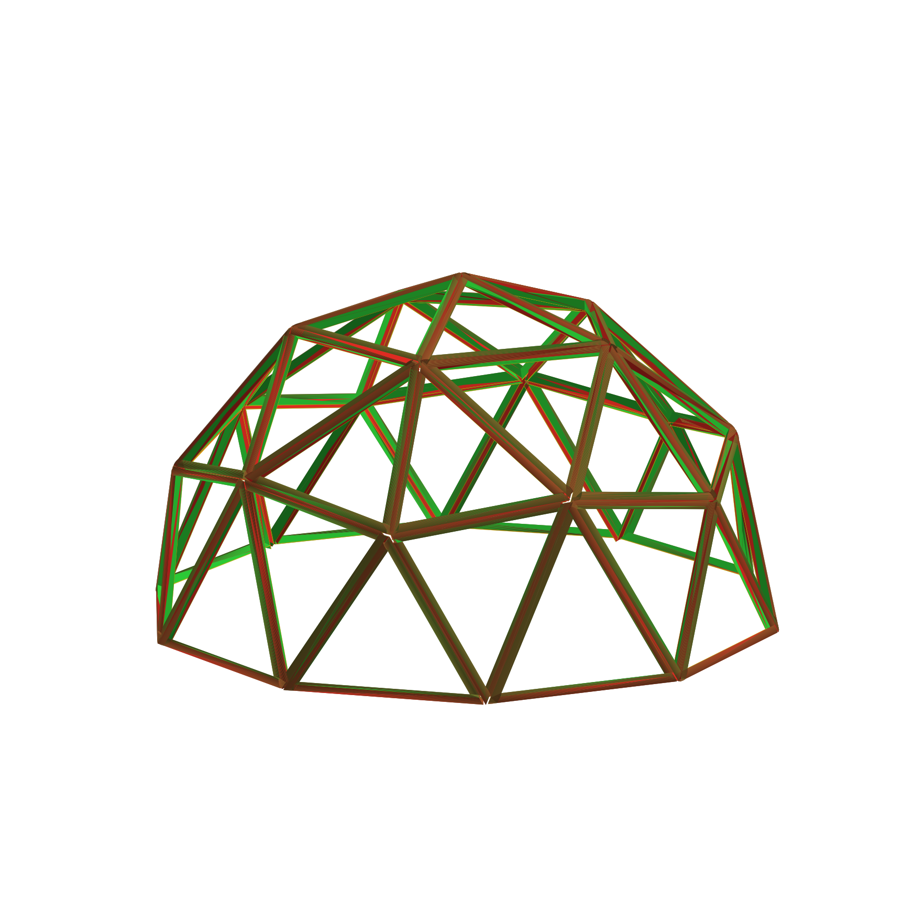

**(not written yet)**

## Title page

*Title, subtitle, author, imprint.*

**(not written yet)**

## Copyright and colophon

*Rights, edition, and the fact that every number in the book was generated by the software listed in the back.*

**(not written yet)**

---

# What this book is

Two pine trees, one chainsaw off a hardware-store shelf, one hundred and
twenty structural members, and a geodesic dome standing in fourteen days.

That is the whole claim, and everything in this book exists to either explain
it, prove it, or teach you to do it.

## It is a real build

The dome in the photographs was not rendered, proposed, or costed on a
spreadsheet. It was cut, and the process of cutting it produced a number of
surprises, most of which are in here. Several chapters exist specifically to
report a figure that does not flatter the method — Chapter 12 revises the
recovery claim downward, Chapter 42 halves an hourly rate this project
publicised, and Chapter 45 lists everything else that has had to be taken
back. A book about a new building method that contains no corrections is a
brochure.

## It is three books at once

The reader I had in mind wanted three different things, and they read at
three different speeds, so rather than blend them into a mush each chapter
declares which one it is.

**The story** is what happened, in order, to somebody with a saw: the
frankendome that came first, the afternoon the wedge was found, and the week
lost to a problem that turned out not to exist. Seven chapters, and you can
read them straight through as a narrative.

**The manual** is do this, then this. Eighteen chapters, and if you follow
only those you get a dome. It is a complete set of instructions on its own.

**The explanation** is why any of it works — why a triangulated frame will
accept a stick no mill would sell, why splitting a round log is free and
squaring it is not, and why this method does not transfer to a rectangular
house. Fifteen chapters, all skippable, all there because a method you do not
understand is a method you cannot adapt.

The rest is reference: the tables you come back to at the saw rather than
read in an armchair.

## Every number here is computed

This is the unusual part, and it is worth a paragraph.

Not one figure in this book was typed into a sentence. Every dimension, count,
angle, percentage and price is a token in the manuscript that gets filled in,
at the moment the book is made, by the same software that draws the
three-dimensional models. When it says the dome is 21.6 feet
across, that number came out of a solver about a second before it reached
this page.

The reason is not showing off. It is that a number typed into a paragraph is
correct on the day it is typed and silently wrong from the first time anybody
changes anything — and there is no way to find those. Nothing fails. The book
just quietly becomes untrue in places nobody remembers.

So the arithmetic in this book is a test suite. It runs, it checks itself
against the geometry, and where two ways of computing something disagree the
book prints both and says which is which. Chapter 20 is nothing but a proof
that the two methods in Part IV are the same calculation, and it prints the
residual — 0.0e+00 inches — rather than asking you to take
it on trust.

Every tool that produced these numbers is named in the back, and every one of
them is included with this book. You can change the tree and rebuild the
whole thing around your own.

## What it is not

It is not an engineer's stamp. Nothing here has been checked by a licensed
structural engineer, and where a figure depends on species, grade or moisture
this book says so and tells you who to ask instead of guessing.

It is not a code compliance document. Your jurisdiction has opinions about
round buildings and they are not in here.

And it is not a promise that you will do this in a fortnight. I did, on the
second attempt, having already made every mistake in Chapter 44.

---

# Part 1: Two Trees

> I cut a tree, I rip the trunk, it is usable wood. Fifteen middlemen, gone.

*The story strand. How the method was found, and what it replaced.*

---

# 1. The Tree That Was Already Down

*A windfall pine, a small saw, and a question nobody had asked out loud*

<!-- Every number in this chapter must come from:
     - book_math.BOOK_TREE
     Quote them as live tokens in double braces, never as
     typed digits. The Numbers panel lists every one. -->

## The Tree That Was Already Down

<!-- [opener] Open on the specific tree. Ground the whole book in one object before any theory arrives.
     target: about 400 words
-->

## Sixty feet of pine, and no way to use it

<!-- [text] Establish the problem: a fallen tree is not lumber, and the gap between them is where all the money is.
     target: about 1100 words
     make these points, in order:
       1. Trunk measured: butt, top, usable straight length.
       2. What a mill would charge to convert it.
       3. What it costs to haul, and to wait.
       4. The saw on the shelf cost less than the haul.
-->

## The tree, measured

<!-- [spread] Put the actual trunk on the page with its dimensions, because every number later in the book descends from it.
     target: about 350 words
     figure [tree-measured] (book_diagram): The book's tree: 12 inches at the butt, 8 at the top, 48 feet of usable trunk.
-->

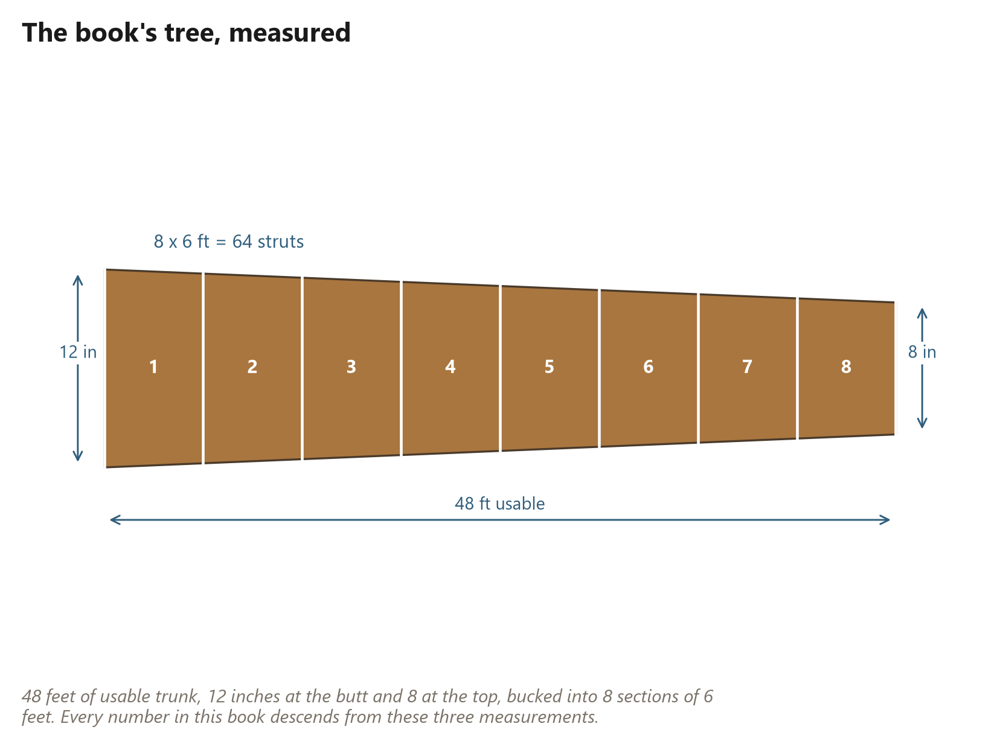

## What I actually wanted

<!-- [text] State the goal plainly: a round house, built alone, out of what was on the ground.
     target: about 800 words
-->

---

# 2. Fifteen Middlemen

*Why a two-by-four costs what it costs, and how much of that is wood*

<!-- Every number in this chapter must come from:
     - book_math.DECLARED
     - book_math.NOMINAL_TWO_BY_FOUR_IN2
     - book_math.DRESSED_TWO_BY_FOUR_IN2
     Quote them as live tokens in double braces, never as
     typed digits. The Numbers panel lists every one. -->

## Fifteen Middlemen

<!-- [opener] Frame the economic argument that motivates everything after it.
     target: about 350 words
-->

## From stump to rack

<!-- [text] Walk the actual chain: fell, skid, haul, scale, saw, edge, trim, dry, plane, grade, bundle, ship, stock, shelve, sell.
     target: about 1200 words
-->

## The chain, and where the wood goes

<!-- [spread] Show recovery falling at each step of industrial conversion against the single step here.
     target: about 450 words
     figure [middlemen-chain] (book_diagram): Every step between a standing tree and a board on a rack.
-->

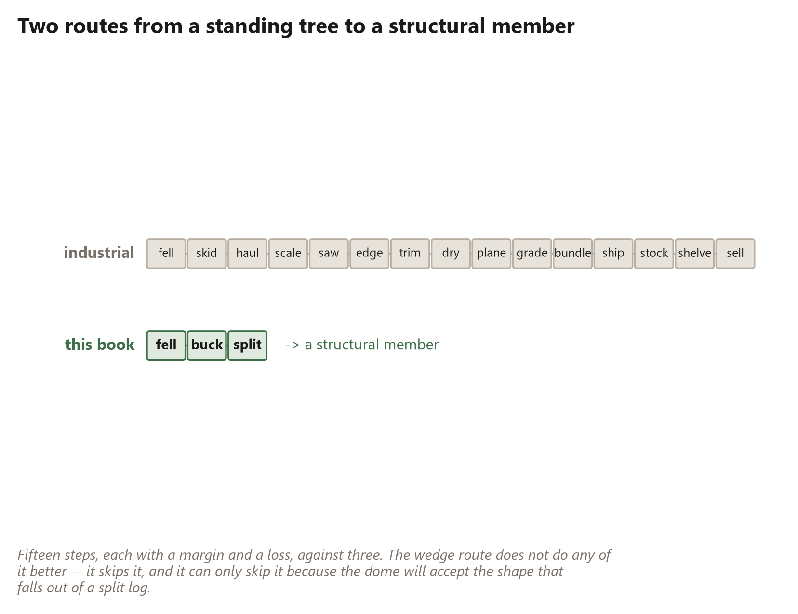

## The price of a 2x4, taken apart

<!-- [text] Use the declared shelf price and say honestly how little of it is the tree.
     target: about 900 words
-->

## Nominal, dressed, and the missing third

<!-- [sidebar] A 2x4 is 1.5 by 3.5. This matters later, in the money chapter, so it is established here.
     target: about 400 words
     make these points, in order:
       1. Nominal 2x4 is 8.00 square inches.
       2. Dressed 2x4 is 5.25.
       3. The book compares against both, and says which.
-->

---

# 3. The Frankendome

*Forty triangles, no two struts alike, and the failure that taught the method*

<!-- Every number in this chapter must come from:
     - hubless_geometry.hubless_summary
     Quote them as live tokens in double braces, never as
     typed digits. The Numbers panel lists every one. -->

## The Frankendome

<!-- [opener] The build before this one. It worked, and it was awful, and that is why the wedge exists.
     target: about 400 words
-->

## Strut-agnostic, and what that cost

<!-- [text] Explain the earlier idea: join forty triangles edge to edge from the top down, any stick anywhere.
     target: about 1000 words
-->

## The frankendome standing

<!-- [plate] One full page of the lumpy frame, so the reader sees the before.
     figure [franken-standing] (lesson_still): The frankendome: it stood, and no two members matched.
-->

## The ten-piece pentagon

<!-- [text] The one part of the frankendome that was genuinely better, and carried forward.
     target: about 750 words
-->

## Why I stopped

<!-- [text] Name the real failure: nothing repeated, so nothing could be jigged.
     target: about 650 words
-->

---

# 4. The V-Bracket Afternoon

*Trying to join shapes that have nothing in common*

## The V-Bracket Afternoon

<!-- [opener] The middle step: brackets that could join anything to anything.
     target: about 350 words
-->

## A bracket that does not care

<!-- [text] Why the V shape tolerates members of unlike section, and why that tolerance was a warning sign.
     target: about 950 words
-->

## Four joints that nearly worked

<!-- [spread] Show the bracket attempts side by side with what each one could not do.
     target: about 400 words
     figure [bracket-attempts] (book_diagram): Four joints, and the one thing each could not do.
-->

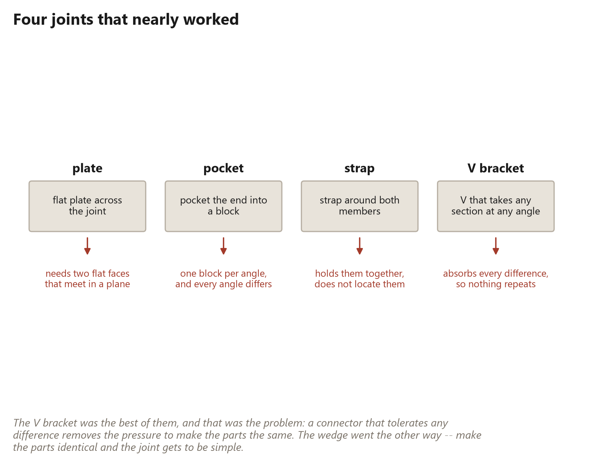

## The question that ended it

<!-- [text] If the bracket has to absorb every difference, what would it take for there to be no difference?
     target: about 600 words
-->

---

# 5. The Cut That Changed It

*Split the trunk like a cake, and the stick is already the right shape*

<!-- Every number in this chapter must come from:
     - wedge_geometry.SECTORS_PER_LOG
     - wedge_geometry.sector_chord_in
     - wedge_geometry.sector_depth_in
     Quote them as live tokens in double braces, never as
     typed digits. The Numbers panel lists every one. -->

## The Cut That Changed It

I want to tell this one without hindsight tidying it up, because the tidy
version — *I realised the dome would accept any consistent section, therefore
I split the log radially* — is not what happened and it teaches nothing. What
happened was that I was tired of brackets.

## Half, half, half again

The frankendome had taught me that a frame of forty triangles will stand up
even if no two of its sticks match. The V-bracket afternoon had taught me
that making a connector tolerant enough to join anything to anything means
the connector is now doing all the work, forever, in forty places.

So I had stopped asking how to join dissimilar sticks and started asking the
opposite question: what would it take for them not to be dissimilar?

The answer that everybody gives is *mill them*. Square them up, run them
through a planer, and now they are all 2x4s. That answer costs a mill, a
planer, a shed to keep them in, and about half the tree.

I was sitting on a section of trunk at the time. Not thinking about it.
Sitting on it.

And the thing about a round section of trunk is that it is already
rotationally symmetric. Every radius is the same as every other radius. If
you split it through the middle you get two identical halves, not because you
were careful but because the log was round before you touched it. Split those
and you get four. Split those and you get 8.

Three passes. Eight sticks. Every one the same, to whatever tolerance the
tree was round to, which is a tolerance nobody had to hold and nobody had to
check.

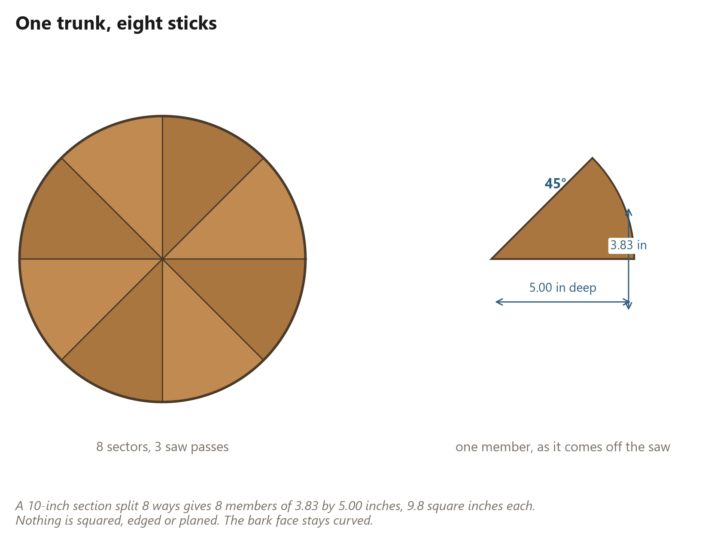

I did it that afternoon on a piece I had been about to burn.

## What became obvious immediately

Four things, in about a minute, and I want to record that they were obvious
because the ones in the next section took a week and I do not want to flatter
the story.

**One section, everywhere.** Every stick in the frame has the same
cross-section: 3.83 inches across the bark face,
5.00 inches from pith to bark, 9.82 square
inches of wood. So one jig fits all of them. One fixture, one set of stops,
one procedure repeated a hundred and twenty times. That is what makes this a
fortnight instead of a summer.

**Depth where you want it.** A sector is deep — it runs the whole way from
the pith to the bark — and depth is where bending stiffness lives. The stick
is not a compromise between what the tree gave and what a mill wanted. It is
the deepest member you can cut from that log, which is a strange thing to get
for free.

**No machine between the tree and the frame.** Fell, buck, split, build. The
chainsaw does all of it. There is no second machine, no second setup, no
second building to keep the second machine in.

**Four ways up.** This one I noticed while stacking them. The sector is not
symmetric about its own long axis — it has a point and a curved back — so you
can rotate it four sensible ways in the wall and get four different things:
which face the weather sees, which face the next stick lands on, whether the
points of a pair aim together or apart. That is Chapter 13, and it is the
most genuinely new thing in the method.

## And what took another week

Now the part the tidy version leaves out.

I assumed, because the sticks were identical and the panels were identical,
that the *joints* would be identical. Forty triangles, all the same, all
meeting each other the same way.

They do not.

A dome is a sphere approximated by flat panels, and the angle at which two
panels meet is not the same everywhere on it. It cannot be — the sphere
curves differently in different places, and a 2V hemisphere has two classes
of edge for exactly that reason. So the seam between two panels folds by one
amount here and a different amount there, and a key cut to fit one seam will
not fit the other.

I did not want this to be true. I spent the better part of a week trying to
make it not be true: fudging the panel outlines, trying a compressible
gasket, trying to talk myself into the idea that the difference was small
enough to force closed. It is not small enough. Forty panels of *nearly*
closing is a dome with a gap in it.

What actually resolved it was measuring instead of arguing. Across all
55 seams there are only **2** fold
angles. Not forty. Not a continuum. Two: 18.03 degrees and
22.46.

That was the moment the method became buildable rather than merely elegant.
2 angles means 2 key profiles:
cut one of each until it fits, then repeat it 25 and
30 times. The difference between "the seams vary" and "the
seams take 2 values" is the difference between a
research project and a fortnight, and I lost a week to not knowing which one
I was in.

The chart is in Chapter 15, where it belongs.

## The bit I got wrong in public

While all this was going on I was saying, out loud and on camera, that
nothing in the dome needed a mitre.

That is not true and it was never true. The end of each stick that lands on
the side of the next one — the butt end — is a compound cut: a mitre and a
bevel together. What is true, and what I should have been saying, is that no
end is ever mitred *to another end*. Every joint is an end landing on a
flat side, which means each stick is cut once, on one end, before it goes
anywhere near the assembly, and the other end is left long and sawn off in
place.

That is a much better claim than the one I made, and it is a shame I spent
several months making the wrong one. Chapter 14 has the geometry and Chapter
45 has the full list of things this project has had to take back.

## What it is worth

The number that convinced me it was not just a neat trick: splitting this way
keeps 87.4 per cent of the solid wood in the trunk, against
about 45 per cent for the same log sawn into
two-by-fours the way a mill would. That is 1.93 times the
usable wood, from a cheaper process, with one machine instead of four.

Chapter 12 does that arithmetic properly, including the parts of it that are
less flattering than they first appeared.

But sitting on that log, what I had was a much simpler observation, and I
still think it is the whole book:

**A round thing splits into identical pieces for free. A square thing has to
be made square, and you pay for that in wood, in machines, and in time.
Domes are the buildings that will accept the free pieces.**

---

# Part 2: Why a Dome Lets You Do This

> We can only use this method because of the dome's inherent structure.

*The explanation strand. Skip it if you only want the manual, but the method does not transfer to a square house and this is the chapter that says why.*

---

# 6. Triangles Do Not Care What Shape Your Stick Is

*Why a triangulated frame can accept a member no mill would sell*

<!-- Every number in this chapter must come from:
     - book_math.BOOK_TREE.member_area_in2
     - wedge_geometry.bearing_area_in2
     Quote them as live tokens in double braces, never as
     typed digits. The Numbers panel lists every one. -->

## Triangles Do Not Care

<!-- [opener] The central permission: triangulation makes section shape a detail.
     target: about 400 words
-->

## Axial, not bending

<!-- [text] A triangulated member is pushed or pulled along its length; it is not asked to be flat.
     target: about 1000 words
-->

## The same load, two frames

<!-- [spread] Rectangular frame racking beside a triangulated one standing.
     target: about 400 words
     figure [racking-compare] (book_diagram): A rectangle needs a sheet to stand. A triangle does not.
-->

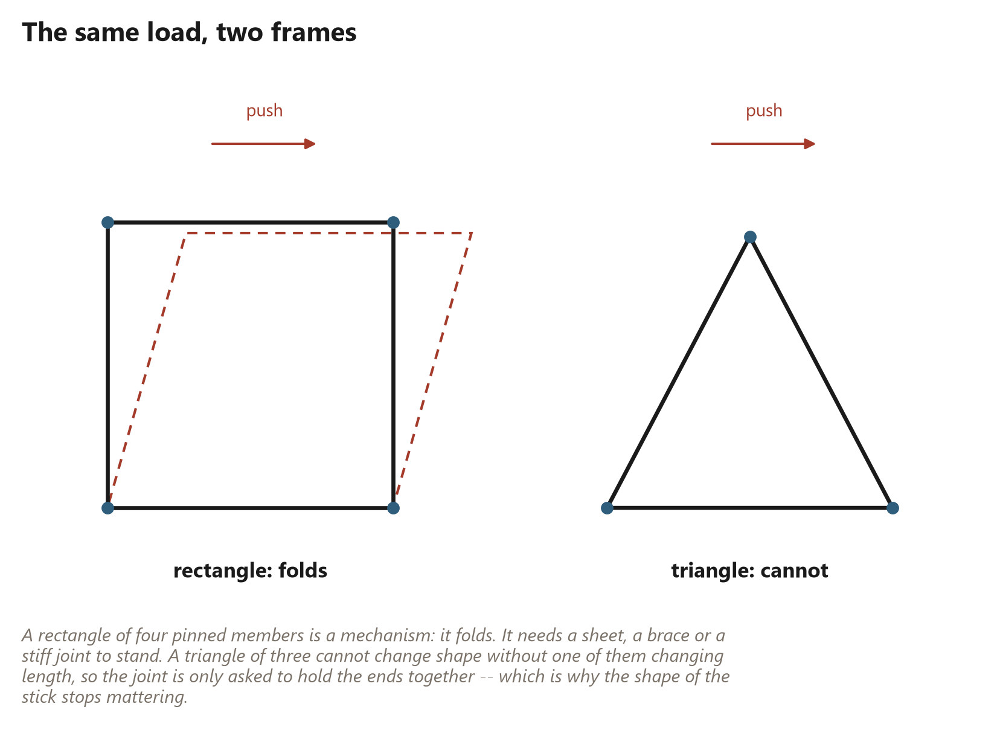

## What the wedge is good at

<!-- [text] Depth from pith to bark is where the stiffness is, and the wedge has more of it than a 2x4.
     target: about 800 words
-->

## One eighth of a tree

<!-- [sidebar] Put the section area on the page against a 2x4's, both ways.
     target: about 350 words
-->

---

# 7. Forty Panels, One Hundred and Twenty Members

*The 2V hemisphere, counted*

<!-- Every number in this chapter must come from:
     - book_math.frame_counts
     - book_math.panel_seam_count
     Quote them as live tokens in double braces, never as
     typed digits. The Numbers panel lists every one. -->

## Forty Panels

<!-- [opener] Introduce the frame itself.
     target: about 350 words
-->

## Where 2V comes from

<!-- [text] Icosahedron, one subdivision, projected to a sphere, cut at the equator.
     target: about 1000 words
-->

## The frame, exploded

<!-- [plate] Full page: forty panels pushed apart along their own normals.
     figure [frame-exploded] (raw_wedge_world): Forty panels, 120 members, 55 seams between them.
-->

## What the frame contains

<!-- [table] Counts, straight from the geometry, with the rim edges separated from the seams.
     target: about 300 words
     figure [frame-counts] (book_plot): Counted from the solved dome, not chosen.
-->

## Why hemispheres and not spheres

<!-- [text] The rim is where the frame meets the ground and where ten edges join nothing.
     target: about 700 words
-->

---

# 8. Two Lengths, Not Forty

*The whole reason a dome can be built by one person*

<!-- Every number in this chapter must come from:
     - wedge_geometry.member_classes
     Quote them as live tokens in double braces, never as
     typed digits. The Numbers panel lists every one. -->

## Two Lengths

<!-- [opener] The repeatability argument.
     target: about 300 words
-->

## Short and long

<!-- [text] A 2V dome has two edge classes. Everything else follows from that.
     target: about 850 words
-->

## The member schedule

<!-- [table] The four member classes with their counts and lengths, generated.
     target: about 250 words
     figure [member-classes] (book_plot): Every stick in the dome, in four lengths.
-->

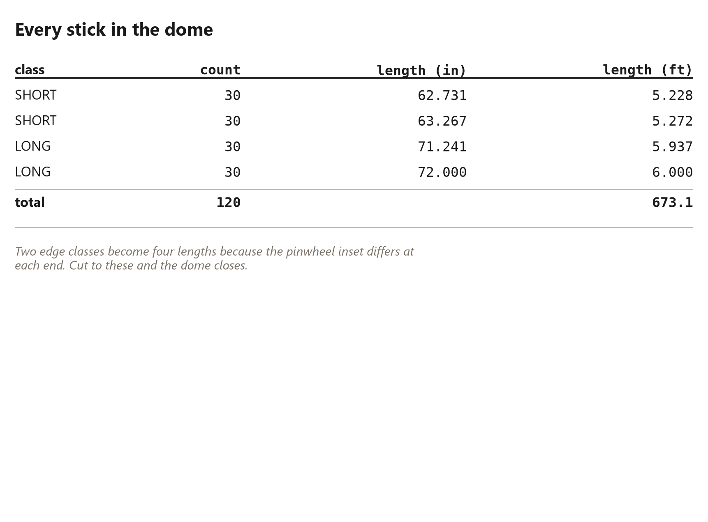

## Why the pinwheel splits two into four

<!-- [text] The inset that avoids mitres makes each class into two near-identical lengths, and that is a feature.
     target: about 800 words
-->

---

# 9. Compression, Tension, and One Eighth of a Tree

*What a wedge strut can actually carry*

<!-- Every number in this chapter must come from:
     - wedge_geometry.bearing_area_in2
     - book_math.DECLARED
     Quote them as live tokens in double braces, never as
     typed digits. The Numbers panel lists every one. -->

## One Eighth of a Tree

<!-- [opener] Move from geometry to force.
     target: about 350 words
-->

## Along the grain, and across it

<!-- [text] The two directions that matter, and which one the joints load.
     target: about 1000 words
-->

## The end-to-side bearing

<!-- [text] The end of a sector is the sector: nothing is notched away to make the joint.
     target: about 800 words
-->

## What this book will not tell you

<!-- [safety] State the limit clearly: allowable stresses are species, grade and moisture dependent, and a book cannot grade your tree.
     target: about 450 words
-->

## The number I will give you

<!-- [sidebar] Bearing area, which is geometry, versus allowable pressure, which is not.
     target: about 400 words
-->

---

# 10. What a Dome Costs You

*The chapter that argues against the book*

<!-- Every number in this chapter must come from:
     - dome_costing.costing_report
     Quote them as live tokens in double braces, never as
     typed digits. The Numbers panel lists every one. -->

## What a Dome Costs You

<!-- [opener] State up front that this chapter is here to talk the reader out of it if it should.
     target: about 400 words
-->

## Furniture does not fit a curve

<!-- [text] Honest accounting of the round-room problem.
     target: about 800 words
-->

## Roofing a compound surface

<!-- [text] Where domes leak, why, and what it costs to stop.
     target: about 900 words
-->

## Permits, appraisals and resale

<!-- [text] The non-technical costs nobody puts in a dome book.
     target: about 750 words
-->

## When to build a rectangle

<!-- [text] The genuine cases where this method is the wrong answer.
     target: about 600 words
-->

---

# Part 3: The Wedge

> Same stick, four ways up.

*The paradigm itself: how a split trunk becomes a structural member, and the four things it can do.*

---

# 11. Split Like a Cake

*Three passes, eight sectors, and why eight*

<!-- Every number in this chapter must come from:
     - wedge_geometry.SECTORS_PER_LOG
     - wedge_geometry.sector_area_in2
     - wedge_geometry.sector_chord_in
     Quote them as live tokens in double braces, never as
     typed digits. The Numbers panel lists every one. -->

## Split Like a Cake

<!-- [opener] The cut, introduced.
     target: about 300 words
-->

## The three passes

<!-- [steps] The actual procedure at the log, in order.
     target: about 700 words
     make these points, in order:
       1. Pass one: halve the section through the pith.
       2. Pass two and three: quarter each half.
       3. Passes four to seven: pith to bark, eighths.
       4. Why the halving pass goes first, every time.
-->

## Three cuts, eight sticks

<!-- [spread] The cut sequence drawn on a real section.
     target: about 350 words
     figure [split-sequence] (book_diagram): The order of the passes. Halve, quarter, eighth.
-->

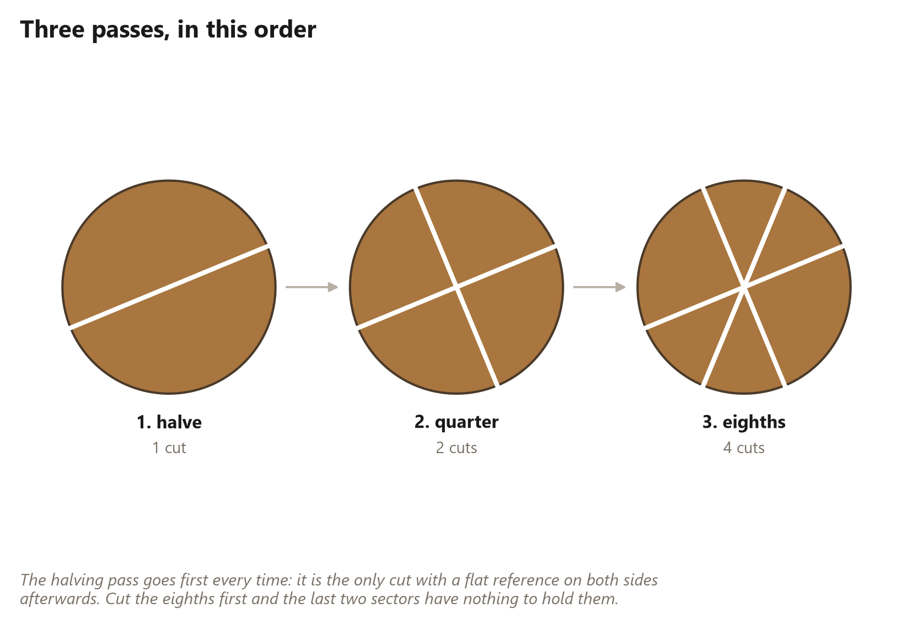

## Why eight and not six or twelve

<!-- [text] Forty-five degrees is the number that makes the seam key work, and a sixth is too fat to handle alone.
     target: about 900 words
-->

## What other split counts give you

<!-- [table] Six, eight, ten, twelve, compared on section and width.
     target: about 250 words
     figure [split-counts] (book_plot): Sector width and depth against split count.
-->

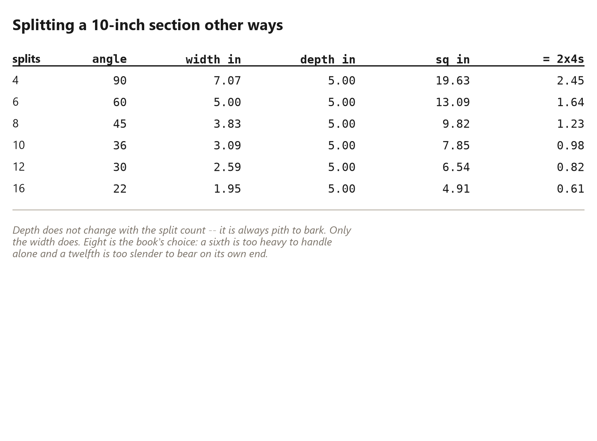

---

# 12. Eighty-Seven Percent

*The recovery arithmetic, with the kerf paid for*

> **This chapter corrects something.** The 88% recovery figure in the project brief, which was computed for a 15-inch butt rather than this book's 12-inch tree.

<!-- Every number in this chapter must come from:
     - book_math.BOOK_TREE.recovery
     - wedge_geometry.tree_yield
     - wedge_geometry.section_rows
     Quote them as live tokens in double braces, never as
     typed digits. The Numbers panel lists every one. -->

## Eighty-Seven Percent

<!-- [opener] The headline claim, and immediately the caveats.
     target: about 400 words
-->

## What a mill loses, and to what

<!-- [text] Slabs, edgings, trim, drying degrade, and the kerf.
     target: about 950 words
-->

## What the wedge loses

<!-- [text] Only the kerf, and here is the kerf, counted.
     target: about 800 words
-->

## Both conversions, same log

<!-- [spread] The round section packed with 2x4s beside the same section split into eighths.
     target: about 400 words
     figure [recovery-compare] (book_diagram): The same log, converted twice. 87.4 percent against 45.
-->

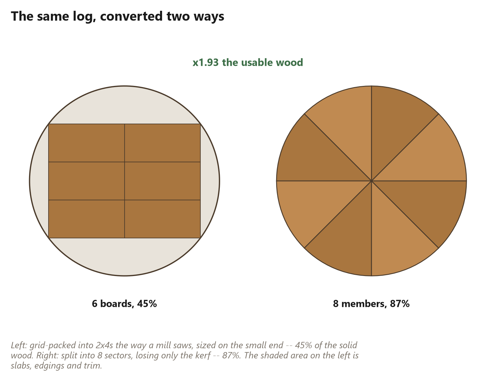

## Section by section

<!-- [table] The whole trunk, one row per section, both ways.
     target: about 250 words
     figure [section-rows] (book_plot): Every bucked section, both conversions.
-->

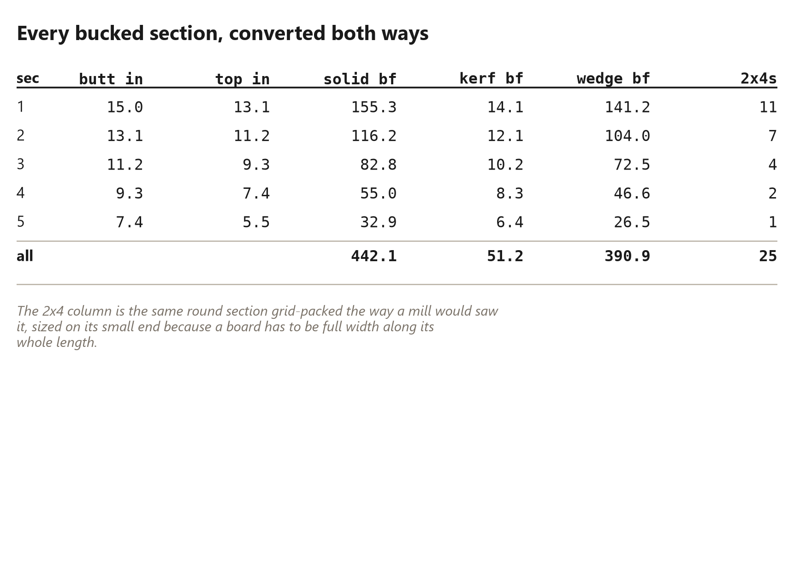

## Where 88 became 87

<!-- [errata] The project brief said 88 percent for a bigger tree. This book's tree gives 87.4. Both are printed and the difference explained.
     target: about 500 words
-->

---

# 13. Four Ways Up

*One stick, four orientations, four different buildings*

<!-- Every number in this chapter must come from:
     - raw_wedge_bridge.orientations
     - raw_wedge_bridge.seam_pair_reading
     Quote them as live tokens in double braces, never as
     typed digits. The Numbers panel lists every one. -->

## Four Ways Up

<!-- [opener] The orientation idea, which is the most original thing in the method.
     target: about 400 words
-->

## Rotating about its own axis

<!-- [text] The wedge is not symmetric, so which way its point aims changes the frame.
     target: about 850 words
-->

## All four, side by side

<!-- [plate] Full page: the same seam in all four orientations.
     figure [orientations-four] (book_diagram): The same pair of sticks, four ways up.
-->

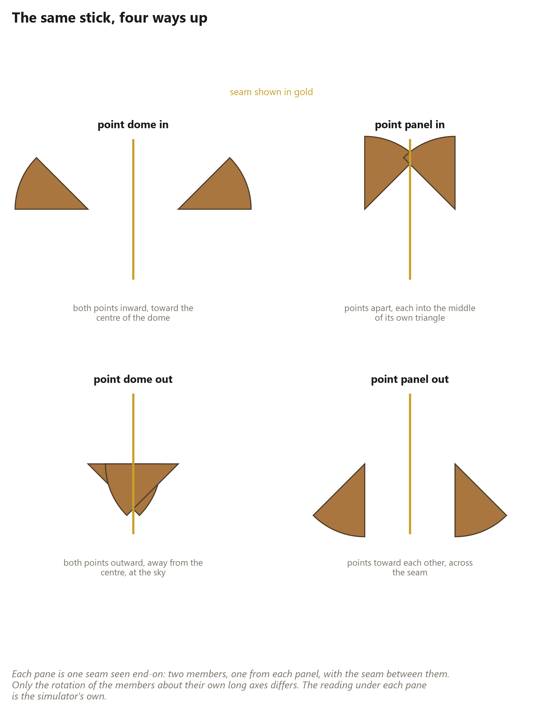

## Point dome in

<!-- [text] The default, and why: flat sawn faces where the key wants them, bark out at the weather.
     target: about 600 words
-->

## Point panel in

<!-- [text] The two sticks either side of a seam aim apart.
     target: about 500 words
-->

## Point dome out

<!-- [text] Bark inward, a ridged outside surface, and which face receives the next stick.
     target: about 500 words
-->

## Point panel out

<!-- [text] The bark faces the middle of the panel and the joint bears on a round surface.
     target: about 550 words
-->

## Choosing one

<!-- [table] What each orientation buys and costs.
     target: about 300 words
     figure [orientation-table] (book_plot): Read straight from the simulator's own seam readings.
-->

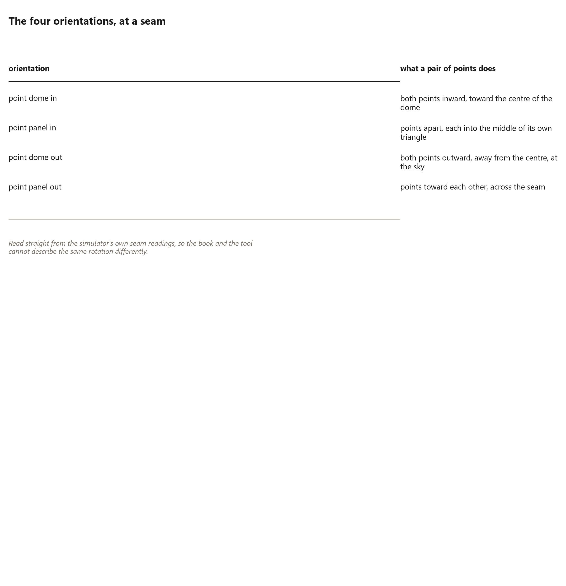

---

# 14. The Pinwheel

*Three sticks, one triangle, and not one mitre*

> **This chapter corrects something.** The 'no mitres anywhere' claim, already corrected on camera in lesson_wedge_why.

<!-- Every number in this chapter must come from:
     - wedge_geometry.pinwheel_panels
     - wedge_geometry.member_classes
     Quote them as live tokens in double braces, never as
     typed digits. The Numbers panel lists every one. -->

## The Pinwheel

<!-- [opener] The joint that makes the whole thing buildable alone.
     target: about 400 words
-->

## Why mitres were the enemy

<!-- [text] A mitre is a compound angle cut on both ends of every stick. Forty panels of that is not a fortnight.
     target: about 800 words
-->

## Each end lands on a side, not a point

<!-- [text] The pinwheel, explained in the way that finally makes it obvious.
     target: about 900 words
-->

## One panel, taken apart

<!-- [spread] Exploded pinwheel with the inset and the bearing shown.
     target: about 400 words
     figure [pinwheel-exploded] (book_diagram): Three members, three end-to-side joints, no mitre anywhere.
-->

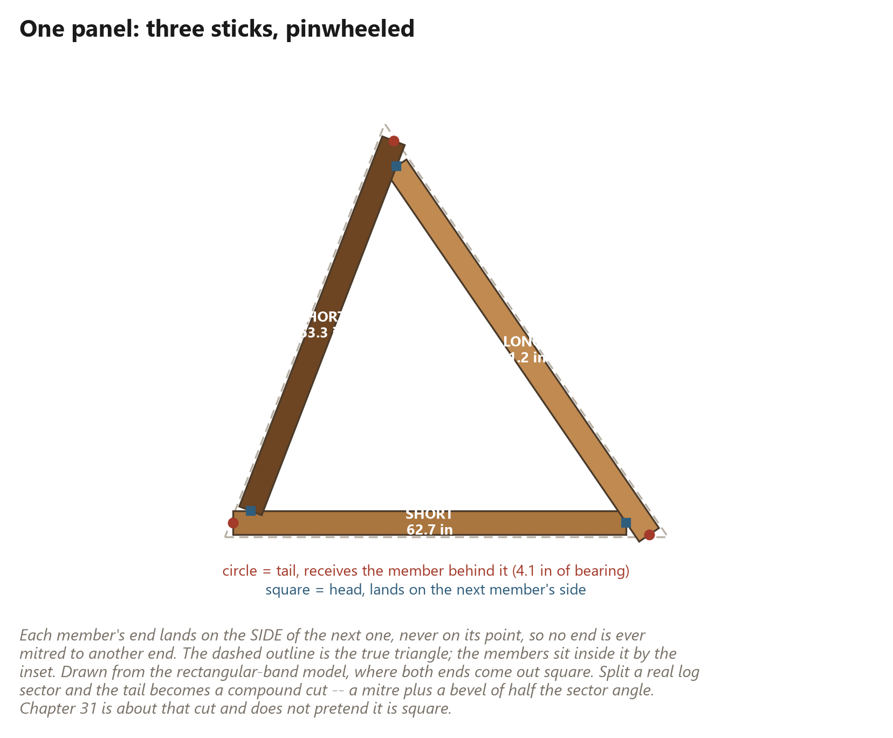

## What the inset costs

<!-- [text] The honest price: the panel is slightly smaller than the triangle it sits in, and every member length accounts for it.
     target: about 700 words
-->

## The mitre claim, corrected

<!-- [errata] An earlier film in this project said no cut in the dome is a mitre. The butt cut is a compound angle. It is still made once, on one end, off the jig -- but it is not nothing, and the film's own correction chapter is the model for this one.
     target: about 550 words
-->

---

# 15. The Seam and Its Key

*Where two panels meet, and the angle nobody wants to hear about*

<!-- Every number in this chapter must come from:
     - wedge_geometry.gasket_plan
     - raw_wedge_bridge.model
     Quote them as live tokens in double braces, never as
     typed digits. The Numbers panel lists every one. -->

## The Seam and Its Key

<!-- [opener] The least glamorous chapter, and the one that decides whether the dome closes.
     target: about 400 words
-->

## The fold angle is not constant

<!-- [text] Say the unwelcome thing early: seams differ, and the range is this.
     target: about 800 words
-->

## Raw trapezoid, or shaved flat

<!-- [text] The two honest answers, with what each costs.
     target: about 900 words
-->

## One seam, both ways

<!-- [spread] The tapered key beside the parallel one.
     target: about 400 words
     figure [seam-both-ways] (book_diagram): Leave the split faces alone and taper the key, or plane the faces and use one key everywhere.
-->

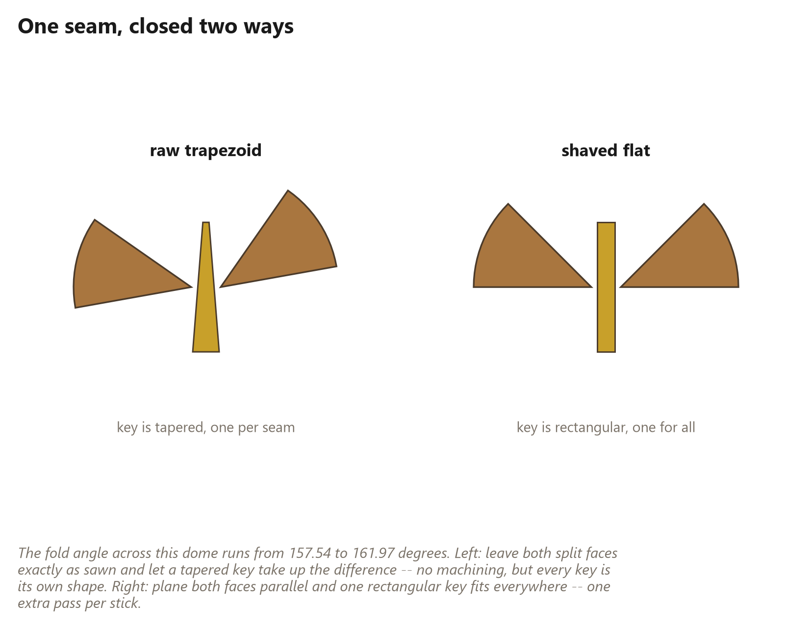

## Every seam in the dome

<!-- [table] Fold angles, sorted, with the extremes named.
     target: about 300 words
     figure [seam-schedule] (book_plot): All 55 seams and their fold angles.
-->

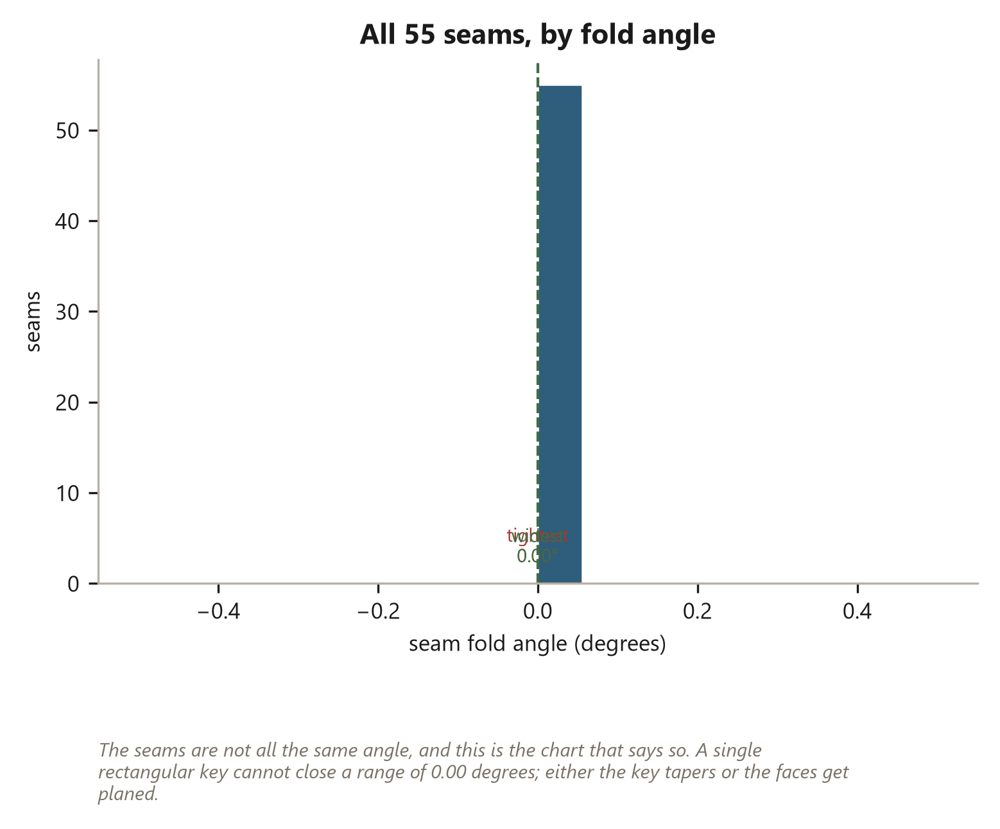

## Hose, key or nothing

<!-- [text] The third option, and when a compressible seam beats a rigid one.
     target: about 650 words
-->

---

# 16. Bends, Knots and Small Units

*Why six-foot pieces forgive what sixteen-foot boards do not*

<!-- Every number in this chapter must come from:
     - book_math.BOOK_TREE
     Quote them as live tokens in double braces, never as
     typed digits. The Numbers panel lists every one. -->

## Small Units

<!-- [opener] The resilience argument, which is the quiet advantage.
     target: about 350 words
-->

## A bend costs you a section, not a tree

<!-- [text] Cut either side of the bend and keep going.
     target: about 800 words
-->

## Knots, and where they are allowed

<!-- [text] A knot in the middle of a compression member is not the same as a knot at a bearing face.
     target: about 750 words
-->

## One bent trunk, salvaged

<!-- [spread] The same crooked tree drawn as a mill would reject it and as this method buckes it.
     target: about 400 words
     figure [bent-trunk] (book_diagram): A bend a mill would refuse, and the sections either side of it.
-->

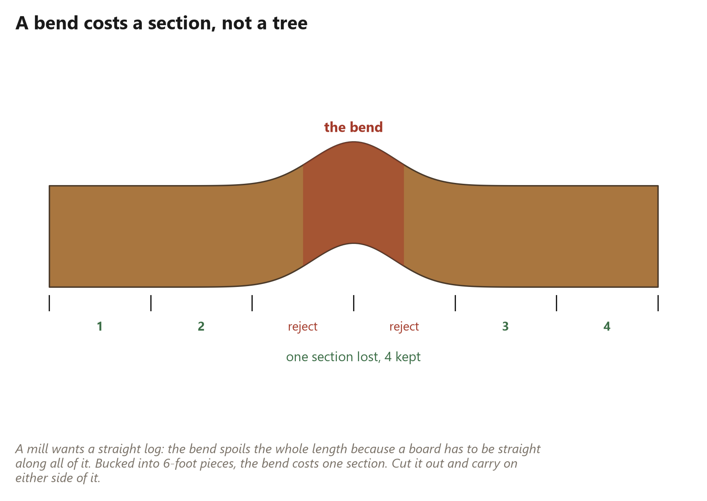

## Grade your own stock

<!-- [text] A practical sorting procedure for a pile of wedges.
     target: about 700 words
-->

---

# Part 4: The Two Calculations

> Either you know the dome you want, or you know the tree you have. Never both.

*The manual's core. Two methods, run in opposite directions, and the proof that they close on the same dome.*

---

# 17. Which Way Round Are You Working?

*Choose your method before you touch anything*

<!-- Every number in this chapter must come from:
     - wedge_geometry.longest_member_in
     - wedge_geometry.radius_for_member_length
     Quote them as live tokens in double braces, never as
     typed digits. The Numbers panel lists every one. -->

## Which Way Round

There are two ways to size a wedge dome, and the first thing you have to do
is work out which one you are actually in. Not which one you would like to be
in. Which one you are in.

If you get this wrong you will spend a week doing arithmetic that describes a
building you cannot build, and you will not find out until the day you go to
cut, when the longest stick the frame wants turns out to be eight inches
longer than the longest stick you own.

Everything in the next five chapters follows from this one decision, so it
gets its own short chapter and no other content.

## Design first, or tree first

**Design first** is the way everybody expects to work. You know what you
want: a room of a certain size, a ceiling you can stand under, a footprint
that fits between the trees you are not cutting down. You start from the dome
and you work backwards to the woodpile. The output is a shopping list — this
many sticks, this long, and therefore this much trunk.

**Tree first** is the way this book was actually written. You have trees.
They are the trees you have: a certain height, a certain taper, a certain
amount of straight length between the butt flare and the first serious bend.
You start from what a section of that trunk can be cut into and you work
forwards to the dome. The output is not a shopping list. It is a diameter,
and you find it out rather than choosing it.

Both are honest. Neither is better. They answer different questions and they
run in opposite directions, and the entire content of Chapters 18 and 19 is
those two directions worked through in full.

## The honest test

Here is the test, and it is uncomfortable.

**Are the trees already down, or already chosen?**

If they are — if you are standing next to a windfall, or you have marked two
pines at the back of the property, or somebody has offered you a load — then
you are in Method B, and picking a diameter is not a decision you get to
make. It is a wish. You may still write a number on a piece of paper. The
trees will not read it.

If the trees are genuinely not chosen — you will buy or fell whatever the
design calls for, and there is enough standing timber that a foot either way
on the bucking length costs you nothing — then you are in Method A, and you
should design the dome you want.

Almost everybody thinks they are in Method A. Most people are in Method B.
The tell is whether you would actually go and get a different tree if the
arithmetic asked for one. If the answer is "well, I'd probably make it work
with these," you are in Method B and you may as well admit it on page one
rather than on cutting day.

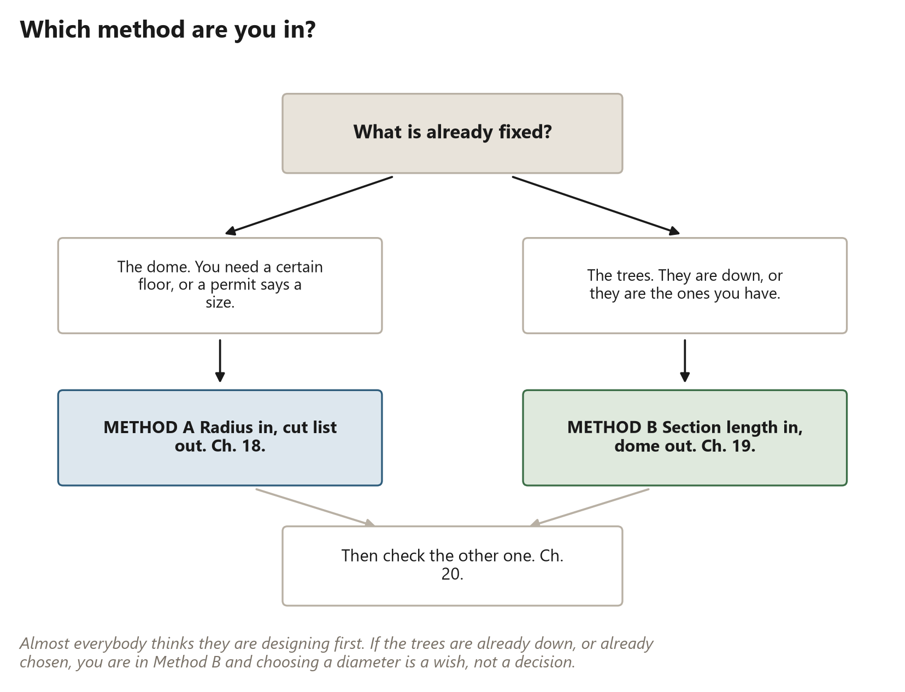

## What both methods share

Underneath the two directions there is one relationship, and it is worth
understanding before you use either method, because it is the thing that
makes both of them exact rather than approximate.

In a 2V dome of radius *R*, every panel is a triangle whose corners sit on the
sphere. If the members simply ran corner to corner you could scale them
straight off the radius: double the dome, double the stick. But they do not
run corner to corner. They pinwheel — each member's end lands on the *side*
of the next one rather than on a shared point — and the amount each member is
set back from the true corner depends on **how wide the member is**, not on
how big the dome is.

A wider stick sits back further. And the width of your stick comes from the
diameter of your log, which has nothing whatsoever to do with the dome.

So member length is not proportional to radius. It is radius *minus* a
correction that stays the same size while the dome grows. Which means:

* Going from radius to member length is a calculation.
* Going from member length back to radius is that same calculation, solved
  backwards.

Neither direction is a rule of thumb, a table, or a fudge factor. They are
one function and its inverse, and Chapter 20 exists solely to run them
against each other and print the difference, which is
0.0e+00 inches.

## Before you go on

Whichever method you are in, you need three measurements before either
chapter is any use to you:

1. **The diameter of your log at the middle of a section.** Not at the butt —
   the butt is the fattest part and it flatters you. The middle, because that
   is what the average stick will be.
2. **The straight length you can get out of the trunk.** Between the flare
   and the first bend that would spoil a section.
3. **The longest piece you are willing to carry on your own.** This is a real
   constraint and it does more to set the dome's size than anything you will
   read in a book. A six-foot green pine wedge is heavy. An eight-foot one is
   a two-person lift, and if there is only one of you, that is the end of the
   discussion.

Write those three numbers down. Then turn to Chapter 18 if you are designing
first, or Chapter 19 if the trees are already on the ground.

And then, whichever one you used, read Chapter 20 and check it with the other
one. That takes ten minutes and it is the cheapest insurance in the book.

---

# 18. Method A: From the Dome You Want

*Radius in, cut list out*

<!-- Every number in this chapter must come from:
     - book_math.design_first
     - book_math.design_first_for_floor
     Quote them as live tokens in double braces, never as
     typed digits. The Numbers panel lists every one. -->

## Method A

You know what you want. Now find out what it costs in trunk.

This is the method to use when the timber is genuinely not decided — when you
will fell, buy or scrounge whatever the design asks for. It runs from the
building to the woodpile, which is the direction every other construction
book works in, and it is the more comfortable of the two.

It is also the one that will tell you, politely and in advance, when the dome
you have in mind needs more trees than you have.

## The procedure

### 1. Start from floor, not radius

Nobody wants a radius. They want a room.

Decide the floor area you want to stand on and convert:

> radius (feet) = √(floor ÷ π)

300 square feet gives a radius of
9.77 feet — call it 117 inches. A 2V
hemisphere's standing height at the centre *is* its radius, so
that same number is also your ceiling.

This is the first place a dome surprises people. A
300-square-foot dome is 9.77 feet tall in
the middle, which is more house than the floor area
suggests, and the volume is doing something a rectangle of the same footprint
cannot.

It is also the first place a dome disappoints people, because not all of that
floor has headroom over it. Chapter 40 has the map.

### 2. Measure the stock you expect to have

Even in Method A you cannot skip this. The pinwheel setback depends on how
wide your members are, and you cannot compute a member length without it.

If you have not felled anything yet, use the diameter you expect to be
cutting. A 12-inch butt tapering to
8 gives sectors about 3.83 inches wide
at mid-trunk, and that is the figure this book's tables assume.

If your logs will be fatter, your members will be wider, your setback will be
larger, and every length in your cut list will come out shorter than the
tables here. The tables are computed at this book's stock; recompute for
yours.

### 3. Solve the member lengths

For a chosen radius, the layout gives you 4 member
classes. This is the calculation Chapter 17 described, run in the forward
direction: radius in, lengths out.

At 300 square feet the longest member comes out at
64.5 inches and the shortest at
56.1.

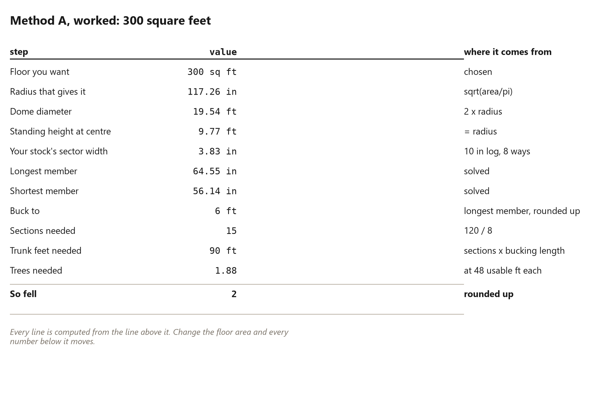

### 4. Round the bucking length up

Your longest member is 64.5 inches. Buck to
6 feet — 72 inches.

You cannot buck to 64.5 inches. Well, you can, but you
should not: a section
cut to exactly the longest member leaves no allowance for the head-end
overfit (Chapter 32), no allowance for the butt cut (Chapter 31), and nothing
at all for the end of a log being split or shaken.

**Round up to the next whole foot and take the waste.** It is the cheapest
line item in the build.

This does mean the design-first path throws away more wood than the tree-first
path, because the tree-first path chooses a dome that uses the whole section.
That is a real cost of getting to pick your diameter, and it is worth saying
out loud rather than discovering in the offcut pile.

### 5. Count sections, then trunk, then trees

The frame needs 120 members. Each section gives
8, so:

> sections = 120 ÷ 8 = 15

> trunk needed = 15 × 6 ft = 90 feet

> trees = 90 ÷ 48 = 1.88

So: **fell 2.**

Notice the number. Designing a 300-square-foot dome from
scratch and sizing the trees to it lands on the same
2 trees that this book's actual build used, from the
opposite direction. That is not a coincidence — it is the size
of dome a pair of ordinary pines makes, and it is why this method produces
houses of roughly this size over and over.

### 6. Check it against the tree you can actually get

Then go and look at the trees.

If the tallest straight trunk you can find is thirty feet rather than
48, your 1.88 trees becomes three. If
your logs are much
thinner at the butt than 12 inches, your members
are narrower, your sticks are longer for the same dome — and thinner, which
Chapter 9 has opinions about.

This is where Method A hands over to Method B, and where Chapter 20's round
trip earns its place.

## Where this method surprises people

**Member length does not scale with the dome.** Double the radius and the
members do not double. They grow by slightly less, because the pinwheel
setback stays the same size while the triangle grows around it.

This is good news at large sizes and bad news at small ones. A very small
dome has members so short relative to their own width that the setback eats a
serious fraction of them, and below a certain size the geometry stops making
sense at all — a stick that is nearly as wide as it is long is not a strut,
it is a block. Chapter 46 says where that line is.

**Height is not a free variable.** In a plain hemisphere, height equals
radius. If you want a wide floor and a ceiling taller than
half that width, you cannot have both from a hemisphere; you need a riser wall
under it (Chapter
38) or a different fraction of a sphere, which is a different book.

**The trees number is rarely a whole one.** You will get
1.88, or 2.4, or 3.1. Round up and accept the leftover, or
shorten the bucking length and see
whether the arithmetic lands better. There is no third option that gets you a
partial tree.

## The lookup table

If you would rather not do any of this, the table below is the whole method
precomputed at this book's stock section. Find your floor area on the left and
read across.

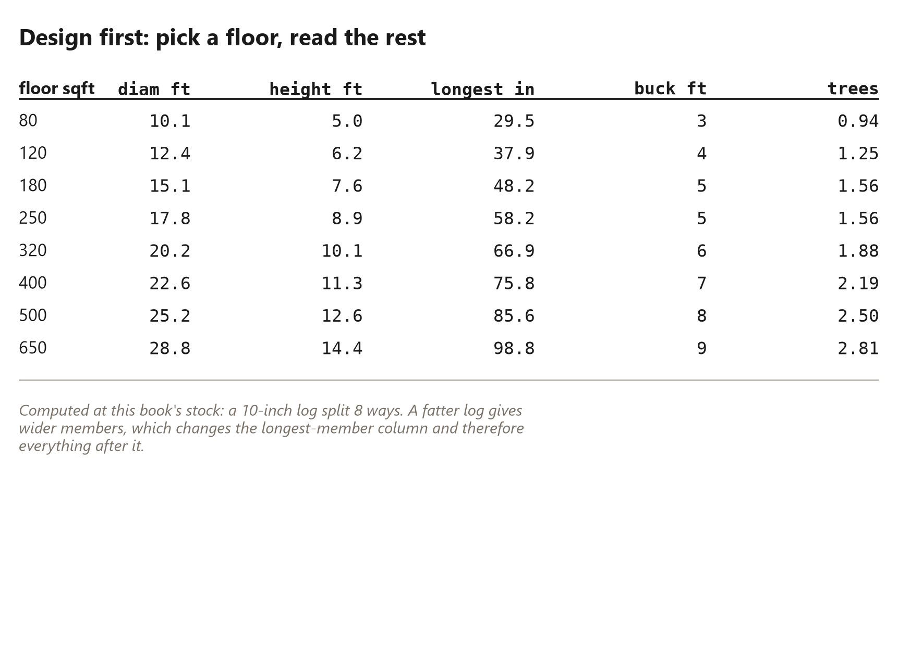

Two warnings about using it:

1. It assumes members 3.83 inches wide. Different logs,
   different table.
2. The `trees` column assumes 48 feet of usable trunk
   per tree. If your trees are shorter — and most are — scale it.

## Then check it the other way

You now have a cut list. Before you cut anything, take the longest member off
that list, hand it to Method B, and see what dome comes back.

It should be the dome you started with. If it is not, you have made an
arithmetic slip or changed an assumption halfway through — a different gasket
thickness, a different split count, a different stock width.

That check is Chapter 20, it takes ten minutes, and it is the reason this
book has two methods rather than one method and a warning.

---

# 19. Method B: From the Tree You Have

*Section length in, dome out*

<!-- Every number in this chapter must come from:
     - book_math.tree_first
     - book_math.BOOK_TREE
     Quote them as live tokens in double braces, never as
     typed digits. The Numbers panel lists every one. -->

## Method B

This is the method the book is named after, and it is the one that produced
the dome in the photographs. It starts from a tree lying on the ground and
ends with a number you did not choose.

That last part is the whole character of the method. In Method A you decide
how big the building is and the woodpile has to comply. Here the woodpile
decides, and your job is to find out what it decided.

## The procedure

### 1. Measure the trunk

Three numbers: diameter at the butt of the usable length, diameter at the
top of it, and the straight length between them.

"Usable" means the part with no bend serious enough to spoil a section and no
branch stub big enough to spoil a stick. It is almost always shorter than the
tree. On this book's tree it was 48 feet, out of a
considerably taller pine — the butt flare went in the fire and the top went
for kindling.

The tree this book is written around measures 12
inches at the butt of that length and 8 at the top.

### 2. Pick a bucking length you can carry

This is the decision, and it is a physical one rather than a mathematical
one. Go and pick up a green section of the length you are considering. If you
cannot get it onto a sawhorse on your own, it is too long, and no amount of
wanting a bigger dome will change that on day six.

This book buckes to 6 feet.

Everything downstream comes from this number. Choose it honestly.

### 3. Count your sections

Divide the usable length by the bucking length and throw away the remainder.
48 feet at 6 feet a section is
8 sections, with 0.0 feet left over.

If the remainder is large it is worth going back to step 2 and trying a
different bucking length. A foot of offcut is firewood; four feet is a stick
you did not get.

### 4. Multiply by eight

Each section splits into 8 sectors of
45 degrees each, and — this is the part that surprises
people who have milled lumber — **each sector is a finished structural
member**. Not a blank to be trimmed. Not stock to be dimensioned. A member.

8 sections × 8 sectors =
**64 struts from one tree.**

Two trees: **128 struts.**

The frame needs **120**.

That is the title of the book, and it is not a slogan. It is
8 spare — about seven per cent — which is roughly the
right margin for a stick that splits along the pith, a butt cut that goes
wrong, and the one panel everybody builds backwards.

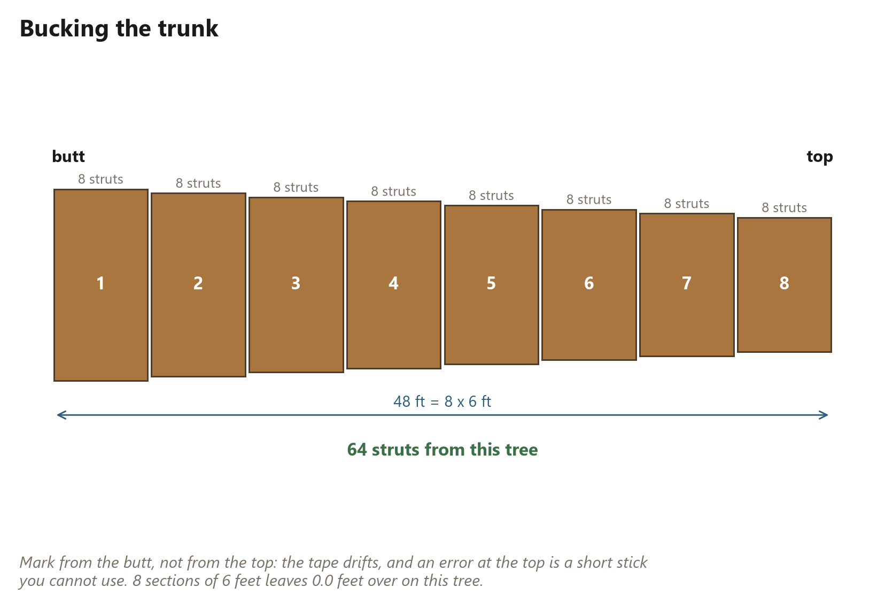

### 5. Find your member's width

The dome does not care how long your sticks are until it knows how *wide*
they are, because the pinwheel setback depends on width.

The width of a sector is the chord across its bark face, measured at the
diameter you are cutting. Use the diameter at the **middle** of the trunk,
not the butt: half your sections come from thinner wood than the butt
suggests, and sizing the layout off the fat end gives you a dome that does
not quite close at the top.

At this tree's mid diameter the sector is 3.83 inches wide and
5.00 inches deep, pith to bark — a cross-section of
9.82 square inches.

For scale: that is 1.23 nominal two-by-fours' worth of
wood, or 1.87 of the dressed boards you would actually
find on a rack. Chapter 42 is about which of those numbers to believe.

### 6. Solve for the dome

Now the arithmetic. The longest member the frame may contain is the longest
stick you have, which is your bucking length: 6 feet.

Find the radius whose longest pinwheel member is exactly that.

This is not a division. As Chapter 17 explained, member length is radius less
a setback that does not scale, so the relationship has to be solved rather
than scaled. The software in this project does it by bisection, and you can
do it by trying radii until the longest member comes out right — it converges
in about six guesses.

The answer for this tree:

| | |
|---|---|
| Radius | 129.33 in |
| Diameter | **21.6 ft** |
| Height at the centre | 10.8 ft |
| Floor | **365 sq ft** |

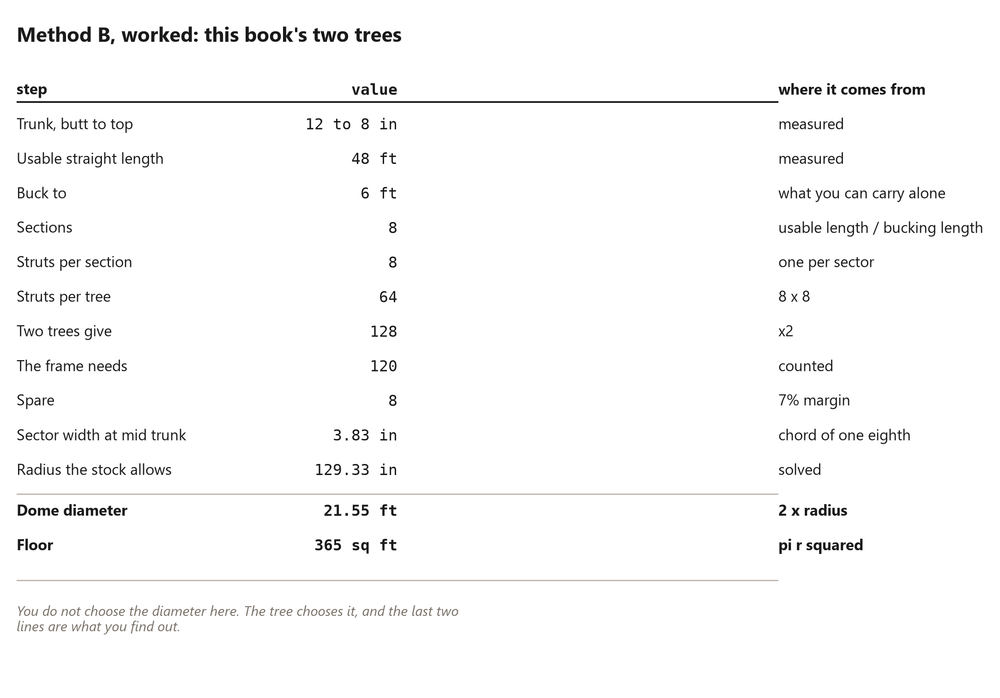

### 7. Read your cut list

The frame's 120 members come in 4
lengths, running from 62.73 inches to
72.00 inches. Thirty of each.

Note that the longest is exactly your stock length, to the last decimal
place. That is not a coincidence and it is not luck — it is what step 6
solved for. It also means you have no margin on the long members at all,
which is why they are cut with the head end deliberately left over-long and
sawn off in place. Chapter 32 is about that.

## You do not get to choose the diameter

This is the part people resist.

You measured a tree, you picked a length you could lift, and out came
21.6 feet. Nobody consulted you. If you wanted twenty-four
feet you cannot have twenty-four feet — not from these trees, bucked this
way, without doing something else that costs you elsewhere.

You have three ways out and they are all in Chapter 22:

* **Buck longer.** A longer section gives a bigger dome, out of fewer and
  heavier pieces, and at some point two trees stop being enough. The table in
  Chapter 19's appendix shows exactly where that line is.
* **Get a third tree.** Fine, if you have one. It is the honest answer and it
  is not a failure.
* **Accept the dome the trees gave you.** Which is what happened here.

What you must not do is design for the dome you wanted and cut for the tree
you have. The frame will not close, and it will not tell you until the last
ring.

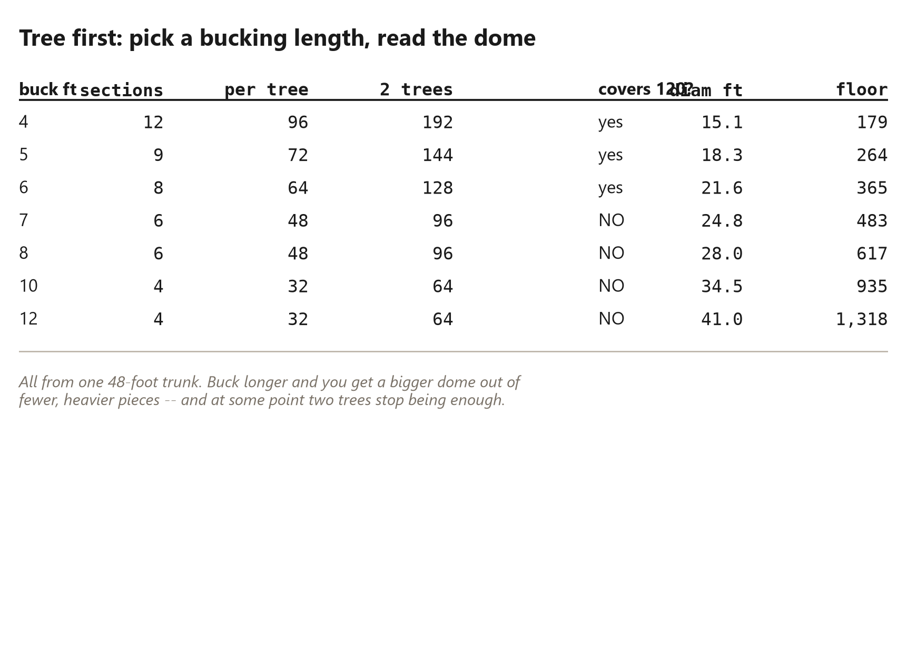

## A note on the second tree

Two trees is 128 struts for a
120-member frame, so the frame actually consumes
1.88 trees. The second tree is not fully used, and
the leftover is not waste — it is the next dome's spare parts, or a porch, or
the sawhorses.

But it does mean the honest headline is not "one dome from two trees." It is
"one dome from a bit under two trees, and you need the second one because you
cannot get eight-tenths of a tree."

Which is a worse title.

---

# 20. The Round Trip

*Proving the two methods are one calculation*

<!-- Every number in this chapter must come from:
     - book_math.round_trip
     Quote them as live tokens in double braces, never as
     typed digits. The Numbers panel lists every one. -->

## The Round Trip

Two chapters ago there were two methods. This chapter is here to show that
there is really only one, held at opposite ends, and to give you a ten-minute
check that catches almost every arithmetic mistake you can make with either.

The reason this matters is not elegance. It is trust.

A book can tell you that a 6-foot stick gives a
21.6-foot dome and you have no way to know whether that came
out of a solver or out of somebody's memory of a similar dome. Rules of thumb
in building books are usually the latter, and they are usually close enough
to be dangerous. So rather than ask you to take it on faith, here is the
check, and here is the actual number it produces.

## Run it forwards, then backwards

Take any radius. Compute the longest member the frame would contain. Now
throw the radius away, and using *only* that member length, compute the
radius that a dome would need in order for that to be its longest member.

If the two methods are one calculation, you land exactly where you started.

* Start: a radius, any radius.
* Forwards (Method A): radius → longest member.
* Backwards (Method B): longest member → radius.
* Compare.

## The residual

Here is the check run on six domes, from small to large:

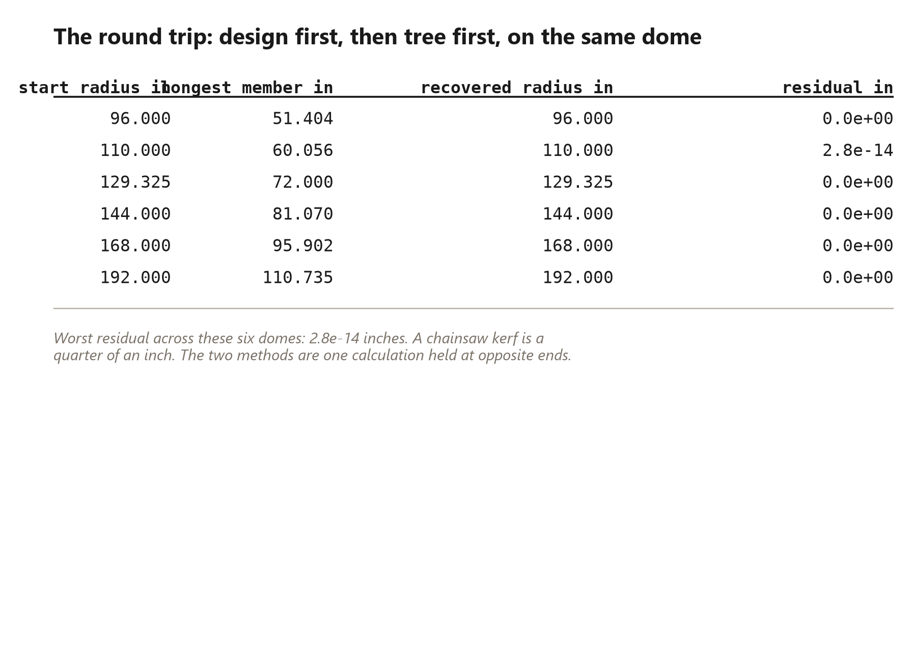

The worst disagreement across all six is **0.0e+00
inches**.

For scale: the kerf of the chain on the saw this book was built with is
0.25 of an inch. The disagreement between the two methods is
smaller than the width of the cut by a factor with a lot of zeroes in it. It
is smaller than the seasonal movement of the wood. It is smaller than
anything you could measure with a tape, a story pole, or a laser.

It is, in other words, zero for every purpose a person with a chainsaw has.

That number is not asserted here. It is computed when this book is exported,
by running the check, and if it ever stops being negligible this sentence
will print a large number and the chapter will be wrong in an obvious way
rather than a quiet one.

## What would break it

The round trip closes because both directions are solving the same
relationship with the same assumptions. Change an assumption between the two
and it will not close — and this is exactly what makes it a useful check,
because those are the mistakes people actually make.

**Change the gasket thickness.** The seam key sits between panels and every
member length accounts for it. Design at 0.75 inches, then
compute your bucking with a half-inch key in mind, and the two answers
diverge. The gap will be small and it will be in the wrong direction — your
sticks will be very slightly too long, forty times over, and the dome will
fight you at the top.

**Change the split count.** Eight sectors gives a member
3.83 inches wide. Six gives a wider one, twelve a narrower
one, and the pinwheel setback moves with it. If you designed for eighths and
then split a few logs into sixths because they were fat, those members are
not interchangeable with the rest, and the round trip on the fat ones will
not close against the layout.

**Change the stock diameter.** Same problem, from the other side. Sizing the
layout off the butt diameter and cutting most of your sections from thinner
wood up the trunk means the members you actually get are narrower than the
ones you designed. Use the mid-trunk diameter, as Chapter 19 step 5 insists.

**Mix up feet and inches.** Says itself. It happens. The round trip catches
it immediately, because the recovered radius comes back off by a factor of
twelve rather than by a thousandth of an inch.

## How to actually do the check

You do not need software.

1. Finish whichever method you used. Write down your radius and your longest
   member.
2. Take the *other* method's procedure from Chapter 18 or 19.
3. Feed it the number you got out, and see if you get back the number you
   put in.

If you are within a quarter of an inch on the radius, you have not made a
mistake worth worrying about. If you are out by more than an inch, stop —
something in the middle changed and you should find out what before you cut a
hundred and twenty of anything.

## Why this chapter exists at all

Because the mistake this is designed to catch is not a mistake in the
arithmetic. It is a mistake in the *assumptions*, and those are invisible.

Arithmetic errors announce themselves: a number is obviously wrong, or the
units are absurd, or the answer is negative. Assumption drift does not.
Everything looks reasonable at every step. You get a cut list of plausible
lengths and you cut a hundred and twenty plausible sticks, and the first
thing that tells you is the frame, on day fourteen, when the last ring is a
half inch short all the way round and there is nothing to be done about it.

Ten minutes with the other method, before anything is cut, is the cheapest
insurance in this book.

---

# 21. The Worked Build

*Every number for this book's dome, in one place*

<!-- Every number in this chapter must come from:
     - book_math.book_math_report
     - book_math.tree_first
     Quote them as live tokens in double braces, never as
     typed digits. The Numbers panel lists every one. -->

## The Worked Build

<!-- [opener] One chapter a builder can work from without reading anything else.
     target: about 300 words
-->

## The tree

<!-- [table] Taper, sections, struts, recovery.
     target: about 200 words
     figure [worked-tree] (book_plot): This book's tree.
-->

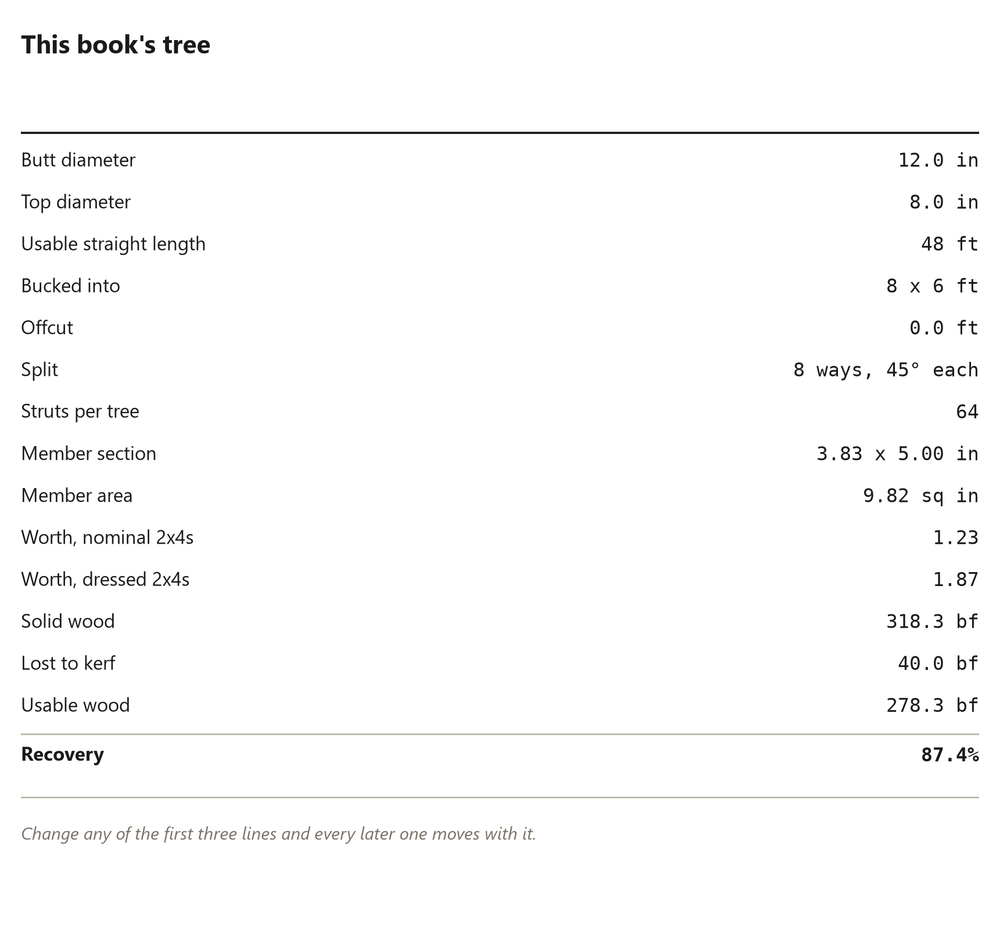

## The dome

<!-- [table] Radius, diameter, height, floor.
     target: about 200 words
     figure [worked-dome] (book_plot): The dome that results.
-->

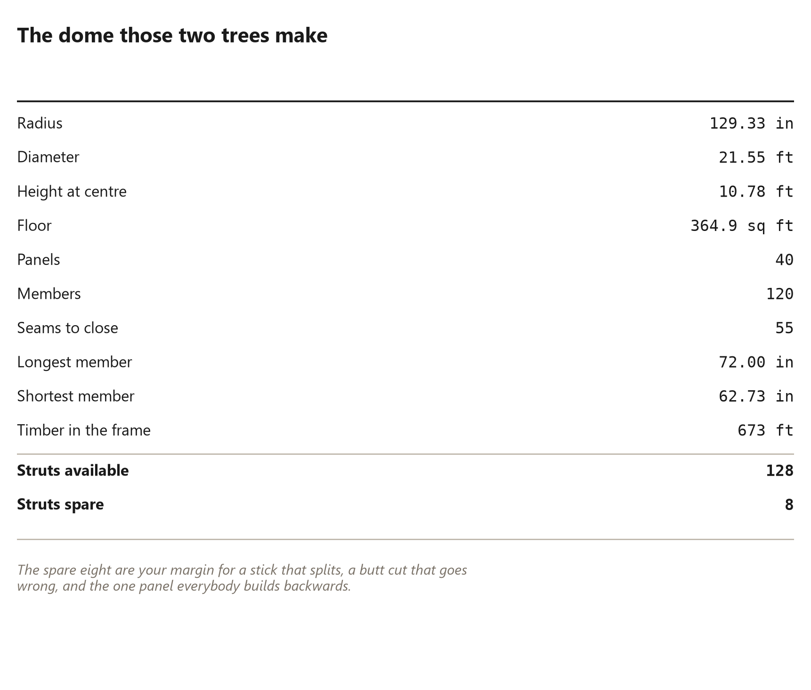

## The cut list

<!-- [table] All 120 members by class and length.
     target: about 200 words
     figure [worked-cutlist] (book_plot): The full cut list.
-->

## The seam schedule

<!-- [table] Every seam and its key.
     target: about 200 words
     figure [worked-seams] (book_plot): The seam schedule.
-->

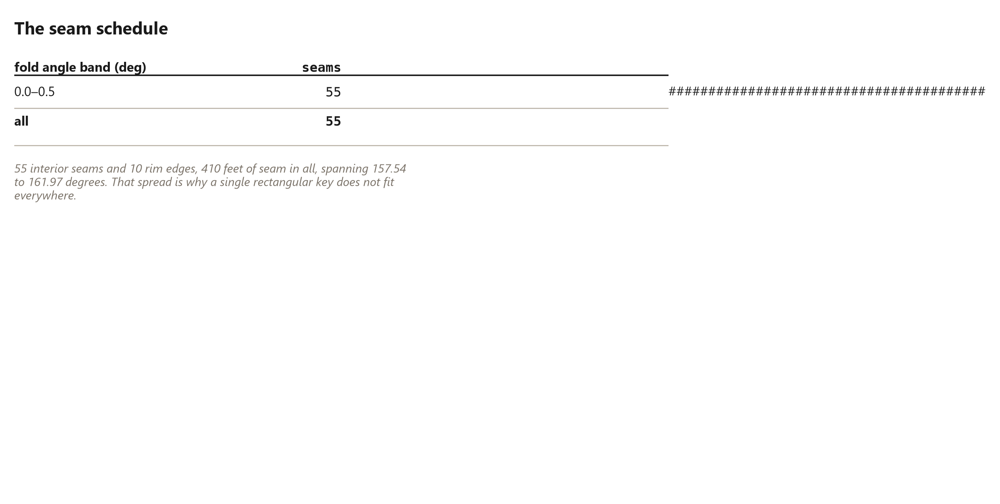

## The dome this describes

<!-- [plate] Full page render of exactly the dome the tables specify.
     figure [worked-render] (raw_wedge_world): 21.6 feet across, 365 square feet of floor.
-->

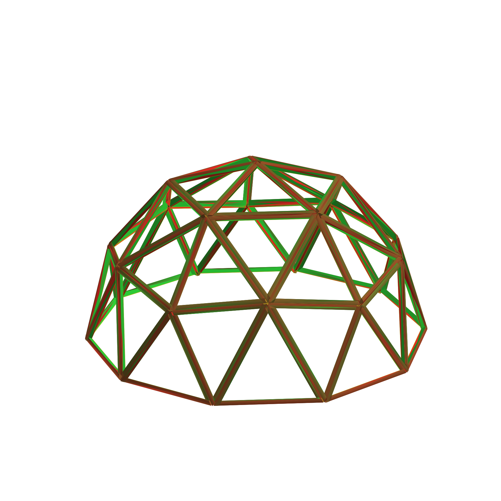

---

# 22. When the Numbers Say No

*Reading a result that means do not build this*

<!-- Every number in this chapter must come from:
     - book_math.tree_first
     - book_math.design_first
     Quote them as live tokens in double braces, never as
     typed digits. The Numbers panel lists every one. -->

## When the Numbers Say No

<!-- [opener] The chapter that gives permission to stop.
     target: about 350 words
-->

## Not enough struts

<!-- [text] What to do when two trees is one hundred and twelve, not one hundred and twenty.
     target: about 700 words
-->

## Too big to lift alone

<!-- [text] A six-foot green wedge is heavy. Say how heavy.
     target: about 650 words
-->

## Stock too small in section

<!-- [text] When the sector is too slender to bear, and what the options are.
     target: about 700 words
-->

## Three ways out

<!-- [text] Shorter bucking, a third tree, or a smaller dome, with the arithmetic for each.
     target: about 750 words
-->

---

# Part 5: The Fortnight

> Fourteen days, one saw, and no help that could not be summoned by phone.

*The story and the manual running together: what happened on each day, and what you should do on yours.*

---

# 23. Day Zero: The Saw

*A hundred and ninety-nine dollars and a sixteen-inch bar*

<!-- Every number in this chapter must come from:
     - book_math.DECLARED
     Quote them as live tokens in double braces, never as
     typed digits. The Numbers panel lists every one. -->

## Day Zero

<!-- [opener] The tool, honestly assessed.
     target: about 350 words
-->

## The smallest saw on the shelf

<!-- [text] What 38.2 cc and a 16-inch bar can and cannot do.
     target: about 900 words
-->

## What I would have bought instead

<!-- [sidebar] The honest counterfactual: a bigger saw, and why it would not have changed the method.
     target: about 400 words
-->

## Setting it up

<!-- [steps] Chain, tension, ripping considerations, bar oil, and the file.
     target: about 800 words
-->

## Chaps, helmet, and never alone

<!-- [safety] The second safety page, placed where the saw actually starts.
     target: about 500 words
-->

---

# 24. Days One and Two: Felling

*Putting two trees on the ground where you want them*

## Felling

<!-- [opener] The most dangerous two days.
     target: about 300 words
-->

## Read this before the notch

<!-- [safety] Escape route, hinge, barber chair, and widow-makers.
     target: about 600 words
-->

## The notch and the back cut

<!-- [steps] The procedure, with the hinge dimension called out.
     target: about 900 words
-->

## The hinge, drawn

<!-- [spread] What the hinge does and what happens when it is wrong.
     target: about 350 words
     figure [felling-hinge] (book_diagram): The hinge steers the tree. Everything else is timing.
-->

## Limbing without pinching

<!-- [text] Working a downed trunk, tension and compression sides.
     target: about 750 words
-->

## What actually happened

<!-- [text] The story half: the second tree did not go where it was supposed to.
     target: about 700 words
-->

---

# 25. Days Three and Four: Bucking

*Cutting the trunk into the only length that matters*

<!-- Every number in this chapter must come from:
     - book_math.BOOK_TREE
     Quote them as live tokens in double braces, never as
     typed digits. The Numbers panel lists every one. -->

## Bucking

<!-- [opener] One measurement, repeated eight times.
     target: about 300 words
-->

## Marking and cutting to length

<!-- [steps] How to mark 6-foot sections on a tapered trunk without a tape drifting.
     target: about 800 words
-->

## Where to start, and why not at the butt

<!-- [text] Choosing the start point around bends and butt flare.
     target: about 700 words
-->

## Eight sections from one trunk

<!-- [spread] The whole trunk laid out with its sections and the offcut.
     target: about 350 words
     figure [bucking-plan] (book_diagram): 48 feet into 8 sections of 6. Offcut: 0.0 feet.
-->

## Moving six-foot green sections alone

<!-- [text] The unglamorous logistics that decide whether this is a one-person job.
     target: about 750 words
-->

---

# 26. Days Five to Eight: Ripping

*One hundred and twenty struts, thirty to an afternoon*

<!-- Every number in this chapter must come from:
     - book_math.fortnight
     - book_math.BOOK_TREE
     Quote them as live tokens in double braces, never as
     typed digits. The Numbers panel lists every one. -->

## Ripping

<!-- [opener] The bulk of the labour, in four days.
     target: about 350 words
-->

## The three passes, at the log

<!-- [steps] The full procedure with the saw actually in hand.
     target: about 1000 words
-->

## Holding a round section still

<!-- [text] The cradle, the wedges, and why the first pass is the hard one.
     target: about 800 words
-->

## Reading the pith

<!-- [text] Aiming a rip at the centre of a section that is not round.
     target: about 700 words
-->

## The cutting rhythm

<!-- [spread] What thirty struts in six hours actually looks like as a sequence.
     target: about 400 words
     figure [ripping-rhythm] (book_plot): 5.0 struts an hour, sustained.
-->

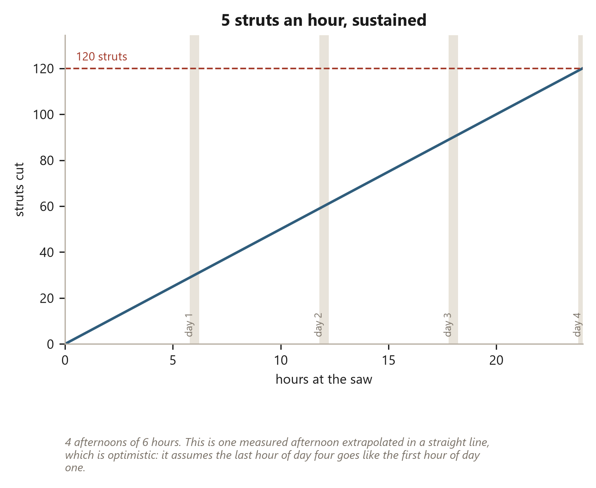

## Chain, file, and the cost of a dull cut

<!-- [text] Sharpening cadence and what a dull chain does to the kerf and to you.
     target: about 700 words
-->

## What this is worth an hour

<!-- [sidebar] The money, both ways, with the caveat attached.
     target: about 450 words
-->

---

# 27. Day Nine: The Jig

*One flat bench that makes forty panels the same*

<!-- Every number in this chapter must come from:
     - raw_wedge_bridge.jig_stages
     Quote them as live tokens in double braces, never as
     typed digits. The Numbers panel lists every one. -->

## The Jig

<!-- [opener] The day that pays for itself.
     target: about 350 words
-->

## Why a jig and not a tape

<!-- [text] Repeatability beats accuracy when there are forty of something.
     target: about 750 words
-->

## Building it

<!-- [steps] The bench, the triangle, the rails, the fences, the cut planes.
     target: about 1000 words
-->

## The jig, complete

<!-- [plate] Full page of the finished fixture.
     figure [jig-complete] (raw_wedge_jig): The fixture every panel is built on.
-->

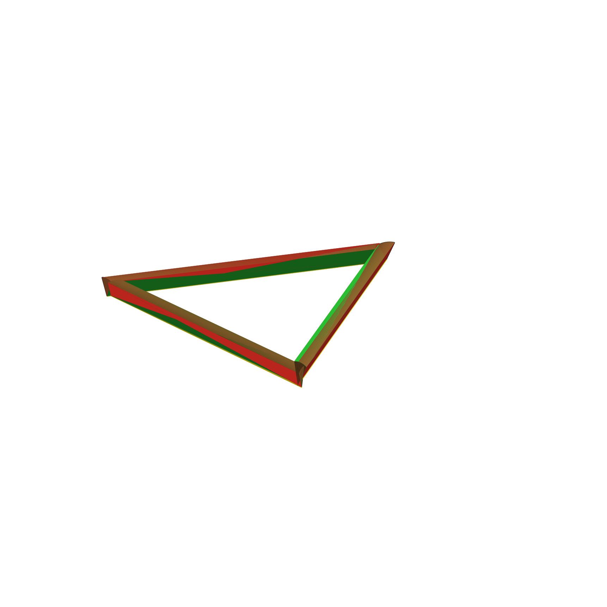

---

# 28. Days Ten to Twelve: Forty Panels

*The same twelve motions, forty times*

<!-- Every number in this chapter must come from:
     - raw_wedge_bridge.jig_stages
     - raw_wedge_bridge.model
     Quote them as live tokens in double braces, never as
     typed digits. The Numbers panel lists every one. -->

## Forty Panels

<!-- [opener] The production days, and what makes them go wrong.
     target: about 350 words
-->

## One panel, start to finish

<!-- [steps] The twelve jig steps as a followable procedure.
     target: about 1100 words
-->

## Sorting the pile

<!-- [text] Which stick goes where, and the marking scheme that survives being left in the rain.
     target: about 700 words
-->

## The fourth panel is the first good one

<!-- [text] Honest note on the learning curve.
     target: about 550 words
-->

## Panel variants

<!-- [table] Which panels are genuinely different, and how few there are.
     target: about 250 words
     figure [panel-variants] (book_plot): How many distinct panels the dome actually contains.
-->

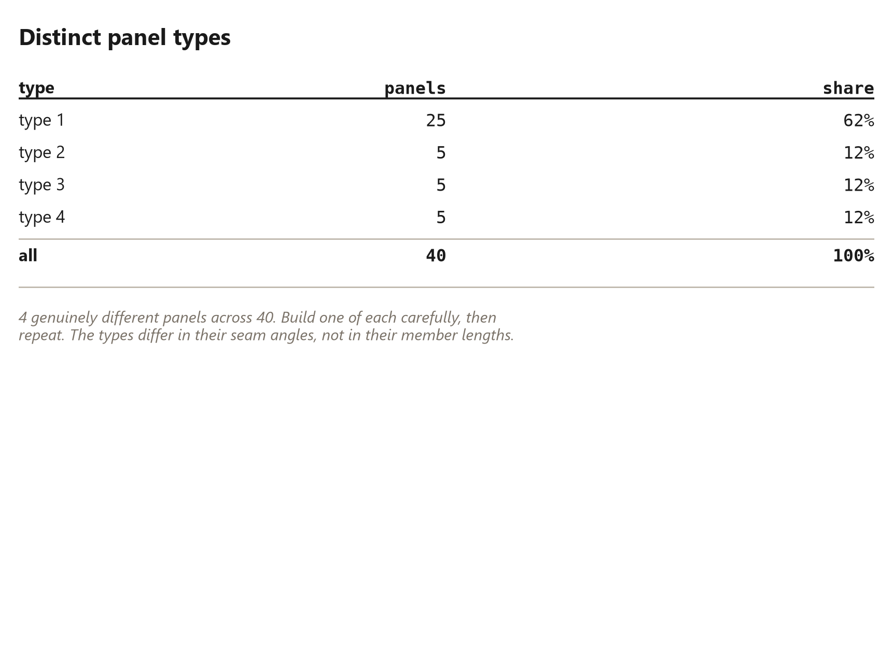

---

# 29. Days Thirteen and Fourteen: Raising

*Forty panels become one building*

<!-- Every number in this chapter must come from:
     - book_math.frame_counts
     Quote them as live tokens in double braces, never as
     typed digits. The Numbers panel lists every one. -->

## Raising

<!-- [opener] The two days that look like the photographs.
     target: about 350 words
-->

## Bottom ring first

<!-- [steps] The assembly order that lets one person do it.
     target: about 1000 words
-->

## Propping, and what holds it up before it is closed

<!-- [text] The temporary structure nobody photographs.
     target: about 750 words
-->

## Closing the top

<!-- [text] The last panel, and why it is the hardest.
     target: about 650 words
-->

## Standing

<!-- [plate] Full page. The frame complete.
     figure [standing-frame] (raw_wedge_world): Day fourteen. 120 members, two trees.
-->

## What was not done

<!-- [text] Honest inventory of what a standing frame is not: not a shell, not a home, not finished.
     target: about 600 words
-->

---

# Part 6: The Jig and the Cuts

> Any error in stock length or butt angle leaves as offcut instead of building up around the triangle.

*Reference for the bench. Come back to this part while you are working, not while you are reading.*

---

# 30. One Bench, Forty Panels

*What the jig is and what each part of it does*

<!-- Every number in this chapter must come from:
     - raw_wedge_bridge.jig_stages
     Quote them as live tokens in double braces, never as
     typed digits. The Numbers panel lists every one. -->

## One Bench

<!-- [opener] The fixture, part by part.
     target: about 300 words
-->

## The twelve stages

<!-- [table] Every stage of the jig, named, straight from the simulator.
     target: about 300 words
     figure [jig-stages] (book_plot): The twelve stages, in order.
-->

## The jig, labelled

<!-- [spread] Every component called out.
     target: about 400 words
     figure [jig-labelled] (raw_wedge_jig): Bench, triangle, rails, fences, cut planes.
-->

## Setting it out on a real floor

<!-- [text] How to lay the triangle out full size with a string and a pencil.
     target: about 800 words
-->

---

# 31. The Butt Cut

*The one compound angle, made before anything is assembled*

<!-- Every number in this chapter must come from:
     - raw_wedge_bridge.model
     Quote them as live tokens in double braces, never as
     typed digits. The Numbers panel lists every one. -->

## The Butt Cut

<!-- [opener] Name it honestly: this is a compound cut.
     target: about 350 words
-->

## The angle its neighbour presents

<!-- [text] Where the butt angle comes from, geometrically.
     target: about 800 words
-->

## Butt cut setups

<!-- [table] Every distinct setup, from the simulator's own setup list.
     target: about 300 words
     figure [butt-setups] (book_plot): How few distinct setups the whole dome needs.
-->

## Making it

<!-- [steps] At the saw, with the allowance still attached.
     target: about 750 words
-->

---

# 32. The Head Overfit

*Deliberately cutting it too long*

<!-- Every number in this chapter must come from:
     - book_math.DECLARED
     - raw_wedge_bridge.model
     Quote them as live tokens in double braces, never as
     typed digits. The Numbers panel lists every one. -->

## The Head Overfit

<!-- [opener] The idea that makes the whole method tolerant.
     target: about 400 words
-->

## Where error goes

<!-- [text] The core argument: overshoot, pull tight, then cut in place.
     target: about 850 words
-->

## Long, then flush

<!-- [spread] The same panel before and after the flush cut.
     target: about 350 words
     figure [head-overfit] (raw_wedge_jig): 6 inches of deliberate overshoot, sawn off against the fence.
-->

## How much to leave

<!-- [text] Sizing the overfit against your own stock variation.
     target: about 700 words
-->

## Offcut per dome

<!-- [table] What the tolerance costs in wood.
     target: about 250 words
     figure [offcut-total] (book_plot): The price of the tolerance, in board feet.
-->

---

# 33. Flush-Cutting in Place

*The cut that makes the panel true*

<!-- Every number in this chapter must come from:
     - raw_wedge_bridge.jig_stages
     Quote them as live tokens in double braces, never as
     typed digits. The Numbers panel lists every one. -->

## Flush-Cutting

<!-- [opener] The final operation on the jig.
     target: about 300 words
-->

## Against the fence

<!-- [steps] The procedure, with the saw held the way it has to be held.
     target: about 750 words
-->

## Why this cannot be done first

<!-- [text] The order is not arbitrary and this says why.
     target: about 600 words
-->

---

# 34. Panel Drawings

*One flat drawing per distinct panel, full size*

<!-- Every number in this chapter must come from:
     - raw_wedge_bridge.model
     Quote them as live tokens in double braces, never as
     typed digits. The Numbers panel lists every one. -->

## Panel Drawings

<!-- [opener] How to use the drawings, and how to print them full size.
     target: about 400 words
-->

## Panel drawing, type one

<!-- [plate] A full-page flat drawing, exported from the simulator.
     figure [panel-1] (panel_jig_svg): Panel type one, flat, full size.
-->

## Panel drawing, type two

<!-- [plate] The second distinct panel.
     figure [panel-2] (panel_jig_svg): Panel type two, flat, full size.
-->

## Reading a panel drawing

<!-- [text] What every line on the drawing is.
     target: about 650 words
-->

---

# 35. Where Error Goes

*A tolerance budget for a building made of split logs*

## Where Error Goes

<!-- [opener] The chapter that explains why the method survives imprecision.
     target: about 400 words
-->

## Four places error can land

<!-- [text] Stock length, butt angle, seam gap, and the ring.
     target: about 900 words
-->

## Three of them are absorbed

<!-- [text] Which errors the method eats and which it accumulates.
     target: about 800 words
-->

## The tolerance budget

<!-- [spread] Where a sixteenth of an inch ends up.
     target: about 400 words
     figure [tolerance-budget] (book_diagram): Error, and where the method sends it.
-->

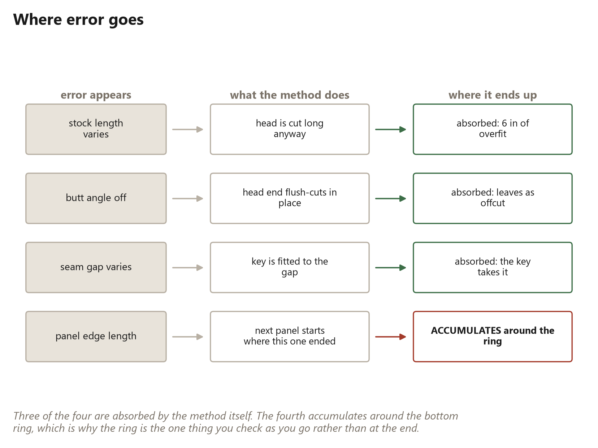

## The one that accumulates

<!-- [text] Name it: the bottom ring. Say how to check it as you go.
     target: about 700 words
-->

---

# Part 7: From Frame to Home

> A standing frame is not a house. It is the fortnight's result, and the beginning of the year's work.

*What happens after day fourteen: shell, openings, weather, and living in a round room.*

---

# 36. The Footing and the Ring

*What the dome stands on*

## The Footing

<!-- [opener] The part that is under everything.
     target: about 300 words
-->

## Ten points, or one ring

<!-- [text] The two approaches, and why the ring is usually right here.
     target: about 850 words
-->

## Setting out a circle accurately

<!-- [steps] String, stake, and the check that catches an out-of-round ring before it matters.
     target: about 800 words
-->

## Anchoring against uplift

<!-- [text] A dome is a wing. Say so.
     target: about 700 words
-->

## This is where to ask somebody

<!-- [safety] Footings are load and soil. Point at the professional.
     target: about 350 words
-->

---

# 37. Closing the Shell

*Forty triangles of something over forty triangles of nothing*

<!-- Every number in this chapter must come from:
     - dome_costing.shell_sqft
     Quote them as live tokens in double braces, never as
     typed digits. The Numbers panel lists every one. -->

## Closing the Shell

<!-- [opener] The options, ranked by how much they cost and how well they work.
     target: about 400 words
-->

## Sheathing a triangle

<!-- [text] Cutting sheet goods to a triangle without wasting half of every sheet.
     target: about 850 words
-->

## Nesting the cuts

<!-- [text] The layout that gets two panels from one sheet.
     target: about 700 words
-->

## Sheet count

<!-- [table] How many sheets the shell takes, computed.
     target: about 250 words
     figure [sheet-count] (book_plot): Shell area and sheets, from the solved geometry.
-->

## The alternatives

<!-- [text] Fabric, shingle, living roof, and what each demands of the frame.
     target: about 800 words
-->

---

# 38. Doors, Windows and the Rim

*Cutting holes in something that works by being closed*

## Doors and Windows

<!-- [opener] The chapter where a dome fights back.
     target: about 400 words
-->

## A door at the rim

<!-- [text] The easy case, and how to frame it.
     target: about 800 words
-->

## A window in a panel

<!-- [text] The harder case: keeping the triangle triangulated.
     target: about 850 words
-->

## Three openings that work

<!-- [spread] Rim door, panel window, and the risers option.
     target: about 400 words
     figure [openings-three] (book_diagram): Three ways to open a dome without un-triangulating it.
-->

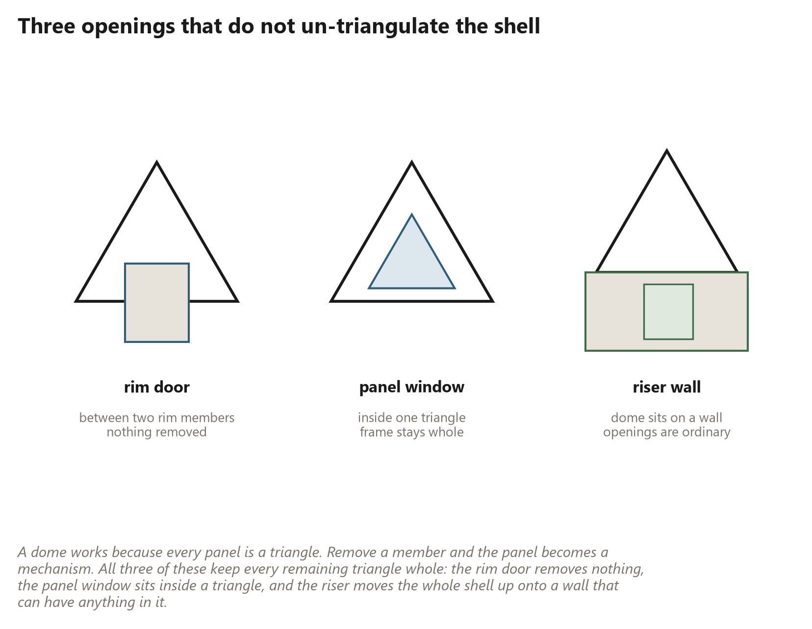

## Risers: cheating height at the rim

<!-- [text] The vertical wall under the dome, and what it buys.
     target: about 700 words
-->

---

# 39. Weather and Water

*Where it leaks, and where the water goes*

<!-- Every number in this chapter must come from:
     - book_math.panel_seam_count
     Quote them as live tokens in double braces, never as
     typed digits. The Numbers panel lists every one. -->

## Weather and Water

<!-- [opener] The honest chapter about domes and rain.
     target: about 400 words
-->

## Every seam is a potential leak

<!-- [text] 55 of them. Say the number.
     target: about 750 words
-->

## Shedding, not sealing

<!-- [text] The principle that actually works on a compound surface.
     target: about 800 words
-->

## Harvesting it instead

<!-- [text] A dome is a very good rain collector, and this is the one place the shape helps.
     target: about 700 words
-->

## Condensation and the inside face

<!-- [text] The problem people discover in month three.
     target: about 650 words
-->

---

# 40. Inside a Round Room

*Living with curves*

<!-- Every number in this chapter must come from:
     - book_math.tree_first
     Quote them as live tokens in double braces, never as
     typed digits. The Numbers panel lists every one. -->

## Inside a Round Room

<!-- [opener] What it is actually like.
     target: about 400 words
-->

## Where the usable floor really is

<!-- [text] The honest number: floor area against floor you can stand up on.
     target: about 800 words
-->

## Standing height, mapped

<!-- [spread] A plan of the floor coloured by headroom.
     target: about 350 words
     figure [headroom-map] (book_plot): 365 square feet of floor. Rather less of it lets you stand up.
-->

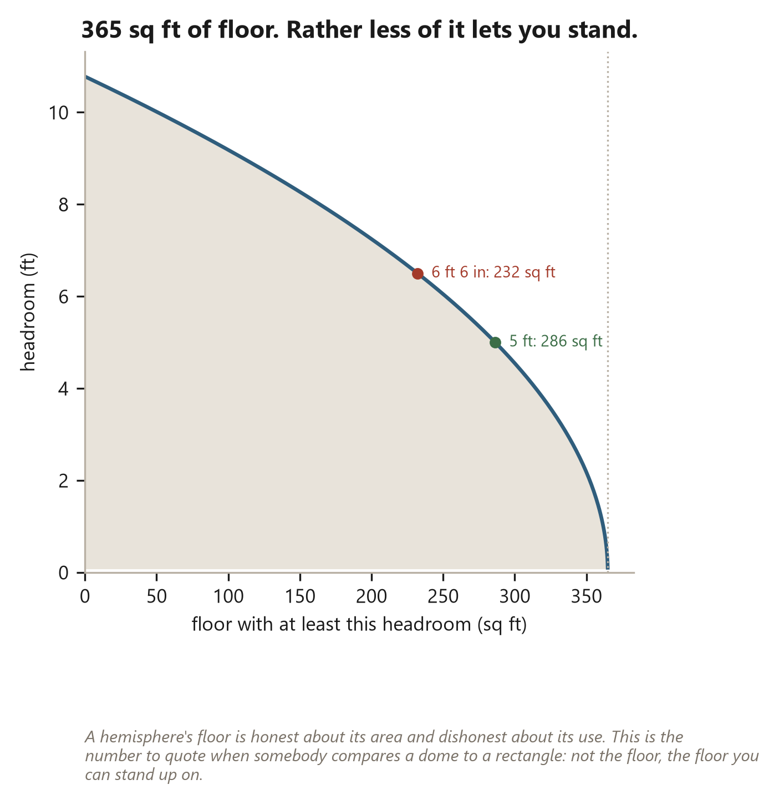

## Furniture, storage and the wall that curves away

<!-- [text] Practical solutions, including the ones that are just compromises.
     target: about 800 words
-->

## Acoustics, and the whispering problem

<!-- [text] A hemisphere focuses sound at the centre. Deal with it.
     target: about 600 words
-->

---

# 41. Heat, Power and the Small Systems

*Making a shell into somewhere you can be in February*

## The Small Systems

<!-- [opener] What has to happen before it is a home.
     target: about 350 words
-->

## Insulating between wedges

<!-- [text] The cavity a wedge frame gives you, and what fits in it.
     target: about 850 words
-->

## Running services in a frame with no studs

<!-- [text] Where the wires and pipes go.
     target: about 750 words
-->

## Heating a round volume

<!-- [text] Why it is easier than a rectangle, and the one way it is not.
     target: about 700 words
-->

## Off grid, or not

<!-- [text] Honest treatment of the choice, without romance.
     target: about 700 words
-->

---

# Part 8: What It Actually Cost

> Several pages in this book exist specifically to state the number that does not help the argument.

*The accounting. Money, hours, breakage, and the claims this project got wrong.*

---

# 42. The Money, Both Ways

*What was spent, and what was avoided*

> **This chapter corrects something.** The $50/hour figure in the project brief, which doubled a volume ratio for safety rather than computing the section.

<!-- Every number in this chapter must come from:
     - book_math.fortnight
     - book_math.BOOK_TREE
     Quote them as live tokens in double braces, never as
     typed digits. The Numbers panel lists every one. -->

## The Money

<!-- [opener] How this chapter counts, before it counts.
     target: about 400 words
-->

## What was actually spent

<!-- [table] Saw, fuel, chain, fasteners, gaskets, sheeting.
     target: about 300 words
     figure [money-spent] (book_plot): Cash out, itemised.
-->

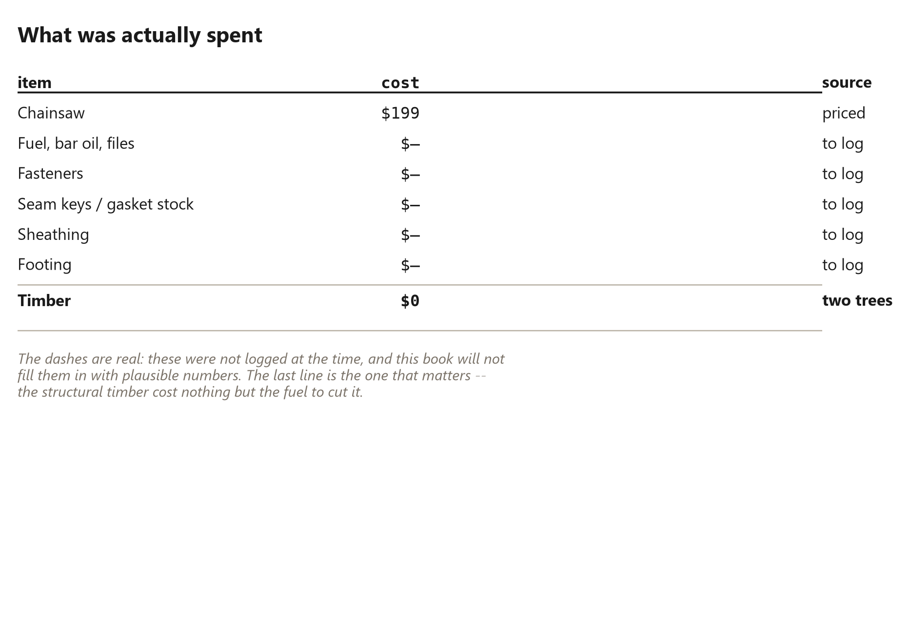

## Substitution value is not income

<!-- [text] The most important paragraph in the chapter.
     target: about 700 words
-->

## The strut, valued three ways

<!-- [table] Nominal 2x4, dressed 2x4, and board feet.
     target: about 300 words
     figure [strut-value] (book_plot): One strut, valued three ways. The numbers disagree and the reasons are printed.
-->

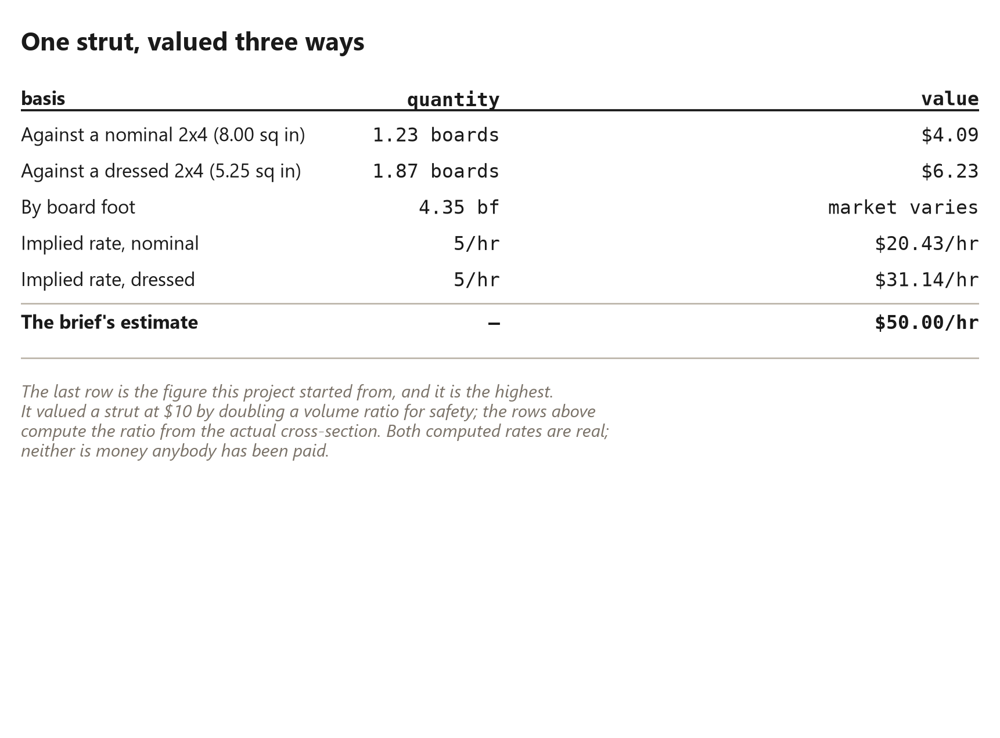

## The fifty dollars an hour claim

<!-- [errata] The brief said fifty. Computed properly it is 20.43 nominal, 31.14 dressed. Name the error, then show the arithmetic that produces the smaller number.
     target: about 650 words
-->

---

# 43. The Hours

*Where fourteen days actually went*

<!-- Every number in this chapter must come from:
     - book_math.fortnight
     Quote them as live tokens in double braces, never as
     typed digits. The Numbers panel lists every one. -->

## The Hours

<!-- [opener] Time, honestly logged.
     target: about 300 words
-->

## The fortnight, hour by hour

<!-- [table] Each day, what was done, how long it took.
     target: about 350 words
     figure [hours-log] (book_plot): Fourteen days, and where they went.
-->

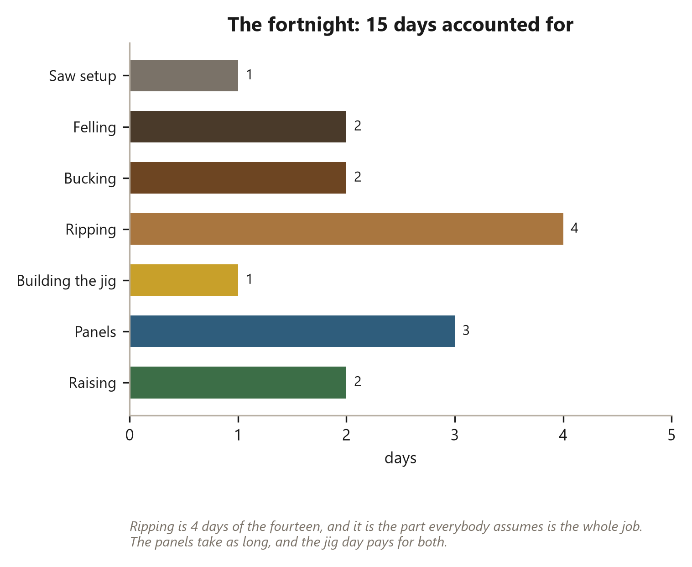

## What took longest and why

<!-- [text] The surprises: not the ripping.
     target: about 750 words
-->

## What a second build would take

<!-- [text] The learning-curve estimate, marked clearly as an estimate.
     target: about 600 words
-->

---

# 44. What Broke

*The failures, listed*

## What Broke

<!-- [opener] The chapter every build book should have and most do not.
     target: about 350 words
-->

## The stick that split along the pith

<!-- [text] What happened, why, and how to spot it first.
     target: about 700 words
-->

## The seam that would not close

<!-- [text] The fold-angle problem, encountered in the flesh.
     target: about 750 words
-->

## The panel I built backwards

<!-- [text] Handedness, and the marking scheme that came from this.
     target: about 650 words
-->

## What I would call a near miss

<!-- [text] The safety incident, reported rather than tidied away.
     target: about 600 words
-->

---

# 45. Corrections

*Everything this project has published and had to fix*

> **This chapter corrects something.** Every published claim this project has had to revise.

<!-- Every number in this chapter must come from:
     - book_math.frame_counts
     - book_math.panel_seam_count
     - book_math.BOOK_TREE.recovery
     Quote them as live tokens in double braces, never as
     typed digits. The Numbers panel lists every one. -->

## Corrections

<!-- [opener] State the policy: a correction is a chapter, never a silent re-cut.
     target: about 450 words
-->

## The mitre claim

<!-- [errata] Named in full, with the film that corrected it.
     target: about 500 words
-->

## The recovery percentage

<!-- [errata] 88 for the brief's tree, 87.4 for this one. Neither is wrong; they are different trees.
     target: about 450 words
-->

## The hourly rate

<!-- [errata] Cross-referenced to chapter 42.
     target: about 350 words
-->

## Seams against edges

<!-- [errata] 65 edges, 55 seams. An early draft of this book used the wrong one.
     target: about 400 words
-->

## How to report one

<!-- [text] Invite the reader to find the next error, and say where to send it.
     target: about 400 words
-->

---

# Part 9: Take It Further

> Smaller units, more room for error, and minimum impact when errors occur.

*Where the method goes next, and what it does not cover.*

---

# 46. Bigger, Smaller, Other Frequencies

*Changing the dome without changing the method*

<!-- Every number in this chapter must come from:
     - wedge_geometry.member_classes
     Quote them as live tokens in double braces, never as
     typed digits. The Numbers panel lists every one. -->

## Other Frequencies

<!-- [opener] What 3V and 4V change, and what they do not.
     target: about 400 words
-->

## More panels, shorter sticks

<!-- [text] The trade, stated as arithmetic.
     target: about 800 words
-->

## Frequency comparison

<!-- [table] 2V, 3V, 4V on panel count, member classes and longest member.
     target: about 300 words
     figure [frequency-compare] (book_plot): What each frequency asks of the woodpile.
-->

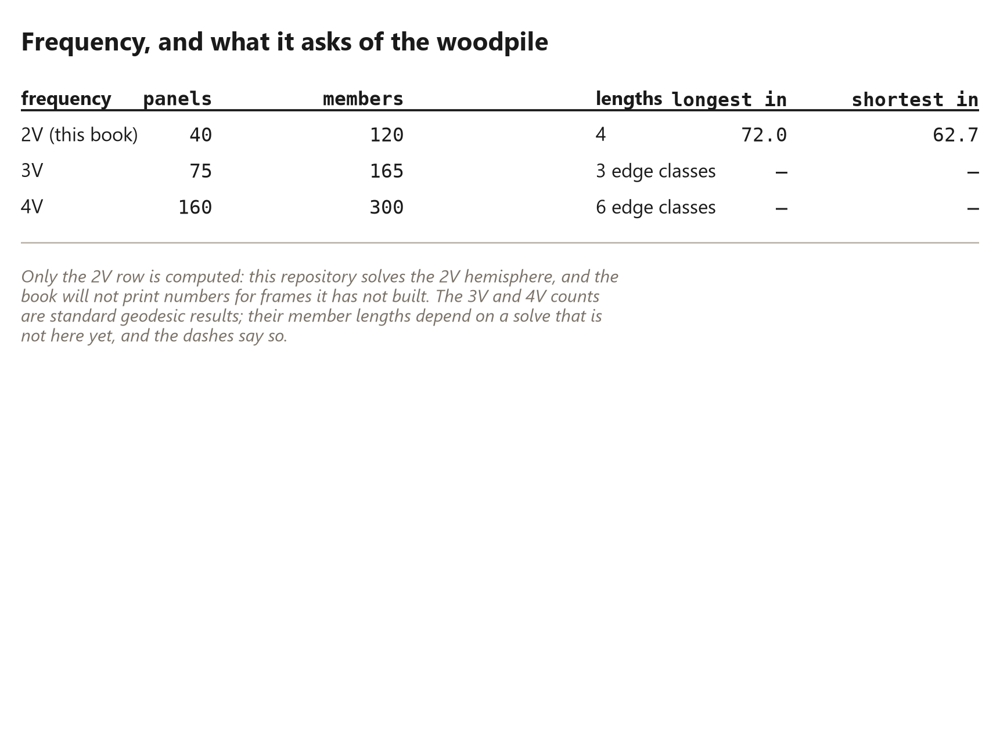

## Where the method stops working

<!-- [text] Too small and the sector is too fat for the panel.
     target: about 700 words
-->

---

# 47. Other Species, Other Sections

*Hardwood, hemlock, and a trunk that is not round*

## Other Species

<!-- [opener] What changes when the tree is not pine.
     target: about 400 words
-->

## Density, splitting and the drying schedule

<!-- [text] Practical differences, species by species.
     target: about 900 words
-->

## A trunk that is oval

<!-- [text] Splitting an out-of-round section into eight usable members.
     target: about 750 words
-->

## Green versus dry

<!-- [text] Building with green wood, and what it does over the first year.
     target: about 800 words
-->

---

# 48. Building With Other People

*What changes when there are three of you*

## Other People

<!-- [opener] The method was designed for one; here is what a crew changes.
     target: about 400 words
-->

## Parallel jigs

<!-- [text] Two benches, and the sorting problem that follows.
     target: about 700 words
-->

## Teaching the twelve steps

<!-- [text] How to hand the procedure to somebody in an afternoon.
     target: about 700 words
-->

## A build that is not yours

<!-- [text] Helping somebody else, and the liability conversation.
     target: about 600 words
-->

---

# 49. What I Would Do Differently

*The honest closing chapter*

## What I Would Do Differently

<!-- [opener] Close the story strand where it started: one person, one saw.
     target: about 400 words
-->

## The five decisions I would change

<!-- [text] Specific, named, with what each would have cost.
     target: about 1000 words
-->

## What I would keep exactly

<!-- [text] The parts that were right the first time.
     target: about 700 words
-->

## The next one

<!-- [text] What the second dome is, and why.
     target: about 700 words
-->

## The dome, a year on

<!-- [plate] The closing image.
     figure [closing-image] (photo_slot): One year on.
-->

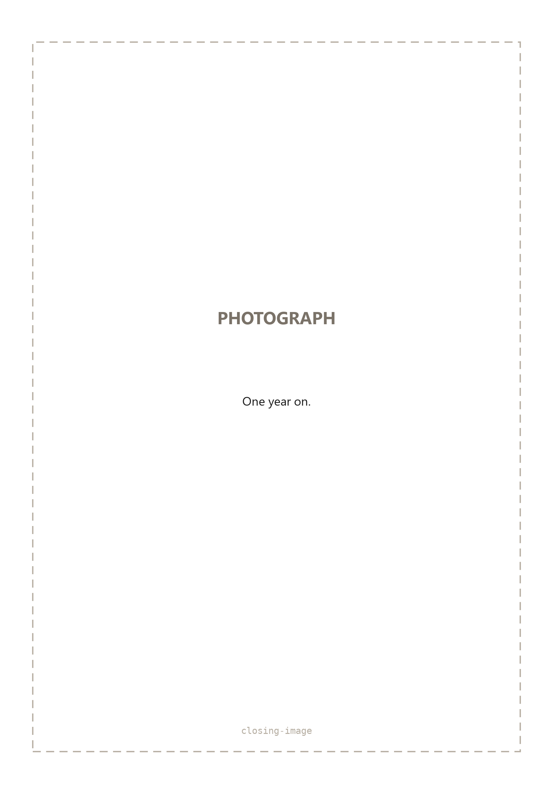

---

# The Master Tables

## Full cut list

*Every member, by class, length and count.*

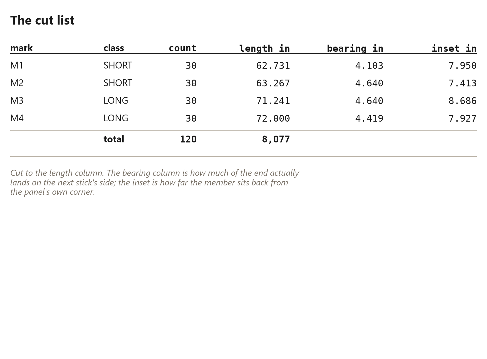

**(not written yet)**

## Full seam schedule

*Every seam, its fold angle and its key.*

**(not written yet)**

## Butt cut setups

*Every distinct saw setup in the build.*

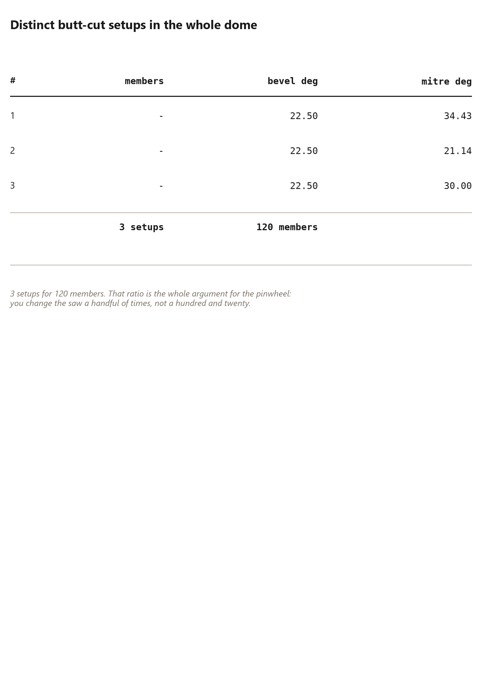

**(not written yet)**

## Declared constants

*The inputs table, repeated for reference.*

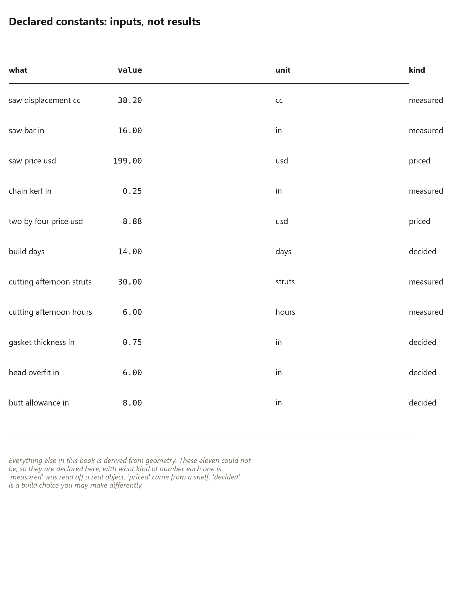

**(not written yet)**

---

# Glossary

## Glossary

*Every term the book uses that a reader may not have.*

**(not written yet)**

---

# The Software in This Book

## What generated these numbers

*Name every module, what it computes, and how to run it.*

**(not written yet)**

## Reproducing every figure in this book

*The actual commands, so a reader can regenerate the lot.*

**(not written yet)**

## The launcher

*How to open any of it without touching a command line.*

**(not written yet)**

---

# Index and Colophon

## Index

*Generated from the manuscript.*

**(not written yet)**

## Colophon

*How the book was made, including the fact that its arithmetic is a test suite.*

**(not written yet)**

---
