# The 40 Hour Cabin: 3 Trees

*One small chainsaw, three trees, forty hours or less: a geodesic wedge cabin, winched up between the trees, skinned and floored in any order*

Exported 2026-10-03. Every figure in this file was computed at export time from the geometry in this repository.

---

# Cover

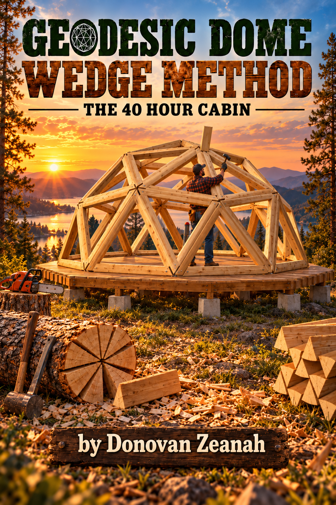

---

# Title pages

## Title page

The 40 Hour Cabin: 3 Trees

*One small chainsaw, three trees, forty hours or less: a geodesic wedge
cabin, winched up between the trees, skinned and floored in any order.*

A builder's manual: the geometry, fabrication, construction and variations
of a hubless timber geodesic system, documented from one standing
prototype — raised between two trees on three cables, because that is how
this one was actually built.

By the builder. Built with the tools included with this book, which are
named in the back.


That is the whole claim in one picture: a frame of 120 members,
cut from 3 trees, standing on day fourteen of the fortnight this
book teaches — and the fortnight's hands-on total is the title's other
claim, counted below.

## The forty hours

The title is an arithmetic, not a slogan. The clock is the one the
companion wedge book prints, and every rate in it is a measured session
figure rather than a process estimate:

**At the log.** The frame's 120 members, split at the
measured 30 wedges per 4-hour
session: **16 hours** of splitting.

**From wedge to standing.** Each member erected at
15 minutes: **30 straight hours**
of assembly.

**With the error allowance.** A 25 per cent allowance on
the erection, because a first build always pays its tuition:
**37.5 hours** — inside the 40-hour week the title
is named after, with 2.5 hours to spare.

The honest reading, stated once and used everywhere after: the forty
hours is the *building* — the frame, from split wedges to standing, in
forty hours or less. The harvest that produces the wedges is a further
16 hours at the log, and the skin, the floor and the
ground are added later, in any order, which is the point of the next
page and of the whole book.

## The part you are allowed to get wrong

Your skull is not symmetrical either, and it protects the brain just
fine. This book builds on that sentence.

A frame's job is to be a *frame*: forty triangles whose lengths set
their angles, standing because the shape cannot fall without stretching
a stick. It does not have to be pretty, milled, graded or symmetrical —
the lumpy skull protects the brain, and the lumpy frame holds the
cabin. The parts that must be right are the two that touch the
weather and the earth: the **skin**, and the **ground**. Those are the
chapters this book treats with the most care, and they are the parts
that can be added, replaced or removed in any order — the frame is
hot-swappable by design, because every panel, every layer, every floor
and every pad is a separate object that bolts on and off.

The build order this book actually used is the order its title page
promises: frame first, winched between the trees, then whatever the
winter asks for — skin before floor, floor before skin, the ground
last of all. The book is written so that any order works.

## Copyright, and the engineer's note

Copyright © 2026, the author.

This book documents construction methods, geometric principles, prototype
builds and design possibilities. It is not a substitute for site-specific
structural engineering, and nothing in it is offered as code-compliant
design. Codes, loads, materials, soil conditions and permitting
requirements vary by place and by site. A structure intended for permanent
occupancy -- and anything carrying snow, wind or people you are not
prepared to lose -- should be reviewed by a qualified engineer and the
local authority before it is built. The floating rig of the closing
chapters is a design possibility, priced but not rated: the trees, the
cables, the mast and the hoist all carry real loads, and none of those
ratings is in this book.

Three kinds of claim run through this book, and each is labelled so they
cannot be mistaken for one another:

**Known geometry.** A fact of the solved frame, true at every size: a 2V
dome of this configuration has this many members, at these ratios. These
are calculations, and the book shows the calculation behind each one.

**Tested construction.** Something that happened on the standing prototype
this book is written around: the joint that was used, the fortnight that
was clocked, the winch raise that put the cabin between the trees, the
mistake that was made and corrected. These are reports, not promises.

**Design possibilities.** Things that are priced or drawn but not yet
built: the rotating pad, the iris, the network. Each is marked as such
where it appears, and the closing chapter restates every claim in the book
as the condition it rests on.

A method whose three kinds of claim are kept apart is a method a reader
can check. That separation is the point of this book, and the rest of it
is the working out.

---

# What this book is

3 trees, one chainsaw off a hardware-store shelf, one hundred
and twenty structural members, and a geodesic dome standing in fourteen
days — 37.5 hours of hands-on work, inside the forty-hour
week the title is named after.

That is the whole claim, and everything in this book exists to either explain
it, prove it, or teach you to do it.

## It is a real build

The dome in the photographs was not rendered, proposed, or costed on a
spreadsheet. It was cut, and the process of cutting it produced a number of
surprises, most of which are in here. Several chapters exist specifically to
report a figure that does not flatter the method — Chapter 13 revises the
recovery claim downward, Chapter 45 halves an hourly rate this project
publicised, and the errata pages list everything else that has had to be
taken back. A book about a new building method that contains no corrections is a
brochure.

## It is three books at once

The reader I had in mind wanted three different things, and they read at
three different speeds, so rather than blend them into a mush each chapter
declares which one it is.

**The story** is what happened, in order, to somebody with a saw: the
frankendome that came first, the afternoon the wedge was found, and the week
lost to a problem that turned out not to exist. Seven chapters, and you can
read them straight through as a narrative.

**The manual** is do this, then this. Eighteen chapters, and if you follow
only those you get a dome. It is a complete set of instructions on its own.

**The explanation** is why any of it works — why a triangulated frame will
accept a stick no mill would sell, why splitting a round log is free and
squaring it is not, and why this method does not transfer to a rectangular
house. Fifteen chapters, all skippable, all there because a method you do not
understand is a method you cannot adapt.

The rest is reference: the tables you come back to at the saw rather than
read in an armchair.


## Every number here is computed

This is the unusual part, and it is worth a paragraph.

Not one figure in this book was typed into a sentence. Every dimension, count,
angle, percentage and price is a token in the manuscript that gets filled in,
at the moment the book is made, by the same software that draws the
three-dimensional models. When it says the dome is 21.6 feet
across, that number came out of a solver about a second before it reached
this page.

The reason is not showing off. It is that a number typed into a paragraph is
correct on the day it is typed and silently wrong from the first time anybody
changes anything — and there is no way to find those. Nothing fails. The book
just quietly becomes untrue in places nobody remembers.

So the arithmetic in this book is a test suite. It runs, it checks itself
against the geometry, and where two ways of computing something disagree the
book prints both and says which is which. Chapter 23 is nothing but a proof
that the two methods in Part IV are the same calculation, and it prints the
residual — 0.0e+00 inches — rather than asking you to take
it on trust.

Every tool that produced these numbers is named in the back, and every one of
them is included with this book. You can change the tree and rebuild the
whole thing around your own.

## What it is not

It is not an engineer's stamp. Nothing here has been checked by a licensed
structural engineer, and where a figure depends on species, grade or moisture
this book says so and tells you who to ask instead of guessing.

It is not a code compliance document. Your jurisdiction has opinions about
round buildings and they are not in here.

And it is not a promise that you will do this in a fortnight. I did, on the
second attempt, having already made every mistake the errata pages
record.
The forty hours is the honest claim — the frame, split wedges to standing —
and the calendar around it is yours: a fortnight of part days, or a long
weekend of full ones, with the skin, the floor and the ground added later,
in any order.

---

# Part 1: How to Build One

> Your skull is not symmetrical either, and it protects the brain just fine. The frame is the part you are allowed to get wrong. The skin and the ground are not.

*The method, in the order it is actually done: what a dome is, why the shape carries load, how three trees become forty panels, and the forty hours that raise those panels into a cabin winched between the trees -- with the skin, the floor and the ground added later, in any order.*

---

# 1. The Tree That Was Already Down

*A windfall pine, a small saw, and a question nobody had asked out loud*

## The Tree That Was Already Down

This book starts with one specific tree, because every number after this page
descends from it, and because the story does not make sense if the tree stays
abstract.

A pine came down in a storm on land I could walk to. Not a tree anybody
planted for the purpose. Not a timber sale. A windfall: sixty or so feet of
pine that had stood in a line of others, gone over in one night, root plate
up, crown in the brush, and the trunk lying where it fell with the ground
still pressed into its bark.

The useful part of a windfall like that is the straight part between the
root flare and the first big limb. On this tree that ran 48
feet: 12 inches across at the butt,
8 at the top. The flare below it and the crown above
it were firewood. In the middle was a cylinder of pine the length of a
shipping container, and there was no way to use it.

That sentence is the whole book in miniature. The wood was not missing,
rotten, or in some faraway forest. It was on the ground, within carrying
distance of where the building now stands. What was missing was every
machine, service, and middleman that stands between a fallen trunk and a
usable stick of wood — and it is those, not the tree, that decide what a
piece of wood is worth. Chapter 2 walks that chain one step at
a time. This chapter is about the tree at the near end of it, before anybody
got paid.

## Sixty feet of pine, and no way to use it

Here is the problem stated plainly, because most of the ways it gets solved
are ways of moving the problem somewhere more expensive.

A standing tree is worth almost nothing until somebody converts it. A
windfall is worth even less: it cannot wait for a forester, it will not be
part of any sale, and it will rot where it lies. Convert it the normal way
and the trunk has to travel — dragged to a landing, loaded, trucked to a
mill, and then hauled again as boards to wherever the building is. Every one
of those journeys is paid by the mile and the hour, and a mill will not
touch a two-tree job without a setup charge that makes the exercise
pointless. The honest summary of the conventional route is that the tree
was worth less than the diesel to move it, which is why the tree stayed
where it fell.

The saw that changed that was a 38.2-cc chainsaw with a
16-inch bar that cost 199 dollars on a shelf. The
whole shelf price of the machine that eventually turned this tree into a
building was less than what hauling the trunk to somebody else's mill would
have cost before a single board was cut — not an exaggeration, a comparison,
and it is the comparison the method lives on. The industrial route charges
for handling, and handling is most of the route. A saw you already own, on
the site where the wood already lies, removes the route and charges only
fuel, a chain, and time.

But on the day I am describing, none of that was obvious. What was obvious
was a 48-foot trunk that no mill wanted, cut from a
tree no buyer would bother with, on ground nobody was being paid to stand
on. The saw sat on its shelf because a saw alone does not make the trunk
usable. A saw makes cuts. What I did not yet know was which cut made the
tree stop being a problem and start being a frame.

Measured properly, the trunk held 318 board feet of solid
wood. That figure is not a boast; it is what the tape said, and the way the
book counts it is explained in full in Chapter 13. The same
trunk, sawn into two-by-fours the way a mill would, keeps about
45 per cent of itself as saleable lumber. Split the
way this book will split it, it keeps 87.4 per cent —
1.93 times as much — without a second machine ever
touching it. All of that is later. Here it only matters as the reason the
question in the next paragraph was worth asking, because the difference
between 45 and 87.4 per cent of a
318-board-foot trunk is the difference between a load of
firewood and a building.

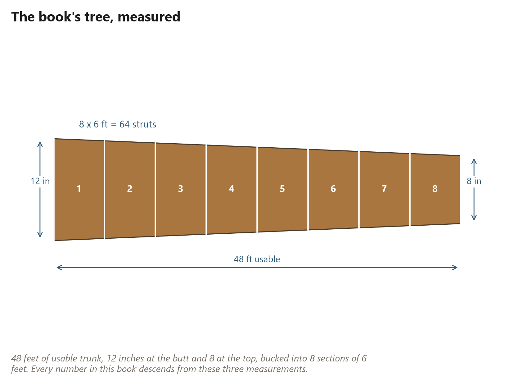

## The tree, measured

The drawing matters more than it looks. Every chapter that follows — the
recovery arithmetic, the two sizing methods, the cut list, the fortnight —
takes its numbers from this same trunk, and if the book ever disagrees with
itself about the tree, the disagreement is a bug, not an editorial position.
So the tree gets its own page, drawn to scale, with the three measurements
the whole method hangs on.

**The butt.** 12 inches. The widest point that still
counts as trunk; below it is the flare, which splits badly and gets bucked
off.

**The top.** 8 inches, where the straight stem runs
out at the first limb. Above it is crown, which is firewood.

**The usable length.** 48 feet between the two. A
trunk tapers from 12 to 8 inches
along that run, and everything about how the log gets cut is decided by
that taper: buck it into 6-foot sections and each
section is close enough to a cylinder that one jig fits them all.

Those are the only three numbers a tree-first build needs from the tree.
Not species, not grade, not a timber buyer's walkaround. Butt, top, length.
Chapter 22 turns exactly these three into a dome diameter, and
the round trip in Chapter 23 proves it is the same
calculation a designer runs from the other direction. The drawing here is
not decoration. It is the input.

## What I actually wanted

It is worth saying what the tree was *for*, because the method is only
interesting against the thing it was asked to build.

I wanted a round building, big enough to live in, built alone.

Round, not square: a dome, 21.6 feet across with
365 square feet of floor when the arithmetic was done — a
serious room rather than a shed, and the largest size these trees
would fill. Chapter 22 shows that 3 trees are what
it takes, and that the frame only actually consumes
1.88 of them; the rest of the pile is
spares, blocking, floor stock and firewood, and the book says so rather than hiding it.

Built alone, because that is the constraint that shaped every decision after
it. A crew can lift a sixteen-foot stick; one person cannot. So the members
are 6 feet, the panels are lifted one at a time,
and the whole frame is designed around what a single person can carry, set,
and fasten without a second pair of hands. The book never pretends this is
the fastest way to build. It is the way that works when the only labour
budget is your own, and the fortnight in the middle of this part is what
that constraint actually costs.

And from what was on the ground, because the economics only work that way.
Buy the timber and the frame costs what timber costs; Chapter 45
does that arithmetic both ways and prints the number that does not help the
argument. Here it is enough to say the goal was never to build cheaply in
money alone. It was to build with the tree that was already down, one saw,
and two weeks — and to find out what that made possible that the lumberyard
price could not.

That is the book. The rest of it is the tree answering.

---

# 2. Fifteen Middlemen

*Why a two-by-four costs what it costs, and how much of that is wood*

## Fifteen Middlemen

Between a standing tree and a board on a rack there are, depending on how you
slice the chain, something like fifteen separate businesses, machines, and
handoffs — and every one of them gets paid. The board does not cost what the
tree costs. The board costs what the tree costs *plus fifteen wages, fifteen
fuel bills, fifteen margins and fifteen sets of handling*, and almost none of
that is wood.

This chapter walks the chain, because the whole wedge method is a way of
skipping it, and you cannot skip something intelligently without first
knowing what it is.

The claim to hold in your head while reading it: a two-by-four's price is
mostly distance and patience. The tree spent a lifetime standing still; the
board has to be moved, processed, dried, graded, and waited on, and each of
those is a service somebody sells. The method in this book removes fourteen
of the fifteen steps — the diagram on the next page names them — and keeps
exactly one. That is not a metaphor. It is the count, and the rest of the
book is the consequence of it.

## From stump to rack

Walk it once, end to end, and count the hands.

**Fell.** Somebody drops the tree. Trained, insured, standing in the weather.

**Skid.** The trunk is dragged to a landing where a truck can reach it.

**Haul.** A log truck moves it to the mill, paid by the mile and the hour,
and the round trip is empty one way.

**Scale.** Somebody measures and grades the log, because the mill buys by
volume and quality, and the measurement is a negotiation.

**Saw.** The mill breaks it down: slabs off the round, boards out of the
cants. This is the step people picture, and it is one step of
14.

**Edge.** Every board gets its wany edges ripped off square.

**Trim.** Ends squared to length.

**Dry.** The boards are stickered and air-dried, or kilned — weeks to months
of time, and the kiln burns fuel.

**Plane.** The rough board is dressed to its finished size. A nominal two-by-
four has now become a dressed one-and-a-half by three-and-a-half, and the
missing wood is not an accident; it is this step.

**Grade.** Somebody looks at every board and assigns it a grade, because
graded lumber can be sold by phone and ungraded cannot.

**Bundle, ship, stock.** It is unitised, moved again, and shelved in a yard
that rents its ground, its racks and its fork trucks.

**Sell.** A desk takes an order and a margin.

That is the honest list — 14 operations between the tree
and the graded board, and every one of them has fuel, wages, rent and a
margin in it. None of them is a scam. Each one exists because the customer
for a board is a contractor forty miles from the forest who needs a
straight, dry, graded, predictable rectangle *tomorrow*, and the chain
delivers exactly that. The chain is good at its job. Its job is just mostly
not wood.

Now count the method this book uses: fell, buck, split, jig, raise —
8 operations from standing tree to member standing in a
frame. The middle of that list — skid, haul, scale, saw, edge, trim, dry,
plane, grade, bundle, ship, stock — is gone, not because it was unfair but
because it was unnecessary. The wedge does not need the tree to become a
rectangle, so it does not need the machinery whose entire purpose is
producing rectangles.

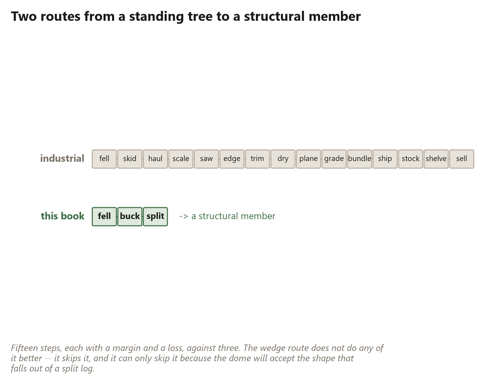

## The chain, and where the wood goes

The drawing tells the story the walk could not, because the story is not
only who gets paid. It is also what disappears.

Every processing step removes material, and the industrial chain removes it
at both ends and in the middle. The slabs and edgings off the round log. The
planer shavings off the dressed board. The trim cuts. The degrade — boards
that crack, warp or stain while drying and get down-graded or scrapped. When
the same trunk this book uses is sawn into two-by-fours, roughly
45 per cent of the solid wood survives as saleable
lumber. The other 87.4 per cent of a good log — minus the
kerf — survives when it is split into wedges instead. Chapter
13 does that arithmetic in full, including the parts that are
less flattering than the headline. Here it belongs in the chain picture for
a simpler reason: the waste is not an accident of carelessness. It is the
price of the rectangle, paid in wood, at a chain of stations that each
exists to pay it.

Look at the diagram with that in mind. The industrial route is long because
each station exists to solve a problem the previous station created. The
sawmill exists to cut rectangles, so the edger exists to clean their edges,
so the planer exists to smooth them, so the kiln exists to dry them flat, so
the grader exists to sort what all of that did to the wood. The wedge route
is short because it never creates the rectangle problem. There is nothing
to edge, nothing to plane flat, and a green wedge that dries is allowed to
move a little, because the frame was designed for a stick that is already
the shape the tree made.

## The price of a 2x4, taken apart

The shelf price this book uses is 8.88 dollars for a
sixteen-foot two-by-four — a real sticker price, declared up front in the
constants table at the front of the book, because it is a price and prices
are looked up, not derived.

Now take it apart, and the first thing to notice is how little of it is the
tree.

The tree's share of that board, at the stump, is a fraction of the sticker.
A sixteen-foot two-by-four is nominally 8.00 square inches
by sixteen feet — a little under eleven board feet of wood. At a stumpage
price of a few cents a board foot standing, the wood in that board left the
forest worth pocket change, and arrived on the rack worth
8.88 dollars. Everything in between — the fell, the haul,
the sawing, the drying, the planing, the grading, the shipping, the yard,
the desk — is what the price actually buys. The wood is the smallest line
on the receipt.

That is not a complaint about the lumber industry. It is a measurement of
what the industry is: a logistics and processing business that happens to
have trees as its raw material. And it is the exact reason the wedge method
works economically. When you stand next to a tree that is already down,
with a saw in your hand, you are not competing with the industry's skill.
You are simply not buying its product. The 14 steps are
replaced by 8, and the price of the building material
collapses to fuel, chain oil, and your own hours.

Chapter 45 does that arithmetic both ways — what the frame costs
bought, against what it costs cut — and prints the hourly rate it implies,
including the version that flatters the method least. This chapter only
needed to establish why the two numbers are so far apart. They are far
apart because one of them is a price for wood and the other is a price for
fourteen services, and the services are what the saw on your shelf makes
unnecessary.

## Nominal, dressed, and the missing third

A two-by-four is not two inches by four inches. It is sold as if it were,
and the difference matters enough that the book keeps both numbers on the
page wherever wood is counted.

**The nominal board** — the name on the ticket — is two by four:
8.00 square inches of section.

**The dressed board** — the thing you actually carry out of the yard — is
one and a half by three and a half: 5.25 square inches.
The rest went to the planer.

That is a thirty-five per cent difference in section between what the
lumber is called and what it is, and it is not a trick; it is the planing
step from the chain above, made visible. The book always says which board
it means when it compares, because comparing a wedge against a nominal
two-by-four flatters the wedge by a third, and a book that flatters its own
material by accident is not worth reading. There is also a third board the
industry does not sell and the book does not pretend to: the rough-sawn
two-by-four, planer-skipped, at something between the two numbers. The
money chapter (Chapter 45) and the head-to-head in Chapter
7 both state their board explicitly, and where the choice
matters they print the comparison against both.

Why the book cares this much: because the wedge's honest number — the
figure that decides whether the whole idea is worth anything — changes by
that thirty-five per cent depending on which board you compare it against.
The book's answer, stated once here and used everywhere after: compare
against the dressed board. It is what you would have bought, and it is the
smaller, less flattering target. The method is strong enough to be
measured against it.

---

# 3. The Frankendome

*Forty triangles, no two struts alike, and the failure that taught the method*

## The Frankendome

Before the dome this book is about, there was another dome, and it matters
that it existed, because every decision in the method that followed was a
reaction to what that first one got wrong.

It was built from whatever wood was lying around — offcuts, salvaged sticks,
mixed sections, boards that had been other things. Forty triangles, joined
edge to edge, each strut whatever shape the pile happened to supply. The
idea was deliberately forgiving: do not sort, do not select, do not machine.
Let the connector absorb the difference between one stick and the next.

The idea worked, which is the worst thing that can happen to an idea that is
secretly bad. The frame stood. It stood for six months, outside, through
weather, and it taught more about how a dome behaves than any drawing had.
And it was awful: lumpy, twisting, no two joints alike, and impossible to
reproduce. Every lesson in this book is downstream of that specific
combination — *it worked, and it was awful* — because it proved both halves
of the method at once. A triangulated frame will stand on almost any
consistent-ish sticks, which is the permission. And nothing about a frame
built that way repeats, which is the trap.

This chapter is the story of the trap.

## Strut-agnostic, and what that cost

The design rule of the first build was *strut-agnostic*: no stick is special,
no stick is measured, any piece of wood of roughly the right length can be
any member. Assemble the triangles from the top of the dome down, one at a
time, and wherever two edges meet, a folded bracket joins them. Eight screws
a bracket. Two bolts a seam. Tighten, move on.

The appeal was real. The pile was free. Nothing needed grading. A stick that
was two inches wide where the next was three could still be a strut, because
the bracket's flaps could be bent to whatever the wood wanted, and the screws
found the wood where the wood was. Building that way feels like freedom —
every decision made at the moment of assembly, by the piece in your hand —
and it took the whole build to learn what that freedom cost.

It cost everything that comes after a build. The dome stood, but:

**Nothing repeated.** No two members were alike, so no operation could be
jigged. Every cut, every hole, every bracket bend was a one-off, made to
fit the exact stick in hand. The fortieth panel took as much thinking as the
first.

**The connector did all the work.** Because the sticks agreed about nothing,
the bracket had to absorb every difference: width, thickness, angle,
wander. That is a lot to ask of a folded piece of metal, in forty places,
for the life of the building — and Chapter 4
is the afternoon I spent learning exactly how much.

**It could not be drawn.** There was no cut list, because there was no
standard member. The frame existed only as itself; you could not hand the
build to anyone, and you could not build a second one.

**It was never finished.** A frame that is improvised joint by joint is a
frame you keep adjusting. It stood, but it never stopped being the thing
you had to keep an eye on.

The photograph on the next page is that dome. It is in this book because the
book's method is best understood as the answer to it, and because it is
honest to show the before. A book about a better way to build owes the
reader the worse way it is better than.

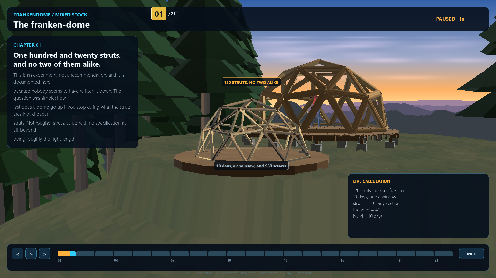

## The frankendome standing

Look at it. Lumpy where a solved dome is smooth. Every member its own
section, its own bow, its own idea of straight. The seams pinch and gap
where the sticks disagreed. And yet the shape is recognisably a dome, and it
is standing, which is the part that is easy to forget when the tidy version
of this story gets told: the thing did work. A frame of forty triangles,
joined any-old-how, will carry its own weight and a skin. Triangulation is
that forgiving — Chapter 6 explains why — and the method in
this book inherits that forgiveness as its foundation.

What the photograph cannot show is the labour inside it. Ten days to stand
it, not because the work was hard but because none of it repeated. Every
bracket was folded to a different angle. Every screw row was laid out fresh.
The second dome took as long as the first would have, because there was no
first dome there was only a sequence of one-offs.

The wedge method exists because of what this picture makes obvious: the
geometry of a dome does not care what shape its sticks are, but the person
building it absolutely does, and the difference between a frame you build
once and a method you can build with is whether anything in it repeats.

## The ten-piece pentagon

One part of the frankendome was genuinely good, and it is worth separating
it from the rest, because it was the only piece carried forward.

The base — the ring where the dome meets the ground — was not improvised.
It was ten pieces, cut to a plan, joined into a decagon, and it went together
in an afternoon and never moved. The contrast with the chaos above it was
the whole lesson of the build in miniature: the one part that was drawn
before it was cut, the one part where every piece had a name and a number,
was the one part that behaved.

That decagon became the footing of the method. The frame this book builds
also meets the ground as a ten-sided ring — 10 rim edges,
each a member in its own right — and the ring is the one place the book
tells you to set out with a string and a check rather than a shrug. Chapter
39 is that ring, given the treatment the
frankendome proved it deserved.

The pentagon, too, came forward in spirit. The frankendome's triangles were
joined edge to edge in whatever arrangement the assembly order produced; the
method's panels are assembled into the same two triangle shapes every dome
has — the same count, the same shapes, the same corners. What changed is
not the geometry. It is that in the method, every panel of a given shape is
built on the same fixture, from sticks of the same section, with the same
holes. The frankendome proved the shape. The method made the shape
repeatable.

## Why I stopped

The frankendome was not abandoned because it fell down. It was abandoned
because of a sentence I could not unthink, after watching the tenth improvised
joint go in:

**A thing you build twice is only worth doing by hand once.**

Nothing in that dome repeated, so nothing could be jigged, so nothing could
get faster, and nothing could get more accurate, and no second dome could
ever be the same as the first. The strut-agnostic idea had removed the need
for precision at the cost of removing the possibility of it. Every bracket
was a small negotiation between two sticks that had never met and never
would again. That is not a build method. It is a sculpture process that
happens to produce a room.

The question the wedge method answers is the question the frankendome left
on the table: what would the sticks have to look like for one fixture to
build every panel? The answer turned out to be in the next chapter — not
*which sticks to buy*, but *which way to open the log*. And the moment that
answer landed, the frankendome stopped being a failed building and became
what it is in this book: the control group. Same dome. Different pile.

Chapter 5 is where the pile changed.

---

# 4. The V-Bracket Afternoon

*Trying to join shapes that have nothing in common*

## The V-Bracket Afternoon

Between the frankendome and the wedge there was an afternoon spent trying to
make the frankendome's problem go away by making a better bracket. That
afternoon matters because it is the step most builders would have stopped
at, and because the bracket it produced is a genuinely good answer to the
wrong question.

The problem was stated clearly by then: the frame's sticks did not match, so
the joint had to. The fix seemed obvious — stop improvising the joints one at
a time and design one connector good enough to join any stick to any stick.
Do the tolerance in metal, once, instead of in thinking, forty times.

So I sat down and designed the V-bracket: two flat flaps meeting at the
angle the panels make, four holes in each flap, the flaps long enough to
run half the length of a member so the screws spread along the stick instead
of bunching at its end. Fold one from flat stock in a minute on a bench
brake, and it will hold any two pieces of wood that arrive at the corner,
whatever their sections, whatever their bows.

And it worked. That is the trap, again. A bracket that absorbs every
difference works on the first panel and the fortieth. What it costs does not
show up until you look at what the bracket has become.

## A bracket that does not care

Here is why the V shape is good at its job, because the goodness is real and
the method that follows borrows from it.

A V-bracket does not assume a member's width. The flaps are wider than any
stick the build will use, so a two-inch board and a three-inch board both
land on the same plate, and the screw rows find whatever wood is there. It
does not assume a thickness: the bend that forms the V is made to the
panel's fold angle at assembly, not stamped to a tolerance at a factory. And
it does not assume straightness: the screws are what pull the stick to the
plate, and a bowed stick just gets pulled harder.

That is a beautiful property, and it is worth saying what it is in one
sentence, because the wedge method is, in a way, this sentence taken to its
conclusion: **the connector absorbs the difference, so the wood does not
have to be made the same.**

The warning sign was in the same sentence. When the connector absorbs every
difference, the connector is now doing all the work of the frame. Every
joint is a negotiation, held by screws that are the only thing in the whole
structure that know the shape they are enforcing. Eight screws a bracket,
two bolts a seam, all of it site-bent, site-drilled, site-tightened — the
connector was not a detail. It had become the building.

And a connector that does everything has to be *right* everywhere. The
flaps were long, which spread the load, which was honest engineering — and
it meant forty-odd brackets, each consuming stock, each needing folding,
drilling, fitting, checking. The frankendome had replaced the problem of
matching wood with the problem of manufacturing forgiveness, in metal, at
forty corners. Same labour, moved.

## Four joints that nearly worked

The drawing shows the four joints that happened along the way, because the
V-bracket was not arrived at in one step, and each of the earlier ones
failed in a way that named a piece of the final answer.

**The hub.** A flat plate with every member bolting to its own face — the
classic geodesic hub. It assumes all members arrive at the same point at
the same angle, and they never do when the sticks are salvaged. Every
attempt needed shims, washers, longer bolts. The hub is perfect for a kit
of identical struts, and useless the moment the struts differ.

**The angle plate.** A single fold, made to the panel's angle. It joins two
sticks in a line but cannot hold the third that closes the triangle, and
the third is the one that turns three sticks into structure.

**The wrap.** A strip of steel wrapped around both members and screwed
through. It holds anything, for a while, but it crushes nothing into
alignment — the joint stays as crooked as the wood, and every wrap is a
one-off that has to be cut to the pair it is joining.

**The V-bracket.** The survivor, and it failed too — not at holding, but at
repeating. It can join anything to anything, which is exactly why no two of
them are alike, which is exactly why the frame never gets faster to build.

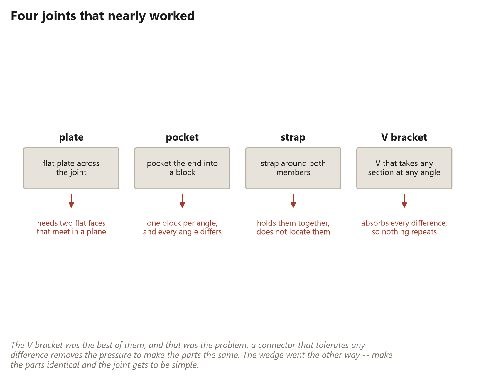

The pattern across all four is the same. Each joint failed not by being weak
but by being asked to solve, in metal, a problem the wood kept re-creating.
The hub assumed sameness. The plate assumed a line. The wrap assumed
nothing and therefore had to be made for everything. The V accepted all of
it and paid in labour. None of them asked the question the next chapter
does — not *how do I join whatever arrives*, but *what would have to be
true for the sticks to arrive the same*.

## The question that ended it

The afternoon ended with the bracket in my hand doing its job, and a
question that would not go away. The bracket worked by absorbing difference,
and it had taken me all afternoon to make a bracket good at that. But every
flap length, every screw, every bend was the cost of a difference that did
not need to exist.

So: if the bracket no longer had to absorb any difference — if the sticks
arrived at the corner already the same section, already at the same angle,
already the same length — what would the joint collapse to?

The answer, worked out later, is Chapter 15: a member end
landing on a member side, one key, a few screws, nothing folded, nothing
measured twice. But the more important answer arrived that same afternoon,
and it is the sentence that turned the project around:

**Do not build a joint that tolerates the difference. Build sticks that do
not have one.**

That is the wedge method's founding sentence. The bracket was a good idea
pushed past its natural size; it remains in the method only as a small,
fixed part where a fold is genuinely the right tool. What it taught was
that the wood was the thing to fix, and the wood was the one thing I had
not tried changing — because a stick of wood seemed like something you buy,
not something you decide. Chapter 5 is the afternoon that
stopped being true.

The bracket attempts earned their page in this book for one more reason:
they are the roadmap of every wrong turn a builder can make at a dome's
corner. Somebody, somewhere, is designing a hub right now. The book's
answer is the drawing above, and the sentence under it: make the sticks
match, and the joint stops being the hard part.

---

# 5. The Cut That Changed It

*Split the trunk like a cake, and the stick is already the right shape*


## The Cut That Changed It

I want to tell this one without hindsight tidying it up, because the tidy
version — *I realised the dome would accept any consistent section, therefore
I split the log radially* — is not what happened and it teaches nothing. What
happened was that I was tired of brackets.

## Half, half, half again

The frankendome had taught me that a frame of forty triangles will stand up
even if no two of its sticks match. The V-bracket afternoon had taught me
that making a connector tolerant enough to join anything to anything means
the connector is now doing all the work, forever, in forty places.

So I had stopped asking how to join dissimilar sticks and started asking the
opposite question: what would it take for them not to be dissimilar?

The answer that everybody gives is *mill them*. Square them up, run them
through a planer, and now they are all 2x4s. That answer costs a mill, a
planer, a shed to keep them in, and about half the tree.

I was sitting on a section of trunk at the time. Not thinking about it.
Sitting on it.

And the thing about a round section of trunk is that it is already
rotationally symmetric. Every radius is the same as every other radius. If
you split it through the middle you get two identical halves, not because you
were careful but because the log was round before you touched it. Split those
and you get four. Split those and you get 8.

Three passes. Eight sticks. Every one the same, to whatever tolerance the
tree was round to, which is a tolerance nobody had to hold and nobody had to
check.

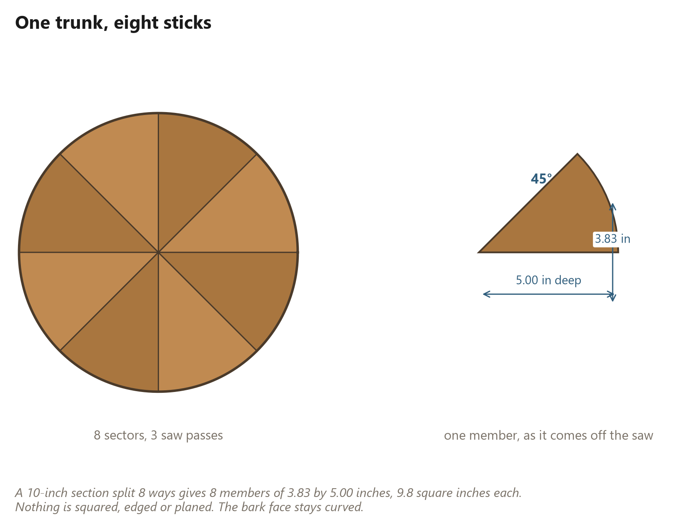

I did it that afternoon on a piece I had been about to burn.

## What became obvious immediately

Four things, in about a minute, and I want to record that they were obvious
because the ones in the next section took a week and I do not want to flatter
the story.

**One section, everywhere.** Every stick in the frame has the same
cross-section: 3.83 inches across the bark face,
5.00 inches from pith to bark, 9.82 square
inches of wood. So one jig fits all of them. One fixture, one set of stops,
one procedure repeated a hundred and twenty times. That is what makes this a
fortnight instead of a summer.

**Depth where you want it.** A sector is deep — it runs the whole way from
the pith to the bark — and depth is where bending stiffness lives. The stick
is not a compromise between what the tree gave and what a mill wanted. It is
the deepest member you can cut from that log, which is a strange thing to get
for free.

**No machine between the tree and the frame.** Fell, buck, split, build. The
chainsaw does all of it. There is no second machine, no second setup, no
second building to keep the second machine in.

**Four ways up.** This one I noticed while stacking them. The sector is not
symmetric about its own long axis — it has a point and a curved back — so you
can rotate it four sensible ways in the wall and get four different things:
which face the weather sees, which face the next stick lands on, whether the
points of a pair aim together or apart. That is Chapter 14, and it is the
most genuinely new thing in the method.

## And what took another week

Now the part the tidy version leaves out.

I assumed, because the sticks were identical and the panels were identical,
that the *joints* would be identical. Forty triangles, all the same, all
meeting each other the same way.

They do not.

A dome is a sphere approximated by flat panels, and the angle at which two
panels meet is not the same everywhere on it. It cannot be — the sphere
curves differently in different places, and a 2V hemisphere has two classes
of edge for exactly that reason. So the seam between two panels folds by one
amount here and a different amount there, and a key cut to fit one seam will
not fit the other.

I did not want this to be true. I spent the better part of a week trying to
make it not be true: fudging the panel outlines, trying a compressible
gasket, trying to talk myself into the idea that the difference was small
enough to force closed. It is not small enough. Forty panels of *nearly*
closing is a dome with a gap in it.

What actually resolved it was measuring instead of arguing. Across all
55 seams there are only **2** fold
angles. Not forty. Not a continuum. Two: 18.03 degrees and
22.46.

That was the moment the method became buildable rather than merely elegant.
2 angles means 2 key profiles:
cut one of each until it fits, then repeat it 25 and
30 times. The difference between "the seams vary" and "the
seams take 2 values" is the difference between a
research project and a fortnight, and I lost a week to not knowing which one
I was in.

The chart is in Chapter 16, where it belongs.

## The bit I got wrong in public

While all this was going on I was saying, out loud and on camera, that
nothing in the dome needed a mitre.

That is not true and it was never true. The end of each stick that lands on
the side of the next one — the butt end — is a compound cut: a mitre and a
bevel together. What is true, and what I should have been saying, is that no
end is ever mitred *to another end*. Every joint is an end landing on a
flat side, which means each stick is cut once, on one end, before it goes
anywhere near the assembly, and the other end is left long and sawn off in
place.

That is a much better claim than the one I made, and it is a shame I spent
several months making the wrong one. Chapter 15 has the geometry, and the errata pages in this part carry the rest of what this project has had to take back.

## What it is worth

The number that convinced me it was not just a neat trick: splitting this way
keeps 87.4 per cent of the solid wood in the trunk, against
about 45 per cent for the same log sawn into
two-by-fours the way a mill would. That is 1.93 times the
usable wood, from a cheaper process, with one machine instead of four.

Chapter 13 does that arithmetic properly, including the parts of it that are
less flattering than they first appeared.

But sitting on that log, what I had was a much simpler observation, and I
still think it is the whole book:

**A round thing splits into identical pieces for free. A square thing has to
be made square, and you pay for that in wood, in machines, and in time.
Domes are the buildings that will accept the free pieces.**

---

# 6. Triangles Do Not Care What Shape Your Stick Is

*Why a triangulated frame can accept a member no mill would sell*

## Triangles Do Not Care

This chapter is the permission slip for the whole method, so it goes first
in the explanation strand and it is short enough to be unfair to nobody.

Start with the sentence the title page made its argument out of: **your
skull is not symmetrical either, and it protects the brain just fine.**
The frame is the part of this building you are allowed to get wrong — the
lumpy, split, self-labelled frame that the frankendome proved will stand.
The parts that must be right are the skin and the ground, and the book
treats those with the care the title page promised. This chapter is the
*reason* the frame is allowed to be lumpy, stated as geometry rather than
as reassurance.

The wedge method proposes to build a building's frame out of sticks that are
not rectangular — a fifth of a round log, sawn faces, bark back, a point at
one edge. No lumberyard sells that. No building code assumes it. And yet the
frame stands, because of one property of triangles that is easy to state and
takes the rest of this chapter to spend:

**A triangle does not care what shape its sticks are. It only cares how long
they are, and that they reach each other.**

Everything the mill does — square the edges, flatten the faces, dress the
section to a standard — exists because rectangles ask their pieces to be
beams: flat boards, loaded across their faces, whose stiffness and strength
depend on the exact shape of the section. A triangulated frame asks
something else entirely of its pieces. It asks them to be *struts*: pushed
or pulled along their own length, ends only, never sideways, never flat.
For a strut, what matters is how much wood is in the section and how far the
load is from pith to bark — not whether the section is a rectangle.

So the central question of the book is not "is a wedge as good as a 2x4?"
in general — Chapter 7 runs that comparison honestly and
prints the column the wedge loses. The right question is narrower and much
more useful: *inside a triangulated frame, where members are loaded along
their length, is a wedge a good member?* This chapter builds the frame that
question assumes, so the later chapters can answer it.

## Axial, not bending

The difference between a strut and a beam is the difference between the two
ways a building can load a piece of wood, and most of conventional framing
is the second way.

**A beam is loaded across its length.** A floor joist carries the floor on
its narrow face; a rafter carries the roof on its wide one; a stud carries
weight down its length but braces against sideways push. In all of them the
load is trying to bend the piece, and bending is cruel: the material at the
middle of the section does almost nothing, which is why an I-beam has its
steel at the top and bottom and air in between. Bending strength lives in
the extreme fibres, far from the section's centre, so the shape of the
section — rectangle, and which way round — decides how strong the piece is.
This is why a 2x4 on edge is dramatically stiffer than the same 2x4 laid
flat, and why the mill bothers to dress boards to a true rectangle at all.
A rectangular building is a system for turning wood into beams, and beams
need rectangles.

**A strut is loaded along its length.** Squeeze the ends of a stick toward
each other, or pull them apart, and every fibre of the section shares the
load equally. Shape stops mattering; the amount of wood matters. A round
stick, a square stick, a wedge — for axial load, they differ only in
section area (and, for a long thin strut in compression, in the way the
section resists buckling, where depth matters more than shape).

Now look at a triangulated frame. Every load that arrives at a joint is
carried to the next joint along the members, as push or pull along their
lengths. The frame does not bend its members; it moves force through them.
That is the entire trick of geodesic structures, and it is why a dome's
struts can be slender for their span, and why the frame stands up without a
single piece of sheet material keeping it square. A rectangle needs a
diagonal, or a sheet of plywood, or it racks over and lies down. A triangle
is already its own diagonal. The drawing on the next page is that sentence.

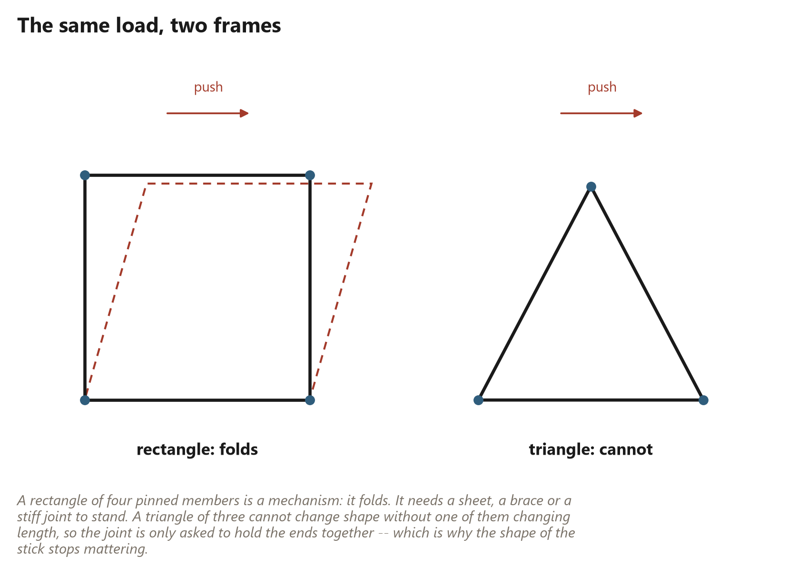

## The same load, two frames

Look at the two frames side by side.

On the left, a rectangle. Push on its top corner the way wind pushes on a
wall, and the rectangle does what rectangles do: the corners stop being
ninety degrees, the frame leans, and unless a sheet of plywood or a diagonal
brace is holding it, it goes over. The joints are doing everything the
shape cannot. That is why a conventional wall is a frame *plus* sheathing —
the studs are beams, and the sheet is the triangle they never built.

On the right, the same corner, triangulated. Push on it. The load cannot
change the angles, because the angles are fixed by the lengths of the three
sticks, and a stick's length cannot change without stretching or squashing
the stick itself. So the push travels down the members as pure compression
and pure tension, along the grain, exactly where wood is strongest and
exactly where shape does not matter. Nothing bends. Nothing needs a sheet.
The frame is its own bracing, at every corner, forever.

The whole method follows from that picture. Because members are loaded
axially, the frame will accept a member of any section that has enough area
and enough depth — which is precisely what a split log provides. Because
nothing bends, the frame does not ask for the flat, dressed, graded faces a
beam economy demands. And because the triangle's angles are fixed by its
lengths, the frame enforces its own geometry: get the lengths right and the
shape has no choice. The frankendome stood on that fact alone, with no two
members matching, and it stands on the same fact with every member
identical. Chapter 3 was the demonstration. This
chapter is the reason.

## What the wedge is good at

If the frame wants area and depth, the wedge should be measured by area and
depth — and on a modest log, it beats the store-bought board at both.

A dressed two-by-four carries 5.25 square inches of wood,
planed down from its nominal size — a rectangle, because it must be a beam. The wedge this book cuts is 3.83 inches
across its bark face and 5.00 inches from its point to its
bark, for 9.82 square inches of section. The comparison that
matters is in Chapter 7, computed properly on an
8-inch log so the wedge gets no advantage from a fat
tree. Here, two qualitative points are enough to set the direction:

**Depth is where stiffness lives.** In bending, stiffness rises with the
*cube* of depth; double the depth and a beam gets eight times stiffer.
A wedge runs from the pith to the bark — the full radius of the log. For
the same width of stick, that is more depth than any board a mill cuts
from the same tree, because the mill's rectangle has to fit inside the
circle, and the wedge does not.

**Area is where axial strength lives.** The wedge is a sector: one eighth
of the log's circle. Measured as a strut — which is what the frame asks it
to be — it carries more wood in its section than the dressed board the
same log would have produced, because it never gave up the corners to the
edger and the planer. Chapter 13 counts those corners; the
count is the difference between 87.4 per cent and
45 per cent of the tree.

The honest note, saved for the full table: a wedge is not a better *beam*.
Lay it flat and ask it to be a shelf and the missing rectangle matters.
The claim is narrower and it is the only one the book makes — in this
frame, loaded this way, the wedge is a better use of the tree than the
board, and the shape the tree already had is not a defect the mill forgot
to remove. It is the feature the frame was waiting for.

## One eighth of a tree

The section, stated plainly, because the next chapters argue with it:

A 6-foot section of this book's tree, split into
8 equal sectors, yields sticks of 9.82 square
inches each — 3.83 inches across the bark face,
5.00 inches deep from point to bark.

The dressed two-by-four the same tree would have been sold as carries
5.25 square inches. The nominal one — the name on the
ticket, which no longer exists in the wood — carries 8.00.

So the wedge is a bigger section than the board the mill would have cut
from the same log, in the one measure that matters for a strut, and it
cost a chainsaw's fuel instead of a mill, a kiln, a planer and a yard.
That single line — 9.82 against 5.25,
from the same tree — is the economic engine of the whole book, and
everything after this page is the machinery that turns it into a standing
frame.

---

# 7. Not a Worse Two-by-Four

*The head-to-head nobody runs honestly, run honestly*


## Not a Worse Two-by-Four

Everybody asks the same question, and they are right to ask it.

*Is a split log actually as good as a board?*

The honest answer has three parts, and only two of them are flattering. This
chapter gives all three, because a method defended only with its good numbers
is a method nobody should trust with a roof over their head.

## The rectangle is not the tree's idea

Modern construction has trained us to think of wood as something that
naturally arrives in rectangles. A tree goes into a sawmill and a stack of
2x4s comes out, and the form is so familiar that it stops looking like a
choice.

It is a choice. The rectangle is not a property of wood. It is the output of
a manufacturing process designed around a particular kind of building — one
made of vertical studs, horizontal plates, flat walls, right-angle corners
and rectangular openings. For that building the rectangle is close to
perfect, and the industry that produces it is very good indeed at what it
does.

A geodesic dome is almost the opposite of that building. Its structural
language is triangles, changing face planes, radial geometry and repeated
angular joints. Nothing in it is a right angle. Nothing in it is a flat wall.

So the question reopens, and it is worth asking properly rather than
assuming the answer in either direction: *for this building, is the
rectangle still the right thing to make out of the tree?*

## More wood, from a modest tree

Start with the simplest measure: how much wood is actually in the stick.

Take an 8-inch log — not a monster, a tree most people
could fell and move without help. Split it 8 ways and each
sector holds **6.28 square inches** of wood.

A dressed 2x4 — the board actually on the rack, which is
1.5 x 3.5 inches whatever it says on the label — holds
**5.25**.

That is **+20 per cent more wood** in the wedge, from a
tree you could carry out of a wood lot in sections.

And it is the conservative version of the claim. A larger log widens the gap
sharply, because area grows with the square of the radius while a 2x4 stays a
2x4. The book quotes the small log deliberately: a claim is worth more made at
its weakest.

The wedge is also deeper. Pith to bark is 4.00 inches,
against 1.5 x 3.5 for the board — and depth is where bending
resistance comes from.

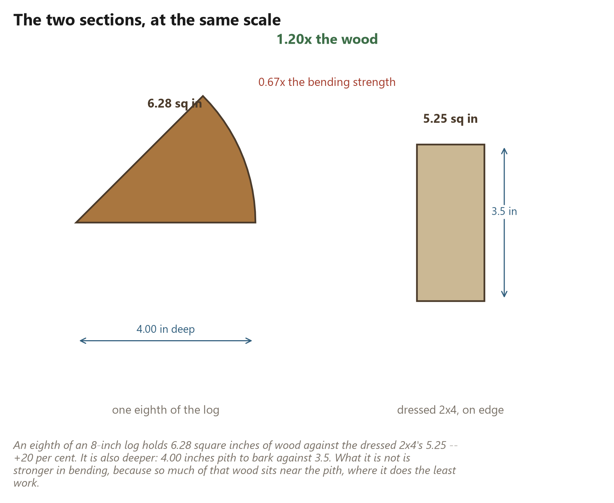

## And now the number that does not help

Here is where an honest chapter parts company with a sales pitch.

**Area is not strength.** How much a section resists bending depends not only
on how much wood is in it but on *where that wood sits* — material far from
the middle does most of the work, material near the middle does almost none.

And a wedge puts a great deal of its wood near the pith, in the narrow part
of the pie slice, where it contributes very little.

Run the numbers properly and the comparison comes out like this:

| | wedge | 2x4 on edge |
|---|---|---|
| Wood in the section | **+20%** | — |
| Resistance to bending (stiffness) | **-1%** | — |
| Bending strength | **-33%** | — |

Read that middle row again. The wedge has +20 per cent
more wood in it and is **not stiffer**. It comes out within a per cent of a
2x4 stood on edge — effectively identical, having spent twenty per cent more
material to get there.

And the bottom row is worse: in bending *strength* the wedge is
-33 per cent against the same board.

That is the number this method's advocates do not usually print, and it is
printed here, in a table, near the front.

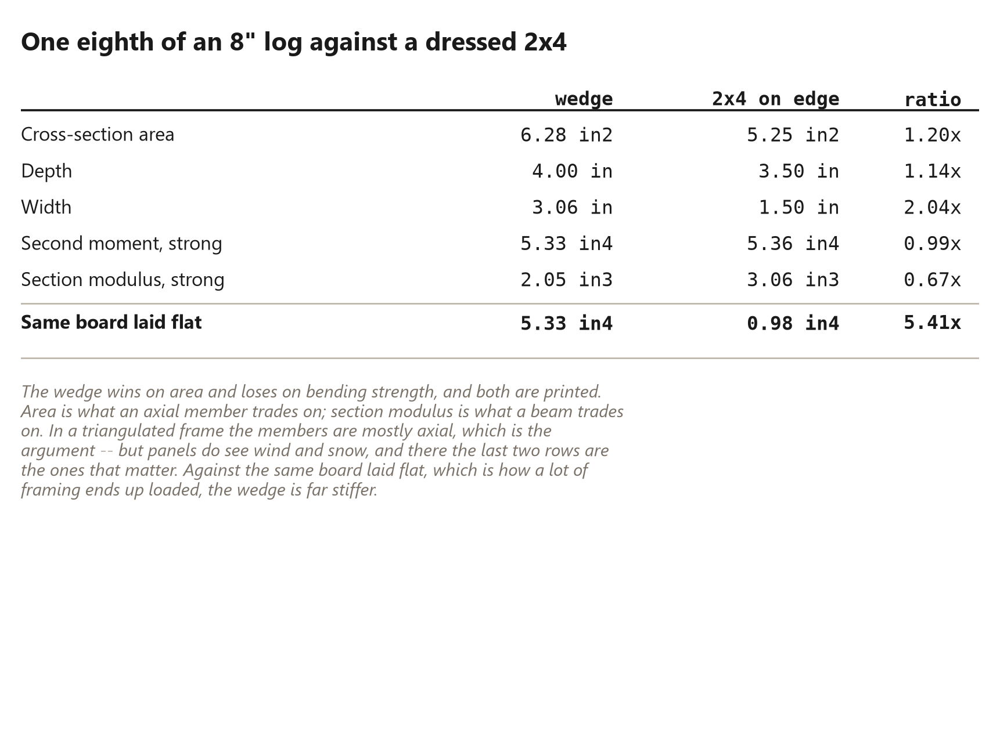

## One consolation, before the argument

There is a caveat to the caveat, and it is a fair one.

The comparison above puts the 2x4 **on edge** — the orientation in which a
board is strongest, and the way a carefully framed floor joist is installed.
A great deal of real framing does not get that. Sheathing battens, blocking,
purlins and plenty of cheerfully improvised structures end up loading boards
the flat way, and against a 2x4 laid flat the wedge is
**5.4 times stiffer**.

So the honest summary is: worse than a well-oriented board, dramatically
better than a badly-oriented one.

That is still not the argument.

## Which is the right question

The argument is that *the comparison itself is the wrong shape*.

Asking "is this wedge as good a beam as a 2x4?" assumes that being a beam is
the job. In a rectangular building it usually is: a stud, a joist and a
rafter all spend their lives resisting bending, largely alone.

A triangulated frame does not work that way. That is the entire point of
triangulating it. A properly designed triangle converts an external load into
forces running *along* its members — compression down one, tension along
another — instead of asking any single member to bend. The network carries the
load; the sticks mostly just push and pull.

And for a member being pushed or pulled along its length, the property that
matters is **cross-sectional area**. Not section modulus. Area.

Which is the column the wedge wins, by +20 per cent.

So the useful question is not:

> Is this wedge as good a rectangular beam as a 2x4?

but:

> Is this wedge an effective axial member inside this triangulated system?

And there the answer is straightforwardly yes, with more wood in the section
than the board it replaces, from a tree that never went near a mill.

## Mostly

One more piece of honesty, because "mostly axial" is doing real work in that
paragraph.

Panels are not purely axial. Wind pushes on the skin between the members and
snow sits on it, and those loads reach the frame as bending in the individual
sticks. It is not the dominant case and it is not nothing, and it is exactly
where the wedge's -33 per cent deficit is a real deficit
rather than an academic one.

Two things about that:

* The wedge is deep. 4.00 inches pith to bark is more
  depth than the board has, and depth is what resists the bending it does
  see — which is why the stiffness came out level rather than behind despite
  the shape being worse.
* Panel span is short. The distance between supports in a 2V panel is a few
  feet, not the fifteen a floor joist crosses, and bending demand falls away
  fast as spans shorten.

None of which is a substitute for somebody competent checking your particular
building for your particular snow load. Chapter 10 says the same
thing at more length and names who to ask.

## What this chapter does not claim

It is worth fencing the argument, so nobody quotes it doing work it cannot do.

This chapter does **not** claim that a split-log wedge is better than a 2x4
as a wall stud, a floor joist, a roof rafter, a shelf, a header or a piece of
furniture. For all of those the board wins, often easily, and the reasons are
in the table above.

It claims something narrower and much more defensible:

> For a purpose-designed geodesic dome whose geometry, connectors and jigs
> are built around radially split timber, the wedge is a better use of the
> tree than first converting that same tree into ordinary dimensional
> lumber.

That is the whole claim. It depends on the building being designed around the
material from the beginning — which is what the rest of this book is about.

We are not asking an unconventional piece of wood to imitate a 2x4.

We are building something in which it does not have to.

---

# 8. Forty Panels, One Hundred and Twenty Members

*The 2V hemisphere, counted*

## Forty Panels

This chapter names the frame itself, because every number after it — the
cut list, the jig, the fortnight, the seams — is a count of something that
exists on this frame, and the frame deserves to be introduced before it is
counted.

It is a two-frequency geodesic dome: a hemisphere of 40 flat
triangular panels, held up by 120 wooden members. There are
65 distinct edges in its geometry, of which 55
are seams where two panels meet and 10 run around the
base where the dome meets the ground and join nothing. Those are the four
numbers the whole book hangs on, and none of them was chosen. All of them
fell out of the geometry — an icosahedron, subdivided once, projected onto
a sphere, cut in half at its widest line — and the rest of this chapter
shows where they come from, because a count you can retrace is a count you
can trust, and a count you cannot is a story.

The frame in the picture is the actual solved dome this book builds — the
same meshes the simulator solves, pushed apart along each panel's own
normal so you can see that it really is forty separate triangles and not
one continuous surface. That separation is not just a drawing trick. It is
how the thing gets built, one finished triangle at a time, on the ground,
and it is the subject of Chapter 18.

## Where 2V comes from

The geometry is older than the dome and worth knowing once, because
everything the frame does follows from it.

Start with an icosahedron: twenty identical equilateral triangles, twelve
vertices, the roundest of the five Platonic solids. It is already close to
a sphere, but its faces are big flat slabs. Subdivide: split every edge in
half and connect the midpoints, and each of the twenty faces becomes four
smaller triangles — eighty faces in all. Now the move that makes it a
dome: push every vertex outward until it lies exactly on a sphere of the
same radius. The triangles stop being identical — those nearer the
original vertices stretch differently from those near the midpoints — but
they all lie on one spherical surface, which is what "geodesic" means
here: the straight lines of the original faces become the chords of a
sphere.

Cut that sphere at its equator and keep the top half. What remains is the
frame: 40 triangles, because a full subdivided icosahedron
has eighty faces and the hemisphere keeps half.

That one operation — subdivide once — is what "2V" names: the frequency
two subdivision of the icosahedron. It is the smallest subdivision that
produces a useful building, and its gift is the number in Chapter
9: all 65 edges of the hemisphere
come in only two lengths, because the subdivision only ever produces two
kinds of edge — the original icosahedron edges, now halved, and the new
edges between midpoints. Two lengths, not forty, is what makes one person
with one jig able to build this at all. Chapter 47 shows
what higher frequencies buy and cost; the whole of the rest of this book
stays at 2V, because 2V is where the trade stops being worth paying.

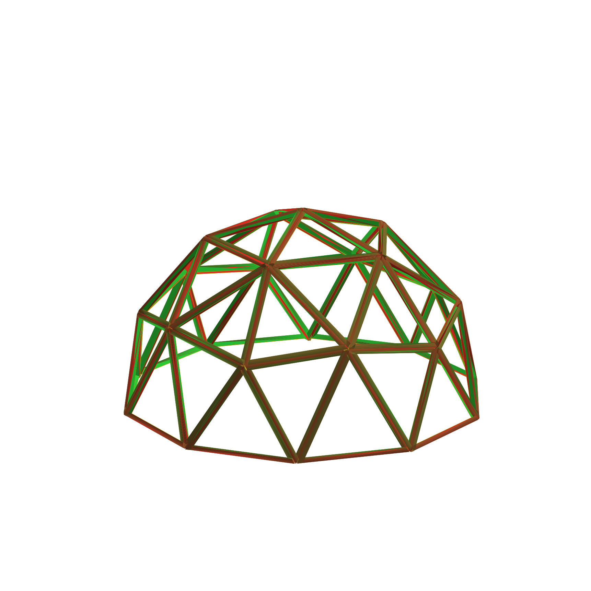

## The frame, exploded

The plate is the frame with its 40 panels pushed apart along
their own normals, each triangle floating a little way out from where it
will finally sit. Read it as an inventory before you read it as a picture.

**Forty triangles.** Two shapes, in a fixed ratio: the triangles that sit
around the five-fold points and the triangles that fill between them. Not
forty shapes — two — which is the second great simplification of the
frame, after the two lengths.

**Three members each.** Every triangle is built complete, with its own
three sticks, its own joints, its own edge. Three times forty is
120: the member count of the whole frame, and the number the
tree chapter will chase in wood.

**The seams where they will meet.** Where two panel edges lie against each
other there will be a seam — a key between the two members, a gasket, a
line on the outside of the shell. The frame has 55 of them.
The 10 edges around the base are different: nothing meets
them from outside, so they are rim, not seam, and the book keeps the two
counts apart because a builder closing 55 seams must not be
told to close 65.

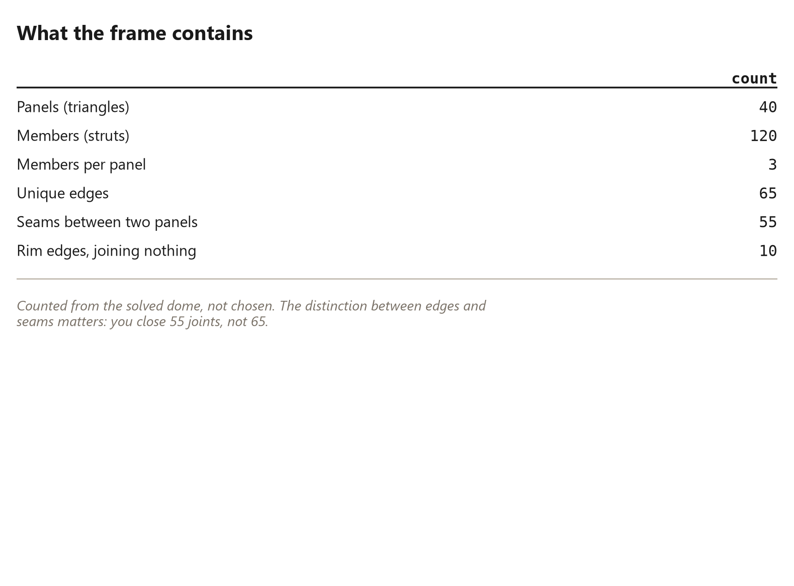

## What the frame contains

The table counts the frame two ways and they agree, which is the whole
point of printing it.

**By panels:** 40 panels times 3
members each is 120 members.

**By edges:** 55 seams each holding two members — one from
each neighbouring panel — plus 10 rim edges holding one,
is 120 again.

The two routes give the same number because the frame is panelised: every
panel owns all three of its edges, so an interior seam is always a
sandwich of two members and a key, never one shared strut. That costs
wood — 1.85 members for every unique edge — and
Chapter 18 is the full accounting of what the extra wood
buys. For this chapter the table's job is narrower: the frame is not a
number somebody remembered, it is a number the geometry produces, and the
geometry produces it twice.

## Why hemispheres and not spheres

One honest question deserves an answer before the build chapters start:
why is the book about half a sphere, when the geometry naturally makes a
whole one?

**A hemisphere has a floor.** Cut a sphere at its equator and the cut
line is a flat circle, lying in a plane, exactly where a building wants
its ground. The dome meets the earth along its 10 base
edges, all in one plane, and every vertex of the base ring sits on the
ground at once. A full sphere has no such line; it touches the ground at
a point and the entire weight of the building hangs from that point's
anchorage. The hemisphere is the shape a sphere becomes when you give it
somewhere to stand.

**The rim is the honest part.** Those 10 base edges are
the one place the geometry does not close on itself — the place where the
frame's seams run out. The book treats the rim as its own piece of the
build: Chapter 39 gives it its own footing,
Chapter 41 puts its doors in it, and Chapter
38 names it as the one place error can accumulate.
A hemisphere is not a sphere with the bottom missing. It is the shape
that has a bottom, and that is why it can be a building at all.

**And the crown is the trade.** Half a sphere sacrifices the volume above
the equator — the part of the ball nobody could stand in anyway — and
keeps everything from the widest line down, which is where the room is.
The floor area, the headroom, and the standing-height map are all counted
from that choice in Chapter 43. For now the frame simply
is what it is: 40 triangles, 120 members,
55 seams, 10 rim edges — the count the
geometry gives, printed whole, before anything is built from it.

---

# 9. Two Lengths, Not Forty

*The whole reason a dome can be built by one person*

## Two Lengths

Chapter 8 counted the frame:
40 panels, 120 members, 55 seams.
This chapter is about the number inside that count that makes the whole
thing buildable by one person with one jig, and it is the smallest
simplification in the entire method:

**Every one of the dome's 65 edges comes in two lengths. Not
forty. Two.**

A room of forty different panels sounds like forty different kinds of
stick, forty different cuts, forty different chances to be wrong. The 2V
geometry quietly removes that nightmare before it starts. Because the frame
is an icosahedron subdivided exactly once, its edges inherit only two
families: the halves of the original icosahedron edges, and the new edges
that connect midpoints. Project them onto the sphere and they stretch, but
they stretch into two values, not forty. Two lengths of edge, in a fixed
ratio of 1.1308 to one — and everything else in the build method
follows from that sentence.

A two-length frame is a frame you can jig. A forty-length frame is a frame
you can only improvise, which is exactly the failure Chapter
3 documented with ten days of labour. This chapter
states the two lengths, shows the four actual cut lengths that fall out of
them, and explains the surprising part: that four is not a mistake and not
a regression. Four is what the pinwheel joint does to two, and the reason
is worth its own section.

## Short and long

The two edge families have names, and the names matter because they travel
all the way to the cut list and the jig.

**Short.** The edge between two midpoints — the new edge the subdivision
created. It spans a smaller arc of the sphere, 31.72 degrees,
and its length is 0.5465 times the sphere's radius.

**Long.** Half of an original icosahedron edge — the older edge, spanning
36.00 degrees, 0.6180 times the radius.

Those two factors are not something a designer chose to keep the saw
settings down. They fall out of the icosahedron's coordinates, and four
independent routes — straight coordinates, central angles, the law of
cosines, and a measured drawing — all land on the same pair, which is the
book's idea of proof for a number this important. At this book's dome, the
two lengths are 72.00 inches and
62.73 inches before the joint takes its bite: a
difference of less than a foot across the whole frame.

The triangle shapes follow the same logic. The hemisphere contains
10 equilateral triangles — three long edges, sitting around
the five-fold points — and 30 isosceles ones, two long edges
over a short base. Two triangle shapes, two edge lengths, one dome. The
forty panels of the previous chapter are forty *copies* of two designs,
not forty designs.

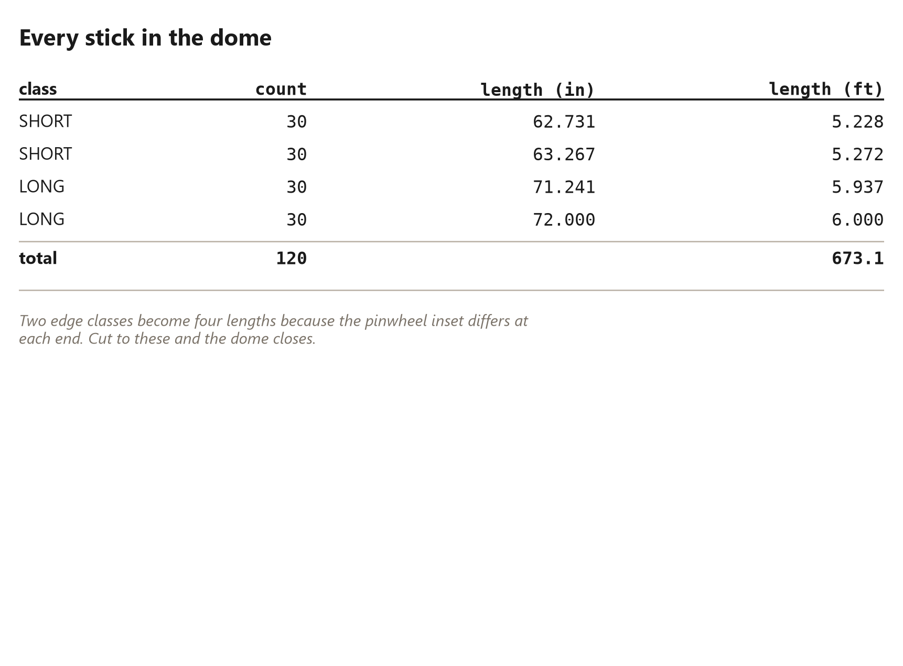

## The member schedule

The table is the bridge from geometry to lumberyard, and it is generated,
not remembered: every row comes out of the same solved frame the
simulator builds, so the table and the dome cannot disagree.

The headline is the first column of it: the whole frame reduces to
4 cut lengths. The longest member is
72.00 inches; the shortest 62.73.
Between them sit the other two, and the spread across all four is the
width of one hand. That is the entire vocabulary of the build: four
numbers on a board beside the jig, and every stick that passes through the
bench is one of them.

Why four and not two, when the frame has only two edge families? Because
the pinwheel joint insets every member from the vertex it serves, and the
inset depends on which side of the corner a member lands on. A long edge
becomes two slightly different long members — one for each side of the
triangle it borders — and the same for short. The table prints all four,
with their counts, because a cut list that hides the difference produces
forty panels that almost fit, which is the most expensive kind of fit
there is. Chapter 15 is the joint's geometry in full; here
the point is only that two became four *for a reason*, and the reason is
printed.

That four-length schedule is what the model prints. What the members
*measure* — the master cut list, 3 resultant lengths
that make a panel the right size once it is together — is shorter:
72.0, 63.5 and
61.5 inches. The equilateral panels take three of the
long member; the isosceles panels take the long at the base, the middle on
the left and the short on the right. The build's list is the measured one
and the model's is the approximation, and Chapter 24
prints both side by side rather than quietly picking one — a builder needs
the master list at the saw and the seating schedule at the bench.

## Why the pinwheel splits two into four

The step from two lengths to four is the one place a sceptical reader
should slow down, because it looks like the dome is quietly getting more
complicated, and the honest answer is that it is — by design, and the
design buys more than it costs.

A hub dome cuts every strut to end at the vertex, so two edge families
really do mean two stick lengths, and the saw never needs a third setting.
The price is the hub itself: a machined connector at every corner, drilled
to a tolerance, bolted to the end of every strut, and — as Chapter
4 recorded — useless the moment the sticks
stop being factory-identical.

The pinwheel throws the hub away by making every member end land on the
*side* of the next member instead of at the corner. That single decision
is what lets rough, split, slightly irregular timber frame a dome at all:
a butt end on a flat sawn face does not need the precision a hub demands.
But it has a geometric consequence, because a member that stops short of
the corner stops at a different distance on each side of the triangle. A
long edge needs a long-left and a long-right; a short edge needs a
short-left and a short-right. Two becomes four.

So the honest ledger reads: the pinwheel costs one extra saw setting per
edge family, and in exchange it deletes the hub, the mitre on every end,
and the requirement that rough timber behave like milled stock. Four cut
lengths instead of two is not the dome getting complicated. It is the
entire bill for the joint that makes the method possible — and it is a
bill paid once, on a jig, where a fence and a stop make the four lengths
as repeatable as two. The next chapter spends that simplicity on the
question of what a stick of this shape can actually carry.

---

# 10. Compression, Tension, and One Eighth of a Tree

*What a wedge strut can actually carry*

## One Eighth of a Tree

The last three chapters built the case for the wedge as a shape: a
triangulated frame loads its members along their length, and along their
length all that matters is how much wood is in the section. This chapter
turns the case into numbers — and then, because a book is not an engineer,
hands the rest of the question to one.

The unit of the whole method is one eighth of a tree: a 45-degree
sector of the trunk, 3.83 inches across its bark face,
5.00 inches from pith to bark, 9.82 square
inches of wood. That stick will be pushed and pulled along its grain for
the life of the building, and its ends will press sideways into the sides
of its neighbours. Those are the two load directions this chapter cares
about — along the grain, and across it at the joint — and they behave so
differently that the entire honesty of the method depends on keeping them
apart.

The chapter ends with the one number the book will actually give you, and
the reason it will not give you the number you probably wanted. The two are
related: the book can compute geometry, and geometry is what a wedge's
bearing area is. What a wedge's wood can *take* is a property of your
tree's species, grade and moisture, and any book that prints that number
for you is guessing about your tree while pretending to know it. This one
does not.

## Along the grain, and across it

Wood is not one material. It is two, depending on direction, and the
difference is roughly an order of magnitude.

**Along the grain** — end to end, the direction the tree grew — wood is
the material engineers mean when they say pine is strong. A stick squeezed
along its length carries load through the fibres themselves, every one of
them sharing. A stick pulled along its length is even stronger: the fibres
take tension along their length the way rope does. This is the direction a
triangulated frame uses, which is why Chapter 6 could say
that shape does not matter and mean it: for push and pull along the
member, the section's area is the count that matters, and the wedge has
9.82 square inches of it.

**Across the grain** — sideways, pressing into the flat of the wood — the
same stick is a different material. Load the side of a pine stick and the
fibres are asked to squash between their neighbours; they yield far
sooner, they dent rather than break, and the load the joint may carry is a
fraction of what the same member carries along its length. Every wooden
building lives with this fact; it is why a post stands on a plate instead
of a point, and why bolts through timber are spread out rather than
clustered.

The wedge frame meets the problem head-on, and the design decision is in
the next section. Here the point is the discipline: this book's claims
about what a wedge can carry are claims about the *along-grain* direction
— the direction the frame actually loads — and its numbers at the joint
are numbers about *area*, which is geometry and computable, not about
permissible pressure, which is not. The safety page further down exists
because the two are easy to swap, and swapping them is how dome books get
people hurt.

## The end-to-side bearing

The pinwheel joint's load path is worth stating precisely, because its
elegance is real and its limits are real, and both live in the same
sentence.

Every member's butt end — sawn square, once, on the jig — lands on the
flat sawn face of its neighbour. The contact patch is the end of the
stick, and the end of a sector is the sector itself: 9.82
square inches, nothing notched away, nothing reduced to a tongue or a
dowel. A conventional joint would cut away wood to make the connection and
then bolt what is left; the pinwheel does the opposite. The whole section
bears, because the whole section is what the log produced, and the joint
gets its strength from refusing to throw any of it away.

The bearing patch, stated as geometry: the butt end is a sector of a
10.0-inch circle — the depth of the member, doubled —
cut at 45.0 degrees, which is the same sector shape
the tree was split into.

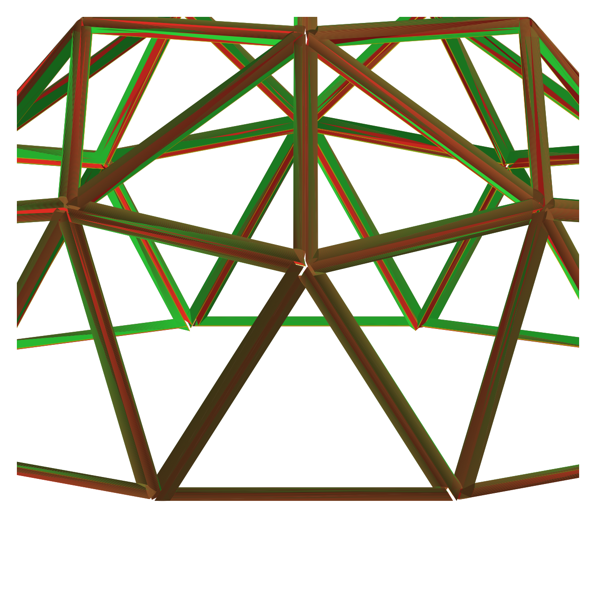

So the book's honest number for the joint is
9.82 square inches of end grain against side grain, per
member, at every interior corner. The frame has 120 members,
each with one loaded butt, and the arithmetic ends there, because the next
number — how many pounds that patch may carry — belongs to your tree, not
to this book.

What the book *can* say, and does: the bearing is generous by the
standards of light framing, the load spreads across the full width of the
sector rather than a bolt row, and the key between the members carries
the seam's alignment while the wood carries the building. The chapter on
the pinwheel (Chapter 15) and the one on the connector
(Chapter 17) show how that division of labour is built. This
chapter's job was the load path, and it is this: along the grain through
the members, across the grain at the butt, area the whole way.

## What this book will not tell you

This page is a warning, and it is not decorative.

This book will not tell you what your tree's wood is allowed to carry.
Allowable stresses depend on species, grade, moisture content, and the
direction of load; they come from published tables tied to specific
species grown in specific regions, and they are applied by someone who can
look at the actual timber. A pine from a plantation is not a pine from a
windbreak, a knot at a bearing face is not a knot mid-span, and green wood
carries less than dry wood while it dries. None of that can be looked up
by a book that has never seen your log.

It follows that nothing in this book is a structural sign-off. The frame
described here is a prototype method, demonstrated by a build, not an
engineered standard. Where a load figure matters — a floating dome hung
from trees, a floor hung from a mast, a roof carrying snow — the book
names the number as an engineer's job and leaves it there. Chapter
11 repeats this in its accounting of the costs nobody puts
in a dome book, and when this project forgot its own rule -- printing a
load-ish claim it could not stand behind -- it said so in public, on the
page rather than in a footnote.

The rule, once, plainly: **compute the geometry, check the code, and ask
an engineer about the loads.** Everything this book computes is geometry.
Everything an engineer decides is the rest.

## The number I will give you

One sidebar, one number, so the distinction above has a concrete object.

The bearing area of one butt end against one side: 9.82
square inches. That is geometry — the sector's area, computed from the
tree's own taper — and the book will stand behind it, because it is the
same arithmetic that produced the cut list, and it can be checked with a
ruler on the stick in your hand.

What that patch is *allowed* to carry, in pounds per square inch, is a
property of the species, the grade and the moisture — a table entry, not
a computation — and this book will not print one. It will tell you which
direction to look (across the grain, at the butt, at the wet case), and
it will tell you that the frame's own redundancy is the reason the method
tolerates being built from timber nobody graded: 40 panels
mean a member can be watched, and a member can be swapped, which is how
the frame was kept honest through its first year.

The book gives you the geometry and the method. The engineer gives you the
stamp. Neither one can do the other's job, and this book is built so that
the boundary between them is a page you cannot miss.

---

# 11. What a Dome Costs You

*The chapter that argues against the book*

## What a Dome Costs You

Every book about a building method owes its reader one chapter that tries
to talk them out of it. This is that chapter. It is not here for balance;
it is here because the costs it lists are real, they arrive late, and
they are the ones the rest of the dome literature leaves out — which is
exactly how people end up surprised by them.

The argument of this book is that a wedge dome is a remarkable way to get
a strong, cheap, buildable frame out of 3 trees. The argument of this
chapter is that a frame is not a house, and between the two sit three
costs the frame does nothing about: the room is round, the roof is many
angles, and the world of permits and appraisals expects a rectangle. Each
one is priced in time and money, each one is worse than the same problem
in a box, and none of them is fatal. They are the admission price of the
shape, and the honest builder pays it knowingly or pays it twice.

The chapter ends with the cases where the rectangle wins outright, because
those exist and the book's method is not a religion. If you read this
chapter and still want the dome, the rest of the book is yours. If you
read it and do not, the book has just saved you a year.

## Furniture does not fit a curve

The first cost shows up on moving day, and it never fully leaves.

A wall that curves is a wall that refuses the rectangle. Beds, dressers,
bookshelves, kitchen cabinets, a sofa — the furniture economy is built on
straight walls and ninety-degree corners, and against a dome's wall every
straight piece leaves a wedge of dead air behind it. That dead wedge is
real floor you paid for and cannot use, in every direction, at standing
height. The honest floor number for a dome is smaller than the plan-area
number, and Chapter 43 computes the standing-height map so
the loss is visible before you build rather than after you move in.

The fixes are real and none of them is free. A pony wall under the dome
buys back vertical wall at the edge — Chapter 57 prices it,
and it is the cheapest square footage in the building — but it is still a
cost the box never pays. Built-in storage shaped to the curve costs
custom work. Loose furniture loses its footprint to the geometry, piece
by piece. And the centre of a round room, where the headroom is highest,
is also where the room most wants its furniture to be — which is how a
round room ends up furnished as a ring around an empty middle, with the
good space in the middle spent on walking.

None of this is hidden. It is just not in the frame's price, and a frame's
price is what dome books quote. Count the round-room tax as real: a
fraction of the floor, a custom-furniture bill, or both, from the first
night you sleep in it.

## Roofing a compound surface

The second cost is the one that decides whether the dome survives its
third winter, and it is the reason dome builders talk about skin more than
they talk about anything else.

A dome's roof is one surface made of many flat panels meeting at
55 interior seams, every one of them a line where water can
get in. A shingled rectangle sheds water downhill in sheets; a dome sheds
it down forty facets and fifty-five valleys, and the valleys are joints.
The frame chapters show the seam doing its job with a key and a gasket,
and the weather chapter (Chapter 42) says the
number out loud — 55 of them — because the honest way to
think about a dome's roof is not "one roof" but "55 small
roofs, all meeting".

What that costs: the seam system is not optional and not trivial. The key
must fit its fold angle, the gasket must take up the tolerance, and the
whole assembly must still shed water after the wood has moved through a
year of drying. The skin options are priced in Chapter
40, and the pattern across them is the same — the
cheap skin costs more later, and the good skin costs now. A rectangle
with standing-seam metal and two valleys is a solved problem with a
hundred years of practice behind it; a compound surface is a solved
problem only if you do the work this book spends its middle chapters
describing. The roof is not where the dome is weak. It is where the dome
is *particular*, and particular costs attention, which costs time, which
is the currency a two-week frame is supposed to save.

## Permits, appraisals and resale

The third cost never touches the building and still moves the price.

Permits assume a rectangle. The building department's checklists, the
prescriptive code tables, the inspector's mental library — all of them
are written around conventional framing, and a hubless dome of split
wedges is not in any of them. That does not make it unpermittable; it
makes it *unusual*, and unusual means the plan review takes longer, the
official may want an engineer's letter (Chapter 10 tells you
what the engineer's letter does and does not cover), and the fee schedule
may have no line for you. Somewhere, the system will charge for being
surprised.

Appraisals assume a comparable. An appraiser prices a house by finding
three similar recent sales; a dome has no comparables, so the value comes
out of the method instead of the market, and the number is whatever the
method defends. That does not make the dome worth less — it makes its
worth *harder to finance*, and financing difficulty is a real cost for
anyone who is not paying cash.

Resale is where the two meet. The buyer's lender wants the same appraisal
the seller's did, the buyer's inspector has never seen a wedge, and the
pool of buyers who want a round house is smaller than the pool who want a
rectangular one. The network chapters in Part Two (Chapter
67 especially) exist because this project's answer to
resale is to make the dome *movable* — value it as a building that can
leave its pad — but that is a proposal, not a market, and the chapter
says so. The honest line for this chapter: a dome you build yourself and
keep is not exposed to any of this. A dome you build hoping to sell like
a house is exposed to all of it.

## When to build a rectangle

The closing test, stated as plainly as the method allows.

Build a rectangle when the building is a shed, a garage, a workshop, or a
storage room — anything where the square shape, the standard sheet goods,
the off-the-shelf door and the appraiser's familiarity are worth more
than the dome's savings. The catalogue this project prices shows the
border: the cheapest and dearest per-square-foot numbers in it are
7 and 68 dollars, and the box shed it
costs beside the dome shed comes out at 12,426 dollars
against 9,444 — close enough that the shed decision is
about doors and shelving, not about the frame. Build a rectangle when the
site, the code, or the lender is already fighting you, and the fight
would eat the savings. Build a rectangle when you need the work done by a
crew whose language is studs and trusses, not jigs and seams.

Build the dome when the floor is round and wants to be, when the frame
must be cheap enough to build twice, when the tree is already down, or
when the building is a home and the home is yours. The finished-home
comparison in the same catalogue — 84,983 dollars against
87,378 — shows the dome's frame advantage persisting into
the finished house, and Chapter 45 takes that number apart
line by line, including the lines that do not help.

The rectangle is a fine building. It is the right building in most cases.
This book exists for the cases where it is not, and the method it
describes is the strongest version of the alternative — measured against
the rectangle's own numbers, printed here, in the chapter that was
supposed to talk you out of it.

---

# 12. Split Like a Cake

*Three passes, eight sectors, and why eight*

## Split Like a Cake

This is the chapter with the actual cut in it — the one motion the whole
method hangs on, reduced to a procedure you could hand to somebody at the
log.

The idea was introduced in Chapter 5 as a discovery. Here it
is a technique. A round section of trunk, bucked to
6 feet, gets split along its length into
8 equal sectors — like a cake — by seven cuts, all of them
straight rips through the pith. Every stick that comes off is the same
shape: a 45-degree wedge, 3.83 inches
across its bark face, 5.00 inches deep from point to bark,
9.82 square inches of section. There is no squaring, no
planing, no second machine. The saw that felled the tree makes the
members.

The rest of the chapter is the order of the cuts, the reason the order
matters, and the reason it is eight and not six or twelve. The chapter is
short because the operation is. That is the point, and it is worth
remembering when the pile is knee-deep: the method's entire conversion
step is seven cuts per section, and each cut is a straight line.

## The three passes

The procedure, in order. The order is not tradition; it is what keeps the
section stable while you cut it, and a cut made out of order costs you a
pinched bar and a ruined pass.

**Pass one: halve it through the pith.** Stand the section on end or lay
it in a cradle, aim the bar down the centre of the end grain, and rip
from one end to the other. You now have two halves, each with one flat
sawn face and one round bark face. Do this pass first, every time,
because it is the only cut in the whole sequence where the section is
still round and wants to roll; once it is halved, every piece has a flat
to sit on, and everything after is stable.

**Passes two and three: quarter each half.** Lay each half on its flat
face and rip it into two quarters, again through the pith line. Four
quarters, each 45 times two degrees wide, each
with one flat and one round face still on it. The flat sits on the
cradle; the saw follows the centre line; nothing moves.

**Passes four through seven: eighths.** Each quarter gets one more rip,
from the remaining flat face through to the bark, and becomes two
eighths — the final sector. Seven cuts in total: one halving cut, two
quartering cuts, four eighth cuts. 8 sticks, all the same
sector, from a section of trunk that no longer exists.

Two things make the sequence forgiving rather than fussy. First, every
cut after the first is made on a piece that already has a flat face to
sit on, so the workholding is the piece itself. Second, you are never
measuring an angle: the cut list is "through the middle", repeated, and
the tree supplied the symmetry. A sector is 45
degrees because a circle divided in half three times is; nobody held a
protractor to it.

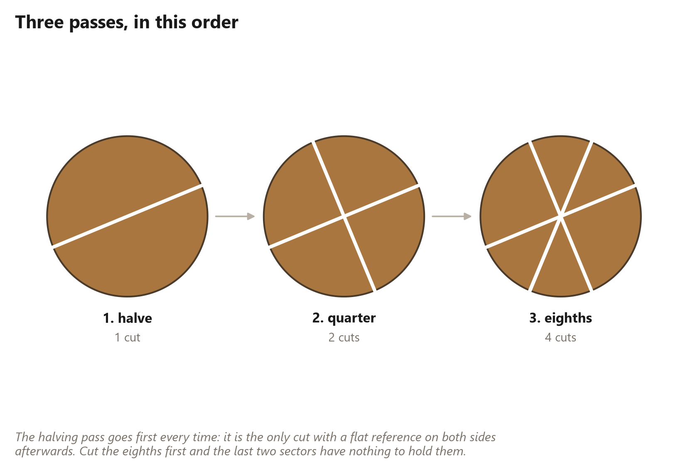

## Three cuts, eight sticks

The drawing shows the sequence end-on: one circle, then two halves, then
four quarters, then eight sectors, with every cut a diameter. Read it as
a production plan rather than a diagram, because the sequence is what
makes the work fast.

The first observation is that every pass doubles the number of pieces —
one becomes two becomes four becomes 8. The second is
that the work per piece falls as the pieces multiply: the halving cut is
the whole width of the log, the quartering cuts are half that each, the
eighth cuts a quarter of the log's width each. The third is that the
sequence never asks a decision. Nothing in it requires choosing where the
next stick comes from or how thick it should be; the geometry decided all
of that when the log was round. A procedure with no decisions is a
procedure you can repeat forty times without drifting, and a procedure
that doubles its output per pass is a procedure whose rhythm pays you as
you go.

Chapter 29 puts the sequence on a clock —
5.0 sticks an hour, sustained, once the cradle and
the rhythm are settled — and Chapter 33 shows
what happens to the pile after. Here the sequence stands alone, because
it is the one thing in the method that cannot be substituted: no mill,
no planer, no router table will produce this member, because the member
*is* the cut.

## One log, two, four, eight

The production hierarchy deserves its own paragraph, because it is the
part of the method that looks obvious and is quietly load-bearing.

One log becomes two halves becomes four quarters becomes
8 members. Every major cut doubles the piece count, which
means the whole tree converts in three layers of work: one cut at the
top of the tree, two in the middle, four at the bottom. That shape —
wide at the bottom, narrow at the top — is exactly what one person with
one saw can exploit. The slow cuts are few and wide; the fast cuts are
many and shallow. And because the pieces at each layer are identical to
their siblings, the workholding at each layer is one cradle, one stop,
one posture, repeated.

This is also the shape a guide rail, a cradle or a splitting fixture
would be built around, if you ever stop doing it freehand — the geometry
already knows where every cut goes, so a fixture that knows it too is
just the sequence, made of steel. The book keeps the hand version,
because the hand version is the whole point: the method exists so that a
person with a chainsaw and 3 trees needs nothing else.

## Why eight and not six or twelve

The question gets asked, usually at the first split pile: why eight?
The answer has three parts, and each one is a hard constraint.

**The sector angle has to leave the seam key workable.** A sector is
45 degrees, and the seam between two panels folds
by 18.03 to 22.46 degrees depending on where
it sits — Chapter 16 prints the full schedule. The gap the key
has to fill is the difference between the sector angle and the fold, and
at eight splits that difference is a real, makable, compressible thing.
Split the log into six and the sector is sixty degrees, the key becomes
a structural wedge in its own right, and the seam starts deciding the
geometry instead of the other way round. Split it into twelve and the
sector is thirty degrees — a sliver, hard to handle and hard to keep
straight over six feet.

**A sixth is too fat to handle alone.** Six sectors from a
12-inch butt are heavy, wide pieces with a
sixty-degree point; they are awkward to cradle, awkward to carry, and
awkward to fasten. Eight lands the member at 3.83 inches
across and 9.82 square inches of section — the size a
single person moves, lifts and sets all day, which is the constraint
Chapter 28 keeps coming back to.

**Eight is the halving count.** Two, four, eight — the sequence above
only needs cuts "through the middle", never a measured angle. Six needs
a sixty-degree first cut, held by eye or by fixture; twelve needs a
thirty-degree refinement. Eight is the finest split you can reach with
nothing but halving, and halving is the only cut a saw can aim by
symmetry alone.

The table on the next page runs the alternatives side by side so the
choice is visible rather than asserted.

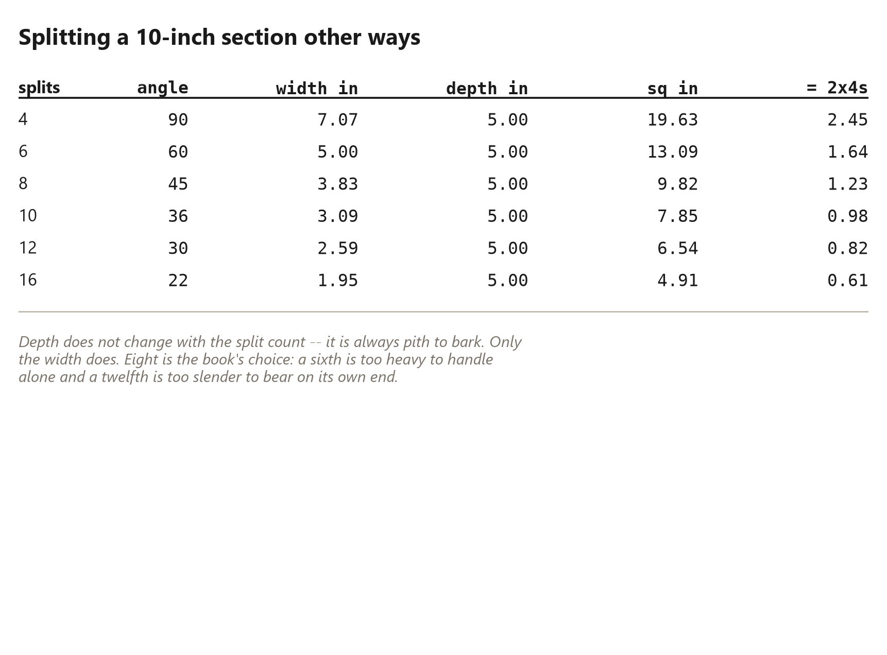

## What other split counts give you

The table is the arithmetic of the choice: six, eight, ten, twelve,
each with its sector width, depth and section. Eight is the reference
row, and the reason is not that eight is magic — it is that eight is the
row where the key fits, the stick is carryable, and the cut list is
still "halve it". Every other row trades one of those three away, and
the table makes you look at which one.

One more note for the pile, because it will come up: the split count is
a *build decision*, set before the first section is opened, and it
travels. The member width it produces sets the pinwheel inset, which
sets the cut list, which sets the jig. So the decision is made once,
from this table, and every number downstream follows. Change it later
and you are not adjusting a cut; you are starting the frame again. So
the table gets its own page, and the choice gets its own warning: read
the row, then commit.

---

# 13. Eighty-Seven Percent

*The recovery arithmetic, with the kerf paid for*

> **This chapter corrects something.** The 88% recovery figure in the project brief, which was computed for a 15-inch butt rather than this book's 12-inch tree.

## Eighty-Seven Percent

The headline number of the whole method, stated once with its caveats
attached, because the caveats are where the number lives:

Split the way this book splits, and a trunk keeps 87.4
per cent of its solid wood as structural members. Sawn the way a mill
saws, the same trunk keeps about 45. That is
1.93 times the usable wood, from a cheaper process,
with one machine instead of four.

The caveats, in the same breath: the 87.4 counts
*split wood only* — nothing planed, nothing dried, nothing graded; the
sawn comparison is the honest one for two-by-fours packed in a circle,
which is flattering to neither side; and the famous "88 per cent" from
this project's earlier films belongs to a bigger tree than this book's.
This book's tree is 12 inches at the butt and
keeps 87.4 per cent; the films' tree is
15 inches and keeps 88.4. Both numbers
are correct, for different trees, and the last page of this chapter
prints both rather than quietly picking the flattering one.

The rest of the chapter is the arithmetic, so the headline stops being a
claim and becomes a thing you could re-derive with the saw's kerf in
your hand.

## What a mill loses, and to what

A sawmill's job is to turn a round log into rectangular boards, and
everything it loses is the price of the rectangle.

**The slabs.** A circle does not contain its rectangle. The two rounded
sides of the log — the slab wood — cannot become boards of any width,
so they come off first, and they are the biggest single loss. On a
small log they are a huge fraction of the circle; the fatter the log,
the smaller the fraction, which is why mills pay per board foot and
prefer the big trees.

**The edgings.** Even the boards cut from the heart of the log carry
wany edges — bark, roundness — and must be edged square. More wood off.

**The trim.** Boards are sold in even lengths, square at both ends.
Every board loses its trim.

**The kerf.** Every cut turns wood into sawdust. A mill's band or
circle blade is thinner than a chainsaw's, but a mill makes far more
cuts per log, and the kerf is paid on every one.

**Drying degrade.** The boards are stickered, stacked and dried, and a
fraction of them check, cup, twist or stain past their grade. The wood
was there; the board is not.

**The grade fall.** Of what remains, some boards grade lower than the
rest, and low-grade lumber sells for less — a loss in value even when
nothing is lost in volume.

Add the five together and the famous range appears: a log sawn into
two-by-fours keeps roughly half of itself as saleable lumber. This
book's tree, packed honestly with true two-by-fours, keeps
45 per cent. None of that is incompetence. The
mill is extremely good at a job whose product is a rectangle, and the
waste is the price of the rectangle — paid in wood, at every station of
the chain Chapter 2 walked.

## What the wedge loses

Now convert the same trunk the wedge way, and count the losses again.

**The bark.** Lost either way; it was never wood. Not counted against
either method.

**The kerf — and that is nearly all.** The wedge makes seven cuts per
section, through the full diameter. Each cut is a 0.25-inch
kerf — a chainsaw's kerf, fatter than a mill's blade — and across
8 sections the kerf bill comes to 40
board feet of the trunk's 318. That is the honest, paid
price: 40 board feet of sawdust.

**Nothing else.** No slab, because the sector uses the whole radius.
No edging, because nothing needs a square edge. No trim beyond the
bucking. No drying degrade to speak of — a wedge is allowed to move as
it dries, and Chapter 48 explains why
a split moves less than a board. No grade fall, because the book grades
its own pile by eye and uses the rejects for blocking.

So the ledger closes: 318 board feet in the trunk, minus
40 of kerf, leaves 278 board feet of
structural member — 87.4 per cent — at
4.35 board feet a stick, which is what the worked
build in Chapter 24 turns into a cut list. The wedge
does not beat the mill at milling. It beats the mill at *this* — making
a structural member for a frame that never asked for rectangles — and
the beat is the difference between 87.4 and
45 per cent of the same tree.

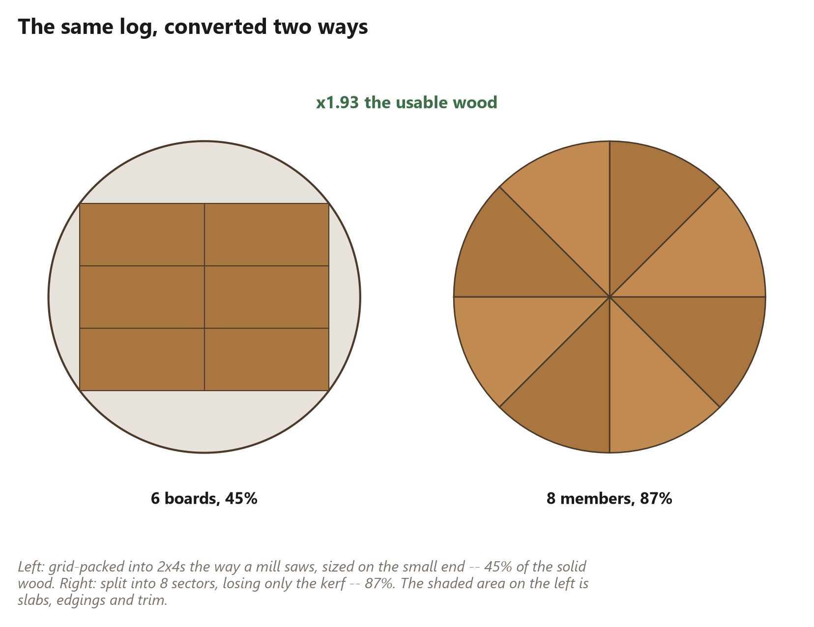

## Both conversions, same log

The drawing shows the same round section twice. On the left, the mill's
version: rectangles packed into the circle, slabs and edgings falling
away to the outside, the honest count of what a two-by-four economy
keeps. On the right, the wedge's version: the circle divided into
8 equal sectors, and every sector kept whole.

The picture makes the argument the numbers cannot. The mill's losses
are the *outside* of the circle — the part farthest from any rectangle.
The wedge's only loss is the thin lines of the kerf itself, running
through the middle. The mill throws away the corners; the wedge keeps
the corners and throws away the cut lines. The corners of a round log
are not bad wood. They are perfectly good wood of the wrong shape, and
"wrong shape" is a judgement the rectangle made, not the tree. Chapter
6 is the reason the frame is allowed to disagree, and
this drawing is the disagreement, priced in board feet.

## Section by section

The table carries the comparison down the whole trunk, one bucked
section per row, both conversions, because a taper means the answer is
not one number but a run of them — and the run is what you actually
cut.

Each 6-foot section of the trunk is a slightly
smaller circle than the one before it. The butt section packs more
rectangles and yields fatter sectors; the top section packs fewer and
yields slimmer ones. The table shows both columns shrinking as the
taper runs, and the recovery staying where the geometry put it: the
wedge's advantage is not a lucky average, it is a property that holds
section by section, from the 12-inch butt to the
8-inch top. Read it as a check on the headline
rather than as a second claim: if any row disagreed with the story
above, the story would be the thing to fix.

## Where 88 became 87

The errata page, because this project said "88 per cent" on camera and
this book prints 87.4, and a reader who notices the
gap deserves the explanation rather than the silent edit.

The films' recovery figure — 88.4 per cent — was
computed for the films' reference tree: 15 inches at the
butt, 60 feet usable, the big plantation pine of the
pine-value film. A fatter log puts more wood inside its circle and less
into its slabs, so the same split-and-kerf arithmetic keeps more of it:
88.4 per cent.

This book's tree is smaller — 12 inches at the
butt, 48 feet usable, the windfall of Chapter
1 — and the same arithmetic, run on
the smaller circle, keeps 87.4 per cent. The kerf is
the same 0.25-inch chain; the circle it eats is simply a
smaller fraction of a smaller pie.

Neither number is wrong, and neither was ever a lie. They are two
recoveries for two different trees, and the earlier films named their tree while
this book named a different one. The book's discipline — stated on this page, and kept on every errata
page like it — is that a correction names
the error, prints both numbers, and leaves the arithmetic visible. That
is what this page is: 88.4 for the pine the films
priced, 87.4 for the tree this book builds, and the
reason they differ is the diameter, printed in the table above, one row
per section.

---

# 14. Four Ways Up

*One stick, four orientations, four different buildings*

## Four Ways Up

This chapter is the most original idea in the method, and it is the one
nobody sees coming, because it concerns a property most building methods
do not have: the stick has a front.

A two-by-four is symmetric enough that nobody asks which way up it goes.
A wedge is not. It has a point and a curved bark back, two flat sawn
faces meeting at a 45-degree angle, and it is
never the same stick twice. Which way its point aims — into the room,
out to the weather, along the seam — changes what the frame does with
it, without changing a single dimension. One stick, cut once, can be
four different members, and the four buildings that result are four
different answers to the same geometry.

The chapter walks the four orientations and ends with the table that
chooses between them, read straight from the simulator's own seam
readings. The default — the one the rest of the book builds in — is
named and defended. The other three are not mistakes; they are the
method's spare capacity, and each one buys something specific at a
specific price.

## Rotating about its own axis

Hold the wedge out in front of you, point up, bark toward your chest.
Rotate it about its own length — the axis from butt to head. At every
quarter turn it presents a different face to the room and a different
edge to the weather, and nothing about its cut list changes. That
freedom is the whole idea: the frame's geometry cares where the
stick's *surfaces* sit, not where the stick's *shape* came from, so the
builder gets to choose the surface, free.

The four orientations come from the two decisions the rotation makes.
First, where does the point aim — toward the centre of the dome or
toward the centre of its own panel? Second, do the two sticks flanking
a seam aim their points together or apart? Point *dome in* means every
wedge points at the middle of the building, bark to the weather. Point
*panel in* means each stick aims into its own triangle's middle, the
pair beside a seam pointing apart. Point *dome out* turns every wedge
backward, bark to the room, point at the sky. Point *panel out* turns
the pair toward each other across the seam. Four ways up, same stick.

What changes between them is real, and it is measurable: the two sawn
faces open by a different angle, the key has to be a different shape,
and the key's own base moves from 2.80 inches across to
11.67 in the widest arrangement. The next four
sections take them one at a time; the plate shows all four.

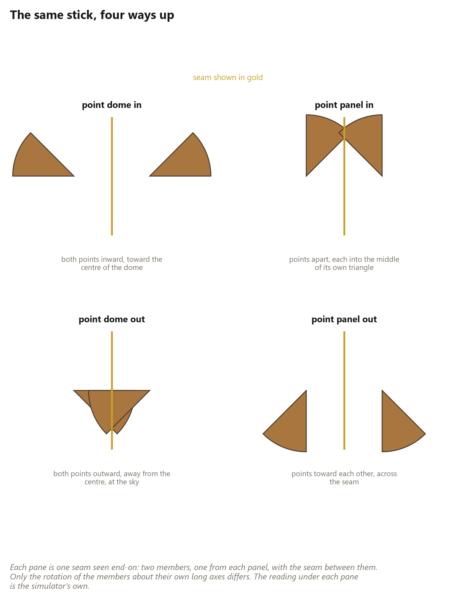

## All four, side by side

The plate is the whole chapter in one look, and it is not a sketch: each
pane is a seam **cut across, through the solver's own meshes**, so what
you are looking at is the joint, not an illustration of it. Two members,
one from each panel, and the key in gold between them. In every pane the
weather is up.

Read the panes for the two things that change. First, *which face of the
stick the key bears on*: in the first pane the key sits between the two
narrow sawn faces, a slim spline; in the second and fourth it bears on
the broad sides and becomes a wide shim; in the third the wood is turned
around, so the key is fitted from the inside. Second, *how much key*:
the width printed under each pane is the base of the key as the solver
slices it, and it is not the same number twice.

The four arrangements are not four aesthetic choices. They are four
key-cutting choices and four weather choices, and the table at the end of
the chapter prices them. First, each in its own words.

## Point dome in

The default. Every wedge points at the centre of the building, bark
out, sawn faces lying along the seams. This is the orientation the rest
of the book builds in, for three reasons that stack.

**The key gets flat faces.** A seam's key sits between the two sticks'
sawn faces — the only faces the saw ever made flat — so it bears on
machined wood rather than on bark. At this orientation those two faces
stand 26.97 degrees apart, the key is a narrow taper
2.80 inches across its base, and it bears
6.0 inches along the seam. That is the joint every
chapter before this one has been drawing.

**Bark faces the weather.** The curved back of every wedge is the
building's outside face: one continuous, shed-ready, bark-clad surface.
Chapter 42 builds the rain strategy on exactly
this — water runs down bark, off the seam's shoulder, to the rim.

**The stick tells you which way it goes.** This is the quiet one, and
builders feel it at the top of a ladder. Bark out, pith in: the stick
is self-labelling. Nobody marks "this side out" on a hundred and twenty
members, because the tree already did — the bark is the outside, the
point is the inside, and a wrongly rotated stick announces itself the
moment you try to lay the key against it.

And one geometric detail that turns out to matter at the bench: the key
is **outboard of the two points**. Cut a seam across and the members'
points are the innermost thing in it, with the key sitting in the wedge
of space between them and the meeting line of the two bark faces — so
the key is reached, fitted and checked from *outside* the shell. That is
the practical reason this orientation is the one the book builds in,
and the next one down the page loses it.

The cost of point dome in is the ridged interior: the room's wall is a
field of points. Acceptable in a frame you will sheath; Chapter
43 decides how to live with it.

## Point panel in

Each stick aims its point into the middle of its own triangle, so the
pair beside a seam point *apart* — away from each other, one into each
neighbouring panel's centre.

What it buys: the key moves off the narrow sawn edges and onto the
broad sides of the pair, and it stops being a spline and becomes a
broad shim. Cut the same seam across and the two faces now open
153.03 degrees, with the key
11.67 inches across its base — 4.2
times the width of the default's key. For a seam asked to carry more
than alignment, that is real contact area rather than a line of it, and
the simulator keeps the orientation as a first-class option for exactly
that.

What it costs: the bark faces lean away from the weather and into the
seam's shadow, so the outside surface is no longer a clean field of
bark; the wide key is more timber per seam than the default; and the
self-labelling gets subtler, because "point toward the middle of your
panel" is an instruction you must remember, not one the stick shouts.

## Point dome out

Every wedge reversed: bark to the room, point to the weather. The
building's outside becomes a field of ridges — forty panels of them —
and its inside becomes the smooth curved field of bark.

What it buys is mostly weather. The pointed outside sheds water the way
a ridged roof does, each ridge its own drip line, and the seams sit in
the valleys between ridges instead of on the crests — a configuration
some roof builders prefer on principle, because the joint lives where
the water is already heading.

What it costs is the thing the previous section praised most. The key
still sits between the two sawn faces — the geometry does not change
what the wood is — but the *meeting line* moves to the other side: the
bark faces now converge on the inside of the shell, the key's base is
6.27 inches across (against 2.80 in the
default) with the faces 63.03 degrees apart, and the
key now lies *inboard* of the two points. Fitted from the room side, not
from the weather side. Everything about the joint still works; the
person fitting it is now indoors, on a ladder, in a small round room,
which is a worse place to be laying a key than the outside of a roof.
And the self-labelling inverts: pith out, bark in, which reads wrong to
every instinct a woodworker has.

Point dome out is the orientation to remember exists and not choose —
unless the building's skin is a ridged shingle system designed for it,
which is a real design and not this book's.

## Point panel out

The fourth rotation: the pair beside a seam aim their points *at each
other, across the seam* — each stick's point reaching over the joint
toward its neighbour's back, bark faces turning in toward the panel's
middles.

What it buys: the room side of every panel is a field of the flat sawn
faces — the smoothest interior the four orientations offer — and the
key is broad, like the panel-in orientation:
11.67 inches across its base with the faces
153.03 degrees apart. What it costs: the pair's
points are toward each other across the seam, so the weather face of the
building is partly sawn face — the face the finish chapters warn you
never to leave exposed — and the two sticks' broad faces, not their
edges, are what the key bears against, which is more timber per seam
than any other orientation. Chapter
48
returns to this when it discusses char and oil, because the one
orientation that puts sawn face outdoors is the one this book does not
build.

## Choosing one

The table is the decision, and it is read straight from the simulator's
own seam readings rather than from adjectives. Each row: one
orientation, its contact geometry, its weather face, its inside face,
and the verdict the solved model gives it.

The row that matters is the default's, and the reason it wins is not
that it is perfect — it is that it is the only orientation where every
job lands on the face built for it. The key gets the sawn faces. The
weather gets the bark. The room gets the points it can sheath over.
And the stick labels itself, so the hundred and twentieth member is
placed as correctly as the first.

The other three rows are the method's spare capacity: point panel in
when the seam must be stiffer, point dome out when the skin is designed
for ridges, point panel out almost never. The table keeps all four
because a choice made from the table is a decision, and a choice made
from habit is a gamble — and the orientation, once the first panel is
built, is the one decision in the method you cannot take back.

---

# 15. The Pinwheel

*Three sticks, one triangle, and not one mitre*

> **This chapter corrects something.** The 'no mitres anywhere' claim, already corrected on camera in lesson_wedge_why.

## The Pinwheel

This is the joint that makes the whole method buildable by one person,
and it is worth stating in one sentence before the geometry spends it:

**No member end ever meets another member end. Every member's butt end
lands on the flat side of the next member, one cut per stick, and the
corner is empty.**

That sentence deletes, in order: the hub, the mitre at every end, the
compound-angle saw settings, and the requirement that rough split
timber behave like milled stock. What it costs — and it does cost — is
a slightly smaller panel than the triangle it sits in, and a cut list
four lengths long instead of two. Chapter 9
already counted that bill. This chapter shows the joint that issues
it.

The name is descriptive. Look at a corner of the built panel: the three
members overlap like the blades of a pinwheel, each butt end lying on
its neighbour's side, chasing each other around the triangle, none of
them meeting at the vertex. The vertex — where a hubbed dome puts its
connector — is empty air. The frame does not need anything there,
because the triangle is closed by the three overlaps, and the overlaps
are held by screws through flat wood into flat wood.

## Why mitres were the enemy

The conventional way to join three struts at a corner is to make them
meet: each end cut to the right compound angle so the three ends kiss
at a point, then a hub or a plate holds the kiss together. It is the
geometry of every geodesic kit ever sold, and for machined aluminium
struts in a factory it is fine.

For this method it is fatal, for three reasons that compound.

**A mitre is two angles at once.** The end of a dome strut has to
match both the panel's fold and the member's position around the
corner — a mitre and a bevel together. Cut one slightly wrong and the
struts no longer meet; cut forty panels' worth slightly differently
wrong and the dome has a gap for every mood.

**Every stick needs two of them.** Both ends of every member would be
mitred — 120 members, two ends each, each end its own
setting — against a stick that is rough, tapered, green and moving.
Precision joinery on wood that never agreed to be precise is not a
building method; it is a bet against the material.

**The corner has to be perfect or nothing is.** When three ends meet
at a point, all three must arrive exactly, or the hub cannot close. The
tolerance is concentrated in one place, which is the worst place for a
frame built from a log: every error in the whole build queues up at
the vertex and waits.

The pinwheel sidesteps all three by moving the joint. The ends do not
meet, so they do not have to match. Each end lands on a flat side, and
a butt end on a flat side needs only to be square to its own length —
one cut, made once, on a jig. The overlap is where the tolerance lives,
and an overlap is a joint that can be off by half an inch and still
hold, because the screws have a whole side of wood to find.

## Each end lands on a side, not a point

The pinwheel, in the way that finally makes it obvious, because the
obvious version is what you will teach somebody at the bench.

Take three sticks. Lay the first two in the triangle's shape, and
instead of cutting them to meet at the corner, let each one run *past*
the corner along the side of the other. Now the first stick's end rests
on the second stick's side, not its end. Lay the third stick the same
way: its end rests on the first's side, and the second's end rests on
the third's. Three ends, three sides, one closed triangle, and the
actual corner of the triangle — the point where the lines would meet —
has nothing in it at all.

That is the whole joint. Every member is cut square on its butt end and
left long on its head end, and the overlap is resolved at assembly.
The result reads as a pinwheel because each stick's butt chases the
next stick's side around the corner, and the chase closes the triangle
without any stick ever touching the vertex.

Why this survives rough timber: the bearing patch is a full side of a
stick — 9.82 square inches of flat-to-flat contact,
as Chapter 10 measured — and the screws run through the
overlap at right angles to the grain, where wood holds best. Nothing
in the joint depends on an angle being cut accurately, because the
only cut angle in the whole assembly is the square butt, and the
square butt is the one cut a jig can make identical forty times.

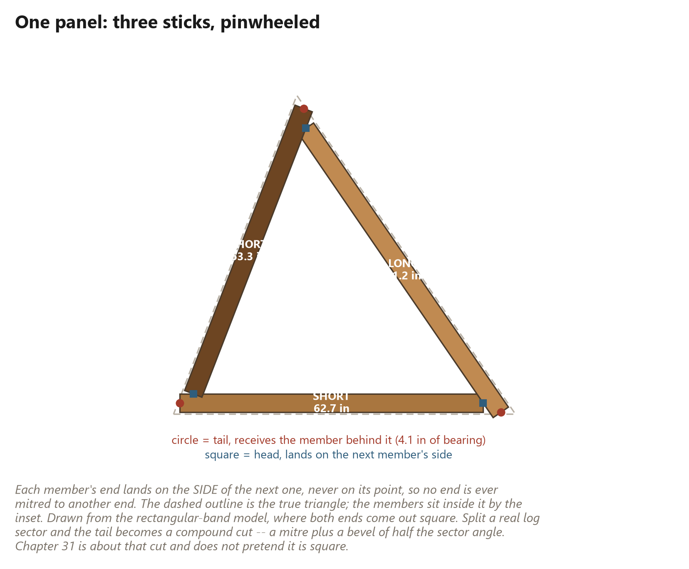

## One panel, taken apart

The drawing explodes one panel and labels the three overlaps, so the
sentence above has a picture to check against.

**The butt end.** Square to the stick's length, the one machined cut
on the member. It is made on the jig, once, with the stick located on
its sawn faces — Chapter 34 is that cut in full.

**The bearing side.** The neighbour's sawn face, where the butt lands.
Flat, because the saw made it flat, and wide, because the whole sector
is wide.

**The head end.** Deliberately long. It runs past its own bearing by
the overfit allowance — 6 inches in this build —
and gets sawn off in place against the jig's fence, which is how the
panel ends up true without anybody measuring a stick to a tape. Chapter
35 is that trick, and it is the quiet reason the
method forgives.

**The empty corner.** The vertex itself, untouched. In a hubbed dome
this is where the money is — the machined connector, the bolt, the
precision. Here it is air, and the air is doing its job by not being
asked to do anything.

Read the exploded drawing once and the build order falls out of it:
butt cuts first, on the jig; panels assembled flat, overlaps screwed;
heads flushed; panel lifted. Nothing met anything. Nothing had to.

## What the inset costs

The honest price of the pinwheel, because the joint's elegance is real
and its bill is real, and the book prints both.

The triangle's *edge* — the geometric line from vertex to vertex — is
longer than the member that fills it, because the member stops short of
the corner to land on its neighbour's side. The difference is the
inset: the distance each stick pulls back from the vertex so its butt
lands on the next stick's side instead of on the next stick's point.
Every member length in the cut list is the edge length minus its share
of the inset, which is why the cut list has four lengths where the
geometry has two — the inset differs between the long and short edges,
and between the two sides of each.

The inset also shrinks the panel. The frame's triangles, drawn vertex
to vertex, are bigger than the wood that fills them; the panel is the
triangle minus three strips around its edge. That strip is not waste —
it is the bearing, the overlap, the screw row — but it is real, and it
is why the member schedule in Chapter 24 is the
number it is rather than the bare chord factors.

And the inset scales with the *stick*, not the dome. A wider member
pulls back further; a bigger dome changes nothing. That single fact is
why the method survives scaling — Chapter 51 makes it
the spine of Part Two — and it is paid here, in the cut list, once.

At the bench the inset is not paid in arithmetic at all. It is already in
the members: the master cut list of Chapter 24 —
72.0, 63.5 and
61.5 inches — is what the sticks measure once they have
been cut to make a panel the right size, so the inset is spent at the saw
and never re-derived at the bench. The model's own schedule prints the
inset as a fourth length; the build's list is the measured three, and the
difference between the two is a model of the joint rather than a measurement
of it.

## The mitre claim, corrected

The errata, named in full, because this project said it in public and
the correction belongs in public too.

An earlier film in this project claimed that no cut in the dome is a
mitre. That was wrong, and it was corrected on camera before this book
existed — the film's own correction chapter is the model this page
follows.

The true statement is narrower and better. No member end is ever
mitred *to another member end*, because the pinwheel never lets two
ends meet. But the butt end itself is not a plain square crosscut: it
carries the bevel that matches the neighbour's side and the angle that
matches the panel's fold — a compound cut, made once, on one end, off
the jig, with the same setting for every stick of a class. The whole
dome reduces to a handful of saw settings — the bevel is the same
everywhere, and the mitre takes a few fixed values — and that is the
claim worth making: not "no mitres", but "no mitre is ever measured,
and no two ends ever meet".

The errata pages in this part carry the rest of the list. This page is
one entry in it: the claim, the error, the corrected version, and the arithmetic
that decides which is which — the same treatment the book gives every
number it has ever got wrong.

---

# 16. The Seam and Its Key

*Where two panels meet, and the angle nobody wants to hear about*

## The Seam and Its Key

This is the least glamorous chapter in the book, and it is the one that
decides whether the dome closes.

The frame's 40 panels do not simply sit next to each
other. They meet at 55 interior lines, and at every one
of those lines two flat triangles fold against each other at an angle
that the sphere, not the builder, chose. Between the two members in
each seam sits a key — a strip of wood or compressible material cut to
the fold — and the key is where the whole tolerance budget of the
method finally lands. Get the keys right and the dome closes like a
lid. Get them wrong and forty panels of *nearly* closing is a dome
with a gap in it, which is what Chapter 5 spent a week
learning the hard way.

The chapter has one unwelcome fact to deliver first — the fold angle
is not constant — and then two honest ways to answer it, a table of
every seam in the dome, and the third option that sidesteps the whole
question. It is short, because once the fact is accepted the answers
are small. The week was spent on the accepting.

## The fold angle is not constant

Say it early, because everything after depends on it: **the angle at
which two panels meet is not the same everywhere on the dome.**

It cannot be. A dome is a sphere approximated by flat triangles, and a
sphere curves differently in different places. The panels around the
five-fold points of the underlying icosahedron meet at one angle; the
panels along the belt between them meet at another. A 2V hemisphere has
exactly two fold angles — 18.03 degrees and
22.46 degrees in this build — and that is the good news
hidden inside the bad one. Not forty angles. Not a continuum.
2. The bad news is that 2
is not one, and a key cut to one of them will not seat in the other.

The schedule on the next pages counts them: 25 seams at
the tighter angle, 30 at the wider, 55 in
all. The difference between the two — under five degrees — is small
enough that every instinct says to ignore it, and large enough that
forcing it closed puts the frame in permanent tension, the keys in
permanent shear, and the builder in the position the frankendome
already visited. The honest answers accept the difference and spend a
little labour on it. The dishonest one — "it is nearly the same" —
costs the dome.

And here is the theorem that makes the method's peace with it, because
it deserves the name: the two fold angles and the two leftover gap
angles each sum to exactly the sector the tree was split into —
45 degrees. The gap the key fills beside a
18.03-degree fold is the rest of 45;
beside a 22.46-degree fold it is the rest again. The
sector you split out of the tree is, exactly, the seam budget the dome
needs. Nothing in the method was tuned to make that true; it falls out
of the two geometries and it is why the key problem has an answer at
all.

## Raw trapezoid, or shaved flat

Two honest ways to make the key fit the two folds, and the book prices
both.

**The raw trapezoid.** Leave the split faces of the members exactly as
the saw left them — each sits 22.5 degrees off its
member's centreline — and cut the key to fill the V they make. Cut the
seam across and the two sawn faces stand 26.97 degrees apart,
with the members' points as the innermost wood and the key lying in the
space between them and the meeting line of the two bark faces: a taper
whose base is 2.80 inches across, at the inside, and whose tip
reaches the apex at the outside. It bears 6.0 inches along
the seam. The cost is a key that is not one part but two — one profile
per fold angle — and a stock pile sorted by profile. The gain is that the
member is never touched by a plane, and every piece of the joint stays
exactly what the saw made. The figure below is that section, cut out of
the solver's own meshes.

**The shaved flat.** Plane a narrow land along each member's two sawn
faces until they sit parallel to the seam, then one flat key fits
everywhere — 1.12 inches across as the solver models it,
one key for all 55 seams. The cost is planing —
0.48 inches at the deepest, which is
10 per cent of the member's depth, over a land
only as wide as the key's bearing — and the labour of it, which Chapter
17 works through completely, because the number is smaller
than the instinct expects and "smaller than expected" is exactly the claim
this book verifies before it repeats.

Both answers are correct; they are two ways to spend the same small
labour, and the figure shows both sections side by side so the choice is a
comparison rather than a preference. The book's build uses the shaved-flat
answer, because one key everywhere is one less way for the pile to be
sorted wrong, and because a planed land gives the key a true bearing. The
tapered key remains the answer for a builder with no plane and no patience
for one.

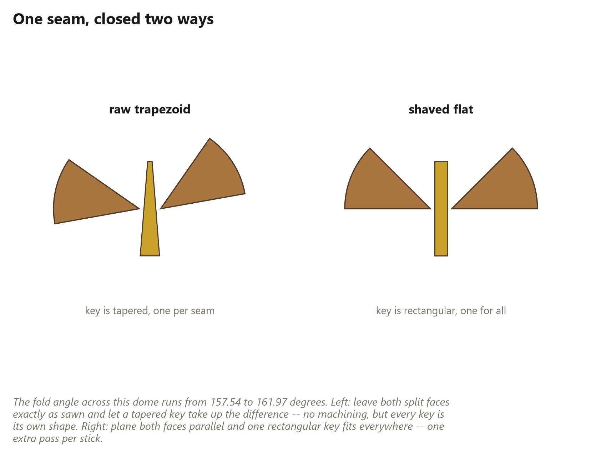

## One seam, both ways

The drawing shows the same seam twice. On the left, the raw split
faces and the tapered key between them — the key's two edges cut to
different slopes, each matching the face it bears on. On the right,
the same two members with a narrow land planed flat on each, and one
parallel-sided key dropped in the gap, the same key that fits every
other seam in the dome.

The drawing is the decision, and the decision is smaller than it looks.
The tapered key moves the work into the key stock — two profiles,
sorted and matched. The shaved land moves the work into the members —
one profile, one plane setup, repeated at every seam. Either way the
work exists; the book simply chooses to pay it where the sorting
cannot go wrong. Chapter 33 shows the fixture that
makes the shaved land repeatable, and the seam schedule below shows
the two angles it is compensating for.

## Every seam in the dome

The table is the whole seam budget on one page: all 55
seams, their fold angles sorted, the two extremes named, and the key
profile each one takes. It is generated from the solved dome, not
surveyed from the build, so it is the plan the frame was drawn to —
and the plan the build should be checked against.

Read it as a work order rather than a curiosity. 25 of
one profile, 30 of the other, and the check that closes
the chapter: when the last panel is in, the number of keys placed
should equal 55, the number of profiles used should equal
2, and the dome should close without being
forced anywhere. If any of those checks fails, the frame is not the
frame this book drew, and Chapter 38 is where
the book tells you where the error went.

## Hose, key or nothing

The third option, and the one that ends the chapter, because sometimes
the honest answer to an angle is a material that does not care about
it.

**The compressible seam.** A gasket — rubber, foam, a length of hose
— fills the gap by deforming instead of by matching. It absorbs the
fold difference, the drying movement, and the build's own tolerance in
one object, and it seals while it does it. What it cannot do is carry
structural load the way a timber key can, which is why the frame's
seams are built with a timber key *plus* the gasket where the shell
must be weathertight — the key locates the geometry, the gasket seals
the gap, and neither is asked to do the other's job.

**And the honest nothing.** The frame, left bare, closes without any
key at all: the butt ends bear directly on the sawn faces, and the
seam is a gap the shell chapters will have to deal with. It is not a
building; it is a stage of one. But it is a legitimate stage, and
building the frame bare first — checking the fold schedule against the
real sticks before any key stock is cut — is the cheapest way to find
the error the table above was designed to prevent.

The key, then, is the method in miniature: a small part, cut to the
two numbers the geometry actually produces, repeated until the pile is
gone, and checked against the count when the dome closes. The least
glamorous chapter in the book. The one that decides whether it
closes.

---

# 17. Let the Connector Hold the Angle

*Keep the wood, machine the small part*


## Let the Connector Hold the Angle

There is a principle underneath this whole method, and it is worth stating on
its own because it is the thing that makes rough natural timber buildable to a
tolerance at all.

> The tree supplies the mass. The jig supplies the repeatability. The
> connector supplies the precision.

Three jobs. Three different things doing them. Nothing asked to do two.

## Precision is expensive per cubic inch

The instinct with an irregular material is to machine it until it is regular.
Plane the faces, square the ends, bring everything to a dimension, and then
build with confidence.

That instinct is why dimensional lumber exists, and inside a mill it is the
right instinct — a mill can afford to hold a tolerance because it is holding
it on thousands of pieces with a machine built for nothing else.

A person with a chainsaw cannot afford it, and the reason is not skill. It is
that **precision costs roughly in proportion to how much material you have to
be precise about**. A long, heavy, awkward member is expensive to hold, to
reference, to feed and to correct. A small block is cheap to hold and cheap to
remake if you get it wrong.

So there is a choice about *where to put the accuracy*, and the two answers
lead to very different afternoons:

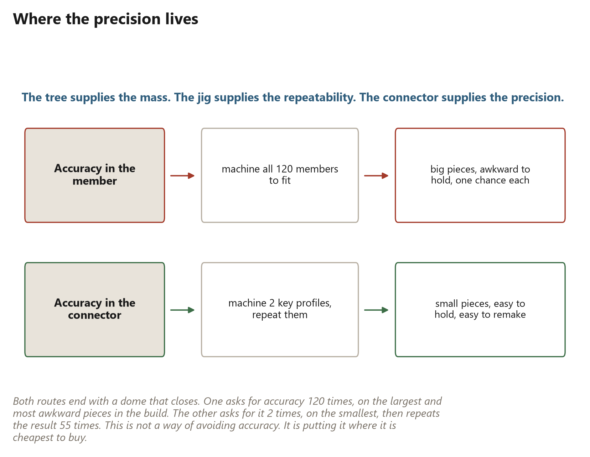

One route asks for accuracy 120 times, on the largest and most
awkward pieces in the build, with one chance at each. The other asks for it
2 times, on the smallest pieces, and then repeats the
result 55 times.

Both end with a dome that closes.

This is not a way of avoiding accuracy. Nothing here is less accurate than the
alternative — the seams end up at the same angles either way. It is a question
of *where the accuracy is cheapest to buy*, and the answer is: in the small
part.

## The wedge starts close to useful

There is a piece of luck in this, and it is the reason the wedge suits a dome
rather than merely tolerating one.

A rectangular board arrives with two faces at ninety degrees to each other.
Ninety degrees appears nowhere in a geodesic dome. Every angular relationship
in the frame has to be created from nothing, by cutting.

A split sector does not arrive square. It arrives with two sawn faces that
each sit **22.5 degrees** off the member's own
centreline, because that is half of one 45-degree
sector.

And the seams of this dome fold by 18.03 and
22.46 degrees.

Those are not the same numbers. The wedge does not magically arrive at the
right angle — that would be too good, and this book does not do too good. But
it arrives *within a few degrees* of what the joint wants, rather than
sixty-odd degrees away.

The natural shape of the tree becomes part of the joint system instead of an
obstacle that first has to be removed. That is the difference between a
material that suits a structure and one that merely survives it.

## Two ways to close the difference

The gap between the face you have and the face the joint wants can be closed
from either side.

**Shape the key.** Leave both sawn faces exactly as split and cut a tapered
key that fills whatever is left. No wood is machined at all. The cost is that
the key is not the same shape at every seam, so there is more than one key
profile to make.

**Shape the wood.** Plane both faces parallel and drop in a plain rectangular
key that fits everywhere. One key profile for the whole dome. The cost is a
machining pass on every stick.

Chapter 16 covers what each does to the seam. This chapter is about
what the second one costs, because it sounds much worse than it is.

## What planing the faces actually costs

Here is the arithmetic, and it is the most reassuring table in the book.

The raw split face sits at 22.5 degrees. A flat key wants
a face at half the seam's fold angle. The difference between those two is
everything that has to come off.

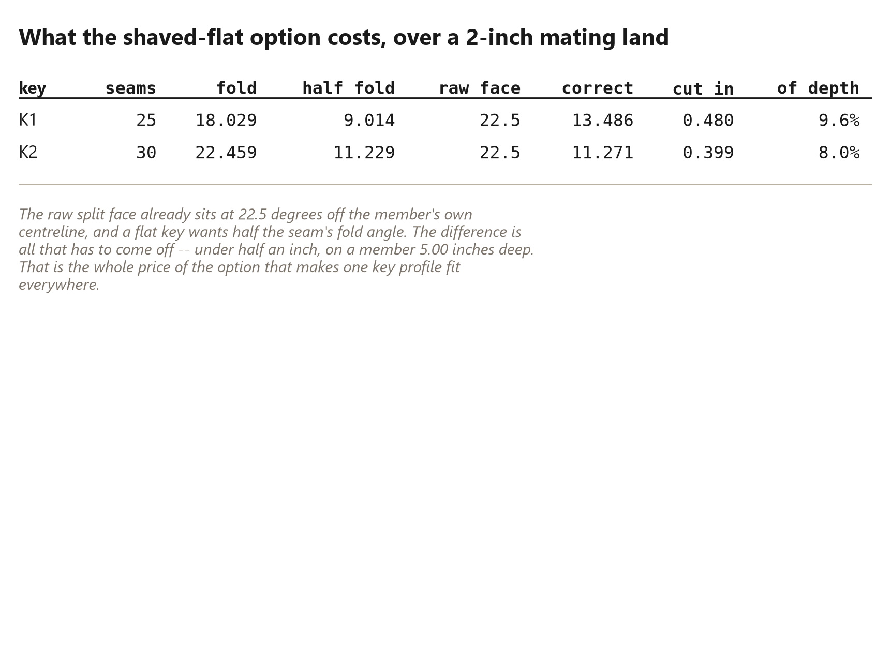

Over a two-inch mating land — you do not need the whole face to bear, only a
band of it — the deepest cut anywhere in the dome is
**0.48 inches**.

On a member 5.00 inches deep, that is
10 per cent of the section.

So even the "machine the wood" option does not convert a wedge into something
resembling dimensional lumber. It removes a narrow sliver from a narrow band
and leaves the overwhelming majority of the member exactly as the saw left it.
You are still not making boards. You are making one precise interface on an
otherwise raw stick.

That is worth knowing before you decide, because the shaved-flat route is
often written off as a betrayal of the whole idea. It is not. It is a
10 per cent concession that buys you a single key
profile.

## Or do not machine anything at all

There is a third answer, and in some builds it is the best one: make the
connector out of something that does not need to fit exactly, because it
deforms.

A rubber or closed-cell spline, a length of hose, a compressed gasket — any of
these fills a *range* rather than a value. Feed it a seam anywhere between the
two fold angles and it takes up the difference by squashing.

What a compliant key can do, all at once:

* absorb the angular difference,
* absorb manufacturing variation in the members,
* seal the seam against weather,
* isolate one panel from another acoustically and against vibration,
* hold a preload so the joint stays tight as the wood moves.

What it cannot do is carry the load a timber key carries. A compliant seam is
a weather joint and a tolerance joint; it is not a structural one. So the
choice depends on a question you should answer before you buy anything: **is
this seam holding the building up, or holding the weather out?**

In a frame where each panel is a complete, self-braced triangle — which is
what Chapter 18 is about — a great deal of the shell's stiffness
lives inside the panels rather than across the seams, and that is what makes
the compliant option viable at all.

## Why this is a manufacturing idea, not a dodge

It is worth defending this properly, because "let the connector take up the
difference" can sound like an excuse for sloppy work.

It is the opposite. It is how repeatable production works everywhere.

A machine shop does not hold a tolerance on every surface of every part; it
holds it on the surfaces that locate and mate, and leaves the rest rough
because rough is cheaper and does no harm. An engine block is machined to a
few thousandths where the bearings sit and left as cast everywhere else.
Cabinetmakers scribe one edge to a wall and leave the other three alone.

The principle is always the same: **decide which surfaces do work, and spend
your accuracy there.**

In this dome, the surfaces that do work are the mating faces of the seam and
the ends where one member bears on another's side. Everything else — the bark,
the taper, the natural bend, the exact diameter — can vary, and the jig is
designed so that it can.

The tree is not being asked to be accurate. It is being asked to be strong,
which it already is.

---

# 18. Why Every Panel Keeps Its Own Edge

*One hundred and twenty members for sixty-five edges, and what the difference
buys*


## Every Panel Keeps Its Own Edge

If you have been adding up as you read, something has not been adding up.

## The arithmetic that does not look right

The frame has 40 triangular panels. Each panel has
3 members. So:

> 40 × 3 = **120
> members**

But the shell only has **65 edges**. Count the lines on a
drawing of the dome and that is what you get: 55 interior edges
where two panels meet, plus 10 around the open bottom where
a panel meets nothing.

So there are 55 more members than there are edges for them
to be.

That is not an error. It is the single biggest deliberate decision in this
frame, and it costs **1.85 times** the timber a
conventional geodesic skeleton would use.

It is worth being clear about the size of that, because it is not a rounding
difference. If you built the same dome with one shared strut per edge you
would need 65 members instead of 120. The panelised
frame uses almost twice as much wood in the frame.

Here is why it is worth it anyway.

## What is actually at a seam

In a classical geodesic frame, an edge is one strut, and the two triangles
either side of it both fasten to that same strut. Efficient, and the standard
way it is done.

In this frame, each panel is built complete — three of its own members, closed
into its own triangle — before it goes anywhere near its neighbours. So where
two panels meet there are two members, one belonging to each, with the key
between them.

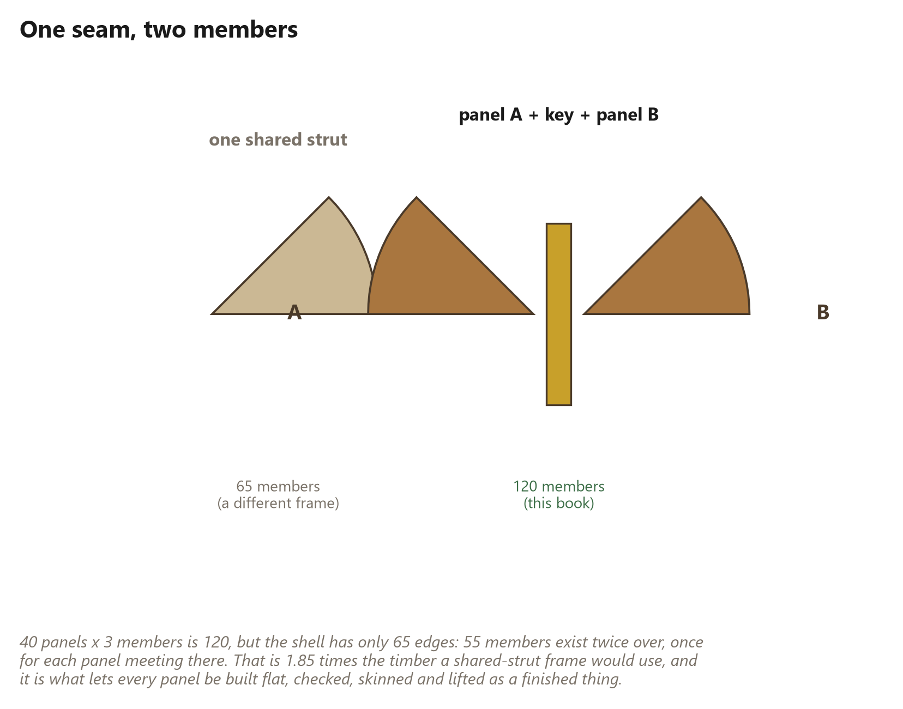

Panel A's member. The key. Panel B's member.

The duplicated edge is not lumber somebody forgot to remove. It is the price
of a panel being a *thing* rather than a position in an assembly.

## What the extra wood buys

Six things, and the first three are why the fortnight in Part 5 is a fortnight
rather than a season.

**A panel can be built flat.** All three of its members exist and belong to
it, so the whole triangle can be assembled on a bench, at waist height, on the
ground, in the dry. Nothing about building it requires any other panel to
exist yet. In a shared-strut frame you cannot finish a triangle without the
struts its neighbours also use, which is why those domes tend to get assembled
in the air, strut by strut, at the top of a ladder.

**A panel can be checked before it goes up.** It has a measurable shape while
it is still somewhere you can measure it. A panel that came out wrong is
firewood and half an hour; a panel discovered wrong when it is the
thirty-eighth thing lifted into place is a much longer day.

**A panel can be finished before it goes up.** Skin it, seal it, insulate it,
run a cable through it, paint it — all on the ground. This is a genuine
transformation of the work: it turns awkward three-dimensional construction at
height into repetitive two-dimensional production at a bench, which is
manufacturing rather than improvisation.

**The seam gets room for a gasket.** Two members with a gap between them is a
place a key, a spline or a compressible seal can live. One shared strut has no
such space — the panels either side bear directly on it, and weatherproofing
that joint is a separate problem solved with tape and hope. Chapter
17 is about what can be done with that space, and Chapter
16 about what has to be.

**A panel can be taken out again.** Undo one seam's fasteners and a panel
lifts out, leaving its neighbours standing and complete. Nothing else in the
shell depended on that panel's members. Replace a rotted one in year fifteen,
cut a window into one in year three, take three out to get a bathtub in —
these become ordinary jobs rather than partial demolitions.

**The frame gains redundancy.** Every interior edge has two members in it. One
splitting, checking or being damaged does not leave that edge unsupported. It
is not a designed redundancy and nobody should rely on it, but it is real.

## The check that has to close

Two independent ways of counting the members have to give the same answer, and
this is worth doing yourself once, because it is the check that tells you the
frame in your head is the frame on the ground.

**Count panel by panel.** Every panel has 3 members.

> 40 × 3 = 120

**Count edge by edge.** Every interior seam holds two members, one from each
panel. Every rim edge holds one, because there is nothing on the other side of
it.

> (55 × 2) + 10 = 120

Both give 120. The software in this project runs exactly this
check every time the book is built, and refuses to print anything if the two
disagree — because if they ever did, one of the two pictures would be of a
building that does not exist, and there would be no way to know which.

## When to share a strut instead

This chapter should not pretend the choice is obvious in every case.

Share the strut if:

* **Timber is your scarcest resource.** 1.85 times the
  members is 1.85 times the trees, and if you have one
  tree rather than two that decides it.
* **You have a crew and scaffolding.** The panelised method's main advantage is
  that one person can do it on the ground. With four people and a lift, in-air
  assembly is not the ordeal it is alone.
* **The dome is small.** Below a certain size the members are short enough to
  handle comfortably at height, and the panel machinery is overhead you do not
  need.
* **You want the lightest possible frame.** For a temporary structure, a
  greenhouse, or anything that has to be carried in, the weight of the
  duplicated members is a real cost.

Keep the panel if:

* **You are building alone**, which is what this method was designed for.
* **You want to finish panels on the ground**, which is most of the reason the
  build fits in a fortnight.
* **You want a weatherable seam**, because the gap is where the seal goes.
* **You expect the building to change**, because panels come out.

This book chose the panel, and every number in it follows from that choice.
Chapter 22's 3 trees are 3 trees
precisely *because* the
frame duplicates its edges. A shared-strut dome of the same diameter would
come out of about one.

That is the trade, stated plainly: **roughly twice the wood, for a building
one person can make on the ground and take apart again.**

---

# 19. Bends, Knots and Small Units

*Why six-foot pieces forgive what sixteen-foot boards do not*

## Small Units

Every chapter so far has argued from what the method saves — the mill,
the haul, the middlemen. This chapter argues from what it *tolerates*,
which is the quieter advantage and, for a builder working with whatever
grows, the more useful one.

The method's smallest unit is 6 feet: a
bucked section, then a wedge, then a member. That smallness changes
what counts as a defect. In a stick-frame economy, a bend or a knot
ruins a sixteen-foot board and gets charged to the whole load. Here, a
bend costs you a section, a knot costs you a stick, and the pile
around them is untouched. The method does not need straight trees; it
needs short straight *runs*, and a forest full of trees that are
"nearly straight for six feet" is a forest full of building material
nobody else will pay for.

That is the whole chapter: the defect economy of small units. It is
why the method can grade its own stock by eye, why it can build from
storm debris and clearing waste, and why the wood it uses never has to
travel further than the ground it fell on. Chapter 2
counted the chain the wood avoids. This chapter counts the *wood* the
chain avoids — the crooked, knotty, low-grade trees that never get on
the truck in the first place.

## A bend costs you a section, not a tree

Take the crookedest trunk you have — the one a mill would wave off the
landing without pricing. The method looks at it differently.

A bend does not make a tree useless. It makes the tree into two
straight logs with a kink between them. Buck the trunk on either side
of the bend — cut the kink out as firewood — and what remains is two
sections of straight-ish timber, each long enough to split into
8 members. The bend cost you a foot of trunk and a
minute of saw time. In a mill's accounting the same bend costs the
whole log its grade, because a mill needs its boards straight over
their full length, and a kink in the middle of a sixteen-foot board
is a board with no market.

The reason is the unit size. A mill's product is long boards; a bend
anywhere in the length ruins the board. This method's product is a
6-foot member; a bend only ruins the member
it falls inside. Cut around it and keep cutting. A trunk with three
bends yields four good sections and three short firewood rounds, and
all four sections are full-value frame stock. The same tree, sawn,
would have produced a pile of shorts worth the haul to the dump.

And because the frame's members are short, they can be *short of*
straight in a way long boards cannot. A member with a slow bow still
sits in the jig, still lands its butt on its neighbour's side, still
closes the panel — the pinwheel's overlap takes up what the eye can
see, and the panel comes out flat because the jig, not the stick,
decides where the corners are. Chapter 30 is that sentence
built in wood.

## Knots, and where they are allowed

The second defect economy rule: a knot is not one problem, it is two,
and only one of them matters here.

**A knot mid-span is a stress riser.** In a beam — a joist, a rafter —
a knot in the middle of the span is where the bending stress
concentrates, and a big knot there can decide the board's grade by
itself. Even in this frame, a knot in the middle of a member is the
worst place for it, because a compression member buckles at its
weakest section, and the weakest section is the one with the knot.
So the mid-span rule still applies: grade the pile, and keep the
heaviest knots out of the middle third of compression members.

**A knot at a bearing face is a joint problem.** Where one member's
butt lands on the next member's side, the load spreads across the
whole contact patch — 9.82 square inches of it, as
Chapter 10 measured. A small knot inside that patch is a
dent in the bearing, not a hinge; the load goes around it through the
wood beside it. A knot *at* the contact line, on the other hand, can
split the face the screws are pulling against. So the bearing rule:
sort the knotty ends away from the butt, and let the head end carry
them — the head end gets sawn off anyway, and Chapter
35 makes that offcut free.

The sorting takes an afternoon and a crayon, and it is the difference
between "the pile has knots" and "the pile has a plan". The next
section gives the procedure.

## One bent trunk, salvaged

The drawing shows one crooked trunk twice. On the left, the mill's
view: a log that will be rejected or down-graded, because no board
can be sawn straight out of it. On the right, this method's view: the
same trunk bucked on either side of its bends into straight sections,
each section split into eighths, the kinks themselves stacked as
firewood.

The two pictures are the same tree. The difference is not in the
wood — it is in what each system demands of a length of wood. The mill
demands sixteen straight feet, because its product is a board of
sixteen straight feet. The method demands 6
usable feet at a time, because its product is a member of
6. The tree that fails the first demand and
passes the second is not a worse tree. It is the same tree, measured
against a different product — and the trees that fail the mill's
demand are exactly the trees that are free.

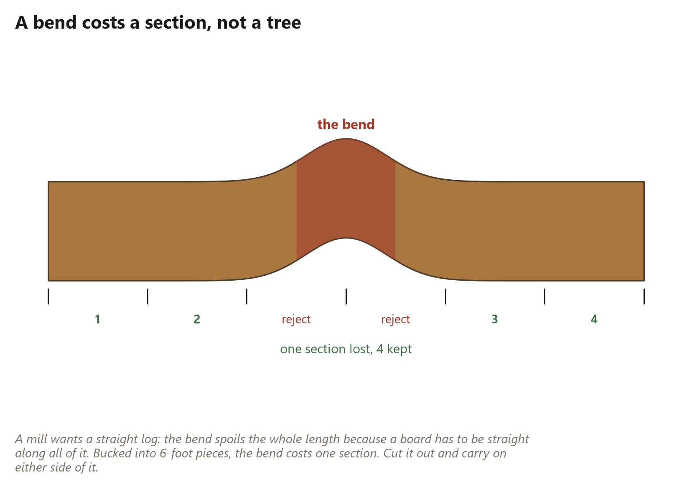

## Grade your own stock

The procedure, because "sort the pile" is advice until it is a list.

**One: the bend pass.** Walk the pile and mark any member with a
visible bow over its length. A slow bow — under a thumb's width over
six feet — goes in the general pile; the jig will hold it straight.
A hard bow goes to blocking, bracing and stakes, where a curve costs
nothing.

**Two: the knot pass.** Mark the middle third of every member as it
comes off the split, and reject to the blocking pile any member with
a knot cluster in that third. A single small knot mid-span stays; a
knot cluster does not.

**Three: the bearing pass.** Look at the butt end of every member —
the end that will land on a neighbour's side. A knot within a hand's
width of the butt face sends the member to the other orientation:
flip it, so the knotty end becomes the head end and the clean end
becomes the butt. Only if both ends are knotty does the member leave
the frame pile.

**Four: the pith pass.** A member that split along the pith — a crack
running down its point — goes to blocking. It will keep splitting
under load, and a member with a crack in it has stopped being wood you
can trust.

The passes take an afternoon for the whole pile, and they are the
entire quality system. No kiln, no grader, no certificate — four
passes, a crayon, and the same eyes that will build with the wood. The
frame's redundancy does the rest: 40 panels mean a
suspect member is a member you can watch, and a watched member that
moves is a member you can swap, which is the honest engineering behind
"grade your own stock".

## Trees nobody else wants

The economic consequence of tolerating variation: the pool of building
material widens, and the price of the widened pool is nothing.

Storm debris. Clearing waste. The windfall of Chapter
1. Low-value sawlogs no mill will
pay haulage on. A tree too bent or too short for a mill is
8 good sticks a section here, and it is often already
lying on the site. Which removes the haul, the mill fee and the
markup, and replaces them with fuel and bar oil — the ledger Chapter
45 closes to the dollar.

The point is not that crooked trees are as good as straight ones. The
point is that this method's unit is small enough that *a usable
straight run* is the requirement, not *a straight tree*, and the
world is full of usable straight runs inside trees nobody wants. A
builder who can use them builds from the one timber supply whose
price never rises: the wood that is already on the ground where the
building goes.

## And the journey it does not take

Close the chapter where Chapter 2 opened, because the
two arguments are the same one seen from different ends.

The industrial route moves wood through 14
operations and a chain of hands: forest, logger, mill, kiln,
distributor, retailer, site. This method's route is
8: tree, cutting station, drying stack, jig. Every
removed stage is fuel, time and a margin — and every removed stage is
also a *filter*, because each middleman selects for the wood worth
hauling and grading and selling. The crooked tree never survives the
first filter. The bend costs it its ride.

The method's answer is to build where the wood is, from what the
filters rejected, in units small enough that the rejection never
happens. The chain argument was about money. This one is about
material — the same 8 steps, counted as distance
instead of cost, and the same conclusion: the best wood is the wood
that never had to travel, and the method is the only route that can
use it.

---

# 20. Which Way Round Are You Working?

*Choose your method before you touch anything*


## Which Way Round

There are two ways to size a wedge dome, and the first thing you have to do
is work out which one you are actually in. Not which one you would like to be
in. Which one you are in.

If you get this wrong you will spend a week doing arithmetic that describes a
building you cannot build, and you will not find out until the day you go to
cut, when the longest stick the frame wants turns out to be eight inches
longer than the longest stick you own.

Everything in the next five chapters follows from this one decision, so it
gets its own short chapter and no other content.

## Design first, or tree first

**Design first** is the way everybody expects to work. You know what you
want: a room of a certain size, a ceiling you can stand under, a footprint
that fits between the trees you are not cutting down. You start from the dome
and you work backwards to the woodpile. The output is a shopping list — this
many sticks, this long, and therefore this much trunk.

**Tree first** is the way this book was actually written. You have trees.
They are the trees you have: a certain height, a certain taper, a certain
amount of straight length between the butt flare and the first serious bend.
You start from what a section of that trunk can be cut into and you work
forwards to the dome. The output is not a shopping list. It is a diameter,
and you find it out rather than choosing it.

Both are honest. Neither is better. They answer different questions and they
run in opposite directions, and the entire content of Chapters 21 and 22 is
those two directions worked through in full.

## The honest test

Here is the test, and it is uncomfortable.

**Are the trees already down, or already chosen?**

If they are — if you are standing next to a windfall, or you have marked two
pines at the back of the property, or somebody has offered you a load — then
you are in Method B, and picking a diameter is not a decision you get to
make. It is a wish. You may still write a number on a piece of paper. The
trees will not read it.

If the trees are genuinely not chosen — you will buy or fell whatever the
design calls for, and there is enough standing timber that a foot either way
on the bucking length costs you nothing — then you are in Method A, and you
should design the dome you want.

Almost everybody thinks they are in Method A. Most people are in Method B.
The tell is whether you would actually go and get a different tree if the
arithmetic asked for one. If the answer is "well, I'd probably make it work
with these," you are in Method B and you may as well admit it on page one
rather than on cutting day.

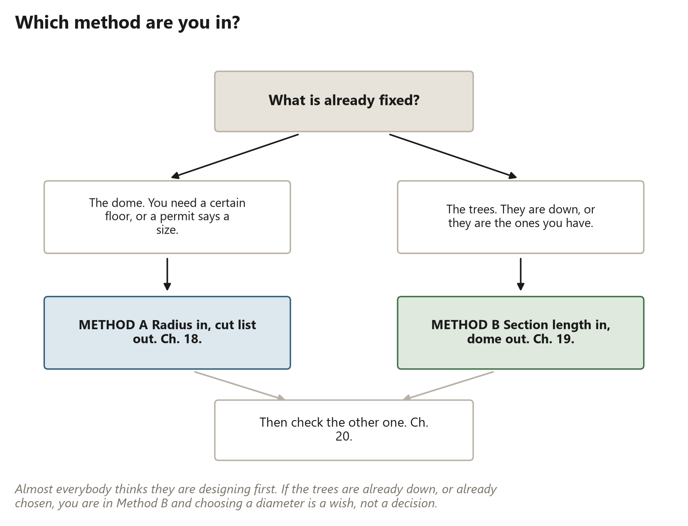

## What both methods share

Underneath the two directions there is one relationship, and it is worth
understanding before you use either method, because it is the thing that
makes both of them exact rather than approximate.

In a 2V dome of radius *R*, every panel is a triangle whose corners sit on the
sphere. If the members simply ran corner to corner you could scale them
straight off the radius: double the dome, double the stick. But they do not
run corner to corner. They pinwheel — each member's end lands on the *side*
of the next one rather than on a shared point — and the amount each member is
set back from the true corner depends on **how wide the member is**, not on
how big the dome is.

A wider stick sits back further. And the width of your stick comes from the
diameter of your log, which has nothing whatsoever to do with the dome.

So member length is not proportional to radius. It is radius *minus* a
correction that stays the same size while the dome grows. Which means:

* Going from radius to member length is a calculation.
* Going from member length back to radius is that same calculation, solved
  backwards.

Neither direction is a rule of thumb, a table, or a fudge factor. They are
one function and its inverse, and Chapter 23 exists solely to run them
against each other and print the difference, which is
0.0e+00 inches.

## Before you go on

Whichever method you are in, you need three measurements before either
chapter is any use to you:

1. **The diameter of your log at the middle of a section.** Not at the butt —
   the butt is the fattest part and it flatters you. The middle, because that
   is what the average stick will be.
2. **The straight length you can get out of the trunk.** Between the flare
   and the first bend that would spoil a section.
3. **The longest piece you are willing to carry on your own.** This is a real
   constraint and it does more to set the dome's size than anything you will
   read in a book. A six-foot green pine wedge is heavy. An eight-foot one is
   a two-person lift, and if there is only one of you, that is the end of the
   discussion.

Write those three numbers down. Then turn to Chapter 21 if you are designing
first, or Chapter 22 if the trees are already on the ground.

And then, whichever one you used, read Chapter 23 and check it with the other
one. That takes ten minutes and it is the cheapest insurance in the book.

---

# 21. Method A: From the Dome You Want

*Radius in, cut list out*


## Method A

You know what you want. Now find out what it costs in trunk.

This is the method to use when the timber is genuinely not decided — when you
will fell, buy or scrounge whatever the design asks for. It runs from the
building to the woodpile, which is the direction every other construction
book works in, and it is the more comfortable of the two.

It is also the one that will tell you, politely and in advance, when the dome
you have in mind needs more trees than you have.

## The procedure

### 1. Start from floor, not radius

Nobody wants a radius. They want a room.

Decide the floor area you want to stand on and convert:

> radius (feet) = √(floor ÷ π)

300 square feet gives a radius of
9.77 feet — call it 117 inches. A 2V
hemisphere's standing height at the centre *is* its radius, so
that same number is also your ceiling.

This is the first place a dome surprises people. A
300-square-foot dome is 9.77 feet tall in
the middle, which is more house than the floor area
suggests, and the volume is doing something a rectangle of the same footprint
cannot.

It is also the first place a dome disappoints people, because not all of that
floor has headroom over it. Chapter 43 has the map.

### 2. Measure the stock you expect to have

Even in Method A you cannot skip this. The pinwheel setback depends on how
wide your members are, and you cannot compute a member length without it.

If you have not felled anything yet, use the diameter you expect to be
cutting. A 12-inch butt tapering to
8 gives sectors about 3.83 inches wide
at mid-trunk, and that is the figure this book's tables assume.

If your logs will be fatter, your members will be wider, your setback will be
larger, and every length in your cut list will come out shorter than the
tables here. The tables are computed at this book's stock; recompute for
yours.

### 3. Solve the member lengths

For a chosen radius, the layout gives you 4 member
classes. This is the calculation Chapter 20 described, run in the forward
direction: radius in, lengths out.

At 300 square feet the longest member comes out at
64.5 inches and the shortest at
56.1.

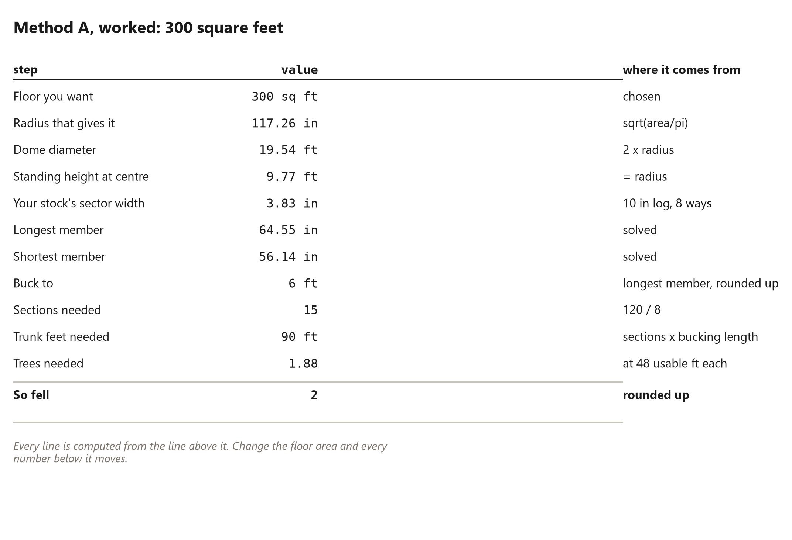

### 4. Round the bucking length up

Your longest member is 64.5 inches. Buck to
6 feet — 72 inches.

You cannot buck to 64.5 inches. Well, you can, but you
should not: a section
cut to exactly the longest member leaves no allowance for the head-end
overfit (Chapter 35), no allowance for the butt cut (Chapter 34), and nothing
at all for the end of a log being split or shaken.

**Round up to the next whole foot and take the waste.** It is the cheapest
line item in the build.

This does mean the design-first path throws away more wood than the tree-first
path, because the tree-first path chooses a dome that uses the whole section.
That is a real cost of getting to pick your diameter, and it is worth saying
out loud rather than discovering in the offcut pile.

### 5. Count sections, then trunk, then trees

The frame needs 120 members. Each section gives
8, so:

> sections = 120 ÷ 8 = 15

> trunk needed = 15 × 6 ft = 90 feet

> trees = 90 ÷ 48 = 1.88

So: **fell 2.**

Notice the number. Designing a 300-square-foot dome from
scratch and sizing the trees to it lands on the same
2 trees that this book's actual build used, from the
opposite direction. That is not a coincidence — it is the size
of dome a pair of ordinary pines makes, and it is why this method produces
houses of roughly this size over and over.

### 6. Check it against the tree you can actually get

Then go and look at the trees.

If the tallest straight trunk you can find is thirty feet rather than
48, your 1.88 trees becomes three. If
your logs are much
thinner at the butt than 12 inches, your members
are narrower, your sticks are longer for the same dome — and thinner, which
Chapter 10 has opinions about.

This is where Method A hands over to Method B, and where Chapter 23's round
trip earns its place.

## Where this method surprises people

**Member length does not scale with the dome.** Double the radius and the
members do not double. They grow by slightly less, because the pinwheel
setback stays the same size while the triangle grows around it.

This is good news at large sizes and bad news at small ones. A very small
dome has members so short relative to their own width that the setback eats a
serious fraction of them, and below a certain size the geometry stops making
sense at all — a stick that is nearly as wide as it is long is not a strut,
it is a block. Chapter 47 says where that line is.

**Height is not a free variable.** In a plain hemisphere, height equals
radius. If you want a wide floor and a ceiling taller than
half that width, you cannot have both from a hemisphere; you need a riser wall
under it (Chapter 41) or a different fraction of a sphere, which is a different book.

**The trees number is rarely a whole one.** You will get
1.88, or 2.4, or 3.1. Round up and accept the leftover, or
shorten the bucking length and see
whether the arithmetic lands better. There is no third option that gets you a
partial tree.

## The lookup table

If you would rather not do any of this, the table below is the whole method
precomputed at this book's stock section. Find your floor area on the left and
read across.

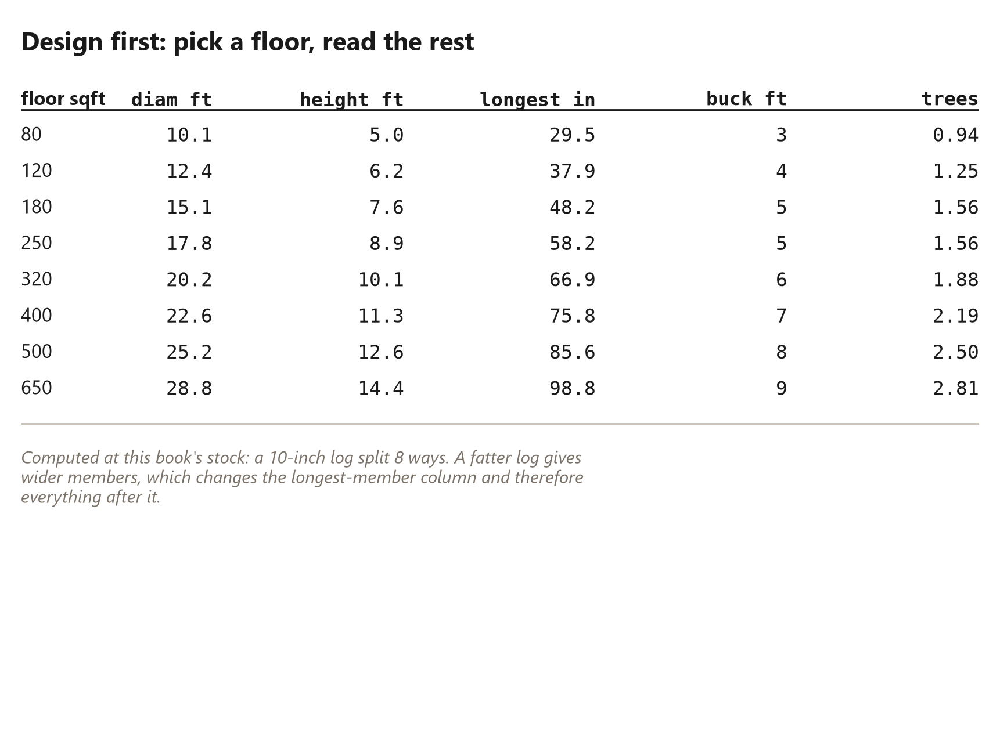

Two warnings about using it:

1. It assumes members 3.83 inches wide. Different logs,
   different table.
2. The `trees` column assumes 48 feet of usable trunk
   per tree. If your trees are shorter — and most are — scale it.

## Then check it the other way

You now have a cut list. Before you cut anything, take the longest member off
that list, hand it to Method B, and see what dome comes back.

It should be the dome you started with. If it is not, you have made an
arithmetic slip or changed an assumption halfway through — a different gasket
thickness, a different split count, a different stock width.

That check is Chapter 23, it takes ten minutes, and it is the reason this
book has two methods rather than one method and a warning.

---

# 22. Method B: From the Tree You Have

*Section length in, dome out*


## Method B

This is the method the book is named after, and it is the one that produced
the dome in the photographs. It starts from a tree lying on the ground and
ends with a number you did not choose.

That last part is the whole character of the method. In Method A you decide
how big the building is and the woodpile has to comply. Here the woodpile
decides, and your job is to find out what it decided.

## The procedure

### 1. Measure the trunk

Three numbers: diameter at the butt of the usable length, diameter at the
top of it, and the straight length between them.

"Usable" means the part with no bend serious enough to spoil a section and no
branch stub big enough to spoil a stick. It is almost always shorter than the
tree. On this book's tree it was 48 feet, out of a
considerably taller pine — the butt flare went in the fire and the top went
for kindling.

The tree this book is written around measures 12
inches at the butt of that length and 8 at the top.


### 2. Pick a bucking length you can carry

This is the decision, and it is a physical one rather than a mathematical
one. Go and pick up a green section of the length you are considering. If you
cannot get it onto a sawhorse on your own, it is too long, and no amount of
wanting a bigger dome will change that on day six.

This book buckes to 6 feet.

Everything downstream comes from this number. Choose it honestly.

### 3. Count your sections

Divide the usable length by the bucking length and throw away the remainder.
48 feet at 6 feet a section is
8 sections, with 0.0 feet left over.

If the remainder is large it is worth going back to step 2 and trying a
different bucking length. A foot of offcut is firewood; four feet is a stick
you did not get.

### 4. Multiply by eight

Each section splits into 8 sectors of
45 degrees each, and — this is the part that surprises
people who have milled lumber — **each sector is a finished structural
member**. Not a blank to be trimmed. Not stock to be dimensioned. A member.

8 sections × 8 sectors =
**64 struts from one tree.**

Two trees: **192 struts.**

The frame needs **120**.

That is the title of the book, and it is not a slogan. It is
72 spare — about seven per cent — which is roughly the
right margin for a stick that splits along the pith, a butt cut that goes
wrong, and the one panel everybody builds backwards.

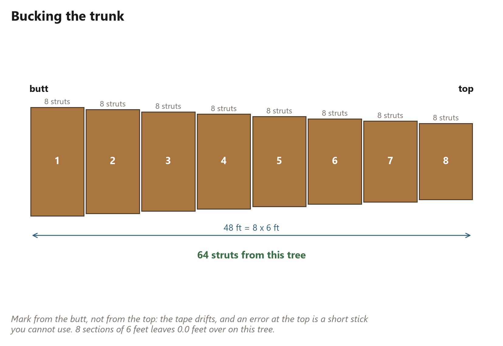

### 5. Find your member's width

The dome does not care how long your sticks are until it knows how *wide*
they are, because the pinwheel setback depends on width.

The width of a sector is the chord across its bark face, measured at the
diameter you are cutting. Use the diameter at the **middle** of the trunk,
not the butt: half your sections come from thinner wood than the butt
suggests, and sizing the layout off the fat end gives you a dome that does
not quite close at the top.

At this tree's mid diameter the sector is 3.83 inches wide and
5.00 inches deep, pith to bark — a cross-section of
9.82 square inches.

For scale: that is 1.23 nominal two-by-fours' worth of
wood, or 1.87 of the dressed boards you would actually
find on a rack. Chapter 45 is about which of those numbers to believe.

### 6. Solve for the dome

Now the arithmetic. The longest member the frame may contain is the longest
stick you have, which is your bucking length: 6 feet.

Find the radius whose longest pinwheel member is exactly that.

This is not a division. As Chapter 20 explained, member length is radius less
a setback that does not scale, so the relationship has to be solved rather
than scaled. The software in this project does it by bisection, and you can
do it by trying radii until the longest member comes out right — it converges
in about six guesses.

The answer for this tree:

| | |
|---|---|
| Radius | 129.33 in |
| Diameter | **21.6 ft** |
| Height at the centre | 10.8 ft |
| Floor | **365 sq ft** |

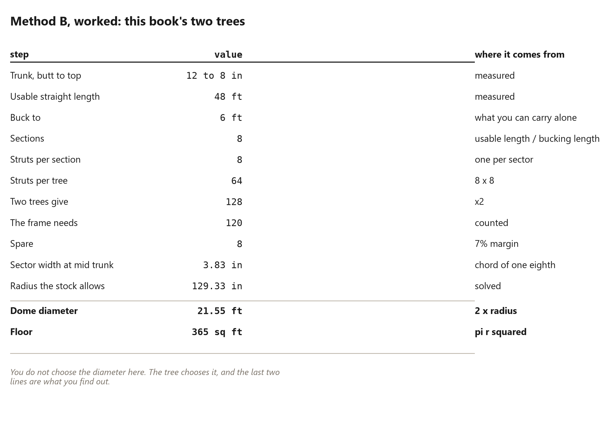

### 7. Read your cut list

The frame's 120 members come in 4
lengths, running from 62.73 inches to
72.00 inches. Thirty of each.

Note that the longest is exactly your stock length, to the last decimal
place. That is not a coincidence and it is not luck — it is what step 6
solved for. It also means you have no margin on the long members at all,
which is why they are cut with the head end deliberately left over-long and
sawn off in place. Chapter 35 is about that.


## You do not get to choose the diameter

This is the part people resist.

You measured a tree, you picked a length you could lift, and out came
21.6 feet. Nobody consulted you. If you wanted twenty-four
feet you cannot have twenty-four feet — not from these trees, bucked this
way, without doing something else that costs you elsewhere.

You have three ways out and they are all in Chapter 25:

* **Buck longer.** A longer section gives a bigger dome, out of fewer and
  heavier pieces, and at some point even 3 trees stop being
  enough. The table in
  Chapter 22's appendix shows exactly where that line is.
* **Get a third tree.** Fine, if you have one. It is the honest answer and it
  is not a failure.
* **Accept the dome the trees gave you.** Which is what happened here.

What you must not do is design for the dome you wanted and cut for the tree
you have. The frame will not close, and it will not tell you until the last
ring.

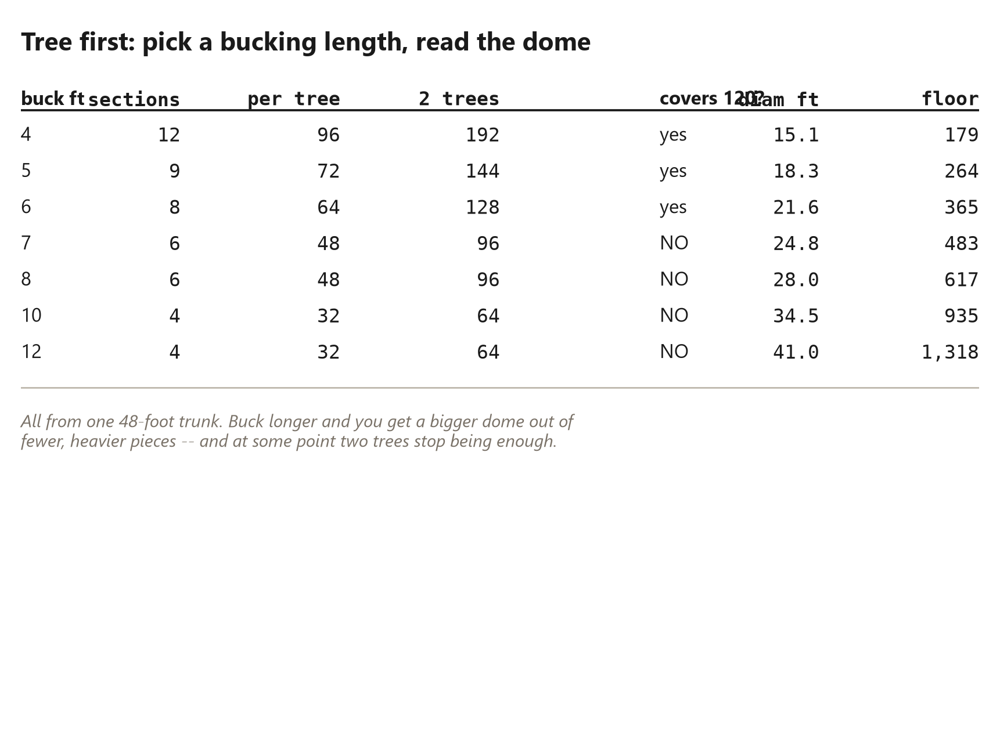

## A note on the third tree

3 trees is 192 struts for a
120-member frame, so the frame actually consumes
1.88 trees. The third tree — and most of the
second — is not fully used, and
the leftover is not waste — it is the spares, the blocking, the floor's
stock and the firewood, plus the next dome's first cut list.

But it does mean the honest headline is not "one dome from three trees." It is
"one dome from a bit under two trees, and you need the third one because you
cannot get eight-tenths of a tree."

Which is a worse title.

---

# 23. The Round Trip

*Proving the two methods are one calculation*


## The Round Trip

Two chapters ago there were two methods. This chapter is here to show that
there is really only one, held at opposite ends, and to give you a ten-minute
check that catches almost every arithmetic mistake you can make with either.

The reason this matters is not elegance. It is trust.

A book can tell you that a 6-foot stick gives a
21.6-foot dome and you have no way to know whether that came
out of a solver or out of somebody's memory of a similar dome. Rules of thumb
in building books are usually the latter, and they are usually close enough
to be dangerous. So rather than ask you to take it on faith, here is the
check, and here is the actual number it produces.

## Run it forwards, then backwards

Take any radius. Compute the longest member the frame would contain. Now
throw the radius away, and using *only* that member length, compute the
radius that a dome would need in order for that to be its longest member.

If the two methods are one calculation, you land exactly where you started.

* Start: a radius, any radius.
* Forwards (Method A): radius → longest member.
* Backwards (Method B): longest member → radius.
* Compare.

## The residual

Here is the check run on six domes, from small to large:

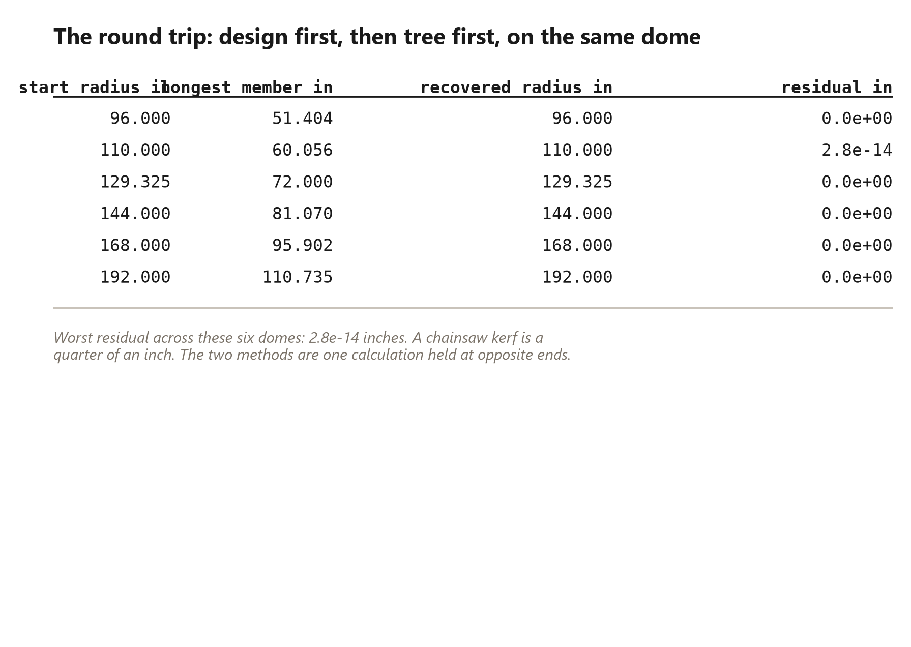

The worst disagreement across all six is **0.0e+00
inches**.

For scale: the kerf of the chain on the saw this book was built with is
0.25 of an inch. The disagreement between the two methods is
smaller than the width of the cut by a factor with a lot of zeroes in it. It
is smaller than the seasonal movement of the wood. It is smaller than
anything you could measure with a tape, a story pole, or a laser.

It is, in other words, zero for every purpose a person with a chainsaw has.

That number is not asserted here. It is computed when this book is exported,
by running the check, and if it ever stops being negligible this sentence
will print a large number and the chapter will be wrong in an obvious way
rather than a quiet one.

## What would break it

The round trip closes because both directions are solving the same
relationship with the same assumptions. Change an assumption between the two
and it will not close — and this is exactly what makes it a useful check,
because those are the mistakes people actually make.

**Change the gasket thickness.** The seam key sits between panels and every
member length accounts for it. Design at 0.75 inches, then
compute your bucking with a half-inch key in mind, and the two answers
diverge. The gap will be small and it will be in the wrong direction — your
sticks will be very slightly too long, forty times over, and the dome will
fight you at the top.

**Change the split count.** Eight sectors gives a member
3.83 inches wide. Six gives a wider one, twelve a narrower
one, and the pinwheel setback moves with it. If you designed for eighths and
then split a few logs into sixths because they were fat, those members are
not interchangeable with the rest, and the round trip on the fat ones will
not close against the layout.

**Change the stock diameter.** Same problem, from the other side. Sizing the
layout off the butt diameter and cutting most of your sections from thinner
wood up the trunk means the members you actually get are narrower than the
ones you designed. Use the mid-trunk diameter, as Chapter 22 step 5 insists.

**Mix up feet and inches.** Says itself. It happens. The round trip catches
it immediately, because the recovered radius comes back off by a factor of
twelve rather than by a thousandth of an inch.

## How to actually do the check

You do not need software.

1. Finish whichever method you used. Write down your radius and your longest
   member.
2. Take the *other* method's procedure from Chapter 21 or 22.
3. Feed it the number you got out, and see if you get back the number you
   put in.

If you are within a quarter of an inch on the radius, you have not made a
mistake worth worrying about. If you are out by more than an inch, stop —
something in the middle changed and you should find out what before you cut a
hundred and twenty of anything.

## Why this chapter exists at all

Because the mistake this is designed to catch is not a mistake in the
arithmetic. It is a mistake in the *assumptions*, and those are invisible.

Arithmetic errors announce themselves: a number is obviously wrong, or the
units are absurd, or the answer is negative. Assumption drift does not.
Everything looks reasonable at every step. You get a cut list of plausible
lengths and you cut a hundred and twenty plausible sticks, and the first
thing that tells you is the frame, on day fourteen, when the last ring is a
half inch short all the way round and there is nothing to be done about it.

Ten minutes with the other method, before anything is cut, is the cheapest
insurance in this book.

---

# 24. The Worked Build

*Every number for this book's dome, in one place*

## The Worked Build

This chapter is the whole build on five pages: the tree, the dome it
makes, the cut list, the seam schedule, and the frame they describe. A
builder who wants to work from nothing else can work from this chapter
alone — every number in it comes from the same solved model the rest
of the book quotes, and the chapter exists so that the numbers have one
place to live where they cannot contradict each other.

The two sizing methods of Chapters 21 and 22
converge here. Method A says: pick the floor, and the arithmetic hands
back the tree. Method B says: measure the tree, and the arithmetic
hands back the dome. The worked build is Method B run to the end on the
tree of Chapter 1 — the windfall,
measured, bucked, split, and solved into the frame whose numbers follow.

Nothing on these pages was chosen for the pages. It was computed, and
the computation is the same one the films and the simulator run, so
the book, the film and the model cannot disagree about the dome.

## The tree

The input, measured before any cutting: 12
inches at the butt, 8 at the top,
48 feet of usable trunk, bucked into
8 sections of 6 feet, each
section split into 8 wedges. One tree yields
64 struts; 3 trees yield
192, against a frame that needs
120. The recovery arithmetic — 318 board
feet in, 278 out, 87.4 per cent kept —
is Chapter 13 in full; here it is only the row that
feeds the rest of the chapter.

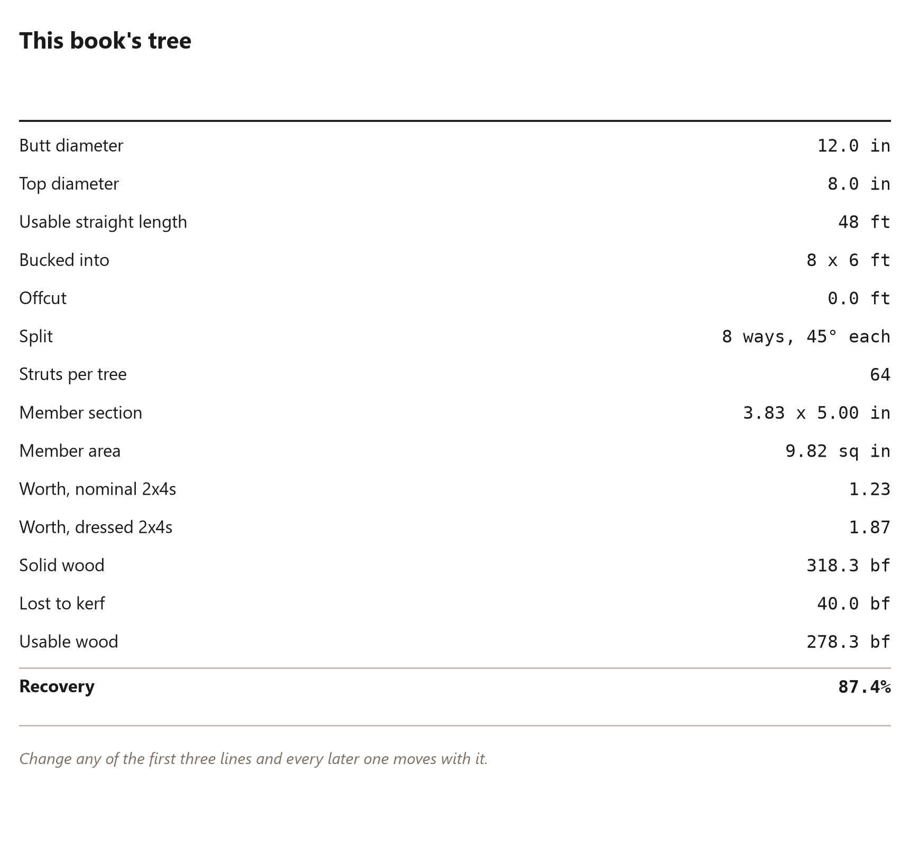

## The dome

The output: the solved hemisphere that 3 trees of this
taper will fill. 21.6 feet across, 10.8
feet to the crown, 365 square feet of floor. The
longest member is 72.00 inches; the shortest
62.73; the whole frame stands on
673 feet of timber. The strict count says the frame
actually consumes 1.88 trees, and the book
says the rest of the pile is spares, blocking, floor stock and
firewood rather than
pretending the arithmetic is tidier than it is.

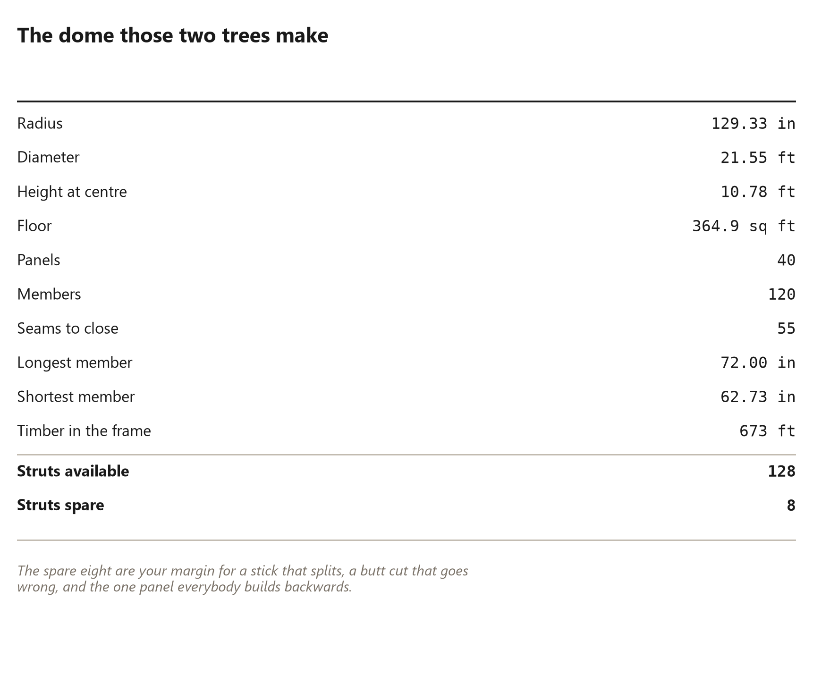

## The cut list

All 120 members, by class, length and count, straight
from the pinwheel layout. 4 distinct lengths
cover the whole frame — the two edge classes of Chapter
9, split into four by the pinwheel's inset
of Chapter 15. The table is the jig's job description:
every stick that crosses the bench is one of these rows, and nothing
else.

Beside it sits the shorter list the build actually came out with — **the
master cut list**, 3 resultant lengths:
**72.0 inches**, **63.5** and
**61.5**. Resultant means *finished*: cut a member to
one of these and the panel it goes into is the size the dome wants, with
nothing left over to trim. Every equilateral panel takes three of the long
member. Every isosceles panel takes the long member as its base, the middle
length on the left and the short one on the right.

That orientation is a bench rule rather than a preference, and the shape
shows why. Lay an isosceles panel with its base nearest you and the
63.5-inch left member is the longer of the two sides: it
reaches over to the top point, which sits off the middle of the base
because the two sides are not equal. The 61.5-inch right
side runs up to meet it, and it is that shortest member the base butts up
to — the base's end lands on the side of the short one, which is the
pinwheel's chase closing the triangle. Build a panel with the two sides
swapped and it does not close: two inches over five feet is not something
the eye catches, so the sides are picked from their two marked stacks, in
order, every time.

The two lists differ, and the book prints both rather than picking one.
The table above is the pinwheel model's seated schedule, which represents
the inset as a fourth length; the master list is what the saw cut and what
the panels measured when they closed. The model is a model of the joint;
the master list is a report of the build, and where the two disagree, the
tape on the finished panel is the authority.

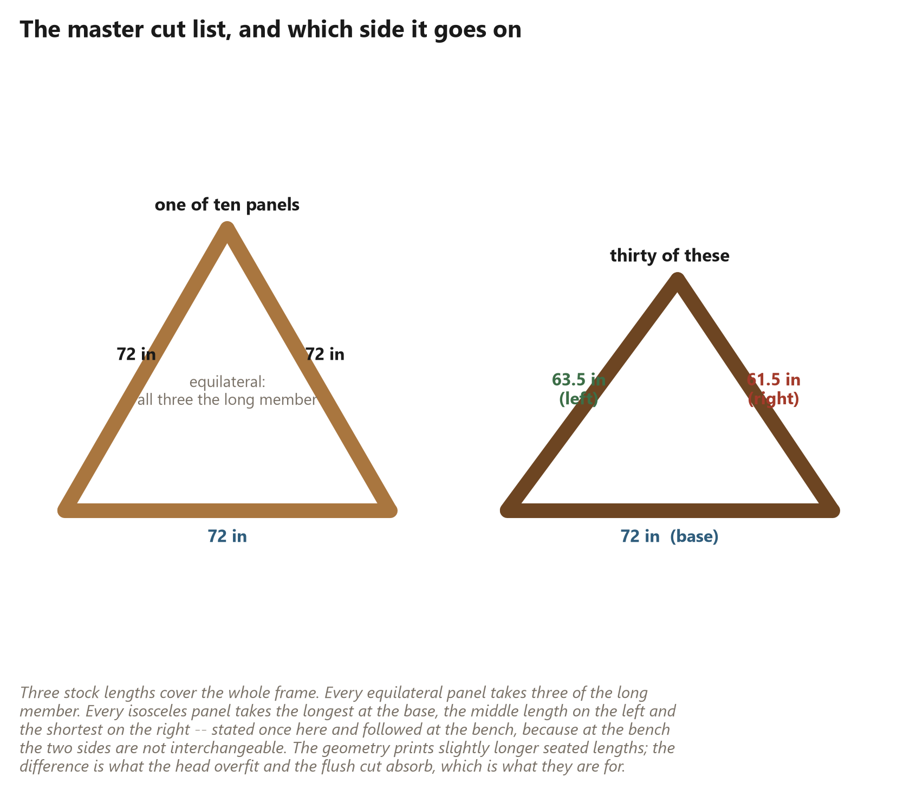

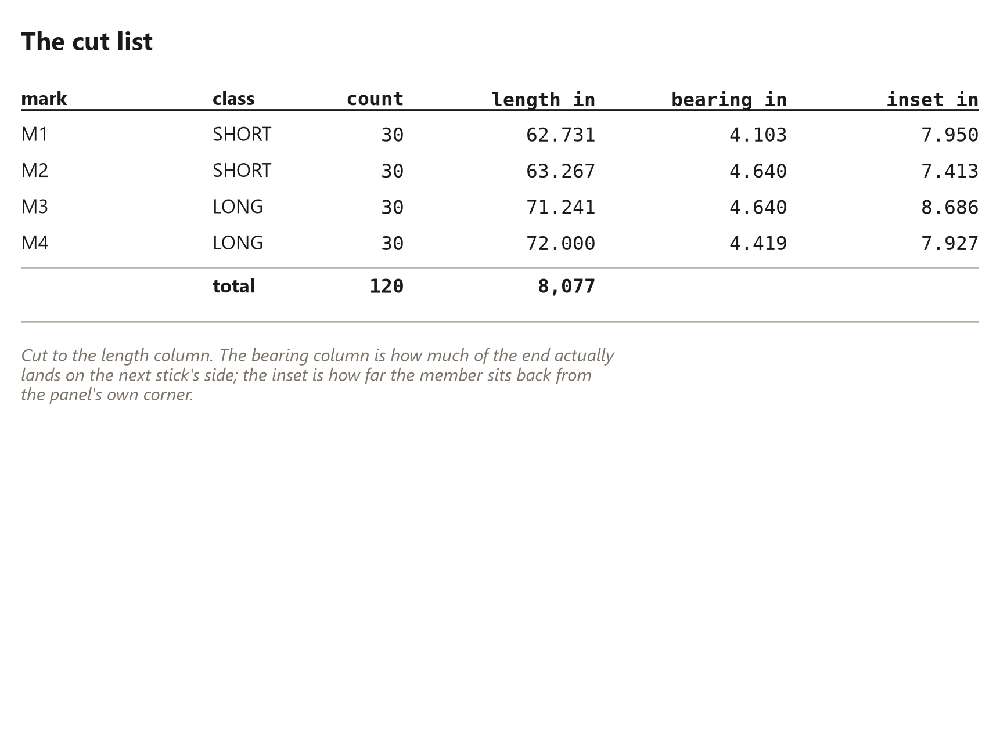

## The seam schedule

Every seam, its fold angle and its key: 25 at
18.03 degrees, 30 at 22.46,
55 in all, the two profiles of Chapter 16.
The schedule is generated from the solved dome, so the build's check
is simple: keys placed equals 55, profiles used equals
2, and the dome closes without being forced.

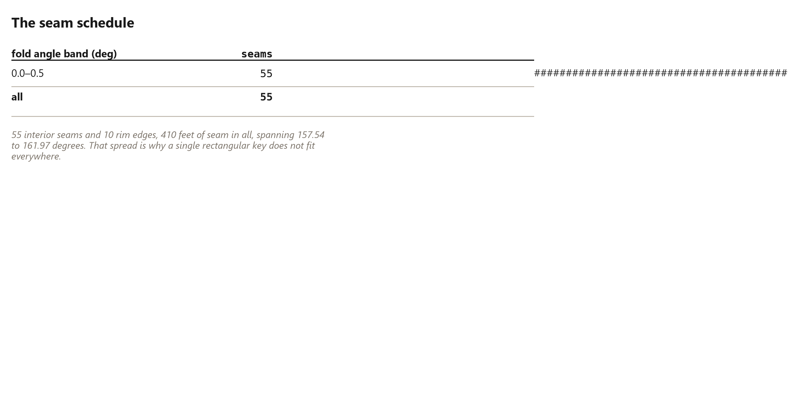

## The dome this describes

The frame itself — the simulator's own solved meshes, in the book's
print palette, exactly the dome the four tables specify. If the
chapter above is the arithmetic, this page is what the arithmetic is
*of*: 40 panels, 120 members,
55 seams, 21.6 feet across, standing.

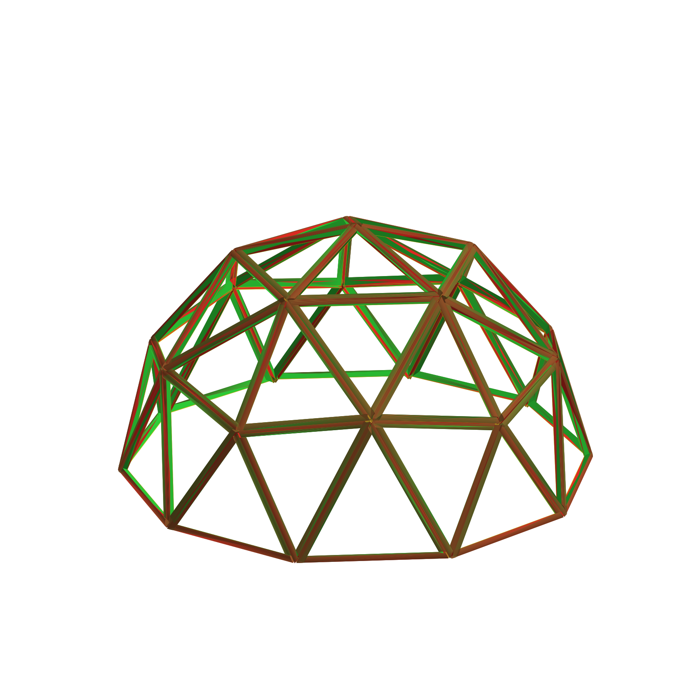

---

# 25. When the Numbers Say No

*Reading a result that means do not build this*

## When the Numbers Say No

The two sizing methods of the previous chapters end in numbers, and
sometimes the numbers say no. This chapter is the permission to listen
to them, and the procedure for what to do after.

A book about a build method is at its most useful when it tells you
when *not* to build — before the tree is down, before the pile is
split, before the jig is built. The failures this method can produce
are not dramatic; they are quiet, and they arrive as arithmetic. Two
trees that give one hundred and twelve struts when the frame needs one
hundred and twenty. A member too heavy for the person who has to lift
it. A stick too slender to trust. Each one is a sentence the numbers
say, and each one has a standard answer — sometimes a smaller dome,
sometimes a fourth tree, sometimes a different bucking length, and
sometimes, honestly, not this build at all.

The chapter is short and it is howto, because the decision it teaches
is the one that saves the most: reading a bad result as information
instead of as a setback, while the fix is still cheap.

## Not enough struts

The classic case, and the one the title of this book invites.
3
trees, bucked and split, give 64 struts each —
192 in all, against a frame that needs
120. The arithmetic works out with 72
to spare. But run the same method on trees that are shorter, thinner
or bucked longer than this book's, and the count shrinks: 3 trees
can come out short of the frame's count, and then the method
says no.

Read the shortfall as a measurement of how far off the trees are, not
as a verdict on the plan. The frame's count — 120 — is
fixed by the geometry; it does not negotiate. The trees' count is the
variable, and it is a product of three choices: the usable length you
bucked, the section length you chose, and the number of trees you
felled. Any one of the three can be changed, and the section below —
"Three ways out" — runs the arithmetic for each. The one answer the
chapter forbids is the silent one: one hundred and twelve struts do not
become one hundred and twenty by cutting more carefully. The count is
not a quality issue; it is a quantity issue, and only a quantity fixes
it.

The spare margin deserves one honest note, because it is easy to read
wrong. This book's 72 spare struts are not
generosity; they are the rejection allowance for the grading passes of
Chapter 19 — the bent, the knotty, the pith-split that
leave the pile. A build planned with zero spares is a build that
assumes every stick passes, and no pile does. So the real threshold is
not "one hundred and twenty struts"; it is "one hundred and twenty,
plus the rejection rate your own pile actually showed you". If two
trees give you exactly one hundred and twenty, the numbers are not
saying yes. They are saying *tight*, and tight is a no with a schedule.

## Too big to lift alone

The second way the numbers say no has nothing to do with counts. A
6-foot green wedge is heavy — the book's own
members run 9.82 square inches of wet pine — and the
whole method is built around one person carrying, setting and
fastening every piece alone. A dome sized by the tree can produce
members past the point one person handles, and then the numbers say no
in your back instead of in the ledger.

The honest test is not the table, it is the afternoon: pick up the
heaviest member the design produces, green and wet, and carry it the
distance the build will ask. If it can be carried, set and held with
one hand while the other drives a screw, the design passes. If it
cannot, the fix is not a stronger builder — it is a shorter bucking
length, which makes every member lighter, or a second pair of hands,
which Chapter 49 treats as its own
design change. The arithmetic follows the carry: shorter sections
mean more sections, more splits, and the same frame from lighter
pieces — and the tree count re-solves with the new section length,
which is the "shorter bucking" row of the section below.

The limit that matters here is the one Part Two formalises. Chapter
51 names the declared longest member one person will
handle — 6 feet — and shows what diameter it
reaches, because the flat-rate argument this book makes is bounded by
exactly this physical ceiling. The sizing methods do not know about
your back. You do, and the numbers wait for you to tell them.

## Stock too small in section

The third no, and the one that hides inside the first two: the trees
are long enough and the count works out, but the sticks are slender —
a small butt diameter, split eight ways, yields a sector too thin to
trust.

The check is against the comparison Chapter 7 runs:
a wedge from a very small log can fall below the dressed board it is
supposed to replace, and then the method's central claim quietly
inverts. The crossover is real and it is diameter-dependent — below
some butt size, the wedge is the wrong answer and the honest move is
to buy the boards. The chapter on sections prints the comparison; here
the procedure is the thing: compute your own tree's sector area before
committing, compare it against the dressed two-by-four's
5.25 square inches, and if your tree loses the
comparison, the numbers are saying no to *this tree*, not to the
method.

The options are the same three, with a twist. Shorter bucking does
not fatten a stick; it only shortens one. An extra tree adds count, not
section. The real fixes for a slender section are a thicker tree, a
coarser split — six sectors instead of eight, the row Chapter
12 priced — or a different member entirely, which is what
Chapter 72 is for: the hollow, laminated and
manufactured wedges exist precisely because some trees say no.

## Three ways out

The three standard exits, with the arithmetic each one runs, so a
"no" from the numbers always lands on a next step.

**Shorter bucking.** Cut the sections shorter and every member gets
lighter and shorter; the dome the tree sizes shrinks accordingly, and
the strut count per tree rises. Run Method B again with the new
section length — Chapter 22 is a procedure, and a
procedure re-runs. The cost is a smaller floor and more sections to
split; the gain is a build one person can carry.

**A fourth tree.** Add a tree and the count problem disappears — four
trees of this book's size give far more than 120 — while
the member weight and section stay exactly as designed. The cost is
one more fell and one more buck, and Chapter 45 shows what
an extra tree
actually adds in fuel and hours: not nothing, and rarely the thing
that kills the build.

**A smaller dome.** Solve Method A downward — Chapter 21
runs in either direction — until the tree you have is the tree the
dome needs. The floor shrinks with the radius, and the shrink is
where the honesty of this chapter lives: a dome you can actually
build is better than the dome whose numbers said no.

And the fourth option, stated because a howto chapter owes it: **do
not build this.** Not every tree, not every site, not every back
should become a dome. The method's own arithmetic will say so when it
is true, and the builder who hears it has lost an afternoon of sums
instead of a fortnight of felling. The numbers saying no are the
cheapest form of the no there is.

---

# 26. Day Zero: The Saw

*A hundred and ninety-nine dollars and a sixteen-inch bar*

## Day Zero

Before the fortnight there was a day zero, and day zero was the saw.

The whole method claims to need one machine, and the claim deserves to
be looked at honestly before the felling starts. The saw this build
used was the smallest one on the shelf: a 38.2-cc
consumer saw with a 16-inch bar, 199 dollars,
bought new. Not a professional felling saw, not a mill, not a rental —
the same saw a homeowner buys for firewood. If the method works with
this saw, it works with almost any saw; if it secretly needed more,
better to find out on day zero than on day nine.

This chapter assesses the tool the way the book assesses everything
else: what it can do, what it cannot, what the counterfactual would
have bought, and the setup and safety that decide which of the two
lists you live on. The fortnight's days each open with a sentence of
their own; this one opens the whole clock, because every day after it
is this saw's day, and the saw is the only tool in the book.

## The smallest saw on the shelf

What 38.2 cubic centimetres and a 16-inch
bar can actually do, because the honest list is shorter than the
advertised one and more useful.

**It fells a modest tree.** A 12-inch pine is
well inside what this saw drops, as long as the notch and the hinge
are cut the way Chapter 27 describes and
not the way impatience does. The saw is not the limit at felling; the
technique is.

**It rips a six-foot section along the grain.** This is the real test,
and the saw passes it with a margin — a rip through wet pine is slow
work, the chain must be sharp and the bar must stay cool, but the
0.25-inch kerf through a 6-foot
section is a normal afternoon's work, not a stunt. Chapter
29 is the whole ripping ledger, and
its honest finding is that the saw is adequate and the arm is the
bottleneck.

**It cannot be hurried.** A small saw has a small engine, a small oil
pump and a small appetite for abuse. Buried to the dogs in green
pine, it will pull its chain off the bar, overheat, and dull twice as
fast as a professional saw doing the same cut. The method works
*with* this saw by working at its pace — 5.0
struts an hour, sustained, is that pace, and the pace is the method.

What it cannot do at all: mill a board, rip a full-length log in one
pass, or survive being used like a bigger saw. None of those is
needed. The saw's job in this method is exactly three cuts — fell,
buck, split — and every one of them is within this machine's honest
envelope. The method was not adapted to a small saw; it was designed
so a small saw could do it, which is a different and stronger claim.

## What I would have bought instead

The honest counterfactual, because a build book that never admits its
tool was marginal is not being read by somebody who owns the same saw.

A bigger saw — a professional 60-cc class with a longer bar — would
have made the ripping faster, the felling safer-feeling, and the
afternoons shorter. It would have cost several times the
199 dollars, and it would not have changed the method
by one step. The split count, the bucking length, the jig, the
pinwheel — none of them are set by the saw's size. They are set by
the tree and the back, and a bigger saw changes neither.

What a bigger saw would have changed is the *margins*: fewer
sharpening stops, a cooler chain, a faster recovery when a cut went
wide. Those are real, and the book says so rather than romanticising
the small saw. But the method's claim was never "this saw is the best
tool". It was "this saw is *enough*", and enough is a fact you can
verify at the store, in the wood, on day zero — which is the day this
chapter is.

If you own a bigger saw, use it. If you own this one, the method
works with it. If you own neither, the cheapest saw that will hold a
16-inch bar is the one this book's numbers were produced
with.

## Setting it up

The setup, in order, because a chainsaw set up wrong is a saw that
punishes the setup, not the wood.

**The chain.** New or sharpened, tensioned so it snaps back against
the bar but still pulls around by hand. A loose chain comes off; a
tight chain burns the bar. Check it cold, then again after the first
cut, because a warm chain is longer than a cold one.

**The ripping chain.** Ripping with a crosscut chain is possible and
slow. A ripping chain — filed to a shallow angle — cuts with the
grain instead of fighting it, and it is the single cheapest upgrade
the fortnight has. If the budget allows one extra chain, make it a
rip chain, and keep it for the splitting days.

**Bar oil, always full.** Ripping runs the bar buried for minutes at
a time, which is exactly the condition that cooks a dry bar. The oil
cap is the only gauge that matters on day five through eight; check
it every tank of fuel.

**The file.** A round file matched to the chain, used every few
tanks, by hand, to the chain's own angle. Chapter
29 counts what a dull chain costs in
kerf and in arms; here the rule is only: sharp is the state the saw
arrives in, and you are the one who keeps it there.

**Fuel, mixed right.** Two-stroke mix at the ratio on the saw, mixed
fresh, not last season's. The fuel ledger of Chapter
55 is built on a saw that starts
first pull every morning, and starting first pull is a fuel-quality
fact before it is a mechanical one.

## Chaps, helmet, and never alone

The safety page, placed here on purpose: the saw starts on day zero,
so the rules start on day zero.

**Chaps.** Chainsaw-protective trousers, worn for every cut, no
exceptions for a quick trim. They are the difference between a
bruise and an ambulance, and they cost less than the saw.

**Helmet, visor and ear protection.** A falling branch, a kicked
chain, a saw at full throttle for hours — all three are ordinary
events in this fortnight, and all three are aimed at your head.

**Never alone.** The single rule that overrides every other rule in
the book: do not run a chainsaw with nobody in earshot. The felling
chapter says it again, the ripping chapter assumes it, and the story
chapters record the one day it was nearly broken. A phone is not a
second person. A second person is a second person.

The book's warning from the front matter stands unrepeated here but
not unrenewed: felling kills people who have done it a hundred times,
a chainsaw is the most dangerous tool most people ever hold, and
nothing in this book is worth what a silent afternoon with a saw can
cost. Day zero is the day the tool arrives. The respect it deserves
arrives the same day, or not at all.

---

# 27. Days One and Two: Felling

*Putting 3 trees on the ground where you want them*

## Felling

The fortnight's first two days are its most dangerous, and the book
does not soften the sentence: felling is the operation that kills
people who have done it a hundred times, and these two days are
felling.

The job is simple to state — put 3 trees on the ground, where the
bucking and ripping can reach them — and every word after that
sentence is the reason it is not simple to do. The tree decides where
it falls; the feller only influences the decision, through the notch,
the hinge and the back cut. This chapter is the influence, in order:
the safety that comes before the first cut, the two cuts that steer
the tree, the drawing of the hinge that does the steering, the
limbing that follows the fall, and the story half — what actually
happened on this build's second tree, because the story half is where
the chapter earns its place.

Two days for 3 trees is not padding. Each tree is felled, limbed
and made safe before the next is touched, and the second day exists
because the first tree teaches something the next one needs.

## Read this before the notch

The safety page, first, because everything after it assumes it.

**The escape route.** Before the saw starts, walk the route away from
the tree — back and to the side, opposite the planned fall — and
clear it. The route is not "away from the tree"; it is a specific,
walked, cleared line, and it is the thing you use the moment the tree
moves. A tree falls in seconds and the escape takes seconds; the
route being pre-walked is the entire margin.

**The hinge.** The strip of uncut wood between the notch and the back
cut is the hinge, and it is the steering. It keeps the tree attached
while it starts to fall, aims it along the notch, and holds the butt
down so the trunk cannot kick back. Cut through it — the back cut
carried all the way to the notch — and the tree is free to go
anywhere, which is how the word "uncontrolled" enters the report.

**Barber chair.** A leaning tree, cut badly, can split up its own
trunk as it falls — the butt tearing open like a hinged lid, fast,
at head height. It happens when the hinge fails before the tree is
committed. The prevention is the hinge's size and the order of the
cuts, and the respect is: never stand behind a felling tree, not for
one second, not to watch.

**Widow-makers.** Dead branches hung in the crown, freed by the fall
or by vibration, that come down before, with, or after the tree.
Look up before the first cut. Look up again before the back cut. The
crown decides some of what happens next, and it has been deciding
since before you arrived.

**Two people, minimum.** The front matter's rule, restated here where
it binds hardest: never fell alone. The second person is the lookout,
the caller, and the one who goes for help — and their one job during
the fall is to be out of the fall.

## The notch and the back cut

The procedure, in the order that keeps the hinge whole.

**Face the fall.** Stand where the tree should go. The notch opens in
that direction, and the tree will follow the notch unless the hinge
says otherwise — so the first decision is the fall line, made from
the tree's lean, the wind and the landing zone, in that order of
authority.

**Cut the notch.** Two cuts meet to take a wedge out of the trunk on
the fall side: the first cut slants down into the tree, the second
comes in flat from below to meet it, and the wedge falls out. The
notch's depth is about a fifth of the trunk's diameter — deep enough
that the tree has somewhere to rotate into, shallow enough that the
hinge behind it is still the width of the trunk. On this book's
12-inch trees the notch is a hand's span, and
the two cuts must meet cleanly; a notch with a step in it steers a
tree sideways.

**Cut the back.** From the far side, level with the notch's flat
floor, the back cut runs toward the notch and stops short of it. The
wood left between — the hinge — is a strip the thickness of a couple
of fingers, even across the trunk. The tree is now standing on its
hinge, committed but held, and it will fall into the notch as the
hinge lets go.

**Leave.** The moment the tree moves, the saw comes out of the cut
and the feller takes the escape route, eyes on the crown, without
turning a back on the fall. The hinge finishes the job; the feller's
job from here is distance.

The hinge dimension is the whole art. Too thick, and the tree sits
on the saw and falls late or not at all; too thin, and the hinge
breaks early and the tree falls wherever its weight wants. The even,
fist-thin strip is the difference between a fall and an event.

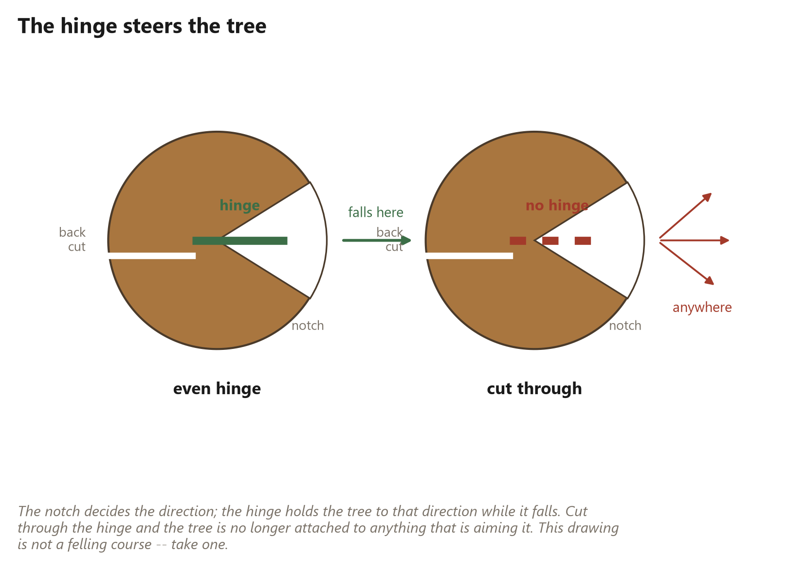

## The hinge, drawn

The drawing shows the hinge doing its three jobs at once, because the
jobs are the explanation for everything above.

**It aims.** The hinge is the uncut wood across the back of the
notch, and it is flexible only in one direction — along the fall
line. As the tree tips into the notch, the hinge bends like a door
hinge, and the tree can only go where the hinge bends. Cut the hinge
uneven and the tree steers toward the thick side; cut it straight and
the notch's direction is the tree's direction.

**It holds.** While the tree tips, the hinge keeps the butt attached
to the stump. That attachment is what stops the trunk from kicking
back off the stump as the crown hits the ground — the butt stays
pinned, the tree hinges down like a gate, and the fall is one
motion instead of a throw.

**It lets go.** At the end of the fall the hinge's fibres tear, and
the tree separates from the stump cleanly. The timing of that tear
is set by the hinge's thickness — the feller's one real control over
the whole event, and the reason the dimension is measured, not
guessed.

## Limbing without pinching

The tree is down. The next job is the crown, and it is the part
where the saw gets pinched, because a downed trunk is a compressed
spring in disguise.

The trunk lying on the ground is bent slightly by its own weight:
the top side is in *tension* — the fibres stretched — and the bottom
side in *compression* — the fibres squashed. Cut from the top down
into that bend and the kerf opens as the tension side relaxes — safe.
Cut from the bottom up and the kerf closes on the bar as the weight
settles — pinched, stuck, and often the start of a fight with a
half-cut limb under load. The rule: **read the bend, cut the
tension side first, or cut from the outside of the bend inward.**

Limb the trunk in sections, cutting the branches off flush with the
trunk but never into it — the bucking days want clean wood, not
wounded wood. Work from the butt toward the top, keep the trunk
between you and the slope, and expect every branch to move when its
tension releases. A limb under a fallen trunk is loaded wood; the
moment the saw frees it, it springs. Stand where the spring is not.

By the end of day one the first tree is a clean, bare trunk on level
ground, the crown stacked where the firewood will be cut from it
later, and the saw has done the most dangerous work it will do all
fortnight.

## What actually happened

The story half, recorded the way this book records everything that went
wrong: named, not tidied.

The first tree went exactly where it was aimed. The notch was clean,
the hinge held, and the trunk landed inside a step of the planned
line, which the plan treated as a triumph and the book records as
luck doing its job: the tree was straight, the wind was nothing, and
the lean agreed with the aim.

The second tree did not go where it was supposed to.

It was the lean. The tree had grown with a slight bow toward the
open ground, and the feller — one person, reading the trunk by eye —
cut the notch for where the tree *should* fall and the back cut for
where the hinge would let it. The hinge steered; the lean overruled;
the tree fell a quarter-turn off the aim, taking a young neighbour
down with it and landing with its crown in the brush instead of on
the clearing.

Nobody was hurt. The escape route was where it was supposed to be,
and the miss happened in slow, visible degrees rather than in one
event — which is exactly what the hinge, even a mis-aimed one, is
for. The lesson cost a morning: the second tree had to be worked out
of the brush, the neighbour's remains cut clear, and the fall line
for the *next* tree chosen by the lean alone, which is the rule the
chapter opened with and the feller had half-ignored.

The book keeps the story because the story is the point of the
chapter. The notch, the hinge, the escape route — they are not
technique for a straight tree on a calm day. They are the margin
for the tree that is not straight and the day that is not calm, and
on day two the margin was spent exactly as designed: the tree fell
wrong, and the feller walked away. Two trees down. The fortnight
had begun.

---

# 28. Days Three and Four: Bucking

*Cutting the trunk into the only length that matters*

## Bucking

The trees are down. Days three and four turn each bare trunk into
8 sections of 6 feet — the
only length in the whole method, and the number that sizes everything
downstream.

Bucking looks like the simple day of the fortnight and is not,
because every section after it is the *whole* building in embryo: the
section length sets the member length, the member length sets the
dome, and a bucking error made on day three arrives on day fourteen
as a frame that will not close. The chapter's job is the one
measurement, repeated, without drift — plus the two unglamorous
subjects that decide whether the day is a one-person job: where the
sections start, and how a green six-foot round moves.

48 feet of trunk, cut into 8
sections, offcut 0.0 feet. That is the whole day,
counted. The rest is doing it the same every time.

## Marking and cutting to length

The procedure, built around the one fact that makes bucking hard: the
trunk tapers, so a tape laid along the bark measures around a slope
and over bumps, and drifts.

**Mark with a stick, not a tape.** Cut one 6-foot
stick — a story pole — from anything straight, and mark every section
with it. The stick does not stretch, does not creep, and reads the
same at the butt and at the top. It is the jig before the jig:
the length made physical, once, instead of re-read forty times.

**Mark a line around, not a tick.** One tick on the bark disappears
into the cut. Mark the full circumference with the saw's paint or a
lumber crayon, rolled around the trunk with a square laid flat, so
the cut is guided from any side. A crooked crosscut is a section
with sloped ends, and a sloped end is a wedge with one short face —
the error that hides until assembly.

**Cut from the top side of the bend.** The downed trunk is bent by
its own weight, exactly as the limbing chapter warned: cut from the
compression side and the kerf closes on the bar. Roll the trunk or
cut from above, and let each section's weight drop it free the moment
the cut goes through. A section that hangs by a thread of bark is a
section that will fall when it wants to; finish the cut.

**Cut in the air, not into the ground.** The bar through the trunk
and into the dirt dulls the chain in one cut. Roll a short log under
the cut line, or cut most of the way through and roll the trunk to
finish from above. The chain's sharpness budget belongs to the
ripping days, not to the ground.

**Check the count.** 8 sections per tree, counted
twice — once as cut, once stacked. The count is the chapter's whole
deliverable, and a missing section is a missing 8
members, which the frame will notice before you do.

## Where to start, and why not at the butt

The instinct is to start at the butt and measure up. The method says
start further in, and the reason is the taper's fault.

The butt end of a felled tree is not cylinder — it is flare. The
root swell runs up the trunk a foot or two, and a section cut from
the flare is an oval, its rings running wild, its first split a
guess about where the pith actually is. So the bucking starts where
the flare ends: stand the tape against the trunk, find where the
diameter stops falling fast, and make that the first cut. The flare
itself becomes firewood — the offcut of the plan below — and every
section after it is true round, which is what the split count
assumes.

The same rule finds the start around bends. The felling chapter left
the trunk with its kinks in it, and bucking is where the kinks come
out: cut the sections on the straight runs, leave the bent lengths
between them as firewood, and count only straight sections toward
the 8. The trunk does not owe you its bends; the
plan knows they exist and pays them in firewood.

The top end, too, gets trimmed: the last section before the crown
is where the diameter is smallest and the knots thickest, and if the
crown side of it looks like a branch knot rather than a log, it
joins the firewood pile. The usable length the tree chapter measured
was never the whole trunk; it was the straight, flare-free, crown-free
run, and bucking is the day the distinction becomes a pile of rounds.

## Eight sections from one trunk

The drawing is the day's plan at a glance: 48
feet of trunk, laid out into 8 sections of
6, the offcut — 0.0 feet of
flare and crown — marked off and consigned to the firewood pile.

Read it as the book's first real inventory rather than a diagram.
Every section in the drawing is 8 future members; the
whole trunk is 64 struts; two trunks are
192, against a frame that needs
120. The bucking day is where those numbers stop being
the tree chapter's arithmetic and start being a stack of wood you can
walk around. If the stack does not match the drawing — a section
short, a count off, an offcut bigger than the plan — day three is the
day to find out, when the fix is another section or another tree,
not another month.


## Moving six-foot green sections alone

The unglamorous logistics, because the method's one-person claim
lives or dies on this afternoon, not on the geometry.

A 6-foot section of green pine is a wet,
round, heavy thing — the butt sections near the flare can be a full
day's load on their own. The method does not pretend otherwise; it
moves them the way they want to be moved: **roll them**. A round
section rolls; the only lift is the short end-over-end to clear a
branch or a bank, and the ground does the carrying. Lay the bucking
line out so the sections can roll to the splitting station — downhill
is free, level is fine, uphill is the day's only real fight — and
the "moving" half of bucking disappears into gravity.

For the sections that must lift: never a dead lift of the whole
section. Roll it onto a low block, lever the end with a limb, or
cut it into two shorter sections and accept the split-count change —
the section length is a plan, not a law, and a back is not a
substitute for a winch. The peavey, if one is on hand, turns the
roll into a one-handed job; without it, the wedge and the lever do.

The real measure of day four is not the pile. It is whether day
five can start without lifting a single section twice — the
splitting station laid out, the sections staged where the ripping
will happen, and the fortnight's only heavy lifting behind you. The
bucking days end with 8 sections a tree, stacked
dry-side-up, counted, and the saw's chain still sharp for the work
that actually makes the members.

---

# 29. Days Five to Eight: Ripping

*One hundred and twenty struts, thirty to an afternoon*

## Ripping

Days five through eight are the bulk of the labour and the heart of
the method: every section of the two trunks, split along its length
into 8 wedges, until the frame's
120 members exist as a pile. Two trees become a
building on these four days; everything before was preparation and
everything after is assembly.

The arithmetic sets the pace and the pace is honest:
5.0 struts an hour, sustained, means
24 hours of ripping — 4
afternoons — for the whole frame. That is the number the fortnight's
reputation rests on, and it was measured on this build, not promised.
The chapter is the measurement made into a procedure: the three
passes at the log, the cradle that holds a round section still, the
pith you aim at, the rhythm that sustains the rate, and the chain
sharpness that the whole four days secretly depend on.

## The three passes, at the log

The procedure of Chapter 12, now with the saw actually in
hand, at production pace.

**Stage the section.** Every section gets stood on end or laid in
the cradle before the saw starts — never ripped on the ground where
it can roll, never half-rolled between passes. The staging is the
first third of the work, and a section staged wrong costs more time
than a cut made slow.

**Pass one: halve it.** Aim down the pith line on the end grain and
rip the full length. The saw walks itself through a straight section
if the bar starts true; the feller's job is to start true and let
the saw cut — a ripping saw is steered with small corrections, not
pushed. The two halves fall apart with flat faces down.

**Passes two and three: quarter, then eighth.** Each half sits on
its flat face in the cradle and gets halved again; each quarter the
same. Seven cuts per section, all of them "through the middle", and
the pile of wedges grows by 8 with every section
finished.

**Stack as you go.** The wedges go straight onto stickers, sawn
faces down, bark up, where the drying chapter wants them — not
thrown on a pile where the day's own moisture steams them. A wedge
stacked right on day five is a straight member on day thirty; the
stacking is part of the cut, not the cleanup after it.

**Count the pile against the plan.** 64 struts
a tree, 192 for the two, 120 in
the frame, 72 spare for the grading rejects. The
count is checked at the end of every afternoon, because a shortfall
found on day eight is a fourth tree; a shortfall found on day
thirteen is a problem with no good name.

## Holding a round section still

The first pass is the hard one for a reason the second and third do
not have: a round section wants to roll, and a rolling log under a
ripping saw is where pinched bars and ruined cuts are made.

The cradle is the answer, and it does not need to be furniture. Two
stakes driven either side of the section, a pair of wedges under it,
or a simple V of scrap timber along its length — anything that stops
the roll and leaves the top of the section at a working height. The
cradle's job is negative space: it holds the log where the saw is
not. Once the first pass is made, the halves sit on their flat faces
and the cradle's work is mostly done — flat stock on a flat bench is
stable by itself, which is the second reason the halving pass goes
first, every time.

The wedges earn their place on the *first* pass and again at the
end. Driven under a section, they level it, lift it off the dirt,
and take the weight so the saw's kerf stays open. A section that
settles as you cut closes the kerf behind the bar — the saw bogs,
the cut wanders, and the pass is ruined in its last foot. The wedge
set under the cut line is the cheapest insurance in the method.

## Reading the pith

Every rip aims at the centre of the section, and the centre of a
real section is not a point — it is a small, dark, slightly
off-centre dot in the end grain, and the first skill of the ripping
days is finding it.

The pith is the tree's first year: a soft spot, usually darker than
the rings around it, not always exactly centred. The split geometry
does not care that it is slightly off — the sectors of a slightly
off-centre split are nearly identical, and "nearly" is what the
method budgets for. What matters is that every pass goes *through*
the pith, so every sector keeps a point that is honest wood, not a
rag of pith off to one side. A sector whose point misses the pith
by an inch is a member with a soft, split-prone edge exactly where a
member most needs honest wood.

On a section that is not round — the oval butt, the flat-sided
trunk — the pith still rules. Aim at the centre of the rings, not
the centre of the shape; the rings are the tree's own record of
where its middle is, and they are right more often than the outline
is. The first pass is started from a stance where the pith is
visible the whole way — sighting down the bar, checking every few
feet — because a pass that starts an inch off arrives a foot off,
and a wedge is six feet long.

## The cutting rhythm

The chart is the claim and the proof together: 5.0
struts an hour, sustained, for six hours, afternoon after afternoon.
It is not a sprint rate; it is the rate the body can hold while the
saw cools between cuts, the pile is stacked as it grows, and the
count is kept.

Read the rhythm as a sequence of stations rather than a series of
cuts. Stage, halve, quarter, eighth, stack, count — one circuit per
section, the same motions in the same order, the saw never waiting
on a decision. The chart's flatness is the point: a sustained rate
is a rate with no thinking in it, and the method was arranged so the
thinking happened once, in these chapters, and the ripping days just
repeat. The afternoons that beat the rate are the ones where
something was skipped — a staging, a stacking — and the debt shows
up the next morning as a pile to sort and a chain to sharpen before
the first cut.

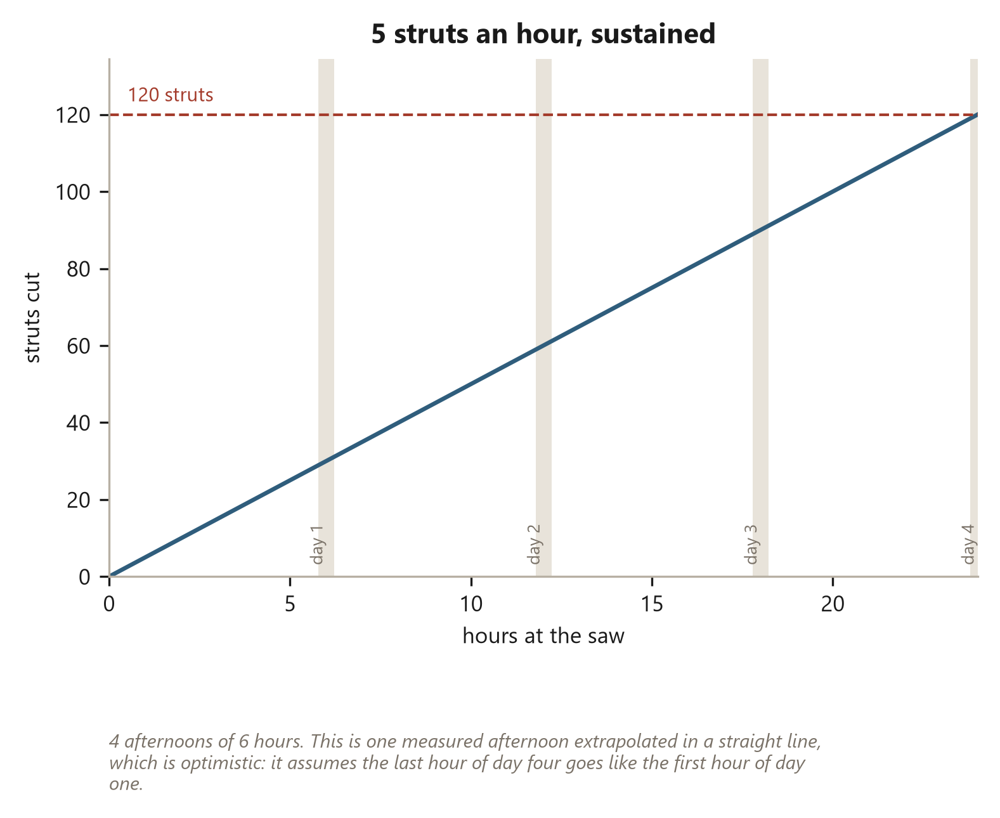

## Chain, file, and the cost of a dull cut

The four days' secret dependency: a ripping chain is either sharp
or it is spending your arms and your fuel, and the difference is
visible in the pile.

A dull chain does not stop cutting. It starts *pushing* — the saw
walks off the line, the kerf widens into a groove, and the bar works
hot while the feller works harder. The kerf is the honest ledger:
every cut is a 0.25-inch-wide line of sawdust, and a dull
chain turns that line wide and ragged, eating the recovery figure
Chapter 13 computed, one cut at a time. The file is
the fix and the cadence is the rule: a few strokes per tooth, every
few tanks, *before* the pushing starts, never after. Touch-up
filing at the bench costs minutes; a chain sharpened only when it
fails costs the afternoon it fails in.

The practical cadence on this build: file at the midday fuel stop,
whether or not the chain asks. The ripping days are the saw's
hardest work in the whole method — bar buried, grain sideways, wet
wood — and the chain that starts the afternoon sharp finishes it
dull. The file is the one tool in the fortnight that is used *more*
than the saw.

## What this is worth an hour

The sidebar's job is to put the four days' labour in the only
currency that survives the fortnight, and then to put the caveat
beside it.

Splitting your own struts is work, and the work has a rate. The
full accounting lives in Chapter 53 — the strut
valued three ways, the disagreement between the ways kept in the
table, and the rate computed against the dressed board that is the
honest comparison. Here the summary, once: an hour at the log
produces members worth more than the hour's alternative at a wage,
*if and only if* the alternative was going to be buying that timber
— and the substitution value is not money anybody has been paid. It
buys groceries only if the timber was going to be bought anyway.

The ripping days feel like the part of the fortnight where the
money is made, and in substitution terms they are — the frame's
timber is the single largest line the build avoids paying. But the
rate is a rate on *your* hours, priced against *your* alternative,
and the chapter that computes it is careful to say which parts of
the comparison flatter the method and which do not. The ripping
chapter's own verdict is narrower: the four days are the price of
the timber, the price is real, and it is paid in afternoons instead
of invoices. Whether that trade is worth it is Chapter
53's question, asked properly, with the numbers up.

---

# 30. Day Nine: The Jig

*One flat bench that makes forty panels the same*

## The Jig

Day nine is the day that pays for the other thirteen, and it is a
single day spent building a single thing: one flat bench on which
every one of the frame's 40 panels will be assembled,
identical to the last.

The jig is where the method stops being a pile of good ideas and
becomes a production line. The wedges are cut, and they are nearly
alike — nearly, because the tree was nearly round, the saw nearly
straight, the eye nearly true. The jig does not need them to be
exact; it needs them to be *held* the same way while the exact
parts — the butt cut, the head length, the screw positions — are
established by the fixture instead of by the eye. A jig is a decision
made once and repeated forty times in wood, and the rest of the
book's build chapters are that sentence, carried out.

The full reference for the fixture — every stage, labelled, straight
from the simulator — is Chapter 33. This chapter is
the story of the day it got built, and the argument for why a day is
the right price.

## Why a jig and not a tape

The temptation on day nine is to skip the bench and measure the
panels one at a time: lay three sticks in a triangle, tape them to
length, screw them. It works — for the first panel. The question is
what the fortieth panel looks like.

A tape measures each panel against an ideal that lives in the
builder's head, and no two measurements of a rough stick agree with
each other. The error compounds quietly: a sixteenth here, a
thirty-second there, and the panels drift apart in ways that only
announce themselves at raising, when two neighbours built a week
apart refuse to share a seam. The frankendome — Chapter
3 — was forty panels built exactly this way,
and its lesson was the whole reason this book exists: **nothing
repeated, so nothing could be checked against the last one.**

A jig inverts the logic. The fixture holds the *position* of every
stick — the triangle's shape, the cut lines, the screw locations —
as physical stops, and the builder's job becomes loading the stick
against the stop. The measurement happens once, when the bench is
built; after that, the panels are not measured at all, they are
*located*, and locating is an operation that cannot drift, because
the stop does not move. Panel forty is built the same way panel one
was, and the only difference between them is the sticks — which is
exactly the difference the method is designed to tolerate.

Repeatability beats accuracy, when there are forty of something. A
jig that is half a degree wrong builds forty panels that agree with
each other, and the frame closes; a tape that is read forty times
builds forty panels that disagree, and the frame does not. Day nine
buys the agreement.

## Building it

The bench, in order, kept deliberately simple — the jig's only
requirement is flatness, and everything else is stops.

**The bench.** A flat surface bigger than the largest panel: two
sawhorses and a sheet of plywood are enough, levelled and braced so
it cannot rock. Flat is the one property that matters, because the
panel's truth is measured against the bench; a bench with a twist
in it builds a twist into every panel that lies on it.

**The triangle.** Lay out one panel full size on the bench — the
actual member lengths from the cut list of Chapter
24, the actual gasket allowance — and screw down
stops along all three outside edges: the triangle's outline, made
of scrap, exactly where the members will lie. The stops are the
jig's first truth, and they are set once, from the drawing, with a
square and a story stick — the tape's last appearance in the whole
fortnight.

**The fences.** Inside the triangle, two more lines of stops mark
where the head ends will be sawn off and where the butt ends land:
the inset of Chapter 15, built as wood instead of
remembered as a number. The fence is the cut line, physical, and
the saw runs along it the way a saw always wishes it could.

**The cut planes.** Where the saw must cut, the jig provides the
plane: a straight edge the bar rides against, set at the butt's
bevel and the head's square. Chapter 34 gives the
angles; the jig holds them; the builder never sights one.

**The clamps.** Whatever holds a wedge still against the stops
while the screws go in — quick clamps, wedges, a foot on a pedal.
The member must arrive at its stops and stay; how it is persuaded
is the builder's business.

The bench takes a day, and the day is not wasted on accuracy — it
is spent on *position*, which is the cheaper thing to be right
about. A stop screwed in the wrong place is moved in a minute. A
panel built in the wrong place is discovered at raising, in front
of a crowd of its neighbours.

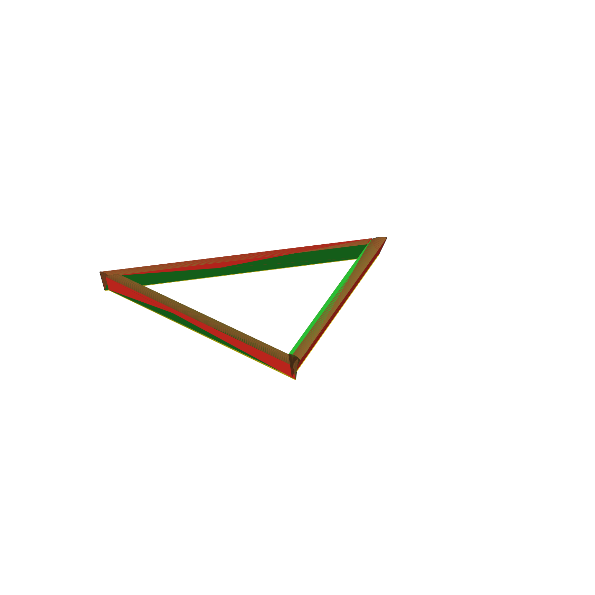

## The jig, complete

The plate is the finished fixture with a panel loaded on it, at the
moment the long heads are being sawn off against the fence — the
stage of the work where the jig's whole argument is visible at
once.

Look at what is holding the truth. The sticks are rough — bark
backs, saw marks, the ordinary drift of split timber. The triangle
they lie in is exact, because the stops are. The butt ends are
where the fence says, the heads run long past the cut plane, and
the saw is about to make the only cuts in the whole panel that have
to be right — and they will be right, because the plane the saw
rides is the plane the bench made, not the plane a hand held.

That is the day-nine bargain, paid in one afternoon and collected
for the rest of the fortnight: from tomorrow, nobody measures
anything. Chapter 31 is the
production run the bench was built for, and the run is the proof —
40 panels, one after another, each one located, cut
and screwed in the same twelve motions, and each one leaving the
bench the same panel.

---

# 31. Days Ten to Twelve: Forty Panels

*The same twelve motions, forty times*

## Forty Panels

Days ten through twelve are the production run the jig was built for:
40 panels, one after another, on one bench, from the
pile of wedges the ripping days left.

The run is where the method's promise becomes arithmetic. One panel
is twelve motions — load, locate, butt, head, drill, screw, flush,
out — and forty panels of twelve motions is a production line with
one worker, one station, and no waiting. The days go wrong only when
the motions stop being the same: a stick sorted into the wrong
class, a marking that washed off in the rain, a panel started before
the jig was checked. This chapter is the procedure, the sorting, and
the two honest notes that make the run real — the fourth panel is
the first good one, and the variant count is smaller than the pile
makes you fear.

## One panel, start to finish

The twelve motions, in order, as they will run forty times. Chapter
33 names the same stages from the simulator's side;
this is the version your hands do.

**Check the bench.** Stops tight, cut planes clean, clamps where the
hand expects them. Thirty seconds, every morning, before the first
panel — the jig's truth is the day's truth.

**Sort the three sticks.** One long member and one short for the
sides, one more of whichever the triangle asks, drawn from the
marked piles of the sorting pass below. The sticks arrive at the
bench already decided; the bench never decides.

And for an isosceles panel, *which* side each stick goes on is fixed:
**the longest — 72.0 inches — is the base, the middle
length (63.5) is the left side, and the shortest
(61.5) is the right.** Lay the base nearest you and the
left member is the longer of the two: it reaches over to the top point,
and the short right side runs up to meet it — and it is that short side the
base butts up to. An equilateral panel is three
long members and has no such rule to remember, which is most of why the
run is quick: 10 of the panels are the easy kind, and the
30 isosceles ones carry the one instruction that must not be
swapped. At the bench the two sides look almost identical — the
difference is two inches over five feet — so the rule is applied by
picking from the marked piles in order, never by eye.

**Load the first side.** Butt against the butt stop, sawn faces down
on the bench, head running long past the head fence. The stop does
the locating; the hand only presses.

**Butt-cut if it is due.** Some classes carry their butt angle from
the saw; some are cut at the bench. Either way the cut is made
against the plane the bench holds, never freehand. Chapter
34 is that cut in full.

**Load the second and third sides.** Each lands against its own
stops, butts to butts, and the triangle assembles itself under the
clamps — three sticks, three overlaps, the pinwheel of Chapter
15 appearing without anybody arranging it.

**Drill and screw the overlaps.** Through the outer stick into the
inner, at the spread the connector chapter established, pulling the
overlap closed. The screws are the only fastening in the whole
panel, and the jig's holes — or the fence's positions — make them
land the same on panel forty as on panel one.

**Flush the heads.** The three heads, still long, are sawn off
against the head fence: one plane, three cuts, and the panel is
exactly the triangle the bench describes. Chapter 35
is why the heads were long in the first place; here it is simply the
last motion of the panel.

**Lift it out.** The panel comes off the bench as one finished
thing — 3 members, their own edges, ready
to be checked, marked and stacked. That is the whole panel. Twelve
motions, measured in minutes once the rhythm is in.

## Sorting the pile

The run only stays a run if the pile does not get to decide
anything at the bench, so the sorting pass happens once, before the
production days, with a marking scheme that survives the weather.

**Sort by class, not by stick.** The four member classes of Chapter
9 each get their own stack, marked at the
cut — a crayon code on the sawn face, one stripe per class, one
colour per tree. The bench pulls from stacks; it never chooses
between sticks.

**Mark the faces, not the ends.** The ends get cut off. The sawn
face is where the mark lives through every operation that follows,
and it is the face that lies *down* on the bench, so the mark also
reads as an orientation cue: mark up, bark up, wrong way round is
visible before the clamp closes.

**Mark with what survives rain.** Lumber crayon, not pencil.
Pencil washes out of wet pine in one night; the crayon is the
marking scheme's entire weatherproofing, and the fortnight has
already had one rain.

**Run the grading passes as you sort.** The four passes of Chapter
19 — bend, knot, bearing, pith — are the same walk
as the sorting pass, and doing them together means every stick
reaches its stack already judged. The 72 spares
the tree chapter promised exist as the reject pile, and the reject
pile is the margin the run spends when a stick misbehaves at the
bench.

## The fourth panel is the first good one

The honest note, stated early so nobody panics on day ten.

The first panel of the run is a rehearsal. The motions are new, the
clamps are in the wrong places, and the result is a panel you
would not hang a roof on. The second panel is faster and nearly
right. The third finds the rhythm and the fourth is the first panel
that comes off the bench exactly the way the fortieth will — and
the run's real output is not forty panels, it is the thirty-seven
that follow the learning curve.

The book says this plainly because the curve is the plan, not a
failure of it. The method's whole claim is that the motions repeat,
and repetition is what turns the first three panels from mistakes
into tuition. The rejected first panels are not waste; they are the
cheapest practice the build will ever get, and they end their lives
as the jig's own test pieces — the panels you cut into, shim, and
check the saw against, so the bench's truth is probed by the very
thing it built.

## Panel variants

The table closes the chapter with the count that keeps the run
sane: how many genuinely different panels the dome contains.

Not forty. The frame's 40 panels are two shapes —
10 equilateral, 30 isosceles, the
counts of Chapter 8
— and each shape is built from the same four member classes, so the
run is two panel variants in a repeating pattern, not forty
originals. The table is generated from the solved dome, and its job
at the bench is the same as every table in this book: the pile looks
like chaos, the count says otherwise, and the count is right.

By the evening of day twelve the run is done: 40
panels, stacked by variant, the reject pile spent, the bench
quiet. The fortnight has two days left, and they are the days the
photographs are taken on — the raising, where forty flat triangles
become the building the next chapter describes.

---

# 32. Days Thirteen and Fourteen: Raising

*Forty panels become one building*

## Raising

The last two days of the fortnight are the ones the photographs are
taken on, and the ones the book is most careful about, because
raising is where a frame that was built flat, checked flat and
trusted flat suddenly has to stand in three dimensions — and where
every error the earlier chapters let through comes home at once.

The job: 40 finished panels become one standing
hemisphere, in an order that lets one person do it, held up by
temporary props until the shell closes and holds itself — and then,
in this book's build, winched off the ground entirely: three cables
from the apex hanger to saddles on the trees, the brake winch doing
the hoisting, and the cabin hanging where the trees hold it, with
no footing under it at all. The order
matters more than the effort. A dome assembled in the wrong order
needs a crane and a crew; assembled bottom ring first, course by
course, it needs one person, a ladder, props and a winch — the same economy
the whole method has been spending since the tree.

The chapter ends with the honest inventory of what a hanging frame
is not, because day fourteen feels like a finish line and the book
has four more parts to go.

## Bottom ring first

The assembly order, which is the whole secret of a one-person
raising.

**Set the ring.** The ten rim panels go down first, laid out flat on
level blocks — or on the footing of Chapter
39, for a build that stays on the
ground; this book's build uses blocks, because its ground work
comes last. The ring is the only part of the frame that
touches the ground, and it is the one part that must be right
before anything rises off it — its 10 edges set
the circle, and the circle sets everything above. Chapter
38 names the ring as the one place error can
accumulate, and the check is done here, at the start, when a wrong
ring is still a morning's fix: measure the ring across its widest
points, both ways, and do not build up until the two numbers agree.

**Course by course.** The next ring of panels sits on the first,
each new panel's base edge meeting the top edge of the panels below
it — the seam, the key, the screws, the same joint the bench built,
now vertical. Work around the dome, not up one side of it: a dome
grows in levels, and a level that closes before the next begins is
the prop that holds the next level. The order is not optional; a
half-raised dome is a sail, and the wind has opinions.

**Key and screw as you go.** Every seam gets its key before the
neighbouring panel arrives — a seam closed later is a seam closed
from a ladder, reaching into a gap that has already tightened. The
keys are the schedule of Chapter 16, and the schedule is
followed in place, panel by panel, the count climbing toward
55.

**Check the ring, again.** At every course, one measurement across
the open top tells you whether the dome is coming up round or
egg-shaped. The check costs a minute and it is the difference
between a raising and a rescue; the dome that fails it today gets
propped today, not discovered tomorrow.

## Propping, and what holds it up before it is closed

The photographs show the finished frame. The raising itself is a
building held up by sticks, and the props are the chapter nobody
writes.

A dome does not carry itself until the top closes. Until the last
panel ties the structure together, every course above the ring is
leaning its weight on the course below it, and the courses below are
leaning on props — lengths of scrap set against the inside, butted
to the ground, holding the shell at its current height. The props
are the temporary structure the method admits it needs: not
scaffolding, not a crew, just the same wood the frame is made of,
pressed into service as furniture.

The prop rule is simple and absolute: **a panel goes up, a prop
goes under it, and a prop never comes out until the course above it
has closed.** The dome rises prop by prop, and the props travel —
pulled from the lower course once the ring above it is screwed
closed, carried up, reset. It looks like chaos in the middle and it
is not: every panel in a properly propped raising has a load path
to the ground at every moment, which is exactly what the finished
frame will have, temporarily, in wood.

The one danger the props exist to prevent is the panel that leans
out. A panel set at the wrong angle, or a course started before the
course below it closed, will try to fall *outward* — and a falling
panel takes its neighbours' seams with it, opening the dome like a
flower in reverse. The prop is the answer and the order is the
prevention; together they make the raising a sequence of small,
held, stable moments instead of one long gamble.

## Closing the top

The last panel is the hardest, and it is worth saying why before
the raising reaches it.

Every seam closed so far was closed against air — the next panel
could be offered up, adjusted, persuaded. The last panel closes
against a *hole*: every one of its three edges lands on a seam whose
other side is already fixed, and the panel must fit the hole the
whole dome has been building toward for two days. If the ring was
set right, the courses keyed right and the schedule followed, the
hole is exactly the panel — the method has been aiming at this
moment since the first butt cut. If anything drifted, the drift
lives here, in the last triangle of sky.

The order of the last panel's edges matters more than its screws.
Offer the panel up gently, key the lowest seam first, then one side,
and let the last seam close under the panel's own weight — a final
seam that needs forcing is the dome telling you where the error
went, and the answer is never more force; it is a shim behind a
key, or a prop relieved, or, honestly, a panel taken down and the
neighbour adjusted. The method's tolerance budget — Chapter
38 — was built for exactly this conversation,
and the conversation is short: the frame closes, or it does not,
and it almost always closes.

Then the screws go in, the props come out, and the frame stands on
nothing but its own shape — until the winch takes it.

## The winch, and the trees

This book's build does not leave the frame on the blocks. It hangs
it, which is the step the title page promised and this section
reports.

Three cables run from the apex hanger — the mast's lifting ring, or
a temporary sling through the crown on a first build — to saddles
on two of the three trees: two legs to one tree, one to the other,
because a tripod of cables on two anchors is what keeps a hanging
load from spinning. The brake winch does the hoisting, one slow
notch at a time, the frame lifting off its props the way a boat
lifts off its trailer, and the moment the props fall free the cabin
hangs — the trees holding the whole weight of it, the rim swinging
a few feet above the ground, and the builder standing under
something that yesterday was a pile of wedges.

Say it plainly, the way the floating-dome chapter does: this is a
tested construction and a design possibility, not an engineered
rating. The trees, the saddles, the cables, the mast and the winch
all carry real loads, and none of those ratings is in this book —
the engineer's sentence from Chapter 10 binds here
harder than anywhere else in the build. The saddles are saddles,
not holes: straps that spread the load over bark, so the trees
carry the cabin the way they carried their own crowns.

What hanging buys is the deferral the book has been promising: the
ground is now *available* — no footing, no ring beam, no pad is
owed, because the cabin does not touch the earth. The floor clamps
to the mast when it is bought (Chapter 70), the skin
goes on in the air or on a lowered frame, and the foundation, when
it comes, is the last decision of all (Chapter
39). The winch did not just raise the
cabin. It un-scheduled the ground.

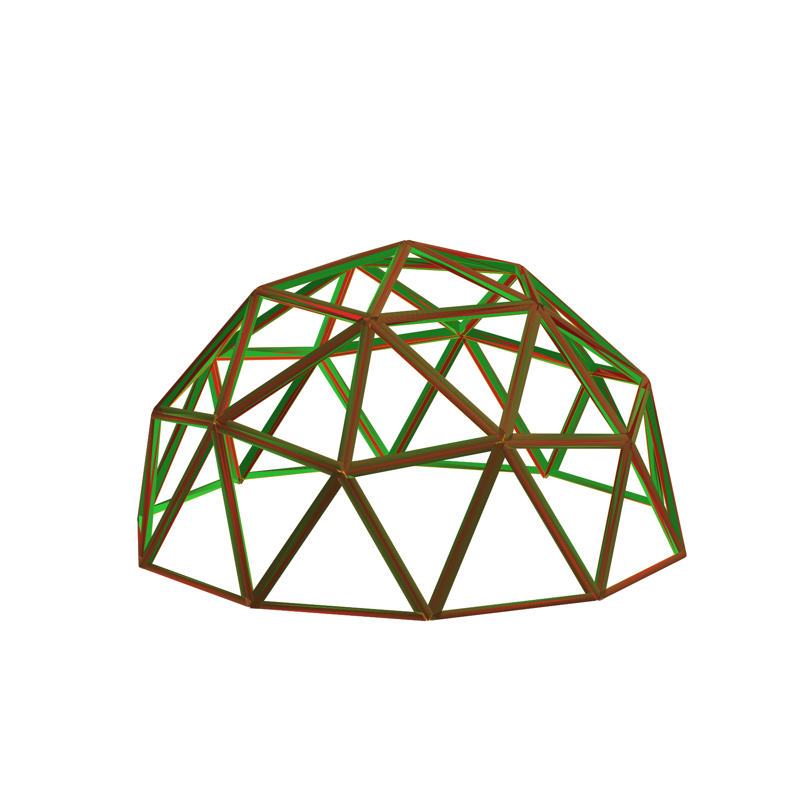

## Standing

The plate is day fourteen: 120 members, 3 trees, a
fortnight — the frame this book has been describing since the first
chapter, standing where the tree once stood, before the winch took
it up between the other two.

Look at it for what the book wants you to see. No hubs. No mitred
corners. Forty panels that each remember the bench. The seams
running in their two angles, the keys seated, the rim on the
blocks. It is the same object the simulator solved before the first
tree was felled, and the fact that a solved model and a fortnight's
labour can produce the same standing thing — and then hang it —
is the method's whole
argument, in one picture.

And the next section is the book's own correction of this
photograph, because the photograph lies in the way all finished
things lie.

## What was not done

The honest inventory, written while the frame is still warm from
the raising, because day fourteen feels like an end and is not one.

The hanging frame is **not a shell**. It has no skin, no weather
barrier, no insulation — the seams are open to the sky's weather,
and the first real rain will find the book's weakest chapters and
test them. Part Seven — Chapters 40 through
44 — is the work that turns
this photograph into shelter, and it is a season's work, not a
fortnight's. The skin can go on in the air or on a lowered frame;
the order is the builder's, which is the point.

It is **not a home**. No floor but the air under it, no door but
the gap where a panel is missing, no power, no water, no heat. The
frame is
the part of the building the fortnight was sized for; the rest of
the building is sized in months, and the book's later parts are
honest about that calendar.

And it is **not finished** — it is *standing*, or rather *hanging*,
which is the
fortnight's actual deliverable and no more. The dome will move as
its green wood dries, the keys will settle, and the frame the
builder checks on day thirty is not quite the frame of day fourteen.
That settling is a real event in the build's first year, and this book's
habit is to name it, measure it where it can be measured, and leave it in
the frame rather than tune it out.

So the fortnight ends the way it began — with an honest sentence.
3 trees, one saw, fourteen days, 37.5 hands-on
hours: the frame is up, and up between the trees. The rest of the
book is what the frame makes possible, and the first thing it makes
possible is the next chapter, where the method's reference pages
begin.

---

# 33. One Bench, Forty Panels

*What the jig is and what each part of it does*

## One Bench

This is the reference chapter for the fixture itself: what the jig
is, part by part, straight from the simulator that models it, so the
bench on your floor and the bench in the model cannot disagree about
what a jig is.

Chapter 30 told the story of the day it was built.
This chapter is the thing, cold: the twelve stages a panel passes
through on it, the labelled drawing of the fixture before any wood
is on it, and the procedure for laying the whole thing out full size
on a real floor with nothing but string and a pencil. Come back to
this part while you are working, not while you are reading — the
book's reference chapters are written for the bench, and this one
lives there.

## The twelve stages

The table is the jig's whole working life, generated from the
simulator's own stage list: every stage a panel passes through
between the raw pile and the finished triangle, named and ordered.

Read it as a checklist, not as a description. The twelve stages are
the production run of Chapter 31,
expanded to the resolution the bench actually works at — where each
member is located, what gets cut when, what gets screwed when. The
order is not optional in the way a recipe's order is optional; the
head overfit of Chapter 35 only works because the
flush cut happens at the stage the table says, after the panel is
already a panel and before it leaves the bench. A stage skipped is
an error invented, and the table exists so the skip is visible.

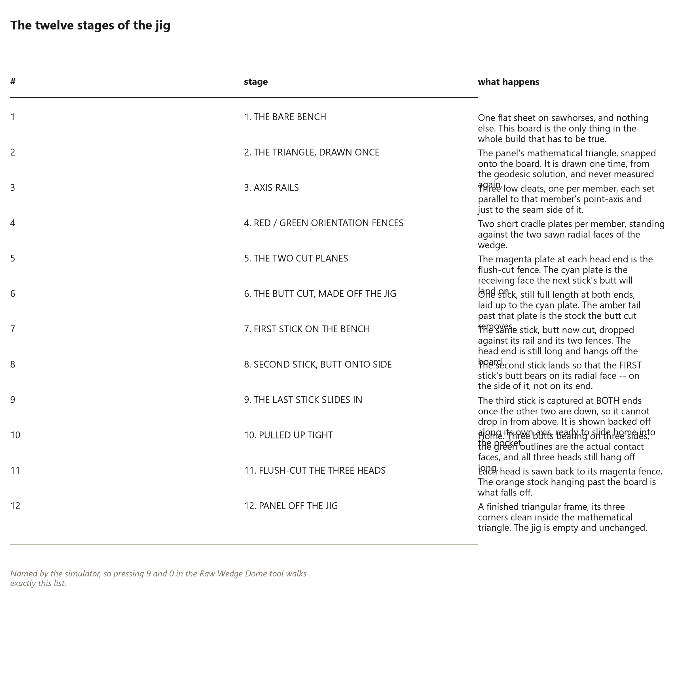

## The jig, labelled

The drawing is the fixture before any wood is on it: the bench, the
triangle, the rails, the fences, the cut planes — every component
called out, each with its one job.

**The bench** is the flat truth everything else is measured from.
**The triangle** is the panel's outline, built in stops around the
outside. **The rails** carry the saw where a cut must be made.
**The fences** are the lines the butts land against and the heads
are cut against. **The cut planes** hold the angles of Chapter
34 so no hand has to. Between them they do the one
thing a jig must do: they replace every decision with a position,
and the position does not move.

The drawing comes from the simulator's own jig model — the same
geometry the fabrication package exports — so the picture and the
fixture are the same object, drawn twice. If the bench you build
disagrees with this drawing, one of you is wrong, and the simulator
is not the likely one.


## Setting it out on a real floor

The full-size layout, because the jig's accuracy is bought on this
afternoon and nothing after it.

**Start with the longest member.** Draw the first side of the
triangle full size, straight off the cut list of Chapter
24 — the actual length, gasket allowance included,
marked on the bench surface with a pencil and checked twice. This
line is the triangle's truth; the other two sides are located from
it.

**Swing the arcs.** From each end of the first line, swing an arc
at the length of its neighbouring side — string and a pencil, the
oldest layout tool there is, and still the straightest for distances
bigger than a square. Where the two arcs cross is the third corner.
The triangle is now on the floor, full size, and the only measured
numbers in it were the three member lengths.

**Check the angles against the drawing.** Before any stop is
screwed down, compare the laid-out triangle against the panel
drawing of Chapter 37: the base angles, the
heights, the relation between the long and short sides. A layout
that matches the drawing within a pencil line is the jig's
foundation; a layout that does not is the cheapest error the whole
build will ever catch.

**Screw the stops.** The outline becomes physical: stops along all
three outside edges, then the fences inside for the butts and the
heads, then the cut planes. Each stop is set against the pencil
line, not against the previous stop — a stop set from a stop
compounds its neighbour's error, and the whole point of the layout
is that every position is measured from the drawing once.

**Prove it with the first panel.** The first panel off the bench is
the test: lay it back over the layout lines, and if its edges fall
on the pencil, the jig is true. The fourth-panel rule of Chapter
31 applies here too — the first
panel proves the bench, and everything after trusts it.

## Locate from the sawn faces, never the bark

The last section of the reference, and the principle that makes a
jig work on natural timber at all.

Bark is irregular. No two sticks share it, it compresses under a
clamp, and it is the one surface of the wedge the saw never touched.
The two sawn faces are the opposite: flat, because the saw made them
flat, and at the same angle on every stick, because every stick is
the same sector of the same circle. So the fixture locates the
member on its sawn faces, and only on its sawn faces. The bark
floats in an oversized clearance and is never asked to locate
anything.

The rule reads as fussiness and is the whole tolerance budget of
the method in one sentence: precision where precision matters, and
tolerance where the tree varies. The sawn faces are the precision;
the bark is the tree varying; and the jig that confuses them builds
forty panels, each as individual as the log it came from — which is
the frankendome, again, wearing a better bench.

Chapter 38 follows the same principle out into
the whole build. This chapter ends it where it starts: one bench,
two datum faces, forty identical panels.

---

# 34. The Butt Cut

*The one compound angle, made before anything is assembled*

## The Butt Cut

Name it honestly at the top, because this project got it wrong in public
once: the butt cut is a compound cut. A mitre and a bevel
together, on one end of every member, made once, off the jig, before
anything is assembled. The claim this book makes is not "no mitres"
— Chapter 15 has the full correction of that claim. The
true claim is better: no member end ever meets another member end,
and the one compound cut the frame does need is made once per
stick, against a fixed setup, instead of twice per stick against a
guess.

This reference chapter is that cut: where its angle comes from,
how few distinct setups the whole dome actually needs, and the
procedure for making it with the allowance still attached. It is
the shortest of the jig chapters and the one the errata pages point at
most, because it is where the book's honesty and the saw's geometry
finally agree.

## The angle its neighbour presents

The butt end of a member is not cut square to the stick's length.
It is cut to match the two facts about the neighbour it will land
on: the neighbour's side leans away from the panel's plane by the
sector's angle, and the panel itself folds toward its neighbour by
the seam's angle. The cut that lands flat against both is a
compound — one angle in the plane of the panel, one across it — and
that compound is the butt cut.

Where the angles come from, precisely: the member's sawn face sits
22.5 degrees off the member's centreline, so
the butt must present that angle to sit flat on its neighbour's
face. The panel's fold adds the seam's angle on top — the
18.03 and 22.46 degrees of Chapter
16. Together they make the one cut the dome cannot avoid,
and the reason it cannot be avoided is the same reason the seam
key exists: the sphere curves, the panels fold, and the wood that
meets that fold must be shaped for it.

The good news, stated as a count: the whole dome needs only a few
distinct setups, not one per member. The bevel is the same
everywhere, and the mitre takes only the values the member classes
demand. The table on the next page is the complete list, generated
from the simulator's own setup schedule — and the fact that the
list is short is the second half of the correction the pinwheel
chapter opened: the compound cut is real, and it is *few*, and
"few, fixed, and made on the jig" is the honest version of the
claim the film got wrong.

## Butt cut setups

The table is the entire saw-setting vocabulary of the build: every
distinct setup, straight from the simulator's own list, with the
member classes each one serves.

Read it as the answer to the question the sceptic is owed: if the
butt is a compound cut, how many compounds are we talking about?
The answer is the table's length — small enough to write on the
wall above the saw, fixed enough that a mistake is a failure to
read, not a failure to calculate. The saw is set once per setup,
the class is cut through, and the setting is never re-derived at
the bench. That is the discipline the whole method runs on:
measure the angles once, on the drawing, and let the jig hold them
forever.

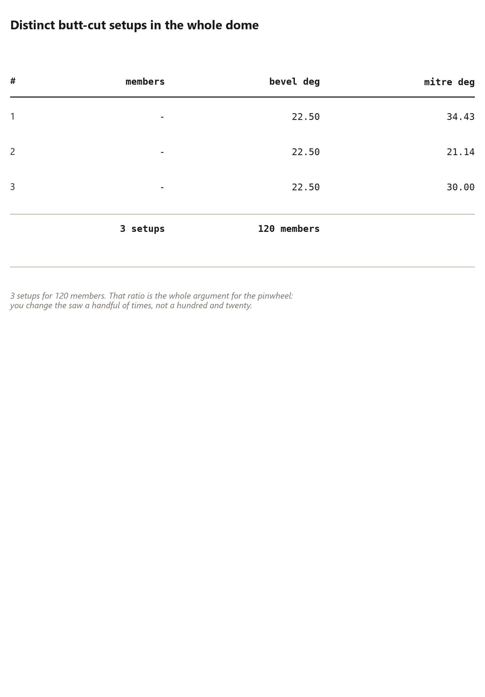

## Making it

The procedure, at the saw, with the allowance still attached —
because the butt cut is never made on a stick that is already its
final length.

**Leave the allowance.** The member arrives at the butt cut with
the spare stock of Chapter 35 still on its head
end and the butt allowance still on its butt end. The allowance is
not sloppiness; it is the room the cut needs to be made *against
the jig* rather than against a tape, and it is the reason a
mis-aimed cut is a do-over instead of a ruined member.

**Set the fixture, not the saw alone.** The butt cut is made with
the stick located on its sawn faces in the jig's cut plane — the
saw's own angle settings do the compounding, but the *position* of
the cut along the stick comes from the stop, and the stop is the
jig's. A butt cut made freehand is a compound angle guessed twice;
a butt cut made in the fixture is a compound angle held once.

**Cut, check, and only then cut the class.** The first stick of a
setup is the proof: cut it, offer it to its neighbour, and read
the contact. A butt that sits flat across the neighbour's face is
the setup's certificate; a butt that rocks on one edge sends the
saw setting back one degree and the proof is repeated. Only when
the first stick passes does the class get cut — the same rule as
the jig's first panel, applied to the saw.

**Keep the allowance until the member leaves the bench.** The
butt allowance is removed at the stage the jig schedule says, not
at the saw. Between the butt cut and the bench, the allowance is
still protecting the cut — and the head overfit is still
protecting the length. The two spare ends are the method's
crumple zones, and Chapter 38 is the
accounting of everything they absorb.

One cut, made once, on one end, off the jig. The butt cut is the
whole of the frame's precision joinery, and it fits in a table, a
fixture, and an afternoon — which is what "no two ends ever meet"
was always worth.

---

# 35. The Head Overfit

*Deliberately cutting it too long*

## The Head Overfit

The head overfit is the idea that makes the whole method tolerant,
and it is the single most counter-instinctive rule in the book:
**cut every member deliberately too long.**

A builder trained on dimensional lumber works measure-cut-fit:
measure the stick, cut it to the number, fit it into the building.
Rough timber will not survive that order. The stick is not the
shape the tape assumed — it bows, it tapers, its butt lands where
the neighbour's face happens to be — and a stick cut to the plan's
length before it meets the building is a stick that arrives wrong.
So the method reverses the order: cut long, locate in the jig, and
let the fixture — not the tape — decide where the end actually
falls. The overfit is the deliberate slack that makes the reversal
possible, and this chapter is its economics: where the error goes,
how much to leave, and what the tolerance costs in wood.

## Where error goes

The core argument, in one image: the head end of every member runs
6 inches past its final position, and those
inches are where the build's error goes to die.

Follow the sequence. The member is cut long at the split. It goes
into the jig with its butt located against the stop — the one
position the member must hold — and its head running free, past the
head fence, into the overfit zone. The panel is assembled: the
overlaps screwed, the triangle pulled tight, the neighbours
defining the panel's truth by *being* the panel. Only then — with
everything located, clamped and true — does the saw run along the
head fence and take the overfit off. The cut is made in place,
against the panel the member actually lives in, and the member
ends up exactly the length the *assembly* required, not the length
the tape predicted.

Every error the earlier steps could have introduced — a butt that
landed a quarter inch deep, a neighbour whose face sits proud, the
ordinary drift of split timber — was absorbed before the cut,
because the cut is the last operation and everything before it had
room to be wrong. The overfit is the method's crumple zone:
6 inches of deliberate waste on every member,
in exchange for every member being final-cut against reality.

The sidebar rule that pairs with it, stated once here and used
everywhere after: **locate first, cut second.** The fixture
establishes the cut; the cut never establishes the location. The
maxim is the opposite of how most people are taught to work with a
tape, and it is the sentence that makes rough timber buildable at
all.

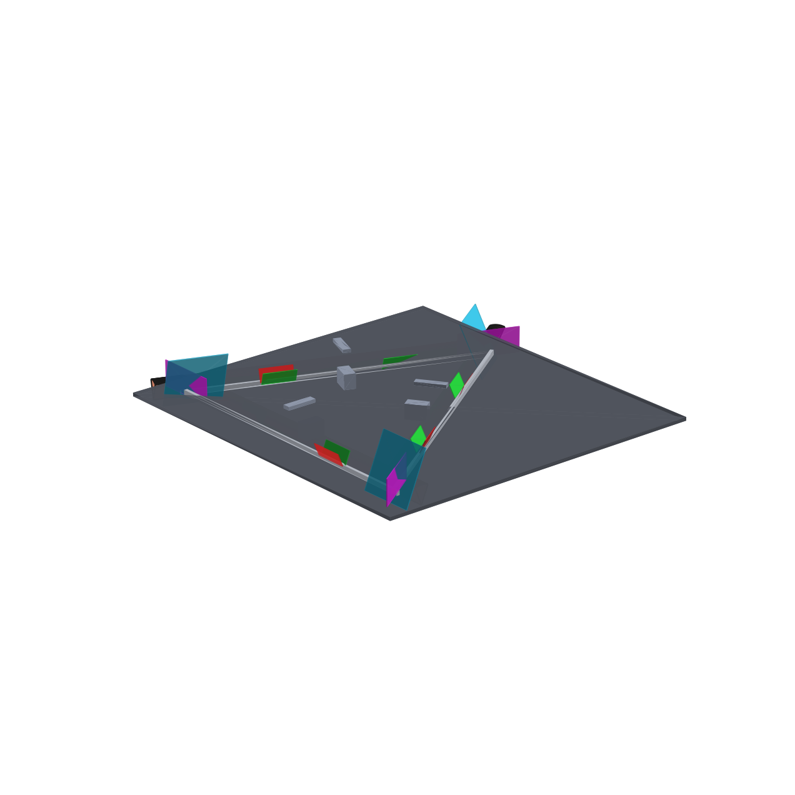

## Long, then flush

The drawing shows the same panel twice: first with all three heads
running long past the fence — the overfit still attached, the
panel already a panel — and then after the flush cut, the heads
sawn down to the fence line, the panel exactly the triangle the
bench describes.

The two states are the chapter's whole teaching. In the first, the
panel is *assembled but not decided*: everything about it is final
except its outside edges, which still carry the slack. In the
second, the slack is gone and the edges are true — true to the
bench, not to a measurement, which is the only truth a panel's
edges can have that its neighbours will agree with.

Notice where the saw is in the drawing: riding the fence, the bar
flat, cutting all three heads on one plane. The cut is a single
motion repeated three times per panel — 3
cuts — and it is the only operation in the whole panel where
accuracy and *finality* meet. Everything before it was reversible;
after it, the panel is committed. The overfit is what bought the
reversibility.

## How much to leave

The overfit's size is a build decision, and the book declares its
own: 6 inches. The number comes from what the
overfit must absorb, and the honest way to size your own is to
count the variation in your own pile.

The overfit must cover: the drift in your splitting, the taper of
your sections, the seating of your butts against the stops, and the
settling of the sticks under the clamps. If the worst stick in
your pile wanders half an inch from the plan's ideal, a half-inch
overfit leaves the good sticks wasting half an inch and the bad
sticks with nothing to spare. So measure the pile, not the plan:
the overfit is set to the *spread* of your stock, plus a margin
for the day you are tired. 6 inches was this
build's spread plus margin; a tighter pile could run less, a
looser one more.

The trade is one-dimensional: more overfit costs wood, less
overfit costs do-overs. The table below prices the wood; the
do-overs price themselves the first time a member arrives at the
head fence already short, which is the one failure the overfit
cannot fix — because the overfit *is* the fix, and a stick cut
short never had any.

## Offcut per dome

The table is the tolerance's bill, and the book prints it the way
it prints every bill: in full, with the units the builder actually
pays in.

Every member sheds its overfit into the offcut pile: the flush
cuts of Chapter 36, one per member,
120 members, adding up to the figure in the table —
board feet of perfectly good wood, cut off and set aside. The
honest note is that the offcut is not waste in the moral sense: it
is blocking, bracing, wedges and firewood, and the method was
sized for it from the start — the tree's spare struts and the
offcut allowance are the same budget, counted in different units.
But it is wood the frame does not stand on, and the table says how
much, because a tolerance that is not priced is a tolerance that
will quietly eat the savings it was bought with.

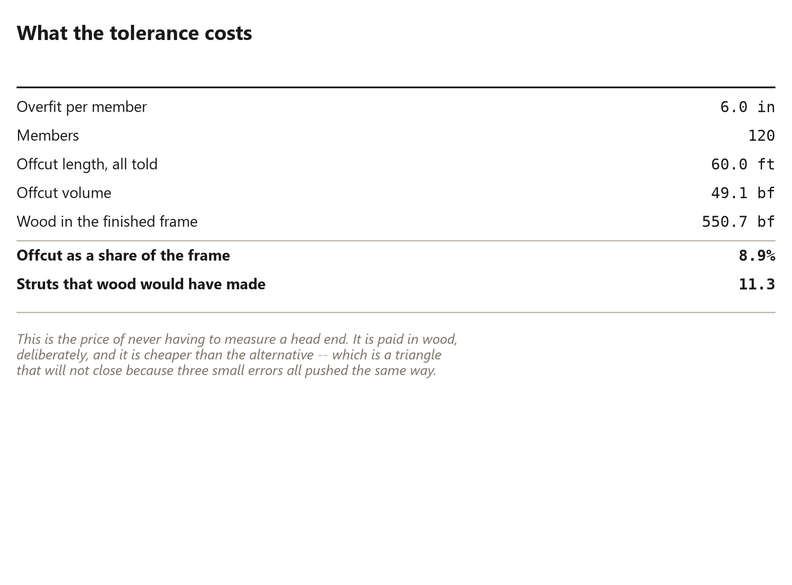

The overfit's ledger closes where the chapter began: cut long,
locate, assemble, flush. 6 inches of slack
per member, a table's worth of offcut per dome, and in exchange —
a frame whose every member is final-cut against the panel it
actually lives in. That is the cheapest accuracy there is, and the
next chapter is the cut that collects it.

---

# 36. Flush-Cutting in Place

*The cut that makes the panel true*

## Flush-Cutting

The flush cut is the final operation on the jig and the moment the
panel becomes itself: the three overfit heads of Chapter
35, sawn off against the fence, in one plane, so
the assembled triangle ends up exactly the triangle the bench
describes.

It is a small cut and the book gives it a chapter anyway, because
the order of operations it completes is the method's entire
tolerance argument, and because the cut is the one place a hurried
builder can undo, in thirty seconds, the half-inch of slack the
whole design paid for. The chapter has two sections: how the cut is
made, and why it cannot be made any earlier — the second being the
reason the first is written at all.

## Against the fence

The procedure, with the saw held the way it has to be held —
against the fence, never freehand.

**The panel stays clamped.** The flush cut is made on the
assembled, screwed, clamped panel — the panel does not come off the
bench for the cut, because the bench is what makes the cut true.
The clamps hold the members against their stops; the saw rides the
fence; the two truths together are the cut.

**The bar rides the plane, flat.** The saw is laid on the fence's
cut plane, bar flat to the bench, and drawn through the three
heads in one motion where the fence allows it. The saw does not
sight anything; it follows the plane the bench already holds,
which is the only way a hand-held saw makes a square cut at all.

**Cut all three heads on the same plane.** The three heads stick
past the fence by different amounts — the panel is a triangle, and
its overfits land where they land — but the *cut line* is one
plane, and all three cuts are made to it. That single plane is the
panel's final edge geometry, and a panel whose three heads were
cut to three planes is a panel whose neighbours will measure the
difference.

**Do not finish the stick, finish the panel.** The temptation at
the saw is to clean each head as it is cut — a shave here, a
touch-up there. Resist it: the flush cut's product is the panel's
truth, not three pretty ends. The offcuts go to the pile, the
panel goes to the stack, and the next panel takes its place. The
cut exists once per panel, not once per stick, and treating it as
a production step is what keeps the run of Chapter
31 at its pace.

## Why this cannot be done first

The order is not arbitrary, and the reason is the whole tolerance
argument in miniature.

The flush cut cannot be made before assembly, because before
assembly there is nothing for the cut to be true *to*. A member cut
to its final length at the split is a member cut against a tape's
idea of where its neighbours will be — and its neighbours, when
they arrive, will be wherever the wood actually is. The panel is
the only object that knows the member's true length, and the panel
only exists after the butts are located, the overlaps screwed and
the clamps closed. So the cut must come last: it is the final
measurement, and the fixture performs it.

It cannot be made *after* the panel leaves the bench, either —
off the jig, the panel's own edges are the only reference the saw
has, and a saw referenced to the thing it is cutting is a saw
cutting in circles. The bench's fence is the fixed truth; the
panel's edges are the variable; and the order that works is the
one where the fixed truth cuts the variable.

So the sequence stands as the book has built it: split long, butt
against the stop, assemble, flush against the fence. Cut long,
locate, assemble, cut true. The flush cut is the last word of the
sentence, and the sentence is the method — every member of every
panel final-cut in place, against the only truth that could know
it.

---

# 37. Panel Drawings

*One flat drawing per distinct panel, full size*

## Panel Drawings

The book's last word on the panel is a drawing, not a paragraph —
one flat, full-size drawing per distinct panel, exported directly
from the simulator, so the drawing on the page and the panel on
the bench are the same object.

The drawings are the check for everything the jig chapters
described. The jig locates members against stops; the drawing is
what the stops were set from. The panels come off the bench; the
drawing is what they are measured against before they are stacked.
And because the drawings export from the same solved model that
produced the cut list and the seam schedule, the whole build has
one source of truth, and it is printed on these pages.

## Panel drawing, type one

The first of the two distinct panels, flat, full size, exactly as
the simulator exports it — the member lengths, the overlaps, the
vertex gap, the seam allowance all in their true positions.


## Panel drawing, type two

The second distinct panel. Between them, the two drawings describe
every one of the frame's 40 panels: the
10 of one type, the 30 of the other,
the counts of Chapter 8.


## Reading a panel drawing

What every line on the drawing is, so the page can be read at the
bench and not only admired.

**The outline** is the panel's finished edge — the triangle the
neighbours will meet, gasket allowance included. **The member
lines inside it** are the three sticks: butts located on sides,
heads running to the fence line, the pinwheel's overlaps shown as
the overlaps they are. **The vertex gap** is the empty corner of
Chapter 15 — drawn, not described, so nobody looks
for a hub there. **The seam allowances** are the half-gasket
insets at every edge, the 0.75-inch key's share of
each side, which is why the outline is slightly inside the
triangle the members describe.

The drawings print full size: exported as vectors, they scale to
the bench without loss, and a printed drawing laid on the jig's
surface should match the jig's stops line for line. That is their
real job — not illustration but *witness*. When a panel comes off
the bench, it is laid on its drawing; when a jig is first set,
the drawing is what the stops are checked against; and when the
frame finally closes, every panel in it has, somewhere in its
history, been held up against one of these two pages and found to
be the thing the pages describe.

The reference part of the book ends here, with the drawings —
because after the drawings there is nothing left to know about
the panel. The next chapters leave the bench and follow the frame
to the ground it stands on.

---

# 38. Where Error Goes

*A tolerance budget for a building made of split logs*

## Where Error Goes

Every chapter so far has mentioned the method's tolerance — the
overfit absorbing a sixteenth, the key absorbing the fold, the
panel owning its edges. This chapter is the budget behind the
mentions: a complete account of where error can land in a frame
built from split logs, which of those places the method absorbs,
and which one it does not.

A building method that cannot say where its error goes is a method
that discovers the answer at raising. This book's method can say
it, because it was designed around the saying: every operation in
the fortnight either sends its error somewhere specific or refuses
to make the cut that would. The chapter walks the four landing
places — stock length, butt angle, seam gap, and the ring — marks
three of them as absorbed and one as accumulating, and ends with
the check that keeps the last one honest. It is the most
structural chapter in the book, in both senses of the word.

## Four places error can land

The complete list, because a tolerance budget that omits a landing
place is a budget with a hole in it.

**Stock length.** The member arrives at the bench longer than it
should be — the split drifted, the bucking was generous, the plan
was optimistic. This is the commonest error in the build and the
cheapest, because the overfit exists for exactly it: the head runs
long, the assembly locates the butt, and the flush cut of Chapter
36 removes the error with the offcut.

**Butt angle.** The compound cut of Chapter 34 lands
a degree off, and the butt no longer sits flat on its neighbour's
face. The error is real but bounded: the butt's job is to present
area to the side, and a butt a degree off still presents nearly
all of it — the screws pull the overlap closed, and the contact
settles into the wood. What the method refuses is the opposite
error: a butt cut *short*, which is why the allowance stays on
until the bench decides.

**Seam gap.** Two panels meet and the gap between them is a
fraction wider or narrower than the key's share — the fold is
right but the wood is itself. The seam absorbs it by design: the
key compresses, the gasket gives, and the 55 seams of
the frame share the difference so no single seam carries it all.
This is the landing place the whole seam system was built for, and
the one the book spent its middle chapters engineering.

**The ring.** The base ring is where the frame meets the ground,
and it is the one landing place that does not give. A sixteenth of
error in the ring is a sixteenth of error in the circle the whole
dome stands on, and the dome cannot compress its way out of a
wrong foundation. The ring is the subject of the last section,
because it is the budget's one honest failure point.

## Three of them are absorbed

Why three of the four land safely, and what "absorbed" actually
means in wood.

An absorbed error is one that leaves the build as something else:
offcut, compression, distribution. The stock-length error leaves as
the flush cut's offcut — Chapter 35 priced it, and
the price is the board feet in its table. The butt-angle error
leaves as contact: the overlap's screw row pulls the butt into the
wood until the bearing is full, and a degree of bevel error
becomes a fraction of an inch of settlement that the frame never
sees again. The seam error leaves as compression: the key takes
up the difference, the gasket breathes it, and the dome closes
with the error spread invisibly across 55 joints.

The three share one property: each is absorbed at the *place it
was made*, by the design of that place, without travelling. The
stock error never leaves the bench. The butt error never leaves
the joint. The seam error never leaves the seam. That locality is
the whole secret — an error that dies where it is born cannot
compound with its neighbours, and a frame built from rough wood
needs exactly that: forty small absorpions instead of one long
accumulation.

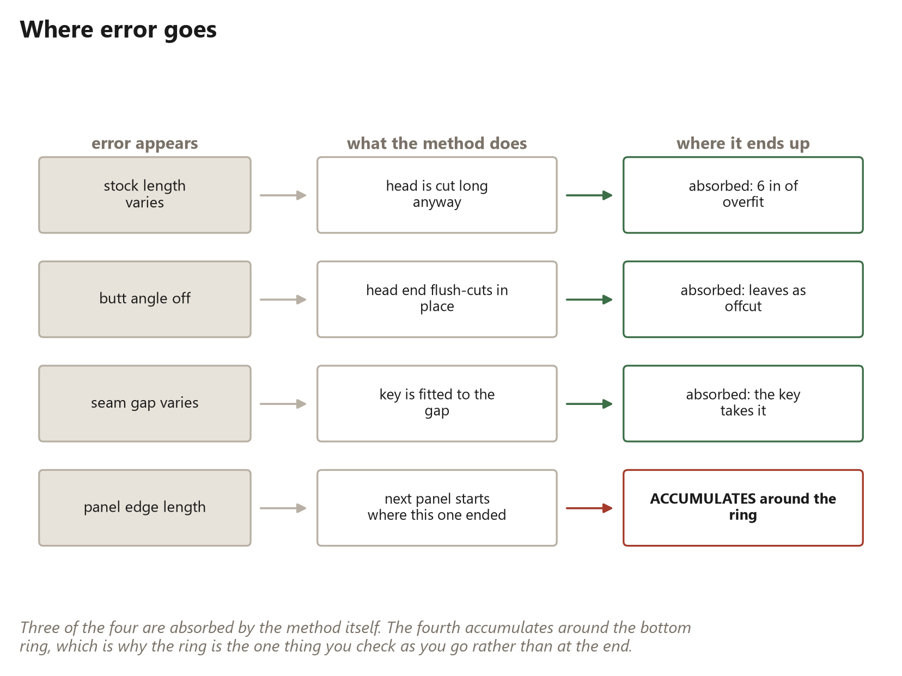

## The tolerance budget

The drawing is the budget as a flow: error enters at the four
places, three of them send it sideways into absorption — the
offcut pile, the bearing, the gasket — and one of them, the ring,
passes it on.

Read the arrows as the method's real structure, because they are.
Every chapter of the build is somewhere on this drawing: the
overfit is the stock-length arrow, the screw row is the butt
arrow, the key is the seam arrow, and the ring is the arrow with
no exit. A builder who has internalised the drawing stops fearing
the ordinary errors of rough timber — they are budgeted — and
starts fearing only the one the drawing marks in the colour of
warning.

## The one that accumulates

The ring, named and checked, because it is the budget's single
honest failure point.

The base ring's error does not absorb; it *accumulates*. The ring
is a closed circle of 10 panels, and an error
anywhere in it is an error everywhere: the dome above it rises
from whatever circle the ring actually is, and every course
multiplies the ring's truth by the frame's own height. A ring set
a half inch out of round is a dome that leans a half inch at the
base and more at the crown — the one error in the method that
grows as the building does.

So the ring is where the book's checking discipline concentrates.
The check is simple and it is done three times: when the ring is
first set, measure across every opposite pair of its
10 sides — the numbers must agree within the
gasket's give, and any pair that does not is the ring telling you
where it is wrong while the fix is still a shim. When the first
course closes, measure the ring again — the courses above have
already begun leaning on it, and a ring that moved has moved the
whole frame's opinion of round. And before the top closes, once
more, from outside: the dome's last chance to be told, cheaply,
what the raising is about to make permanent.

The ring's honesty is the book's last word on tolerance. The
method forgives stock, forgives butts, forgives seams — and it
never forgave the ring, because the ring is the one place where
forgiveness would have to come from the ground. Chapter
39 gives the ring its footing; this
chapter gave it its warning. Build accordingly.

---

# 39. The Footing and the Ring

*What the dome stands on*

## The Footing

The frame is up — hanging, in this book's build, between the trees
— and the question of what it stands on, if it ever stands, is the
one the fortnight deliberately left open: the ground work comes
last, and it may never come at all. This chapter is the footing for
the day it does — the part of the building under everything, the
part the photographs never show, and the part where the book's own
warning from Chapter 38 is most literally true:
the ring's error accumulates, and the footing is the ring's floor.

A dome's weight arrives at the ground along one circle — the base
ring's 10 edges, ten points where the panels meet
the earth. The footing's whole job is to receive that circle and
hold it: level, round, and against the wind that wants to lift the
whole thing away. The chapter covers the two ways to do it, the
layout that keeps the circle true, the uplift a dome invites, and
the point where the book stops and the engineer starts.

## Ten points, or one ring

Two approaches carry a dome's weight to the ground, and the book
recommends one of them for its own build while pricing both.

**Ten points.** Each of the ring's ten base vertices sits on its
own small footing — a pad block, a pier, a driven post — and the
frame bridges between them. It is the cheapest material answer, it
works where the ground is firm and level, and it leaves the middle
of the circle empty — no concrete where nothing stands. Its cost is
precision: ten separate points must land in one plane and one
circle, or the ring that spans them comes out twisted, and Chapter
38 has already explained what a twisted ring
does to everything above it.

**One ring.** A continuous footing under the whole base ring — a
ring beam of concrete, or a wooden ring on blocks — receives the
dome's weight as one circle and spreads it as one circle. It costs
more material than ten points, and it is *forgiving* in exactly the
way ten points are not: the ring beam carries the frame's local
imperfections around the circle instead of exposing them at every
vertex. The book's own build stands on the continuous answer,
because the build's error budget — the chapter just spent on it —
is worth more than the concrete it saves.

The honest note, kept from the dome books that skip it: a dome
puts its whole weight on the *outside* of its circle. Pouring a
slab across the middle is concrete nothing stands on — the centre
of the floor carries no frame load at all, and the money it costs
is money the ring beam could have used.

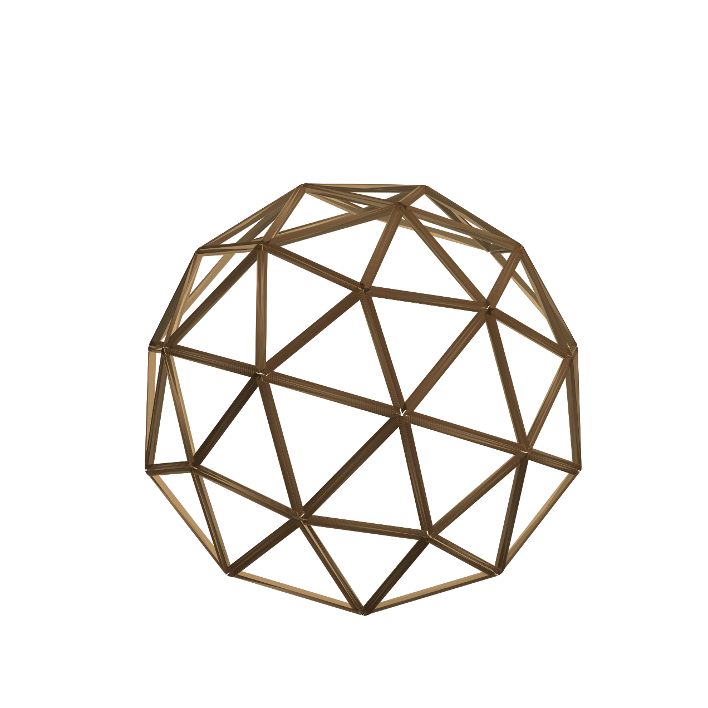

Chapter 64
prices the two properly when the dome graduates to a permanent
pad; here the rule is only: foot the circle, not the disc.

## Setting out a circle accurately

The layout, because the footing's truth is the ring's truth, and
the ring's truth is the whole frame's.

**One stake, one string.** The dome's centre goes in first: a
stake driven where the middle of the floor will be, and it never
moves again for the rest of the build — every measurement of the
footing, the ring and the raising is taken from it. Then a string
the length of the dome's radius, a loop at each end, and the
circle is drawn the way circles have been drawn since before
anybody wrote this down: walk the string around the stake, marking
as you go.

**Set the ten points from the circle.** The ring's ten base
vertices sit on the circle at equal spacing, found by stepping a
second string — the chord between neighbouring vertices — around
the circumference and adjusting until the last step lands exactly
on the first. The step-and-adjust is the check: a ten-point layout
that closes on itself with the last step is round; one that misses
its starting mark by an inch is telling you where the circle
isn't.

**Check the circle before anything is poured.** Measure across
every opposite pair of points — the diameters — and demand they
agree. Then check the level of the ten points against a water
level or a laser, and shim until they share one plane. The checks
are the chapter's whole discipline: a footing that is round and
level on the day it is made is the only thing in this part of the
build that cannot be fixed later, so it is checked the way things
that cannot be fixed later are checked — twice, from different
directions, before the concrete is mixed.

## Anchoring against uplift

The sentence the footing chapter must say plainly, because the
shape itself refuses to let it be skipped: **a dome is a wing.**

A hemisphere is a lifting body. Wind over the crown does to the
dome what it does to an aircraft: pressure drops on the curved top,
and the whole building feels a pull toward the sky. The frame's
own weight resists — green pine is heavy, and the skin chapters
add their share — but a dome that is only *sitting* on its footing
is a dome the right wind can pick up by the brim, and the stories
of domes that went rolling are not folklore. The footing's job is
therefore two jobs: hold the weight *down*, and hold the building
*down against the wind*.

The anchor is the ring's connection to the ground, and it is not
optional. Every base vertex — or the ring beam at intervals —
needs a mechanical tie into the footing: a cast-in anchor, a
bracket, a strap over the ring member. The tie's job is uplift,
not weight, and it is sized for the worst wind the site's records
hold, which is exactly the calculation the last section of this
chapter hands to somebody else. The book's own build used straps
at every base point, and the straps are the one part of the
footing the book will not let a reader improvise.

## This is where to ask somebody

The safety page, and it is shorter than the chapter because the
book's rule from the front matter simply applies here with full
force.

Footings are load and soil, and neither is a matter of carpentry.
The dome's weight, the wind's uplift, the ground's bearing
capacity, the frost line, the drainage — every one of them is a
site-specific number that belongs to someone who can read the site
and the code together. This book tells you the *shape* of the
footing — a circle, not a disc; anchored, not sitting; checked,
not assumed. It does not tell you how deep, how wide, or how much
steel, because those answers come from your ground, not from a
book that has never seen it.

The division of labour is the one Chapter 10 drew for
loads, applied to the earth: the geometry is the book's, the
engineering is the engineer's, and the boundary between them is a
page you cannot miss. Build the circle the book describes. Have
the circle's ground signed off by someone who can. Then, and only
then, stand the frame on it.

And remember the order the title page promised: the hanging cabin
never owed this chapter anything. The foundation is the last
decision of the build, made when the cabin finally comes down from
the trees — and the chapters that follow this one are the reason
the decision could wait.

---

# 40. Closing the Shell

*Forty triangles of something over forty triangles of nothing*

## Closing the Shell

The standing frame is a skeleton, and this chapter is its skin:
40 triangles of something, over 40
triangles of nothing, each panel closed so the weather stays on
the outside.

The options are few and the book ranks them the way it ranks
everything — by cost and behaviour, computed, not by feel. Sheet
goods dominate, because they are cheap, local and flat, and the
chapter's first two sections are the craft of cutting forty
triangles out of rectangles without wasting half the stack. The
table prices the whole skin in sheets. The last section runs the
alternatives — fabric, shingle, living roof — because each one
exists for a reason and each one asks the frame for something
different, and the builder who knows all four picks the right one
instead of the first one.

## Sheathing a triangle

The craft problem the rectangle-building world never has: every
panel of a dome is a triangle, and sheet goods come in rectangles.

The answer is the panel drawing, again. Chapter
37 printed the two panel shapes flat and full
size; the sheathing job is those shapes, cut in sheet, one per
panel, with the seam allowance carried around the edge. The
procedure that keeps the waste honest:

**One template, not forty measurements.** Trace each panel shape
once onto scrap, cut it, and use it as the pattern for its whole
class — the 10 of one shape, the 30 of
the other. The template is the sheathing's jig: the shape made
physical, so the saw never re-derives an angle it already cut
correctly once.

**Cut inside the line, then trim to fit.** Sheet cut to the
template's outside is always slightly big; sheet cut inside it can
be trimmed with a knife in place. The panel gets its skin offered
up, marked against its own frame, and trimmed to the frame's
actual edges — locate first, cut second, the same maxim the jig
chapters ran, applied to skin.

**Seam allowance stays outside the panel.** The skin's edge
belongs to the *seam*, not to the panel: the gasket's share, the
flashings, the overlap of the next panel's skin — all of it lives
beyond the frame's own edge, and a skin cut flush to the frame is
a skin that leaves the seam naked. Cut generous, trim at the seam,
and the 55 seams get the overlap the weather chapter
demands.

**Screw to the frame, not through it.** The skin fastens into the
members' faces — the wide flat of the wedge — at the spacing the
sheet's own spec asks. The skin is not structural; it is the
panel's face, and its screws' only job is to keep it flat against
the frame while the seams do the weather work.

## Nesting the cuts

The second craft problem, and it is pure geometry: how to fit two
triangles into one rectangle.

The two panel shapes of the dome, paired point-to-point along
their long sides, nest inside a standard sheet with the waste
reduced to two thin edge strips — the arrangement the table below
assumes. The nesting works because the panels were *not* sized to
the sheet and the sheet was not sized to the panels; they meet in
the middle, and the meeting wastes less than either feared.

The honest limit, stated because the film that discovered it made
a point of it: this dome's panels do not fit a standard sheet
*singly* — one panel is wider than half a sheet, so the naive
layout of one-panel-per-sheet wastes nearly half the stack. The
nested pair is the fix, and it is why the chapter treats the two
shapes as a pair rather than as forty separate cuts. Where the
nesting does not reach — the odd counts, the rim panels with
their different edge — the waste goes to the offcut pile and the
pile goes to blocking, the same honest destination as every other
offcut in the book.

## Sheet count

The table is the skin's bill: shell area and sheets, computed
from the solved geometry, not estimated from the drawing.

The numbers are the answer to the question the chapter opened —
what it costs, in sheets, to close 40 triangles. The
area is the dome's own surface, the sheet count is the nested
layout's requirement, and the difference between the two is the
waste the nesting section promised to keep honest. The figure is
worth reading twice, because it is the first number in the book
that is *bought* rather than *cut* — everything until now came out
of the trees, and the skin is where the fortnight's ledger first
touches a lumberyard.

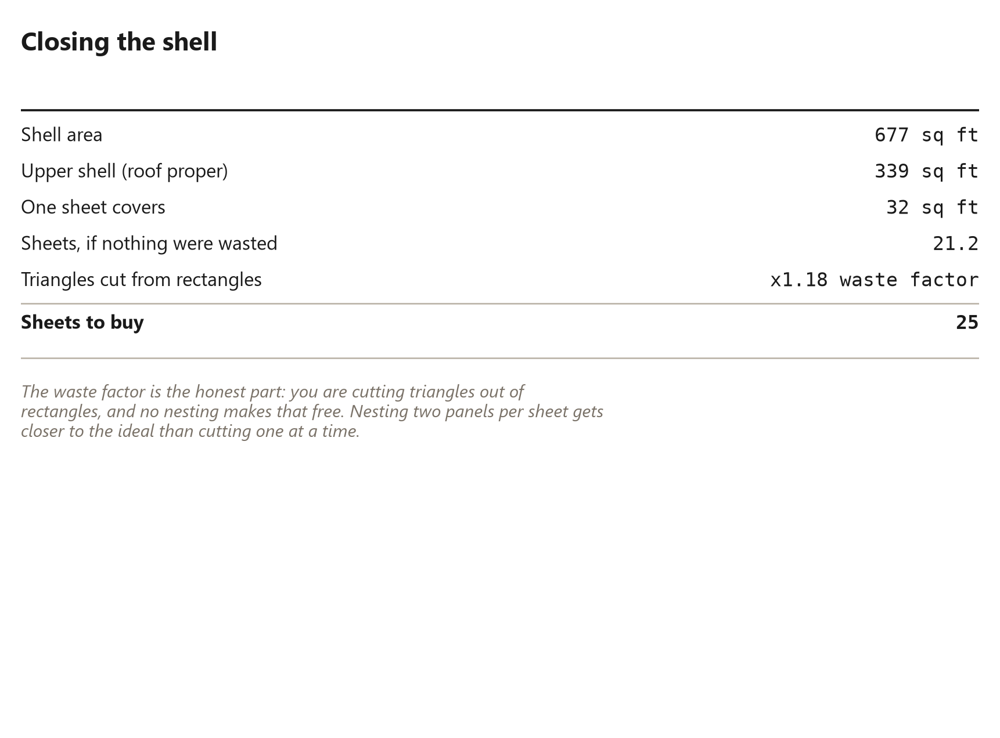

## The alternatives

Sheet goods are the default, not the only answer. The other three
exist for other builds.

**Fabric.** A membrane skin — canvas, shade cloth, the soft
shells of Chapter 69 — closes the frame for the
price of cloth and rope, sheds rain where the seams are taped, and
gives up insulation and years. It is the right skin for a
seasonal dome, a greenhouse's first year, or a frame that is
still deciding; it is the wrong skin for a home, and the book
says so rather than romancing the tent.

**Shingle.** Shingling a compound surface is slow, and it works —
each shingle is small enough to follow the curve, the overlaps
shed water the way the frame's ridges want, and the result is the
most repairable roof there is: one shingle at a time, forever.
The cost is the labour, which is why shingle is the upgrade for
the dome that has already earned its place, not the first skin it
wears.

**Living roof.** Soil and plants over a waterproof layer, the
heaviest and coolest of the four, and the one that asks the most
of the frame: the chapters on load have already said who decides
whether the members carry it. It is listed because it is real and
because somebody always asks; it is not recommended for the first
build, and the reason is the engineer's sentence, not the
gardener's.

The chapter closes where the shell does: the frame is covered,
the seams are taped, and the dome is a *room* in the only sense
that matters outdoors — it keeps weather on its outside. The next
chapter cuts the holes that make it usable, and the chapter after
that is the one that decides whether the shell's honesty holds up
to the weather it was built for.

---

# 41. Doors, Windows and the Rim

*Cutting holes in something that works by being closed*

## Doors and Windows

Every building needs holes, and a dome is the building that resents
them most: its strength is its closure, its panels are its
structure, and a hole cut wrong does not just let the weather in —
it un-triangulates the frame at the exact place the frame was
leaning on itself.

So this chapter is the craft of opening a dome without breaking
it. The principle, stated once and used throughout, is the one the
wedge book's own chapter taught: **an opening is a panel you did
not close** — take a whole panel out and the frame loses nothing
structural, because the panel was always its own independent unit.
Cut *into* a panel, and the triangle stops being a triangle, and
the load that was travelling through it now has nowhere to go. The
chapter runs the openings in order of mercy: the door at the rim,
the window in a panel, the risers that cheat height — and the
drawing that shows all three without a single un-triangulated
triangle.

## A door at the rim

The easy case, and the book says so plainly: the door belongs at
the rim, because the rim is the one place a hole costs the frame
nothing.

The base ring's 10 edges join nothing — Chapter
8 separated them
from the seams for exactly this reason. Leave one rim panel out
entirely, and the gap is a doorway: the panels on either side are
complete, their seams close as they always did, and the dome loses
a panel that was never structural in the way the crown panels are.
The door is framed the way the missing panel was framed — two
jambs running the panel's full height, a header across its top
edge — and the frame's own triangle does the lintel's work,
because the triangle above the door is still a triangle.

The one requirement is the header's honesty: the panels above the
door lean their weight down through the ring, and the opening
interrupts the ring. The header takes that interruption — a beam
across the top of the opening, tied to the jambs, carrying the
ring's continuity across the gap. In a full-height rim door this
header is small, because the ring is low and the loads above it
are modest; in a taller opening the engineer's sentence from
Chapter 10 reappears, and rightly. The rule for the
chapter: take the whole panel, frame the gap, header the ring.

## A window in a panel

The harder case, and the craft is keeping the triangle a triangle.

A window wants light where the wall leans — mid-panel, high on
the dome — and a hole in the middle of a triangle is exactly what
the frame's logic forbids: the triangle's load runs around its
edges, and a hole in its middle interrupts the members that were
carrying it. So the window is not cut into a panel; it *replaces*
part of a panel, and the part it replaces is re-triangulated
around the hole.

The procedure is the panel's own logic, applied smaller: frame
the window opening inside the panel with members that run from
the window's corners to the panel's edges — a smaller triangle
above the window, two beside it, one below — so every region of
the panel is still triangulated, and the panel's loads still
travel along members, now detouring around the glass. The window
unit itself is fixed into its own sub-frame, flashed to the
panel's skin, and the panel remains one independently-built,
independently-lifted thing — the property Chapter
18 paid for, spent here on daylight.

The honest cost, said aloud: a windowed panel is a panel built
twice — once as the triangle, again as the triangle-with-a-hole
— and its member count rises accordingly. That is why the
windows go high and few, where the glazing earns its keep in a
leaning wall and the view, rather than everywhere the floor
plan's habit would put them.

## Three openings that work

The drawing collects the chapter: the rim door, the windowed
panel, and the risers option of the next section — three ways to
open the dome, each one keeping the frame's triangulation intact.

Read the drawing against the rule it illustrates. The door takes
a whole panel and frames the gap; the window sub-frames inside a
panel and re-triangulates around the glass; the risers lift the
whole shell and put the openings in a *straight* wall, where
doors and windows stop being dome problems at all. Three openings,
three strategies, one invariant — no hole ever interrupts a load
path without a smaller triangle being drawn around it.

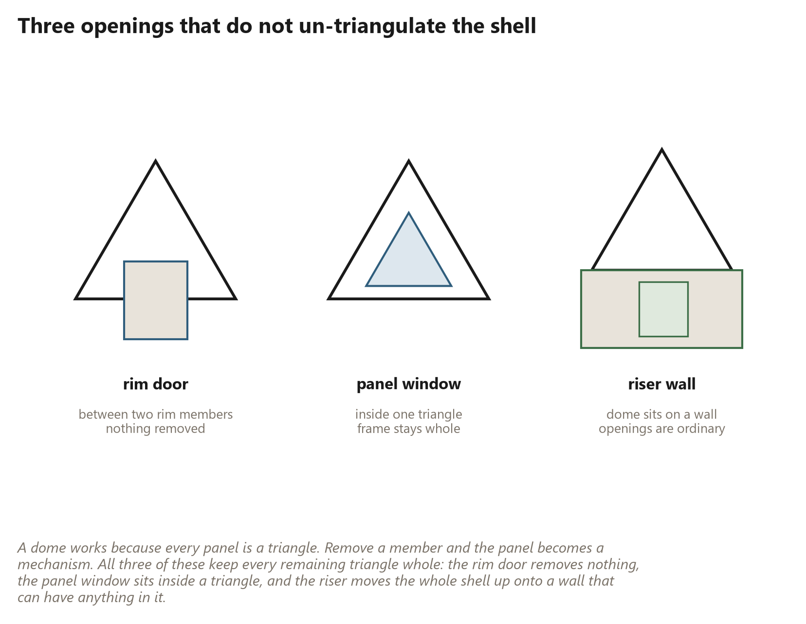

## Risers: cheating height at the rim

The third strategy is not an opening but an avoidance: raise the
whole dome onto a short vertical wall — a riser, a knee wall, a
stem wall — and the openings stop fighting the curve.

A riser is a straight cylinder of wall under the hemisphere's
brim: knee-high for a shed door, waist-high for furniture to
lean against, full-height where the building wants ordinary
windows and an ordinary door. The dome above it is unchanged —
the same frame, the same panels, the same seam schedule — and the
wall below it is ordinary stud framing, which is the entire
point: the expensive part of the building keeps its shape, and
the parts that want rectangles get rectangles.

What the riser costs is the ring beam's reappearance: the dome's
base ring now sits on a wall instead of on the ground, the wall
needs a top plate to receive it, and the wall's own top must be
as round as the ring it carries — the same layout discipline as
Chapter 39, moved up one storey.
What it buys, Chapter 57 prices in full: usable
floor at the edge, headroom where the dome's wall leans hardest,
and the cheapest square footage in the building, bought by the
foot of wall height.

The book's order of operations closes the chapter: frame, shell,
then openings — and if the openings want a straight wall, the
riser is the answer, because it is cheaper to lift a whole dome
than to argue with forty curved triangles one window at a time.

---

# 42. Weather and Water

*Where it leaks, and where the water goes*

## Weather and Water

The honest chapter about domes and rain, because the dome's
reputation was made by this subject and the subject deserves the
book's full discipline.

The title page inverted the usual order on purpose: the frame is
the part you are allowed to get wrong, and the skin is not — a
frame out of line stands for fifty years, and a skin that leaks one
winter takes the frame with it. This chapter is the skin's side of
that bargain, and it is the reason the book treats the seams here
with more care than anywhere else.

Here is the fact the frame chapters have been circling: a dome's
roof is one surface made of 40 flat panels meeting
at 55 interior seams, and every seam is a place water
can get in. A rectangle concentrates its roof's risk in two
valleys and a ridge; the dome spreads the same risk across
55 lines. The answer is not fifty-five seals; it is
the two principles this chapter teaches — shed, don't seal; and
where water must be managed, manage it deliberately, at the rim.
The chapter closes with the inside face, because the dome that
survives the rain outside can still be ruined by the water its own
breathing makes inside, and the book says that before the reader
discovers it in month three.

## Every seam is a potential leak

Say the number, because the number is the strategy:
55 seams. Fifty-five lines on the outside of the
building where two panels meet, fifty-five keys, fifty-five
weather details — and the honest way to think about them is not
"one roof" but "55 small roofs, all meeting".

The frame chapters already did the structural half of each seam:
the key locates the geometry, the gasket takes the tolerance.
The weather half is a different question, and it is the one that
decides whether the building lasts. A seam that fits is not
automatically a seam that sheds — water moves downhill, and a
seam's fit matters only where the water actually runs. The
dome's seams run in two families: the steep ones near the crown,
where water moves fast and the seam's own slope carries it away,
and the shallow ones near the rim, where water lingers, pools in
the key's shadow, and waits for a gap. The strategy follows the
slope: the crown seams need alignment, the rim seams need
*weathering* — a drip edge, an overlap, a path that takes the
water off the seam before it can sit on it.

The count is the discipline. A builder who treats
55 seams as one repeated detail does the same
detail wrong 55 times; a builder who separates them
into the two families the geometry gives — the steep and the
shallow — has two details to perfect and a schedule to repeat
them by. Chapter 16 is the schedule. This chapter is
the weather it has to survive.

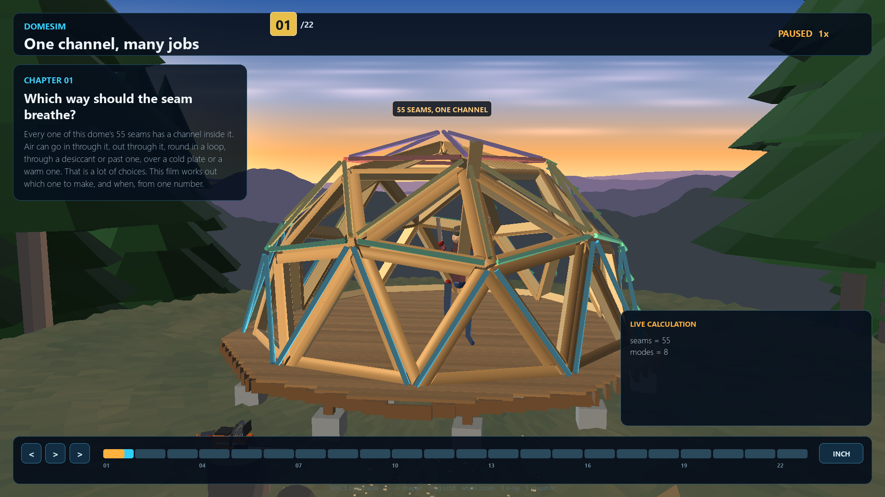

## Shedding, not sealing

The principle that actually works on a compound surface, and the
reason "waterproof" is the wrong word for what this book builds.

A sealed surface tries to stop water at the membrane — one
barrier, perfect, everywhere. Sealing fails on a dome because a
dome moves: the frame dries, the panels settle, the seams open
and close with the seasons, and a seal that was perfect in July
is a cracked line by January. The answer the roof-building world
already knows — and shinglers have known for centuries — is to
stop trying to hold the water back and instead *hand it
downhill*: every surface overlaps the one below it, every seam
wears a shingle, and the water is always on top of the roof,
never inside it.

So the dome is weathered as 55 little roofs, each
seam flashed like a valley: the upper panel's skin laps over the
lower's, the key is protected rather than depended on, and the
seam's own slope is the drainage. The skin chapters supplied the
panels; this chapter supplies the lapping order; and the result
is the honest claim the book makes about weather: not "the dome
never leaks" — no roof can promise that — but "where water
reaches the seam, the seam hands it down, and the lowest seam
hands it off the rim". Shedding is a path, not a promise, and
paths can be walked, checked and repaired — which seals, once
breached, cannot.

## Harvesting it instead

The one place the shape helps with water, and it is not small:
a dome is a very good rain collector.

Every drop that lands on the shell runs down the panels to the
brim, and the brim is a circle — one continuous gutter, already
built, waiting only for the collection the next chapter's
hardware provides. Chapter 58 computes the annual
catch: the footprint, the local rainfall, a declared efficiency,
and the answer comes out in thousands of gallons a year off a
building this size. The dome does not merely *tolerate* rain; it
gathers it, and the gathering is free — the roof was already a
gutter, the shape was already a funnel, and the only purchase is
the tank.

The honest note, kept from the films that made this point: the
catch is not drinking water without treatment. The filter makes
it clear; the lamp makes it safe; neither does the other's job —
and the book's water system, when Chapter
44 reaches it, is a
first-flush diverter and a UV lamp downstream of the tank, not a
rain barrel and optimism. For everything else — irrigation,
flushing, washing, the buffer against a dry well — the catch is
as good as the roof, and the roof is the dome's.

## Condensation and the inside face

The last section is the problem people discover in month three,
and it is worth a whole section because it is not rain.

A dome is warm inside and cold outside, and the meeting of the
two happens *inside the skin*: moist room air reaches a cold
surface, the water condenses, and the builder who sealed every
outside seam perfectly wakes up to water running down the inside
of the shell. The seams were not the leak. The air was.

The answer is the seam channel, and it is the reason the later
chapters of this book engineer it deliberately rather than
sealing it away: the cavity between the frame's wedges is the
one continuous void that connects the whole shell, and it is
exactly where condensation belongs — collected, drained at the
rim, vented at the crown. The full climate system — the dew
points, the levels, the drawer, the plate — is Chapters
81 and 82, and they are the book's
real answer to the inside face. Here the principle is enough:
**never seal the inside face against the air; give the water a
path, and drain it at the rim.** The dome that leaks from rain
failed its seams. The dome that leaks from condensation was
built by someone who thought the inside face was not part of
the weather.

The chapter ends where every weather chapter should: outside,
shed; inside, drain; at the rim, catch. The dome is not a box,
and its water is not a nuisance to be sealed away — it is a
flow to be directed, and the direction is downhill, through
55 honest seams, off the brim, into the tank.

---

# 43. Inside a Round Room

*Living with curves*

## Inside a Round Room

This is the chapter about living in the thing, written the way the
rest of the book is written: the numbers first, the compromises
named, and the romance earned rather than assumed.

A round room is not a rectangular room with curved wallpaper. It
changes where you can stand, how furniture fits, how sound
behaves, and where the light falls — and the changes are
measurable. This chapter measures them: the honest floor, the
standing-height map, the furniture problem and its real
solutions, and the acoustic quirk a hemisphere brings for free.
It is the chapter to read *before* building, because the fixes it
describes are layout decisions that cost nothing on paper and a
renovation once the walls are up.

## Where the usable floor really is

The honest number, because the floor a dome advertises and the
floor a person can use are different things.

The dome's plan area — 365 square feet for this
build — counts the whole circle. But the shell meets the floor at
a tangent: the wall leans inward from the rim, and the last ring
of floor around the edge has almost no headroom over it. The
usable floor is the smaller circle where the ceiling is over
your head, and the difference between the two numbers is the
dome's real estate tax — floor you paid for, in frame and skin,
that only a dog can use.

The map on the next page draws the honest version: the full
circle, the standing-height contour inside it, and the dead ring
between. The dead ring is not waste in the moral sense — it is
where low storage, benches and beds belong, the furniture that
does not need to stand up — but it is real, and the chapter
states it because the alternative is the surprise every dome
builder watches a visitor have: they step in, they look up, and
they say the roof is lower than the picture suggested. The
picture suggested the plan area. The roof was always the
geometry.

The fix the book already spent a chapter on is the riser of
Chapter 57: lift the shell a few feet and the
tangent moves outward, the dead ring shrinks, and the floor
becomes genuinely usable to the wall. The round-room chapter
recommends it for exactly this reason — not for looks, but
because the standing-height map improves more per dollar than
anything else in the whole fit-out.

## Standing height, mapped

The map is the chapter's central object: a plan of the
365-square-foot floor, coloured by headroom,
with the standing-height contour drawn where the ceiling passes
head height.

Read the map as a furniture plan before it is a chart. The
central disc is the room: full height, 10.8 feet at
the crown, the space where a person stands, works, cooks. The
ring between the contour and the rim is the compromise zone:
overhead clearance shrinking smoothly to nothing at the wall,
exactly the profile a bed, a bench, a desk-with-a-view or a row
of shelves wants. And the rim itself is the dead zone the
previous section named — reachable, useful, not standable.

The map also settles the oldest argument in dome living: where
the bed goes. The answer is where the map says — in the ring,
head toward the wall, because the only dimension a sleeping
person needs at the wall is the one the dome has plenty of:
length. The furniture section follows the same logic for
everything else.

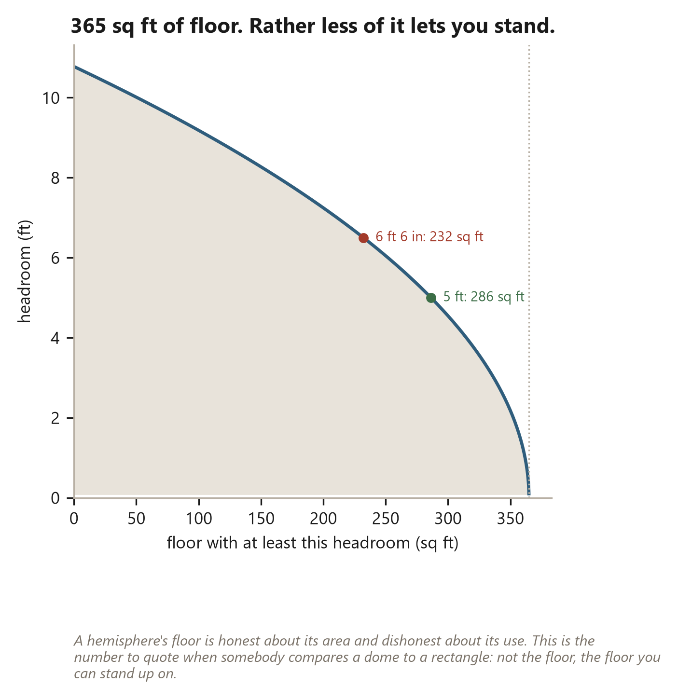

## Furniture, storage and the wall that curves away

The practical answers, including the ones that are honestly just
compromises, because a chapter that only offers custom joinery
is writing for a budget this book does not assume.

**The curve costs a wedge of dead air.** Any straight-backed
piece against a curved wall leaves a tapering gap behind it —
the round-room tax of Chapter 11, paid here in
inches. The cheap answers: pull furniture off the wall entirely
and let the gap be a cable run and a shadow line; angle the
piece so one edge touches and the gap opens somewhere
unreachable; or accept the gap and fill it with the things that
are soft. The honest answer for the pieces that matter is
built-in storage on the curve — the one place custom work pays
for itself, because it converts the dead ring into drawers.

**Low is the ring's whole vocabulary.** Beds, benches, window
seats, shoe racks, the wood stove's hearth — everything that
does not need headroom lives in the ring, and the centre of the
room stays open, which is how a round room ends up feeling
larger than its number: the walls are furnished, the middle is
air.

**The middle wants to be the table.** A round room's centre is
its tallest, brightest, most reachable point, and the instinct
to put the table there is the geometry's instinct, not a style
choice. Everything radiates from it; every path through the
room crosses it; and the light from the crown falls exactly on
it. Furnish the ring, leave the centre, put the table in the
middle — the round room's layout writes itself once the map is
accepted.

## Acoustics, and the whispering problem

The last section is the quirk nobody expects and everybody
notices in the first week: a hemisphere focuses sound.

A dome is half of a whispering gallery. Sound from one side of
the room runs up the curved wall and comes back down at the
centre — the geometry that lets a whisper cross a cathedral —
and in a house-sized dome the effect is not magical, it is
*tiring*: conversation pools at the middle of the room, a
kitchen tap at the rim is audible everywhere, and the building
has no quiet corner, because corners are where quiet lives and
the dome has none.

The fixes are the same ones theatres use, scaled down. Soft
surfaces break the focus: the quilted layers of Chapter
59 do double duty as acoustic treatment, rugs
and fabric kill the floor's reflection, and the furniture in the
ring breaks up the wall's curve the way baffles do. The one
thing not to do is nothing — an empty dome is an echo chamber,
and the echo arrives before the furniture does.

The chapter closes with the round room's honest summary: a
floor that is smaller than its number, a wall that leans, a
centre that rings — and a room that, furnished the way the map
dictates, is the calmest, most enveloping space most people
will ever sleep in. The curves are not the problem. The curves
are the room, and this chapter is the manual for living inside
them.

---

# 44. Heat, Power and the Small Systems

*Making a shell into somewhere you can be in February*

## The Small Systems

A shell keeps weather out. Somewhere you can be in February needs
the small systems: insulation in the walls, power in the dark,
heat in the cold, and a decision about the grid. This chapter is
those systems, at the scale the book's method implies — small,
deferrable, and run through the same voids the frame was built
around.

The dome's gift to its systems is the wedge frame itself: the
cavity between the members, the channel of the seams, the column
of the centre. The systems ride in those voids instead of
requiring a stud wall's worth of drilling, and the chapter's
sections follow the voids: insulation between the wedges,
services in the seam channel, heat in the round volume, and the
grid decision stated without romance. The chapter closes the
home-making half of the book; after it, the dome is a house.

## Insulating between wedges

The frame's wedges are 5.00 inches deep, and the
depth is a cavity: between the skin outside and the inside face
lies the whole thickness of the member, interrupted by nothing —
no studs, no plates, no bays that were not drawn in from the
start. Insulation goes in that cavity, and the shape does the
rest.

The options are the ladder of Chapter 59,
rung by rung: nothing first, then the quilted layers, each one
a size up, each winter warmer than the last. The book's own
preference is the quilt — layers of recycled clothing, sewn by
the network of Chapter 60 — because it is the
one insulation that matches the frame's own economy: it fits the
cavity loosely, it comes off in order, and it costs what a
sewing machine costs. Rigid board fits too, cut to the panels'
triangles and pressed into the cavity; it insulates better per
inch and gives up the removability the quilt was designed for.
Either way the principle is the cavity's: **insulate the space
between the members, never in front of them** — the members are
the frame's structure and its look, and burying them under a
blanket of foam throws away the only thing the building's walls
ever had to say.

The one rule the chapter will not soften is the moisture rule
from Chapter 42: insulation without a path
for vapour is a rot factory. The cavity must breathe toward the
seam channel, and the seam channel drains at the rim — the
system Chapters 81 and 82 engineer
in full. Insulate the dome as a living shell, not as a sealed
box, and it gets warmer every winter instead of wetter.

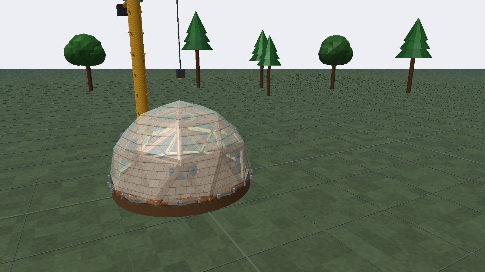

## Running services in a frame with no studs

A conventional wall hides its wires and pipes in the stud bays.
A wedge frame has no stud bays — and it does not need them,
because the seam channel is the chase, and it runs everywhere.

The seams of Chapter 81 are the building's
service corridor: a continuous void between the panels that
follows the frame from rim to crown, wide enough for cable,
small pipe and the sensor wiring the later chapters assume.
The rules from the channel chapter bind here: water and wire
fit, a round duct does not, no pressure fitting inside a seam,
and the cable-in-chase question is the inspector's call, asked
before the skin closes over it. Power runs from the utility
column — the centre, where the core of Chapter 78
lives — outward along the seams to the points of use, and the
dome's own geometry makes the routing obvious: centre to rim,
like the spokes it is.

The discipline the chapter adds is the *deferral* discipline,
borrowed from the stem-cell chapters and stated once here: run
the services where the building will never be cut open again —
the channel, the column, the chase — and leave the end
connections surface-mounted, where a change of mind is a
screwdriver, not a renovation. Threaded inserts in the wedge
faces, set at panel time, are the cheap version of the same
promise: the services bolt on, they unbolt, and the frame never
learns their names. The building that can change its mind — Chapter
62 is the argument in full — is the building whose services were run
as if change were coming, because it always is.

## Heating a round volume

Why a dome is easier to heat than a rectangle, and the one way
it is not, stated together because both are true.

The easy half is geometry: the dome has less skin per floor
than a box — Chapter 56 computed the margin — and
heat loss is a skin phenomenon. Less skin, less loss, less
heat to buy; and the round volume mixes itself, so a single
small source warms the whole room instead of leaving the far
corner cold while the thermostat argues with the window.

The hard half is the one the book's own audit keeps repeating:
a dome is not *automatically* cheaper to heat. The skin is
cheaper to insulate well, and the shell ladder exists because
an uninsulated dome loses heat faster than an uninsulated box —
less skin, but skin with a seam every few feet, and air moving
through a seam carries heat with it. The heating claim the
book will make is narrow and honest: **the same build quality,
spent on a dome, buys more warmth per dollar than on a box** —
the margin is geometry's, the build quality is yours, and
Chapter 68 keeps the metered version of the
claim in its audit, marked as not yet metered.

The practical system follows the shape: a small stove or a
single heat source at the centre, the round volume mixing the
air, the quilted layers doing the retention. February in the
dome is a solved problem, not a promised one.

## Off grid, or not

The last decision, treated without romance, because the dome's
audience includes both the grid-connected and the gridless, and
the book refuses to pretend the choice is free.

Off grid is a battery question before it is a panel question.
The panels are cheap and getting cheaper; the storage is the
real purchase, and the arithmetic of Chapter 68
already printed the honest version of a solar budget — the
demand, the array, the bank, the price, and the days of
autonomy the bank actually buys. Off grid means the lights go
out when the bank is empty, the fridge becomes a weather
gamble, and the system's owner becomes its operator — none of
which is a romance, all of which is survivable for the person
who chose it.

On grid, the dome is simply a small building with a small
bill, and the chapter's recommendation for the first build is
the unglamorous one: connect, if the line is there, and let
the off-grid system be an upgrade bought with the money the
dome saved. The deferred-order rule of Chapter
62 applies: run the conduit for
the future array while the walls are open, buy the panels
later, and never cut the shell twice for a decision that could
have waited.

The small systems close the home chapter the way the dome
closes its shell: one layer at a time, each one bought when
the last one proved itself. Insulate first — the cheapest
warmth. Then power — the difference between a room and a
home. Then heat, then the grid question last, when the
building's own behaviour has answered it. The dome does not
need its systems all at once, and the builder who remembers
that spends the winter warm instead of broke.

---

# 45. The Money, Both Ways

*What was spent, and what was avoided*

> **This chapter corrects something.** The $50/hour figure in the project brief, which doubled a volume ratio for safety rather than computing the section.

## The Money

The accounting chapter, and it begins by saying how it counts,
because the two numbers a build produces — what was spent and what
was avoided — are different species, and most dome books breed
them into a hybrid that flatters both parents.

This chapter counts cash out, itemised, with the dashes left
where the original build did not log a line. It counts the value
of the frame three ways, with the disagreement between the ways
printed rather than averaged away. And it corrects its own
project's most-quoted hourly figure, on the page, the way this
book corrects everything. The number that does not help the
argument is here, several of them are, because the book's
reputation was staked on printing them, and a chapter that only
argued one way would un-stake it.

## What was actually spent

The table is cash out: the saw, the fuel, the chain, the
fasteners, the gaskets, the sheeting — every line the fortnight
actually paid, with the source of each number and the honest
dashes where the original build did not keep a line.

The table's headline row is the one the whole method exists to
produce: timber, zero dollars. The structural wood cost the fuel
to cut it, and the fuel is one of the small lines above. Everything
else in the table is the *conversion* — the saw, the chain, the
screws, the keys — which is the entire point of Chapters
2 and 13 made into a receipt: the
building material was free, and the receipt is for the machine
that made it building material.

The dashes are not a gap to be filled. They are lines the
original build did not log, and this book will not fill them with
plausible numbers — the declared-constants discipline from the
front matter applies to money exactly as it applies to geometry.
A cost that was not recorded is a cost that is not claimed.

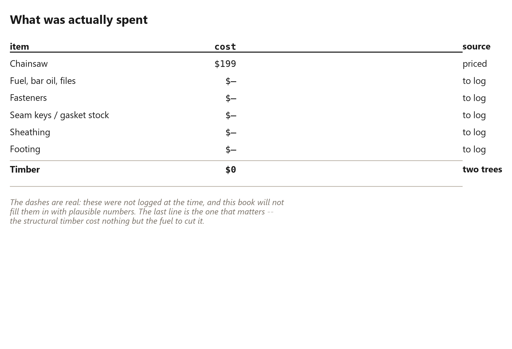

## Substitution value is not income

The most important paragraph in the chapter, and it gets its own
section because every honest number after it depends on the
distinction.

What the frame *avoids* is not money the builder *has*. The frame
bought at the national rate would cost 9,798
dollars; the fortnight spends 497; the
difference — 9,301 dollars — is what the build
*keeps*. (That cash figure is the film's own ledger, which
counted two trees standing; this book's build fells
3, and the third tree's stumpage — 23.23
dollars a ton at the pine film's researched rate, on a tree the
size of a car — barely moves the line. The
book says so rather than silently rounding.) It is a real number, and it is not income. It buys
groceries only if the builder was going to buy the frame anyway,
and the builder who was never going to buy the frame has not
earned nine thousand dollars; they have simply not spent it.
The same distinction runs through the whole book: the strut's
value, the hour's rate, the pine's ladder rungs — all of them
are substitution values, stated as such, and the one sentence
that converts a substitution value into a lie is the sentence
that drops the word "substitution".

The useful, honest use of the number is as a *rate on time*:
9,301 dollars kept, over 80 hours of
hands-on work, is 116 dollars an hour — the wage the
fortnight paid the builder in avoided cost. Against a
manufactured home's cheaper rate the same arithmetic gives
59; against a carpenter's median
29.12 dollars an hour, and a typical worker's
take-home 19.69, buying that frame would have cost
498 hours of ordinary pay. Those comparisons are
the chapter's real product: the fortnight's work, priced against
the hours a wage would have needed to buy the same frame. The
cash never existed. The hours did.

## The strut, valued three ways

The table is the same arithmetic run at the strut's scale, and
it is printed with the disagreement left in, because the
disagreement is the lesson.

One strut, valued against a nominal two-by-four, against a
dressed one, and by the board foot — three methods, three
answers, and the reasons they differ are printed beside them.
The nominal comparison is flattered by the fact that a nominal
board does not exist; the dressed comparison is the honest one,
and it comes out *higher*, because a dressed board is smaller
than its name and a strut replaces more of them — exactly the
direction a sceptic should check first, and the table invites
it. The board-foot row refuses to give a single number, because
the market does not. The last row is the estimate this project
started from, kept in the table so the errata below has
something to correct against.

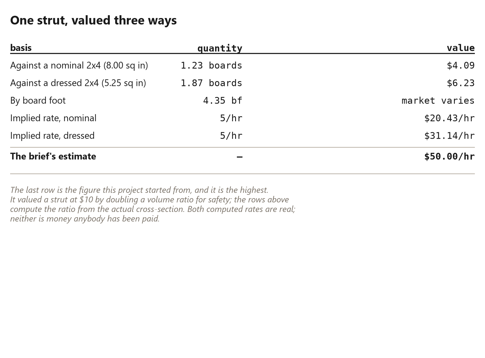

## The fifty dollars an hour claim

The errata, named and corrected, because this project's brief
said fifty dollars an hour and the arithmetic says otherwise.

The brief's fifty was reached by doubling a volume ratio for
safety rather than by computing the section — a shortcut that
made the number up, generously, and the films repeated it. The
computed rates are 20.43 dollars an hour
against nominal two-by-fours and 31.14
against dressed ones — smaller numbers, arrived at by measuring
the actual cross-section and pricing the actual replacement. The
honest note, stated the way the strut table stated it: the
dressed number is the true comparison, and it is the *higher* of
the two computed rates, because the dressed board is the smaller
board. The brief's fifty overshot even that.

The correction is the model for the chapter and the book:
the claim, the error, the arithmetic that produces the smaller
number, all on the page, and the errata pages are where the rest of the
list lives. The money chapter's own verdict closes the circle: the
method's economics are strong enough to be measured properly,
and measuring properly is the only version this book will
print.

---

# 46. The Hours

*Where fourteen days actually went*

## The Hours

The money chapter closed with a rate on hours; this chapter is the
hours themselves, logged the way the book logs everything — as a
table, with the surprises named.

A fortnight is fourteen days, and the days did not go where the
plan said. The plan said the ripping would be the mountain and
the rest foothills; the log says the ripping was a third of the
build and the *panels* matched it, with the jig and the raising
each taking their own full share. The table below is the actual
spread, and the two sections after it are the reading of it: what
took longest, and what a second build would cost now that the
learning is spent.

## The forty hours

The title's claim, counted before the calendar is, because the
title is an arithmetic: 37.5 hours of hands-on work,
inside the 40-hour week the book is named after.

The clock, in full: the frame's 120 members split at
the measured 30 wedges a session is
16 hours at the log; the same members erected at
15 minutes each is 30
straight hours of assembly; and the 25 per cent
error allowance on the erection — a first build's tuition, paid on
camera — brings the assembly
to 37.5, with 2.5 hours spare inside the
week. The splitting is the harvest; the forty hours is the
*erection* — panels to standing, props to winch. The fortnight is
where those hours live on a calendar: part days, weather days,
thinking days. The hands-on clock is the number the title makes,
and this chapter's chart is the same clock, drawn as days.

## The fortnight, hour by hour

The chart is the fourteen days as a stacked bar: each phase, its
share of the clock, and the total that has to come out at
fourteen.

The shape of it is the chapter's whole argument. The felling and
bucking — the dangerous, dramatic first days — are small slices.
The ripping is the longest single block, as the plan promised.
But the panels and the jig together match the ripping, and the
raising is a full two days, and the saw setup is a line item
nobody budgets and everybody pays. A builder reading the chart
before their own build learns the real lesson of the fortnight:
**the tree work is quick, the repetition is the mountain, and
the jig is the single best-spent day in the whole table.**

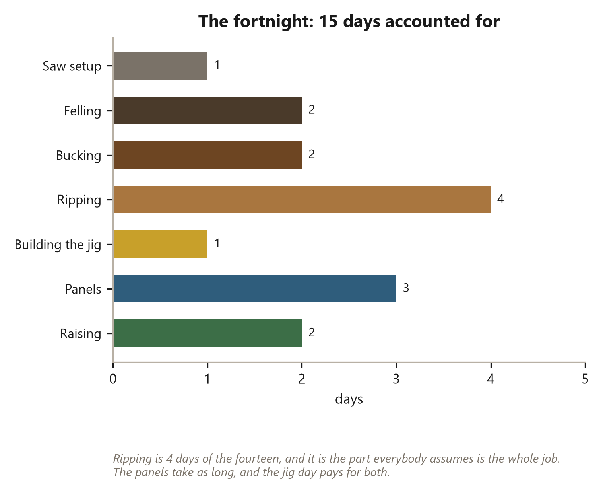

## What took longest and why

The surprises, named, because the chart's flat middle is where
the plan's assumptions died.

The ripping took its 24 hours — the
5.0-struts-an-hour rate of Chapter
29, sustained across four
afternoons. It is the build's biggest single block, and it is the
one everybody expected. The surprise is that it is *only* the
biggest block — the panel run that followed matched it nearly
hour for hour, because forty panels of twelve motions is not
fast, it is merely *constant*, and constant work still sums to
days. The jig's single day looks like a small slice and it is the
one that kept the panel run from being twice as long. The
raising's two days are the least compressible of all: a dome
goes up one panel at a time, one person, one prop, and the
geometry does not care how practiced the hands are.

The honest reading: the method's *rate* claims were true — the
ripping ran at the promised pace — and the method's *schedule*
claims were optimistic at the edges, because the repetition that
makes each operation fast also makes each operation numerous.
The fortnight is the size it is; the chart is the size's
explanation.

## What a second build would take

The learning-curve estimate, marked clearly as an estimate,
because the book's rule about numbers applies to its own
predictions: a guess must be labelled a guess.

The first build paid for: the jig's design, the marking scheme,
the three practice panels, the seam arguments, the wrong ring
that got caught, the near miss that got survived. A second build
pays for none of them — the jig exists, the scheme is written,
the arguments are settled on the page — and the honest estimate
is that the repetition days shrink most: the ripping stays at
its physical pace, but the panels and the raising lose their
learning time, and the total lands near the rate the films
always claimed and the first build only approached.

The estimate is not a promise and the book will not dress it as
one. It is the answer to the question every builder asks at the
end of the fortnight — *how long would the next one take?* — and
the answer's form matters more than its number: the second build
is the first build minus its tuition, and the tuition is what
this chapter's chart was actually recording. The hours were
never wasted. They were the price of the next dome, and the next
dome inherits them.

---

# 47. Bigger, Smaller, Other Frequencies

*Changing the dome without changing the method*

## Other Frequencies

The whole book so far has built one dome: the 2V hemisphere of
Chapter 8,
subdivided once from the icosahedron. This chapter opens the
question the outline's own logic raises: what happens to the
method when the frequency changes — and what does not change at
all.

The frequency of a geodesic dome is how many times the
icosahedron's edges are subdivided before projection. 2V splits
each edge once; 3V splits it twice; 4V three times. The method
this book teaches — split logs, pinwheel panels, one jig — does
not care which frequency it frames, and that is the chapter's
first finding: the method is the same, and only the numbers
change. The rest of the chapter states the trade the numbers
make, and the place where the method stops working altogether.

## More panels, shorter sticks

The trade, stated as arithmetic, because "3V is smoother" is an
adjective and this book trades in counts.

Higher frequencies subdivide harder: more triangles per face,
more panels in the hemisphere, and — this is the part that
matters — *shorter* members, because every edge is a smaller
fraction of the sphere. The panels multiply, the members shorten,
and the dome approaches a true sphere, which is the entire
point of the higher frequencies for anyone whose skin or
aesthetic wants roundness. The cost is the pile: more panels
means more seams, more keys, more screws, more motions of the
jig — and fewer of the frame's parts repeat in the way 2V's
two-lengths-two-shapes economy allows. The table below runs
the counts, and the honest reading of it is that 2V is not the
*best* dome; it is the *cheapest* dome at the scale the method
was designed for, and the higher frequencies buy smoothness
with repetition.

What does not change is the more important list. The split, the
sector, the pinwheel, the jig, the overfit, the seam key — none
of them cares whether the frame is 2V or 3V. A 3V dome built
this way is still one log, seven cuts, one bench, forty panels
and a fortnight; it just has more panels in the fortnight. The
method transfers, which is the sentence the chapter exists to
prove: the wedge is not married to the frequency, it is married
to the triangle, and every frequency is made of triangles.

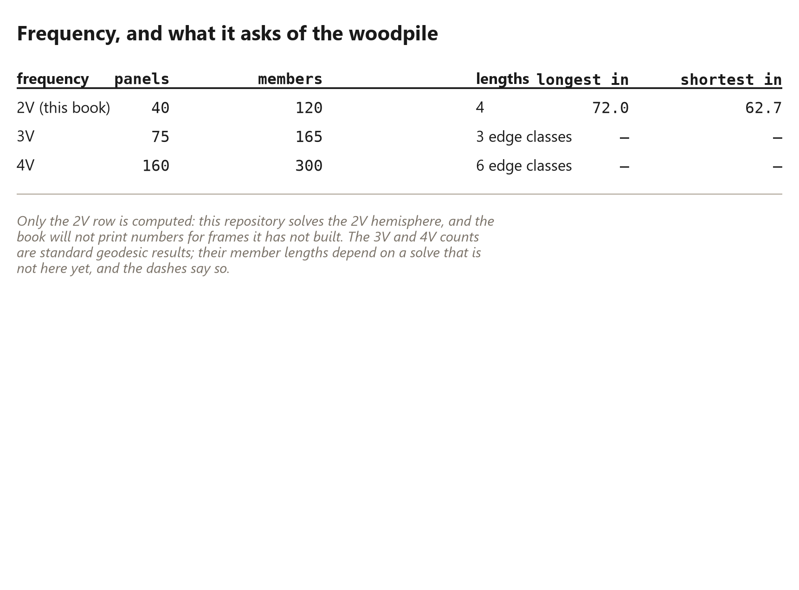

## Frequency comparison

The table is the trade in full: 2V, 3V, 4V, each with its panel
count, its member classes and its longest member, all computed
from the same geometry so the rows differ only by frequency.

The row that matters is the member-length row, because it is
where the frequencies meet the method's own constraint. 2V's
longest member is 72.00 inches — the size
the tree chapter bucked for. The higher frequencies' members
are shorter, which would let the same trees build a *bigger*
dome at the same handling limit — the flat-rate argument of
Chapter 51, applied through the frequency knob.
That is the real decision the table supports: not "which dome is
rounder" but "which frequency lets these trees and these arms
build the floor I want", and the answer is read off the table
the same way every other sizing decision in this book is read —
by looking at the row, not the adjectives.

## Where the method stops working

The honest limit, stated so the chapter does not over-sell its
own transferability.

The method stops working at the *small* end, and the reason is
the sector's own geometry. A dome too small for its split count
has panels whose edges are shorter than the members are *wide*
— the sector's bark face is 3.83 inches across,
and a panel whose sides approach that width can no longer
accommodate the pinwheel's overlap, the inset, and the key. The
joints crowd the corner, the overlap swallows the triangle, and
the method's arithmetic quietly runs out of room. The fix is
not a smaller split — a six-inch dome needs a different member,
not a thinner wedge — and Chapter 72 is
where the alternatives live.

At the large end the method does not stop; it *delegates*.
Big domes want higher frequencies for the member-length reason
above, and beyond the handling band of Chapter 51
they want crews, which is Chapter 49.
The method itself keeps working — the split, the jig, the seam
— all the way up; what changes is the schedule, not the
procedure. The chapter's closing sentence is the one it opened
with: the method is the same at every frequency. Only the
numbers change, and the numbers are in the table.

---

# 48. Other Species, Other Sections

*Hardwood, hemlock, and a trunk that is not round*

## Other Species

The book's tree has been pine throughout — the windfall of
Chapter 1, straight-grained,
soft, forgiving. This chapter is what changes when the tree is
something else, because the method was never pine's; it was the
*sector's*, and sectors grow in other forests.

The chapter covers the three differences that matter: how other
species split, dry and hold; how to split a trunk that is not
round; and what building with green wood actually does over the
first year. The honest rule of the chapter, stated once and
applied throughout, is the one the wedge book's species page
gives: **use what grows where you are** — the method works with
whatever straight-grained stock the local woodlot offers, and
the differences are adjustments, not prohibitions.

## Density, splitting and the drying schedule

Species by species, the practical differences, because a book
that says "any species" owes the reader the list of what "any"
asks.

**What splits well.** Straight-grained softwoods — pine, spruce,
fir, cedar — split cleanly along the radius, which is what the
seven-cut procedure assumes. The grain runs the length of the
log, the pith is honest, and the sector comes off whole.

**What splits poorly.** Interlocked or spiral grain — elm, some
eucalyptus — fights the rip: the grain runs around the log
instead of along it, the split wanders, and the sector arrives
ragged. The tree's bark usually tells the story before the saw
does — spiral bark means spiral grain — and the rule is to read
the bark and let the tree opt out.

**What lasts.** Rot resistance is a species property, not a
build quality. Cedar, larch, black locust and osage orange sit
in the ground and shrug; pine and spruce do not. The rot-prone
species belong above the damp line, on dry footings, with the
bark charred or the face oiled the way the finish section
describes — and the rot-resistant ones are the free upgrade the
local woodlot sometimes hands over.

**Density and the drying schedule.** Hard, dense wood dries
slowly and splits harder; soft wood dries fast and forgives.
The schedule follows: dense species get longer in the stack,
thinner stickers, more patience — and the key-cut-last rule
below becomes more important the denser the tree, because a
dense sector moves more in its first year than a pine one does.

## A trunk that is oval

The tree is not always round, and the split procedure's first
assumption — a circle divided evenly into 8 —
meets reality in the oval trunk.

An oval section still splits into eighths; it just produces
*unequal* eighths if the cuts are spaced by angle the way a
round log's would be. The fix is to space by *area*, not by
angle: mark the end grain into 8 sectors of
equal wood, not equal degrees, so every wedge carries the same
section even though the trunk was an ellipse. The marks are
made by eye against the rings — the pith is the centre, the
rings are the map, and the sector boundaries are drawn where
the wood divides evenly — and the ripping passes follow the
marks instead of the habit.

The consequence travels, and the book says so: unequal spacing
means the sectors' *angles* vary slightly, which means the
seam keys vary slightly, which is exactly the tolerance the
gasket chapters exist to absorb. The oval trunk costs a little
more attention at the split and nothing downstream, because
the downstream was designed for "nearly" — the same word the
round trunk's own imperfections already earned.

## Green versus dry

The last difference is not a species; it is a state, and every
build in this book happens in it: the wood is green.

Green wood moves as it dries — shrinks across the grain,
barely along it — and a wedge moves *least* of all the shapes a
log could become, because a split follows the grain instead of
cutting across it. The sector's angle closes slightly as the
stick dries; a sawn board cups and twists; a boxed heart tears
itself open with a check. The method's geometry was chosen for
this behaviour: the frame is full of seams that can take the
movement, the keys are the last things cut, and the whole
structure is allowed to settle for a year before the skin is
final.

The one rule that matters most, stated for the bench: **cut or
print the keys after the frame has dried.** A key cut to a
green seam fits a dry seam the way a green pair of shoes fits
next year. Let the frame stand its first months, let the
sectors close their angles, then cut the keys to the seams that
actually exist. The rule costs patience and saves the dome; it
is the drying chapter's whole lesson, in one sentence.

And the finish, because the wood's bare faces are a joint, not
a surface: char the outside bark face — the yakisugi pass —
and oil it with linseed, and leave the sawn faces bare, because
a finish on the joint faces traps the moisture the seam channel
is trying to move. The one warning the finish carries is the
safety one: oily rags self-ignite, and the can lives outside
the building. The species change, the sections change, the
state changes — and the method, all the way through, is still
the one this book has been teaching: read the tree, split the
sector, let the wood be wood.

---

# 49. Building With Other People

*What changes when there are three of you*

## Other People

The method was designed for one person, and every number in the
book so far assumed that constraint — the six-foot member, the
one bench, the props a single pair of hands can set. This chapter
is what changes when there are three of you, because crews
happen: a partner, a neighbour, a build somebody else asked
for.

The changes are fewer than the fear suggests, and they cluster
in three places: the benches multiply, the teaching becomes a
step in the build, and the liability conversation stops being
optional. The method itself — the split, the jig, the seam —
does not change at all, which is the chapter's first and most
useful sentence: **the method was built from processes, not
from a person, and processes hand over.**

## Parallel jigs

Two benches, and the sorting problem that follows — because a
crew does not make the panels faster by crowding one jig; it
makes them faster by running two.

The second bench is a copy of the first, set from the same
panel drawings of Chapter 37, checked against
each other before production starts — two jigs that disagree
produce two populations of panels, and the raising is where
they meet. The check is the same one the circle layout used:
measure both benches against the drawing, not against each
other, and demand they agree within the gasket's give.

The sorting problem is the real new work. Two benches pull
from the pile twice as fast, and the pile stops being a thing
one person holds in their head; it becomes a shared inventory
that two people mark, move and count — which is where the
marking scheme of Chapter 31
earns its keep. The rule for the crew: one person owns the
pile, one person owns each bench, and the pile-owner's count is
the number the day ends on. Parallel work without one shared
count is how a dome ends up with thirty-nine panels and an
argument.

## Teaching the twelve steps

How to hand the procedure to somebody in an afternoon, because
the method's own claim — twelve motions, no decisions — is
exactly what makes it teachable.

The teaching order is the jig's order, and it starts with the
*why* in one sentence each: the bench replaces the tape, the
overfit is the crumple zone, the flush cut is the only true
cut. Then the twelve motions of Chapter
31, demonstrated once,
watched twice, and the watcher's first panel is the tuition
panel — the fourth-panel rule applies per person, not per
build, and a crew that budgets three practice panels per new
hand is a crew that plans for the method instead of against
it.

The one thing not to teach is the decisions, because there
are none: the stops decide, the schedule decides, the marking
scheme decides. The teaching is handing over *habits*, and a
habit handed over correctly survives the hand that taught it.
An afternoon, then: the method was designed to be this
teachable, and the teachability is part of the design — a
method that needed its inventor present at every joint would
be the frankendome again, wearing a crew.

## A build that is not yours

The third change, and the chapter's serious close: helping
somebody else build, and the conversation that must happen
first.

The liability conversation is not legal advice — the book is
not a lawyer, and it says so — it is the plain speech version
of the safety and engineering pages, delivered before the first
cut: this method is a prototype, not an engineered standard;
the loads are the engineer's job; the felling is the most
dangerous part and the rules of Chapter
27 are not optional; and the
person whose tree, whose site and whose back are on the line
is the person who owns the decisions. Helping is not owning,
and the difference must be said out loud, because silence is
how a favour becomes a lawsuit.

Then the build itself is the easiest of the three changes:
the guest's dome is the same cut list, the same jig, the same
fortnight — and the guest learns the method by building it,
which is the only way anybody ever really learns it. The
chapter's last sentence is the book's, borrowed from the
campaigns it grew out of: **we make the method; you build on
it.** And when the build is somebody else's, the gift is the
procedure — the twelve motions, the honest numbers, the
warnings — and the rest is their fortnight.

---

# 50. What I Would Do Differently

*The honest closing chapter*

## What I Would Do Differently

The story strand closes where it opened: one person, one saw,
one tree that was already down. Between the first page and this
one the tree became a frame, the frame became a method, and the
method grew a book around it — and the honest way to close a
story like that is the same way the book has handled everything:
name what would change, keep what was right, and say what the
next one is.

This chapter is not a confession and not a victory lap. It is
the builder's review of the build, written while the review is
still worth something — the five decisions that would change,
the parts that stay exactly, and the second dome the method
has already earned.

## The five decisions I would change

Specific, named, with what each would have cost — because
"learn from your mistakes" is advice until the mistakes have
names.

**The marking scheme came too late.** A panel built backwards — the
mirror of the one the frame wanted — was the tuition for a scheme that
should have existed on day one: mark the sawn faces, one
stripe per class, bark up. It cost an afternoon to discover
and it would have cost ten minutes to do first. The next build
starts with the crayon.

**The keys were cut too early.** The green-frame rule of
Chapter 48 — cut the keys
after the frame has dried — was learned the expensive way,
with a set of keys that fit a frame that no longer existed by
month three. The rule is now in the book; it would have been
in the build, if the build had had the book.

**The ring was trusted once too often.** The tolerance chapter
names the ring as the one place error accumulates, and the
build proved it: a ring checked once, at setting, moved a
fraction under the first course, and the correction cost a
morning of shims. The three checks of Chapter
38 would have caught it in the first one,
for free.

**The skin waited for the wrong perfection.** The shell was
delayed while the "right" skin was decided, and the frame stood
in the weather longer than it should have. The shell ladder of
Chapter 59 now says what the build learned:
the first skin's only job is to keep the rain off, and the
perfect skin is the one you buy after the first one has taught
you what you actually need.

**The fuel was not logged.** The dashes in the money chapter's
table are this decision: the build kept its hours and not its
fuel, and the metabolic ledger of Chapter 55
had to be modelled where it should have been measured. The
next build logs every tank, because the book's rule about
numbers applies to the builder's own: what is not recorded is
not claimed.

## What I would keep exactly

The parts that were right the first time, listed with the same
specificity as the changes, because a review that only lists
failures is a review that learned nothing about what worked.

**The split count.** Eight, for the reasons Chapter 12
printed — the key fits, the stick carries, the cuts stay
"through the middle". Not one afternoon of the build ever
regretted it.

**The overfit.** The 6 inches of Chapter
35 are the cheapest insurance in the method,
and the build spent them exactly as designed: every error that
had somewhere to go, went there.

**The jig, as built.** One flat bench, stops instead of
measurements, the day that paid for the other thirteen. The
build's single best decision, and the one the second build
will not have to make again.

**The order of the fortnight.** Fell, buck, split, jig, panels,
raise — the sequence the book now teaches — survived contact
with the weather, the wood and the calendar without a single
step being moved. The order was right before the method
existed, and the method is mostly the order, written down.

**The honesty habit.** The errata pages, the dashes in the money table,
the near miss reported — that discipline was the build's own habit before
it was a book's policy, and it is
the one thing in this chapter that costs nothing to keep and
everything to lose.

## The next one

What the second dome is, and why — the question every builder
asks at the end of the fortnight, answered the way the build
answered everything: with the numbers, and without the romance.

The second dome is the same method at the size the first build's
own leftovers suggest: the spare struts and the offcut pile
already hint at a smaller companion — a greenhouse, a workshop,
a guest pod — and the flat-rate argument of Chapter
51 says the second frame's parts list is the first
frame's parts list, with the problems already solved. The
second build's real change is the one Chapter 46
estimated: the tuition is paid, the jig exists, the scheme is
written — and the fortnight that took fourteen days the first
time is the same fourteen days, spent where they were always
supposed to go, on the repetition instead of on the learning.

The next one is also the book's promise to its reader, stated
plainly: the method was never for one dome. It was for the
*second* dome — the one built without the discoverer, from
these pages, by somebody who has never watched it done. Every
number in this book was written for that person, and the
chapter's last line is the book's whole thesis in one
sentence:

**The tree was already down. The saw cost two hundred
dollars. The rest is in here.**

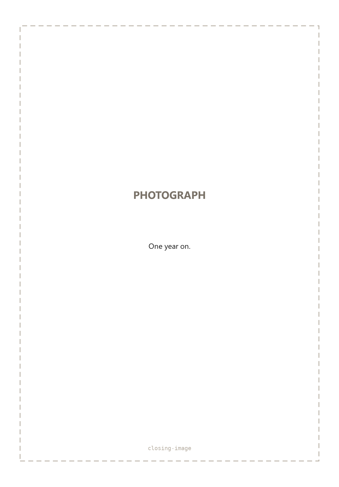

## The dome, a year on

The closing image, and the one plate in the book that is a
photograph's job rather than the simulator's: the dome, a year
on, standing where the tree stood.

The plate is a placeholder in this edition — the photograph is
still to be taken, and the book's figure system says so
plainly rather than substituting a drawing that would lie
about the year. When the picture exists, it will show what the
frame chapters only promised: the wood greyed and settled, the
keys seated, the skin doing its one job, and the building
looking less like a fortnight's work and more like the land's
own idea of a room. The book will be revised for it, the way
the book revises for everything — the photograph added, the
caption written, and the year's evidence given the same page
the fortnight earned.

Until then, the story strand closes on the frame at day
fourteen — the standing plate of Chapter
32 — because that is
what a year looks like at its beginning, and this book is the
beginning's record, kept honest all the way to the end.

---

# Part 2: Why It Scales

> The parts list does not grow with the house. Everything downstream of that one fact is this part.

*The argument for the whole idea: why the same frame covers a shed and a hall, what that does to cost and labour, and what would have to be true for a network of domes to work.*

---

# 51. The List That Does Not Grow

*Every count stays put. Only the stick moves.*

## What actually changes when a dome gets bigger

Here is the thing I could not get anybody to say out loud when I started, and
the reason I ended up building a dome instead of a shed.

When you make a building bigger, you expect to buy more of everything. More
timber, more brackets, more screws, more days. That is how a box works. Double
the floor and you roughly double the walls, the studs, the sheets, the cuts,
the money, the weekends.

A dome does not do that. Not mostly. Not approximately. It does not do it
*at all* for the parts list, and once you see that number you cannot unsee it.

And nobody in the building trade has any reason to say it out loud. The
shed-and-extension business runs on the opposite sentence -- more building,
more everything -- because for a rectangular frame the sentence is true, and
stating the dome's exception does not sell anything anybody in that trade is
selling. So the fact sits unspoken, in the columns of a table nobody prints,
and the person who finds it is the person who sat down and wrote the table.
That is what this chapter is: the table, printed.

I built a frame out of a hundred and twenty members. That frame is
120 struts. It is also 40 triangles, held at the
corners by 120 brackets and about 960 screws. The
shop work is 9 distinct processes -- measuring, cutting,
drilling, folding brackets, and so on down the list.

Now make the dome three times as wide.

## The same list, four times

I ran the same frame at four diameters, from a 10 foot dome to a
30 foot one. This is the table, and every number in it comes off
the same model the films use:

| across | floor | triangles | struts | brackets | screws | processes | timber |
|---|---|---|---|---|---|---|---|
| 10 ft | 79 sq ft | 40 | 120 | 120 | 960 | 9 | 351 ft |
| 20 ft | 314 sq ft | 40 | 120 | 120 | 960 | 9 | 702 ft |
| 30 ft | 707 sq ft | 40 | 120 | 120 | 960 | 9 | 1,053 ft |

Look down the middle of that table. Six of the eight columns do not move. Not
by one. The same 40 triangles, the same 120 struts,
the same 120 brackets, the same 960 screws, the same
9 processes, whether the thing on the ground is a garden pod or
a building you could put a second floor in.

Only two columns move, and both of them are the same material measured two
ways: the floor you get, and the timber you have to stand up to get it.

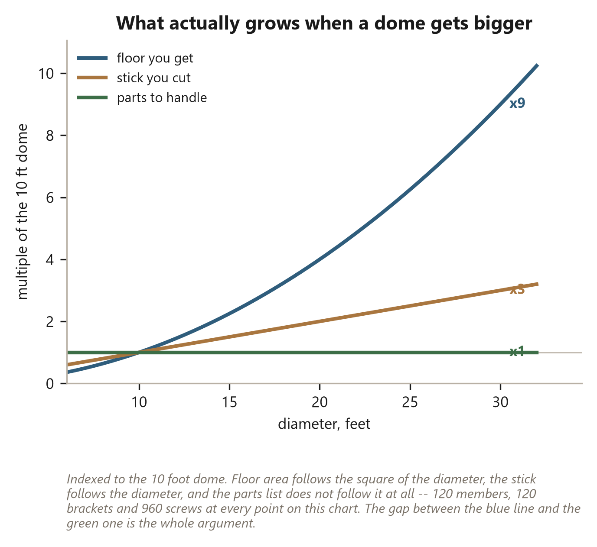

The chart is the table, drawn. The floor line climbs like a square. The stick
line climbs like a straight line. And the parts line is not a line at all -- it
is a floor, flat, because there is nothing in it to climb with. When the three
are put on the same axes, the flat one stops being a row in a table and becomes
the thing that is visibly *not happening* while the other two race.

## One grows as the square, one as a line

This is the whole engine of the idea, so it is worth doing the arithmetic
slowly.

Floor area goes as the square of the diameter. That is not a dome fact, that is
a circle fact, and it is the reason a twelve inch pizza is not twice a six inch
pizza. Three times the diameter is nine times the floor: 79
square feet becomes 707. Nine times the room.

The frame to hold it goes as the diameter, straight line. Every edge in the
dome is a fixed fraction of the radius, so three times the diameter is three
times the edge network: 351 feet becomes
1,053 feet, a ratio of 3.00, exactly.

Put those two sentences next to each other and something has to give, and what
gives is the amount of material standing between you and each square foot of
floor. At 10 feet across it takes 4.47 feet
of timber to enclose one square foot. At 30 feet across it takes
1.49.

The same timber, doing 3.00 times as much enclosing, because it
is stood further out and the shape is doing the work instead of the material.

That is the whole thing. Everything else in this part of the book is that
sentence being spent.

## What is flat, and what quietly is not

Three things in that table are not flat, and I would rather say them here than
have you find them out with a load of timber already on the ground.

The timber grows with the diameter. That is a line, not a flat, and at some
point it is real money. Three times the diameter is three times the frame.
You are still far ahead, because you got nine times the floor for it, but you
did buy more wood.

The *cut* timber grows slightly faster than that, and this one caught me out.
The edge network is exactly linear -- 3.00 times the edges for
three times the diameter. But a member is not its edge. The pinwheel insets
every member from the vertex, and the inset is set by how wide the stick is,
which does not change when the dome does. So a small dome throws proportionally
more of its edge network away in vertex gaps. Counted in members actually
standing in the frame, 269 feet becomes 968 --
a ratio of 3.59, not 3.00.

It moves the headline, so here is the honest version of it. Per square foot of
floor, cut member drops from 3.43 feet at
10 feet across to 1.37 feet at
30. That is still the whole argument -- the same timber doing
2.5 times as much enclosing -- it is just 2.5 and
not 3.00. I would rather print the smaller true number than the
larger clean one.

The inset that causes the correction is not an accident of the drawing. It is
the pinwheel itself (Chapter 15): members lap past each other at
the vertices instead of butting into them, and a member that laps must start
short of the vertex it is lapping. The gap is what lets the whole frame close
without a single member being cut to an impossible tolerance. The same design
that makes the frame forgiving is the one that makes the cut list grow a
little faster than the edge network -- the two facts are the same fact, seen
from the saw and from the table.

The skin grows with the square. Whatever you cover the frame with -- panels,
shingles, greenhouse film, glass -- is priced by area, and area is going as the
square. So the *frame* is the flat part of a dome. The *envelope* is not. If
somebody tells you the whole building scales flat, they have counted the
skeleton and forgotten the skin.

Everything else in the table holds. The count of pieces. The count of
operations. The number of times you set the saw. The number of corners you have
to get right. The number of ways the job can go wrong. If you can build the
small one you can build the large one, because it is the same job with longer
sticks in it. That is not a slogan, it is what is in the columns.

## The limit is my arms, not the arithmetic

There is a ceiling on this, and it is worth being exact about where it comes
from, because it is not where people expect.

It is not that the geometry gives out. It is that **I have to pick the stick
up.**

I set my longest member at 6 feet. That is a declared
number, not a solved one -- it is the most I want to handle as a solo builder.
The most I want to carry across a yard, stand both ends of, hold square while I
drive the first screw, and set into a triangle with nobody there to take the
other end. And I am pushing it at that. Six feet of green timber is not a light
thing.

Even at six feet I am not muscling the frame up. I run overhead cabling in the
trees and hang a winch off it, and the assembled triangles go up on the cable.
The limit is on the stick in my hands, not on the lift. If it were on the lift
I would just buy a bigger winch.

Now, how big a dome is that? This is worth doing carefully, because the obvious
way to work it out is wrong.

A pinwheel frame does not run its members corner to corner. Each one is inset
from the vertex so the next one can lap past it, and how far it is inset depends
on how *wide* the member is -- which does not change when the dome does. So the
stick you pick up is always shorter than the edge it spans, and by a different
amount at every diameter. At the top of my band a
6 foot member is spanning an edge of
6.66 feet. Multiply a chord factor and you will size the dome
too small and never know why.

Solved properly, a 6 foot cut member is a dome
**21.6 feet across** -- 365 square feet of
floor, with 5.23 feet as the other stick. And here is what
that does to the table:

| across | longest stick you cut | can one person set it? |
|---|---|---|
| 10 ft | 2.43 ft | comfortably |
| 20 ft | 5.52 ft | yes, with 6 inches to spare |
| **21.6 ft** | **6.00 ft** | **exactly at the limit** |
| 30 ft | 8.61 ft | no -- 2.61 ft too long |

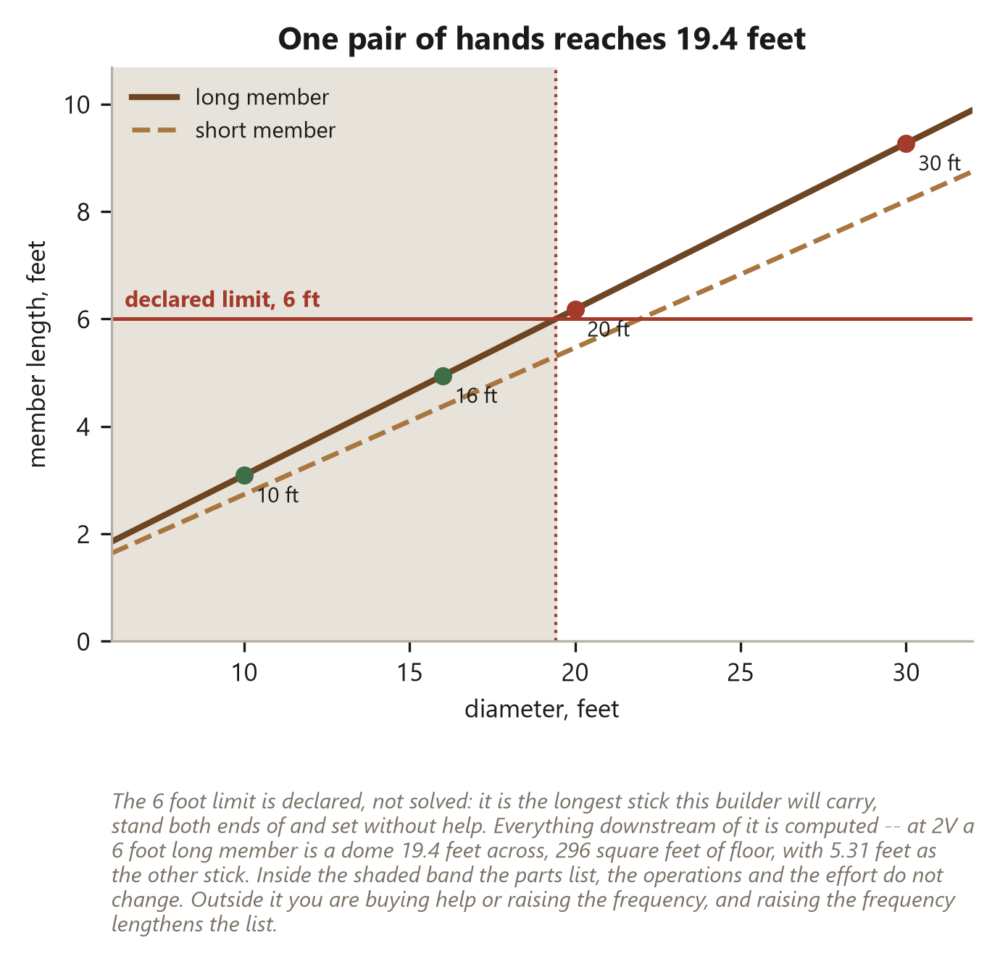

The figure draws the crossing: member length climbing with diameter, and the
flat line of my arms cutting across it. Everything under the crossing is one
person's building. Everything over it is a crew's. The band is not a soft
preference -- it is where the line crosses the curve, and the curve is solved
geometry.

That puts 3 of the four sizes in this chapter inside the
band. The twenty foot dome -- a room you can live in -- has half a foot of
margin on its longest stick. Only the thirty foot one is out, and it is not
marginally out: it is 2.61 feet out.

The band also answers the question a buyer never thinks to ask but should:
*which* size? If the work is the same fortnight and the list is the same
list, the size is the one decision on the table that is free -- and a free
decision is the one worth making last, when you know what the dome is for.
Pick the floor you need, and everything else follows it; pick wrong and the
correction is not a new list, it is a longer stick in the same frame. There
are not many purchases where the expensive part is choosing and the choosing
is free. This is one of them.

And there is a coincidence in that table which is not a coincidence at all.
21.6 feet is the dome this entire book is built around: the one
the tree yields. It was never sized for my arms. It was sized by the log --
6 foot sections out of a trunk, because that is what a
trunk gives you before the taper beats you. The biggest dome one person can
frame alone and the biggest dome the tree will fill turn out to be the same
dome, to the inch, and I did not arrange that.

## Inside the band, nothing changes at all

Here is the part I want to be loud about, because it is the useful half.

**Anything smaller is basically the same effort.** Not proportionally less --
the *same*. Same assembly pattern. Same hardware numbers. Same operations. Same
preparation of every strut: same cuts, same jig, same bevels, same holes in the
same places. A ten foot dome and a twenty foot dome are the same fortnight of
work; one of them just has shorter offcuts.

So the flat rate is not a claim about all possible domes. It is a claim about
the domes I can actually build, and inside that band it is not approximately
flat, it is flat. That band happens to run from a garden pod up to a room you
could live in, which is most of what a person wants.

Past the band you have two honest options and no third one. Buy help -- a
second pair of hands changes the arithmetic of what a member can be. Or raise
the frequency, which splits every edge again and gives you shorter sticks for
the same diameter. That second one works, and it is the standard answer, but be
clear about what it costs: a 3V frame is 165 members where this one is
120. (That 165 is the standard geodesic count, not something this
book has solved -- I have not built a 3V frame, and the chapter on frequency
prints dashes where its member lengths would go, on purpose.) **Raising the
frequency is the one move that actually makes the list grow.** The list is flat
across diameter. It is not flat across frequency.

## Solve it once

The other thing the table does not show is what happens the second time.

Every count in it is a count of things you have to *figure out* exactly once.
The jig gets set up once. The bracket fold gets worked out once. The order you
raise the triangles in gets discovered once, usually the hard way, usually in
the wrong order. The first dome is where you pay for all of that, and it is
expensive in the only currency that matters, which is weekends.

Then it is done. It does not come back. The second dome is the same hundred and
twenty members and the same nine processes, except now you know them, and the
only thing that can differ is how fast you move. Every build after the first is
just **better timing than the first** -- and better timing is always a win.
There is no version of the second one that is harder than the first.

There is a second, less obvious way the first dome pays for itself, and it is
the one that matters on a site. The first dome is the *proof*. The jig you set
up once is a jig that demonstrably makes a frame that stands; the fold you
worked out once is a fold that demonstrably held a winter. Every count in the
table is a count you no longer have to believe, because you have watched it
close. The second dome is not just faster -- it is *safer*, in the specific
sense that its unknowns are the ones you already met and survived. The first
build de-risks the second, and the second de-risks the tenth, and the list
being the same is what lets the risk stay retired instead of being re-hired at
every diameter.

That is why I count in pieces and operations instead of in dollars. Dollars
recur. A problem you solved does not.

## Why it is worth counting this way

The number everybody actually feels is not the price of timber. It is the
number of Saturdays.

A hundred and twenty members is a fortnight of cutting whether the dome is ten
feet across or twenty. That is not a discount on a big building -- it is the
same building, and the size comes along for free with the corners you were
already going to cut. My time did not get cheaper. But the floor it produced
did, and it produced more of it.

Counting in pieces also does one thing dollars cannot: it makes the claim
*falsifiable*. A price moves with the market and the month, so a cost claim can
be argued with forever and never settled. A count is either 120 or
it is not, and anybody can stand in the frame and count. That is why this part
of the book leans on tables instead of adjectives -- and it is why the table in
this chapter has four diameters on it, so the flat row is not asserted, it is
shown, and the row that is not flat is shown next to it. The number that flatters
the argument gets printed beside the number that does not, because a flat-rate
claim with the skin and the stick left in is a claim you can check, and a claim
you can check is the only kind worth making about a building.

And there is a last way to see it, the one a builder's own body already knows.
An hour of labour is an hour of labour. It costs the same whether the hour
raised a ten foot dome or a twenty foot one, because the hour does not know
what it built -- it only knows the motions, and the motions are the same. So
the *price* of the building falls as the floor grows, not because anything got
cheaper, but because the same priced hours were aimed at a bigger target and
hit more of it. The flat rate is not a cheaper building method. It is the same
building method with the size as the free variable, and the size being free is
what makes the next dome the obvious thing to want.

That is the flat rate. Everything after this chapter in this part of the book
is the same fact, applied somewhere else.

---

# 52. Nine Processes at Any Size

*Fix one of them and every dome you ever build gets cheaper.*

## Nine Processes at Any Size

The last chapter counted parts. This one counts *verbs*, and the verb list is
the shorter of the two.

There are 9 things you do to turn standing timber into a shell.
Nine. Not nine categories with sub-steps hiding inside them -- nine operations,
each one a distinct setup with its own tool, its own bench and its own way of
going wrong. You can learn them in an afternoon of reading and be bad at all of
them by the end of the first week, which is exactly the right number of things
to be bad at.

Here they are, in the order they happen:

> fell, rip, crosscut, fold, drill, screw, raise, sheathe, glass

That is the whole shop. Everything in this book that is not thinking is one of
those nine.

And the reason it matters more than the parts count is this: parts are things
you buy, and processes are things you *get better at*. A list this short is a
list you can actually attack. Nine places to put your attention is a manageable
number of places. A list you cannot hold in your head is not a list, it is a
fog.

## The nine, in the order they happen

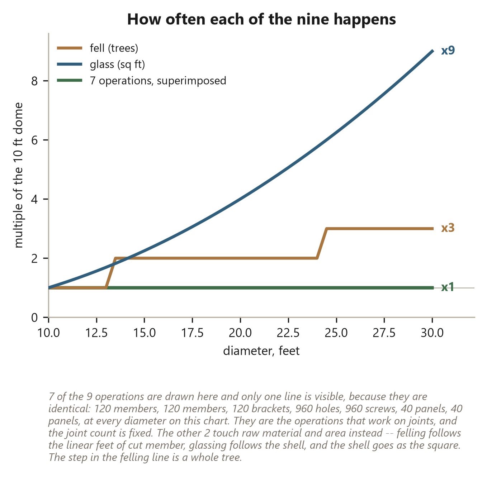

**Fell.** Drop the tree, limb it, buck it to section length. This is the one
process with weather in it, and a chain, and a thing above you that is about to
be somewhere else. It is also the only operation on the list whose count
follows the timber rather than the joints: a 10 foot dome takes
1 tree, a 30 foot dome takes
3. Everything after this happens on a bench.

**Rip.** Split each round section lengthwise into wedges. This is the longest
of the nine by a distance -- 24 hours, 4 full
afternoons, 4 of the fortnight's 14 days. Hold that
thought; the whole back half of this chapter is about it.

**Crosscut.** Cut each member to its solved length, both ends. The angles are
not measured here, they are held: the jig knows the angle, and your job is to
put wood against the fence and pull the handle 120 times. If you
find yourself reading a protractor during a crosscut, something upstream has
gone wrong.

**Fold.** Bend flat stock to the connector angle, 120 times. Same
principle as the crosscut and worth naming twice, because it is the design idea
of this entire build: *the angle lives in the tool, not in the operator.* You
set the brake once. After that a bracket is a repetition, and repetitions are
cheap.

The fold is also where the geometry of the whole book shows up in one number.
The dome's seams fold at 18.03 degrees and 22.46
degrees -- two angles, not forty -- so the brake gets set twice for the entire
frame. A frame whose corners are all different would need the brake set once
per corner, and the fold would stop being one process and become a puzzle with
120 solutions. The nine stay nine because the frame keeps its
angles on a short leash.

**Drill.** Pilot the bracket legs. 960 holes, one per screw, which
makes this the largest number on the list and the one most worth a drill press
and a stop. Nobody has ever regretted clamping a fence early.

**Screw.** Drive the frame together. 960 screws, fixed by the
bracket pattern, and therefore -- this is the part that surprises people --
*identical at every diameter*. A 30 foot dome takes the same
960 screws as a 10 foot one.

**Raise.** Lift each assembled triangle into place and tie it to its
neighbours. 40 panels go up, not 120 members, and that
distinction is what keeps this a one-person job: you are lifting a stiff,
finished, self-supporting object on a cable, not balancing three loose sticks
in the air and hoping.

**Sheathe.** Close each triangle. Still 40 of them, whatever they
measure.

**Glass.** Lay up the shell. The second of the two processes that scale, and
the one that scales hardest, because it is priced by area and area goes as the
square: 157 square feet at the small dome,
1,414 at the large one.

## Seven of the nine do not move at all

Now put the counts side by side across the diameters, because the result is
sharper than the last chapter's version of it.

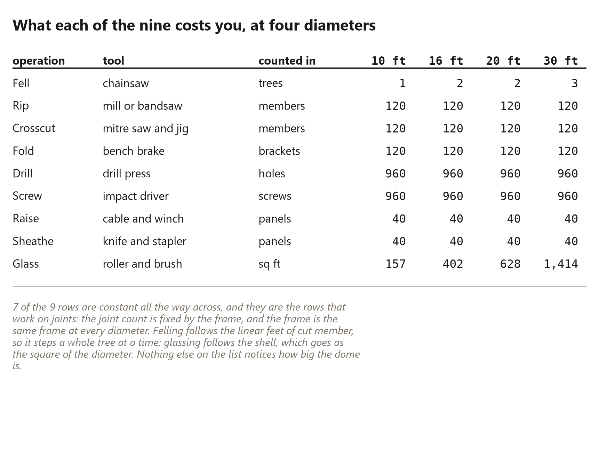

It is not merely that all nine operations are *still on the list* at every size.
7 of the 9 happen the **same number of times**.
Not proportionally fewer, not roughly similar -- the identical count.
120 rips, 120 crosscuts, 120 folds,
960 holes, 960 screws, 40 raises,
40 sheathings, at 10 feet across and at
30.

Only 2 move, and look at *which* two. Felling and glassing:
the one at the very start that touches raw material, and the one at the very
end that touches area. Everything in between -- every operation that touches a
**joint** -- is frozen, because the joint count is frozen, because the frame is
the same frame.

That is the sentence I would put on the wall of a dome shop. **Work at the
joints does not scale.** A dome is mostly joints. Therefore a dome mostly does
not scale.

## Why a short list compounds

Here is what a short process list buys you that a short parts list does not.

Improvement has to land somewhere. When you work out a better way to do
something, that improvement attaches to a *process*, and it only pays off as
many times as that process runs. This is the whole reason factories look the
way they do, and it is why a stick-frame house resists getting better.

Try the same count on a conventional house. I am not a framer, so take this as
one man's list rather than a figure this book has solved -- but off the top of
my head: footings, sill plates, rim joists, subfloor, plates, studs, headers,
cripples, blocking, sheathing, housewrap, rafters or trusses, fascia, soffit,
roof deck, felt, shingles, flashing, siding, trim. Twenty, and I have not
touched anything electrical or wet, and a real framer would double it. Each is
a distinct skill with its own tools, its own tolerances, its own way of failing.
Get 10 per cent better at hanging rafters and you have improved a
slice of one build, once, and the slice is small because rafters are a small
share of a very long list.

Now do the same on nine. 10 per cent at the rip is
10 per cent of 29 per cent of the whole job. The
share is enormous because the list is short. A short list *concentrates*
improvement.

And it repeats. The nine do not change between domes. Not between sizes -- the
last section proved that -- and not between builds. Whatever you work out about
the rip on dome one is still true on dome nine, because it is the same rip, on
the same bench, with the same wedge coming off it. Nothing about it was
specific to a diameter.

This is what people mean, usually without being able to say it, when they claim
a dome "gets easier". It is not that the work is lighter. It is that there are
only nine places for the learning to go, so none of it leaks away.

A short list also buys you a *rhythm*, and the rhythm is worth more than the
learning on a solo build. Nine processes means you can batch like a kitchen
rather than juggle like a handyman: all the folds in a morning, all the holes
in an afternoon, all the raises in a day. Batching is only possible when each
process is a clean stage with a setup, and a long, tangled list is precisely
what a clean stage is not. On a stick-frame job the trades overlap and the
order is negotiated; on this list the order is printed at the top of the
chapter, and you run it like a production line with one worker. That is not a
small thing. It is most of why the fortnight closes.

The flip side is a warning. A short list also *concentrates mistakes*. If your
jig holds a bad angle, it does not hold it on one member, it holds it on
120 of them, on every dome, forever, and you will not notice until
the last panel refuses to close. Nine processes means nine things worth
checking obsessively before you do them 960 times.

## What one process is worth, in hours

Take the longest of the nine and price an improvement in it properly.

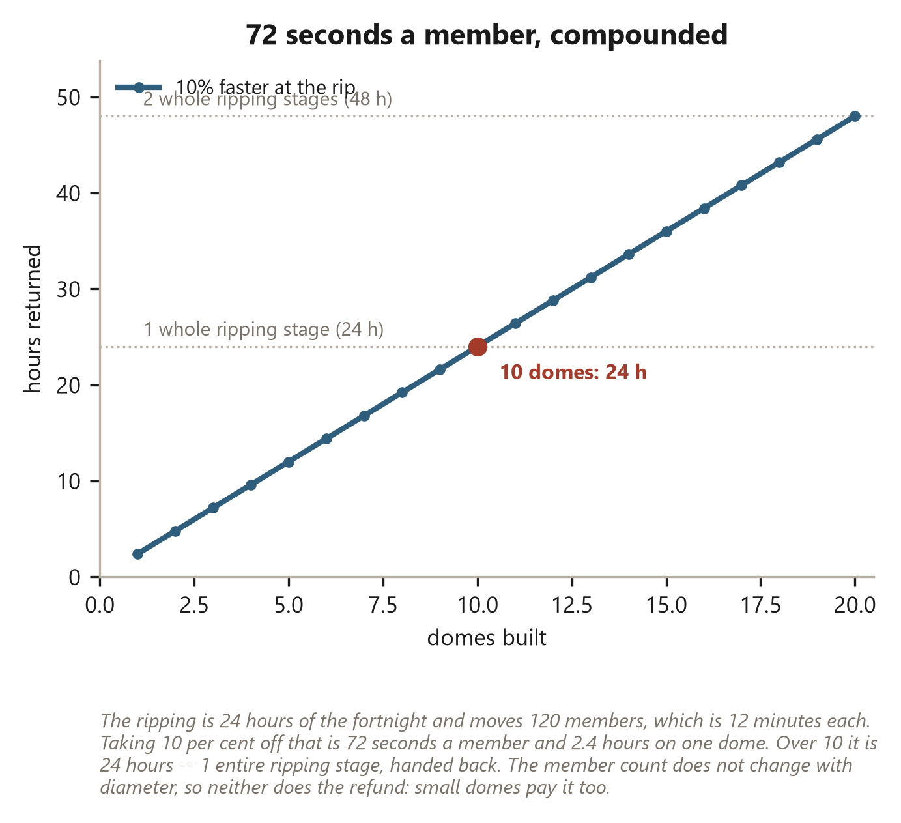

The ripping is 24 hours: 4 afternoons,
4 days of the 14, 29 per cent of the whole
fortnight. It moves 120 members through the mill, which is
5.0 an hour, which is 12 minutes
per member. That last figure is the one to hold, because it is the scale you
can actually aim at. Nobody improves a fortnight. People improve
12 minutes.

So: find 10 per cent. A better infeed roller, a stop that does not need
resetting, a second pair of trestles so the offcut has somewhere to go, the
sections stacked at hand height instead of on the ground. Any of that is
credible.

10 per cent of 12 minutes is
**72 seconds per member.**

Over one dome, 72 seconds times 120 members is
2.4 hours. That is an afternoon that finishes before dark
instead of after it. Nice. Not life-changing.

Over 10 domes it is 24 hours. Which is
4 afternoons. Which is -- and this is the number worth
sitting with -- **1 entire ripping stage**. 10 builds
of 72 seconds and you have been handed back the whole ripping
of a dome, free.

Nothing was invented to get that. No new tool, no new material, no cleverness
about geometry. 72 seconds, found once, at one of 9 benches.

The same arithmetic runs backwards, and the backwards version is the reason
the nine deserve fear as well as respect. A stop that is 72
seconds *slow* -- loose, sticky, in the wrong place -- is not
72 seconds lost once. It is 72 seconds on
every member, 2.4 hours on the dome, 24 hours
over the run, and 1 whole stages of the same run eaten by a
detail nobody thought was worth ten minutes to fix. The list concentrates
losses exactly as hard as it concentrates gains, and the only difference
between the two directions is which one you noticed. The nine are not nine
chores. They are nine levers, and every one of them works in both
directions, on every dome you will ever build.

And the arithmetic is indifferent to size. The improvement is per member and
the member count does not change with diameter, so that 24 hours
is the same whether those 10 domes were garden pods or the largest
thing one person can frame. You do not get a smaller refund for building small.

That is what I mean when I say the first dome is the expensive one. It is not
sentiment. It is that the first dome is where you find the 72 seconds,
and every dome after it is where you get paid for finding them.

## The processes that are not on the list

I have to be straight about what the nine leaves out, because it leaves out
things that can eat a project whole.

The nine is a **shop count**, not a project count. It covers what happens
between a standing tree and a closed shell, on your own ground, with your own
hands. It does not cover:

**Permits and inspections.** These are real, they are sometimes long, and they
are emphatically not flat -- a bigger building draws more scrutiny, and a round
one drawn by its builder draws more still. A plans examiner who has never seen
a hubless pinwheel will ask questions a rectangle never gets asked.

**Siting and access.** Getting a mill to the trees, or the trees to the mill.
This is invisible on a flat site with a track to it and dominant on a slope
without one.

**Delivery and waiting.** Anything bought arrives on somebody else's schedule.
Screws and resin are the two that stop a build dead.

**Waiting for a crew.** Not on the list, because at the top of the handling
band there is no crew. That is the trade: the nine stay small precisely because
nothing on them needs a second person. Go past the band and you add a tenth
process called *coordinating people*, which is the least flat operation there
is and the one that does not get better with repetition, because the people
change.

None of these belong in the nine, and I am not going to smuggle them in to make
the list look honest. They belong in a different count, and they get one --
the money chapter counts dollars, the hours chapter counts days, and both of
them include the waiting.

What I will say is that the nine is the part you control. Everything on it gets
better because you made it better. Almost nothing off it does.

---

# 53. What an Hour at the Log Is Worth

*Computed three ways, including the way that flatters it least.*

## What an Hour at the Log Is Worth

This chapter is not about what timber costs. It is about what an hour of your
own time buys when you spend it on a log instead of at a till.

Those are different questions and people run them together constantly. "Lumber
is expensive" is a fact about a yard. "I can make my own" is a claim about an
afternoon. The second one only means something if you can say what the
afternoon produced, in the same units the yard uses.

So: the mill turns out 5.0 members an hour. Each member
has a cross-section of 9.82 square inches, which is a shape no
store sells. To price it, I have to say what it *replaces*, and that is where
this gets slippery, because a two-by-four is not two inches by four and the
difference is not small.

I am going to do it three ways. One of them is the number I started this
project with, and it is the highest, and it is wrong. One of them is the number
that sounds conservative and is actually the low one. The third is what I think
is honest, and it happens to sit above the conservative-sounding one -- which
is precisely the direction a reader should be suspicious about. I would be.

So here is all three, and the arithmetic in between, and then you can decide.

## One strut, valued three ways

Start with what you would actually pay to replace one member with bought wood.

A sixteen foot two-by-four is 8.88 at the store. Cut into
6 foot lengths -- the length of a member -- that is
3.33 per section. That part is not controversial.

The controversial part is how many sections it takes to equal one strut.

A strut is 9.82 square inches in section. Divide that by what a
two-by-four gives you and you have your answer, except that a two-by-four gives
you two different things depending on which number you believe: the
8.00 square inches on the label, or the 5.25
square inches the board actually measures. The first says a strut replaces
1.23 boards and is worth $4.09. The second
says 1.87 boards and $6.23. At
5.0 members an hour that is $20.43 an hour
against $31.14 an hour.

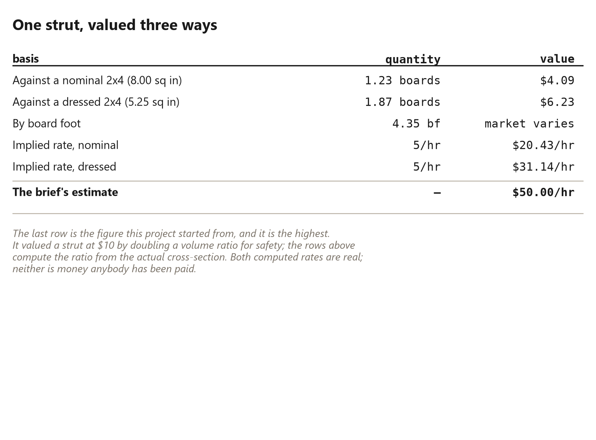

Two bases, and they disagree by 34 per cent.

The third row is in the table because it is what a mill would quote you, and it
is the honest way to trade timber in volume -- but it is no use here, because a
board foot has a price only where somebody is selling one, and that price moves
with species, grade, region and week. I can tell you a member holds
4.35 board feet. I cannot tell you what a board foot is worth
in your county, and I am not going to make one up so that row has a number in
it.

The board-foot view does carry one number worth keeping, though, because it is
the whole harvest in one figure. Two trees of solid wood are
318 board feet before the saw touches them; the kerf takes
40, and the wedges that come off the split are
278 -- a recovery of 87.4 per cent, which is
why the recovery chapter corrects the rounder number this project once
quoted. Every rate in this chapter is a rate on *that* volume, and the
volume is computed from the tree, not assumed.

That leaves two, and they disagree, and the disagreement is the chapter.

## Why the dressed number is the honest one

A two-by-four is not two inches by four inches. It is one and a half by three
and a half, which is 5.25 square inches, not
8.00. It was two by four once -- before it was dried and
planed -- and the name stuck to the rough size while the product shrank to the
finished one. Everyone in the trade knows this. Nobody outside it does.

Now think about which number belongs in a replacement calculation.

The question is: *if I did not have this strut, how many boards would I have to
buy to get the same wood?* The answer has to be in terms of what is actually in
a board, which is 5.25 square inches. So a strut replaces
1.87 boards, not 1.23, and it is worth
$6.23, not $4.09.

Using the label instead of the board **understates** the strut by
34 per cent. Which is the opposite of what you would
expect, and worth sitting with for a second, because the instinct is that the
"nominal" comparison must be the generous one -- *nominal* sounds inflated. It
is the other way round. Pretending a board is bigger than it is makes each
board look like it does more work, so you need fewer of them to match a strut,
so the strut looks worth less.

I want to be uncomfortable about this in public, because the honest correction
moved the number in my favour, and that is exactly when a writer should be
checked hardest. So here is the check: the cross-section of a member,
9.82 square inches, is computed by the geometry, not measured by
me with a hopeful tape. The 5.25 figure is the actual planed
size of the board I would otherwise buy. The 8.88 is a shelf
price. Nothing in the chain is my estimate. If the result flatters me, it is
because a wedge out of a log has more wood in it than a plank does, which is
not a surprising thing for it to have.

And that is the number the rest of this book uses: $31.14 an
hour of ripping, 747 dollars for the whole frame.

## The shelf price is a stack

Now the part that cuts the other way.

The 8.88 on that board is not the price of wood. It is a stack,
and only the bottom layer of it is timber. Above the timber sits the felling,
the haul to the mill, the sawing, the kiln, the planing, the grading, the
stacking, the second haul, the yard, the shrinkage, the staff, the roof over
the lumber aisle, and a margin at every hand-off.

Harvesting your own does not remove that stack. It removes *some* of it and
replaces the rest with you.

Gone: the margin, the hauls, the yard, the retail overhead. Those layers
genuinely vanish, and they are the largest part of why a bought board costs
what it does.

Still there, now done by you: the felling, the bucking, the ripping, the
stacking, the waiting. Those are the 8 days at the front of
the fortnight. You did not delete that work. You took the contract.

The two routes are countable, and the count is the stack made visible. From
standing tree to graded board on a yard's shelf is 14
hand-offs -- felling, hauling, sawing, kiln, planing, grading, trucking,
stocking, selling, every one of them a person with a margin. From standing
tree to member in my frame is 8: fell, buck, split, cut,
joint. The stack is not a metaphor. It is a list, and the shorter list is why
the hour at the log is worth what this chapter says it is worth.

Never done at all: the kiln and the grading. This is the honest cost of the
method and it belongs here rather than in a footnote. A bought board is dried
to a known moisture content and stamped by somebody whose job is to say it is
what it says. A wedge off my log is green, ungraded, and going to move as it
dries -- which is a large part of why this frame is designed the way it is,
with panels that keep their own edges and a gasket between them.

So the rate is real, and it is also not a discount on a like-for-like product.
$31.14 an hour buys you green, ungraded, home-milled timber of a
section nobody sells, and it is worth that much *because* of the section. It
does not buy you a kiln.

## This is not money anybody has been paid

One last thing, and it is the one I would most like to survive being quoted out
of context.

Every rate in this chapter is a **substitution value**. It is what you did not
spend. It is not what you earned.

$31.14 an hour does not go in a bank. It shows up as an absence:
a trip to the yard you did not make, a line on a card that is not there. That
is a real economic good, and it is the entire argument of this part of the
book -- but it buys groceries only if you were genuinely going to buy the
timber. If the alternative to making struts was not buying struts, the rate is
zero and the hours were a hobby. A good hobby. Still zero.

Which brings me to the number I started with.

When this project began, the brief valued a strut at $10.00 --
$50.00 an hour at this pace. It got there by taking a volume ratio
and doubling it for safety, which is a fine way to sketch and a terrible way to
publish. The honest figure is $31.14. My own opening estimate
was **1.6 times** the number I can actually defend.

I have left that row in the table on purpose. It is the row I would have quoted
if nobody had made me compute it, and there is a version of this book where it
is the headline and everything downstream is 1.6 times too
optimistic. The whole reason this book derives its figures in code is so that
row gets caught rather than repeated.

One last scale to put the rate on, because a rate is only readable next to
another rate. The median worker in this country takes home
19.69 dollars of an extra hour. A carpenter is paid
29.12 dollars an hour. The honest number from this chapter,
31.14 dollars an hour at the log, sits between the two -- better
than the median hour, worse than a carpenter's, and all three are the same
unit, which is the only way a claim about an hour means anything. If your own
hour is worth more than the rate this chapter defends, the yard is the honest
answer and this chapter is the arithmetic of why. The rate is not a wage and it
is not a boast. It is the price of the alternative, computed, and now it has a
scale to sit on.

---

# 54. The Six Values of One Pine

*The same tree, priced six ways: on the stump, as firewood, as sawn lumber, as split stock, as standing structure, and as mortgage payments avoided*

## The Six Values of One Pine

A tree has no price. It has a ladder of prices, and which rung you
stand on decides what the tree is worth — which is why two people
can look at the same pine and honestly quote numbers two hundred
times apart.

This chapter is the ladder, walked one rung at a time, on the
big pine the films priced: 60 usable feet,
15 inches at the butt, 442 board feet
of solid wood. The arithmetic comes from the same module the
twenty-dollar-pine film runs, so the book and the film cannot
disagree about the tree. The lesson the ladder teaches is the
chapter's whole point: **the wood never changes between the rungs.
The design changes what the wood is for, and the value follows
the design, not the tree.**

Chapter 2 walked the chain that prices a board.
This chapter walks the chain that prices a *tree*, and it ends
where Part Two's economics always end — with the honest floor
under the top rungs, printed rather than skipped.

## One tree, six rungs

The ladder, bottom to top, with the arithmetic at each step.

**Standing.** On the stump, the tree is stumpage: its green
weight times the going rate per ton. This pine weighs
1.01 tons green, and at the sawtimber stumpage
the film researched the tree is worth about 24
dollars — the twenty-dollar pine, named for this rung. The
honest footnote belongs right here: a timber buyer mostly does
not want two trees. The price exists; the buyer may not.

**Firewood.** Cut, split and stacked, the stem is
0.41 cords of firewood — a cord being
128 cubic feet of stack, about
90 of it wood — and at 275
dollars a cord, picked up, the tree is worth
113 dollars. Burning is the oldest conversion
there is, and the ladder's lowest full-value rung.

**Sawn lumber.** On a mill, at the film's declared
60 per cent recovery, the tree yields
265 board feet; at 1.50 dollars a
board foot that is 398 dollars of lumber. The
recovery is the author's own estimate — the simulator's honest
packing of the same log into two-by-fours says
45 per cent — and the chapter keeps both
numbers, the way Chapter 13 taught.

**Split stock.** Split into wedges instead of sawn into boards,
at 88 per cent recovery, the same tree yields
389 board feet — worth 584 dollars
at the same lumber price, and 124 board feet more
than the mill kept. The split rung is the first one where the
method's own arithmetic appears, and it beats the mill on the
same tree by 46.7 per cent.

**Structure.** Used as the book uses it — as framing the owner
would otherwise buy — one tree replaces 2,400 dollars
of commercial framing: the shell's framing value, divided by
the two trees that supplied it. The rung is a substitution
value, and the chapter says so again before the ladder is done.

**Financed.** If that avoided framing would have been carried on
a mortgage at the book's illustrative 5,461-style
terms, its lifetime payments come to 5,461
dollars per tree — the nominal rung, the tallest, and the one
most likely to be quoted without its caveats.

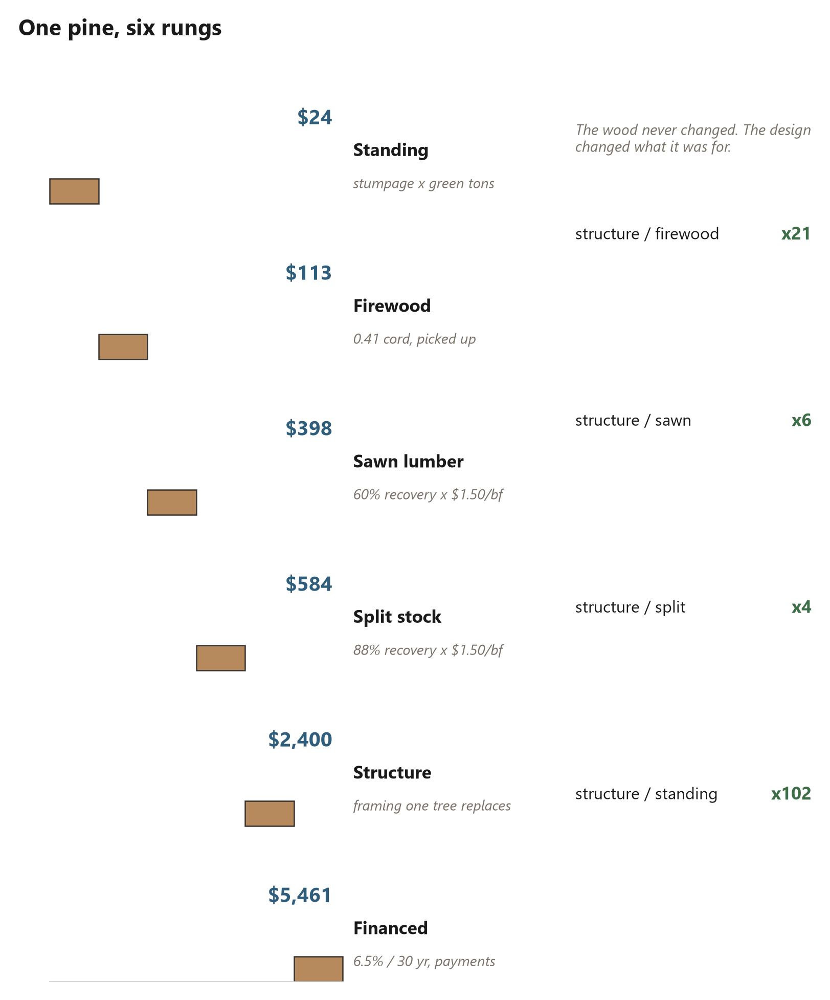

## The ladder, drawn

The drawing is the ladder as a staircase, and it is a staircase
on purpose: the rungs rise evenly, but the *values* do not, and
the gap between one rung and the next is the entire argument.

Look at the distances. The step from standing to firewood is
small — the tree, processed into heat. The step from firewood to
sawn lumber is a few multiples — the tree, processed into boards.
The step from sawn to structure is the jump that matters: the
same wood, asked to *be a building*, is worth on the order of
twenty times its firewood price and six times its lumber price.
And the last step, to the financed rung, is not a step the wood
takes at all — it is a step the *time* takes, the mortgage's
arithmetic standing on the framing's shoulders.

The staircase is the chapter's central object because it
answers the question every visitor to this project asks first:
how can a twenty-dollar tree be worth thousands? It cannot, and
it can. The tree is twenty dollars on the first rung and
thousands on the fifth, and nothing about the tree changed on
the way up. The ladder is the explanation, drawn.

## The wood did not get better

The ratios that embarrass the ladder, and the sentence the
chapter exists to make stick.

Structure against firewood: the framing one tree replaces is
worth 21 times what the same tree burns for.
Structure against sawn lumber: 6 times. Even
against the split stock the method itself produces, the built
structure is 4.1 times the stock's price. And
the wood is *identical* on every rung — the same board feet, the
same fibres, the same pine. Nothing was added between the stump
and the frame except decisions.

That is the whole economics of the method, stated as a ratio
instead of an argument. The tree's value was never in the tree;
it was in what the design asked the tree to do. Firewood asks
for heat, and the tree answers with heat. A mill asks for
rectangles, and the tree answers with what rectangles fit. A
frame asks for structure, and the same tree answers with a
building's worth of it — because a triangulated frame is the
one customer that pays for the whole log, in its own shape, and
the shape is the tree's idea. The ladder does not flatter the
tree. It exposes the customers.

## What the ladder does not say

The honest floor under the top rungs, because a ladder printed
without its caveats is a sales document, and this book is not.

**Substitution is not income.** The structure rung's
2,400 dollars is what the owner did not *spend*, not
what they *earned*. It converts to groceries only if the framing
was going to be bought anyway, and the builder who was never
going to buy a frame has built a shed with their own hours
instead of earning a wage — the same distinction Chapter
45 drew for the fortnight, drawn here for the tree.

**Financed value is future payments, not today's.** The top
rung assumes the avoided framing would have been mortgaged at
the book's illustrative rate for its full term, and then adds up
every payment. It is a real number about a counterfactual
borrower, not a cheque. Quoted alone, it is the ladder's most
flattering rung; the chapter keeps it, labelled, because the
films priced it and the book's honesty extends to its own
sources.

**The owner's net rung.** What the tree is actually worth to
the person standing on the ladder: the structure value, minus
the labour of converting it — 40 hours at the
owner's wage — minus the cash the build still spends. The
arithmetic lands near 1,000 dollars of net value per
tree, and that is the rung this book would build on: not the
tallest rung, the *owned* one.

**Different owners stand on different rungs.** The ladder's
real lesson, stated last because it is the point: the tree's
value is not a property of the tree, it is a property of the
owner's position. The timber buyer stands on rung one, the
firewood seller on rung two, the mill on rung three — and only
the builder stands on the rung where the design, not the
market, sets the price. The book is for the people on that
rung.

---

# 55. Where the Fuel Actually Goes

*Most of the fuel raises nothing at all.*

## Where the Fuel Actually Goes

There are two ledgers in a build and only one of them gets written down.

The money ledger decides whether you can afford the thing. The other one
decides whether you can finish it. It is kept in calories, it is settled every
evening whether you look at it or not, and running out of it does not feel like
running out of money -- it feels like deciding, quite reasonably, to do the rest
next weekend.

So this chapter counts it. Every part of one building, every motion that part
takes to get from the pile to its place, and what each motion costs a body.

Before a single number: **this is not the fortnight.** The fortnight is one
person and a bare frame, and there is no metabolic model of it, because nobody
wired a body to me while I was ripping. What there *is* a model of is the
assembly line's own product -- the Iris-25, a finished house of
4.39 metres' radius, 15 stations, 1,322
parts, built by a crew of 2. That is a bigger, more finished and more
crowded job than anything else in this book, and every figure below is per
person on *that* build.

I am using it anyway, because the shape of the answer does not depend on which
dome it was, and the shape of the answer is the whole point.

## One house, counted in parts and motions

The method is mechanical. Take the element list -- all 1,322 pieces,
frame and floor and cladding and fixtures -- and turn each one into the same
7 motions: walk to the pile, lift, carry it over, place it, fasten
it, stand back up, rest. Each motion gets a duration from the part's own mass,
distance and height, and a cost from published activity data. Then add them all
up.

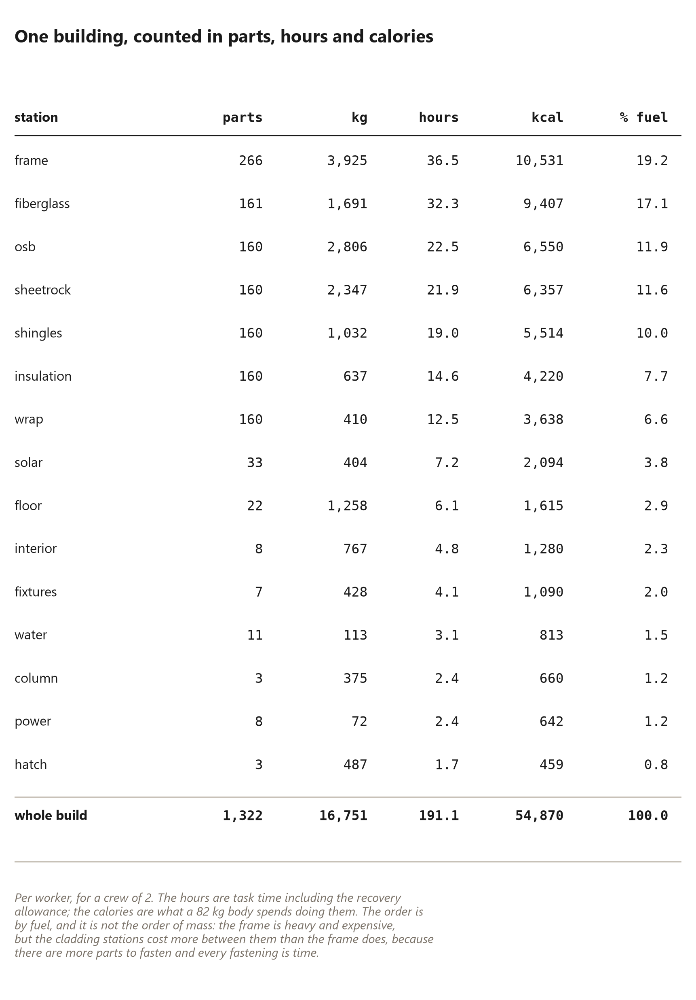

16,751 kilograms of building. 15,100 of it passes
through one person's hands -- less than the total, because anything over
23 kilograms is a two-person lift and the load splits.

191 hours each. That is 23.9 shifts of
8 hours, and it costs 54,870 kilocalories per
person, 109,741 for the pair.

The figure worth holding is not the total, though, because the total only tells
you how big a house somebody ordered. The *rate* is what travels:
**2,298 kilocalories a shift.** That is a working day, and it sits
on top of a resting requirement of about 1,749 a day that a body
wants whether it builds anything or not.

Now the unflattering one. Averaged across the whole build, that comes to
334 watts, or 3.50 METs. The occupational-physiology figure
for what a person can sustain across a full shift is 350 watts.
There is almost nothing in that gap. The model is not saying this is comfortable
work. It is saying the work sits at the top of what is sustainable, and that it
only stays there because 17.5 per cent of the timeline is an
explicit recovery allowance -- 33 hours of standing still,
scheduled rather than hoped for. Take the rest out to go faster and you do not
get a shorter build. You get a shorter *run* of builds.

Read the stations by fuel rather than by weight and the order surprises. The
frame is the single most expensive station, 10,531
kilocalories across 266 parts. But the layers that go on
over it, between them, weigh 2.3 times what it weighs and
cost 3.4 times its fuel. Fuel outruns mass, every time,
because fuel follows part count rather than kilograms. The heavy part of a
building is not the tiring part of a building.

For scale, the crew's total is 1,372 slices of bread. Or 1,045
bananas. Or 44 days of somebody eating normally and doing nothing
else with it.

That last framing is not a joke, and it is the most practically useful line in
the chapter. A build of this size is a second full-time diet running alongside
your first one. If you are doing it solo, at a distance from a shop, on a
schedule you set yourself, then food is a material and you have to lay it in
like any other -- and the failure mode of getting it wrong is not hunger, it is
an afternoon that quietly does not happen.

## The fastening surprise

Now split the same total by motion instead of by station, and something falls
out that changed how I think about joints.

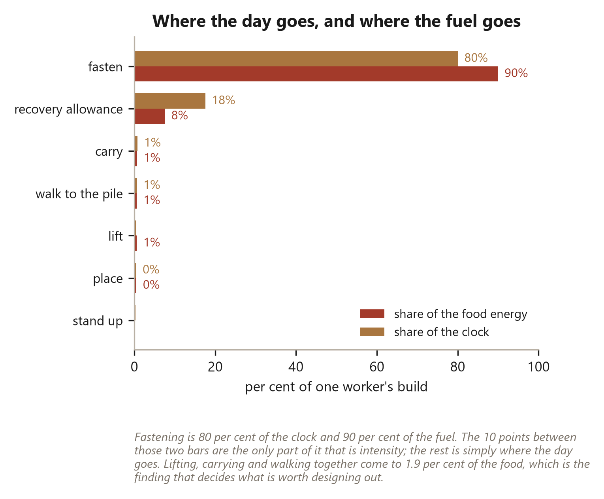

**Fastening is 90 per cent of the food energy.** Everything else
in the build -- all the walking, all the lifting, all the carrying, all the
placing -- shares what is left.

Before that gets quoted as something it is not, here is the honest version:
fastening is also 80 per cent of the *clock*. Only
10 points of that 90 are intensity. The
other 80 are simply where the day goes. Driving a screw is
not brutal work. There is just an enormous amount of it -- 153
hours of it on this build -- and that is a different claim and a more useful
one.

Notice the recovery allowance running the other way, too: 17.5 per
cent of the clock and only 7.5 per cent of the fuel, because
standing still is cheap. That asymmetry is the whole argument for the allowance,
in one picture. Rest buys back a large slice of the clock for a small slice of
the fuel.

And then the number I did not expect.

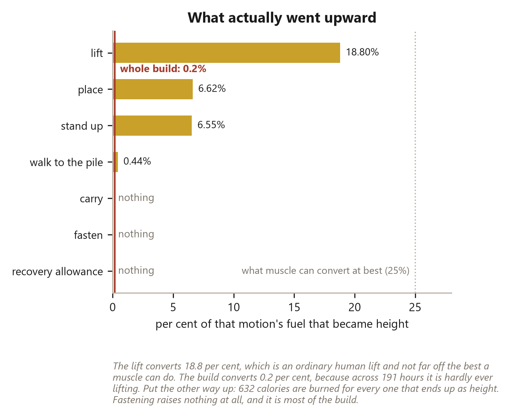

Of the 54,870 kilocalories one person spends on this house, the
amount that ends up as *height* -- as mass actually raised against gravity,
which is the only part of a build that is physics rather than physiology -- is
87 kilocalories. 0.363 megajoules.
**0.2 per cent.**

Turn it the other way up: 632 calories burned for every one
that went upward.

The first time that fell out I assumed the model was broken. It is not, and the
proof is in the same chart. Ask the question of the *lift alone* and the answer
is 18.8 per cent -- an ordinary human lift, and not far short of
the 25 per cent that is the best muscle can convert under any
circumstances at all. The body is fine. While it is lifting, the body is close
to its own ceiling.

There is one more thing in that lifting work worth pulling out, because it
contradicts something everybody has been told. Split the raising by which part
of the body did it and the trunk accounts for 65 per cent of it,
the arms 20.4, the legs only 14.5. The reason is
unglamorous: your torso is the heaviest thing you lift all day, and you lift it
every time you stand up from a squat. "Lift with your legs" is still right, but
not because the legs do most of the work -- they do the least of it. It is right
because it changes the *path* the trunk travels, and the trunk is the load.

It is just hardly ever lifting. Lifting, carrying and walking together come to
1.9 per cent of the fuel -- 326 kilocalories for
the lifting alone, out of 54,870. The rest of the time the body is
*holding* --
holding a posture, holding a part in place, holding an arm up -- and holding
something still does no mechanical work whatsoever while costing a great deal to
do. That is not a defect in the model. That is what manual labour is, and it is
why a day of light work you would describe as "not lifting anything" still
leaves you unable to start another one.

Which makes the sentence to take away from this chapter a slightly strange one.
**The screw does not go up. The arm does.** And then it comes back down, and
doing that for 153 hours is the build.

## What this says about the hardware

If most of the fuel is in fastening, the design question changes.

The obvious instinct is to make fastening faster: a better driver, a better bit,
a magnetic holder. All worth doing. But the arithmetic above says something
sharper -- a joint that needs *fewer* fasteners beats a joint that is faster per
fastener, because the count is the thing being multiplied.

This frame carries 120 brackets, 960 pilot holes and
960 screws, and -- from 51 -- exactly that many at
every diameter in the handling band. Each of those 960 is a fixed
metabolic tax, paid whatever size dome you are building.

It is also, I have to admit, the number I would be most tempted to increase.
When a joint worries you at four in the afternoon, the instinct is to put
another screw in it. This chapter is the reason to think twice: one extra screw
per bracket is another 120 fastenings, on every dome, forever, and
it will not be the thing that saves you. If a joint is not right, the fix is
upstream in the jig, not downstream in the driver.

Two parts of this design are already doing that work, and both are worth naming
as energy decisions rather than as geometry ones.

The seam key of 16 closes a joint with a shape instead of with
hardware. Every seam it closes is a seam nobody drives fasteners into.

The panel raise from 8 is the
larger of the two. 40 panels go up rather than 120
loose members -- and more to the point, each one goes up *already fastened*, on
a bench, at waist height, on the ground. The fastening did not disappear. It
moved out of the overhead posture, which this model prices higher for exactly
the reason your shoulders already know.

I will not overstate either of them. The key is another milling operation, and
the panel approach wants a cable, a winch and somewhere to hang them. Neither is
free. But both are trades of *fuel* for *setup*, and setup is paid once and
amortised across every dome after it, while fuel is paid again every single
afternoon.

## What is measured and what is modelled

This ledger is a mixture, and the mixture matters more than the total.

**Computed.** Every mass, every placement height, every carry distance, off the
geometry and the element list. The mechanical work is *m g h*, with nothing
estimated in it.

**Counted.** The motions. Seven per part, 1,322 parts, the same
sequence for all of them.

**Modelled.** The calorie cost of a motion. That is 13 published
constants -- activity intensities, a load-carriage equation, a resting-rate
formula, a recovery allowance -- listed by name and source on their own page
rather than buried. Change one and this chapter changes with it.

**Weakest link, named.** Fastening time is a *residual*. The model takes the
catalogue's labour estimate for a part, subtracts the walking, lifting, carrying
and placing it has computed, and calls whatever is left fastening. So
"90 per cent is fastening" is really "90 per
cent is everything that is not handling" -- fitting, fiddling, checking, finding
the bit you put down somewhere. I am comfortable with the conclusion anyway,
because the conclusion does not rest on the residual. It rests on the handling,
and the handling is the part that was computed. Lifting really is
0.6 per cent of the fuel however you choose to label the rest.

**Not metered at all.** The felling and the bucking. This ledger begins at the
stockpile, and the 8 days in front of it -- a chainsaw, a
slope, a log that does not want to move -- appear in none of these numbers. If
anything here is optimistic, it is that.

---

# 56. Less Skin for the Same Floor

*The cheapest square foot of wall is the one that is not in the drawing.*

## Less Skin for the Same Floor

A wall gets paid for four separate times.

It is paid for the day the sheathing is bought. Again the day it is
insulated. Again every time it wants paint, flashing, membrane or a walk
round with a caulk gun. And again every winter for as long as the building
stands, in heat that leaves through it. Four bills, one surface, and only
the first of them ever appears on a materials list.

Which makes the cheapest square foot of wall in any building the one that is
not in the drawing.

That is the whole argument for building round, stated without enthusiasm. A
sphere is the shape that wraps a given volume in the least surface. Cut one
in half, stand it on the ground, and most of that property survives the cut.
The same floor, enclosed the round way, takes less skin around it.

It is true. It is also smaller than the people who repeat it believe, a good
part of it turns out not to be efficiency at all, and it is a property of
*small* buildings rather than a property of domes. There is a size above
which the box wins outright, and this chapter finds it.

None of that is an argument against building round. It is an argument
against quoting the good number on its own, which is what I did for about a
year, in public, with a straight face.

## The same floor, two envelopes

So here are two buildings with exactly the same floor.

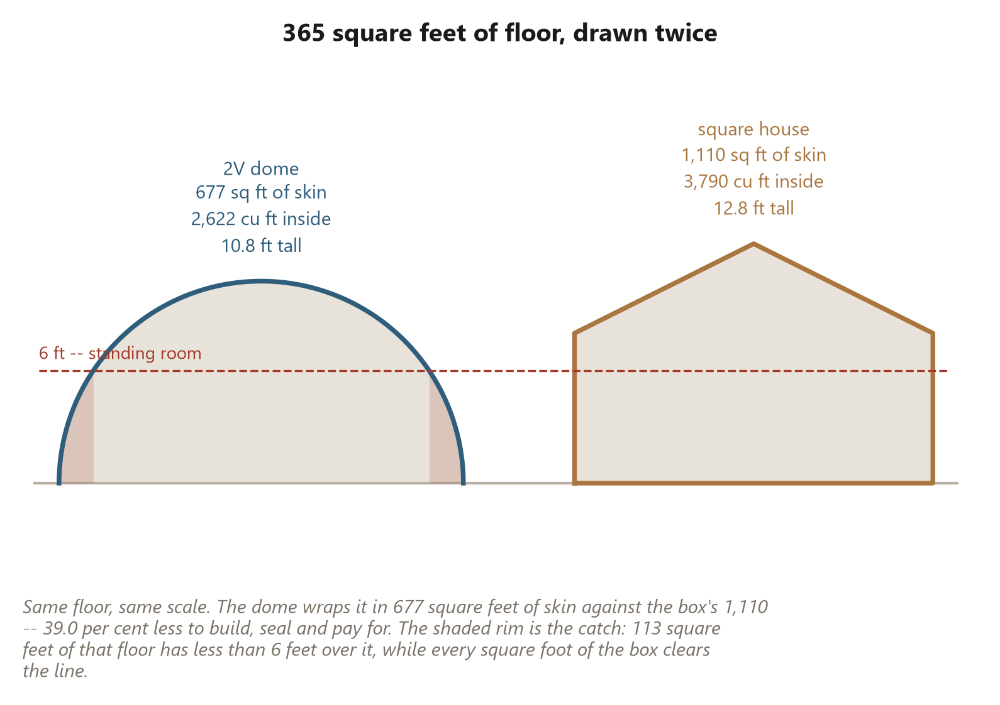

One is this book's dome: 365 square feet of floor,
10.8 feet to the crown -- which for a hemisphere is also its
radius, a coincidence that stops being charming later in this chapter. The
other is a square house of identical floor area, 19.1 feet on a
side, with 8-foot walls and a gable roof reaching
12.8 feet at the ridge.

The box is drawn fairly. It is square rather than oblong, which is the least
perimeter a rectangle can have for its floor, so it is the best case for its
own shape rather than a straw man. Its corners are not penalised, even
though corners are where boxes leak heat and where boxes rot. And the dome
is measured as what it actually is -- flat triangles -- rather than as the
ideal sphere it approximates, which costs it a little surface it would not
have if geometry were doing the building.

The dome's shell comes to 677 square feet. The box's comes to
1,110. The difference is 433 square feet of
building that simply does not exist in the round version:
**39.0 per cent less.**

That is the number. Now the part that gets left off the poster.

Read the volumes in the drawing. The dome holds 2,622 cubic
feet. The box holds 3,790. At this size the dome is not only
wrapping the same floor in less skin -- it is wrapping
30.8 per cent less building. Some of that saving is
shape. Some of it is that you bought less house.

Ask the question the other way round, then. Not skin per square foot of
floor, but skin per cubic foot enclosed. The dome still wins, and it wins by
11.8 per cent rather than 39.0. That is the
shape-only figure at this size, and it is roughly a third of the headline.

The two do not stay apart. Past 1,015 square feet of floor the
dome begins enclosing *more* air than the box rather than less, because a
hemisphere has to gain height to gain width and a stud wall does not. Above
that line the volume deduction disappears and the surface margin is real all
the way through. Below it -- which is where this book's dome sits, and where
almost every dome anybody actually builds sits -- part of the win is a
smaller building wearing the same floor plan.

Both of those are worth knowing. Only one of them ever gets said.

## What the saved skin is worth four times over

Take the 433 square feet at face value for a moment and walk
them through the four bills.

**Bought once.** The dome's shell is 21 sheets of
four-by-eight against the box's 35, so it starts
14 sheets lighter before anything else has happened. Each
of those sheets is also a delivery, a lift, a set of fasteners and a stretch
of the work 55 prices in calories rather than money.

**Insulated once.** The same area over again, in whatever is chosen to fill
it, priced per square foot like everything else.

**Sealed repeatedly.** This is the bill nobody budgets and everybody pays,
and it is the only one of the four that arrives forever.

**Heated every winter.** At a wall assembly of 0.060 BTU per hour
per square foot per degree -- an ordinary insulated wall, handed to both
buildings identically -- the dome loses 40.6 BTU an hour per
degree against the box's 66.6. Across a season of
4,200 heating degree days that is 4.1 million BTU
against 6.7.

And this is where I have to take something back.

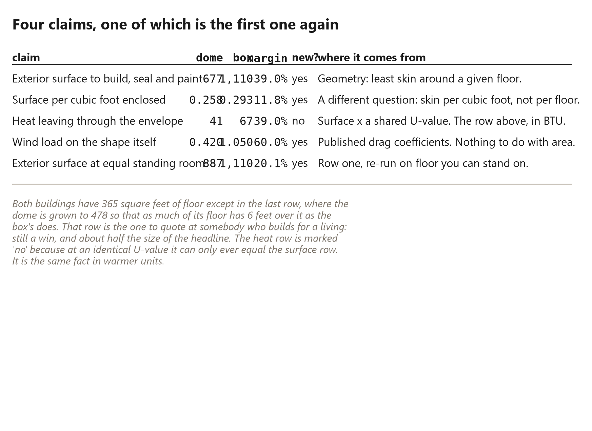

**39.0 per cent less heat is not a second finding.** It is the
first one wearing warmer units. Heat through an envelope is area multiplied
by a U-value, both buildings were given the same U-value, so the heat margin
*cannot* come out any different from the surface margin. It is arithmetically
forbidden. Saying "less skin, and less heat" sounds like two wins and is one
win said twice, and I have said it that way on camera.

The wind figure is genuinely independent. 0.42 against
1.05 -- 60.0 per cent less drag -- comes from
published coefficients for a hemisphere and a cube and has nothing to do
with area at all. That one may be quoted beside the surface number without
double counting.

Then one deduction larger than everything above it.

Equal floor area is not equal usable area. A hemisphere meets the ground at
a tangent, so its ceiling arrives at its floor around the whole perimeter.
Call standing room 7 feet -- generous; habitable ceilings are
held higher than that -- and only 225 square feet of this
dome's 365 qualify. That is 61.7 per cent of the
floor, and 140 square feet of it that you can reach on your
knees. 43 draws the whole curve; the shaded rim in the
drawing above is the same fact in elevation. Every square foot of the box
clears the line.

So grow the dome until it stands up over as much ground as the box does. It
needs 505 square feet of floor to get there, and
937 square feet of skin to wrap it, and the margin falls to
**15.6 per cent.**

Still a win. Roughly half the one on the poster, and the only version of it
I would put in front of somebody who builds for a living.

## Where the box wins

The margin is not a property of domes. It is a property of small domes, and
the chart says so more bluntly than I would like.

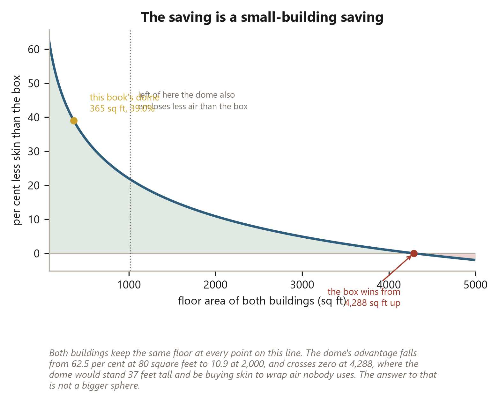

11 sizes, from 80 square feet to
5,000, both buildings holding the same floor at every point. The
saving starts at 62.5 per cent for something hut-sized. It is
39.0 at this book's dome. At 707 square feet
-- the largest dome in the flat-rate table of 51 -- it is
27.8. By 1,015 it is 21.7, and
by then the dome has stopped being the smaller building too.

And at 4,288 square feet it is gone. Zero. Above that floor
area **the box takes less skin than the dome**, and every sentence in this
chapter runs backwards.

The reason is in the drawing and not in the arithmetic. A stud wall is
8 feet tall whether the house is small or enormous. A
hemisphere cannot do that: to cover more ground it must stand taller, and at
the crossover it is 37 feet to the crown and buying skin
to wrap a column of air that nobody will ever use, heat or reach.

That is not the only place the box wins, and the others do not need a chart.

Boxes stack. A second storey doubles the floor for the price of a deck,
adding no roof and no foundation, and a dome cannot do it at all -- a dome's
second floor is a mezzanine inside the same shell, competing for the same
volume. Boxes share walls: two terraced houses each delete an entire
elevation, and a row of them beats any dome on skin per floor so decisively
that there is no argument to have. Boxes take sheet goods whole, where a
triangle takes a rectangle and hands you the offcut. And boxes fit
furniture, appliances, cabinets, baths and doors, every one of which is
manufactured for a flat vertical wall that a dome does not have.

The honest summary is narrow and worth having anyway. For a single, small,
detached, one-storey building, on its own ground, the round shape wraps the
same floor in less skin, and that saving lands four times on every bill the
building will ever send you.

Outside those conditions, build a box.

Inside them, the dome still has the rim problem this chapter kept pointing
at -- 140 square feet of floor with no room to stand up in.
The fix for that is not a bigger sphere. It is the cheapest wall in the
whole build, and it is 57.

---

# 57. The Cheapest Square Footage in the Building

*Standing the shell on a short straight wall buys floor, headroom and usable edge for the least money per square foot of anything in the build*

## The Cheapest Square Footage in the Building

A dome has one weakness, and it is honest about where it is: the edge. A
hemisphere comes down to the floor at a tangent, so the ring of floor around
the rim has a ceiling sloping straight at it. You can stand in the middle of
the room. You cannot stand anywhere near the wall.

On the reference floor this book's performance chapter is drawn on --
314 square feet -- only 174 of those feet are under
enough ceiling to stand up under. That is 55 per cent of the floor
you paid for, and the rest is a dead ring.

The fix is the cheapest wall there is. A short, straight stem wall stood under
the rim of the shell, lifting the whole dome a few feet off the ground. It
carries no thrust, because the ring at the base of the frame already takes
that. It is just a wall of height. And a wall of height is exactly what
converts a dead ring into the cheapest square footage in the building.

## The pony wall ladder

The ladder is four rungs, all computed from the same geometry, at the declared
cost of 4.20 dollars a square foot of wall:

| wall | usable floor | share usable | the wall costs | floor gained | $/sq ft gained |
|---|---|---|---|---|---|
| none | 174 sq ft | 55% | nothing | -- | -- |
| 2 ft | 245 sq ft | 78% | $528 | +71 | $7.4 |
| **3 ft** | **272 sq ft** | **87%** | **$791** | **+97** | **$8.1** |
| 4 ft | 292 sq ft | 93% | $1,055 | +117 | $9.0 |

Read the bold row. The 3-foot wall is 188 square feet of ordinary
wall, 791 dollars. It buys back 97 square feet of
floor you already paid for and could not use -- a 56 per cent
increase in usable room -- at 8.1 dollars a square foot.

Nothing else in this build sells floor at 8.1 dollars a foot. Not
the frame, not the skin, not the glass. The wall is the one part of the
building where the floor is already there and only wants lifting.

The other rungs are worth a look, because each has a different character.
The 2-foot rung is the bargain: 71 feet for 528
dollars, the cheapest dollars on the ladder. It leaves a fifth of the floor
unusable, but for a workshop or a greenhouse -- rooms where you bend over
the work and do not care about the walls -- it is the right rung. The 4-foot
rung is the wrong one at the far end: it spends 1,055 dollars to
buy 117 feet, the last of them at 9.0 dollars a
foot, and the next section explains what else that height starts costing.
The 3-foot rung in the middle is the one for a room people live in, and the
reason it is the bold row is the third section of this chapter.

There is one more thing the wall buys that the table does not show, because
it is not a square foot: a band of straight wall around the room. On a bare
hemisphere the ceiling curves down to the floor everywhere, so a door has to
be cut out of a curved surface and a cupboard has to stand away from the
wall. On a 3-foot stem the first three feet of every wall is a vertical,
rectangular surface -- doors are rectangles in it, windows are rectangles in
it, shelves and counters stand against it. The stem wall does not just buy
floor. It buys *furniture wall*, and that is the difference between a room
in a dome and a tent with a dome over it.

The same band is where the heavy and rectangular things live. A door is a
rectangle; cut one in a bare shell and you are building a curved door, or
boxing a square out of a surface that slopes two ways at once. On the stem the
door is just a door, and the windows are stock units instead of specials. The
band also swallows the clutter a dome has nowhere else to put -- the water
tank, the batteries, the shelves, the coat hooks -- which would otherwise
stand off the curved wall and eat the floor the wall was bought to save.

## Why the edge is the expensive part of a dome

It is worth understanding *why* the edge is dead, because the number comes out
of one simple fact: a circle meets a flat floor at a tangent.

Headroom in this comparison means a 6.7 foot ceiling. On a dome
10 feet in radius, you can stand only where the shell is at
least that high. Walk from the centre toward the wall and at some radius the
ceiling drops through 6.7 feet and keeps going, all the way to
zero at the rim. Everything past that radius is floor with a sloping lid over
it -- geometrically fine, humanly useless.

That dead band is not a strip. It is the whole outside of the circle, and it
is where the *most* floor lives, because a circle's area lives at its outside.
It is why the dome's cheapest room is bought by moving the shell up, not by
anything you do to the frame.

The same geometry explains why the wall is cheap compared to every other way
of buying that floor back. Want the floor by making the dome wider instead?
Then the frame grows with the diameter and the skin grows with the square of
it -- every extra foot of room is bought with longer sticks *and* more skin,
which is the most expensive way there is to buy a foot. Want it by the wall?
The wall grows as a line -- one more foot of wall all the way round is a
fixed, small number of square feet of plain wall at
4.20 dollars each. The shape of the dome makes the rim the
expensive place to stand; the shape of the wall makes the rim the cheapest
place to fix.

A taller shell would do the same job, but a taller shell means a bigger frame
everywhere -- every member, every panel, the whole fortnight. The stem wall
buys the height in exactly one place: at the rim, where the room is missing.
That is the whole trick, and the ladder table is what the trick costs.

## Where the ladder stops paying

The ladder is not free forever, and its own columns say where it stops.

Look at the right-hand column. The rate climbs: 7.4 dollars a
foot, then 8.1, then 9.0. Each added foot of wall buys
less floor than the one before it -- 71 feet, then 97,
then 117 -- because the ring of new standing room gets thinner as
the ceiling profile flattens out. The wall is still cheap. It is just not as
cheap.

And past a certain height the wall stops being a free ride in a second way: it
starts acting like a real wall. A 3-foot stem is a curb. A 6-foot stem is a
cylinder the wind pushes on, one that needs its own ties into the ring, its
own sheathing, its own foundation edge. Somewhere past that you have built a
round box and set a hat on it, and you are paying for a conventional wall *and*
a dome frame on the same site.

There is also a water detail the wall introduces that a bare dome does not
have, and it belongs to the chapter on the brim (Chapter 58):
where the shell meets the top of the wall there is now a horizontal seam
between two materials, and it is exactly the kind of joint water finds. The
brim throws the rain past it; without the brim, the wall is a gutter fed by
its own roof. The two chapters are one decision: the wall buys the floor, the
brim keeps the wall.

The top of the wall wants a cap, and it is the one piece of metal the rest of
the dome never asks for: a strip of flashing lapped down over the wall face and
up under the shell edge, so the end-grain of the wall's top plate is never the
thing the weather meets. It is a cheap part, and it is the part first builds
leave off, because it hides under the hat and nobody is checking.

The honest stopping point is where the next rung costs more per gained foot
than the next size of dome would. This book's own dome -- the one 3 trees
fill -- is 365 square feet for the same fortnight of work as
the 314 foot reference floor. If you want more than the 3-foot rung
buys, the better answer is usually not a taller wall. It is the next dome up,
where the same hundred and twenty members stand further out and the floor
comes along for free.

The wall buys back the edge of the floor you already have, for
791 dollars, and nothing else moves. The bigger dome -- the
21.6 foot one 3 trees surround -- buys that edge by buying the
room over again, spending the one thing a dome exists to save, the subject of
Chapter 56. The wall is the answer when you are short of edge;
the bigger dome when you are short of room.

So the ladder has a last rung, and on this floor it is the 3-foot one:
272 usable feet for 791 dollars, at
8.1 dollars a foot. That is the cheapest room in the building, and
this chapter is the receipt.

---

# 58. The Roof Is Already a Gutter

*An overhanging brim throws water clear of every joint and collects it in the same move, and the annual catch off a dome this size is not a trivial number*

## The Roof Is Already a Gutter

The brim around a dome -- the overhanging ring of the hat -- looks like
decoration. It is not. It is the detail that keeps water out of the building,
and it does two jobs at once.

The first job is the boring one that matters most. Rain runs down a dome
shell, and without a brim it runs straight into the ring of joints at the
base: the seams, the brackets, the screws, the point where timber meets
footing. Every one of those is a place water can sit, wick and work on the
frame for years. The brim throws all of it clear of the wall before it ever
gets there.

The second job is the one this chapter is about. The same overhang is a
catchment. It catches the rain it throws, and the annual number off a dome
this size is 7,259 gallons. Not a trivial number, and it costs
no extra roof to collect it, because the roof was already a gutter.

## Where the water goes, with and without a brim

Follow one raindrop through both buildings.

**Without the brim.** The drop lands on the upper shell, runs down a panel,
across a seam, down onto the lower panels and off the rim -- straight onto
the base joints and the splash line at the bottom of the wall. Some of it
wicks into the seam keys. Some of it follows the brackets down the inside
face. Over a wet season the bottom ring of the frame is damp more often than
it is dry, and the footing is in a permanent puddle of its own making. The
building is not leaking into the room. It is leaking into its own skeleton.

**With the brim.** The same drop lands on the shell, runs down to the hat,
and hits the overhang. The hat's edge is further out than the wall --
10.4 feet from the centre, against 8.9 feet for the
rim of the hat itself -- so the drop leaves the building at a point where
there is nothing below it but ground. It drips clear. The base joints stay
dry because the rain never arrives.

The brim does not stop at dripping clear. Put a gutter lip on the hat's edge
-- the same metal the hat is already made of -- and the drip becomes a
stream, and the stream runs into a tank.

The lip is also the only gutter this building will ever have, and it wants the
same care as any gutter. Leaves, needles and dust wash down the shell and
arrive at the lip, and a gutter is a gutter -- it clogs where the downpipe
narrows. This one is a ring at the hat's edge, so the autumn job is a walk
round the building with a ladder and a broom. In snow country the brim is a
flat shelf that holds ice, and an ice dam on the hat can weigh more than the
metal was priced for.

One of those two buildings has a water system. The other has a slow leak into
its own frame. The difference is the width of the hat, 18
inches.

Wider is not automatically better, and this is the place to say why, because
it is the same trade everywhere on the shell. A wider brim catches more --
every extra inch of radius is real catchment -- and it also catches more
*wind*, and it shades more wall, which is a virtue in summer and a cost in
winter. The 18 inches this book prices is the width that
clears the wall, shades the windows, and stays on the right side of the wind
math. The number is a choice, declared once and used everywhere, not a
discovery.

## The annual catch

The catch is worth working out properly, because the number sounds like a
mistake the first time you see it.

The inputs, all declared before they are used: 40 inches of rain
a year, the regional average; a runoff coefficient of 85 per
cent, which is what a metal roof sheds -- the rest evaporates, splashes and
never reaches the lip; and the 314 square foot reference dome,
whose hat stops at a plan radius of 8.9 feet.

The catchment is not the sloped area of the hat. Rain falls straight down, so
what catches it is the *plan* area -- the circle the brim's edge describes
over the ground. At 1.5 feet of overhang that circle is
343 square feet.

Now the arithmetic. 40 inches times 0.623 gallons
per square foot per inch of rain, times 343 square feet of
catchment, times the 85 per cent that actually sheds:

**7,259 gallons a year. 19.9 gallons a day, on
average.**

It is worth saying what that number is not. It is not metered -- nobody has
stood under this dome with a bucket for a year. The rainfall is a regional
average, not a guarantee, and a drought year is exactly the year the catch
goes dry. But the arithmetic is the honest plan-view arithmetic, with every
efficiency declared on the line rather than buried.

Size the tank against use rather than rain. Two people at
50 gallons a day empty a 1,000 gallon tank in
20 days -- so a full tank is a three-week buffer against a dry
spell, and in an ordinary year it refills 19.9 gallons a day.

At utility prices the whole year's water is worth about 44
dollars. Say it plainly: collected rain is nearly free water either way, and
the money argument is a weak one. The real argument is the 20
days of water that keep flowing when the well does not. That is what the
number buys.

The same 7,259 gallons appear in the ten-points list at the
end of the films, computed by this same function. That is not a coincidence
and it is not a copy: the film and this book read the one water model, so
they cannot drift apart. Wherever you meet this number, it is the same
dome, the same rain, the same arithmetic.

## What the catch is actually good for

The honest uses first, because the dishonest one gets said first everywhere
else.

**Not drinking, without treatment.** Rain off a roof has been through bird
droppings, dust and whatever the shell sheds, and the tank is warm and dark,
which is a polite description of a biology experiment. Filter and treat it or
keep it out of your mouth.

**Everything else.** Irrigation is the obvious one, and the dome's own
garden sits in its shadow. Flushing and washing take the 19.9
gallons a day without a second thought. And the quiet use that matters most on
a rural site: a buffer against a dry well. A well that fails in August is a
crisis with an empty tank and an inconvenience with a full one.

The tank belongs under the pad, not beside it. Three reasons, all boring and
all true. The pad is already excavated, so the hole is half dug. The ground
under a pad is shaded and frost-protected by the pad itself, so the tank
neither cooks in summer nor splits in winter. And the weight sits on
compacted ground that is already carrying a building, instead of in a
second hole you had to dig and backfill for no other reason.

Two details make the difference between a tank and a pond, and both are
cheap compared to the misery they prevent. A first-flush diverter -- a
simple standpipe that captures the first few gallons of every storm, the
ones carrying the dust and the droppings, before the clean water is allowed
into the tank. And an overflow, sized like it is going to be used, because
40 inches of rain will overflow any tank ever built and the
water has to go somewhere that is not the pad. Skip either and the tank
teaches you the lesson within a year.

The plumbing between the lip and the tank is simple, and it has two jobs nobody
thinks about until the tank overflows. A leaf screen at the lip keeps the big
stuff out of the pipe, because the first-flush diverter catches only the first
of the dirt, not the last. One downpipe carries the whole ring's
19.9 gallons a day down the wall and under the pad to the tank,
and it wants an air gap so a full tank cannot back up into the pipe and out the
lip. That is the whole of the plumbing: a screen, a pipe, a gap.

One more job the brim does that is worth a line, because it is free with the
same metal: shade. The overhang keeps the summer sun off the upper wall in
the middle of the day, and it keeps the rain off the base ring all year.
Every one of those jobs is done by a piece of the building that was already
there, doing the first job -- keeping the frame dry.

That is the whole point of this chapter. The gutter is not an accessory a
dome can have. It is the brim the dome already wears, and the only question
is whether you let the water run off it or into a tank.

---

# 59. A House That Gets Warmer Every Winter

*Build the skeleton once and add layers to it for as long as you own it: the shell ladder turns a shelter into a house in steps you can afford one at a time*

## A House That Gets Warmer Every Winter

Most houses have two states and nothing between them: finished, or unfinished.
Unfinished means tarps and regret. Finished means the whole invoice at once.

A dome shell can be neither, permanently and on purpose.

The skeleton of a dome is the frame; the frame carries the skin; and nothing
about the skin needs to be decided on the day the frame goes up. You can
stand a bare shell this autumn, quilt a first layer under it this winter, add
a second next year, and keep going for as long as you own the place. Each
step is affordable on its own, each step makes the building better, and none
of them ever requires undoing the one before.

The ladder also becomes a habit, and that is the part the table does not show.
One layer a winter is a small, repeatable job -- a weekend under the shell, the
same as splitting firewood or cleaning a chimney -- and it lands in the season
that needs it. By the time the house is fully quilted you have stopped noticing
the cold and started noticing the ritual: the first hard frost is the cue, the
layer goes up, and the house is a little warmer than the winter before. You buy
a winter at a time, in the order the cold arrives.

That is the shell ladder, and this chapter is the ladder with its prices. The
numbers are for the Split-Log Homestead -- a 39.4 foot dome with
1,217 square feet of floor -- because that is the dome the park
model computes its ladder for, and a heating number means nothing without the
building it came off.

This book's own dome is smaller than the flagship the table prices, and the
ladder scales to it the same way: the per-square-foot price holds, the total is
smaller because the shell is smaller, and the order of the rungs does not
change.

## The shell ladder, rung by rung

Each rung is one quilted layer of recycled fabric under the shell, at a
declared 1.6 R-value and 1.1 dollars a
square foot. The ladder runs to 7 layers:

| layers | R-value | heating, $/yr | cost so far |
|---|---|---|---|
| 0 | 1.5 | 8,260 | nothing |
| 1 | 3.1 | 3,955 | $2,486 |
| 2 | 4.7 | 2,600 | $4,973 |
| 3 | 6.3 | 1,937 | $7,459 |
| ... | ... | ... | ... |
| 7 | 12.7 | 958 | $17,404 |

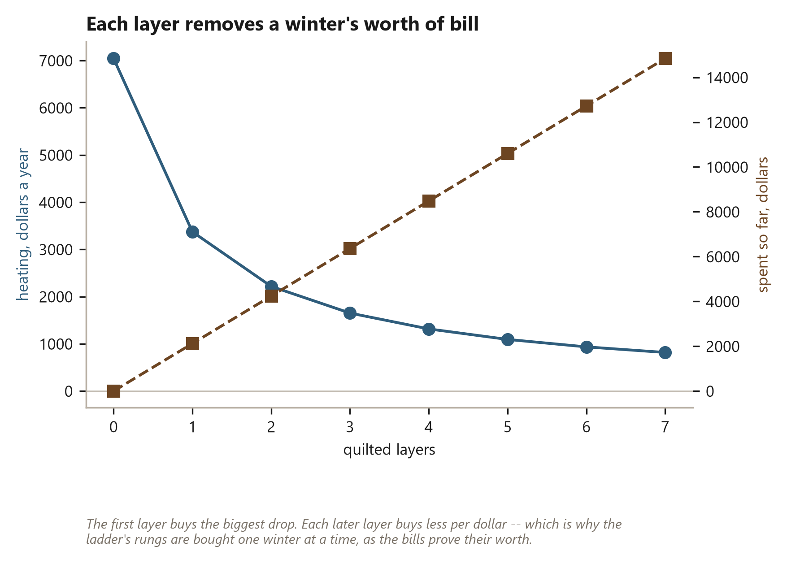

Read the first and last rows. The bare shell is R-1.5 and it wants
8,260 dollars a year to stay warm. The same shell with all
7 layers is R-12.7 and wants 958 dollars
a year. The layers removed 88 per cent of the heating bill,
and they cost 17,404 dollars spread over however many winters it
took you to add them.

The point of the ladder is not the top row. It is that there *is* a ladder.
Every rung exists on its own: one layer is a real improvement, not a down
payment on seven. You buy the rung you can afford, in the winter you can
afford it, and the house is warmer than it was the winter before.

It is also worth noticing what the ladder is made of, because it matters
that it works at all. These are not batts stuffed between studs. A quilted
layer is a continuous sheet hanging under the whole shell, and continuity is
the difference: a stud wall insulates between the studs and conducts through
every one of them, so its *assembly* R-value is well below its cavity
number, while the quilt has no studs in it to bridge. The shell frame is the
same story -- the struts touch the skin at the seams, but the quilt covers
them too, on the inside, in one unbroken layer. That is the quiet reason a
ladder of cheap fabric layers does what the table says it does.

The quilt is worth one more sentence for what it is made of, because it changes
the price. It is recycled fabric -- clothing and bedding that left the waste
stream and came back as insulation -- so the 1.1 dollars a
square foot is not the cost of a manufactured foam product. It is paying
somebody to shred, clean and stitch what a city was throwing away. The ladder
adds a thickness of second-hand fabric to a frame that was already second-hand
timber.

## Why the bones are the thing to get right

Every layer in that ladder attaches to the same thing: the frame. The quilt
hangs from the struts, the seams key into the panel edges, the inner lining
screws to the members. There is no layer that does not touch the skeleton.

That is why the frame is the one part of the building worth being fanatical
about, and it is the cheapest time to be fanatical about it. If the frame is
straight, every later rung has something straight to land on, and nothing is
ever blocked. If the frame is wrong, the error does not stay in the frame. It
walks up the ladder with you: the quilt puckers over a twisted strut, the
lining opens a gap at a seam that never quite closed, and the tenth winter
you are still paying to heat the mistake you made on day five.

There is a second reason the bones matter, and it is the one the marketing
never says. The ladder's arithmetic prices *conduction* -- heat moving
through the shell material. It does not price airtightness. Airtightness is
not bought with layers; it is built into the frame, in a continuous shell
with no corners to leak and seams you made yourself. That is the shell's job,
not the quilt's. A leaky dome with seven layers is a quilted leak. This book
has not metered a winter in one, and the chapter that closes this part
(Chapter 68) says exactly which energy claim it will not
make and why.

## The rung that pays back fastest

Now rank the rungs, because they are not equal and the order surprises
people.

The first layer is the best buy in the building. It costs
2,486 dollars and it saves 4,305 dollars in the
first year alone -- it pays for itself in 7 months, and
everything after that is free. No other rung does that.

The second layer costs the same 2,486 dollars and saves
1,355 dollars a year. Still good, but the layer that took
7 months to repay now takes years, because each layer of
insulation removes a smaller share of what is left.

The third saves 663 dollars a year. The fourth, fifth and sixth
continue the same slide, and the seventh saves 139 dollars a
year on its 2,486 dollar cost -- a payback of
17.9 years, which is most of a mortgage.

That slide is not a failure of the ladder. It is the physics of insulation,
and it is the same in every building: the first inch does the most work, and
every inch after it works on the smaller leak that is left. What the ladder
buys you is the *option* to stop exactly where your winters say to stop. A
mild climate might own the first two layers and never miss the rest. A hard
one buys all seven and the top rungs still make sense there, because a cold
climate's heating bill is big enough that even 139 dollars a
year compounds over the thirty years of a maintained dome.

There is one more column the table cannot show, and it is the reason the
ladder beats a one-time insulation purchase in this particular building.
Every layer attaches *after* the shell is up and *after* you have lived in
it, so every rung is bought with information the first rung did not have --
which walls are cold, which windows sweat, which winter hurt. A conventional
house makes its one insulation decision before the walls are closed, on
guesswork. The ladder makes seven smaller decisions, each one with a year of
living in the house behind it. That is what "warmer every winter" actually
means: not a promise about the weather, but a building that lets you keep
paying for warmth in the order your own experience says to.

A one-time foam purchase is the other way, and it is the way a conventional
house has to take. Foam is bought once, sprayed once, and sealed behind a wall
the same day; if it was the wrong thickness, or it shrank, or a seam opened,
you will not know until the bills are in, and you cannot reach it to fix it.
The quilt is the opposite: it hangs where you can see it, it comes down in the
same layer it went up, and a bad layer is a morning's work to replace. The
ladder's rival was never the foam itself. It was the single invoice.

So the honest ranking is: the first layer pays back fastest, by an enormous
margin, and it is rarely the one people do first. People paint the inside.
They buy a wood stove, which is a lovely thing and does nothing to the
envelope. They build a porch. The layer that returns 4,305 dollars
a year on 2,486 dollars waits, because a quilt hanging under
a shell is not something anybody has ever been proud of at a party.

That is the argument for the ladder, stated plainly: the house gets warmer
every winter, one rung at a time, in the order your money allows -- and the
first rung is the best one, so even a broke first winter is a good winter to
start.

---

# 60. The Quilt Network

*The insulation is a quilt of recycled clothing, and the quilt is the one part of the whole project a stranger can build at their own kitchen table -- which makes it the campaign's recruiting half, not its footnote*

## The Quilt Network

Every other part of this book needs a saw, a bench, or a
mortgage. The insulation needs a sewing machine and an evening,
and that difference is the network.

A dome's warm layer — the shell ladder of Chapter
59 — is a quilt: fabric patches stuffed with
recycled clothing, cut to the dome's own triangles, stacked one
layer per winter. The technical half of that statement lives in
the shell chapters. This chapter is the social half, and it is
not a footnote: the quilt is the only part of the entire project
that a stranger can take part in from their own kitchen table,
which makes it the campaign's recruiting mechanism, computed
like everything else in this book.

## A layer is an object with a number on it

The arithmetic of one layer, because the quilt's power is that
it is countable.

One quilted layer is a real thing with a number on it: a
definite area of the dome's surface, a definite count of shirts,
a definite R-value, a definite winter. It goes on a named dome,
and it is not a contribution to a pool — it is an object,
addressable, inspectable, whose maker can point at a building
and say *that layer is mine*. The count is the difference
between a movement and a donation drive: a donation dissolves
into a budget line, an object stays an object, and people make
objects.

The layer's economics are the ladder of Chapter
53 in miniature: the barrier is a machine and
an evening, not a workshop, a chainsaw or land; the unit is a
layer with a number on it; and the material is the one input
the maker does not have to buy, because textile waste is a
large, boring, well-measured problem and a layer is a
measurable bite out of it.

## Provenance, because the layers come off in order

The third reason the quilt is a network and not a charity:
the dome can name its layers, forever.

The stack wears in order — layer one against the frame, layer
two over it, each winter's addition on top — and it strips in
reverse order. So every layer carries its maker's name and its
date, and the building can state, layer by layer, whose shirts
are in which winter. The provenance is structural, not
sentimental: it comes from the fact that the layers are
separable objects, which is the same removability that makes
the shell ladder an upgrade path. The dome that gets warmer
every winter is, at the same time, a ledger of everyone who
warmed it — and the ledger is the recruiting poster.

## What a stranger's layer does to the economics

The chapter's real claim, stated with the numbers the module
computes.

The quilted layer is the cheapest rung of the shell ladder —
a blanket-quilted layer runs about 50 dollars —
and it is the rung whose labour the builder does not have to
perform. A dome's insulation is hundreds of square feet of
fabric work: a week of the builder's own time, or the network's
evenings, spread across people the builder will never meet.
The labour the builder cannot buy at a wage the build can
afford is exactly the labour a network can gift — and the gift
is not charity in the direction it appears, because the maker
gets the one thing the builder cannot give: their name in the
building's winter, provable, permanent, and warm.

The campaign arithmetic that follows — the quilter's kit, the
host pack, the tiers — lives in the stem-cell chapters of Part
Three. This chapter's job is narrower: to establish that the
quilt is not the dome's hobby; it is the dome's economy, and
the network is the economy's engine.

## What is arithmetic here and what is hope

The honest boundary, because the book's rule about numbers
applies to its own campaign.

The shirt counts, the layer areas, the R-values, the prices —
those are arithmetic, computed from declared constants and the
dome's own surface. That people will actually sew them, at the
scale the campaign assumes, is a bet — the book's own modules
label it as such, with the textile-waste figure attributed to
the EPA and the shirt-area figure explicitly marked as
something a person who has actually cut up a hundred shirts
should correct. The network is the project's most hopeful
chapter, and hope is the one material this book refuses to
mislabel: everything here that is a number is a number, and
everything that is a wish is called a wish.

---

# 61. One Hardware Set, Three Sizes

*The brackets, keys and fasteners that frame a small dome frame a large one unchanged, which is what makes a shared parts bin possible across a whole site*

## One Hardware Set, Three Sizes

The first chapter of this part showed the flat rate: the *counts* do not move.
This chapter is a different and more useful claim. The *hardware itself* does
not move either.

Counts being flat means you buy the same number of things. Hardware being
flat means you buy the same *things*. The same bracket. The same key. The
same screw length. A part that leaves the bin for a garden dome leaves the
bin for the big one too, unchanged, unmodified, not a "heavy duty" version of
itself.

The reason is worth knowing, because it is the whole trick. A bracket in a
dome frame has one job: hold an angle. The angles in a dome do not change
when the dome gets bigger -- every edge is the same fraction of the radius,
so every joint sees the same geometry at a different scale. The bracket never
finds out how big the building is. Only the stick does.

The book's own frame makes the point from the inside. A wedge dome has not
forty different corner angles but a small, countable set -- the seams fold at
18.03 degrees and 22.46 degrees, and nothing
else -- so the hardware exists to hold two angles, not a catalogue of them.
The Timber Workshop frame in this chapter is a 3V frame rather than the 2V
wedge, but it obeys the same law: the hubs are the same 61 hubs at
every diameter, because a hub is a set of angles, and the angles did not
move.

Those two fold numbers are the whole hardware kit, and they are worth a
slow read, because between them there is nothing else. Every seam in the
wedge frame folds to 18.03 degrees or to 22.46
degrees, and no third value exists. So a part that holds a
18.03 seam and a part that holds a 22.46 seam are
the only two kinds of corner the frame will ever ask the bin for. One spare
of each covers every joint in the building, a small one or a large one,
because the angle never found out which. Two is a count, not a tolerance; it
is the difference between a parts wall and a parts pocket.

A hub is the same idea, moved from a seam to a junction. Where several
struts arrive at once, the hub's only job is to hold each of them at its
correct angle, and that angle is set by the geometry, not by the length of
the wood. Make every strut longer and the hub does not notice -- it is still
holding the same set of angles, just further from the next hub. That is why
the hub bill in the table below holds still to the penny while the floor
multiplies: the hub is the joint, and a joint has no size. The stick is the
reach, and only the reach grows.

A fastener makes the point smaller and closer to hand. A screw or a key is
sized to the section of the members it joins, not to their length, and the
section does not change when the dome does -- not until the stick gets long
enough to need a fatter one. So the same screw length closes the same joint
on a 19.7 foot dome and a 52.5 foot one. The
hardware reads the timber's thickness. It never reads the building's width.

## The same bin, three domes

The proof is the Timber Workshop frame run at three diameters, from the
Creator's own costing:

| | small | middle | large |
|---|---|---|---|
| diameter | 19.7 ft | 32.8 ft | 52.5 ft |
| floor | 295 sq ft | 819 sq ft | 2,096 sq ft |
| struts | 165 | 165 | 165 |
| hubs | 61 | 61 | 61 |
| panels | 105 | 105 | 105 |
| hub bill | $596 | $596 | $596 |
| frame | $1,722 | $2,870 | $4,592 |
| panels | $1,161 | $3,224 | $8,253 |
| foundation | $3,178 | $8,829 | $22,602 |
| whole build | $10,652 | $19,514 | $40,037 |

Look down the middle three rows. 165 struts. 61 hubs.
105 panels. A hub bill of 596 dollars, to the penny,
while the floor multiplies by 7.1 and the total by nearly four.

Now look at what *does* move. The frame cost moves, because the frame is
timber and the stick is longer. The panel cost moves, because panels are
area and the shell is bigger. The foundation moves, and it moves hardest --
3,178 dollars to 22,602. Every row that
moves is a row of raw material. Every row that holds still is a row of
hardware. That is the table, whole.

The table stops at 52.5 feet, but the law it is showing does
not. A fourth row would print the same 165 struts, the same
61 hubs, the same 105 panels and the same
596 dollar hub bill, with a longer stick and a bigger
foundation underneath them. What stops the table is not the hardware. It is
the stick -- past 6 feet a member wants a second pair
of hands -- and the ground, which is already the fastest-moving row on the
page. The bin never closes. The wood and the dirt eventually do.

One boundary on all of this needs to be said plainly, because it is the one
the flat-rate pitch is easiest to overstate. The hardware is flat across
*size*. It is not flat across *frequency*. A 2V wedge and a 3V frame are
different buildings with different strut counts -- 120 against
165 -- and that difference is real, not a rounding. Raise the
frequency and the parts list grows, exactly as chapter 51
warned. Hold the frequency still and run the diameter out, and the hardware
does not move at all. Both statements are true; they are about different
dials, and the shared bin only makes the first one free.

## What invariance buys a site

One site, three dome sizes, one hardware bin. The economics of that are
quietly enormous, and they are the difference between a hobby and an
operation.

One order. You do not maintain three purchase histories and three suppliers;
you reorder the same line item until the price breaks.

One bin. Nothing in the bin says which dome it belongs to. A spare is a
spare for all of them, so the site holds one spare set instead of three, and
a broken bracket on Tuesday is fixed from stock on Tuesday instead of from a
catalogue in two weeks. The arithmetic of spares is the unglamorous version
of the same point: three designs each holding ten per cent spare parts means
three spare sets gathering dust; one bin holding ten per cent serves every
dome on the site, and the bin gets smaller as the site gets bigger.

One set of hands to train. The person who can drive the key on a small dome
can drive it on a large one, because it is the same key, the same angle, the
same motion. A park of mixed domes does not need a specialist per size; it
needs one skill.

One bill of materials to trust. The frame that went up first is the proof of
the frame that goes up second, because they are the same joints. The first
build de-risks the second in a way no paper review can: the hardware either
held its angle for a winter or it did not, and the answer applies to every
dome the site will ever put up.

The quietest saving in that list never shows on an invoice, and it is the
cost of the part that does not fit. A site running three hardware families
has three chances, every working week, to hand somebody the wrong bracket
for the job, and the wrong bracket is discovered on a ladder with half a
frame standing in the air. One bin removes that possibility. There is no
wrong bracket, because there is only one bracket. The mistake you cannot
make is worth more than the spare you never have to order, and it compounds
with every dome the site adds.

That is what invariance actually buys: the boring, compounding things --
inventory, spares, training -- that decide whether a site can grow without
falling over. The dome that scales the floor also scales the workshop, and
it is the workshop that scales the site.

## What does change, and it is the timber

Say the other half out loud, because the table says it and the flat-rate
pitch sometimes forgets it.

The stick grows. Every member in the large frame is nearly three times the
length of the small one, and longer stock is not just more wood -- it wants
straighter wood, bigger sections to stay stiff at length, and eventually a
second pair of hands at the lift. The member is where size shows up, and this
book has been honest about that from its first chapter: 6
feet is the declared limit one person sets alone.

The section grows, eventually. Past some diameter the same 2x4-class member
stops being enough, and the hardware does *not* change while the timber
does. A bracket that holds an angle holds it for a fatter stick too, which is
why the bin survives the upgrade.

And the skin grows with the square, as the earlier chapter on the envelope
said. So the honest summary of the whole idea is three lines: the *hardware*
is flat, the *timber* grows as a line, and the *skin* grows as the square.
Anybody who tells you the whole building is flat has counted only the first
line. Anybody who tells you the hardware grows has never looked at the
table.

---

# 62. Buy for the Next Two Steps

*The cheapest thing you can do on a site is oversize the parts that are hard to change later and undersize nothing else*

## Buy for the Next Two Steps

The rule in the title sounds like a slogan until you watch it get broken, and
then it is the most expensive sentence on the site.

Buy for the next two steps. Not for the dome you are building -- for the two
after it. The dome is the thing that moves. The ground, the services, the
pad and the trench are the things that stay, and anything that stays is a
thing you will meet again in its current condition, whatever condition you
left it in.

The frame you can unbolt and carry. The conduit you buried at exactly the
right width for the dome you have is a monument to the dome you had.

So the whole discipline is one question, asked about every dollar: if the
next dome on this pad is bigger, or the next pad is further from the hub,
does this purchase still serve? If the answer is no, you are not saving the
difference. You are borrowing it, from yourself, at whatever it costs to dig
it up.

## What is hard to change and what is not

Split everything on a site into two lists, because the two lists want
opposite treatment.

**Hard to change:** trenches, conduit, the pad diameter, the service capacity
-- the wire gauge, the water line size, the panel rating -- and the spur
that reaches the pad. These are under the ground or inside the pad, and
changing any of them means cutting open a finished surface, or digging up a
buried run, or both.

**Easy to change:** the shell layers, the interior walls, the fixtures, the
furniture, the dome itself. These bolt on, unbolt, and follow you. The dome
is the extreme case: it comes down in as little as 2 days,
moves for 1,800 dollars, and stands again at the other end --
which is why the next two steps are a *path* for the dome and a *decision*
for the pad. The pad cannot follow you. It can only be right or wrong for
whoever comes after.

Spend the planning on the first list and the money on the first list, and be
cheap on the second. The instinct is backwards: people economise on the
trench and overspend on the tap. The trench will be there in twenty years,
holding whatever it holds. The tap is replaced in five either way.

The numbers are the proof that the ordering matters. The pad comes in
4 foot steps (36, 40, 44, 48, 64 and 80), so a pad sized for the
dome you have can be wrong for the dome you want by one step -- and one step
is not a small thing to add later. A service drop sized for today's panel
cannot be upgraded without the trench. These are not accounting problems.
They are the definition of the word "later", priced.

## The cost of the upgrade you did not leave room for

Price the same upgrade twice. The services a pad is built with -- the
electrical pedestal, the water and drain tie-in, and the share of the site's
trunk services -- come to 9,000 dollars when they are laid
in while the pad is being built, in an open trench, before anything is
finished over them.

Now the same upgrade, retrofitted. The pad is finished. The deck or slab is
down. The trench has to be reopened under a finished surface, the run
extended, the surface patched and made good. This chapter declares, rather
than measures, that the retrofit costs 2.0 times as
much: 18,000 dollars. The multiplier is an estimate, and it
is named as one -- the honest framing is not the exact multiple, it is that
the multiple is large, and that the difference is 9,000
dollars you could have spent on the dome instead.

That is what "buy for the next two steps" means in money. Oversizing the
hard parts at build time costs a little -- the next size of conduit, the next
gauge of wire, a pad one step wider. Undersizing them costs the retrofit.
The cheapest thing you can do on a site is the first one.

The pad one step up is also the cheapest empty room you will ever own, and that
is worth saying because an empty pad feels like waste. It is not. A pad sized
for the next dome sits there for a season or two, holding nothing, costing
nothing to hold -- gravel does not rust, and an unused trench does not leak.
What it holds is a decision you already made: the day you want the bigger dome,
or the second dome, the ground is ready and the services are already in the
right place. The empty pad is the opposite of the retrofit. The retrofit pays
for the upgrade later at 2.0 times the price; the empty
pad pays for it now, and it costs nothing to keep.

There is a second worked number in the same idea, and it is the one people
feel most. The apartment option in the next chapter's housing table costs
3,625 dollars to move into -- of which
2,175 comes back and the rest is gone -- and walking away from
the lease early costs 2,900 dollars. None of that is an
upgrade; it is the price of a roof you do not own, paid to people who do.
The dome's entry is 18,401 dollars, and 16,601
of it is the dome, which leaves with you. Every month the lease runs, the
apartment is the more expensive way to have bought the *same* thing: a place
to sleep. The growth path only exists at all because the dome is the one
option in that table whose entry money is not a fee. It is a down payment on
the next two steps.

## The growth path as a sequence, not a plan

There is a reason to think of this as a path and not a plan.

A plan is a drawing of the end state: the big dome, the three pads, the
finished site. Plans are lovely and plans die on contact with money, because
money arrives in the wrong order and the plan has no answer for "what do I
buy with what I have this month".

A path is the order in which you get there without ever having to undo a
step. The small dome first, on a pad one step bigger than it needs, on
services one size bigger than they need. Then the second dome on the same
pad. Then the second pad, sharing the hub. Every step is affordable on its
own, and no step is a correction of the one before.

The path matters more than the plan for a reason specific to this kind of
building. A dome site is not a subdivision; it is a sequence of small
decisions, each one cheap to make and expensive to reverse, and the only
plan that survives contact with money is the one that knows which order the
decisions come in. Buy the pad for the dome you have and the next dome is
blocked by a trench. Buy the pad one step up and the next dome is a
fortnight. The difference between those two outcomes was
4 feet of gravel, decided months before either dome
existed. That is the whole discipline: the cheap parts are the plan, the
hard parts are the path, and the path is bought one step early, every time.

The second dome is where the rule pays in a way the first dome cannot see. Buy
the pad one step up and the second dome is not a move; it is standing a frame on
ground you already own, sized for it, with services already in --
2 days at the quick end and 14 at the
slow, layered end, either way a fortnight and not a re-excavation. Two domes on
one pad, or the dome and the workshop, or the dome and the guest pod: the second
building is where "buy for the next two steps" stops being a slogan and becomes
the reason the first step was cheap.

The path is also the answer to the table this part opened with. The four ways
to have a roof -- a hotel at 4,256 dollars a month, a short let
at 2,888, a lease at 1,520, or the dome on a
pad at 880 -- cross over at 3 months, and
the dome only wins because its entry cost (18,401 dollars, of
which 16,601 is the dome you keep) was bought once. A path is
what makes that possible: each step small enough to afford, each one aimed at
the step after it.

The same rule reaches past the pad to the hub the pads hang off, and it is the
one place people forget it because the hub is not on their land. The panel, the
manifold and the trunk that carries power and water are bought once and shared,
and "buy for the next two steps" means sizing them for the cluster before the
cluster exists. A hub sized for one pad is the same mistake as a pad sized for
one dome, just owned by several people at once. The chapter on the pad (Chapter
64) and the chapter on the network (Chapter 67)
price that hub; this chapter only has to say the discipline does not stop at
your own property line.

That is the whole discipline of this chapter, in one sentence: spend the
planning on the things that stay, be cheap on the things that move, and
never buy for the dome you have when you already know the next two.

---

# 63. The Ground Is What You Cannot Take With You

*Measured across the dome catalogue, the foundation is between a small fraction and most of what a dome costs -- and it is the only part you leave behind*

## The Ground Is What You Cannot Take With You

The frame is portable. That has been the quiet promise of this whole part of
the book: the dome unbolts, rides a trailer, and stands again somewhere else.

The ground under it is not portable. The slab, the pad, the piers, the
platform -- whatever the dome stands on, that part is poured, dug or built
where it is, and when you leave, it stays. Nobody loads a foundation onto a
trailer.

So the honest question for a building you might move is: how much of what you
paid is the part you cannot take? And the measured answer, across the whole
catalogue the Dome Creator ships, is where the surprise is. The foundation is
between almost nothing and *most* of the cost of a dome, depending on which
dome you picked -- and the spread is the single biggest lever on the whole
page.

## Foundation share, across the catalogue

Every shipped design, priced twice by the Creator -- once as sold, and once
with its foundation set to bare ground. The difference is what the ground
costs, and this is that difference as a share of the whole:

| design | foundation | share of total |
|---|---|---|
| Whole Trunk Lodge - 20 ft | gravel pad | 16.8% |
| Timber Workshop | concrete slab | 45.2% |
| Split-Log Homestead | gravel pad | **8.1%** |
| Grow Dome | grass pad | 2% |
| Glass Studio Loft | wood deck | 25.3% |
| Hex Cell Pavilion | concrete slab | 21.1% |
| Continuous Steel Arc Hangar | concrete slab | 23.7% |
| Rebar Garden Dome | grass pad | 3.4% |
| Concrete Monocoque Form | concrete slab | 23.6% |
| Woodland Hex Mirror | grass pad | 0.4% |
| Woodland Square Mirror | grass pad | 0.5% |
| Treehouse Canopy Dome | treehouse platform | 63.3% |

That is the whole catalogue: 12 designs, and the foundation
runs from 0.4 per cent of the Woodland Hex Mirror to
63 per cent of the Treehouse Canopy Dome, averaging
19.4 per cent. Exactly 1 design out of
the 12 spends more on the ground than on everything above it
put together.

The bold row is the one the rest of this part is about. The
Split-Log Homestead costs 18,067 dollars as shipped, of
which 1,466 dollars is gravel pad --
8.1 per cent. Stand it on a pad that already exists and
the building you bring is 16,601 dollars. The ground is
the part the pad replaces.

The flagship sits on gravel, and that choice is not a cost-cutting detail;
it is the same idea the rest of this part is built on, written small. Gravel
is the foundation you can change your mind about. If the first site is
wrong, you regrade the stone and it is ready to hold the next dome; a slab
you have poured is wrong forever. So the Homestead carries
1,466 dollars of gravel -- 8.1
per cent of its shipped price -- not because gravel was the cheapest box to
tick but because a first building belongs on the most reversible ground
there is. The 16,601 dollars that are left once the pad
is somebody else's problem is the number this whole part is steering toward.

A warning about reading the table too fast, because the cheapest rows are
the ones that flatter the idea and they should not. "Grass pad" sounds like
a bargain -- 2 per cent of the build! -- and what
it means is that the Grow Dome stands on the ground, directly, with no
foundation to speak of. That is not a saving discovered by the model; it is
a *choice* about the building, and it works only for a garden dome that can
sit on grass because it asks nothing of the ground but to be level. The same
line on a year-round dwelling would not be a bargain. It would be a building
without a foundation, and the table is honest about which designs are
allowed to get away with it.

One move removes the whole column instead of shrinking it, and it is the move
the next chapter makes (64). The shares in that table are the
*before* picture: every design still owns its ground. Stand the same dome on
a pad somebody else owns and rents, and the foundation line falls out of the
dome owner's bill altogether -- not because the ground got cheaper, but
because you stopped being the person who pays for it. The
8.1 per cent line does not turn into a smaller number.
It turns into a monthly rent, a different kind of line, an operating cost
instead of a sunk one, and the dome goes back to being the portable thing it
always claimed to be. That is why this chapter measures the ground so
carefully: you cannot decide to leave it behind until you know how much of
your money it is.

Before you read any further, read your own dome out of that table -- the row
closest to what you are actually planning, not the row you like. The average
is 19.4 per cent, and the average lies about nearly every
row in the list: the cheap shells sit far below it and the treehouse sits
far above. Your build is one row, not the mean, and the number in that row's
third column is the answer to the portability question before you have
bought a single stick. It is the fraction of your money that stays in the
ground.

## Why the share swings so far

A share this spread -- from under one per cent to nearly two thirds -- is not
noise. It is two real things pulling against each other.

Before the two things, one caveat about the units, because a share is a
fraction and a fraction is not a bill. A large share of a small dome can be
less money than a small share of a large one, and when the question is what
you leave behind, it is the money you feel, not the per cent. The table
prints shares because they are what make one dome comparable to another. The
dollar is in the costing behind it, and the dollar is the column that hurts.

A dome can be cheap above the ground. The Garden Dome and the Mirror shells
are light frames and simple skins; their whole cost is small, so a bare
grass pad is a small share of a small number.

And a dome can be demanding below the ground. The Treehouse Canopy Dome does
not stand on the ground at all: its "foundation" is a platform in a tree,
which is most of the cost of the building before a single panel is hung.
That row is the far end of the spread -- 63 per cent -- and
it is the honest reminder that "foundation" in this table means *whatever
holds the dome up*, including the most expensive way there is: hanging a
building from a living thing that grows.

Put the two together and you get the honest rule: *which* dome you pick
decides whether the ground is a rounding error or the whole bill. A cheap
shell on an expensive foundation and an expensive shell on a cheap foundation
are both real configurations, and they are both sitting in that table. This
is why nobody should compare dome costs without separating the ground out
first -- and why this chapter does.

The slabs in the middle rows are worth a line each, because they are the
case most readers are actually in. The Timber Workshop and the Hex Pavilion
stand on poured concrete, and the slab is a quarter to a fifth of the build
-- 45.2 per cent and
21.1 per cent. That is the ordinary number for
an ordinary dome on an ordinary site, and it is the one to remember when the
cheap rows tempt you: most domes are not grass domes, and their ground is
not a rounding error. It is a real line, and the pad exists to take it over.

There is a cleaner way to say why the column spreads so far, and it matters
the moment you go to use the table. The share is not a property of the dome.
It is a property of the pair -- a given shell against a given ground. The
same Grow Dome that is 2 per cent on grass is a
different number on a slab, not because the shell changed but because a
bigger line got put underneath it. Nothing about the frame moved between
those two builds; the ground did. So when two people quote different
foundation shares for what sounds like the same dome, neither is wrong. They
are standing on different dirt, and the table is what lets them compare like
with like by splitting the two costs apart.

## The hinge, stated as a decision

The spread is not a curiosity. It is a decision that comes before every other
decision on the site, and it has a hinge in the middle of it.

If the foundation is a small share of your build -- a dome on grass, a light
frame on a cheap pad -- then the ground is not the thing to optimise. Your
money belongs in the shell, the insulation, the glazing: the parts you will
live with and take with you. Squeezing the last dollar out of a pad that is
2 per cent of the build is polishing a pebble.

If the foundation is most of your build, the question is sharper, and it
should be asked before you spend anything else: why is this dome on this
ground? Because a building whose cost is mostly ground is a building that
has chosen its site badly, or chosen its foundation badly, or -- the honest
third answer -- chosen a site where the ground *is* the point, and the
building is the accessory. All three are legitimate. None of them should be
discovered by accident after the pour.

The work of the hinge is one sum, done once: take your dome's shipped cost,
look up its foundation share in this table, and put the build on the correct
side of it. The frame you can take with you. The ground you cannot. Decide
which one you are actually buying, and buy that one on purpose.

---

# 64. A Pad, Not a Plot

*A serviced pad is the unit a dome site is actually built from: a deck, a set of services and a diameter, priced as one thing*

## A Pad, Not a Plot

Land is sold in acres, and an acre is not a unit of building. It is a unit of
hope: somewhere in there is a place a building could go, and everything --
trench, track, clearing, pad -- is your problem to turn the hope into a site.

A dome site does not work that way. The unit a dome site is built from is the
pad: a prepared deck, a set of services, and a diameter, priced as one thing.
When you say "a pad" you have said the whole agreement. The deck is where the
dome stands. The services are the wire and pipe that reach it. The diameter
is which domes fit.

The pad is also the answer to the previous chapter's hinge. The ground is
what you cannot take with you -- so the way to build a site people *come* to
is to make the ground somebody else's job, done once, done well, and rented
by the month. The dome moves; the pad stays; and the pad is the thing with a
price.

The pad catalogue is derived, not invented, which is why it is trustworthy.
Every shipped dome's foundation disc is measured, rounded up to the next
4 foot step -- because decking comes in even lengths and a host
building a second pad wants the same cut list as the first -- and the
distinct results are the catalogue: 6 sizes, from
36 to 80 feet. Add a bigger dome to the Creator
and a bigger pad size appears in this list on the next run. The sizes are
36, 40, 44, 48, 64 and 80, and a 48 foot pad -- the one the rest
of this part prices -- takes 10 of the shipped domes outright.
One pad is not one dome. One pad is ten of them, and that is the sentence
the whole site is built on.

The pad also replaces the plot, and it does it twice -- once as a matter of
law, once as a matter of what a dome actually needs. Legally, a plot is a
parcel with a deed, and a deed is a standing liability: you buy the zoning,
the setbacks, the taxes, and the duty to keep the land whether a dome ever
stands on it or not. A pad is a contract. The dome owner rents a serviced
spot for as long as the dome is there, and owes nothing to the dirt the day
it leaves. Practically, the dome never wanted the plot. It wanted the three
things a plot promises and rarely delivers -- a level deck, power and water.
A pad is those three things, priced. A plot is those three things plus a lot
of land you do not need, priced as one. That is the whole difference, and it
is why the unit of this site is the pad, not the acre.

## What a pad is made of

The loaded pad this part of the book prices its worked examples on is
48 feet across -- 1,810 square feet -- and it
is made of these lines:

| line | cost | what it is |
|---|---|---|
| concrete deck, 1,810 sq ft | $11,315 | the slab the dome stands on |
| electrical pedestal | $1,400 | the 50-amp outlet, breaker and conduit run |
| water and drain | $1,100 | supply stub, frost protection, drain tie-in |
| site infrastructure, per pad | $6,500 | share of the access road and trunk services |
| permits | $1,200 | siting, septic or sewer, electrical |
| rotating base | $9,120 | the turntable ring, bearings and drive |
| utility column | $2,600 | toilet, sink, shower and outlets in one column |
| solar, 15,339 W | $17,640 | the array the pad carries |
| **whole pad** | **$50,874** | |

Every line has a different life. The deck outlives everything on it. The
pedestal and the water line last decades if the trench is right. The permits
last as long as the code that issued them. The rotating base and the utility
column are the ones that want maintenance, and the chapter on the sun is
honest about what the rotation actually returns. The point of the table is
not the total -- 50,874 dollars is a *loaded* pad, not a
starting point. The point is that every part of "a place to put a dome" is a
named line with a price, and the total is the sum of the lines.

## Gravel, concrete or wood

The deck is the line with a choice in it, and the choice is the same one
everywhere in building: cheap to build, or cheap to own.

Gravel, at 1.2 dollars a foot: 2,031 dollars for
the 48 foot pad. Owner-built in a weekend over fabric.
Drains beautifully, moves under the dome as frost heaves it, and *heaves* --
the dome on top moves with it, which a wooden frame forgives and a poured
one would not. Its failure mode is the slow one: the surface walks away, the
weeds come through, and in five years you rake it and add another load.

Concrete, at 7 dollars a foot: 11,315
dollars. Poured by somebody else, flat forever, the heaviest thing on the
site and the one that cracks if the ground under it was not right. Its
failure mode is binary: it is perfect for thirty years and then it is a
crack that tells you everything about the day it was poured.

Wood, at 8 dollars a foot: 13,070 dollars -- more
than the concrete, and this is the honest surprise. A framed deck costs more
to build than a slab *and* it rots at the ground line in a decade unless it
is built like a piece of furniture. Its virtue is not price. It is that it
can be level on ground a slab would need a truckload of fill to reach, and it
is the one deck you can take apart and reuse.

The cheapest to build is not the cheapest to own, and the difference is not
small. Gravel is the honest default for a first pad: it forgives a bad
decision about where the pad goes, which is the decision you are most likely
to get wrong first.

Run the three decks forward a decade and the sticker price and the owned
price stop being the same purchase. Gravel wants an hour of raking a year
and a load of stone now and then, and after that attention it is the same
pad in its tenth year that it was the day it was laid -- the one deck whose
wear is answered by a person with a rake rather than a contractor with a
jackhammer. Concrete asks for nothing for a decade, and then, if the ground
under it was wrong, it asks for everything at once: the crack is permanent,
and the slab is now a liability you cannot un-pour. Wood is the deck you
keep like a boat, a little at the ground line each year, and it is the one
deck of the three you can take apart and stand again somewhere else. Cheap
to build, cheap to own, and portable are three different decks, and no site
gets all three. The decade is where they stop being the same purchase, which
is why the choice is named out in the open here rather than folded into the
loaded pad's total.

## The cheap pad, costed honestly

The least a pad can cost and still be a pad, every line named:

| line | cost |
|---|---|
| deck on blocks, 1,257 sq ft | $17,593 |
| share of one hub panel, 1 of 4 | $600 |
| spur from the hub | $450 |
| permits | $1,200 |
| **total** | **$19,843** |

Read what is *not* on that list, because the list of omissions is the honest
part. No excavation. No concrete. No pedestal -- the pad shares a hub panel
with three neighbours instead. No trench -- a short spur from the hub. No
rotating base, no utility column, no solar.

That is the number this part of the book compares everything against:
19,843 dollars is what "a place a dome can stand, with power and
water within reach" costs at its floor. The loaded pad is
50,874 dollars. The difference between them is not waste --
it is the rotating base, the column, the solar and the slab, each of which
has to earn its keep in the chapters that follow. The cheap pad is the
baseline. Everything above it is an argument.

And the argument has to earn its keep, so price the year both ways. The bare
pad -- gravel, no rotation, no column, no solar -- costs
12,231 dollars to build and nets its host 5,578
dollars a year: paid back in 2.2 years. The loaded pad
costs 50,874 and nets 7,504 -- paid back in
6.8 years. The loaded pad makes more money and takes
longer to repay, and the honest question is not which number is bigger. It
is which pad the site needs, because every extra line on the loaded pad is
an extra thing to maintain, insure and explain, and the chapters on the sun
and the iris are exactly the arithmetic of whether those lines earn their
place. The pad is the product; the cheap pad is the product at its honest
floor; and everything the site adds on top is a bet this book prices before
you make it.

Behind both of those payback numbers sits one assumption, and it is the
softest number on the page, so it gets its own line. The loaded pad rents
for 667 dollars a month, and the host plans to lease it
80 of the year -- not all of it. A full year of rent is
the number a brochure prints; the net above already wears the empty months,
plus the carrying cost a pad keeps accruing whether it is occupied or not.
Payback is stated on that net, never on gross. If the real occupancy lands
below 80, every
payback figure in this part stretches out with it, and no geometry saves it.
Occupancy is the one input the model cannot solve. It is a bet, and it is
the bet the whole site is placed on.

Say the pad sits empty instead, and say it plainly, because an empty pad is
the failure case this whole part is priced against. An empty pad still
carries its fixed lines -- permits to renew, a share of the hub or of the
trunk services, insurance on a loaded pad -- and on the loaded pad the
rotating base and the solar are lines that age whether anyone stands on them
or not. A bare pad left empty costs almost nothing; that is its virtue. A
loaded pad left empty keeps costing, and that is the honest reason the
loaded pad is the riskier bet. The loaded pad earns its extra money only
while it is full. The bare pad forgives being empty, and on a first site
that forgiveness is the product.

---

# 65. Turning the House Toward the Sun, Until It Stops Being Worth It

*A rotating foundation is buildable and it does raise the solar yield -- and the honest arithmetic says it pays only under conditions that are worth stating before anybody pours a ring*

## Turning the House Toward the Sun

This is the off-the-wall one, and it is in the book on purpose.

A dome on a ring. The whole house turns, slowly, over the day, keeping its
solar panels square to the sun the way a sunflower does. It is not a joke
somebody made at a party; the park model prices it, the film teaches it, and
the loaded pad in the previous chapter carries a rotating base at
9,120 dollars because of it.

The reason it earns a chapter rather than a footnote is that the arithmetic
is interesting *even where it loses*. Most off-the-wall ideas fail boringly
-- the numbers are simply bad. This one fails in a specific, instructive
way: it raises the yield exactly as promised, and then the value of the
extra power turns out to be almost nothing, because of a detail about
surplus nobody thought to price until the model did.

So the chapter does the honest thing it is named for: it builds the case,
turns the house toward the sun, and works out precisely where it stops being
worth it.

## Why a dome can do this and a box cannot

A dome can rotate because a circle has no preferred direction.

A dome's footprint is a circle, and a circle meets its pad the same way at
every angle. Turn it thirty degrees and nothing about the building changes:
the same wall meets the same wind, the same roof sheds the same rain, the
same door... well, the door moves, and that is the point, but nothing
*structural* cares. The building is identical at every heading.

A rectangle on a turntable is a geometry problem at every angle. Turn a box
house and the corners sweep through arcs of pad that must be kept clear, the
long wall trades its wind exposure with the short one, the plumbing stack
moves off its trench line, and the building presents a different face to the
street with every hour of the day. A box *can* rotate -- they exist, as
advertisements -- and every one of them is a box paying the price of not
being round.

The services are the detail that makes the dome version real rather than
clever. Wire and pipe enter a rotating pad through its axis -- the one point
that does not move -- and flex from there. The ring itself is the
9,120 dollar line on the pad's bill: a turntable ring, bearings
and a drive, priced at 190 dollars per foot of diameter.

The drive is worth describing, because a rotating house sounds like a
carnival ride and it is not one. The ring does not spin. It advances -- a
fraction of a turn an hour, the whole circle once a day -- and it is driven
slowly enough that the motor stays small. Nobody inside feels the floor
move. What they notice, an hour later, is that the light has stayed where
it was.

Maintenance is the line the model does not price, and it is the line that
decides the argument for a lot of people. The ring is a bearing the size of
the house, sitting in weather, and everything that keeps it moving -- the
drive, the ring segments, the rollers -- needs greasing, sweeping and
inspecting the way a piece of farm equipment does, not the way a foundation
does. A concrete pad wants nothing. The ring wants attention, forever, and
it is the owner's attention. The chapter's honest total counts the ring, the
drive and the view; the years of maintenance after them are real, they are
not in any table, and the model has no number for the owner's Saturdays, so
the book will not invent one.

## What tracking actually returns

Every figure in this chapter is for a dome of 10 feet radius,
because a kilowatt-hour a month means nothing without the building it came
off.

The shell has 40 panels. Clad one side -- the half that faces
the sun -- and you hang 20 of them: 292 square feet,
5.2 kilowatts. Fixed, that array makes 734 kilowatt-hours a
month. Tracking, at the declared 25 per cent gain, it makes
918. The whole rotating machine -- ring, bearings, drive -- buys
184 kilowatt-hours a month. That is the promise, delivered
exactly as promised.

Now the catch, and it is the same catch every solar pitch trips on. A tenant
uses about 420 kilowatt-hours a month. The *fixed* array already
makes more than that -- 918 tracked, of which the tenant can use
420 and the other 54 per cent is surplus. Surplus
is not worth what power you buy is worth. Power you do not buy is worth
0.14 dollars a kilowatt-hour. Power you send back to the grid is
worth 0.045.

So the 2,202 kilowatt-hours a year that tracking adds are valued
twice, and the honest spread is the whole chapter. If every gained
kilowatt-hour displaced bought power, tracking would return
308 dollars a year and the 7,600 dollar ring would
repay in 25 years -- long, but an argument. If the gain
is surplus, which on a half-clad dome it mostly is, it returns
99 dollars a year and the ring repays in
77 years. That is not an investment. That is a
sculpture.

One caveat about that flat 25 per cent, stated before it is
leaned on. The model uses a single monthly figure, and a month is exactly
the thing that hides the seasons. A fixed array is aimed at the average
day, so it under-catches in the low-sun months -- short days, low sun, the
months an off-grid site needs the power most -- and over-catches in the
long ones. Tracking flattens that out: it keeps the panel square in every
season, and its gain is concentrated where a fixed array is weakest. So the
flat number understates the ring in the one place it could ever win, and
overstates it everywhere else. On a grid-connected pad the surplus is
surplus all year, and the flat number is generous to the ring. On a site
that lives or dies on its December output, the flat number sells the ring
short. The book prints the flat number anyway, because it is the number the
model can defend, and a caveat about seasons is not the same as the
season-by-season table this project has not built.

## Where it stops paying, said plainly

The two curves cross, and the crossing is the whole answer.

The ring costs 190 dollars a foot of diameter, so the bill grows
with the size of the pad. The gain is a percentage of the solar yield, and
the yield is worth the retail rate only up to what the tenant actually uses
-- past that, everything is export. The bigger the array, the worse the
deal gets, because the surplus grows faster than the use.

The whole-shell case is the clean version. Clad all 40 panels
and a fixed shell makes 1,468 kilowatt-hours a month;
tracking makes 1,835. The gain is bigger -- 367
kilowatt-hours -- but it is *all* surplus, because the fully clad shell
already makes 4.4 times what the tenant can use. You have built
the most power and simultaneously the least reason to turn anything. The
film's own summary says it in one line: clad one side and turning is worth
184 kilowatt-hours a month; clad all of it and you have more
power than you can use, a bigger bill to buy it, and less reason to turn.

Set the ring against its honest alternative, because it is not the ring or
nothing. The other way to get more power from the same pad is to hang more
fixed panels, and that alternative deserves to be priced at the same export
rate before the ring is praised. The fixed array already makes
734 kilowatt-hours a month against a 420 load, so
another row of fixed panels adds only surplus -- every one of its
kilowatt-hours worth 0.045 dollars. The ring differs in exactly
one respect: it lifts the *whole* existing array by 25 per
cent, including the part that displaces bought power at 0.14
dollars. So a ring's marginal hour is worth slightly more than a fixed
panel's marginal hour, and that slightly is the entire case for spending
7,600 dollars on it. Both additions are mostly surplus, and
surplus is worth 0.045 either way. That is why the two payback
numbers -- 77 years and 25 years --
carry the whole verdict, and why the ring loses on a grid-connected pad
even though it does exactly what it promised.

There is a quieter cost the model does not put a number on, and it is the one
that decides the argument for a lot of people. A rotating house rotates its
*door*, its windows, its view, its shaded side. The garden faces the dome one
way at breakfast and another at dinner. The wind always finds a different
face. None of that is priced in the ring's bill, and all of it is real --
for some people the fixed view is the entire point of the site, and the
turntable has just traded it for 184 kilowatt-hours a month
worth 0.045 dollars each. The sun chapter's honest total is the
ring, the drive, the maintenance *and* the view you gave up, and only the
first three are in the table.

So the honest verdict: on a grid-connected pad, with a tenant-sized load,
tracking does not pay for its ring. Not at export rates, and barely even at
retail. That is not a failure of arithmetic. It is a fact about surplus, and
the model refuses to flatter it away.

## Why it is still in the book

Because the failure is the lesson, and the conditions where it *wins* are
specific enough to name.

Tracking pays when the power it adds displaces bought power at a high rate
-- which means: off-grid, or nearly off-grid; an array sized *below* what the
house uses, so every gained hour is one you were going to buy; and expensive
power, which off-grid power almost always is. In those conditions the
184 kilowatt-hours a month are worth the retail rate or more,
and the ring stops being a sculpture and becomes a generator mount. The test
is the two payback numbers: 77 years when the gain is
surplus, 25 years when it displaces bought power. If your
site's true number sits nearer the second figure than the first, the ring is
a serious option. If it sits nearer the first, the ring is a hobby, and a
fine one -- just one whose price tag should be read before it is bolted to a
foundation.

The verdict deserves its structure stated, because a two-sided answer is
easy to misread. The ring does not fail on its own arithmetic -- it makes
the power it says it makes. It fails on the *value* of that power, and only
under the grid's prices. That split, between a mechanism that works and a
market that will not pay for the surplus, is the reason the honest verdict
has two halves instead of one. On a grid-connected pad the ring is a
sculpture; off-grid it may be a generator mount. Both halves are true at
once, on the same machine. The closing audit (Chapter 68)
marks this chapter 'modelled -- and it loses' for exactly that reason, and
it is the cleanest row in that table: a claim tested, found false at grid
prices, and printed anyway. Most ideas in this book never get a verdict
that sharp.

And there is a quieter reason it stays in the book: it is a real answer to a
real question. People ask whether the dome could follow the sun. It can, and
the honest answer about whether it should is exactly the kind of number this
book exists to print -- computed, with the caveat left in, rather than
waved away by a sales pitch in either direction.

---

# 66. One Pad, Every Dome Size

*An iris of hinged blades closes a single oversized pad down to whatever dome is standing on it, so one pad serves the whole catalogue instead of one model*

## One Pad, Every Dome Size

Pads come in steps -- 36, 40, 44, 48, 64 and 80 feet -- because decking comes in even
lengths and a host wants the same cut list twice. Domes do not come in steps.
The three sizes this site is designed around are 20.0,
32.4 and 38.8 feet across, and a dome can be any
diameter the timber decides.

So a site has two honest choices. Pour a pad for the dome you have, and pour
another when the dome changes. Or make one pad that can be *any* of the
sizes, and let the pad adapt.

The second one is the iris: a ring of hinged blades around a fixed rim, like
a camera shutter the size of a deck. Close the blades and the working pad
shrinks to the small dome. Open them and the large one fits. One pad, the
whole catalogue, and no concrete ever gets poured twice.

## How the blades swing

The mechanism is simple enough to draw, and the numbers that describe it are
solved rather than guessed, because they have to be: a blade that does not
quite close is a gap a foot can fall through.

A fixed outer rim -- the pad's permanent edge. Inside it, a ring of blades,
each hinged at one end and lapping the next, the way the panels of the dome
itself lap each other. Swing every blade the same amount and the open circle
in the middle grows or shrinks, and the blades carry the difference between
the rim and the dome as a deck surface.

The aperture range is the design number that matters, and it is declared
rather than derived: from 19 feet -- a one-person dome -- up to
40 feet, the large two-person dome. Against that range sit the
three sizes the site is built around:

| dome | across | floor | longest member | iris covers it? |
|---|---|---|---|---|
| small personal | 20.0 ft | 314 sq ft | 6.0 ft | yes |
| medium | 32.4 ft | 822 sq ft | 10.0 ft | yes |
| large | 38.8 ft | 1,184 sq ft | 12.0 ft | yes |

All 3 sizes -- one aperture range takes every size the site
sells, from a pod you could put in a yard to a building two people live in
with room left over.

The blades are not a lid; they are a deck, and that is what makes them
buildable rather than clever. Each blade is a framed timber panel -- the
same joinery the dome itself teaches -- lapped over the next so water runs
outward and down instead of through the joints, and carried on the fixed rim
at its outer edge so the *rim* takes the load, not the hinge. A camera
shutter holds back light; the iris has to hold a person standing at the edge
of a 38.8 foot hole, and it does it the boring way: every blade
lands on the rim, and the rim lands on the ground. The hinge only swings the
blade. It never carries the dome.

The closed blades drain, and the closed state is the one worth checking,
because that is where two lapped edges sit tightest together. Each blade
drops its outer edge below the blade it laps over, so a closed iris is a
run of shallow steps from the rim down to the dome, and water that lands
anywhere on it runs down those steps and off, the way it runs off the
dome's own skin. A lap that caught water instead of shedding it would rot
exactly where the hinge load passes through it, so the overlap is not a
flourish -- it is the difference between a deck that lasts and a deck that
sponges.

Snow asks the same question harder, and the iris answers it the same way
the dome's skin does: with laps that shed rather than flats that hold. A
closed iris is open in the middle -- the dome stands in the aperture -- so
the blades carry only the ring of deck between rim and dome, and what snow
lands on those lapped steps slides down them to the ground instead of
sitting until spring. In winter the aperture closes down around whatever
dome is standing and stays there; the machine's only moving day is the day
the dome changes. A pad that is not moving is not seizing, and a deck that
sheds is not holding a winter's worth of ice. The winter argument for the
iris is not that it is warm. It is that its moving parts spend the cold
months doing nothing at all.

A moving deck is also a deck people walk on, and that is the safety
question the brochure skips. The blades move only when the aperture
changes -- a few times a year, not underfoot every day -- and when they do
they move slowly, driven, not free. But a hinged deck is still a deck with
a seam in it, and a seam is a place a toe can catch if it is not flush
when it stops. The honest answer is not that the iris is as flat as a
poured slab. It is that the blades are a walking surface, so they are
framed flat, lapped to shed, and moved only when nobody is standing on
them. That is the rule a site can keep, and it is the one thing that stops
a clever deck from becoming a clever liability.

## What the iris costs against what it saves

The mechanism is priced by the aperture you build it to open to, at
310 dollars a foot: 12,400 dollars at the full
40 feet.

The honest comparison is one iris pad against the alternative the site would
otherwise live with -- a fixed cheap pad per size:

| | dollars |
|---|---|
| a cheap pad at the small size | $6,646 |
| a cheap pad at the medium size | $13,765 |
| a cheap pad at the large size | $18,831 |
| **three fixed pads** | **$39,242** |
| | |
| one cheap pad at full aperture | $19,843 |
| the iris at full aperture | $12,400 |
| **one iris pad** | **$32,243** |

One iris pad costs 6,999 dollars less than three fixed pads --
about the price of the small pad it replaces. And that is the *worst* case
for the iris, the day-one comparison where the site already knows it will
pour all three. The real case is better: the site does not know. A pad
poured for the small dome is a stranded asset the day the tenant wants the
large one; the iris pad simply opens. The pad survives the catalogue, which
is the one thing a fixed pad by definition cannot do.

The real case has a second act the one-time table cannot show: *time*. A
site lives through domes the way a harbour lives through boats. This season
the small dome, next season the medium, the season after that a different
tenant's large one -- and each arrival and departure is a trailer and a
weekend, not a pour. The fixed pad earns once; the iris pad earns every time
the aperture moves, and the aperture moving is the business model. That is
why the comparison in the table is the floor of the argument, not the
ceiling: the iris does not have to win the first day. It has to win the
fifth dome, and by the fifth dome the three fixed pads have been joined by a
fourth while the one iris is still the same pad, still opening.

One number in the pad chapter quietly frames the iris, so state it before
the brochure does. The flagship pad of Chapter 64 takes
10 of the Creator's shipped domes. Pour that pad and you have
served 10 domes with one pour and no moving parts at all. So
the iris is not the only way to pour once -- the big fixed pad already does
that. It is the way to pour once without paying for the biggest deck under
the smallest dome, and without a tenant's table standing in the middle of
an empty ring of decking every night the small dome is on site. Both serve
the catalogue; that was never the question. The question is what you pay
for the deck you are not using, and the iris is the only answer that prices
that deck at zero.

Read the cost table the right way, because it flatters the iris if you
read it as a bargain. The 6,999 dollars it saves over three fixed
pads is the floor of the case, and the ceiling is not a bigger number. The
iris is not really a saving at all; it is insurance. A fixed pad is a bet
that the dome standing on it will not change, and a wrong bet there is not
an inconvenience -- it is a pad that has to be abandoned or broken up. The
iris is the premium paid so that no dome choice, made today or by the next
tenant, can ever turn the pad into the wrong pad. Insurance is priced by
the bad year -- the season a tenant arrives wanting a 38.8 foot
dome and finds a pad sized for 20.0. Whether the premium is
worth it is not an arithmetic question -- it is the question of how often
the site expects its domes to change, which no pad catalogue can know in
advance.

## The case against it

Say the other side properly, because it is not a weak argument and the
chapter would be a brochure without it.

An iris is a mechanism on a foundation. Foundations are the one part of the
site whose entire virtue is that they do nothing -- they sit, they bear
load, they do not break. A mechanism is the opposite: it moves, so it can
seize; it has joints, so it can fill with grit; it carries weight at the
edge of a hole, so it needs inspecting. The cheapest pad on the site is a
circle of gravel, and a circle of gravel has no failure mode at all. The
iris has several, and they are all yours.

Maintenance is not a line item somebody else absorbs. A seized blade on the
day a tenant arrives with a trailer is a seized *product* -- the pad is the
rental, and the rental is stuck. That risk is real enough that the honest
recommendation is not "every pad should be an iris". It is: the pad that
expects to change domes should be one, and the pad that knows its dome
should be cheap, fixed, and boring.

Which is, in the end, the same rule as every other chapter in this part: the
parts that move are worth spending on only where the moving is the point.
The iris is the adapter between a pad catalogue and a dome catalogue, and as
an adapter it is cheap at 12,400 dollars. As a foundation, it is
a foundation with an instruction manual. Know which one you are buying.

---

# 67. Why a Network Beats a Park

*A park is pads you rent. A network is pads that hold their value because a dome can leave one and arrive at another, and that difference is the whole resale argument*

## Why a Network Beats a Park

Nobody building their first dome asks the question this chapter is about.
Everybody building their second one does.

What is it worth when you want out?

A park answers: whatever the pad's owner will pay to see it gone, which is
whatever you will accept, which on the day you are moving is less than it
cost. A dome that can only sit on the one pad it stands on is worth exactly
what that pad's owner says it is worth, and the pad's owner is the only
buyer in the room.

A network answers differently. If a dome can leave one pad and arrive at any
other pad like it, then a used dome is not scrap tied to a postcode -- it is
a home that happens to be somewhere else this season. The buyer is not one
landlord. The buyer is the network, and the network has a price: the cost of
a new one, minus a haircut, computed here rather than waved away.

That difference is the whole resale argument, and this chapter prices both
sides of it.

## The line, and what runs along it

Power, water, waste and data reach a pad along a line, and the line is the
only economy of scale the site has.

The site's services are not six separate connections to the road. They are
one hub panel and manifold -- 2,400 dollars of hardware -- with a
short spur of 450 dollars to each pad. A lone pad carries the whole
hub: 2,400 dollars of it. Four pads -- the cluster the site is
planned around -- split it: 600 dollars each, plus the spur.

That is the entire economy of scale in the park model, and it is worth being
precise about its size because it is not a big number. The hub, shared four
ways, saves 2,400 minus 600 dollars per pad beyond
the first three -- a real saving, and nothing like the claim a careless
pitch would make. The trunk road and service drop -- 6,500 dollars a
pad -- are amortised flat, however many pads the site has. The deck is priced
by area. The permit is per pad. Nothing else on the site gets cheaper with
scale, because the whole point of the earlier chapters is that the dome side
does not scale that way either.

The line matters for a second reason that is not money. What runs along the
line is what makes a pad *serviced*, and a serviced pad is the product. A
circle of gravel is a campsite. Gravel plus the hub is a pad, and the pad is
the thing with a price -- 667 dollars a month, which is the
number the next section hangs on.

## Host and tenant, both sides of the ledger

The idea only works if both sides of it make money, so price both.

**The host's side.** The host builds a pad -- 50,874
dollars for the loaded version -- and rents it. Against that, the same money
furnishing a short-let home: 68,874 dollars up front, and
6,614 dollars a year of cleaning, damage reserve, platform
fees and renovation. The pad's yearly bill is 920 dollars
-- management, tax and insurance -- because the building on it belongs to
the tenant, and its wear is not the host's problem. The host's building
cannot be trashed by a guest. The pad does not need cleaning between
tenants. That is the host's whole pitch, and the ledger bears it out.

**The tenant's side.** Four ways to have a roof, all priced with power and
water included: a hotel at 4,256 dollars a month, a short let at
2,888, a leased apartment at 1,520 plus
3,625 dollars to move in, and the dome on a pad at
880 dollars a month plus 18,401 dollars to arrive --
of which 16,601 dollars is the dome, which you keep.

The crossover is the number that decides who this is for, and the model
finds it rather than asserts it: month 3. Stay shorter than
that and the honest answer is a hotel. Stay longer and the dome is the
cheapest roof in the table, and it keeps getting cheaper with every month
after, because the only thing you cannot take when you leave is the lease.

Two details in that table deserve their own line, because they are where the
comparison could quietly cheat and refuses to. The utilities are the same
for everyone -- the dome's 80.2 dollars a month is the
tenant's power and water at 70.5 dollars plus a small
declared margin for metering, not a made-up number -- and the apartment's
lease is priced honestly, too: sign for 12 months and
leaving early costs 2,900 dollars, while 2,175 dollars
of the entry comes back. The dome's entry has no break fee because it has no
lease -- that is the whole point of owning the roof -- and its month is the
only one in the table that buys an asset instead of renting one.

The host's side has its own crossover, and it is slower. The loaded pad
costs 50,874 dollars and nets its host a year like the
previous chapter's -- repaid in 6.8 years, not months.
Hosting is a patient business. The point of the ledger is not that the pad
prints money. It is that the pad's yearly bill -- 920
dollars -- is the *only* bill, because the tenant's building wears itself
out on the tenant's side of the lease. The furnished let's
6,614 dollar year is the price of owning the furniture,
the carpet and the reputation. The pad host owns a circle of gravel and a
meter. That is the trade the numbers describe.

The host's ledger has one risk the table hides, and it is the mirror of the
tenant's. The pad pays for itself in 6.8 years -- if it is
rented. An empty pad earns nothing, and unlike an empty apartment it cannot be
let to a tourist for a weekend while it waits, because the product is the
serviced ground, and the ground waits for a dome that has not arrived. So the
host's real exposure is not the build; it is the empty months between tenants,
and the honest host prices the pad against a year with some of them empty, not
a year that is full. The furnished let fills those months with strangers. The
pad fills them with nothing, and the nothing is the price of not owning the
furniture.

## Resale, with the haircut left in

Now the question the chapter opened with, computed.

A maintained dome is declared to last 30 years and never to
fall below 35 per cent of its cost. But the day it becomes
secondhand, it loses 15 per cent -- the declared resale
haircut, the thing a real network would shrink and this chapter refuses to
pretend away.

So a dome that cost 16,601 dollars is worth
13,640 dollars the day you leave after a year, and
11,759 dollars after five. Walk away from a park and that is
the *best* case -- a buyer who exists. A dome that can only sit on one pad
has no such number, because its value is whatever the pad's owner offers,
and the pad's owner knows you have to leave.

That is the whole difference between a park and a network, in one sentence:
a park rents pads; a network makes pads *hold their value*, because every
pad in the network is a buyer for every dome on it. The network does not
make the dome free to own. It makes it possible to leave with something --
11,759 dollars after five years, by this arithmetic -- instead
of with whatever the landlord felt like paying. And the recovery penalty
that would be waved away in a pitch is printed, at 15 per
cent, on the line.

Why the haircut, and why not hide it? Because the day a dome is secondhand,
a buyer takes a real risk -- a frame assembled by a stranger, on hardware
that may have been torqued by feel -- and the market prices that risk as a
discount. A pitch that pretended used domes sold at new-dome prices would be
the same lie as the park's. The honest pitch is better anyway: the haircut
is 15 per cent *today*, when every used dome is a gamble
with no track record. A network that has seen a hundred domes move between
pads, with the transport damage and the wear patterns known, could price
that risk down -- and that is precisely the thing a network is for. The
park's resale number is whatever the landlord says. The network's is
11,759 dollars and falling toward honest, because the network
is the buyer that learns.

A network of one hub is still a park, whatever it calls itself. The buyer in
the resale section only exists when there are enough hubs -- each serving
4 pads -- that a dome leaving one pad has somewhere real to
arrive, and enough history that the arrival is priced from data instead of
from fear. That is why the haircut is the number to watch: it is not a fee, it
is a temperature. A 15 per cent haircut is the market saying
"unproven." Every move between two real pads, every insurer that writes a
policy, every standard the pads are built to, nudges that number down, and the
day it settles is the day the network stops being a proposal and becomes the
park's competitor.

## This is the least-built idea in the book

Be honest about what this chapter is, because the rest of the book has been
honest about everything else.

The frame is built. This book's dome is standing, and the fortnight and the
hours are measured. The pad is costed -- declared prices, named as such, but
arithmetic against a real catalogue. The network is neither. It is
arithmetic and one film, and it should be read as a proposal rather than a
report.

No network of dome pads exists for these numbers to have come from. The
resale haircut is declared, the crossover is computed, the host's year is a
model. That does not make the chapter worthless -- a proposal with its
assumptions on the line is how honest ideas are made -- but it makes it
*conditional*, and the closing chapter of this part is exactly that
condition, written out.

Here is the missing-pieces list, so "not built" means something exact. There
is no insurer pricing a second-hand dome, so the buyer who risks one is
self-insuring, and the risk comes straight out of the resale number. There is
no written standard for a serviced pad -- the pad of Chapter 64 --
so "pad" means whatever the last host built, and a dome that fits one pad may
not fit the next. There is no broker who moves domes for a living, so the
1,800 dollars a move costs is somebody's truck, borrowed, with
nobody standing behind the frame when it arrives. Those three are the trust
layer a park gets free from a lease and a landlord, and a network has to build
them itself. Chapter 68 writes out what has to be true for
them to exist; this chapter only says the haircut will not fall until they do.

None of the three is a dome, and none is a pad. They are the paperwork, the
standards and the trucks a market runs on, and until they exist the network is
a good idea with a price and no shelf.

---

# 68. What Would Have to Be True

*The closing audit: every claim in this part restated as a condition, with the ones that are not met yet marked as not met*

## What Would Have to Be True

A book that only argues one way is not a book. It is a sales document, and
the difference is one chapter.

Everything in this part has argued the same direction: the list is flat, the
hardware is invariant, the skin is less, the pad is the product, the network
holds value. Each of those is true under conditions. Each of them also has a
version that is not true, and a sales document is precisely the thing that
never tells you which one you are reading.

So this chapter argues the other way. It takes every claim in this part,
restates it as a *condition* -- "this is true if..." -- and marks which
conditions are met. Measured, modelled, or proposed. And where the honest
number is unflattering, it prints the unflattering number, because this book
has been doing that since its first chapter and it is not about to stop in
the last one.

## Every claim, and what it rests on

Each claim in this part, with what it stands on:

| claim | rests on | status |
|---|---|---|
| the parts list does not grow | the flat-rate table, four diameters | measured |
| nine processes at any size | the process list and its counts | measured |
| an hour at the log pays a rate | book_math, declared prices | computed |
| the fuel ledger | published metabolic constants | modelled |
| less skin for the same floor | solved geometry, two envelopes | measured |
| the pony wall buys the edge back | the ladder, declared wall cost | computed |
| the brim catches 7,259 gallons | declared rainfall and runoff | computed |
| the shell ladder pays rung by rung | declared quilt constants, conduction only | modelled |
| one hardware set, three sizes | the Creator's own costing | measured |
| buy for the next two steps | declared retrofit multiple | proposed |
| the ground is the part you leave | foundation share, whole catalogue | measured |
| the pad is the product | declared pad prices | costed |
| rotation pays for its ring | solar layouts, export pricing | modelled -- and it loses |
| the iris serves every size | solved blade geometry | proposed |
| the network holds value | declared resale haircut, arithmetic | proposed |

Read the status column honestly, because it is the point of the table. One
row is measured and still loses: the rotation chapter found its own claim
false at grid prices, and printed it. Several rows are *proposed* -- the
retrofit multiple, the iris, the network -- and a proposal is not a finding.
The difference between those columns is the difference between a report and
a plan, and this part of the book is one of each.

The three statuses are the three kinds of claim the front of this book
keeps apart, under their working names. **Measured** is tested
construction: the thing happened, on the standing prototype, and somebody
wrote the count down. **Modelled** is known geometry carried through with
declared constants: the arithmetic is real, the input is named, the thing
itself has not been run. **Proposed** is a design possibility: priced or
drawn, not built, and labelled as such wherever it appears. A reader who
keeps those three apart is reading this table the way it was written --
and the way the whole book was written.

Measured is the rarest word in the table, and it deserves a definition
before the other two, because it is the one that cannot be borrowed. A row
is measured when the thing exists and somebody put hands on it, counted it,
and wrote the count down. The one frame that exists is measured: the
21.6 foot dome from 3 trees, the 14 days of
the fortnight, the money spent against the money a bought frame would have
cost. Where the flat-rate table is marked measured, it is because its
counts were taken off that real frame, and the four diameters are the same
counts re-derived from geometry that has already proved itself on the one
that was built. Measured does not mean every row was built four times. It
means the one build that exists was counted, and the rest is arithmetic
sitting on that count. It is the only column you can lean your weight on,
and it is short for a reason: this project has built one frame, not a
development, and a book cannot measure what it has not built.

Modelled is the middle word, and it is not a polite way of saying guessed.
A row is modelled when the arithmetic is real but the thing it describes
has not been run. The fuel ledger is modelled because the metabolic
constants are published and the tank is a listing nobody has checked. The
shell ladder is modelled because the quilt constants are declared and the
arithmetic is conduction only. Rotation is modelled, and it loses, because
the solar layouts and the export price are real numbers that combine into a
real, unflattering answer. Modelled means the input is honest and the
arithmetic is done; it does not mean the thing has been stood up in
weather. The distance between modelled and measured is a winter in a dome,
or a full season of a pad, and that distance is the exact amount this book
will not paper over. A modelled row is a promise with the arithmetic shown;
it is the reader's to cash, not the author's to collect.

Proposed is the honest word for the rest, and it is the one that carries
the most weight, because it is the column a less careful book would quietly
promote. A row is proposed when the arithmetic says it would work and
nobody has paid for it yet. Buy for the next two steps is proposed because
the retrofit multiple is declared, not observed. The iris is proposed
because the blade geometry is solved and no blade has been cut. The network
is proposed because it is a set of prices with no pads on the ground.
Proposed is not a defect; it is a label that keeps a plan from wearing a
finding's coat. Every proposed row in this table is a thing this book would
like to be true, and the label is the only thing stopping that wish from
being printed as a fact. Most of the good ideas in this part live in this
column, and they earn their place by being named, not by being dressed up.

Each row also hides an "if" that the status column cannot carry, so say them.
The flat list is measured *for this frame* -- a 2V wedge frame, this
hardware, this assembly -- and it stops being flat the moment the frequency
changes, as the flat-rate chapter already admitted. The hardware invariance
is measured for the Creator's designs, at three diameters, and says nothing
about a bracket loaded past the section the timber allows. The pad economics
are costed at declared prices, and declared prices are the author's best
numbers, not market quotes. The network holds value *if* there are other
pads to move to -- which is exactly the thing that does not exist yet. Every
row in the table is true under its condition, and the condition is the part
a sales document leaves off. This book's errata pages exist because the project has been wrong
before; this chapter exists so the next correction has a list to correct
against.

Two numbers frame the whole audit, and they are the only counts in the
chapter. The corpus this book draws on -- the films, the presentations, the
taxonomy of everything they teach -- is 62 concepts, each
with a claim, a caveat and a source. The films' own summary is
10 points. A book this careful about those numbers owes the
reader the same care in reverse: this chapter is the 10
points and the 62 concepts, restated as conditions, so that
nothing in the previous fifteen chapters has to be taken on trust. Trust the
table, not the adjectives.

The table earns its trust the same way the rest of the book does, and it is
worth saying the mechanism once, plainly, because it is the difference
between this and a sales document. No figure in these chapters is typed.
Every one is a token -- a hole in the prose filled at export from the same
arithmetic the films run -- so a number cannot be correct today and
silently wrong tomorrow. If a tree changes, or a price, or a panel count,
the token moves and the sentence moves with it; an unknown token is a hard
error, not a blank, so a mistyped token fails the build rather than
shipping a wrong number. Behind the tokens sits a test suite that asserts
the arithmetic agrees with itself -- that the parts add to the whole, that
the flat table's columns do not move, that a payback number is the ring's
bill divided by the gain. The reader does not have to run any of that. They
only have to know it is run, and that the printed number is the number the
machine produced, not the number the argument wanted. That discipline is
the reason the unflattering numbers above are worth anything at all.

## The finished number nobody likes

The number this part keeps *not* quoting is the honest all-in one, so quote
it here.

The ten-points list -- the film's own summary -- carries a finished dome at
$6,943 finished: pressure treated, insulated, glassed and fitted
out, at 22 dollars a square foot. That is the
number the shape argument wants you to remember, and it is a real number --
Pressure treated, insulated, glassed and fitted out, at $22 the square foot, with nothing salvaged and nothing donated..

Now the number next to it. The national average new home sells for
665,299 dollars, of which 428,215 is the building
cost -- 162 dollars a square foot over
2,647 square feet. Put the dome's 314 square
foot reference floor through that rate and it comes to
50,797 dollars. The gap between the two ways of pricing
one floor is 43,854 dollars, and the national rate is
7.3 times the finished figure.

Neither number is a lie, and that is exactly why both get printed. The
22 dollar figure counts the *shape* -- the frame,
the skin, the glass, the minimal fit-out the costing module knows about. The
162 dollar figure counts a *house* -- foundations to code,
mechanicals, a kitchen and a bath at market labour. The bare shell keeps
getting quoted because it measures the shape; the finished number keeps
getting avoided because it measures the house, and the house is where the
gap is. The dome's argument is not that the gap does not exist. It is that
the shape is the part this method changes, and everything else is the same
bill whatever the walls are.

So what would have to be true for the dome's finished number to close the
gap honestly? The same kitchen, the same bath, the same mechanicals, at the
same labour rates -- and then the only difference left is the shape's own:
the skin, the frame, the envelope. That is the experiment this book can
offer and has not run, because running it means finishing a dome to the same
standard as a subdivided house and metering the result, and this project has
built one frame, not a development. Until then the honest statement of the
gap is this chapter's: 43,854 dollars between two real numbers, with
what each one counts written next to it. The finished number nobody likes is
not the dome's. It is the one that has to be printed beside the dome's.

## The energy claim this book does not make

One claim is missing from the ten points on purpose, and its absence is a
claim.

A dome is not automatically cheaper to heat. The envelope argument is real
-- 39.0 per cent less surface at the reference floor, less
skin to lose heat through -- but a percentage of skin is not a utility bill.
The bill depends on insulation, on climate, on systems, and above all on
airtightness, which is a build-quality question no geometry answers. A
tightly framed box beats a leaky dome every winter, and pretending otherwise
does not help the method; it just guarantees the method gets caught.

So this book makes the energy claim it can prove and refuses the one it
cannot. It will tell you the envelope numbers, the ladder numbers, the
honest conduction-only arithmetic with the declared constants named. It will
not tell you a dome saves a specific percentage on heating, because this
project has not metered a winter in one. The film that teaches this calls it
what it is: the energy claim this project will not make. The number nobody
wants in a pitch is the trust the whole pitch runs on.

## What one person has actually done

Close with the narrowest true version of everything in this part, because it
is the only version that is entirely true.

**Built.** A dome is standing: the 21.6 foot frame from two
trees, 14 days of the fortnight, 80 hours of one
person's hands on it. The frame the films show is the frame that exists.

**Measured.** The fortnight's money is real: 497 dollars
spent against 9,798 dollars the same frame would have cost
bought -- 116 dollars an hour for the builder, which is what the
log actually paid.

**Modelled.** The pad, the park, the ledger, the ladder, the iris, the
network: arithmetic against the Creator's own catalogue, with every declared
constant named where it was declared and every caveat left where it was
found.

**Still only a drawing.** The network has no pads on the ground. The iris
has no blades cut. The rotation chapter's own numbers say it should not be
built at grid prices, and they are in here.

That is the audit, and it is the whole book in four lines: a real frame, a
measured fortnight, a costed site, and a set of conditions written down --
so that whatever gets built next is built by somebody who knows which parts
were true, which parts were priced, and which parts would have to be true
first.

What the reader does with the list is the last thing worth saying, because
a list of conditions is only useful if it changes what gets built. Do not
read this chapter as a verdict on domes. Read it as a checklist to carry
into any build, dome or not: before you trust a claim, ask which of the
three words it deserves, and refuse to let a proposal wear a measured hat.
If you are about to spend money, find the row in this table that your
decision rests on, and check whether that row is measured or still
proposed. If it is proposed, the honest move is to say so out loud and
price the test that would move it. A condition you have not yet made true
is not a reason to stop. It is a thing to go and make true, in order, one
at a time -- which is how this part of the book got its one measured frame,
its one measured fortnight, and its long honest list of everything that
still has to be true. The list is not the end of the book. It is the
beginning of the next build.

---

# Part 3: Variations and Future Systems

> The same frame can wear more than one roof, stand on more than one ground, and hang from nothing at all.

*The manufactured version of the method, and the systems that turn it into something you can lift, hang and re-skin: the shower-cap soft shell, the mast and the floor, the floating dome, the seven ways to make a wedge, the zome and the hex, the stem cell and its core, and the seam turned into a climate machine.*

---

# 69. The Dome That Stacks Hats

*A soft shell instead of a hard one: the frame wears quilted layers of recycled clothing and a rain-slick shower cap, and each new hat is a size up from the last*

## The Dome That Stacks Hats

A hard shell is made once, at one size. That sentence sounds like a fact
about manufacturing and it is actually a limit on the building, and it took
building this frame to see which.

The laminated hull that the manufactured version of this dome ships with is
a fifty-year object -- glass, resin, gelcoat, made in a mould. It is also
done. The cavity behind it holds 4 quilted layers and then
it is full; after that, insulating further means losing floor on the inside
or building a second shell outside the first, and neither happens. So the
hard shell quietly caps how good the building is ever allowed to get.

The soft shell is the other answer, and the image for it is a shower cap
for the house. From the frame outwards: wood panels on the outside face, a
monolithic polymer membrane over all of it, quilted layers of recycled
clothing -- and a rain-slick outer cap pulled over the lot and strapped
down.

The point is the last layer. A cap is a bag: when the stack under it gets
thicker, you buy a bigger bag. A dome that wears hats can keep getting
warmer, one winter at a time, for as long as somebody owns it. A dome with
a hull cannot. That is the whole argument, and the rest of this chapter is
the arithmetic of it.

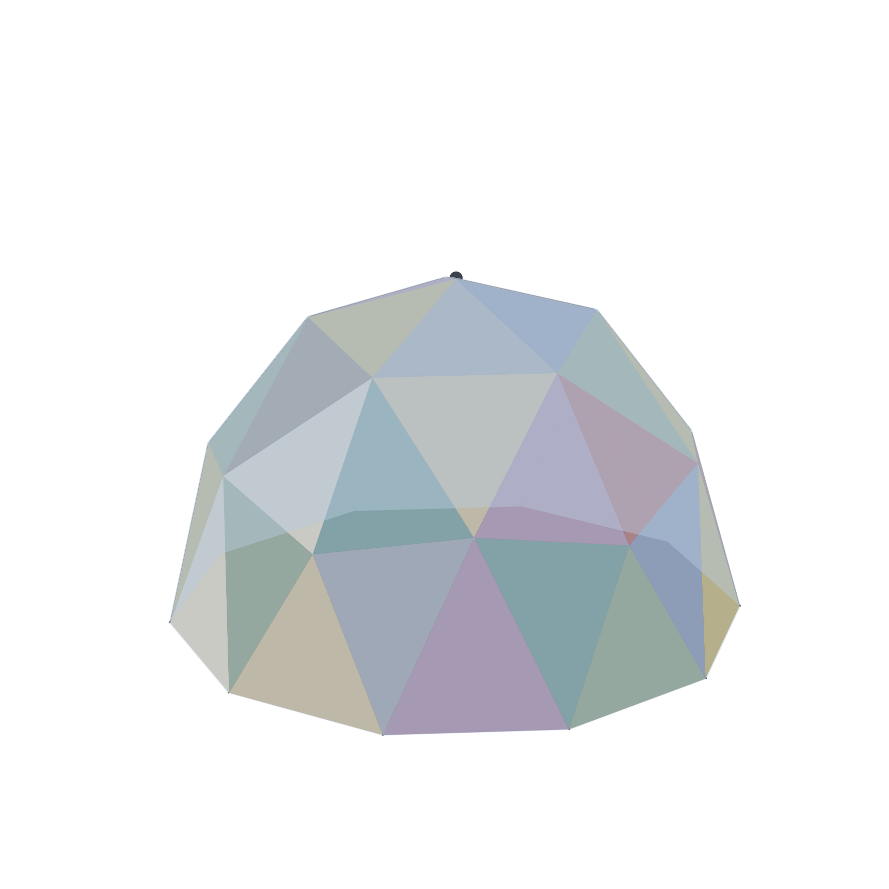

## The cap against the hull

The numbers come out of the same model the campaign film quotes, and the
table is the one worth reading slowly, because the saving is not the
interesting column:

| layers | cap stack | hull plus its bays | the cap saves |
|---|---|---|---|
| 0 | $3,265 | $9,905 | -- |
| 3 | $3,471 | $9,905 | $6,434 |
| 7 | $3,748 | $10,510 | $6,761 |

At three blanket quilts the cap stack is 3,471 dollars against
9,905 for the hull and the bay sandwich it needs --
6,434 dollars less, which is the six thousand dollars the
campaign leads with. At seven quilts the saving is 6,761.

But look at the row the table does not show. The hull's cavity holds
4 layers and then its R-value stops moving. The cap has
no cavity. Its seventh quilt is a hat 15.6 per cent bigger than
the first one -- area goes as the square of the radius, so every layer
makes the next cap a size up -- and it keeps buying R-value for as long as
the owner keeps quilting.

The list price moves with the materials. The standard article with the cap
lists at 12,036 dollars -- 43 dollars a square
foot of floor -- where the same dome with the hull lists at
21,513. The cap is not a discount shell. It is the standard
article, and the hull is the upgrade.

## What the cap gives up

The honest list, because a cap that was only upsides would be a tarp with a
marketing budget.

**It is not structural.** The laminated hull was a stressed skin; a
strapped cap is not. Uplift is carried by the ground anchors and the frame
alone, so the frame has to be good for the whole wind load rather than
sharing it.

**The outer layer is sacrificial.** A rain-slick cap lasts
8 years and the membrane under it 12;
they are meant to be replaced, and the thirty-year arithmetic prices the
replacements rather than pretending a cap is bought once.

**Two impermeable layers with fabric between them is a moisture trap.**
In a cold climate the dew point lands in the quilt, and fabric that gets
damp stops insulating and starts rotting. The seam duct -- the airflow
through the frame's own channels -- is the answer to this, and the seam
duct is an experiment, not a solved problem. This chapter would rather
name the dependency than hide it.

**It looks like a tarp.** That is a planning objection, a resale problem
and a neighbour problem, and no amount of arithmetic answers it.

## Why the hull becomes the upgrade

None of that makes the hull a worse thing. It makes it a *later* thing.

The frame does not know which skin it is wearing. The cap dome and the
hull dome are the same 120 members, the same bays, the same
column. The buyer who starts with the cap can buy the hull in year five
and it fits -- which is the way the whole system is meant to run: the
cheap hat first, the fifty-year hat when the money exists, and the quilts
carried over between them.

That is what "the dome stacks hats" means. The building is not a shell. It
is a frame with a choice of skins, and the choice can be made again.

---

# 70. The Mast and the Floor

*A steel-core mast through the utility column, a wooden floor that clamps to it -- the upgrade bought after the dome -- and an apex ring that hoists the whole structure*

## The Mast and the Floor

The dome's floor is the upgrade, and that is the sentence this chapter is
built on.

On a pad, the floor is somebody else's problem -- the deck the dome stands
on belongs to the host and stays when the dome leaves. But a dome that
wants to move, or to stand where there is no pad at all, needs a floor of
its own. And the way to give it one is not four legs and a skirt. It is a
mast.

The mast runs up the middle of the utility column -- the insulated chase
that already goes from the service port to the apex -- and out through the
top. It is 12.0 feet of steel core clad in timber: metal where
the strength is, wood everywhere else, because everything else in the room
is wood and a bare steel pipe reads as scaffolding. The services ride
inside the chase around it, so the structure and the plumbing share one
penetration and one object to look at.

At the top, under the seal cap, sits the lifting ring -- a
240 dollar forging whose whole job is to be the point the
building hangs from when it is hoisted. At the bottom, a flange bolts the
mast to the service port. Between them, the floor clamps on.

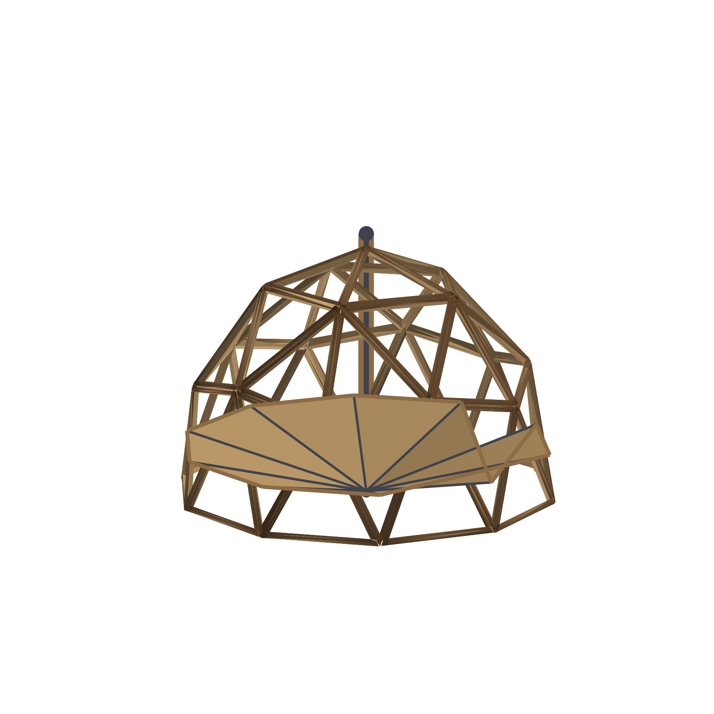

## Why the mast runs through the column

The column was already the right shape before the mast existed.

It is floor-to-apex. It is centred. It is the one part of the building
that touches the ground, the walls and the sky. The design decision is
therefore not "where do we put a mast" but "the chase gets a spine" -- a
steel core inside the chase, so the services keep their route and the
structure gets its one load path in the same twelve inches of the plan.

The floor follows the same idea. Its hub is a 310 dollar steel
ring that clamps the mast; from the hub, 10 radial steel
spokes run to the base ring; timber decking covers the spokes, and a low
rail runs the edge. 277 square feet of floor that did not
exist until the buyer wanted it, held up by the mast instead of by the
ground -- which is what makes the next chapter possible.

## What it costs, and what it lifts

The upgrade, line by line, out of the same model the campaign quotes:

| line | dollars |
|---|---|
| the mast through the column | $622 |
| the dome's own floor | $1,899 |
| the floating rig (next chapter) | $1,490 |
| **all three** | **$4,011** |

And the weight. The frame alone -- the 120 members of green
pine -- is 2,478 pounds. The shell or cap, the column, the
floor and the rig all add to it, and the honest thing has to be said
before anybody ties a rope to the ring: **this book prices the parts. It
does not rate them.** The mast's section, the ring's forging and the
hoist's capacity are an engineer's numbers, computed for a specific
building on a specific site, and nothing in these pages is a substitute
for them. What the model can say is that the geometry of the lift is
simple -- one point, one axis, one load path -- which is the kind of lift
engineers like to be handed.

The floor, in other words, is the purchase that turns a dome from a thing
that stands somewhere into a thing that can be picked up and put somewhere
else -- including somewhere with no ground under it at all.

---

# 71. The Floating Dome

*Hang the mast from three cables between trees and the dome floats with its own floor under it -- a design possibility, with the loads named as the engineer's job*

## The Floating Dome

The mast that hoists the dome can also hang it. That is the whole of this
chapter, and it is the reason the previous one built the floor first.

Three cables run from the apex ring to three trees. The rig is
1,490 dollars of galvanized cable -- three legs of
28 feet -- a forged hanger that rides the ring, tree-hugger
slings that put no holes in the trees, and a brake winch to do the
hoisting. Winch the dome up, tie the cables off, and the building hangs
in the air with its own floor clamped to the mast under it.

That is the floating dome: no pad, no piers, no ground at all between the
trees -- the same 120 members, the same cap, the same
column, held from one point like a lamp.

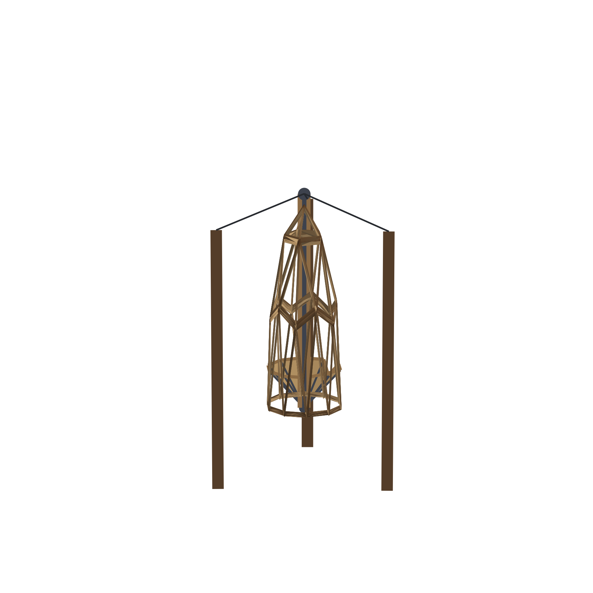

## What changes when the ground goes away

Everything the earlier chapters assumed about the ground quietly reverses.

The base ring stops being what holds the building up; the mast is. The
floor stops being something the dome stands on and becomes something the
dome *carries* -- clamped to the mast, hanging under the shell, level
because the mast is level. The utility column keeps its job: services
come up a flexible drop along one cable, into the chase at the apex, and
down through the column the same way they would on a pad. The only
difference is that the water line is a hose and the power line is a
cable, and both arrive from above instead of below.

The trees do the work the ground did, and the deal is made without a
single hole in the bark -- saddles, not bolts -- because a tree that is
still alive is a foundation that maintains itself.

## What would have to be true

Now the honest page, because this is the least-built idea in the whole
book and it should be read as a drawing rather than a report.

The loads are real and none of them has been rated here: the cables in
tension, the trees in bending, the mast in compression, the ring under
the weight of 2,478 pounds of frame before the floor and the
skin are even counted. Three points of support mean the building hangs
steady in still air and *moves* in wind -- a dome hung from cables is a
pendulum, and the trees flex with it, and the arithmetic of that is an
engineer's, not a builder's.

So the conditions this idea would have to meet are the same conditions
the closing audit of the last part named, restated for the air: a site
with three sound anchors and the room for them; a mast, ring and rigging
sized for the lifted whole; a way in -- a ladder, a stair, a bridge --
that does not pull the building sideways; and an authority that will
permit a dwelling hanging from living trees, which most will not without
a stamp.

And yet the arithmetic worth keeping is the one this chapter opened with.
The same mast, the same floor, the same building: hoisted onto a pad one
month, hung between trees the next, winched onto a trailer the month
after that. The floating dome is not a product. It is the same product
with the ground removed -- and the ground, as the pad chapters spent a
part of this book proving, was always the part you could not take with
you anyway.

---

# 72. Seven Ways to Make a Wedge

*The solid split-log wedge is the reference, not the whole idea: hollow, laminated, log-derived, manufactured and hybrid members all exist, and each one trades something*

## Seven Ways to Make a Wedge

Every member in this book so far has been one solid eighth of a
log — the reference member, chosen because it needs nothing but
a saw and a tree. This chapter is the rest of the idea: the
other six ways to arrive at a triangular-section member, each
one trading something the reference member has for something it
has not.

The seven are not rivals fighting for one crown. They are a
ladder of capability, and the book's method sits at the bottom
of it on purpose — the rung that costs the least and asks the
least, and the one from which every other rung is reachable
later. A builder who starts with split logs and later wants a
factory member has not changed methods; they have climbed this
chapter's ladder, one rung at a time, and each rung is listed
here with what it buys and what it gives up.

## The solid split wedge

The reference member, stated as the baseline the other six are
measured against.

What it is good at: it exists the moment the saw finishes the
seventh cut. No shop, no glue, no kiln, no supply chain — the
tree supplies the material, the saw supplies the shape, and the
harvest advantage of Chapter 13 applies in full,
because nothing is ever squared, edged or planed. It is also
the member that grades itself: bark out, pith in, the
orientation cue of Chapter 14.

What it cannot do: it cannot be bigger than the tree it came
from, straighter than the tree grew, or drier than the day
allows. Its section is whatever the butt diameter and the split
count decide, its quality is whatever the forest produced, and
its perfection is whatever the grading passes let through. The
reference wedge is the *available* member, and availability is
its entire virtue — and its entire ceiling.

Every other entry in this chapter exists to raise one part of
that ceiling, at the price of giving up another part of the
floor.

## Hollow members

Stiffness lives near the surface: in bending, the material at
the middle of a section does almost nothing, which is why a
hollow triangle can use roughly half the material for most of
the stiffness. The frame's own weight — the green pine the
campaign computed — falls by a like fraction, and what two
people can lift changes, which changes how the dome gets
built.

The argument against, which the wedge book's own page calls
decisive: you cannot make one with a saw. A hollow triangular
member is four thin pieces, ripped accurately, joined along
four long glue lines, in a jig, by somebody with a shop — the
exact work the wedge method exists to avoid. And the whole
harvest advantage disappears: a hollow member is made from
milled boards, so it starts from the mill's recovery rate, not
the split's.

Where it would make sense: a manufactured dome, in a factory,
where the jig is a fixed cost spread over hundreds of frames
and the weight saving compounds through shipping. Not for
somebody with a chainsaw and 3 trees.

The middle option nobody tries, noted because it is the bridge:
solid wedges with the middle bored out along the length. It
keeps the sawn faces, keeps the continuous grain at the
surface, removes some weight — and it is fiddly, it needs a
long auger, and nobody has measured what it does. Listed as an
idea rather than a recommendation.

## Laminated members

Glued strips buy what the tree refuses to sell: size beyond
the tree, straightness on demand, and defect-spreading — a
knot in one strip is surrounded by clean wood in its
neighbours, where a knot in a solid wedge is a knot in the
member.

The price is the shop, again: laminating is a glue, clamp and
press operation, it starts from milled boards, and it inherits
the mill's recovery rate and the mill's supply chain — the
whole middlemen ladder of Chapter 2, paid back
in exchange for straightness. Lamination is the answer when
the build needs members the local woodlot cannot supply in one
piece, or when the frame must be *predictable* to a degree
rough timber cannot promise. It is not the answer for the
first dome, and the chapter says so plainly: the first dome's
job is to prove the method, and the method's proof is that it
needs nothing the tree did not already provide.

## Log-derived, manufactured, and hybrid

The middle three rungs, grouped because each one trades the
tree's own shape for a different kind of leverage.

**Log-derived.** The films' variant of the reference: buck the
log into longer sections, split each into eight, and crosscut
every wedge in the middle — two struts per section instead of
one. It is the same solid wedge, organised differently, and it
suits the sixty-foot trunk the pine film prices: five long
sections, eighty struts a tree. It is not a different member;
it is a different *schedule* for the same member, and the book
keeps both schedules visible so the two trees the films count
and the 3 trees this book fells can be reconciled honestly.

**Manufactured.** The wedge, moulded in a factory: screw
holes, threaded inserts and the spline ridge already in the
part, a steel core where the strength must be, a load rating
off a test rig instead of an argument. It is a better product
and a worse argument — better because consistency, grading and
repeatability arrive with the part; worse because it costs a
factory, a tooling run and a supply chain, and the whole point
of the method was that a building could be made where those
things do not exist. The manufactured member is the method's
*export* version, the one the campaign's tooling budget
exists to develop — and Chapter 77 is where the
campaign's version of this rung lives.

**Hybrid metal and wood.** Steel where the load is a joint,
wood where the load is a span: a steel base ring under the
frame's own compression, a steel mast through the column,
steel apex and base connectors where the wood's weakest
directions meet. The book's later chapters already assume this
rung in places — the mast of Chapter 70, the
core of Chapter 78 — and the honest note is the
one those chapters carry: metal in a wooden frame is a
*decision* about thermal movement, galvanic contact and
connection detail, made with the engineer's sentence from
Chapter 10 in force.

## Choosing one

The decision tree that sends each builder to one of the seven,
and the two questions that do most of the sorting.

The first question: **where does the wood come from?** If it is
standing on the site, the solid wedge — log-derived or
bucked-short — is the whole ladder you need, and every other
rung is an upgrade to be bought later, if ever. If the wood
must be bought, the ladder inverts: the manufactured or
laminated member stops being an extravagance and starts being
the honest comparison against the lumberyard, with the split's
harvest advantage already forfeited.

The second question: **who is building it?** One person with a
saw and a fortnight — the reference wedge, full stop. A shop
with clamps and patience — laminated or hollow. A company
amortising a mould — manufactured, with the hybrid's steel at
the joints. The method has never been one member; it has been
the *triangle*, and the seven ways to fill one are this
chapter's inventory of how far the triangle travels before it
stops being the book's cheap, tree-shaped, saw-cut friend.

---

# 73. Every Other Way of Doing It

*Eight frame materials, eight strut sections, sixteen panel types, nine claddings and eleven foundations -- all priced on this dome, so the choice is a comparison instead of a preference*

## Every Other Way of Doing It

This book argues for one combination of material, section,
panel, cladding and foundation — the combination Chapters
12 through 40 built. This
chapter is the counter-weight: all the others, priced on the
same dome, from the wedge book's own catalogues, so the
book's choice is a comparison instead of a preference.

The five tables below are the breadth of the whole geodesic
world, compressed onto one page: eight frame materials from
whole-tree trunks to structural steel, eight strut sections
from round tube to the quarter wedge, sixteen panel types from
open frames to precast concrete, nine claddings from nothing
to a poured shell, eleven foundations from gravel to a
treehouse platform. Every option is costed on the reference
build's own quantities — the same member count, the same
surface, the same span — which is the only way two options
can honestly be compared at all.

## The breadth tables

The page is the argument. The reference row — the solid split
wedge, bark out — is not the cheapest row in every table and
the book does not pretend it is. Whole-tree trunks are cheaper
as material; gravel is cheaper as a foundation; an open frame
is cheaper as a panel. What the reference combination wins is
the *combination*: the only row across all five tables that
needs no shop, no mill, no second trade and no supply chain —
which is the one property the tables cannot print but the
chapter can state, and it is the property the whole method was
built to buy.

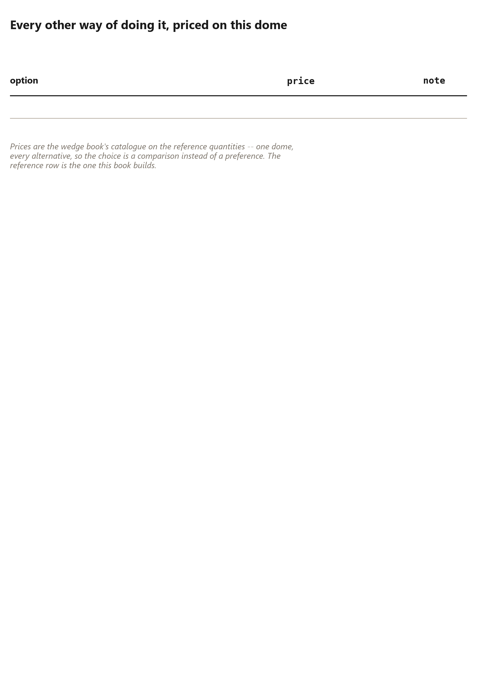

## What the prices say

The pattern across all five catalogues, read once and stated
plainly.

The industrial rows — steel, aluminium, precast — win on
strength and lose on *access*: their prices assume a buyer who
can order them, a truck that can deliver them, and a building
that needs what they sell. The natural rows — trunks, split
wedges, bark — lose on uniformity and win on exactly what the
industrial rows cannot buy: they are already on the site, they
cost what the fuel costs, and they ask for no permission. The
prices are not a ranking of quality; they are a ranking of
*position*, and the builder's position decides which row is
right before any preference does.

## When a losing row is the right row

The chapter's closing honesty, because a table of options is
useless if it cannot crown its losers.

Every option in these tables is somebody's right answer. A
foundation for frost, a steel frame for a permanent public
structure, a concrete shell for a bunker, a treehouse platform
for a site with no ground to spare — the rows lose on this
dome and win on theirs, and the table exists so that choice
is made with the numbers up, the way this book makes every
choice. The reference combination is the book's answer to
*3 trees, one saw, forty hours*. The tables are the same
question, asked eleven ways, with the whole catalogue
priced — and the honest close: the book's way is not the only
way, it is the way the numbers say fits the person this book
was written for, and every other row is here so that
sentence could be checked.

---

# 74. Hubs, or No Hubs

*The trade this method answers, counted across the whole catalogue rather than argued: hubs buy a familiar kit and charge for it in parts, no-hubs buys the woodpile and charges in wood*

## Hubs, or No Hubs

Every geodesic dome in the world faces one decision before any
other: do the struts meet at a connector, or at each other?

The hub is the familiar answer — the machined star at every
vertex, the kit's photograph, the thing every dome catalogue
shows. The hubless answer is this book's — the pinwheel of
Chapter 15, where each member's butt lands on the
next member's side and the vertex is air. This chapter is the
trade, counted across the whole catalogue rather than argued,
because the two answers are not rivals: they are the same dome
sold to two different builders, and the numbers say which
builder each one is for.

## What a hub buys

A hub makes every joint the same part. One machined connector —
drilled to the frame's angles, plated, catalogued — replaces
every question about how three, five or six struts meet at a
vertex. The struts all end at the same point, each end cut to
the same pattern, each bolt in the same hole. For manufactured
struts from a factory, where every stick arrives identical and
every angle is already known, the hub is the right answer: it
is the cheapest way to join parts that were made to be joined
by it, and it makes the dome a *kit* — ship the parts, follow
the drawing, bolt the stars.

The hub also buys familiarity, which is a real asset with a
real price tag: the inspector has seen one, the appraiser's
comparable has one, the spare part exists in a catalogue. A
hubbed dome speaks the language the building world already
speaks, and for a manufactured product sold to people who will
never cut a stick, that language is worth the hub's cost.

## What a hub costs

The hub's bill arrives in three places, and the third is the
one this book exists because of.

First, the parts: a hub per vertex, plus its bolts, washers and
drilling — a real line item, paid per corner, for the life of
the build. Second, the precision: a hub assumes its struts all
arrive at the same point at the same angle, and every strut
that does not — every bowed stick, every drifted cut — fights
the hub instead of fitting it. The kit economy buys its
sameness from a factory; the hub inherits the factory's
requirements.

Third, and the decisive one for this book: the hub cannot
absorb what rough timber *is*. The frankendome's hub
experiments — Chapter 4 — were
this cost, paid in afternoons: shims, washers, longer bolts,
every joint a negotiation between a machined star and a stick
that never agreed to the drawing. The hub is perfect for
identical struts and useless the moment the struts differ —
which is exactly the moment this method begins, because the
struts are split logs, and the split log is the one member
the hub economy was never asked to join.

## What no-hubs buys and costs

The pinwheel deletes the hub by letting each member end land
on the side of the next, and it pays for the deletion in
wood — the 1.85 members per unique edge
that Chapter 18 accounted for. That ratio is the
no-hub bill: a frame that owns every edge in its own panels
carries more timber than a frame that shares struts between
neighbours, and the extra timber is the price of never needing
a connector.

What the wood buys, in order: a joint that tolerates the
stick's own shape, a panel that can be built flat on a bench,
a seam with room for a key and a gasket, and a frame in which
every member is a member you can watch and swap — the
redundancy Chapter 19 spent on grading.
The no-hub dome is not cheaper in timber; it is cheaper in
*machines*, and it is the only version a woodpile can be
built into.

## How to choose

The three questions that sort it, stated as the chapter's
whole conclusion.

Who is cutting the wood? A factory — hubs. A chainsaw —
no-hubs, and the chapter's answer is not a preference but a
consequence: the hub assumes the stick, and the saw cannot
supply the assumption.

Who is assembling it? A buyer following a drawing — hubs, the
kit's instructions are the hub's. A builder who cut the pile
and built the bench — no-hubs, the jig is the instruction.

Will the dome ever be taken apart? A kit that ships and
re-ships wants its connectors back — hubs. A frame that moves
whole on a truck, or stays where the tree stood — no-hubs,
where the only hardware is the screws and the keys, and
nothing was ever bolted to a star.

The chapter closes with the book's own position, stated the
way the breadth tables stated it: hubs are a fine building
system, the right one for most of the dome world — and this
book is the book for the rest of it, the part with 3 trees
and a saw, where the question was never "which connector" but
"what would it take for there to be no connector at all". The
answer is the pinwheel. The bill is the 1.85.
The whole account is Chapters 15 and
18, and this chapter was the summary sheet.

---

# 75. A Zome Is Not a Piece of a Sphere

*Sweep a star of directions instead of subdividing a solid and every panel is flat by construction -- the zome, the one-panel golden zome, and what the flatness costs*

## A Zome Is Not a Piece of a Sphere

The geodesic dome starts from a solid — the icosahedron of
Chapter 8 —
and projects its faces onto a sphere. A zome starts from
directions and sweeps. The difference is one sentence, and it
decides everything about the panels: **a geodesic panel is a
flat triangle standing in for a curved surface; a zome panel
is flat because the whole zome is flat, panel by panel, by
construction.**

The zome is in this book because the project's films teach it
and the wedge book gives it a chapter, and because it is the
method's natural cousin: same members, same seams, same jig —
a different *shape family*, with one property the geodesic
dome has to work for and the zome gets for free. This chapter
is the sweep that makes the property, the famous one-panel
zome that follows from it, and the honest bill the flatness
charges at the joints.

## The sweep, in four steps

From a star of directions to a frame of flat parallelogram
panels, with the guarantee built in at every step.

**One: choose a star.** Pick a handful of directions in space —
a star of lines through the origin, like the ribs of an
umbrella opened in three dimensions. These directions are the
zome's *edges*, and they are chosen, not inherited from a
solid.

**Two: draw the planes.** For every pair of directions, the
two lines span a plane. Each such plane is the face of a
panel, and because it is spanned by two straight lines, it is
perfectly flat — not approximately flat, not projected flat:
*flat*, the way a sheet of paper is flat.

**Three: bound the panels.** In each plane, the panel's edges
are the points where the star's lines meet the design's
envelope — cut the plane into a parallelogram or a triangle
using the neighbouring directions as the other two sides.

**Four: assemble.** The panels meet along the star's
directions, each edge shared by two flat panels that were
flat before they met. The frame that results is a zome: a
shell of flat panels hanging on a star of directions, with no
curved surface anywhere in its ancestry.

The guarantee is the whole point. A geodesic dome's panels
are flat *approximations* of a sphere, and the sphere keeps
its curve in the fold angles between them — the seam schedule
of Chapter 16 is the book's payment of that debt.
A zome's panels are flat because the geometry never asked
them to be anything else, and the fold angles fall out of
the star instead of the sphere. Nothing was projected.
Nothing was approximated. The flatness is not a
manufacturing achievement; it is a property of the
construction.

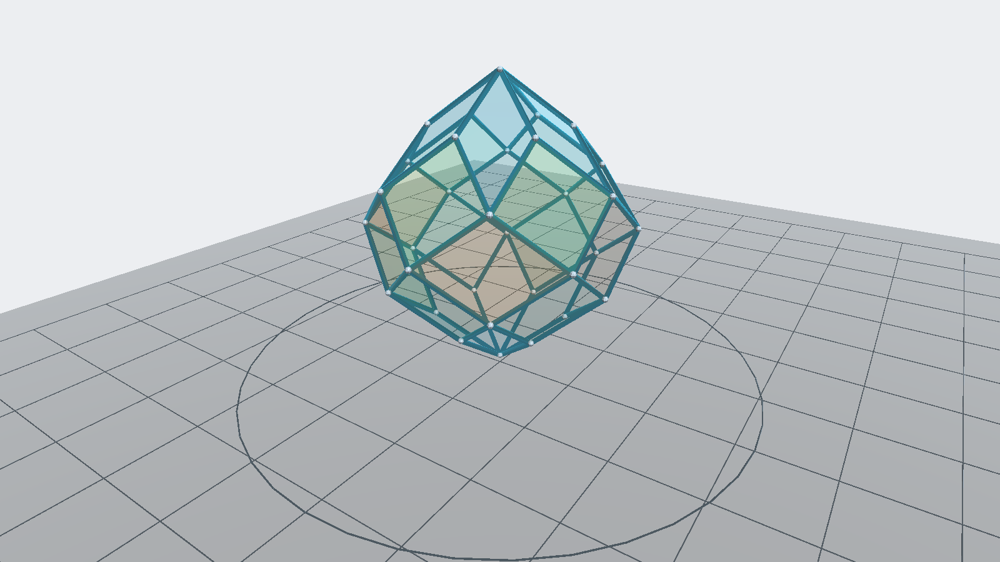

## The zome

The plate is the zome standing: a point on top, level rings
of hubs where the directions cross, and every panel a flat
parallelogram hung between them. Read it against the
geodesic plate of Chapter
8 and the
difference is the chapter: no two triangle shapes, no fold
schedule, no sphere under the surface — a shell that looks
like a crystal because it is built the way one is, face by
flat face.

The zome's counts are the sweep's counts: the directions
decide the hubs, the hub pairs decide the panels, and the
whole thing can be counted before any wood is bought —
which is exactly the discipline the book's method chapters
applied to the geodesic frame, transferred to the star. The
top comes to a point because the star's directions meet
there; the hubs land on level rings because the sweep is
symmetric; and the panels hang flat because they were always
going to.

## The famous one-panel zome

The star's freedom has a limit case, and the limit case is
the famous one: choose the directions *equal* — every
direction in the star at the same angle to its neighbours —
and every panel the sweep produces is the same panel.

One strut length, one panel template, ninety repetitions.
The one-panel zome is the flat-panel world's answer to the
geodesic's two-lengths-two-shapes economy, and it is
genuinely famous among zome builders for the same reason
this book loves the 2V dome: a frame of one repeated thing
is a frame a jig can build, and the jig does not care
whether the thing is a triangle or a parallelogram.

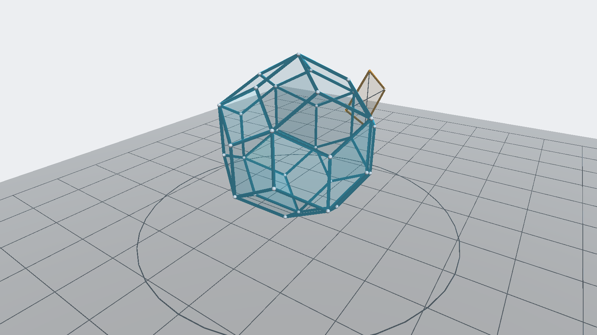

What the golden zome charges for its single panel is the
same bill every simplification charges, moved to the next
line: the joints get particular, the floor meets the frame on
a slope that wants its own treatment, and the roof's point
concentrates the water the geodesic's crown was spreading.
The one-panel zome is not the better dome; it is the *simpler
one*, and the simplicity is bought with the star's freedom —
which is the chapter's closing distinction, stated once more:
the geodesic dome pays for the sphere at every seam, and the
zome pays for flatness at every corner. Pick which bill you
want, and the method — the split, the jig, the seam — builds
either one.

## Zome against geodesic dome

The comparison table's prose, because the chapter owes the
reader the choice the films make side by side.

A geodesic dome is rounder: its panels approximate a sphere,
so its skin is the smoother weather surface and its floor is
the larger circle. A zome is flatter: its panels need no
approximation, so its joints are the simpler ones and its
glazing — the one place flatness pays the builder directly —
is a matter of cutting rectangles instead of solving
triangles. The counts differ the way the constructions
differ: the zome's template count is set by the star's
symmetry, the geodesic's by the frequency. And the method's
answer to both is the same sentence the book has been
repeating since the tree: **the wedge does not care which
shape family it frames.** It cares that the frame is made of
triangles or of flat panels a jig can repeat — and both
families are, which is why the zome gets a chapter instead
of a footnote.

---

# 76. Exactly Twelve Pentagons, Always

*A sheet of hexagons will not curve, curvature is bought with missing angle, and the missing angle always costs exactly twelve pentagons -- the hexagonal dome, and where it stops being flat*

## Exactly Twelve Pentagons, Always

The hexagon is the panel a factory loves: one shape, flat
sheets, six identical sides, and a tiling that covers a floor
with no gaps and no thinking. The question the hexagonal dome
asks is what it takes to make a *sheet* of hexagons into a
dome — and the answer is a theorem so tidy it sounds invented:
**exactly twelve pentagons. Always.** No more, no fewer, at
every size, for every hexagonal dome that ever closes.

This chapter is the theorem, the dome it builds, and the place
the hexagon's luck runs out — because the hexagonal dome is the
project's other cousin, the one the hex film teaches, and its
lesson is the geodesic's lesson from the opposite side: the
dome pays for its curve somewhere, and the somewhere is never
optional.

## Curvature is bought with missing angle

Flat hexagons tile a plane exactly — six sides, three meeting
at every corner, the angles adding to a full circle at every
vertex, the sheet lying flat because the angles *agree* to
lie flat. To make the tiling curve, some of that agreement has
to be broken: somewhere, the angles at a vertex must add to
*less* than a full circle, and the missing angle is what makes
the sheet buckle upward into a bowl.

Where does the missing angle go? It goes where the tiling
changes shape — a pentagon. Five sides instead of six means one
sixth of the circle is missing at that vertex, and the
pentagon is where the sheet's flatness is spent. The
theorem is the count of how many pentagons the curve demands,
and the count is the one fact about hexagons worth
memorising: a closed surface of hexagons needs exactly twelve
pentagons, every time. Not because twelve is a nice number —
because the total missing angle the sphere demands is one
full turn's worth, and each pentagon supplies exactly one
sixth of a turn. Twelve sixths make the sphere. The football's
pattern is the same theorem; so is the buckyball; so is every
hexagonal dome the world has ever built.

The dome's version is the same tiling with the same bill:
twelve pentagons pay for the curve, the hexagons fill the
space between, and the whole thing closes into a hemisphere
with one strut length running through it — which is the
hexagonal dome's gift to the builder, stated next.

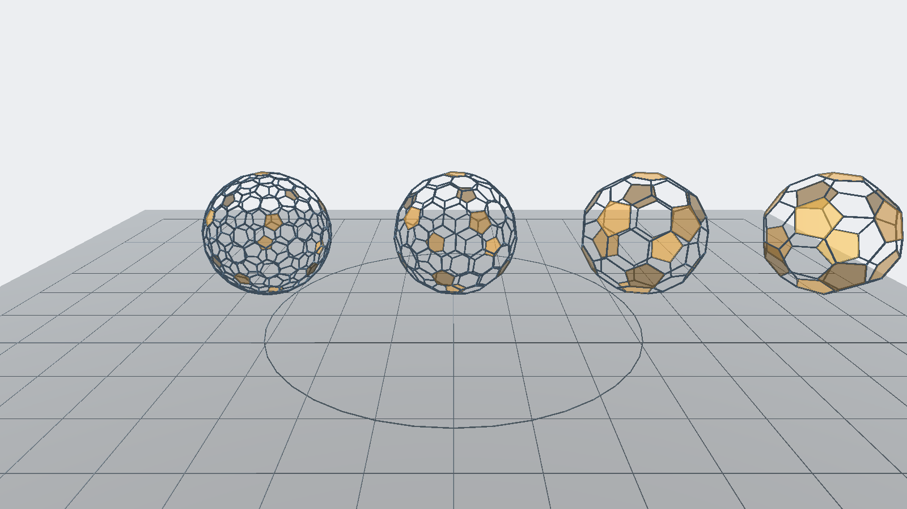

## Twelve pentagons

The plate is the hexagonal dome standing: a field of
hexagons, twelve pentagons hidden in it like the theorem
promised, and one strut length cut ninety times.

The one-strut economy is the hexagonal dome's whole appeal.
Where the 2V geodesic cuts two edge families and the pinwheel
turns them into four lengths, the hex dome cuts one — every
edge the same, every panel the same sheet, the factory's
dream made into a frame. The pentagons are the small print:
twelve panels of a different shape, cut from the same stock,
whose only difference is one fewer side. The cut list is one
length and two panel templates, which is the shortest cut
list in this book — shorter than the geodesic's, shorter than
the zome's — and the reason the hex dome is the one a
manufacturer would pick first.

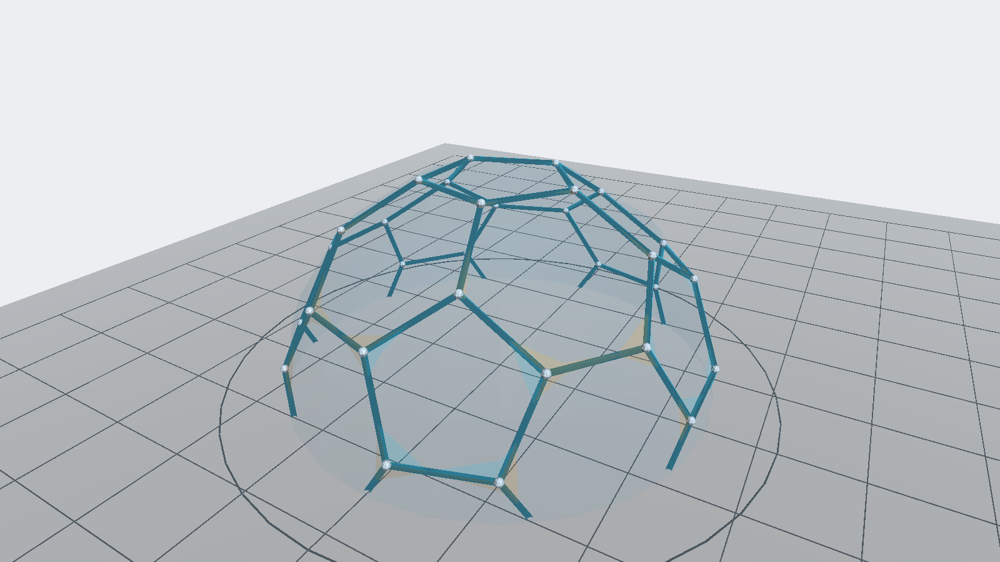

What the one-strut economy costs is the skin's flatness, and
the next section is where the cost lands.

## Where the panels stop being flat

The hexagon's luck runs out the moment the dome stops being a
hint and starts being a building.

The twelve-pentagon tiling curves, but its *panels* are flat
only while they are small enough that the curve is someone
else's problem. Step the hexagon count up — a bigger dome, the
same one strut length — and the panels themselves begin to
carry the curve: a hexagon spanning a curving surface is a
hexagon whose six corners no longer lie in one plane. The
panel *warps*, and a warped panel is a sheet that must be
bent, or cut into triangles, or replaced by the geodesic's
honest approximation — which is the point the hex film makes
with the two domes side by side.

The rule the chapter leaves on the bench: the hexagonal dome
is the cheapest dome in the book while its panels stay flat,
and the geodesic dome is the honest one after they stop. The
method — the wedge, the jig, the seam — builds either; the
split log never cared what shape its frame was pretending to.
But the *choice* belongs to the geometry, and the geometry's
sentence is the chapter's title: twelve pentagons, always,
and beyond a certain size, triangles — because triangles are
the only panel that can never be asked to warp, and the
geodesic dome is the building made entirely of that refusal.

---

# 77. Why We Call It a Stem Cell

*One undifferentiated dome body, one cut list, and the decision of what the building is for deferred to a set of panels -- fifteen buildings from one frame*

## Why We Call It a Stem Cell

A stem cell is a body that has not decided what it will be.
The frame this book has been building is the building version
of that — and the name is a discipline, not a slogan.

The discipline: the frame, the skin, the cap and the core are
the same in every version of the building, and the decision of
what the building *is* — a home, a gym, a guest house, a
workshop — is deferred to a set of panels that can be decided
later, swapped later, and taken to the next dome later. The
name forbids building the decision in. A house with its use
poured into the walls is a house that can only ever be that
use; the stem cell is the frame that refused, and the refusal
is what the catalogue of Chapter 80 prices.

## The undifferentiated body

The body that has not decided, listed the way the campaign
lists it, because the list is the argument.

One 2V frame — the 120 members, the
40 panels, the seams, the jig — identical
whether the building will hold a bed or a bench press. One
skin, one cap, one utility core, one cut list. The only thing
that differs between the fifteen buildings the campaign
names is which *panels* the walls are wearing: the windows,
the doors, the benches, the beds, the hooks, the sinks — a
set of interchangeable faces hung on the frame's own
openings. The undifferentiated body is the frame; the
differentiation is the fit-out; and the fit-out is panels,
which is the one part of a building that bolts on and off
without asking the structure anything.

The name does the work a name should: it stops the argument
before it starts. A "dome" is a shape; a "stem cell" is a
promise about *deferral* — the promise that the building's
purpose is the cheapest thing to change, because the design
put the purpose where change is cheap. The shape was always
the frame's; the name is the method's, extended to the
building's whole life.

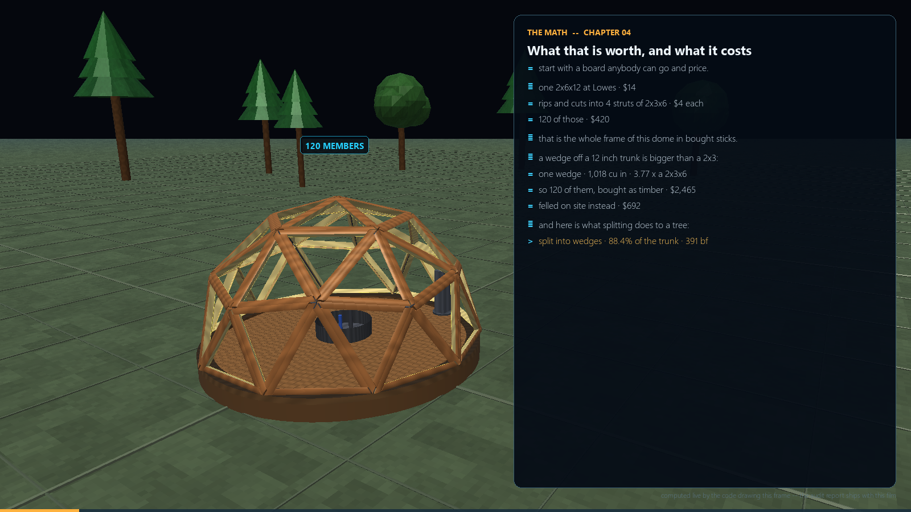

## The stem cell

The plate is the body before the decision: the frame standing,
its openings still wearing the blank panels they will keep
wearing until somebody chooses what the building is for.
Read it as the book's own dome, one step later — the fortnight
done, the shell on, and the single most expensive question in
building left deliberately unanswered.

That question — *what is this building for?* — is the one
every other construction method answers first, with concrete
and studs. The stem cell answers it last, with panels. The
difference is the difference between a decision and a
*preference*: a building that decides its purpose in its
walls has bought the purpose for its whole life; a building
that defers the purpose to its panels can re-buy it in an
afternoon, and the second owner inherits the option the
first owner paid for.

## The seeds

The fifteen named versions, because "any building" is a
claim until the catalogue says which buildings.

Home, food, storage, guest, gym, studio, workshop, garage,
nursery — and the rest of the campaign's list — each one a
*set of panels*, not a new building. The gym is the body with
its walls wearing racks; the guest house is the body with a
bed wall; the nursery is the body with light panels and a
low threshold. The frame never changes. The core never
changes. The cut list never changes — which is the catalogue's
entire economic point: the expensive, hard, structural parts
of the building are bought once, and the cheap, easy,
panelled parts are what make fifteen buildings out of one.

## What the name buys

The chapter's close: what calling it a stem cell actually
buys the builder, beyond a better metaphor.

It buys a resale argument — the building that can change its
use is worth more to its second owner, and the network
chapters lean on exactly this. It buys an upgrade path — the
fit-out can grow with its owner's money the way the shell
ladder grows with its owner's winters. And it buys a
manufacturing argument — one body, one cut list, one jig, and
fifteen products, which is what turns a building method into
a product line and a fortnight's dome into the campaign's
catalogue. The name is not the project's poetry. It is the
project's economics, wearing a word it earned.

---

# 78. Sink the Money Into the Part That Moves

*The utility core is the one component that outlives its shell, so it is the one worth buying once: fourteen parts, five services, one penetration*

## Sink the Money Into the Part That Moves

Every dome this method builds will be outlived by one part of
itself. Put the money there.

The part is the utility core: the column through the centre
of the dome, carrying power, water, waste and air in one
object that unbolts from the building and moves to the next
one. Every other component of the dome is either cheap enough
to leave behind or bolted to a frame that will stay — the
core is the one purchase that survives its building, which
makes it the one purchase the book tells you to make properly,
once. The chapter is the core: what it is, the order it is
built in, and the accounting that turns a purchase into an
asset.

## What the core is

The column, stated as the campaign states it: fourteen parts,
five services, one penetration.

The dome's centre is the one point every radius meets, and
the column that stands there is the building's backbone for
services — the riser that carries power up from the pad, the
chase that carries water and waste down, the mounting point
for the fan, the light and the cooling that the room's
centre naturally serves. Five services, one object, and one
hole in the floor — the penetration that would otherwise be
five holes scattered through a structure whose whole
argument is closure. The column is the dome's answer to the
utility wall, and the answer is better than the question: a
wall divides a room, the column *defines* it, and the round
room's centre — the one place the furniture chapter kept
empty — is where the services already are.

The top of the column is the socket: the seal cap, the mast
of Chapter 70, the vent, the lightning's path to
ground — the apex is an *interface*, not a roof, and the
interface is standard across every building the catalogue
sells, which is the first half of why the core moves.

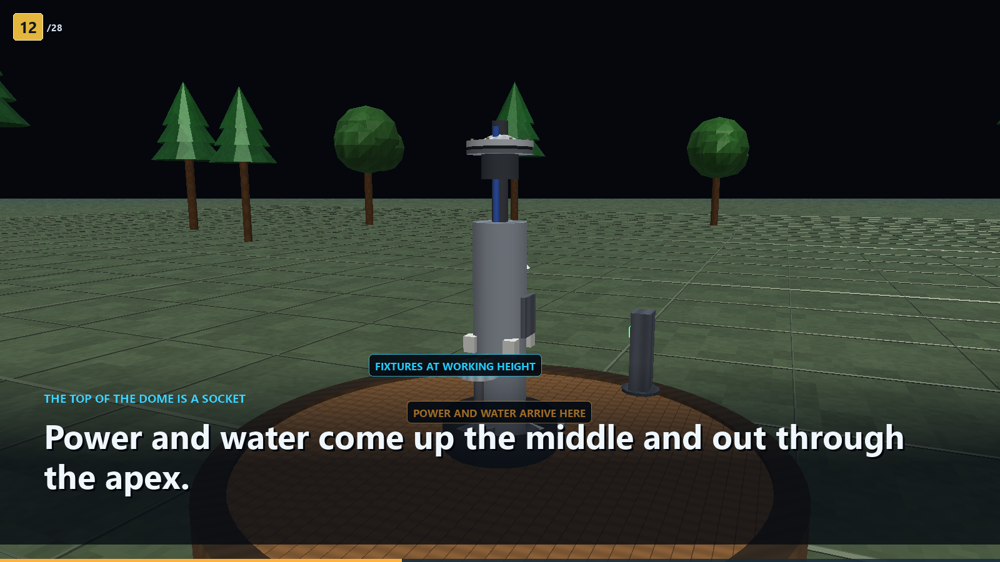

## Built on a bench, proved before it stands

The build order, which is the module-build film's whole
teaching and the core's quality system: drain first, because
it is the one you cannot re-route; water second, and proved
dry before anything electrical exists; power last, into a
core already known to be dry.

The order is not caution; it is sequencing the *checks*.
A drain tested before the walls close is a drain that can be
fixed with a wrench; a drain tested after is a renovation.
Water is proved by pressure before the first wire is pulled,
because water and electricity in one column are only ever
friends in the order they were tested. And power lands last,
in a core whose wet services have already passed — which is
why the module-build chapter can say the core is *proved
before it stands*, and why the campaign sells it as the one
part the owner does not make: the part that carries five
services is the part whose failure mode is the house, and
the house is not where that test belongs.

## A purchase that becomes an asset

The accounting, and the chapter's title made into a rule.

The core is the most expensive single component of the
dome's services, and the only one that transfers: unbolt the
column, cap the pad, and the next dome's core is already
bought. A purchase that outlives its building is the
definition of an asset, and the campaign's arithmetic rests
on exactly that — the core's share of the dome's cost,
justified by the domes it will serve rather than the one it
sits in. The rule for the builder is the chapter's title:
sink the money into the part that moves. The frame is
splendid and cheap and made of trees; the core is unglamorous
and precise and made of decisions — and when the building is
eventually left behind, the core is what you carry to the
next one. Everything else in the dome is a building. The
core is the project's *continuity*, and continuity is the
one thing worth buying once.

---

# 79. The Boat-Hull Shell

*Four ways to skin the dome, priced by the pound of glass and resin each one puts on: the hard shell as the fifty-year upgrade over the cap*

## The Boat-Hull Shell

The cap keeps the weather off. A hull *becomes* the weather
— one structural skin, laminated over the frame, that sheds
water, carries its own loads and refuses to come off. Four
systems build one, and their prices disagree on purpose:
each system buys a different number of years for a different
number of pounds, and the chapter's job is to make the
disagreement readable.

The hull is in this book as the fifty-year option — the
upgrade the cap of Chapter 69 deliberately
defers. The cap's whole argument is that the hard shell can
wait; this chapter is the hard shell, priced, weighed, and
sliced so that when the waiting is over the choice is a
comparison instead of a guess.

## Four ways to skin it

The four systems, each priced and weighed on the same dome,
with the honest note about what the prices rest on.

**Sheathed plywood.** Sheets over the frame, seams taped,
painted. The cheapest hull, the heaviest per pound of
weather protection, and the shortest life — a wooden skin
that needs its paint on schedule. It is the hull for the
builder who wants the dome closed *now* and upgraded later.

**Boatyard polyester.** Fibreglass cloth over a plywood or
foam core, wet out with the polyester resin the boat-repair
trade uses every day. The workhorse hull: familiar
materials, forgiving process, decades of life, and the price
per square foot the campaign quotes as its middle system.

**Premium marine.** Epoxy instead of polyester, better cloth,
better bonds — the hull for a dome that will be a *home*,
where the skin's life and the frame's life should match and
the cost difference is spread over fifty years.

**Vinyl ester.** The premium's premium: the resin class that
resists water absorption best, chosen where the skin sits
wet or the budget simply wants the longest interval between
decisions.

The prices the chapter quotes are the campaign's own,
computed from the shell's square footage and the glass-and-
resin weights each system puts on — and the honest note,
kept because the film that discovered it kept it: the
weights are hand-layup ratios, the prices rest on declared
material costs, and a real hull's final number is the
builder's own lamination quality. The table ranks the
systems; the quality decides the years.

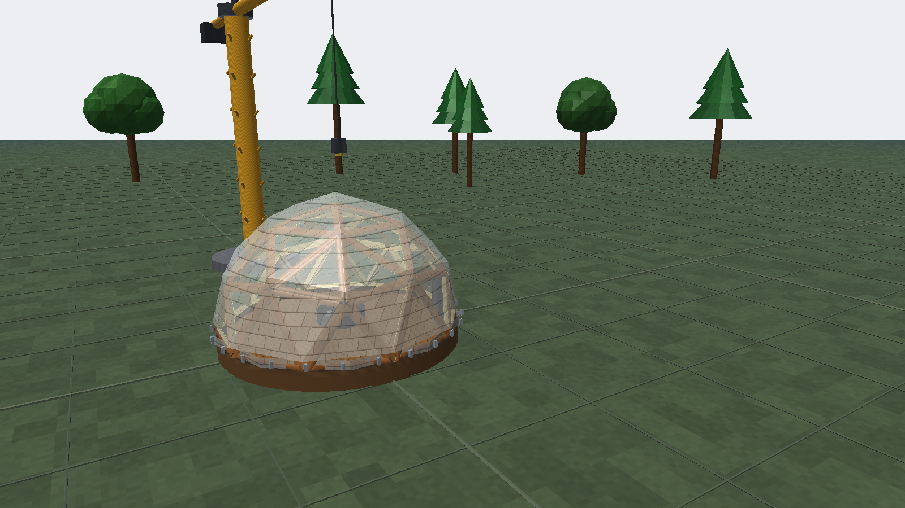

## Slices instead of a monolith

The one design decision that makes the hull an upgrade path
instead of a commitment: the shell is built in slices.

A one-piece hull can never come off — it is the building,
and every later change is surgery on the building. Four
slices with an S-shaped lip between them can: each slice
unbolts at its lip, the roof comes apart too, and the hull
that was the standard article becomes a *set* of
replaceable panels — the same panel logic the frame was
built on, carried out to the skin. The campaign's numbers
put the slice's cost against the monolith's and the
difference is small; what it buys is the stem cell's
deferral, one layer further out. A slice can be repaired
alone, upgraded alone, and carried to the next dome alone —
which is what turns a fifty-year skin into fifty small
decisions instead of one large one.

## Which one to pick

The ranking, stated without romance.

The cheapest hull is not the cheapest to own — plywood
needs its paint, and paint is a subscription. The premium
hull is a fifty-year decision the cap lets you defer, and
deferral is the book's whole method: build the cap, live a
winter, and let the dome's own behaviour tell you whether
the hull is ever needed — and if it is, which system the
site's weather actually earns. The chapter's last sentence
is the cap chapter's first, closed into a loop: **the hard
shell is the upgrade you buy after the soft one has taught
you what you need.** The hull is waiting. The cap is
working. And the four systems above are the comparison for
the day the waiting ends.

---

# 80. Fifteen Buildings From One Body

*The fit-out catalogue, priced cheapest first: the same frame as gym, guest house, workshop, garage, studio and nursery*

## Fifteen Buildings From One Body

The stem cell's promise, priced: the same body, fifteen
fit-outs, and the ladder that orders them. This chapter is
the catalogue Chapter 77 promised — the
reference page a builder or a backer reads to see what the
one frame actually becomes, with every row priced by the
same model so the rows can be compared.

The catalogue is ordered cheapest first, and the ordering is
the argument: the differences between the rows are panels
and services, not structure, so the ladder's rungs move in
small steps — a gym is the body plus racks, a guest house
the body plus a bed wall — and the whole ladder is
reachable from the same undifferentiated frame the fortnight
built.

## The catalogue

The table is the complete list: every named fit-out, the
panels it changes, and its price from the stem-cell model's
own quotes. The frame under every row is the same body, the
core is the same core, and only the walls' faces differ —
which is why the prices cluster the way they do, and why the
cheapest rung is not a smaller building but a *barer* one.

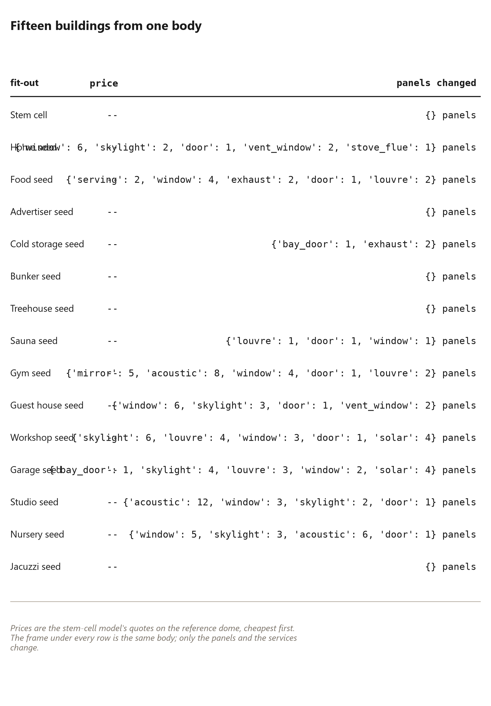

## Snap-on services

The plate shows the discipline that makes the ladder real:
everything else snaps onto the outside. A fit-out never
plumbs into a wall, never wires through a member, never
drills the frame for a decision the next owner may reverse —
the services hang off the frame's own faces and the
column's own ports, the way Chapter 78 built
them to, and the fit-out is the set of things that bolt on.
That is the difference between the catalogue and a showroom
of fifteen houses: a house has its services buried in its
walls, and this frame has fifteen faces it can wear
*without* burying anything.

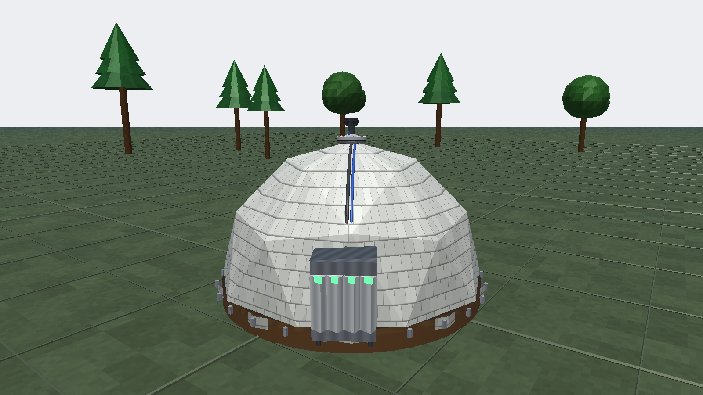

## Reading the ladder

What moves between rungs, and what the ladder is actually
telling the builder.

Between the cheapest rung and the dearest, the frame does
not change by one member. What moves is panels — the
windows, the walls, the benches — and services — the sink,
the rack, the bed — and the ladder's lesson is the stem
cell's lesson made countable: **the building's purpose is
its cheapest part.** The builder who reads the ladder
correctly stops asking "which dome should I build" and
starts asking "which rung can I afford now" — because the
rung is a purchase, not a construction, and the next rung
is always one set of panels away. The catalogue closes the
stem-cell chapters the way the shell ladder closed the
warmth chapters: the body is built once, the decisions come
one at a time, and the book has just priced the whole
staircase.

---

# 81. The Seam That Does Four Jobs

*The gap between two panels is not a joint waiting to leak. It is a channel: gutter, vent, dehumidifier and air barrier in one, and the services ride in it*

## The Seam That Does Four Jobs

The seam this book closed with a key has a second life. Open
it deliberately — plan the gap instead of merely filling it —
and the most feared line in the dome becomes the most useful
void in the building.

The 55 seams between the panels are a connected
network: every seam meets its neighbours at a vertex, and the
vertices join at the rim and the crown, so the whole shell's
seam system is one continuous channel running through the
entire frame. The wedge book's climate chapters — and the
films this chapter draws on — engineer that channel to do
four jobs at once, and the jobs are compatible for one
elegant reason: the channel runs on positive pressure, so a
leak stops being a leak and becomes a vent. This chapter is
the channel's mechanics; the next one is its climate.

## Gutter, vent, dehumidifier, air barrier

The four jobs, and the sentence that makes them one system.

**Gutter.** Water that reaches the seam — rain past the
skin's shoulder, condensation off the inside face — runs down
the channel's walls to the rim, where the lowest course
drains it. The seam does not merely resist water; it
*carries* the water that got in, to the one place it is
allowed to leave.

**Vent.** The channel breathes: air moves along it from the
rim to the crown and back, pushed by the stack effect — the
same warm-air-rises engine that drives every chimney. The
vent's job is to keep the cavity's air moving, so nothing
that should dry ever sits still long enough to rot.

**Dehumidifier.** Because the channel runs on positive
pressure — air pushed through it, not pulled — moisture in
the cavity is carried out rather than drawn in, and a leak in
the channel pushes air *out* instead of weather *in*. The
sentence from the opener, stated as physics: the channel's
pressure makes its failures vent, which turns the dome's
worst-case leak into an air change.

**Air barrier.** The channel's walls are the panels' edges,
and the edges, sealed along their length, are the building's
airtightness line — the continuous break that stops the
room's air from short-circuiting through the shell. One
system, four jobs, and the jobs are not stacked; they are
the same airflow, doing four things on its way past.

## What fits in the channel

The channel is the building's service corridor, and the
question of what fits is answered by the channel's own
cross-section: water and wire fit; a round duct does not.

The V between two wedges is a long triangular void — wide
at the outside face, narrow at the key. A small pipe, a
cable, a sensor line: all fit, following the seam from rim
to crown the way the services chapter of Part One
prescribed. A round duct — the diameter a ventilation system
wants — does not fit, and the honest answer to that refusal
is the chapter's most practical trick: the key becomes a
spacer. Open the seam wider, print the key in two profiles
that hold the gap apart, and the channel *becomes* the duct
— a triangular duct, sized by the gap, running where the
frame was already going.

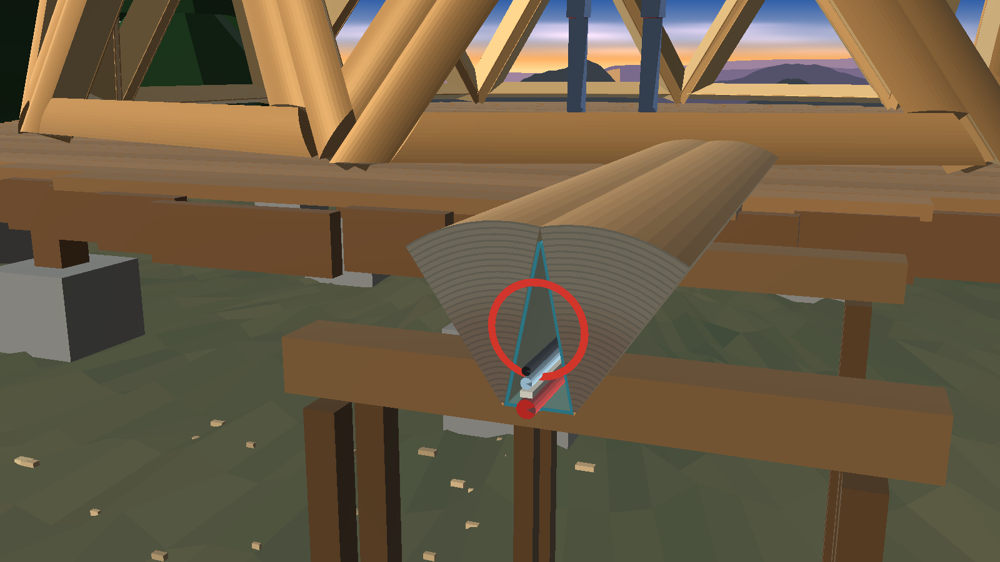

The spacer's cost is the dome's own: opening the seams grows
the shell slightly, and the film that worked this through
priced the growth in panels and dome diameter — the honest
note that the duct is not free, it is *bought with radius*,
and the builder who wants a round duct can pay in size
instead of in pipes.

## Keys in halves, and rosettes

The two details that make the channel buildable, borrowed
from the printing chapter of the film.

The key, printed in halves — two profiles, fed in from both
ends of the seam — because a long seam cannot be threaded
through the frame's closed corners, and a key you can push
in from either end is a key you can fit after the dome is
up. The halves meet in the middle, the gasket hides the
joint, and the seam's structural key and its channel walls
become one printed part — the film's answer to the
hand-cut key of Part One, for the builder whose patience
ends where a printer begins.

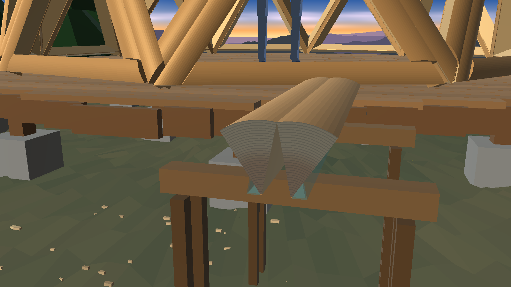

The rosette is the vertex's answer: where five or six seams
meet at a corner, their channels converge on one point, and
the rosette is the fitting that joins them — the channel
system's hub, doing at the vertices what the key does along
the seams. With rosettes in, the channel is one continuous
network top to bottom, and the four jobs of the first
section run through the whole shell instead of dying at
every corner.

## Two rules

The chapter's closing discipline, the two lines that keep a
clever channel from becoming a buried hazard.

**No pressure fitting inside a seam.** The channel's pipes
carry water only where the joint is accessible — a pressure
fitting buried in a seam is a leak the building hides until
the wall tells on it. The channel carries *chases*; the
pressure parts live at the core and the rim, where Chapter
78 put them.

**The cable in its chase is the inspector's call.** Wire in
a seam channel is a legitimate routing and a code question,
and the book's rule is the same as every load in Part One:
ask, before the skin closes over it, because the answer
afterward costs a seam.

The seam that does four jobs closes the chapter the way it
closes the building: gutter, vent, dehumidifier, barrier —
one channel, 55 lines of it, and the next
chapter is the air it carries.

---

# 82. Compare Dew Points, Not Humidity

*Never ask which air is more humid; ask which is drier, where it will condense, and which way the water moves -- the seam's climate, run by one controller*

## Compare Dew Points, Not Humidity

Humidity numbers lie about moisture. Dew points do not. This
chapter is the rule, the levels, and the drawer — the
seam-climate system that turns the channel of Chapter
81 into the building's moisture brain, run by
one controller that decides where the water goes before the
water decides for itself.

The chapter's material comes from the wedge book's five
climate chapters and the film that built them, and its
central claim is a rule of thumb with real physics under it:
**never compare relative humidities; compare dew points.**
The rest of the chapter is that rule, spent — the three
questions it asks, the levels it sorts the seams into, the
metal that moves the heat, and the desiccant that lives in a
drawer instead of a seam.

## The rule

Two airs compared by relative humidity can point the wrong
way; compared by dew point they cannot — because relative
humidity is a ratio against *temperature*, and temperature
changes the denominator.

Warm air at fifty per cent humidity carries far more water
than cold air at fifty per cent; a number that ignores the
temperature has quietly answered the wrong question. The dew
point is the question done right: the temperature at which
the air's water begins to condense out. Two airs compared by
dew point rank by how *dry* they are — the property that
actually decides whether water appears on a surface — and
the comparison never flips the way humidity's can.

The rule produces the three questions the rest of the
chapter answers, and the film's phrasing is worth keeping
whole: **which air is drier? Will it condense? And which
way does the water move?** Every decision in the climate
system — where to vent, where to drain, what the metal
does, where the desiccant lives — is an answer to one of
the three, and the three are asked in that order, every
time, by one controller.

## The four levels and the ring that cannot drain

The dome's seams do not all slope alike, and the slope
decides the water's fate — so the system sorts the shell
into bands.

Near the crown, the seams run steep: water moves fast,
dwells nowhere, and the channel's job is simple — carry it
down. Near the rim, the seams run shallow, and one band is
the troublemaker: the pentagon ring runs **dead level**, a
horizontal seam all the way around the dome, and a level
seam cannot drain — water that reaches it sits there,
against the key, against the skin, waiting for a gap.

The answer is the chapter's second rule: **condense low,
drain at the rim.** The system arranges for the moisture to
appear where it is welcome — the coolest, lowest, most
reachable part of the channel — and gives that band a
deliberate drain to the outside, so the water the ring
catches is the water the drain releases. The dead-level ring
stops being a trap and becomes the system's collection
point, and the stack effect — warm air rising through the
channel, pascals of it — keeps the whole loop moving in
the direction the drain expects.

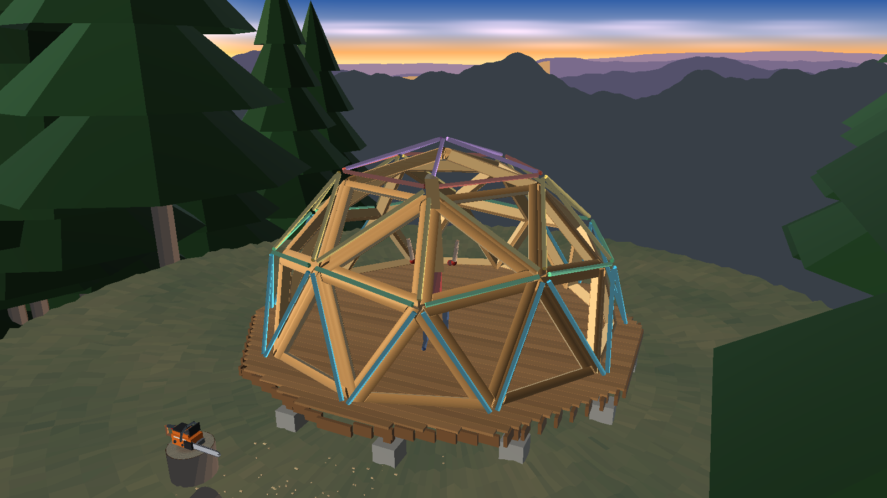

## A plate is a heat pump

Metal in the seam runs both ways, and the direction is the
climate's lever.

A Peltier plate — the solid-state heat pump the film
demonstrates — sits in the channel with one face to the room
and one to the channel. In winter it moves heat *in*,
warming the seam's inside face so nothing condenses where
the room can see it; in summer it moves heat *out*,
chilling the channel's surfaces to a steady fifteen or
twenty degrees below the room, so the moisture condenses
*there, on purpose* — on the plate's face, at the dew
point, where the drain of the last section is waiting. The
plate turns the chapter's threat into its instrument: the
water appears exactly where the design wants it, on a
surface built to receive it, and the frost that forms at
the dew point in the coldest weather is the system's own
thermometer, not its failure.

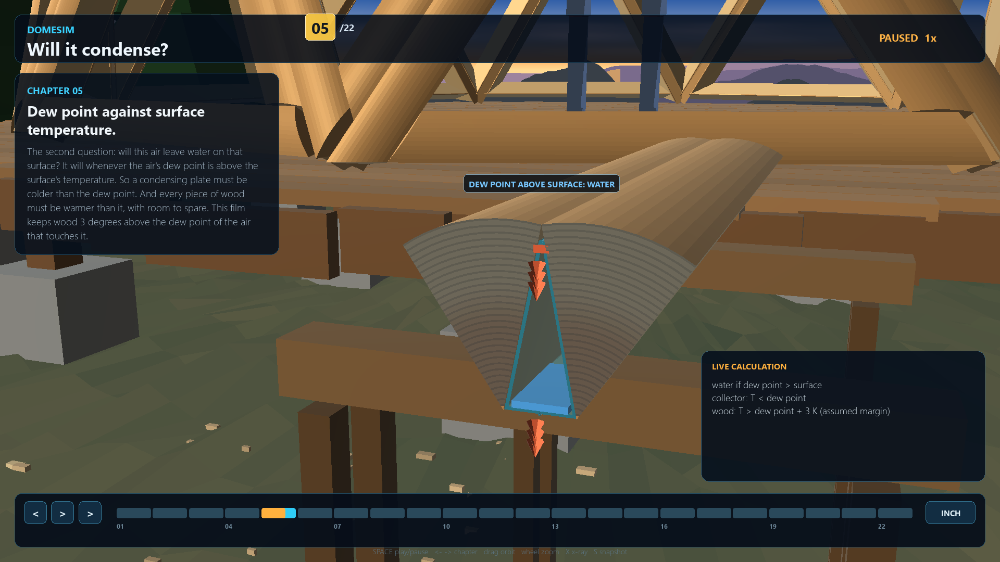

Two disciplines keep the metal honest. **Plate first, wood
second:** the plate is the condensing surface, sized and
finned for it, so the wood behind it never becomes the
condensing surface by accident. And the galvanic table: the
channel mixes metals — aluminium plate, copper wiring,
steel screws — and dissimilar metals in a damp channel make
a battery that eats one of them; the table decides which
metals may touch and which need a barrier between them.
Moisture, in this chapter, is a *designed* resident of the
channel — and the design extends to the metals it lives
with.

## The desiccant belongs in a drawer

The last component is the one the chapter's title sentences
to the furniture, and the reason is two measurements.

A desiccant — molecular sieve, the beads that hold a fifth
of their weight in water — looks like the channel's perfect
resident: pack the seam, let the beads drink. The
measurements say no. A packed seam passes almost no air —
the beads' resistance rises steeply with the bed's length,
which is the Ergun equation doing what it does — so the
packed channel stops being the vent the whole system
depends on. And the beads cannot be regenerated where they
sit: drying them needs heat and airflow the seam cannot
supply, so a saturated seam is a wet seam that stays wet.

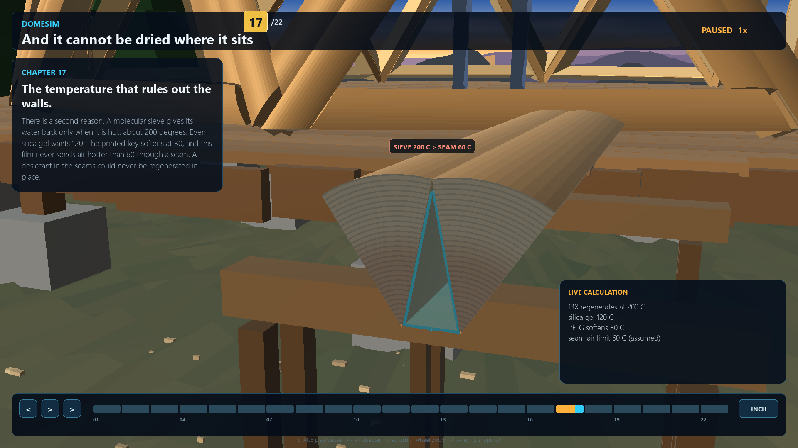

The answer is the drawer: two desiccant beds at the rim,
in removable drawers, with a gate that sends the channel's
air through one while the other dries out — a twin-tower
system, small, accessible, and *fails safe*, because a
drawer left out is a bypass, not a blockage. The stove's
heat never shares the stove's air: the combustion circuit
is sealed, and the desiccant dries on waste heat the
building was already paying for.

## Dew point decides

The chapter's close is the controller, because the system's
parts only cohere when one thing holds the rule.

Eleven weathers — the film's own list of the conditions a
year throws at a shell — one controller, and one decision
procedure: compare dew points, ask the three questions,
choose between the loop and the purge. The loop dries the
*structure* — air around the frame, through the channel,
slow, continuous. The purge dries the *room* — air through
the house, fast, wasteful if misused. The controller's
whole job is to know which drying the building needs, and
the knowing is the rule, coded: **dew point decides.**
The seam climate ends where the book began — with a number
computed, a decision made from the number, and nothing left
to the weather's mood.

---

# The Master Tables

Four tables carry the whole build, and they are the ones to come back to at
the saw. Every number in them is generated at build time by the same solver
that drew the 3-D model, so a table and a drawing can never disagree. Print
these pages and take them to the bench.

## Full cut list


The whole frame in one table: every member, by class, length and count. The
frame has 120 members in 4 distinct
lengths -- two classes, short and long, each cut once per panel. The table
is sorted the way the work is sorted: by class first, then by length, so a
member on the pile can be found from the table in one look. Mark each class
with its own colour at the saw, and keep the classes in separate stacks; the
raise is where a mixed pile turns into a slow afternoon.

### The master cut list


The list the saw is set to, as this build finished it. 3
lengths, and every stick in the frame is one of them:

| length | what it is | where it goes |
|---|---|---|
| 72.0 in | the long member | all three members of an equilateral panel; the **base** of an isosceles panel |
| 63.5 in | the middle member | the **left** side of an isosceles panel |
| 61.5 in | the short member | the **right** side of an isosceles panel |

These are resultant lengths: cut a member to one of them and the panel is
the size the dome wants, with nothing left to trim.

The rule, stated once and followed at the bench: **shortest on the right,
middle on the left, longest at the base**, laid with the base nearest you.
The left member is the longer of the two sides, so it reaches over to the
top point, which sits off the middle of the base; the right member meets it
there, and the base butts up to that short right side. The two sides of an
isosceles panel differ by two inches over five feet, so nothing about the
pair is obvious by eye -- pick them from their own stacks, in order, and the
panel is right. Equilateral panels have no rule to remember: three long
members.

The fully seated schedule the pinwheel model prints is in the table above.
Where the two disagree the master list is the report of the build and the
model is the model of the joint.

## Full seam schedule


Every seam in the frame, with its fold angle and its key. The frame's
55 seams fold at only two angles -- 18.03 degrees,
25 of them, and 22.46 degrees, 30
of them -- so the brake is set twice and the schedule is how you know which
setting a given seam wants. The key column is the gasket: 0.75
inches of compressible strip in every seam, which is what lets a frame of
green timber close and stay closed while the wood moves.

## Butt cut setups


Every distinct saw setup in the build, in the order the work meets them.
The butt cut is the one compound angle in the frame, and this table is the
one place its setups live: stock left long by 6 inches
at the head end, allowance of 8 inches past the cut,
and the angle itself. The rule from the cutting chapters applies here in
table form: the angle lives in the tool, not in the operator. Set the jig
once per row, run every member of that row, and never measure an angle at
the saw.

## Declared constants


The inputs the whole book is built on, repeated here for reference. These
are the numbers that are *declared* rather than derived -- the gasket
thickness, the handling limit, the prices and rates that could not be
computed from geometry because they are facts about the world. Every one
of them is stated with its reason where it is used, and this table collects
them so a reader can change one and see what moves. That is the promise the
front of this book makes and the arithmetic of this book keeps: no number
is typed into a sentence. Change a constant here and every figure that
depends on it -- in the chapters, in the films, in the 3-D model -- changes
with it.

---

# Glossary

The words this book uses in the senses it uses them, for the terms a
reader may not have met.

**Board foot.** A volume of wood: one foot by one foot by one inch. The
unit mills sell by.

**Bucking.** Cutting a felled trunk into sections of working length, cross
grain.

**Butt cut.** The one compound-angled cut in the frame, made on the
butt end of a member so it seats flat on the side of its neighbour.
Once per member, off the jig, at a handful of fixed settings.

**Channel.** The void inside a seam, run as a connected network of
gutters, vents and service chases through the whole shell.

**Chord.** The straight line between two points on the circle; the edge a
member spans. A pinwheel member is always shorter than its chord, because
it is inset from the vertices it spans.

**Declared constant.** A number the book states as an input rather than
derives: a price, a rate, a handling limit. Every declared constant is
named with its reason where it is used, and collected in the master
tables.

**Dihedral angle.** The angle between two faces meeting at an edge; in
this frame, the fold between two panels at a seam.

**Frequency.** How many times a geodesic edge is subdivided: 1V, 2V, 3V.
Higher frequency means more, shorter members for the same dome. The
flat parts list holds across diameter, not across frequency.

**Gasket.** The compressible strip in every seam -- 0.75 inches
-- that lets a green-timber frame close and stay closed as the wood moves.

**Hat.** The upper part of the shell, the twenty upper triangles, whose
edge is the brim. The hat's overhang throws water clear and collects it.

**Hub.** A junction where several members meet through one piece of
hardware. The wedge frame is hubless: members lap past the vertices
instead of butting into a hub.

**Iris.** The ring of hinged blades that closes one oversized pad down to
whatever dome stands on it.

**Jig.** A purpose-built guide that holds a tool or a workpiece at one
setting, so a cut or a fold repeats exactly. The rule of the whole build:
the angle lives in the tool, not in the operator.

**Kerf.** The width of the cut a saw removes.

**Key.** The strip of timber or compressible material seated in a seam
between two panels, cut to the seam's fold angle. The key locates the
geometry; the gasket beside it seals the gap.

**Limbing.** Cutting the branches off a felled tree.

**Member.** One stick of the frame, cut and dressed for its place. The
frame has 120 of them.

**Pad.** A serviced deck of a given diameter -- deck, power, water,
drainage, anchorage -- the unit a dome site is built from.

**Pinwheel.** The frame's corner pattern: members lap past the vertices
rather than butting into them, so no two members fight for the same end
point. The inset the lapping requires is why a member is shorter than its
chord.

**Pith.** The soft core of a trunk at the tree's centre. Splitting runs
with the pith, and a wedge's point is the pith side.

**Pony wall.** A short straight wall stood under the rim of a dome,
lifting the shell and buying back the low-ceiling ring of floor.

**Rip.** To cut along the grain, the length of the member.

**Runoff coefficient.** The share of rain that sheds off a roof rather
than evaporating or splashing: 85 per cent for a metal
roof.

**Seam.** The joint between two adjacent panels; a fold angle plus a key.

**Sector.** One wedge split out of a round log section, pith to bark.

**Setback.** The inset of a pinwheel member from the vertex it laps past.

**Shell.** The enclosed skin of the dome, frame and covering together.

**Shell ladder.** The sequence of quilted insulation layers hung under the
shell, one winter at a time.

**Strand.** The reading track a chapter belongs to: story, howto, explain
or reference. The contents page promises each track reads on its own.

**Strut.** A frame member loaded along its length -- the load a
triangulated frame puts on every stick in it.

**Token.** A figure in double braces in the manuscript that resolves, at
build time, to a number computed by the software. The reason no number in
this book was ever typed into a sentence.

**Vertex.** A corner point of the frame where members converge.

**Wedge.** A member split from a round log so its cross-section tapers,
bark face wide, pith edge narrow. The wedge is the method: a structural
section no mill sells, cut to be loaded along its length.

**Wedge method.** The whole system this book documents: split logs into
wedges, lap them into a pinwheel frame with no hubs, and let the
triangles do the structural work.

**Worked example.** A page that carries one number all the way through a
calculation, showing every step rather than asserting the answer.

**Boat hull.** The laminated hard shell -- fibreglass and resin over the
frame -- the fifty-year alternative to the soft cap, built in four
detachable slices.

**Dew point.** The temperature at which air's moisture begins to
condense. The book's climate rule: compare dew points, never relative
humidities.

**Desiccant drawer.** A removable bed of drying beads at the rim, in a
twin-drawer pair with a gate, so one bed dries while the other works.

**Fit-out.** One of the stem cell's fifteen named purposes -- gym,
guest house, workshop -- carried by panels and services hung on the
frame, never built into it.

**Overfit.** The deliberate extra length left on a member's head end so
error leaves as offcut when the flush cut is made against the jig.

**Peltier plate.** A solid-state heat pump set in the seam channel,
moving heat into the room in winter and out in summer, and condensing
moisture deliberately at the dew point.

**Rosette.** The fitting where five or six seam channels meet at a
vertex, joining them into one continuous network.

**Seam channel.** The connected void running through every seam: the
building's gutter, vent, dehumidifier and air barrier in one.

**Stem cell.** The undifferentiated dome body -- one frame, one cut
list, one core -- whose purpose is deferred to a swappable set of
panels: fifteen buildings from one body.

**Utility core.** The column through the dome's centre carrying power,
water, waste and air in one object that unbolts and moves to the next
dome.

**Value ladder.** The six rungs on which one tree can be priced --
standing, firewood, sawn, split, structure, financed -- and the ratios
between them.

**Yakisugi.** The char-and-oil finish for the bark face only, leaving
the sawn faces bare so the seam channel can breathe.

**Zome.** A dome built by sweeping a star of directions into flat
panels, so every panel is flat by construction rather than by
approximation.

---

# The Software in This Book

## What generated these numbers

Every figure in this book comes from one of the programs below, and each
program is included with the book. They are named here so a reader can
find the exact line behind any number printed in these pages.

**`geodesic_raw_wedge_dome_dihedral.py`** -- the live solver and 3-D world.
This is the heart of the project: it solves the raw-wedge dome, its seams,
its dihedral angles and its jig, and it is where the standing dome's own
mesh lives. The book's figures of the frame are this program's mesh, not a
sketch of it.

**`two_v_demo/book_math.py`** -- the book's arithmetic. The two sizing
methods, the tree model, the fortnight, the round trip and the declared
constants. Where a chapter works a number through by hand, this module is
the hand.

**`two_v_demo/wedge_geometry.py`** -- the tree and pinwheel arithmetic the
book and the films share: member classes, splits, yield, recovery.

**`two_v_demo/book_tokens.py`** -- the 82-chapter book's
living figures. Every figure a sentence quotes -- a token in double braces
-- resolves here, from the modules above, at export time.

**`two_v_demo/book.py`** -- the outline: the parts, the chapters, the pages
and where each figure sits.

**`two_v_demo/book_plots.py`** and **`two_v_demo/book_diagrams.py`** -- the
charts and tables, and the line drawings. Both draw from the same geometry,
never from a number typed beside the drawing.

**`two_v_demo/book_figures.py`** -- the renderers, and the rule that a
re-rendered figure gets a new name rather than replacing the old one.

**`two_v_demo/book_manuscript.py`** and **`two_v_demo/book_export.py`** --
the manuscript itself, and the readable forms: this HTML, the PDF, and the
Markdown source. The diagrams on this page are drawn by that exporter.

**`two_v_demo/book_app.py`** -- Book Studio, the desk the book is written
at, including the reader built into it.

Nothing in this list restates a figure another module already derives, and
nothing draws a dome that the solver has not solved. That is what "the
numbers are computed, not typed" means in practice: every one of them
traces to a function in one of these files.

## How to get it, and start it

The project is a repository, and this is the whole install path, from
nothing:

```text
# 1. Python 3.10-3.13 (not 3.14 -- pygame and moderngl have no wheels yet)
#    https://www.python.org/downloads/

# 2. the code
git clone https://github.com/dkzeanah/DomeSimulator.git
cd DomeSimulator

# 3. the three libraries the core tools need, and the front door
py -3.12 -m pip install pygame moderngl numpy
py -3.12 launcher.py
```

That is enough to open every tool in the project, including this book:
`launcher.py` is a window with a tab per tool and no command-line flags to
remember. Two optional extras turn on the parts of the project that make
films and narration:

```text
# video export (the films, the narration, the MP4s)
py -3.12 -m pip install -r two_v_demo/requirements.txt
winget install ffmpeg        # or brew/apt install ffmpeg
```

```text
# local voice cloning and transcription (heavier AI packages, Python 3.11)
py -3.11 -m venv .venv-voice
.\.venv-voice\Scripts\python.exe -m pip install -r .\local_voice_studio\requirements-core.txt
```

The full setup guide, including what each optional tool needs and what it
reports when something is missing, is `SETUP.md` beside the code.

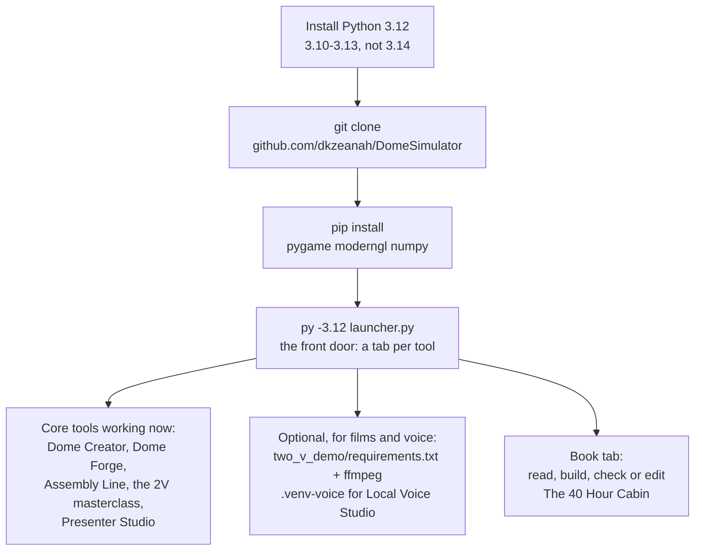
```mermaid
flowchart TB
  python["Install Python 3.12<br/>3.10-3.13, not 3.14"]
  clone["git clone<br/>github.com/dkzeanah/DomeSimulator"]
  pip["pip install<br/>pygame moderngl numpy"]
  launch["py -3.12 launcher.py<br/>the front door: a tab per tool"]
  core["Core tools working now:<br/>Dome Creator, Dome Forge,<br/>Assembly Line, the 2V masterclass,<br/>Presenter Studio"]
  optional["Optional, for films and voice:<br/>two_v_demo/requirements.txt + ffmpeg<br/>.venv-voice for Local Voice Studio"]
  book["Book tab:<br/>read, build, check or edit<br/>The 40 Hour Cabin"]
  python --> clone --> pip --> launch
  launch --> core
  launch --> optional
  launch --> book
```

## The map of the code

One picture of the whole factory, because the project is larger than the
book and the book is one of its products. Read it left to right: the truth
layer at the bottom is what everything computes from, the middle is the
engines that make things, and the right is what comes out.

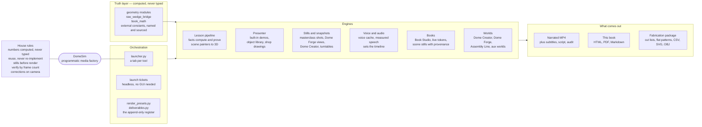
```mermaid
flowchart LR
  subgraph TRUTH["Truth layer — computed, never typed"]
    geom["geometry modules<br/>raw_wedge_bridge<br/>book_math<br/>external constants, named and sourced"]
  end
  subgraph ORCH["Orchestration"]
    launch["launcher.py<br/>a tab per tool"]
    tickets["launch tickets<br/>headless, no GUI needed"]
    presets["render_presets.py<br/>deliverables.py<br/>the append-only register"]
  end
  subgraph ENGINES["Engines"]
    lessons["Lesson pipeline<br/>facts compute and prove<br/>scene painters to 3D"]
    presenter["Presenter<br/>built-in demos,<br/>object library, shop drawings"]
    stills["Stills and snapshots<br/>masterclass shots, Dome Forge views,<br/>Dome Creator, turntables"]
    voice["Voice and audio<br/>voice cache, measured speech<br/>sets the timeline"]
    books["Books<br/>Book Studio, live tokens,<br/>scene stills with provenance"]
    worlds["Worlds<br/>Dome Creator, Dome Forge,<br/>Assembly Line, aux worlds"]
  end
  subgraph OUT["What comes out"]
    films["Narrated MP4<br/>plus subtitles, script, audit"]
    bookout["This book<br/>HTML, PDF, Markdown"]
    pkg["Fabrication package<br/>cut lists, flat patterns, CSV, SVG, OBJ"]
  end
  root(["DomeSim<br/>programmatic media factory"])
  root --- launch
  geom --> ENGINES
  ORCH --> ENGINES
  ENGINES --> OUT
  rules["House rules<br/>numbers computed, never typed<br/>reuse, never re-implement<br/>stills before render<br/>verify by frame count<br/>corrections on camera"]
  rules --- root
```

The house rules in that diagram are not decoration: they are the checks
that run before a render or an export, and the reason a figure in this book
can be traced back to a line of code. The truth layer is the same geometry
the films draw, which is why the book and the films cannot disagree about
the dome.

## The video and presenter pipelines

The factory makes two kinds of film, and the two engines are worth knowing
before anything else on this page, because every rule below is the same
rule twice: **a film is data plus painters, and nothing else.**

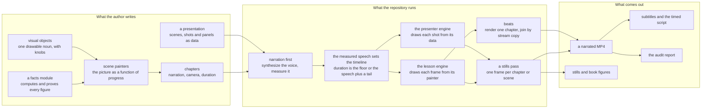
```mermaid
flowchart LR
  subgraph AUTHOR["What the author writes"]
    facts["a facts module<br/>computes and proves every figure"]
    elements["visual objects<br/>one drawable noun, with knobs"]
    painters["scene painters<br/>the picture as a function of progress"]
    chapters["chapters<br/>narration, camera, duration"]
    presentation["a presentation<br/>scenes, shots and panels as data"]
  end
  subgraph ENGINE["What the repository runs"]
    narrate["narration first<br/>synthesize the voice, measure it"]
    timeline["the measured speech sets the timeline<br/>duration is the floor or the speech plus a tail"]
    lessonapp["the lesson engine<br/>draws each frame from its painter"]
    presenterapp["the presenter engine<br/>draws each shot from its data"]
    stills["a stills pass<br/>one frame per chapter or scene"]
    beats["beats<br/>render one chapter, join by stream copy"]
  end
  subgraph OUT["What comes out"]
    mp4["a narrated MP4"]
    subs["subtitles and the timed script"]
    audit["the audit report"]
    figures["stills and book figures"]
  end
  facts --> painters
  elements --> painters
  painters --> chapters
  chapters --> narrate
  presentation --> narrate
  narrate --> timeline
  timeline --> lessonapp
  timeline --> presenterapp
  lessonapp --> stills
  presenterapp --> stills
  stills --> mp4
  lessonapp --> beats
  beats --> mp4
  mp4 --> subs
  mp4 --> audit
  stills --> figures
```

**Lesson films** (`two_v_demo/`) bind copy to painters. A `Lesson` carries
no logic at all: it holds chapters, a dictionary of scene painters, a
selftest and a report. A chapter carries its spoken narration, its fixed
equation lines, a duration *floor*, a camera and the name of the painter
that draws it. The painter is a pure function of progress --
`def scene(app, opaque, transparent, p)` with `p` running 0 to 1 across the
chapter -- so the same frame is drawn at the same `p` on every machine, and
a film can be re-rendered from its own source years later.

**Presenter films** (`presenter/`) are even more data: a `Presentation`
holds scenes, a scene holds shots, and a shot holds a camera, a lens, a
focus target, narration, a caption and an overlay panel. Animation is
interpolation of one named parameter, and the camera follows any moving
focus target for free. Both engines take their timing the same way --
narration is synthesized and measured **first**, and the chapter or shot
duration is the larger of its floor and the measured speech plus a tail --
which is why a voice change is a timing change, and why the house voice is
stated in the presets rather than left to whatever the tab was showing.

**The bridges between them** are three, and they are what make the two
engines one factory:

* **Visual objects** (`two_v_demo/visual_objects.py`) are the elements
  either engine can draw by name. Written once, they are available to the
  lessons as `draw(stage, "key", ...)` and to the presenter as
  `vo:<key>` -- see the next section.
* **Dome Forge layers** are available to the presenter as
  `forge:<layer>`, so a film about a water-harvesting dome shows the
  modelled dome rather than a picture of one.
* **The raw-wedge solver** reaches the lessons through
  `two_v_demo/raw_wedge_bridge.py`, which converts the solver's own meshes
  into lesson geometry. This is the bridge behind the rule at the top of
  this book: a film that talks about the wedge dome shows the simulator's
  dome.

Long films are cut into **beats** (`two_v_demo/beats.py`): a chapter, or a
claim and the math screen that proves it, rendered as its own file and
joined by stream copy. A beat that is already on disk is skipped, so
fixing one chapter costs one beat re-render instead of a whole film, and
`verify_renders.py` is the check that says whether what came out of the
encoder is the film the timeline promised.

## Adding to the pipeline

Four kinds of addition, and the same four-step shape every time: *write the
thing, register it, check it with a still, then render it.* The table is
the whole answer to "which files do I touch":

| you want to | you create | you alter | the check that proves it |
|---|---|---|---|
| **a new element** (a noun the renderer can draw) | `two_v_demo/visuals_<group>.py` | nothing, unless a film should use it | `validate_visual_objects()` then a still |
| **a new scene and chapter** in a film | -- | `two_v_demo/lesson_<key>.py` (`SCENES` + chapters) | the lesson's own `selftest`, then a still per chapter |
| **a whole new film** | `two_v_demo/lesson_<key>.py` and `<key>_facts.py` (make them with `scaffold_lesson.py`) | `two_v_demo/lesson_registry.py`, `render_presets.py`, `two_v_demo/deliverables.py` | `validate_render_presets()` then `verify_renders.py` on the MP4 |
| **a presenter object or demo** | `presentations/<name>.py`, or an object in `presenter/library.py` | `presenter/library.py` for the catalogue | `PresenterApp(..., headless=True).screenshot(...)` |

### 1. A new element the renderer can draw

This is the addition most people mean by "a new element", and it is the
best-supported one: write the noun once, and both pipelines can use it.

**Where it goes.** `two_v_demo/visual_objects.py` holds the contract and
the registry. The objects themselves live in their own modules beside it --
`two_v_demo/visuals_forest.py` is the worked example, holding the pine, the
bucked log and the figures that go with them -- and each module registers
its objects on import, so nothing else needs editing. `registry()` imports
the known groups and returns everything.

**The contract**, in the code's own words:

```python
VisualObject(
    key="log_sections",                    # the name a film draws by
    label="Log, bucked and split",         # the name a person reads
    category="wood",                       # must be a taxonomy key
    blurb="The usable trunk on the ground, cut into the plan's "
          "sections and every section split into the plan's sectors...",
    knobs=(...),                           # the dials, with ranges
    draw=_draw_log_sections,               # drawer(stage, knobs) -> anchors
    source="new",                          # or the dotted path it wraps
    reach=18.0,                            # how far it extends, for cameras
    words=("tree", "log", "section", "sector", "split"),
)

register(VisualObject(...))                # refuses a duplicate key
```

A **knob** is one dial, declared with its range so it can never be set to
something undrawable:

```python
_k("fell", "Felled", 1.0, 0.0, 1.0, "x", "0 standing, 1 on the ground",
   animate=True)
```

The drawer's signature is `draw(stage, knobs) -> anchors`: it builds
triangles on the stage and returns named points -- an anchor called
`top`, say -- which the caller can aim a camera at or hang a label on. A
knob marked `animate=True` is one the caller may sweep across a chapter,
which is how an element performs rather than just appears. `category` must
be one of the taxonomy's keys, because the catalogue sorts the nouns by it:
`structure, members, wood, envelope, base, geometry, math, measure, tools,
processes, forces, money, buildings, land, services, materials, people,
body, time, media, computing, ideas, quantities, story, names`.

**What to draw with.** Inside the drawer the vocabulary is the engine's own:
`TriangleBatch` primitives from `two_v_demo/render_kit.py` (`cylinder` --
where `cylinder(a, b, r, colour, 3)` is a wedge and `4` is square,
`box`, `sphere`, `triangle`, `cone`, `arrow`, `disc`), procedural wood from
`two_v_demo/timber.py` (`draw_timber`, `wood_colour`, `draw_glue`,
`draw_patch`), pictograms from `two_v_demo/icons.py` (`draw_icon`), and the
easing helpers in `render_kit` (`clamp`, `smoothstep`, `ease_in_out`) so
movement in a frame has the same feel as movement in every other film.
Figures that must be *spoken* rather than drawn belong in the chapter's
callouts, not in the element: `two_v_demo/callouts.py` times them to the
measured voice.

**How a film calls it.** Two lines, in the scene painter:

```python
def scene_hv_fell(app, opaque, transparent, p: float) -> None:
    stage = stage_for(app, opaque, transparent, origin=ORIGIN)
    anchors = draw(stage, "pine_tree", fell=p, units_per_ft=UPF)
```

`stage_for` puts the element in the world at an origin; `draw` resolves the
knobs -- defaults, overridden by what you gave, clamped to what is
drawable, and a misspelt knob is a hard error rather than a silent nothing
-- and returns the anchors.

**It reaches the presenter for free.** `presenter_emitters()` wraps every
registered object as `vo:<key>` with five placement knobs (across, along,
up, heading, size), and `presenter_object_specs()` lists the same objects
in the presenter library's own terms. So a new element is usable in a
presenter shot the moment it exists, under a prefixed name that cannot
collide with the presenter's own objects.

**The check.** One command, then one still:

```text
py -3.12 -c "from two_v_demo.visual_objects import validate_visual_objects; validate_visual_objects()"
```

which draws every object at its defaults and at both ends of every knob --
a cheap way to find the element that collapses at its own limit, before a
render finds it for you.

### 2. A new scene, and the chapter that shows it

A scene is a painter; a chapter is the copy, the camera and the clock. In
the lesson module you are changing, three edits, in this order:

**Write the painter.** It takes the app, two triangle batches (opaque and
transparent) and `p`, and it must be a pure function of `p` -- no clocks,
no randomness that is not seeded, no state kept between frames. Draw into
the batches; put text on screen with the engine's label list; return
nothing.

**Register it in the lesson's `SCENES` dictionary** under the name the
chapter will use:

```python
SCENES = {
    "wg_open": scene_wg_open,
    "wg_split": scene_wg_split,
    ...
}
```

**Add the chapter**, giving it that scene name, its narration, its camera
and its duration floor:

```python
Chapter(
    "split", "07", "Split like a cake",
    "Three passes and the stick is already the right shape",
    ("Spoken narration line one.",
     "Spoken narration line two."),
    ("fixed equation line",),          # only when the stage is a math screen
    12.0,                              # duration FLOOR, not a promise
    (34.0, 24.0, 16.0),                # camera: yaw, pitch, distance
    "wg_split",                        # the SCENES key that paints it
    None,                              # or "math" for a derivation screen
    callouts=(...),                    # figures cued to the measured voice
)
```

Two things are worth stating because they are the whole reason this
pipeline is reproducible. The duration is a **floor**: the real length is
the measured speech plus a tail, so a chapter never races its own narrator.
And every figure the chapter shows should come out of the lesson's **facts
module** rather than the painter, because that module is what the selftest
proves -- which is why the generated pair from `scaffold_lesson.py` is a
facts module *and* a lesson module, never just a lesson.

Look at a still before you render. A staging bug -- a camera pointing at the
back of an element, a label under the horizon -- is invisible in code and
obvious in one frame. The headless way, with no window open:

```text
py -3.12 -c "import launcher_common as lc; lc.write_config('two_v_masterclass', {'action':'shots','lesson':'wedge','shots':'8,24,40','no_narration':True})"
py -3.12 two_v_masterclass.py
```

which writes `two_v_demo_output/<lesson>/<prefix>_<seconds>s.png` for each
second you asked for.

### 3. A whole new film

Start with the generator, because the boilerplate it writes is boilerplate
that already passes:

```text
py -3.12 scaffold_lesson.py trusses "Truss Masterclass"
```

That writes a facts module and a lesson module that render, prove
themselves and pass a selftest, laid out along the right axis because this
renderer's cameras sit on +Y. The first real work is deleting the
placeholder facts and putting real ones in -- which is the point.

Then register it in **three** places, because a film is a lesson, a preset
and a deliverable, and the project refuses to let them disagree:

| file | what you add |
|---|---|
| `two_v_demo/lesson_registry.py` | an import, and the lesson in the `LESSONS` tuple -- this is what makes it launchable by key |
| `render_presets.py` | a preset built with the `_video(key, lesson, filename, summary)` helper, so the exact settings that produced the film are one click away |
| `two_v_demo/deliverables.py` | a `Deliverable(lesson, filename, note, compose=True)` -- the rendered output and the lesson that reproduces it |

`validate_render_presets()` is the gate, and its last assertion is the one
that keeps the three in step: *deliverables with no render preset* is a
failure, not a warning. The check runs both ways, which is the part people
miss -- `validate_deliverables()` also refuses a lesson that has been
registered and never given a deliverable, so a new film cannot be
half-registered and still pass a selftest. The preset's summary must be a
real sentence -- there is a length assertion on it, because a preset nobody
can read is a preset nobody will use.

Then render, headless, and check what came out:

```text
py -3.12 -c "import launcher_common as lc; lc.write_config('two_v_masterclass', {'action':'selftest','lesson':'trusses'})"
py -3.12 two_v_masterclass.py

py -3.12 -c "import launcher_common as lc; lc.write_config('two_v_masterclass', {'action':'export_video','lesson':'trusses','export_video':'deliverables/masterclass/truss-masterclass.mp4','orientation':'both'})"
py -3.12 two_v_masterclass.py

py -3.12 verify_renders.py deliverables/masterclass/truss-masterclass.mp4
```

`verify_renders.py` fails when the video and audio disagree by two seconds
or more, when the frame count is under about 29 frames a second, or when
the duration is zero. That is the house check -- a film is not finished
because the encoder exited cleanly, it is finished because the frame count
agrees with the timeline. The export also writes the `.srt`, the timed
script and the release folder (landscape cut, phone cut, thumbnails and
platform copy), because one render is a release rather than a file.

### 4. Adding to the presenter instead

The presenter is the faster path when the film is about *showing* rather
than *deriving*: its objects are already placed and lit, and its shots are
data.

**A new object** is an `ObjectSpec` in `presenter/library.py` -- a key, a
label, a category, a blurb and a tuple of `ParamSpec`s (the same parameter
description Dome Forge uses, imported from `dome_forge.layers`, so one
vocabulary serves both). Before writing one, check the bridge: if the
element exists in `two_v_demo/visual_objects.py`, the presenter already has
it as `vo:<key>`, and you do not need to write anything.

**A new demo** is a module in `presentations/` -- `dome_accessibility.py`
and its neighbours are the thirteen worked examples -- built out of
`Presentation`, `Scene`, `Shot` and `OverlayPanel` from
`presenter/script.py`. Keep the numbers in `presentations/_numbers.py`,
which computes them once from `al_build` and `two_v_demo.geometry`, so a
presenter film and a lesson film quote the same arithmetic.

**The check** is a screenshot, not a render:

```text
py -3.12 -c "import launcher_common as lc; lc.write_config('presenter', {'action':'shots','demo':'dome_accessibility','shots':'4,20,38'})"
py -3.12 presenter_studio.py
```

or, programmatically, `presenter.engine.PresenterApp(presentation, headless=True)`
and then `.render(t, present=False)` followed by `.screenshot(path)` -- a
frame for the price of a frame, which is what you want while placing an
object. When the film is ready, the same class exports it:

```text
py -3.12 -c "import launcher_common as lc; lc.write_config('presenter', {'action':'export','demo':'dome_accessibility','export':'deliverables/presenter/accessibility.mp4'})"
py -3.12 presenter_studio.py
```

`PresenterApp.export(path, fps=None, narration=True, ffmpeg=None,
overlay=None)` is the whole film export: narration measured first, frames
rendered deterministically, audio muxed by stream copy. The `overlay`
option is the presenter's version of the lesson styles -- `full`,
`no_captions`, `titles_only` or `clean`.

The
studio itself (`presenter/studio.py`) is a real editing suite -- library,
viewport, timeline, inspector -- over the same pure-functional edit API, and
it saves and reopens a film as JSON, so a presentation can be drafted by a
tool and finished by hand.

### Adding an element to a world instead

The visual-object route is the right one for an element a *film* needs. An
element that only makes sense inside a world -- a forge layer, a jig
stage, an assembly-line station, a piece of furniture -- is added where
that world keeps its registry, and the world's own viewer is how you look
at it. The table is the whole map:

| world | the element | where it is declared | what else changes |
|---|---|---|---|
| Dome Forge | a **layer** (anything from the frame to the rain) | `emit_<kind>(...)` in `dome_forge/build.py`, then the `EMITTERS` dictionary | a `LayerKind` with its `ParamSpec`s in `dome_forge/layers.py` -- and it then appears in the presenter as `forge:<key>` automatically |
| Dome Forge | a **jig stage** | `STAGE_ORDER` in `dome_forge/jigs.py` | the drawing inside `emit_jig`, gated on the stage's position in that order |
| Dome Forge | a **camera view** for the stills pass | the views list in `dome_forge/cli.py` | nothing |
| Assembly Line | a **station** | a `StageDef` in `_STAGE_LIST` (`al_build.py`) | a key in `HOME_STAGE_KEYS`, an entry in `CATEGORY_ECON` and `CATEGORY_LABEL`, and an `_emit_<stage>` called from `build_dome_catalog` |
| Assembly Line | a **part** | `cat.begin("<category>")` / `cat.end("<stage>")` inside the relevant `_emit_*` (`al_build.py`) | the `CATEGORY_ECON` triple -- material cost, labour minutes, weight per element |
| Dome Composer | a **prop or piece of furniture** | `dome_interiors.py`: a `_prop(...)` plus its builder in the `BUILDERS` table | a placement rule only if it needs one |
| Dome Composer | a **placement rule** | a branch in `check(...)` and its constant, in `two_v_demo/scene_composer.py` | an assertion in `validate_scene_composer()` so the rule is proved |
| Dome Creator | a **preset building** | `(name, config_dict)` appended to `PRESETS` in `presets.py` | nothing -- it registers itself in the menus |
| Dome Creator | a **model option** | a field on `DomeConfig` in `dome_model.py` | its `to_dict`/`from_dict`, the menu entry, and `build_dome_mesh` if it changes geometry |

Two of those rows are worth the extra sentence. An Assembly Line part is
declared between `begin` and `end`, and `end` sizes its cost, labour and
weight from the category's per-element figures unless you override them --
which is why the parts catalogue and the economics cannot drift apart. And
a Dome Forge layer is the cheapest way to get a real, modelled *thing* into
a presenter film: write the layer once and it is both an option in the
forge's own viewer and an object in every presenter shot.

### The other worlds, and their stills

The remaining three worlds are where an element is checked in three
dimensions before it ever appears in a film, and each answers the same
ticket:

```text
py -3.12 -c "import launcher_common as lc; lc.write_config('dome_forge', {'action':'shots'})"
py -3.12 dome_forge.py

py -3.12 -c "import launcher_common as lc; lc.write_config('assembly_line', {'action':'shots','shots':'74,97','shot_speed':6})"
py -3.12 assembly_line.py

py -3.12 -c "import launcher_common as lc; lc.write_config('dome_composer', {'action':'shots'})"
py -3.12 dome_composer.py
```

Dome Forge writes exterior, cutaway, top and ground views to
`dome_forge_shots/`; the Assembly Line writes `shots/shot_<t>s.png`; the
Composer writes a four-frame turntable of the scene as PNGs. A fifth
world, the Dome Creator, has no stills action on purpose -- its check is
the smoke test (`DOME_SMOKE` for a frame count, `DOME_SHOT_DIR` to ask for
screenshots along the way), because the thing being checked there is the
world itself rather than a frame of it. That smoke test still opens a real
graphics context, so it is a check to run while watching, not a background
job.

Every ticket above lands in `.launcher_configs/` and is read, then
archived, when the tool starts: the tool is launched with no arguments,
which is also how the launcher itself launches it. The archive is the point
-- the exact input a run used stays readable in
`.launcher_configs/used/`, so a film can be reproduced from what was
actually asked for rather than from what somebody remembers asking for.
The last check of all is the repository's own: `LAUNCHER_SMOKETEST=1 py
-3.12 launcher.py` builds every tab, every launch button and every render
preset without opening a window, and it is an environment variable rather
than a flag.

### The commands, in order

A new element, from nothing to used in a film, in the order the project
expects:

```text
# 1. write the object and register it, then prove every knob draws
py -3.12 -c "from two_v_demo.visual_objects import validate_visual_objects; validate_visual_objects()"

# 2. put it in a scene painter, then look at a still before rendering anything
py -3.12 -c "import launcher_common as lc; lc.write_config('two_v_masterclass', {'action':'shots','lesson':'wedge','shots':'8','no_narration':True})"
py -3.12 two_v_masterclass.py

# 3. run the lesson's selftest: the numbers before the pixels
py -3.12 -c "import launcher_common as lc; lc.write_config('two_v_masterclass', {'action':'selftest','lesson':'wedge'})"
py -3.12 two_v_masterclass.py

# 4. render, then verify by frame count
py -3.12 -c "import launcher_common as lc; lc.write_config('two_v_masterclass', {'action':'export_video','lesson':'wedge','export_video':'deliverables/masterclass/wedge-v2.mp4','orientation':'both'})"
py -3.12 two_v_masterclass.py
py -3.12 verify_renders.py deliverables/masterclass/wedge-v2.mp4

# 5. register the film so it stays reproducible, and run the repository's own gate
py -3.12 -c "import render_presets as rp; rp.validate_render_presets()"
LAUNCHER_SMOKETEST=1 py -3.12 launcher.py
```

### The rules a new element has to obey

Four, and they are the book's rules applied to code:

**Its numbers are computed, or declared.** An element that shows a figure
takes it from a facts module; if the figure cannot be derived, it is a
declared constant with a stated reason. No number is ever typed into a
painter, a caption or a knob's default.

**It reuses the geometry.** An element that depicts the dome asks
`raw_wedge_bridge` for the solver's own mesh. An element that depicts wood
uses `timber.py`. A second drawing of the same thing is a second version of
the truth.

**It is proved before it is rendered.** `validate_visual_objects` for an
element, the lesson's `selftest` for a chapter, `verify_renders.py` for a
film. The order matters: the cheapest check that can fail is the one to run
first.

**It never overwrites.** A re-render writes `-v2`. An element that changes
what a published film looks like is a new film, not a quieter edit of the
old one -- which is the same rule the book keeps about its own chapters.

## The chain that made this book

This book is one of the factory's outputs, and its own chain is worth
drawing because it is the shortest way to see how the "no number is typed"
rule is enforced:

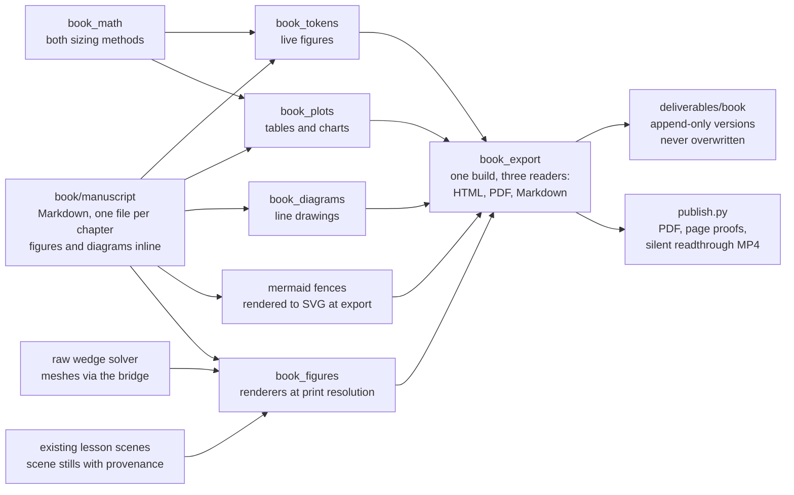
```mermaid
flowchart LR
  ms["book/manuscript<br/>Markdown, one file per chapter<br/>figures and diagrams inline"] --> tokens["book_tokens<br/>live figures"]
  bm["book_math<br/>both sizing methods"] --> tokens
  ms --> plots["book_plots<br/>tables and charts"]
  ms --> diag["book_diagrams<br/>line drawings"]
  ms --> mermaid["mermaid fences<br/>rendered to SVG at export"]
  bm --> plots
  ms --> figs["book_figures<br/>renderers at print resolution"]
  solver["raw wedge solver<br/>meshes via the bridge"] --> figs
  scenes["existing lesson scenes<br/>scene stills with provenance"] --> figs
  tokens --> export["book_export<br/>one build, three readers:<br/>HTML, PDF, Markdown"]
  plots --> export
  diag --> export
  mermaid --> export
  figs --> export
  export --> out["deliverables/book<br/>append-only versions<br/>never overwritten"]
  export --> publish["publish.py<br/>PDF, page proofs,<br/>silent readthrough MP4"]
```

Read the arrows into `book_export` as the gate: that is where the tokens are
resolved, the figures are found, and the book either builds or fails. A
token that does not resolve is a hard error, not a blank, which is the
reason a typo in a sentence cannot reach a reader.

## The loop an agent runs

The project is written so that a person or an agent does the same thing,
in the same order, and can check every step:

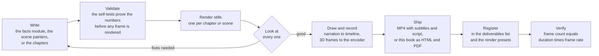
```mermaid
flowchart LR
  write["Write<br/>the facts module, the scene painters,<br/>or the chapters"] --> check["Validate<br/>the self-tests prove the numbers<br/>before any frame is rendered"]
  check --> still["Render stills<br/>one per chapter or scene"]
  still --> look{"Look at<br/>every one"}
  look -->|fixes needed| write
  look -->|good| draw["Draw and record<br/>narration to timeline,<br/>3D frames to the encoder"]
  draw --> ship["Ship<br/>MP4 with subtitles and script,<br/>or this book as HTML and PDF"]
  ship --> reg["Register<br/>in the deliverables list<br/>and the render presets"]
  reg --> verify["Verify<br/>frame count equals<br/>duration times frame rate"]
```

The loop is the method this book teaches, applied to software: measure,
build, look at the result, and write down what went wrong. The render
presets and the deliverables register exist so that the last two boxes are
not optional — an unregistered or unverified artifact does not pass as
finished in this repository.

## Reproducing every figure in this book

The whole book rebuilds from these commands, run from the project's folder
with Python 3.12:

```text
py -3.12 -c "from two_v_demo.book import validate_everything; validate_everything()"
```

checks the arithmetic, the outline, every token, every figure and the
manuscript machinery, and reports what passed. It is the gate the book
must pass before it is exported.

```text
py -3.12 launcher.py
```

opens the project's launcher. Its **Book** tab carries the
actions: `read_html` and `read_pdf` build the book you are reading;
`export` writes the Markdown source; `audit` prints every number the book
states and the calculation behind it; `progress` shows what is written;
`render_figures` redraws every illustration. Each build writes a new,
versioned file -- nothing in this project is ever overwritten by a
rebuild, so the copy you have and the copy a build makes cannot be the
same file by accident.

The 3-D figures are rendered by the solver's own renderers; the film-still
figures come from the project's films through the launcher's Masterclass
tab; the diagrams on this page are drawn from the manuscript's own mermaid
source at export time, by the mermaid CLI the repository already carries.
The photographs that remain are the author's to take;
until then the book simply leaves their pages out.

## The ten commands worth knowing

Everything in the factory is reachable from the launcher, and everything
the launcher does is reachable without it. These are the commands a person
or an agent actually types:

```text
# the front door, and a new lesson to hang a film on (key, title)
py -3.12 launcher.py
py -3.12 scaffold_lesson.py trusses "Truss Masterclass"

# headless: any launcher action, as a ticket, with no GUI open
py -3.12 -c "import launcher_common as lc; lc.write_config('two_v_masterclass', {'action':'selftest','lesson':'wedge'})"
py -3.12 -c "import launcher_common as lc; lc.write_config('two_v_masterclass', {'action':'shots','lesson':'look','shots':'8,24,40','no_narration':True})"

# the book you are reading: check it, write it, rebuild it
py -3.12 -c "from two_v_demo.book import validate_everything; validate_everything()"
py -3.12 book_studio.py
py -3.12 -c "from two_v_demo import book_export; print(book_export.export_html().path)"

# find the stills that match a passage, then draw one
py -3.12 two_trees_codex/scene_catalog.py --query "eight wedges from six six-foot trunk sections"

# check a finished film before it is called finished
py -3.12 verify_renders.py deliverables/masterclass/whey-wedges-no-sawmill.mp4
```

A ticket is the launch configuration without the window: it writes the same
settings the GUI would, so a film or a book can be rebuilt from a script,
a test or another tool. That is how this repository keeps its films and its
book reproducible by somebody who never clicks anything.

## The launcher

Every tool in this project opens from one window, `launcher.py`:

```text
py -3.12 launcher.py
```

Its tabs are the project's own: the simulator, the lessons and their
films, the dome park, the presenter, and the book this page belongs to.
The book tab is the one to use for anything in this book: read it, build
it, check it, or sit down and change it -- the same files this book was
written in are the files you would write in, plain Markdown in
`book/manuscript/`, one file per chapter.

The launcher also runs the films' smoketests, and the book's, which is the
last line of this section and the one worth repeating: a copy of this book
exists only if every check passed.

---

# Index and Colophon

## Colophon

This book was not typeset from a manuscript that could drift from the
things it describes. It was built, in one step, from the same software
that draws the models and solves the geometry, and that is worth one page
of explanation because it is the book's one unusual promise.

Every figure in these pages is computed at the moment the book is built.
When a chapter says the dome is 21.6 feet across, the
number came out of the solver a second before it reached the page; when a
table prints the fold angles of 82 chapters' worth of
claims, each one is resolved against the geometry, and a misspelt figure
stops the build instead of printing as a blank. The arithmetic is a test
suite, and it runs before any copy of this book is allowed to exist.

The book itself is the same material in three forms: the HTML you can read
in a browser and print from, the PDF typeset from that same HTML, and the
Markdown source. All three are produced by one function, so the version
you read and the version you send cannot be different books.

The tools that made it are named in the software section, and they are
included with this book. Everything here can be regenerated, and the
declared constants can be changed -- a different tree, a different
handling limit, a different rainfall -- and the book rebuilt around them.
That is what makes this a manual rather than a memoir of one build: the
same geometry that produced this dome will produce yours.

---
