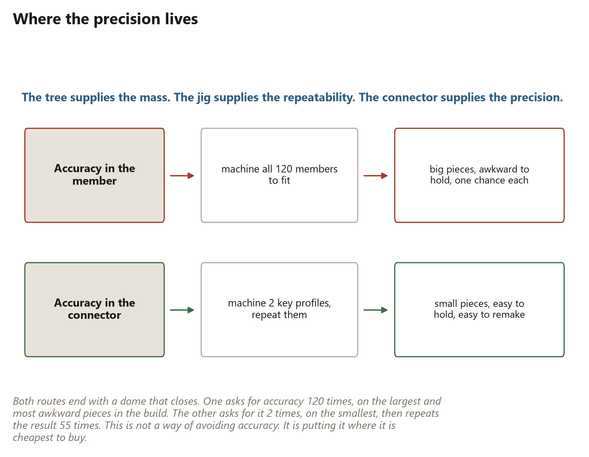
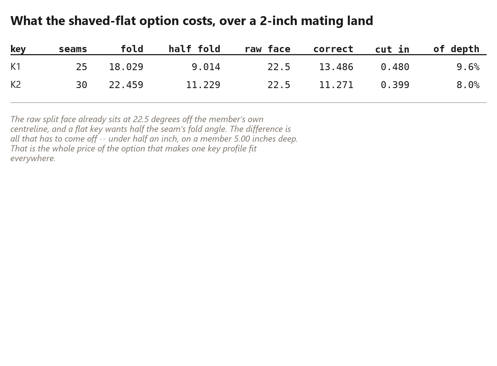
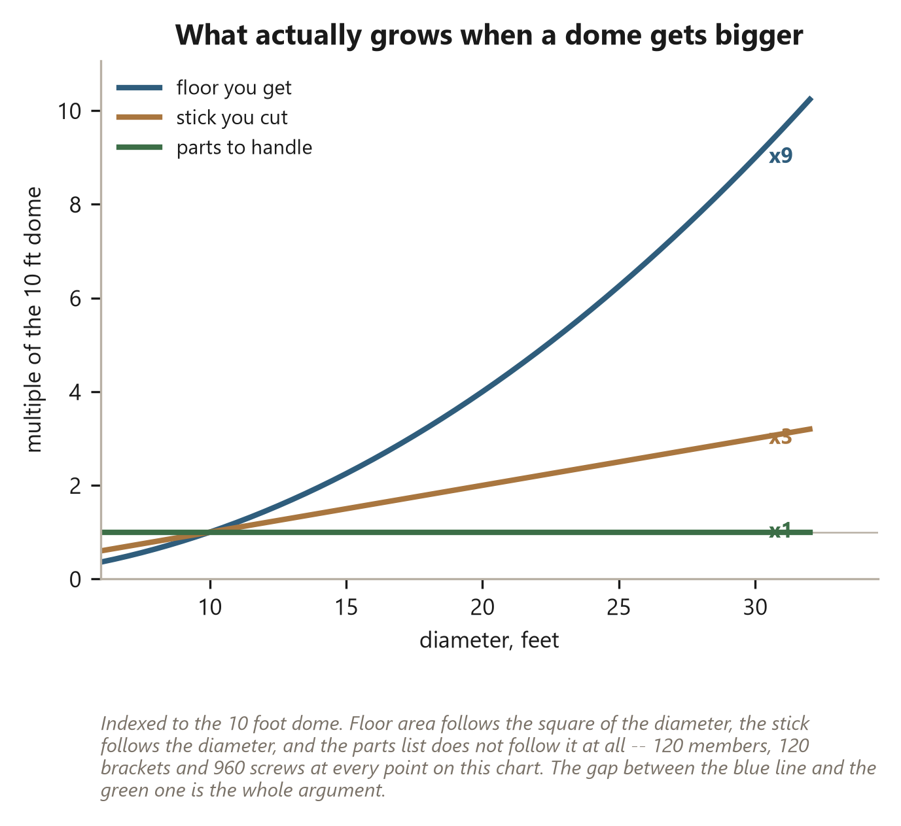
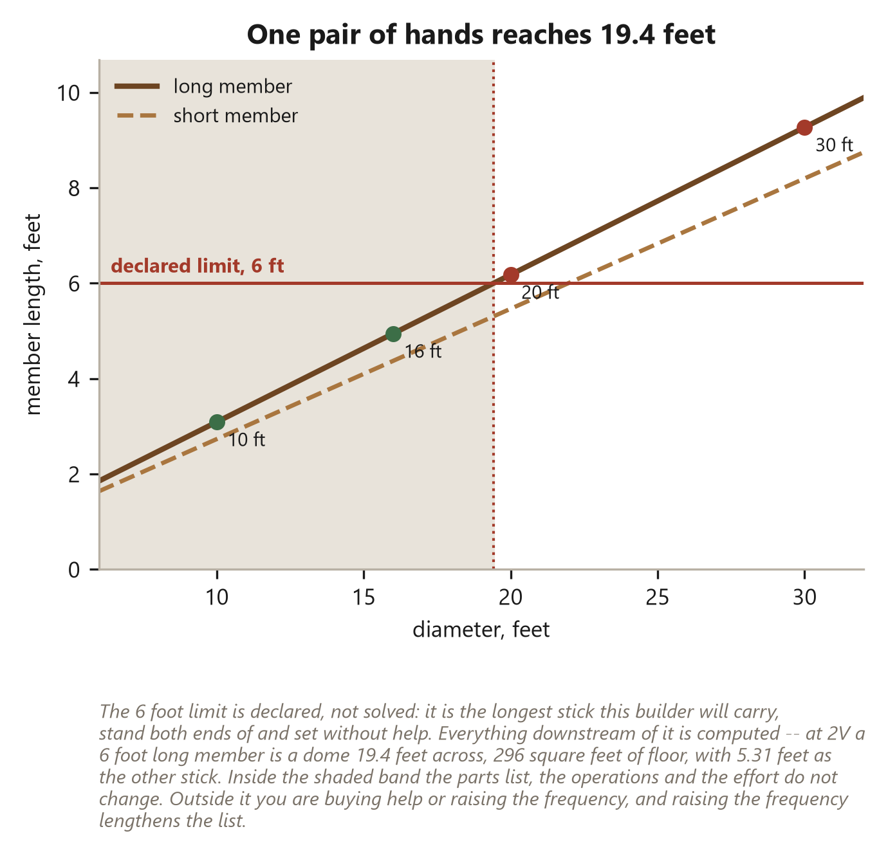
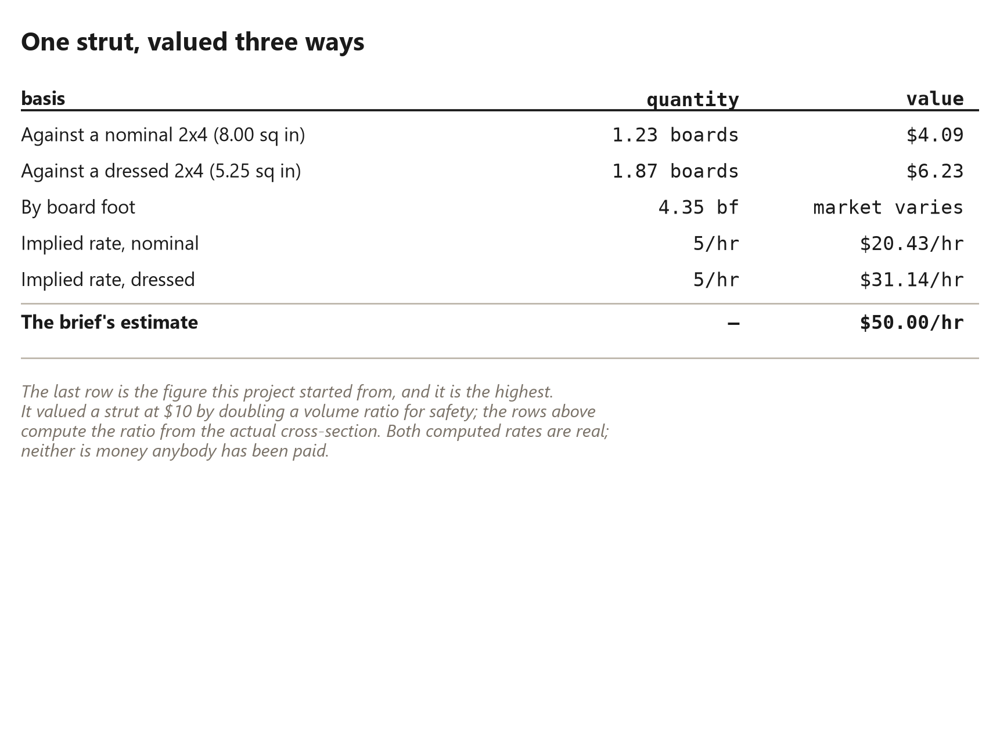
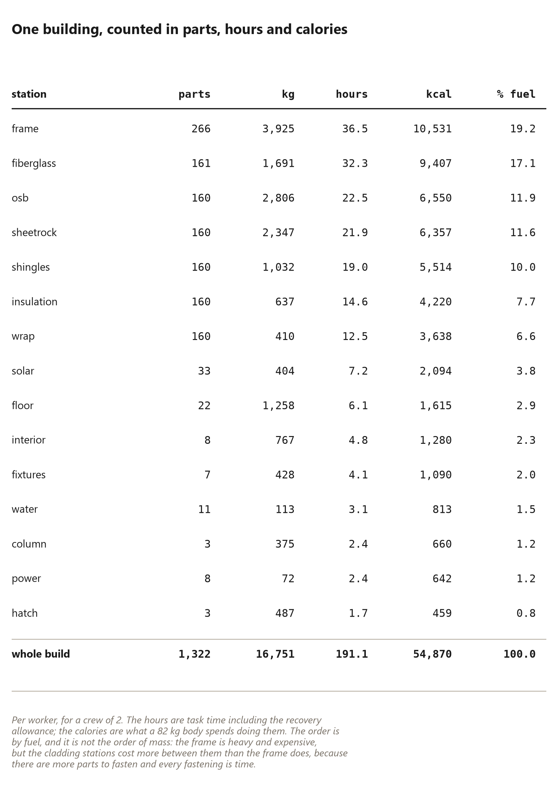
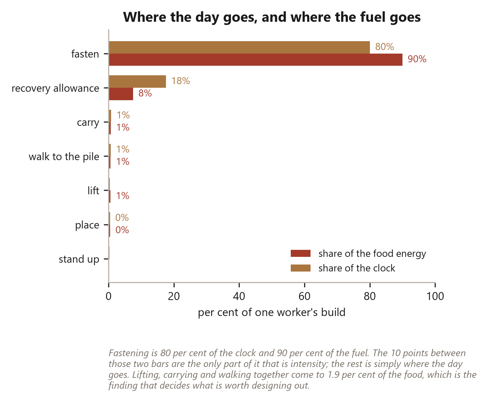
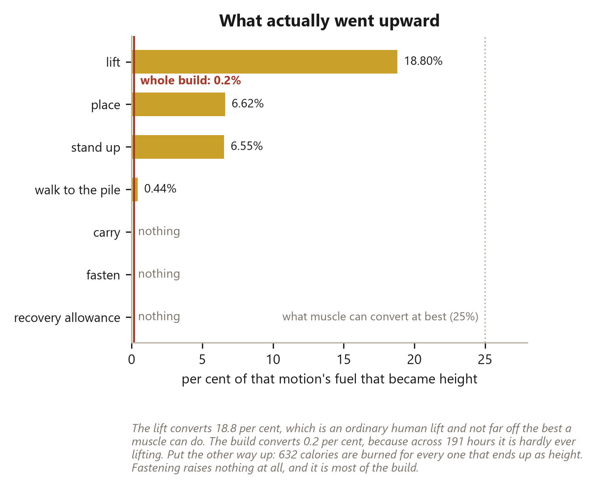

# 2 Trees: Build Your (D)Home

*One small chainsaw, 120 wedge struts, and a geodesic dome in a fortnight*

Exported 2026-09-23. Every figure in this file was computed at export time from the geometry in this repository.

---

# Title pages

## Title page

2 Trees: Build Your (D)Home

*One small chainsaw, 120 wedge struts, and a geodesic dome in a fortnight.*

A builder's manual: the geometry, fabrication, construction and variations
of a hubless timber geodesic system, documented from one standing
prototype.

By the builder. Built with the tools included with this book, which are
named in the back.

## Copyright, and the engineer's note

Copyright © 2026, the author.

This book documents construction methods, geometric principles, prototype
builds and design possibilities. It is not a substitute for site-specific
structural engineering, and nothing in it is offered as code-compliant
design. Codes, loads, materials, soil conditions and permitting
requirements vary by place and by site. A structure intended for permanent
occupancy -- and anything carrying snow, wind or people you are not
prepared to lose -- should be reviewed by a qualified engineer and the
local authority before it is built.

Three kinds of claim run through this book, and each is labelled so they
cannot be mistaken for one another:

**Known geometry.** A fact of the solved frame, true at every size: a 2V
dome of this configuration has this many members, at these ratios. These
are calculations, and the book shows the calculation behind each one.

**Tested construction.** Something that happened on the standing prototype
this book is written around: the joint that was used, the fortnight that
was clocked, the mistake that was made and corrected. These are reports,
not promises.

**Design possibilities.** Things that are priced or drawn but not yet
built: the rotating pad, the iris, the network. Each is marked as such
where it appears, and the closing chapter restates every claim in the book
as the condition it rests on.

A method whose three kinds of claim are kept apart is a method a reader
can check. That separation is the point of this book, and the rest of it
is the working out.

---

# What this book is

Two pine trees, one chainsaw off a hardware-store shelf, one hundred and
twenty structural members, and a geodesic dome standing in fourteen days.

That is the whole claim, and everything in this book exists to either explain
it, prove it, or teach you to do it.

## It is a real build

The dome in the photographs was not rendered, proposed, or costed on a
spreadsheet. It was cut, and the process of cutting it produced a number of
surprises, most of which are in here. Several chapters exist specifically to
report a figure that does not flatter the method — Chapter 13 revises the
recovery claim downward, Chapter 45 halves an hourly rate this project
publicised, and Chapter 48 lists everything else that has had to be taken
back. A book about a new building method that contains no corrections is a
brochure.

## It is three books at once

The reader I had in mind wanted three different things, and they read at
three different speeds, so rather than blend them into a mush each chapter
declares which one it is.

**The story** is what happened, in order, to somebody with a saw: the
frankendome that came first, the afternoon the wedge was found, and the week
lost to a problem that turned out not to exist. Seven chapters, and you can
read them straight through as a narrative.

**The manual** is do this, then this. Eighteen chapters, and if you follow
only those you get a dome. It is a complete set of instructions on its own.

**The explanation** is why any of it works — why a triangulated frame will
accept a stick no mill would sell, why splitting a round log is free and
squaring it is not, and why this method does not transfer to a rectangular
house. Fifteen chapters, all skippable, all there because a method you do not
understand is a method you cannot adapt.

The rest is reference: the tables you come back to at the saw rather than
read in an armchair.


## Every number here is computed

This is the unusual part, and it is worth a paragraph.

Not one figure in this book was typed into a sentence. Every dimension, count,
angle, percentage and price is a token in the manuscript that gets filled in,
at the moment the book is made, by the same software that draws the
three-dimensional models. When it says the dome is 21.6 feet
across, that number came out of a solver about a second before it reached
this page.

The reason is not showing off. It is that a number typed into a paragraph is
correct on the day it is typed and silently wrong from the first time anybody
changes anything — and there is no way to find those. Nothing fails. The book
just quietly becomes untrue in places nobody remembers.

So the arithmetic in this book is a test suite. It runs, it checks itself
against the geometry, and where two ways of computing something disagree the
book prints both and says which is which. Chapter 23 is nothing but a proof
that the two methods in Part IV are the same calculation, and it prints the
residual — 0.0e+00 inches — rather than asking you to take
it on trust.

Every tool that produced these numbers is named in the back, and every one of
them is included with this book. You can change the tree and rebuild the
whole thing around your own.

## What it is not

It is not an engineer's stamp. Nothing here has been checked by a licensed
structural engineer, and where a figure depends on species, grade or moisture
this book says so and tells you who to ask instead of guessing.

It is not a code compliance document. Your jurisdiction has opinions about
round buildings and they are not in here.

And it is not a promise that you will do this in a fortnight. I did, on the
second attempt, having already made every mistake in Chapter 47.

---

# Part 1: How to Build One

> A dome is a frame, a skin and a floor, and the frame is the only part of it that has to be got right.

*The method, in the order it is actually done: what a dome is, why the shape carries load, how a tree becomes forty panels, and the fortnight that turns those panels into a shell.*

---

# 5. The Cut That Changed It

*Split the trunk like a cake, and the stick is already the right shape*


## The Cut That Changed It

I want to tell this one without hindsight tidying it up, because the tidy
version — *I realised the dome would accept any consistent section, therefore
I split the log radially* — is not what happened and it teaches nothing. What
happened was that I was tired of brackets.

## Half, half, half again

The frankendome had taught me that a frame of forty triangles will stand up
even if no two of its sticks match. The V-bracket afternoon had taught me
that making a connector tolerant enough to join anything to anything means
the connector is now doing all the work, forever, in forty places.

So I had stopped asking how to join dissimilar sticks and started asking the
opposite question: what would it take for them not to be dissimilar?

The answer that everybody gives is *mill them*. Square them up, run them
through a planer, and now they are all 2x4s. That answer costs a mill, a
planer, a shed to keep them in, and about half the tree.

I was sitting on a section of trunk at the time. Not thinking about it.
Sitting on it.

And the thing about a round section of trunk is that it is already
rotationally symmetric. Every radius is the same as every other radius. If
you split it through the middle you get two identical halves, not because you
were careful but because the log was round before you touched it. Split those
and you get four. Split those and you get 8.

Three passes. Eight sticks. Every one the same, to whatever tolerance the
tree was round to, which is a tolerance nobody had to hold and nobody had to
check.


I did it that afternoon on a piece I had been about to burn.

## What became obvious immediately

Four things, in about a minute, and I want to record that they were obvious
because the ones in the next section took a week and I do not want to flatter
the story.

**One section, everywhere.** Every stick in the frame has the same
cross-section: 3.83 inches across the bark face,
5.00 inches from pith to bark, 9.82 square
inches of wood. So one jig fits all of them. One fixture, one set of stops,
one procedure repeated a hundred and twenty times. That is what makes this a
fortnight instead of a summer.

**Depth where you want it.** A sector is deep — it runs the whole way from
the pith to the bark — and depth is where bending stiffness lives. The stick
is not a compromise between what the tree gave and what a mill wanted. It is
the deepest member you can cut from that log, which is a strange thing to get
for free.

**No machine between the tree and the frame.** Fell, buck, split, build. The
chainsaw does all of it. There is no second machine, no second setup, no
second building to keep the second machine in.

**Four ways up.** This one I noticed while stacking them. The sector is not
symmetric about its own long axis — it has a point and a curved back — so you
can rotate it four sensible ways in the wall and get four different things:
which face the weather sees, which face the next stick lands on, whether the
points of a pair aim together or apart. That is Chapter 14, and it is the
most genuinely new thing in the method.

## And what took another week

Now the part the tidy version leaves out.

I assumed, because the sticks were identical and the panels were identical,
that the *joints* would be identical. Forty triangles, all the same, all
meeting each other the same way.

They do not.

A dome is a sphere approximated by flat panels, and the angle at which two
panels meet is not the same everywhere on it. It cannot be — the sphere
curves differently in different places, and a 2V hemisphere has two classes
of edge for exactly that reason. So the seam between two panels folds by one
amount here and a different amount there, and a key cut to fit one seam will
not fit the other.

I did not want this to be true. I spent the better part of a week trying to
make it not be true: fudging the panel outlines, trying a compressible
gasket, trying to talk myself into the idea that the difference was small
enough to force closed. It is not small enough. Forty panels of *nearly*
closing is a dome with a gap in it.

What actually resolved it was measuring instead of arguing. Across all
55 seams there are only **2** fold
angles. Not forty. Not a continuum. Two: 18.03 degrees and
22.46.

That was the moment the method became buildable rather than merely elegant.
2 angles means 2 key profiles:
cut one of each until it fits, then repeat it 25 and
30 times. The difference between "the seams vary" and "the
seams take 2 values" is the difference between a
research project and a fortnight, and I lost a week to not knowing which one
I was in.

The chart is in Chapter 16, where it belongs.

## The bit I got wrong in public

While all this was going on I was saying, out loud and on camera, that
nothing in the dome needed a mitre.

That is not true and it was never true. The end of each stick that lands on
the side of the next one — the butt end — is a compound cut: a mitre and a
bevel together. What is true, and what I should have been saying, is that no
end is ever mitred *to another end*. Every joint is an end landing on a
flat side, which means each stick is cut once, on one end, before it goes
anywhere near the assembly, and the other end is left long and sawn off in
place.

That is a much better claim than the one I made, and it is a shame I spent
several months making the wrong one. Chapter 15 has the geometry and Chapter 48 has the full list of things this project has had to take back.

## What it is worth

The number that convinced me it was not just a neat trick: splitting this way
keeps 87.4 per cent of the solid wood in the trunk, against
about 45 per cent for the same log sawn into
two-by-fours the way a mill would. That is 1.93 times the
usable wood, from a cheaper process, with one machine instead of four.

Chapter 13 does that arithmetic properly, including the parts of it that are
less flattering than they first appeared.

But sitting on that log, what I had was a much simpler observation, and I
still think it is the whole book:

**A round thing splits into identical pieces for free. A square thing has to
be made square, and you pay for that in wood, in machines, and in time.
Domes are the buildings that will accept the free pieces.**

---

# 7. Not a Worse Two-by-Four

*The head-to-head nobody runs honestly, run honestly*


## Not a Worse Two-by-Four

Everybody asks the same question, and they are right to ask it.

*Is a split log actually as good as a board?*

The honest answer has three parts, and only two of them are flattering. This
chapter gives all three, because a method defended only with its good numbers
is a method nobody should trust with a roof over their head.

## The rectangle is not the tree's idea

Modern construction has trained us to think of wood as something that
naturally arrives in rectangles. A tree goes into a sawmill and a stack of
2x4s comes out, and the form is so familiar that it stops looking like a
choice.

It is a choice. The rectangle is not a property of wood. It is the output of
a manufacturing process designed around a particular kind of building — one
made of vertical studs, horizontal plates, flat walls, right-angle corners
and rectangular openings. For that building the rectangle is close to
perfect, and the industry that produces it is very good indeed at what it
does.

A geodesic dome is almost the opposite of that building. Its structural
language is triangles, changing face planes, radial geometry and repeated
angular joints. Nothing in it is a right angle. Nothing in it is a flat wall.

So the question reopens, and it is worth asking properly rather than
assuming the answer in either direction: *for this building, is the
rectangle still the right thing to make out of the tree?*

## More wood, from a modest tree

Start with the simplest measure: how much wood is actually in the stick.

Take an 8-inch log — not a monster, a tree most people
could fell and move without help. Split it 8 ways and each
sector holds **6.28 square inches** of wood.

A dressed 2x4 — the board actually on the rack, which is 1.5 by 3.5 inches
whatever it says on the label — holds **5.25**.

That is **+20 per cent more wood** in the wedge, from a
tree you could carry out of a wood lot in sections.

And it is the conservative version of the claim. A larger log widens the gap
sharply, because area grows with the square of the radius while a 2x4 stays a
2x4. The book quotes the small log deliberately: a claim is worth more made at
its weakest.

The wedge is also deeper. Pith to bark is 4.00 inches
against the board's 3.5, and depth is where bending resistance comes from.


## And now the number that does not help

Here is where an honest chapter parts company with a sales pitch.

**Area is not strength.** How much a section resists bending depends not only
on how much wood is in it but on *where that wood sits* — material far from
the middle does most of the work, material near the middle does almost none.

And a wedge puts a great deal of its wood near the pith, in the narrow part
of the pie slice, where it contributes very little.

Run the numbers properly and the comparison comes out like this:

| | wedge | 2x4 on edge |
|---|---|---|
| Wood in the section | **+20%** | — |
| Resistance to bending (stiffness) | **-1%** | — |
| Bending strength | **-33%** | — |

Read that middle row again. The wedge has +20 per cent
more wood in it and is **not stiffer**. It comes out within a per cent of a
2x4 stood on edge — effectively identical, having spent twenty per cent more
material to get there.

And the bottom row is worse: in bending *strength* the wedge is
-33 per cent against the same board.

That is the number this method's advocates do not usually print, and it is
printed here, in a table, near the front.


## One consolation, before the argument

There is a caveat to the caveat, and it is a fair one.

The comparison above puts the 2x4 **on edge** — the orientation in which a
board is strongest, and the way a carefully framed floor joist is installed.
A great deal of real framing does not get that. Sheathing battens, blocking,
purlins and plenty of cheerfully improvised structures end up loading boards
the flat way, and against a 2x4 laid flat the wedge is
**5.4 times stiffer**.

So the honest summary is: worse than a well-oriented board, dramatically
better than a badly-oriented one.

That is still not the argument.

## Which is the right question

The argument is that *the comparison itself is the wrong shape*.

Asking "is this wedge as good a beam as a 2x4?" assumes that being a beam is
the job. In a rectangular building it usually is: a stud, a joist and a
rafter all spend their lives resisting bending, largely alone.

A triangulated frame does not work that way. That is the entire point of
triangulating it. A properly designed triangle converts an external load into
forces running *along* its members — compression down one, tension along
another — instead of asking any single member to bend. The network carries the
load; the sticks mostly just push and pull.

And for a member being pushed or pulled along its length, the property that
matters is **cross-sectional area**. Not section modulus. Area.

Which is the column the wedge wins, by +20 per cent.

So the useful question is not:

> Is this wedge as good a rectangular beam as a 2x4?

but:

> Is this wedge an effective axial member inside this triangulated system?

And there the answer is straightforwardly yes, with more wood in the section
than the board it replaces, from a tree that never went near a mill.

## Mostly

One more piece of honesty, because "mostly axial" is doing real work in that
paragraph.

Panels are not purely axial. Wind pushes on the skin between the members and
snow sits on it, and those loads reach the frame as bending in the individual
sticks. It is not the dominant case and it is not nothing, and it is exactly
where the wedge's -33 per cent deficit is a real deficit
rather than an academic one.

Two things about that:

* The wedge is deep. 4.00 inches pith to bark is more
  depth than the board has, and depth is what resists the bending it does
  see — which is why the stiffness came out level rather than behind despite
  the shape being worse.
* Panel span is short. The distance between supports in a 2V panel is a few
  feet, not the fifteen a floor joist crosses, and bending demand falls away
  fast as spans shorten.

None of which is a substitute for somebody competent checking your particular
building for your particular snow load. Chapter 10 says the same
thing at more length and names who to ask.

## What this chapter does not claim

It is worth fencing the argument, so nobody quotes it doing work it cannot do.

This chapter does **not** claim that a split-log wedge is better than a 2x4
as a wall stud, a floor joist, a roof rafter, a shelf, a header or a piece of
furniture. For all of those the board wins, often easily, and the reasons are
in the table above.

It claims something narrower and much more defensible:

> For a purpose-designed geodesic dome whose geometry, connectors and jigs
> are built around radially split timber, the wedge is a better use of the
> tree than first converting that same tree into ordinary dimensional
> lumber.

That is the whole claim. It depends on the building being designed around the
material from the beginning — which is what the rest of this book is about.

We are not asking an unconventional piece of wood to imitate a 2x4.

We are building something in which it does not have to.

---

# 17. Let the Connector Hold the Angle

*Keep the wood, machine the small part*


## Let the Connector Hold the Angle

There is a principle underneath this whole method, and it is worth stating on
its own because it is the thing that makes rough natural timber buildable to a
tolerance at all.

> The tree supplies the mass. The jig supplies the repeatability. The
> connector supplies the precision.

Three jobs. Three different things doing them. Nothing asked to do two.

## Precision is expensive per cubic inch

The instinct with an irregular material is to machine it until it is regular.
Plane the faces, square the ends, bring everything to a dimension, and then
build with confidence.

That instinct is why dimensional lumber exists, and inside a mill it is the
right instinct — a mill can afford to hold a tolerance because it is holding
it on thousands of pieces with a machine built for nothing else.

A person with a chainsaw cannot afford it, and the reason is not skill. It is
that **precision costs roughly in proportion to how much material you have to
be precise about**. A long, heavy, awkward member is expensive to hold, to
reference, to feed and to correct. A small block is cheap to hold and cheap to
remake if you get it wrong.

So there is a choice about *where to put the accuracy*, and the two answers
lead to very different afternoons:



One route asks for accuracy 120 times, on the largest and most
awkward pieces in the build, with one chance at each. The other asks for it
2 times, on the smallest pieces, and then repeats the
result 55 times.

Both end with a dome that closes.

This is not a way of avoiding accuracy. Nothing here is less accurate than the
alternative — the seams end up at the same angles either way. It is a question
of *where the accuracy is cheapest to buy*, and the answer is: in the small
part.

## The wedge starts close to useful

There is a piece of luck in this, and it is the reason the wedge suits a dome
rather than merely tolerating one.

A rectangular board arrives with two faces at ninety degrees to each other.
Ninety degrees appears nowhere in a geodesic dome. Every angular relationship
in the frame has to be created from nothing, by cutting.

A split sector does not arrive square. It arrives with two sawn faces that
each sit **22.5 degrees** off the member's own
centreline, because that is half of one 45-degree
sector.

And the seams of this dome fold by 18.03 and
22.46 degrees.

Those are not the same numbers. The wedge does not magically arrive at the
right angle — that would be too good, and this book does not do too good. But
it arrives *within a few degrees* of what the joint wants, rather than
sixty-odd degrees away.

The natural shape of the tree becomes part of the joint system instead of an
obstacle that first has to be removed. That is the difference between a
material that suits a structure and one that merely survives it.

## Two ways to close the difference

The gap between the face you have and the face the joint wants can be closed
from either side.

**Shape the key.** Leave both sawn faces exactly as split and cut a tapered
key that fills whatever is left. No wood is machined at all. The cost is that
the key is not the same shape at every seam, so there is more than one key
profile to make.

**Shape the wood.** Plane both faces parallel and drop in a plain rectangular
key that fits everywhere. One key profile for the whole dome. The cost is a
machining pass on every stick.

Chapter 16 covers what each does to the seam. This chapter is about
what the second one costs, because it sounds much worse than it is.

## What planing the faces actually costs

Here is the arithmetic, and it is the most reassuring table in the book.

The raw split face sits at 22.5 degrees. A flat key wants
a face at half the seam's fold angle. The difference between those two is
everything that has to come off.



Over a two-inch mating land — you do not need the whole face to bear, only a
band of it — the deepest cut anywhere in the dome is
**0.48 inches**.

On a member 5.00 inches deep, that is
10 per cent of the section.

So even the "machine the wood" option does not convert a wedge into something
resembling dimensional lumber. It removes a narrow sliver from a narrow band
and leaves the overwhelming majority of the member exactly as the saw left it.
You are still not making boards. You are making one precise interface on an
otherwise raw stick.

That is worth knowing before you decide, because the shaved-flat route is
often written off as a betrayal of the whole idea. It is not. It is a
10 per cent concession that buys you a single key
profile.

## Or do not machine anything at all

There is a third answer, and in some builds it is the best one: make the
connector out of something that does not need to fit exactly, because it
deforms.

A rubber or closed-cell spline, a length of hose, a compressed gasket — any of
these fills a *range* rather than a value. Feed it a seam anywhere between the
two fold angles and it takes up the difference by squashing.

What a compliant key can do, all at once:

* absorb the angular difference,
* absorb manufacturing variation in the members,
* seal the seam against weather,
* isolate one panel from another acoustically and against vibration,
* hold a preload so the joint stays tight as the wood moves.

What it cannot do is carry the load a timber key carries. A compliant seam is
a weather joint and a tolerance joint; it is not a structural one. So the
choice depends on a question you should answer before you buy anything: **is
this seam holding the building up, or holding the weather out?**

In a frame where each panel is a complete, self-braced triangle — which is
what Chapter 18 is about — a great deal of the shell's stiffness
lives inside the panels rather than across the seams, and that is what makes
the compliant option viable at all.

## Why this is a manufacturing idea, not a dodge

It is worth defending this properly, because "let the connector take up the
difference" can sound like an excuse for sloppy work.

It is the opposite. It is how repeatable production works everywhere.

A machine shop does not hold a tolerance on every surface of every part; it
holds it on the surfaces that locate and mate, and leaves the rest rough
because rough is cheaper and does no harm. An engine block is machined to a
few thousandths where the bearings sit and left as cast everywhere else.
Cabinetmakers scribe one edge to a wall and leave the other three alone.

The principle is always the same: **decide which surfaces do work, and spend
your accuracy there.**

In this dome, the surfaces that do work are the mating faces of the seam and
the ends where one member bears on another's side. Everything else — the bark,
the taper, the natural bend, the exact diameter — can vary, and the jig is
designed so that it can.

The tree is not being asked to be accurate. It is being asked to be strong,
which it already is.

---

# 18. Why Every Panel Keeps Its Own Edge

*One hundred and twenty members for sixty-five edges, and what the difference
buys*


## Every Panel Keeps Its Own Edge

If you have been adding up as you read, something has not been adding up.

## The arithmetic that does not look right

The frame has 40 triangular panels. Each panel has
3 members. So:

> 40 × 3 = **120
> members**

But the shell only has **65 edges**. Count the lines on a
drawing of the dome and that is what you get: 55 interior edges
where two panels meet, plus 10 around the open bottom where
a panel meets nothing.

So there are 55 more members than there are edges for them
to be.

That is not an error. It is the single biggest deliberate decision in this
frame, and it costs **1.85 times** the timber a
conventional geodesic skeleton would use.

It is worth being clear about the size of that, because it is not a rounding
difference. If you built the same dome with one shared strut per edge you
would need 65 members instead of 120. The panelised
frame uses almost twice as much wood in the frame.

Here is why it is worth it anyway.

## What is actually at a seam

In a classical geodesic frame, an edge is one strut, and the two triangles
either side of it both fasten to that same strut. Efficient, and the standard
way it is done.

In this frame, each panel is built complete — three of its own members, closed
into its own triangle — before it goes anywhere near its neighbours. So where
two panels meet there are two members, one belonging to each, with the key
between them.


Panel A's member. The key. Panel B's member.

The duplicated edge is not lumber somebody forgot to remove. It is the price
of a panel being a *thing* rather than a position in an assembly.

## What the extra wood buys

Six things, and the first three are why the fortnight in Part 5 is a fortnight
rather than a season.

**A panel can be built flat.** All three of its members exist and belong to
it, so the whole triangle can be assembled on a bench, at waist height, on the
ground, in the dry. Nothing about building it requires any other panel to
exist yet. In a shared-strut frame you cannot finish a triangle without the
struts its neighbours also use, which is why those domes tend to get assembled
in the air, strut by strut, at the top of a ladder.

**A panel can be checked before it goes up.** It has a measurable shape while
it is still somewhere you can measure it. A panel that came out wrong is
firewood and half an hour; a panel discovered wrong when it is the
thirty-eighth thing lifted into place is a much longer day.

**A panel can be finished before it goes up.** Skin it, seal it, insulate it,
run a cable through it, paint it — all on the ground. This is a genuine
transformation of the work: it turns awkward three-dimensional construction at
height into repetitive two-dimensional production at a bench, which is
manufacturing rather than improvisation.

**The seam gets room for a gasket.** Two members with a gap between them is a
place a key, a spline or a compressible seal can live. One shared strut has no
such space — the panels either side bear directly on it, and weatherproofing
that joint is a separate problem solved with tape and hope. Chapter
17 is about what can be done with that space, and Chapter
16 about what has to be.

**A panel can be taken out again.** Undo one seam's fasteners and a panel
lifts out, leaving its neighbours standing and complete. Nothing else in the
shell depended on that panel's members. Replace a rotted one in year fifteen,
cut a window into one in year three, take three out to get a bathtub in —
these become ordinary jobs rather than partial demolitions.

**The frame gains redundancy.** Every interior edge has two members in it. One
splitting, checking or being damaged does not leave that edge unsupported. It
is not a designed redundancy and nobody should rely on it, but it is real.

## The check that has to close

Two independent ways of counting the members have to give the same answer, and
this is worth doing yourself once, because it is the check that tells you the
frame in your head is the frame on the ground.

**Count panel by panel.** Every panel has 3 members.

> 40 × 3 = 120

**Count edge by edge.** Every interior seam holds two members, one from each
panel. Every rim edge holds one, because there is nothing on the other side of
it.

> (55 × 2) + 10 = 120

Both give 120. The software in this project runs exactly this
check every time the book is built, and refuses to print anything if the two
disagree — because if they ever did, one of the two pictures would be of a
building that does not exist, and there would be no way to know which.

## When to share a strut instead

This chapter should not pretend the choice is obvious in every case.

Share the strut if:

* **Timber is your scarcest resource.** 1.85 times the
  members is 1.85 times the trees, and if you have one
  tree rather than two that decides it.
* **You have a crew and scaffolding.** The panelised method's main advantage is
  that one person can do it on the ground. With four people and a lift, in-air
  assembly is not the ordeal it is alone.
* **The dome is small.** Below a certain size the members are short enough to
  handle comfortably at height, and the panel machinery is overhead you do not
  need.
* **You want the lightest possible frame.** For a temporary structure, a
  greenhouse, or anything that has to be carried in, the weight of the
  duplicated members is a real cost.

Keep the panel if:

* **You are building alone**, which is what this method was designed for.
* **You want to finish panels on the ground**, which is most of the reason the
  build fits in a fortnight.
* **You want a weatherable seam**, because the gap is where the seal goes.
* **You expect the building to change**, because panels come out.

This book chose the panel, and every number in it follows from that choice.
Chapter 22's two trees are two trees precisely *because* the
frame duplicates its edges. A shared-strut dome of the same diameter would
come out of about one.

That is the trade, stated plainly: **roughly twice the wood, for a building
one person can make on the ground and take apart again.**

---

# 17. Which Way Round Are You Working?

*Choose your method before you touch anything*


## Which Way Round

There are two ways to size a wedge dome, and the first thing you have to do
is work out which one you are actually in. Not which one you would like to be
in. Which one you are in.

If you get this wrong you will spend a week doing arithmetic that describes a
building you cannot build, and you will not find out until the day you go to
cut, when the longest stick the frame wants turns out to be eight inches
longer than the longest stick you own.

Everything in the next five chapters follows from this one decision, so it
gets its own short chapter and no other content.

## Design first, or tree first

**Design first** is the way everybody expects to work. You know what you
want: a room of a certain size, a ceiling you can stand under, a footprint
that fits between the trees you are not cutting down. You start from the dome
and you work backwards to the woodpile. The output is a shopping list — this
many sticks, this long, and therefore this much trunk.

**Tree first** is the way this book was actually written. You have trees.
They are the trees you have: a certain height, a certain taper, a certain
amount of straight length between the butt flare and the first serious bend.
You start from what a section of that trunk can be cut into and you work
forwards to the dome. The output is not a shopping list. It is a diameter,
and you find it out rather than choosing it.

Both are honest. Neither is better. They answer different questions and they
run in opposite directions, and the entire content of Chapters 21 and 22 is
those two directions worked through in full.

## The honest test

Here is the test, and it is uncomfortable.

**Are the trees already down, or already chosen?**

If they are — if you are standing next to a windfall, or you have marked two
pines at the back of the property, or somebody has offered you a load — then
you are in Method B, and picking a diameter is not a decision you get to
make. It is a wish. You may still write a number on a piece of paper. The
trees will not read it.

If the trees are genuinely not chosen — you will buy or fell whatever the
design calls for, and there is enough standing timber that a foot either way
on the bucking length costs you nothing — then you are in Method A, and you
should design the dome you want.

Almost everybody thinks they are in Method A. Most people are in Method B.
The tell is whether you would actually go and get a different tree if the
arithmetic asked for one. If the answer is "well, I'd probably make it work
with these," you are in Method B and you may as well admit it on page one
rather than on cutting day.


## What both methods share

Underneath the two directions there is one relationship, and it is worth
understanding before you use either method, because it is the thing that
makes both of them exact rather than approximate.

In a 2V dome of radius *R*, every panel is a triangle whose corners sit on the
sphere. If the members simply ran corner to corner you could scale them
straight off the radius: double the dome, double the stick. But they do not
run corner to corner. They pinwheel — each member's end lands on the *side*
of the next one rather than on a shared point — and the amount each member is
set back from the true corner depends on **how wide the member is**, not on
how big the dome is.

A wider stick sits back further. And the width of your stick comes from the
diameter of your log, which has nothing whatsoever to do with the dome.

So member length is not proportional to radius. It is radius *minus* a
correction that stays the same size while the dome grows. Which means:

* Going from radius to member length is a calculation.
* Going from member length back to radius is that same calculation, solved
  backwards.

Neither direction is a rule of thumb, a table, or a fudge factor. They are
one function and its inverse, and Chapter 23 exists solely to run them
against each other and print the difference, which is
0.0e+00 inches.

## Before you go on

Whichever method you are in, you need three measurements before either
chapter is any use to you:

1. **The diameter of your log at the middle of a section.** Not at the butt —
   the butt is the fattest part and it flatters you. The middle, because that
   is what the average stick will be.
2. **The straight length you can get out of the trunk.** Between the flare
   and the first bend that would spoil a section.
3. **The longest piece you are willing to carry on your own.** This is a real
   constraint and it does more to set the dome's size than anything you will
   read in a book. A six-foot green pine wedge is heavy. An eight-foot one is
   a two-person lift, and if there is only one of you, that is the end of the
   discussion.

Write those three numbers down. Then turn to Chapter 21 if you are designing
first, or Chapter 22 if the trees are already on the ground.

And then, whichever one you used, read Chapter 23 and check it with the other
one. That takes ten minutes and it is the cheapest insurance in the book.

---

# 18. Method A: From the Dome You Want

*Radius in, cut list out*


## Method A

You know what you want. Now find out what it costs in trunk.

This is the method to use when the timber is genuinely not decided — when you
will fell, buy or scrounge whatever the design asks for. It runs from the
building to the woodpile, which is the direction every other construction
book works in, and it is the more comfortable of the two.

It is also the one that will tell you, politely and in advance, when the dome
you have in mind needs more trees than you have.

## The procedure

### 1. Start from floor, not radius

Nobody wants a radius. They want a room.

Decide the floor area you want to stand on and convert:

> radius (feet) = √(floor ÷ π)

300 square feet gives a radius of
9.77 feet — call it 117 inches. A 2V
hemisphere's standing height at the centre *is* its radius, so
that same number is also your ceiling.

This is the first place a dome surprises people. A
300-square-foot dome is 9.77 feet tall in
the middle, which is more house than the floor area
suggests, and the volume is doing something a rectangle of the same footprint
cannot.

It is also the first place a dome disappoints people, because not all of that
floor has headroom over it. Chapter 43 has the map.

### 2. Measure the stock you expect to have

Even in Method A you cannot skip this. The pinwheel setback depends on how
wide your members are, and you cannot compute a member length without it.

If you have not felled anything yet, use the diameter you expect to be
cutting. A 12-inch butt tapering to
8 gives sectors about 3.83 inches wide
at mid-trunk, and that is the figure this book's tables assume.

If your logs will be fatter, your members will be wider, your setback will be
larger, and every length in your cut list will come out shorter than the
tables here. The tables are computed at this book's stock; recompute for
yours.

### 3. Solve the member lengths

For a chosen radius, the layout gives you 4 member
classes. This is the calculation Chapter 20 described, run in the forward
direction: radius in, lengths out.

At 300 square feet the longest member comes out at
64.5 inches and the shortest at
56.1.


### 4. Round the bucking length up

Your longest member is 64.5 inches. Buck to
6 feet — 72 inches.

You cannot buck to 64.5 inches. Well, you can, but you
should not: a section
cut to exactly the longest member leaves no allowance for the head-end
overfit (Chapter 35), no allowance for the butt cut (Chapter 34), and nothing
at all for the end of a log being split or shaken.

**Round up to the next whole foot and take the waste.** It is the cheapest
line item in the build.

This does mean the design-first path throws away more wood than the tree-first
path, because the tree-first path chooses a dome that uses the whole section.
That is a real cost of getting to pick your diameter, and it is worth saying
out loud rather than discovering in the offcut pile.

### 5. Count sections, then trunk, then trees

The frame needs 120 members. Each section gives
8, so:

> sections = 120 ÷ 8 = 15

> trunk needed = 15 × 6 ft = 90 feet

> trees = 90 ÷ 48 = 1.88

So: **fell 2.**

Notice the number. Designing a 300-square-foot dome from
scratch and sizing the trees to it lands on the same
2 trees that this book's actual build used, from the
opposite direction. That is not a coincidence — it is the size
of dome a pair of ordinary pines makes, and it is why this method produces
houses of roughly this size over and over.

### 6. Check it against the tree you can actually get

Then go and look at the trees.

If the tallest straight trunk you can find is thirty feet rather than
48, your 1.88 trees becomes three. If
your logs are much
thinner at the butt than 12 inches, your members
are narrower, your sticks are longer for the same dome — and thinner, which
Chapter 10 has opinions about.

This is where Method A hands over to Method B, and where Chapter 23's round
trip earns its place.

## Where this method surprises people

**Member length does not scale with the dome.** Double the radius and the
members do not double. They grow by slightly less, because the pinwheel
setback stays the same size while the triangle grows around it.

This is good news at large sizes and bad news at small ones. A very small
dome has members so short relative to their own width that the setback eats a
serious fraction of them, and below a certain size the geometry stops making
sense at all — a stick that is nearly as wide as it is long is not a strut,
it is a block. Chapter 49 says where that line is.

**Height is not a free variable.** In a plain hemisphere, height equals
radius. If you want a wide floor and a ceiling taller than
half that width, you cannot have both from a hemisphere; you need a riser wall
under it (Chapter 41) or a different fraction of a sphere, which is a different book.

**The trees number is rarely a whole one.** You will get
1.88, or 2.4, or 3.1. Round up and accept the leftover, or
shorten the bucking length and see
whether the arithmetic lands better. There is no third option that gets you a
partial tree.

## The lookup table

If you would rather not do any of this, the table below is the whole method
precomputed at this book's stock section. Find your floor area on the left and
read across.


Two warnings about using it:

1. It assumes members 3.83 inches wide. Different logs,
   different table.
2. The `trees` column assumes 48 feet of usable trunk
   per tree. If your trees are shorter — and most are — scale it.

## Then check it the other way

You now have a cut list. Before you cut anything, take the longest member off
that list, hand it to Method B, and see what dome comes back.

It should be the dome you started with. If it is not, you have made an
arithmetic slip or changed an assumption halfway through — a different gasket
thickness, a different split count, a different stock width.

That check is Chapter 23, it takes ten minutes, and it is the reason this
book has two methods rather than one method and a warning.

---

# 19. Method B: From the Tree You Have

*Section length in, dome out*


## Method B

This is the method the book is named after, and it is the one that produced
the dome in the photographs. It starts from a tree lying on the ground and
ends with a number you did not choose.

That last part is the whole character of the method. In Method A you decide
how big the building is and the woodpile has to comply. Here the woodpile
decides, and your job is to find out what it decided.

## The procedure

### 1. Measure the trunk

Three numbers: diameter at the butt of the usable length, diameter at the
top of it, and the straight length between them.

"Usable" means the part with no bend serious enough to spoil a section and no
branch stub big enough to spoil a stick. It is almost always shorter than the
tree. On this book's tree it was 48 feet, out of a
considerably taller pine — the butt flare went in the fire and the top went
for kindling.

The tree this book is written around measures 12
inches at the butt of that length and 8 at the top.


### 2. Pick a bucking length you can carry

This is the decision, and it is a physical one rather than a mathematical
one. Go and pick up a green section of the length you are considering. If you
cannot get it onto a sawhorse on your own, it is too long, and no amount of
wanting a bigger dome will change that on day six.

This book buckes to 6 feet.

Everything downstream comes from this number. Choose it honestly.

### 3. Count your sections

Divide the usable length by the bucking length and throw away the remainder.
48 feet at 6 feet a section is
8 sections, with 0.0 feet left over.

If the remainder is large it is worth going back to step 2 and trying a
different bucking length. A foot of offcut is firewood; four feet is a stick
you did not get.

### 4. Multiply by eight

Each section splits into 8 sectors of
45 degrees each, and — this is the part that surprises
people who have milled lumber — **each sector is a finished structural
member**. Not a blank to be trimmed. Not stock to be dimensioned. A member.

8 sections × 8 sectors =
**64 struts from one tree.**

Two trees: **128 struts.**

The frame needs **120**.

That is the title of the book, and it is not a slogan. It is
8 spare — about seven per cent — which is roughly the
right margin for a stick that splits along the pith, a butt cut that goes
wrong, and the one panel everybody builds backwards.


### 5. Find your member's width

The dome does not care how long your sticks are until it knows how *wide*
they are, because the pinwheel setback depends on width.

The width of a sector is the chord across its bark face, measured at the
diameter you are cutting. Use the diameter at the **middle** of the trunk,
not the butt: half your sections come from thinner wood than the butt
suggests, and sizing the layout off the fat end gives you a dome that does
not quite close at the top.

At this tree's mid diameter the sector is 3.83 inches wide and
5.00 inches deep, pith to bark — a cross-section of
9.82 square inches.

For scale: that is 1.23 nominal two-by-fours' worth of
wood, or 1.87 of the dressed boards you would actually
find on a rack. Chapter 45 is about which of those numbers to believe.

### 6. Solve for the dome

Now the arithmetic. The longest member the frame may contain is the longest
stick you have, which is your bucking length: 6 feet.

Find the radius whose longest pinwheel member is exactly that.

This is not a division. As Chapter 20 explained, member length is radius less
a setback that does not scale, so the relationship has to be solved rather
than scaled. The software in this project does it by bisection, and you can
do it by trying radii until the longest member comes out right — it converges
in about six guesses.

The answer for this tree:

| | |
|---|---|
| Radius | 129.33 in |
| Diameter | **21.6 ft** |
| Height at the centre | 10.8 ft |
| Floor | **365 sq ft** |


### 7. Read your cut list

The frame's 120 members come in 4
lengths, running from 62.73 inches to
72.00 inches. Thirty of each.

Note that the longest is exactly your stock length, to the last decimal
place. That is not a coincidence and it is not luck — it is what step 6
solved for. It also means you have no margin on the long members at all,
which is why they are cut with the head end deliberately left over-long and
sawn off in place. Chapter 35 is about that.


## You do not get to choose the diameter

This is the part people resist.

You measured a tree, you picked a length you could lift, and out came
21.6 feet. Nobody consulted you. If you wanted twenty-four
feet you cannot have twenty-four feet — not from these trees, bucked this
way, without doing something else that costs you elsewhere.

You have three ways out and they are all in Chapter 25:

* **Buck longer.** A longer section gives a bigger dome, out of fewer and
  heavier pieces, and at some point two trees stop being enough. The table in
  Chapter 22's appendix shows exactly where that line is.
* **Get a third tree.** Fine, if you have one. It is the honest answer and it
  is not a failure.
* **Accept the dome the trees gave you.** Which is what happened here.

What you must not do is design for the dome you wanted and cut for the tree
you have. The frame will not close, and it will not tell you until the last
ring.


## A note on the second tree

Two trees is 128 struts for a
120-member frame, so the frame actually consumes
1.88 trees. The second tree is not fully used, and
the leftover is not waste — it is the next dome's spare parts, or a porch, or
the sawhorses.

But it does mean the honest headline is not "one dome from two trees." It is
"one dome from a bit under two trees, and you need the second one because you
cannot get eight-tenths of a tree."

Which is a worse title.

---

# 20. The Round Trip

*Proving the two methods are one calculation*


## The Round Trip

Two chapters ago there were two methods. This chapter is here to show that
there is really only one, held at opposite ends, and to give you a ten-minute
check that catches almost every arithmetic mistake you can make with either.

The reason this matters is not elegance. It is trust.

A book can tell you that a 6-foot stick gives a
21.6-foot dome and you have no way to know whether that came
out of a solver or out of somebody's memory of a similar dome. Rules of thumb
in building books are usually the latter, and they are usually close enough
to be dangerous. So rather than ask you to take it on faith, here is the
check, and here is the actual number it produces.

## Run it forwards, then backwards

Take any radius. Compute the longest member the frame would contain. Now
throw the radius away, and using *only* that member length, compute the
radius that a dome would need in order for that to be its longest member.

If the two methods are one calculation, you land exactly where you started.

* Start: a radius, any radius.
* Forwards (Method A): radius → longest member.
* Backwards (Method B): longest member → radius.
* Compare.

## The residual

Here is the check run on six domes, from small to large:


The worst disagreement across all six is **0.0e+00
inches**.

For scale: the kerf of the chain on the saw this book was built with is
0.25 of an inch. The disagreement between the two methods is
smaller than the width of the cut by a factor with a lot of zeroes in it. It
is smaller than the seasonal movement of the wood. It is smaller than
anything you could measure with a tape, a story pole, or a laser.

It is, in other words, zero for every purpose a person with a chainsaw has.

That number is not asserted here. It is computed when this book is exported,
by running the check, and if it ever stops being negligible this sentence
will print a large number and the chapter will be wrong in an obvious way
rather than a quiet one.

## What would break it

The round trip closes because both directions are solving the same
relationship with the same assumptions. Change an assumption between the two
and it will not close — and this is exactly what makes it a useful check,
because those are the mistakes people actually make.

**Change the gasket thickness.** The seam key sits between panels and every
member length accounts for it. Design at 0.75 inches, then
compute your bucking with a half-inch key in mind, and the two answers
diverge. The gap will be small and it will be in the wrong direction — your
sticks will be very slightly too long, forty times over, and the dome will
fight you at the top.

**Change the split count.** Eight sectors gives a member
3.83 inches wide. Six gives a wider one, twelve a narrower
one, and the pinwheel setback moves with it. If you designed for eighths and
then split a few logs into sixths because they were fat, those members are
not interchangeable with the rest, and the round trip on the fat ones will
not close against the layout.

**Change the stock diameter.** Same problem, from the other side. Sizing the
layout off the butt diameter and cutting most of your sections from thinner
wood up the trunk means the members you actually get are narrower than the
ones you designed. Use the mid-trunk diameter, as Chapter 22 step 5 insists.

**Mix up feet and inches.** Says itself. It happens. The round trip catches
it immediately, because the recovered radius comes back off by a factor of
twelve rather than by a thousandth of an inch.

## How to actually do the check

You do not need software.

1. Finish whichever method you used. Write down your radius and your longest
   member.
2. Take the *other* method's procedure from Chapter 21 or 22.
3. Feed it the number you got out, and see if you get back the number you
   put in.

If you are within a quarter of an inch on the radius, you have not made a
mistake worth worrying about. If you are out by more than an inch, stop —
something in the middle changed and you should find out what before you cut a
hundred and twenty of anything.

## Why this chapter exists at all

Because the mistake this is designed to catch is not a mistake in the
arithmetic. It is a mistake in the *assumptions*, and those are invisible.

Arithmetic errors announce themselves: a number is obviously wrong, or the
units are absurd, or the answer is negative. Assumption drift does not.
Everything looks reasonable at every step. You get a cut list of plausible
lengths and you cut a hundred and twenty plausible sticks, and the first
thing that tells you is the frame, on day fourteen, when the last ring is a
half inch short all the way round and there is nothing to be done about it.

Ten minutes with the other method, before anything is cut, is the cheapest
insurance in this book.

---

# Part 2: Why It Scales

> The parts list does not grow with the house. Everything downstream of that one fact is this part.

*The argument for the whole idea: why the same frame covers a shed and a hall, what that does to cost and labour, and what would have to be true for a network of domes to work.*

---

# 53. The List That Does Not Grow

*Every count stays put. Only the stick moves.*

## What actually changes when a dome gets bigger

Here is the thing I could not get anybody to say out loud when I started, and
the reason I ended up building a dome instead of a shed.

When you make a building bigger, you expect to buy more of everything. More
timber, more brackets, more screws, more days. That is how a box works. Double
the floor and you roughly double the walls, the studs, the sheets, the cuts,
the money, the weekends.

A dome does not do that. Not mostly. Not approximately. It does not do it
*at all* for the parts list, and once you see that number you cannot unsee it.

And nobody in the building trade has any reason to say it out loud. The
shed-and-extension business runs on the opposite sentence -- more building,
more everything -- because for a rectangular frame the sentence is true, and
stating the dome's exception does not sell anything anybody in that trade is
selling. So the fact sits unspoken, in the columns of a table nobody prints,
and the person who finds it is the person who sat down and wrote the table.
That is what this chapter is: the table, printed.

I built a frame out of a hundred and twenty members. That frame is
120 struts. It is also 40 triangles, held at the
corners by 120 brackets and about 960 screws. The
shop work is 9 distinct processes -- measuring, cutting,
drilling, folding brackets, and so on down the list.

Now make the dome three times as wide.

## The same list, four times

I ran the same frame at four diameters, from a 10 foot dome to a
30 foot one. This is the table, and every number in it comes off
the same model the films use:

| across | floor | triangles | struts | brackets | screws | processes | timber |
|---|---|---|---|---|---|---|---|
| 10 ft | 79 sq ft | 40 | 120 | 120 | 960 | 9 | 351 ft |
| 20 ft | 314 sq ft | 40 | 120 | 120 | 960 | 9 | 702 ft |
| 30 ft | 707 sq ft | 40 | 120 | 120 | 960 | 9 | 1,053 ft |

Look down the middle of that table. Six of the eight columns do not move. Not
by one. The same 40 triangles, the same 120 struts,
the same 120 brackets, the same 960 screws, the same
9 processes, whether the thing on the ground is a garden pod or
a building you could put a second floor in.

Only two columns move, and both of them are the same material measured two
ways: the floor you get, and the timber you have to stand up to get it.



The chart is the table, drawn. The floor line climbs like a square. The stick
line climbs like a straight line. And the parts line is not a line at all -- it
is a floor, flat, because there is nothing in it to climb with. When the three
are put on the same axes, the flat one stops being a row in a table and becomes
the thing that is visibly *not happening* while the other two race.

## One grows as the square, one as a line

This is the whole engine of the idea, so it is worth doing the arithmetic
slowly.

Floor area goes as the square of the diameter. That is not a dome fact, that is
a circle fact, and it is the reason a twelve inch pizza is not twice a six inch
pizza. Three times the diameter is nine times the floor: 79
square feet becomes 707. Nine times the room.

The frame to hold it goes as the diameter, straight line. Every edge in the
dome is a fixed fraction of the radius, so three times the diameter is three
times the edge network: 351 feet becomes
1,053 feet, a ratio of 3.00, exactly.

Put those two sentences next to each other and something has to give, and what
gives is the amount of material standing between you and each square foot of
floor. At 10 feet across it takes 4.47 feet
of timber to enclose one square foot. At 30 feet across it takes
1.49.

The same timber, doing 3.00 times as much enclosing, because it
is stood further out and the shape is doing the work instead of the material.

That is the whole thing. Everything else in this part of the book is that
sentence being spent.

## What is flat, and what quietly is not

Three things in that table are not flat, and I would rather say them here than
have you find them out with a load of timber already on the ground.

The timber grows with the diameter. That is a line, not a flat, and at some
point it is real money. Three times the diameter is three times the frame.
You are still far ahead, because you got nine times the floor for it, but you
did buy more wood.

The *cut* timber grows slightly faster than that, and this one caught me out.
The edge network is exactly linear -- 3.00 times the edges for
three times the diameter. But a member is not its edge. The pinwheel insets
every member from the vertex, and the inset is set by how wide the stick is,
which does not change when the dome does. So a small dome throws proportionally
more of its edge network away in vertex gaps. Counted in members actually
standing in the frame, 269 feet becomes 968 --
a ratio of 3.59, not 3.00.

It moves the headline, so here is the honest version of it. Per square foot of
floor, cut member drops from 3.43 feet at
10 feet across to 1.37 feet at
30. That is still the whole argument -- the same timber doing
2.5 times as much enclosing -- it is just 2.5 and
not 3.00. I would rather print the smaller true number than the
larger clean one.

The inset that causes the correction is not an accident of the drawing. It is
the pinwheel itself (Chapter 15): members lap past each other at
the vertices instead of butting into them, and a member that laps must start
short of the vertex it is lapping. The gap is what lets the whole frame close
without a single member being cut to an impossible tolerance. The same design
that makes the frame forgiving is the one that makes the cut list grow a
little faster than the edge network -- the two facts are the same fact, seen
from the saw and from the table.

The skin grows with the square. Whatever you cover the frame with -- panels,
shingles, greenhouse film, glass -- is priced by area, and area is going as the
square. So the *frame* is the flat part of a dome. The *envelope* is not. If
somebody tells you the whole building scales flat, they have counted the
skeleton and forgotten the skin.

Everything else in the table holds. The count of pieces. The count of
operations. The number of times you set the saw. The number of corners you have
to get right. The number of ways the job can go wrong. If you can build the
small one you can build the large one, because it is the same job with longer
sticks in it. That is not a slogan, it is what is in the columns.

## The limit is my arms, not the arithmetic

There is a ceiling on this, and it is worth being exact about where it comes
from, because it is not where people expect.

It is not that the geometry gives out. It is that **I have to pick the stick
up.**

I set my longest member at 6 feet. That is a declared
number, not a solved one -- it is the most I want to handle as a solo builder.
The most I want to carry across a yard, stand both ends of, hold square while I
drive the first screw, and set into a triangle with nobody there to take the
other end. And I am pushing it at that. Six feet of green timber is not a light
thing.

Even at six feet I am not muscling the frame up. I run overhead cabling in the
trees and hang a winch off it, and the assembled triangles go up on the cable.
The limit is on the stick in my hands, not on the lift. If it were on the lift
I would just buy a bigger winch.

Now, how big a dome is that? This is worth doing carefully, because the obvious
way to work it out is wrong.

A pinwheel frame does not run its members corner to corner. Each one is inset
from the vertex so the next one can lap past it, and how far it is inset depends
on how *wide* the member is -- which does not change when the dome does. So the
stick you pick up is always shorter than the edge it spans, and by a different
amount at every diameter. At the top of my band a
6 foot member is spanning an edge of
6.66 feet. Multiply a chord factor and you will size the dome
too small and never know why.

Solved properly, a 6 foot cut member is a dome
**21.6 feet across** -- 365 square feet of
floor, with 5.23 feet as the other stick. And here is what
that does to the table:

| across | longest stick you cut | can one person set it? |
|---|---|---|
| 10 ft | 2.43 ft | comfortably |
| 20 ft | 5.52 ft | yes, with 6 inches to spare |
| **21.6 ft** | **6.00 ft** | **exactly at the limit** |
| 30 ft | 8.61 ft | no -- 2.61 ft too long |



The figure draws the crossing: member length climbing with diameter, and the
flat line of my arms cutting across it. Everything under the crossing is one
person's building. Everything over it is a crew's. The band is not a soft
preference -- it is where the line crosses the curve, and the curve is solved
geometry.

That puts 3 of the four sizes in this chapter inside the
band. The twenty foot dome -- a room you can live in -- has half a foot of
margin on its longest stick. Only the thirty foot one is out, and it is not
marginally out: it is 2.61 feet out.

The band also answers the question a buyer never thinks to ask but should:
*which* size? If the work is the same fortnight and the list is the same
list, the size is the one decision on the table that is free -- and a free
decision is the one worth making last, when you know what the dome is for.
Pick the floor you need, and everything else follows it; pick wrong and the
correction is not a new list, it is a longer stick in the same frame. There
are not many purchases where the expensive part is choosing and the choosing
is free. This is one of them.

And there is a coincidence in that table which is not a coincidence at all.
21.6 feet is the dome this entire book is built around: the one
two trees yield. It was never sized for my arms. It was sized by the log --
6 foot sections out of a trunk, because that is what a
trunk gives you before the taper beats you. The biggest dome one person can
frame alone and the biggest dome two trees will fill turn out to be the same
dome, to the inch, and I did not arrange that.

## Inside the band, nothing changes at all

Here is the part I want to be loud about, because it is the useful half.

**Anything smaller is basically the same effort.** Not proportionally less --
the *same*. Same assembly pattern. Same hardware numbers. Same operations. Same
preparation of every strut: same cuts, same jig, same bevels, same holes in the
same places. A ten foot dome and a twenty foot dome are the same fortnight of
work; one of them just has shorter offcuts.

So the flat rate is not a claim about all possible domes. It is a claim about
the domes I can actually build, and inside that band it is not approximately
flat, it is flat. That band happens to run from a garden pod up to a room you
could live in, which is most of what a person wants.

Past the band you have two honest options and no third one. Buy help -- a
second pair of hands changes the arithmetic of what a member can be. Or raise
the frequency, which splits every edge again and gives you shorter sticks for
the same diameter. That second one works, and it is the standard answer, but be
clear about what it costs: a 3V frame is 165 members where this one is
120. (That 165 is the standard geodesic count, not something this
book has solved -- I have not built a 3V frame, and the chapter on frequency
prints dashes where its member lengths would go, on purpose.) **Raising the
frequency is the one move that actually makes the list grow.** The list is flat
across diameter. It is not flat across frequency.

## Solve it once

The other thing the table does not show is what happens the second time.

Every count in it is a count of things you have to *figure out* exactly once.
The jig gets set up once. The bracket fold gets worked out once. The order you
raise the triangles in gets discovered once, usually the hard way, usually in
the wrong order. The first dome is where you pay for all of that, and it is
expensive in the only currency that matters, which is weekends.

Then it is done. It does not come back. The second dome is the same hundred and
twenty members and the same nine processes, except now you know them, and the
only thing that can differ is how fast you move. Every build after the first is
just **better timing than the first** -- and better timing is always a win.
There is no version of the second one that is harder than the first.

There is a second, less obvious way the first dome pays for itself, and it is
the one that matters on a site. The first dome is the *proof*. The jig you set
up once is a jig that demonstrably makes a frame that stands; the fold you
worked out once is a fold that demonstrably held a winter. Every count in the
table is a count you no longer have to believe, because you have watched it
close. The second dome is not just faster -- it is *safer*, in the specific
sense that its unknowns are the ones you already met and survived. The first
build de-risks the second, and the second de-risks the tenth, and the list
being the same is what lets the risk stay retired instead of being re-hired at
every diameter.

That is why I count in pieces and operations instead of in dollars. Dollars
recur. A problem you solved does not.

## Why it is worth counting this way

The number everybody actually feels is not the price of timber. It is the
number of Saturdays.

A hundred and twenty members is a fortnight of cutting whether the dome is ten
feet across or twenty. That is not a discount on a big building -- it is the
same building, and the size comes along for free with the corners you were
already going to cut. My time did not get cheaper. But the floor it produced
did, and it produced more of it.

Counting in pieces also does one thing dollars cannot: it makes the claim
*falsifiable*. A price moves with the market and the month, so a cost claim can
be argued with forever and never settled. A count is either 120 or
it is not, and anybody can stand in the frame and count. That is why this part
of the book leans on tables instead of adjectives -- and it is why the table in
this chapter has four diameters on it, so the flat row is not asserted, it is
shown, and the row that is not flat is shown next to it. The number that flatters
the argument gets printed beside the number that does not, because a flat-rate
claim with the skin and the stick left in is a claim you can check, and a claim
you can check is the only kind worth making about a building.

And there is a last way to see it, the one a builder's own body already knows.
An hour of labour is an hour of labour. It costs the same whether the hour
raised a ten foot dome or a twenty foot one, because the hour does not know
what it built -- it only knows the motions, and the motions are the same. So
the *price* of the building falls as the floor grows, not because anything got
cheaper, but because the same priced hours were aimed at a bigger target and
hit more of it. The flat rate is not a cheaper building method. It is the same
building method with the size as the free variable, and the size being free is
what makes the next dome the obvious thing to want.

That is the flat rate. Everything after this chapter in this part of the book
is the same fact, applied somewhere else.

---

# 54. Nine Processes at Any Size

*Fix one of them and every dome you ever build gets cheaper.*

## Nine Processes at Any Size

The last chapter counted parts. This one counts *verbs*, and the verb list is
the shorter of the two.

There are 9 things you do to turn standing timber into a shell.
Nine. Not nine categories with sub-steps hiding inside them -- nine operations,
each one a distinct setup with its own tool, its own bench and its own way of
going wrong. You can learn them in an afternoon of reading and be bad at all of
them by the end of the first week, which is exactly the right number of things
to be bad at.

Here they are, in the order they happen:

> fell, rip, crosscut, fold, drill, screw, raise, sheathe, glass

That is the whole shop. Everything in this book that is not thinking is one of
those nine.

And the reason it matters more than the parts count is this: parts are things
you buy, and processes are things you *get better at*. A list this short is a
list you can actually attack. Nine places to put your attention is a manageable
number of places. A list you cannot hold in your head is not a list, it is a
fog.

## The nine, in the order they happen


**Fell.** Drop the tree, limb it, buck it to section length. This is the one
process with weather in it, and a chain, and a thing above you that is about to
be somewhere else. It is also the only operation on the list whose count
follows the timber rather than the joints: a 10 foot dome takes
1 tree, a 30 foot dome takes
3. Everything after this happens on a bench.

**Rip.** Split each round section lengthwise into wedges. This is the longest
of the nine by a distance -- 24 hours, 4 full
afternoons, 4 of the fortnight's 14 days. Hold that
thought; the whole back half of this chapter is about it.

**Crosscut.** Cut each member to its solved length, both ends. The angles are
not measured here, they are held: the jig knows the angle, and your job is to
put wood against the fence and pull the handle 120 times. If you
find yourself reading a protractor during a crosscut, something upstream has
gone wrong.

**Fold.** Bend flat stock to the connector angle, 120 times. Same
principle as the crosscut and worth naming twice, because it is the design idea
of this entire build: *the angle lives in the tool, not in the operator.* You
set the brake once. After that a bracket is a repetition, and repetitions are
cheap.

The fold is also where the geometry of the whole book shows up in one number.
The dome's seams fold at 18.03 degrees and 22.46
degrees -- two angles, not forty -- so the brake gets set twice for the entire
frame. A frame whose corners are all different would need the brake set once
per corner, and the fold would stop being one process and become a puzzle with
120 solutions. The nine stay nine because the frame keeps its
angles on a short leash.

**Drill.** Pilot the bracket legs. 960 holes, one per screw, which
makes this the largest number on the list and the one most worth a drill press
and a stop. Nobody has ever regretted clamping a fence early.

**Screw.** Drive the frame together. 960 screws, fixed by the
bracket pattern, and therefore -- this is the part that surprises people --
*identical at every diameter*. A 30 foot dome takes the same
960 screws as a 10 foot one.

**Raise.** Lift each assembled triangle into place and tie it to its
neighbours. 40 panels go up, not 120 members, and that
distinction is what keeps this a one-person job: you are lifting a stiff,
finished, self-supporting object on a cable, not balancing three loose sticks
in the air and hoping.

**Sheathe.** Close each triangle. Still 40 of them, whatever they
measure.

**Glass.** Lay up the shell. The second of the two processes that scale, and
the one that scales hardest, because it is priced by area and area goes as the
square: 157 square feet at the small dome,
1,414 at the large one.

## Seven of the nine do not move at all

Now put the counts side by side across the diameters, because the result is
sharper than the last chapter's version of it.


It is not merely that all nine operations are *still on the list* at every size.
7 of the 9 happen the **same number of times**.
Not proportionally fewer, not roughly similar -- the identical count.
120 rips, 120 crosscuts, 120 folds,
960 holes, 960 screws, 40 raises,
40 sheathings, at 10 feet across and at
30.

Only 2 move, and look at *which* two. Felling and glassing:
the one at the very start that touches raw material, and the one at the very
end that touches area. Everything in between -- every operation that touches a
**joint** -- is frozen, because the joint count is frozen, because the frame is
the same frame.

That is the sentence I would put on the wall of a dome shop. **Work at the
joints does not scale.** A dome is mostly joints. Therefore a dome mostly does
not scale.

## Why a short list compounds

Here is what a short process list buys you that a short parts list does not.

Improvement has to land somewhere. When you work out a better way to do
something, that improvement attaches to a *process*, and it only pays off as
many times as that process runs. This is the whole reason factories look the
way they do, and it is why a stick-frame house resists getting better.

Try the same count on a conventional house. I am not a framer, so take this as
one man's list rather than a figure this book has solved -- but off the top of
my head: footings, sill plates, rim joists, subfloor, plates, studs, headers,
cripples, blocking, sheathing, housewrap, rafters or trusses, fascia, soffit,
roof deck, felt, shingles, flashing, siding, trim. Twenty, and I have not
touched anything electrical or wet, and a real framer would double it. Each is
a distinct skill with its own tools, its own tolerances, its own way of failing.
Get 10 per cent better at hanging rafters and you have improved a
slice of one build, once, and the slice is small because rafters are a small
share of a very long list.

Now do the same on nine. 10 per cent at the rip is
10 per cent of 29 per cent of the whole job. The
share is enormous because the list is short. A short list *concentrates*
improvement.

And it repeats. The nine do not change between domes. Not between sizes -- the
last section proved that -- and not between builds. Whatever you work out about
the rip on dome one is still true on dome nine, because it is the same rip, on
the same bench, with the same wedge coming off it. Nothing about it was
specific to a diameter.

This is what people mean, usually without being able to say it, when they claim
a dome "gets easier". It is not that the work is lighter. It is that there are
only nine places for the learning to go, so none of it leaks away.

A short list also buys you a *rhythm*, and the rhythm is worth more than the
learning on a solo build. Nine processes means you can batch like a kitchen
rather than juggle like a handyman: all the folds in a morning, all the holes
in an afternoon, all the raises in a day. Batching is only possible when each
process is a clean stage with a setup, and a long, tangled list is precisely
what a clean stage is not. On a stick-frame job the trades overlap and the
order is negotiated; on this list the order is printed at the top of the
chapter, and you run it like a production line with one worker. That is not a
small thing. It is most of why the fortnight closes.

The flip side is a warning. A short list also *concentrates mistakes*. If your
jig holds a bad angle, it does not hold it on one member, it holds it on
120 of them, on every dome, forever, and you will not notice until
the last panel refuses to close. Nine processes means nine things worth
checking obsessively before you do them 960 times.

## What one process is worth, in hours

Take the longest of the nine and price an improvement in it properly.


The ripping is 24 hours: 4 afternoons,
4 days of the 14, 29 per cent of the whole
fortnight. It moves 120 members through the mill, which is
5.0 an hour, which is 12 minutes
per member. That last figure is the one to hold, because it is the scale you
can actually aim at. Nobody improves a fortnight. People improve
12 minutes.

So: find 10 per cent. A better infeed roller, a stop that does not need
resetting, a second pair of trestles so the offcut has somewhere to go, the
sections stacked at hand height instead of on the ground. Any of that is
credible.

10 per cent of 12 minutes is
**72 seconds per member.**

Over one dome, 72 seconds times 120 members is
2.4 hours. That is an afternoon that finishes before dark
instead of after it. Nice. Not life-changing.

Over 10 domes it is 24 hours. Which is
4 afternoons. Which is -- and this is the number worth
sitting with -- **1 entire ripping stage**. 10 builds
of 72 seconds and you have been handed back the whole ripping
of a dome, free.

Nothing was invented to get that. No new tool, no new material, no cleverness
about geometry. 72 seconds, found once, at one of 9 benches.

The same arithmetic runs backwards, and the backwards version is the reason
the nine deserve fear as well as respect. A stop that is 72
seconds *slow* -- loose, sticky, in the wrong place -- is not
72 seconds lost once. It is 72 seconds on
every member, 2.4 hours on the dome, 24 hours
over the run, and 1 whole stages of the same run eaten by a
detail nobody thought was worth ten minutes to fix. The list concentrates
losses exactly as hard as it concentrates gains, and the only difference
between the two directions is which one you noticed. The nine are not nine
chores. They are nine levers, and every one of them works in both
directions, on every dome you will ever build.

And the arithmetic is indifferent to size. The improvement is per member and
the member count does not change with diameter, so that 24 hours
is the same whether those 10 domes were garden pods or the largest
thing one person can frame. You do not get a smaller refund for building small.

That is what I mean when I say the first dome is the expensive one. It is not
sentiment. It is that the first dome is where you find the 72 seconds,
and every dome after it is where you get paid for finding them.

## The processes that are not on the list

I have to be straight about what the nine leaves out, because it leaves out
things that can eat a project whole.

The nine is a **shop count**, not a project count. It covers what happens
between a standing tree and a closed shell, on your own ground, with your own
hands. It does not cover:

**Permits and inspections.** These are real, they are sometimes long, and they
are emphatically not flat -- a bigger building draws more scrutiny, and a round
one drawn by its builder draws more still. A plans examiner who has never seen
a hubless pinwheel will ask questions a rectangle never gets asked.

**Siting and access.** Getting a mill to the trees, or the trees to the mill.
This is invisible on a flat site with a track to it and dominant on a slope
without one.

**Delivery and waiting.** Anything bought arrives on somebody else's schedule.
Screws and resin are the two that stop a build dead.

**Waiting for a crew.** Not on the list, because at the top of the handling
band there is no crew. That is the trade: the nine stay small precisely because
nothing on them needs a second person. Go past the band and you add a tenth
process called *coordinating people*, which is the least flat operation there
is and the one that does not get better with repetition, because the people
change.

None of these belong in the nine, and I am not going to smuggle them in to make
the list look honest. They belong in a different count, and they get one --
the money chapter counts dollars, the hours chapter counts days, and both of
them include the waiting.

What I will say is that the nine is the part you control. Everything on it gets
better because you made it better. Almost nothing off it does.

---

# 55. What an Hour at the Log Is Worth

*Computed three ways, including the way that flatters it least.*

## What an Hour at the Log Is Worth

This chapter is not about what timber costs. It is about what an hour of your
own time buys when you spend it on a log instead of at a till.

Those are different questions and people run them together constantly. "Lumber
is expensive" is a fact about a yard. "I can make my own" is a claim about an
afternoon. The second one only means something if you can say what the
afternoon produced, in the same units the yard uses.

So: the mill turns out 5.0 members an hour. Each member
has a cross-section of 9.82 square inches, which is a shape no
store sells. To price it, I have to say what it *replaces*, and that is where
this gets slippery, because a two-by-four is not two inches by four and the
difference is not small.

I am going to do it three ways. One of them is the number I started this
project with, and it is the highest, and it is wrong. One of them is the number
that sounds conservative and is actually the low one. The third is what I think
is honest, and it happens to sit above the conservative-sounding one -- which
is precisely the direction a reader should be suspicious about. I would be.

So here is all three, and the arithmetic in between, and then you can decide.

## One strut, valued three ways

Start with what you would actually pay to replace one member with bought wood.

A sixteen foot two-by-four is 8.88 at the store. Cut into
6 foot lengths -- the length of a member -- that is
3.33 per section. That part is not controversial.

The controversial part is how many sections it takes to equal one strut.

A strut is 9.82 square inches in section. Divide that by what a
two-by-four gives you and you have your answer, except that a two-by-four gives
you two different things depending on which number you believe: the
8.00 square inches on the label, or the 5.25
square inches the board actually measures. The first says a strut replaces
1.23 boards and is worth $4.09. The second
says 1.87 boards and $6.23. At
5.0 members an hour that is $20.43 an hour
against $31.14 an hour.



Two bases, and they disagree by 34 per cent.

The third row is in the table because it is what a mill would quote you, and it
is the honest way to trade timber in volume -- but it is no use here, because a
board foot has a price only where somebody is selling one, and that price moves
with species, grade, region and week. I can tell you a member holds
4.35 board feet. I cannot tell you what a board foot is worth
in your county, and I am not going to make one up so that row has a number in
it.

The board-foot view does carry one number worth keeping, though, because it is
the whole harvest in one figure. Two trees of solid wood are
318 board feet before the saw touches them; the kerf takes
40, and the wedges that come off the split are
278 -- a recovery of 87.4 per cent, which is
why the recovery chapter corrects the rounder number this project once
quoted. Every rate in this chapter is a rate on *that* volume, and the
volume is computed from the tree, not assumed.

That leaves two, and they disagree, and the disagreement is the chapter.

## Why the dressed number is the honest one

A two-by-four is not two inches by four inches. It is one and a half by three
and a half, which is 5.25 square inches, not
8.00. It was two by four once -- before it was dried and
planed -- and the name stuck to the rough size while the product shrank to the
finished one. Everyone in the trade knows this. Nobody outside it does.

Now think about which number belongs in a replacement calculation.

The question is: *if I did not have this strut, how many boards would I have to
buy to get the same wood?* The answer has to be in terms of what is actually in
a board, which is 5.25 square inches. So a strut replaces
1.87 boards, not 1.23, and it is worth
$6.23, not $4.09.

Using the label instead of the board **understates** the strut by
34 per cent. Which is the opposite of what you would
expect, and worth sitting with for a second, because the instinct is that the
"nominal" comparison must be the generous one -- *nominal* sounds inflated. It
is the other way round. Pretending a board is bigger than it is makes each
board look like it does more work, so you need fewer of them to match a strut,
so the strut looks worth less.

I want to be uncomfortable about this in public, because the honest correction
moved the number in my favour, and that is exactly when a writer should be
checked hardest. So here is the check: the cross-section of a member,
9.82 square inches, is computed by the geometry, not measured by
me with a hopeful tape. The 5.25 figure is the actual planed
size of the board I would otherwise buy. The 8.88 is a shelf
price. Nothing in the chain is my estimate. If the result flatters me, it is
because a wedge out of a log has more wood in it than a plank does, which is
not a surprising thing for it to have.

And that is the number the rest of this book uses: $31.14 an
hour of ripping, 747 dollars for the whole frame.

## The shelf price is a stack

Now the part that cuts the other way.

The 8.88 on that board is not the price of wood. It is a stack,
and only the bottom layer of it is timber. Above the timber sits the felling,
the haul to the mill, the sawing, the kiln, the planing, the grading, the
stacking, the second haul, the yard, the shrinkage, the staff, the roof over
the lumber aisle, and a margin at every hand-off.

Harvesting your own does not remove that stack. It removes *some* of it and
replaces the rest with you.

Gone: the margin, the hauls, the yard, the retail overhead. Those layers
genuinely vanish, and they are the largest part of why a bought board costs
what it does.

Still there, now done by you: the felling, the bucking, the ripping, the
stacking, the waiting. Those are the 8 days at the front of
the fortnight. You did not delete that work. You took the contract.

The two routes are countable, and the count is the stack made visible. From
standing tree to graded board on a yard's shelf is 14
hand-offs -- felling, hauling, sawing, kiln, planing, grading, trucking,
stocking, selling, every one of them a person with a margin. From standing
tree to member in my frame is 8: fell, buck, split, cut,
joint. The stack is not a metaphor. It is a list, and the shorter list is why
the hour at the log is worth what this chapter says it is worth.

Never done at all: the kiln and the grading. This is the honest cost of the
method and it belongs here rather than in a footnote. A bought board is dried
to a known moisture content and stamped by somebody whose job is to say it is
what it says. A wedge off my log is green, ungraded, and going to move as it
dries -- which is a large part of why this frame is designed the way it is,
with panels that keep their own edges and a gasket between them.

So the rate is real, and it is also not a discount on a like-for-like product.
$31.14 an hour buys you green, ungraded, home-milled timber of a
section nobody sells, and it is worth that much *because* of the section. It
does not buy you a kiln.

## This is not money anybody has been paid

One last thing, and it is the one I would most like to survive being quoted out
of context.

Every rate in this chapter is a **substitution value**. It is what you did not
spend. It is not what you earned.

$31.14 an hour does not go in a bank. It shows up as an absence:
a trip to the yard you did not make, a line on a card that is not there. That
is a real economic good, and it is the entire argument of this part of the
book -- but it buys groceries only if you were genuinely going to buy the
timber. If the alternative to making struts was not buying struts, the rate is
zero and the hours were a hobby. A good hobby. Still zero.

Which brings me to the number I started with.

When this project began, the brief valued a strut at $10.00 --
$50.00 an hour at this pace. It got there by taking a volume ratio
and doubling it for safety, which is a fine way to sketch and a terrible way to
publish. The honest figure is $31.14. My own opening estimate
was **1.6 times** the number I can actually defend.

I have left that row in the table on purpose. It is the row I would have quoted
if nobody had made me compute it, and there is a version of this book where it
is the headline and everything downstream is 1.6 times too
optimistic. The whole reason this book derives its figures in code is so that
row gets caught rather than repeated.

One last scale to put the rate on, because a rate is only readable next to
another rate. The median worker in this country takes home
19.69 dollars of an extra hour. A carpenter is paid
29.12 dollars an hour. The honest number from this chapter,
31.14 dollars an hour at the log, sits between the two -- better
than the median hour, worse than a carpenter's, and all three are the same
unit, which is the only way a claim about an hour means anything. If your own
hour is worth more than the rate this chapter defends, the yard is the honest
answer and this chapter is the arithmetic of why. The rate is not a wage and it
is not a boast. It is the price of the alternative, computed, and now it has a
scale to sit on.

---

# 56. Where the Fuel Actually Goes

*Most of the fuel raises nothing at all.*

## Where the Fuel Actually Goes

There are two ledgers in a build and only one of them gets written down.

The money ledger decides whether you can afford the thing. The other one
decides whether you can finish it. It is kept in calories, it is settled every
evening whether you look at it or not, and running out of it does not feel like
running out of money -- it feels like deciding, quite reasonably, to do the rest
next weekend.

So this chapter counts it. Every part of one building, every motion that part
takes to get from the pile to its place, and what each motion costs a body.

Before a single number: **this is not the fortnight.** The fortnight is one
person and a bare frame, and there is no metabolic model of it, because nobody
wired a body to me while I was ripping. What there *is* a model of is the
assembly line's own product -- the Iris-25, a finished house of
4.39 metres' radius, 15 stations, 1,322
parts, built by a crew of 2. That is a bigger, more finished and more
crowded job than anything else in this book, and every figure below is per
person on *that* build.

I am using it anyway, because the shape of the answer does not depend on which
dome it was, and the shape of the answer is the whole point.

## One house, counted in parts and motions

The method is mechanical. Take the element list -- all 1,322 pieces,
frame and floor and cladding and fixtures -- and turn each one into the same
7 motions: walk to the pile, lift, carry it over, place it, fasten
it, stand back up, rest. Each motion gets a duration from the part's own mass,
distance and height, and a cost from published activity data. Then add them all
up.



16,751 kilograms of building. 15,100 of it passes
through one person's hands -- less than the total, because anything over
23 kilograms is a two-person lift and the load splits.

191 hours each. That is 23.9 shifts of
8 hours, and it costs 54,870 kilocalories per
person, 109,741 for the pair.

The figure worth holding is not the total, though, because the total only tells
you how big a house somebody ordered. The *rate* is what travels:
**2,298 kilocalories a shift.** That is a working day, and it sits
on top of a resting requirement of about 1,749 a day that a body
wants whether it builds anything or not.

Now the unflattering one. Averaged across the whole build, that comes to
334 watts, or 3.50 METs. The occupational-physiology figure
for what a person can sustain across a full shift is 350 watts.
There is almost nothing in that gap. The model is not saying this is comfortable
work. It is saying the work sits at the top of what is sustainable, and that it
only stays there because 17.5 per cent of the timeline is an
explicit recovery allowance -- 33 hours of standing still,
scheduled rather than hoped for. Take the rest out to go faster and you do not
get a shorter build. You get a shorter *run* of builds.

Read the stations by fuel rather than by weight and the order surprises. The
frame is the single most expensive station, 10,531
kilocalories across 266 parts. But the layers that go on
over it, between them, weigh 2.3 times what it weighs and
cost 3.4 times its fuel. Fuel outruns mass, every time,
because fuel follows part count rather than kilograms. The heavy part of a
building is not the tiring part of a building.

For scale, the crew's total is 1,372 slices of bread. Or 1,045
bananas. Or 44 days of somebody eating normally and doing nothing
else with it.

That last framing is not a joke, and it is the most practically useful line in
the chapter. A build of this size is a second full-time diet running alongside
your first one. If you are doing it solo, at a distance from a shop, on a
schedule you set yourself, then food is a material and you have to lay it in
like any other -- and the failure mode of getting it wrong is not hunger, it is
an afternoon that quietly does not happen.

## The fastening surprise

Now split the same total by motion instead of by station, and something falls
out that changed how I think about joints.



**Fastening is 90 per cent of the food energy.** Everything else
in the build -- all the walking, all the lifting, all the carrying, all the
placing -- shares what is left.

Before that gets quoted as something it is not, here is the honest version:
fastening is also 80 per cent of the *clock*. Only
10 points of that 90 are intensity. The
other 80 are simply where the day goes. Driving a screw is
not brutal work. There is just an enormous amount of it -- 153
hours of it on this build -- and that is a different claim and a more useful
one.

Notice the recovery allowance running the other way, too: 17.5 per
cent of the clock and only 7.5 per cent of the fuel, because
standing still is cheap. That asymmetry is the whole argument for the allowance,
in one picture. Rest buys back a large slice of the clock for a small slice of
the fuel.

And then the number I did not expect.



Of the 54,870 kilocalories one person spends on this house, the
amount that ends up as *height* -- as mass actually raised against gravity,
which is the only part of a build that is physics rather than physiology -- is
87 kilocalories. 0.363 megajoules.
**0.2 per cent.**

Turn it the other way up: 632 calories burned for every one
that went upward.

The first time that fell out I assumed the model was broken. It is not, and the
proof is in the same chart. Ask the question of the *lift alone* and the answer
is 18.8 per cent -- an ordinary human lift, and not far short of
the 25 per cent that is the best muscle can convert under any
circumstances at all. The body is fine. While it is lifting, the body is close
to its own ceiling.

There is one more thing in that lifting work worth pulling out, because it
contradicts something everybody has been told. Split the raising by which part
of the body did it and the trunk accounts for 65 per cent of it,
the arms 20.4, the legs only 14.5. The reason is
unglamorous: your torso is the heaviest thing you lift all day, and you lift it
every time you stand up from a squat. "Lift with your legs" is still right, but
not because the legs do most of the work -- they do the least of it. It is right
because it changes the *path* the trunk travels, and the trunk is the load.

It is just hardly ever lifting. Lifting, carrying and walking together come to
1.9 per cent of the fuel -- 326 kilocalories for
the lifting alone, out of 54,870. The rest of the time the body is
*holding* --
holding a posture, holding a part in place, holding an arm up -- and holding
something still does no mechanical work whatsoever while costing a great deal to
do. That is not a defect in the model. That is what manual labour is, and it is
why a day of light work you would describe as "not lifting anything" still
leaves you unable to start another one.

Which makes the sentence to take away from this chapter a slightly strange one.
**The screw does not go up. The arm does.** And then it comes back down, and
doing that for 153 hours is the build.

## What this says about the hardware

If most of the fuel is in fastening, the design question changes.

The obvious instinct is to make fastening faster: a better driver, a better bit,
a magnetic holder. All worth doing. But the arithmetic above says something
sharper -- a joint that needs *fewer* fasteners beats a joint that is faster per
fastener, because the count is the thing being multiplied.

This frame carries 120 brackets, 960 pilot holes and
960 screws, and -- from 53 -- exactly that many at
every diameter in the handling band. Each of those 960 is a fixed
metabolic tax, paid whatever size dome you are building.

It is also, I have to admit, the number I would be most tempted to increase.
When a joint worries you at four in the afternoon, the instinct is to put
another screw in it. This chapter is the reason to think twice: one extra screw
per bracket is another 120 fastenings, on every dome, forever, and
it will not be the thing that saves you. If a joint is not right, the fix is
upstream in the jig, not downstream in the driver.

Two parts of this design are already doing that work, and both are worth naming
as energy decisions rather than as geometry ones.

The seam key of 16 closes a joint with a shape instead of with
hardware. Every seam it closes is a seam nobody drives fasteners into.

The panel raise from 8 is the
larger of the two. 40 panels go up rather than 120
loose members -- and more to the point, each one goes up *already fastened*, on
a bench, at waist height, on the ground. The fastening did not disappear. It
moved out of the overhead posture, which this model prices higher for exactly
the reason your shoulders already know.

I will not overstate either of them. The key is another milling operation, and
the panel approach wants a cable, a winch and somewhere to hang them. Neither is
free. But both are trades of *fuel* for *setup*, and setup is paid once and
amortised across every dome after it, while fuel is paid again every single
afternoon.

## What is measured and what is modelled

This ledger is a mixture, and the mixture matters more than the total.

**Computed.** Every mass, every placement height, every carry distance, off the
geometry and the element list. The mechanical work is *m g h*, with nothing
estimated in it.

**Counted.** The motions. Seven per part, 1,322 parts, the same
sequence for all of them.

**Modelled.** The calorie cost of a motion. That is 13 published
constants -- activity intensities, a load-carriage equation, a resting-rate
formula, a recovery allowance -- listed by name and source on their own page
rather than buried. Change one and this chapter changes with it.

**Weakest link, named.** Fastening time is a *residual*. The model takes the
catalogue's labour estimate for a part, subtracts the walking, lifting, carrying
and placing it has computed, and calls whatever is left fastening. So
"90 per cent is fastening" is really "90 per
cent is everything that is not handling" -- fitting, fiddling, checking, finding
the bit you put down somewhere. I am comfortable with the conclusion anyway,
because the conclusion does not rest on the residual. It rests on the handling,
and the handling is the part that was computed. Lifting really is
0.6 per cent of the fuel however you choose to label the rest.

**Not metered at all.** The felling and the bucking. This ledger begins at the
stockpile, and the 8 days in front of it -- a chainsaw, a
slope, a log that does not want to move -- appear in none of these numbers. If
anything here is optimistic, it is that.

---

# 57. Less Skin for the Same Floor

*The cheapest square foot of wall is the one that is not in the drawing.*

## Less Skin for the Same Floor

A wall gets paid for four separate times.

It is paid for the day the sheathing is bought. Again the day it is
insulated. Again every time it wants paint, flashing, membrane or a walk
round with a caulk gun. And again every winter for as long as the building
stands, in heat that leaves through it. Four bills, one surface, and only
the first of them ever appears on a materials list.

Which makes the cheapest square foot of wall in any building the one that is
not in the drawing.

That is the whole argument for building round, stated without enthusiasm. A
sphere is the shape that wraps a given volume in the least surface. Cut one
in half, stand it on the ground, and most of that property survives the cut.
The same floor, enclosed the round way, takes less skin around it.

It is true. It is also smaller than the people who repeat it believe, a good
part of it turns out not to be efficiency at all, and it is a property of
*small* buildings rather than a property of domes. There is a size above
which the box wins outright, and this chapter finds it.

None of that is an argument against building round. It is an argument
against quoting the good number on its own, which is what I did for about a
year, in public, with a straight face.

## The same floor, two envelopes

So here are two buildings with exactly the same floor.


One is this book's dome: 365 square feet of floor,
10.8 feet to the crown -- which for a hemisphere is also its
radius, a coincidence that stops being charming later in this chapter. The
other is a square house of identical floor area, 19.1 feet on a
side, with 8-foot walls and a gable roof reaching
12.8 feet at the ridge.

The box is drawn fairly. It is square rather than oblong, which is the least
perimeter a rectangle can have for its floor, so it is the best case for its
own shape rather than a straw man. Its corners are not penalised, even
though corners are where boxes leak heat and where boxes rot. And the dome
is measured as what it actually is -- flat triangles -- rather than as the
ideal sphere it approximates, which costs it a little surface it would not
have if geometry were doing the building.

The dome's shell comes to 677 square feet. The box's comes to
1,110. The difference is 433 square feet of
building that simply does not exist in the round version:
**39.0 per cent less.**

That is the number. Now the part that gets left off the poster.

Read the volumes in the drawing. The dome holds 2,622 cubic
feet. The box holds 3,790. At this size the dome is not only
wrapping the same floor in less skin -- it is wrapping
30.8 per cent less building. Some of that saving is
shape. Some of it is that you bought less house.

Ask the question the other way round, then. Not skin per square foot of
floor, but skin per cubic foot enclosed. The dome still wins, and it wins by
11.8 per cent rather than 39.0. That is the
shape-only figure at this size, and it is roughly a third of the headline.

The two do not stay apart. Past 1,015 square feet of floor the
dome begins enclosing *more* air than the box rather than less, because a
hemisphere has to gain height to gain width and a stud wall does not. Above
that line the volume deduction disappears and the surface margin is real all
the way through. Below it -- which is where this book's dome sits, and where
almost every dome anybody actually builds sits -- part of the win is a
smaller building wearing the same floor plan.

Both of those are worth knowing. Only one of them ever gets said.

## What the saved skin is worth four times over

Take the 433 square feet at face value for a moment and walk
them through the four bills.

**Bought once.** The dome's shell is 21 sheets of
four-by-eight against the box's 35, so it starts
14 sheets lighter before anything else has happened. Each
of those sheets is also a delivery, a lift, a set of fasteners and a stretch
of the work 56 prices in calories rather than money.

**Insulated once.** The same area over again, in whatever is chosen to fill
it, priced per square foot like everything else.

**Sealed repeatedly.** This is the bill nobody budgets and everybody pays,
and it is the only one of the four that arrives forever.

**Heated every winter.** At a wall assembly of 0.060 BTU per hour
per square foot per degree -- an ordinary insulated wall, handed to both
buildings identically -- the dome loses 40.6 BTU an hour per
degree against the box's 66.6. Across a season of
4,200 heating degree days that is 4.1 million BTU
against 6.7.

And this is where I have to take something back.


**39.0 per cent less heat is not a second finding.** It is the
first one wearing warmer units. Heat through an envelope is area multiplied
by a U-value, both buildings were given the same U-value, so the heat margin
*cannot* come out any different from the surface margin. It is arithmetically
forbidden. Saying "less skin, and less heat" sounds like two wins and is one
win said twice, and I have said it that way on camera.

The wind figure is genuinely independent. 0.42 against
1.05 -- 60.0 per cent less drag -- comes from
published coefficients for a hemisphere and a cube and has nothing to do
with area at all. That one may be quoted beside the surface number without
double counting.

Then one deduction larger than everything above it.

Equal floor area is not equal usable area. A hemisphere meets the ground at
a tangent, so its ceiling arrives at its floor around the whole perimeter.
Call standing room 7 feet -- generous; habitable ceilings are
held higher than that -- and only 225 square feet of this
dome's 365 qualify. That is 61.7 per cent of the
floor, and 140 square feet of it that you can reach on your
knees. 43 draws the whole curve; the shaded rim in the
drawing above is the same fact in elevation. Every square foot of the box
clears the line.

So grow the dome until it stands up over as much ground as the box does. It
needs 505 square feet of floor to get there, and
937 square feet of skin to wrap it, and the margin falls to
**15.6 per cent.**

Still a win. Roughly half the one on the poster, and the only version of it
I would put in front of somebody who builds for a living.

## Where the box wins

The margin is not a property of domes. It is a property of small domes, and
the chart says so more bluntly than I would like.


11 sizes, from 80 square feet to
5,000, both buildings holding the same floor at every point. The
saving starts at 62.5 per cent for something hut-sized. It is
39.0 at this book's dome. At 707 square feet
-- the largest dome in the flat-rate table of 53 -- it is
27.8. By 1,015 it is 21.7, and
by then the dome has stopped being the smaller building too.

And at 4,288 square feet it is gone. Zero. Above that floor
area **the box takes less skin than the dome**, and every sentence in this
chapter runs backwards.

The reason is in the drawing and not in the arithmetic. A stud wall is
8 feet tall whether the house is small or enormous. A
hemisphere cannot do that: to cover more ground it must stand taller, and at
the crossover it is 37 feet to the crown and buying skin
to wrap a column of air that nobody will ever use, heat or reach.

That is not the only place the box wins, and the others do not need a chart.

Boxes stack. A second storey doubles the floor for the price of a deck,
adding no roof and no foundation, and a dome cannot do it at all -- a dome's
second floor is a mezzanine inside the same shell, competing for the same
volume. Boxes share walls: two terraced houses each delete an entire
elevation, and a row of them beats any dome on skin per floor so decisively
that there is no argument to have. Boxes take sheet goods whole, where a
triangle takes a rectangle and hands you the offcut. And boxes fit
furniture, appliances, cabinets, baths and doors, every one of which is
manufactured for a flat vertical wall that a dome does not have.

The honest summary is narrow and worth having anyway. For a single, small,
detached, one-storey building, on its own ground, the round shape wraps the
same floor in less skin, and that saving lands four times on every bill the
building will ever send you.

Outside those conditions, build a box.

Inside them, the dome still has the rim problem this chapter kept pointing
at -- 140 square feet of floor with no room to stand up in.
The fix for that is not a bigger sphere. It is the cheapest wall in the
whole build, and it is 58.

---

# 58. The Cheapest Square Footage in the Building

*Standing the shell on a short straight wall buys floor, headroom and usable edge for the least money per square foot of anything in the build*

## The Cheapest Square Footage in the Building

A dome has one weakness, and it is honest about where it is: the edge. A
hemisphere comes down to the floor at a tangent, so the ring of floor around
the rim has a ceiling sloping straight at it. You can stand in the middle of
the room. You cannot stand anywhere near the wall.

On the reference floor this book's performance chapter is drawn on --
314 square feet -- only 174 of those feet are under
enough ceiling to stand up under. That is 55 per cent of the floor
you paid for, and the rest is a dead ring.

The fix is the cheapest wall there is. A short, straight stem wall stood under
the rim of the shell, lifting the whole dome a few feet off the ground. It
carries no thrust, because the ring at the base of the frame already takes
that. It is just a wall of height. And a wall of height is exactly what
converts a dead ring into the cheapest square footage in the building.

## The pony wall ladder

The ladder is four rungs, all computed from the same geometry, at the declared
cost of 4.20 dollars a square foot of wall:

| wall | usable floor | share usable | the wall costs | floor gained | $/sq ft gained |
|---|---|---|---|---|---|
| none | 174 sq ft | 55% | nothing | -- | -- |
| 2 ft | 245 sq ft | 78% | $528 | +71 | $7.4 |
| **3 ft** | **272 sq ft** | **87%** | **$791** | **+97** | **$8.1** |
| 4 ft | 292 sq ft | 93% | $1,055 | +117 | $9.0 |

Read the bold row. The 3-foot wall is 188 square feet of ordinary
wall, 791 dollars. It buys back 97 square feet of
floor you already paid for and could not use -- a 56 per cent
increase in usable room -- at 8.1 dollars a square foot.

Nothing else in this build sells floor at 8.1 dollars a foot. Not
the frame, not the skin, not the glass. The wall is the one part of the
building where the floor is already there and only wants lifting.

The other rungs are worth a look, because each has a different character.
The 2-foot rung is the bargain: 71 feet for 528
dollars, the cheapest dollars on the ladder. It leaves a fifth of the floor
unusable, but for a workshop or a greenhouse -- rooms where you bend over
the work and do not care about the walls -- it is the right rung. The 4-foot
rung is the wrong one at the far end: it spends 1,055 dollars to
buy 117 feet, the last of them at 9.0 dollars a
foot, and the next section explains what else that height starts costing.
The 3-foot rung in the middle is the one for a room people live in, and the
reason it is the bold row is the third section of this chapter.

There is one more thing the wall buys that the table does not show, because
it is not a square foot: a band of straight wall around the room. On a bare
hemisphere the ceiling curves down to the floor everywhere, so a door has to
be cut out of a curved surface and a cupboard has to stand away from the
wall. On a 3-foot stem the first three feet of every wall is a vertical,
rectangular surface -- doors are rectangles in it, windows are rectangles in
it, shelves and counters stand against it. The stem wall does not just buy
floor. It buys *furniture wall*, and that is the difference between a room
in a dome and a tent with a dome over it.

The same band is where the heavy and rectangular things live. A door is a
rectangle; cut one in a bare shell and you are building a curved door, or
boxing a square out of a surface that slopes two ways at once. On the stem the
door is just a door, and the windows are stock units instead of specials. The
band also swallows the clutter a dome has nowhere else to put -- the water
tank, the batteries, the shelves, the coat hooks -- which would otherwise
stand off the curved wall and eat the floor the wall was bought to save.

## Why the edge is the expensive part of a dome

It is worth understanding *why* the edge is dead, because the number comes out
of one simple fact: a circle meets a flat floor at a tangent.

Headroom in this comparison means a 6.7 foot ceiling. On a dome
10 feet in radius, you can stand only where the shell is at
least that high. Walk from the centre toward the wall and at some radius the
ceiling drops through 6.7 feet and keeps going, all the way to
zero at the rim. Everything past that radius is floor with a sloping lid over
it -- geometrically fine, humanly useless.

That dead band is not a strip. It is the whole outside of the circle, and it
is where the *most* floor lives, because a circle's area lives at its outside.
It is why the dome's cheapest room is bought by moving the shell up, not by
anything you do to the frame.

The same geometry explains why the wall is cheap compared to every other way
of buying that floor back. Want the floor by making the dome wider instead?
Then the frame grows with the diameter and the skin grows with the square of
it -- every extra foot of room is bought with longer sticks *and* more skin,
which is the most expensive way there is to buy a foot. Want it by the wall?
The wall grows as a line -- one more foot of wall all the way round is a
fixed, small number of square feet of plain wall at
4.20 dollars each. The shape of the dome makes the rim the
expensive place to stand; the shape of the wall makes the rim the cheapest
place to fix.

A taller shell would do the same job, but a taller shell means a bigger frame
everywhere -- every member, every panel, the whole fortnight. The stem wall
buys the height in exactly one place: at the rim, where the room is missing.
That is the whole trick, and the ladder table is what the trick costs.

## Where the ladder stops paying

The ladder is not free forever, and its own columns say where it stops.

Look at the right-hand column. The rate climbs: 7.4 dollars a
foot, then 8.1, then 9.0. Each added foot of wall buys
less floor than the one before it -- 71 feet, then 97,
then 117 -- because the ring of new standing room gets thinner as
the ceiling profile flattens out. The wall is still cheap. It is just not as
cheap.

And past a certain height the wall stops being a free ride in a second way: it
starts acting like a real wall. A 3-foot stem is a curb. A 6-foot stem is a
cylinder the wind pushes on, one that needs its own ties into the ring, its
own sheathing, its own foundation edge. Somewhere past that you have built a
round box and set a hat on it, and you are paying for a conventional wall *and*
a dome frame on the same site.

There is also a water detail the wall introduces that a bare dome does not
have, and it belongs to the chapter on the brim (Chapter 59):
where the shell meets the top of the wall there is now a horizontal seam
between two materials, and it is exactly the kind of joint water finds. The
brim throws the rain past it; without the brim, the wall is a gutter fed by
its own roof. The two chapters are one decision: the wall buys the floor, the
brim keeps the wall.

The top of the wall wants a cap, and it is the one piece of metal the rest of
the dome never asks for: a strip of flashing lapped down over the wall face and
up under the shell edge, so the end-grain of the wall's top plate is never the
thing the weather meets. It is a cheap part, and it is the part first builds
leave off, because it hides under the hat and nobody is checking.

The honest stopping point is where the next rung costs more per gained foot
than the next size of dome would. This book's own dome -- the one two trees
fill -- is 365 square feet for the same fortnight of work as
the 314 foot reference floor. If you want more than the 3-foot rung
buys, the better answer is usually not a taller wall. It is the next dome up,
where the same hundred and twenty members stand further out and the floor
comes along for free.

The wall buys back the edge of the floor you already have, for
791 dollars, and nothing else moves. The bigger dome -- the
21.6 foot one two trees fill -- buys that edge by buying the
room over again, spending the one thing a dome exists to save, the subject of
Chapter 57. The wall is the answer when you are short of edge;
the bigger dome when you are short of room.

So the ladder has a last rung, and on this floor it is the 3-foot one:
272 usable feet for 791 dollars, at
8.1 dollars a foot. That is the cheapest room in the building, and
this chapter is the receipt.

---

# 59. The Roof Is Already a Gutter

*An overhanging brim throws water clear of every joint and collects it in the same move, and the annual catch off a dome this size is not a trivial number*

## The Roof Is Already a Gutter

The brim around a dome -- the overhanging ring of the hat -- looks like
decoration. It is not. It is the detail that keeps water out of the building,
and it does two jobs at once.

The first job is the boring one that matters most. Rain runs down a dome
shell, and without a brim it runs straight into the ring of joints at the
base: the seams, the brackets, the screws, the point where timber meets
footing. Every one of those is a place water can sit, wick and work on the
frame for years. The brim throws all of it clear of the wall before it ever
gets there.

The second job is the one this chapter is about. The same overhang is a
catchment. It catches the rain it throws, and the annual number off a dome
this size is 7,259 gallons. Not a trivial number, and it costs
no extra roof to collect it, because the roof was already a gutter.

## Where the water goes, with and without a brim

Follow one raindrop through both buildings.

**Without the brim.** The drop lands on the upper shell, runs down a panel,
across a seam, down onto the lower panels and off the rim -- straight onto
the base joints and the splash line at the bottom of the wall. Some of it
wicks into the seam keys. Some of it follows the brackets down the inside
face. Over a wet season the bottom ring of the frame is damp more often than
it is dry, and the footing is in a permanent puddle of its own making. The
building is not leaking into the room. It is leaking into its own skeleton.

**With the brim.** The same drop lands on the shell, runs down to the hat,
and hits the overhang. The hat's edge is further out than the wall --
10.4 feet from the centre, against 8.9 feet for the
rim of the hat itself -- so the drop leaves the building at a point where
there is nothing below it but ground. It drips clear. The base joints stay
dry because the rain never arrives.

The brim does not stop at dripping clear. Put a gutter lip on the hat's edge
-- the same metal the hat is already made of -- and the drip becomes a
stream, and the stream runs into a tank.

The lip is also the only gutter this building will ever have, and it wants the
same care as any gutter. Leaves, needles and dust wash down the shell and
arrive at the lip, and a gutter is a gutter -- it clogs where the downpipe
narrows. This one is a ring at the hat's edge, so the autumn job is a walk
round the building with a ladder and a broom. In snow country the brim is a
flat shelf that holds ice, and an ice dam on the hat can weigh more than the
metal was priced for.

One of those two buildings has a water system. The other has a slow leak into
its own frame. The difference is the width of the hat, 18
inches.

Wider is not automatically better, and this is the place to say why, because
it is the same trade everywhere on the shell. A wider brim catches more --
every extra inch of radius is real catchment -- and it also catches more
*wind*, and it shades more wall, which is a virtue in summer and a cost in
winter. The 18 inches this book prices is the width that
clears the wall, shades the windows, and stays on the right side of the wind
math. The number is a choice, declared once and used everywhere, not a
discovery.

## The annual catch

The catch is worth working out properly, because the number sounds like a
mistake the first time you see it.

The inputs, all declared before they are used: 40 inches of rain
a year, the regional average; a runoff coefficient of 85 per
cent, which is what a metal roof sheds -- the rest evaporates, splashes and
never reaches the lip; and the 314 square foot reference dome,
whose hat stops at a plan radius of 8.9 feet.

The catchment is not the sloped area of the hat. Rain falls straight down, so
what catches it is the *plan* area -- the circle the brim's edge describes
over the ground. At 1.5 feet of overhang that circle is
343 square feet.

Now the arithmetic. 40 inches times 0.623 gallons
per square foot per inch of rain, times 343 square feet of
catchment, times the 85 per cent that actually sheds:

**7,259 gallons a year. 19.9 gallons a day, on
average.**

It is worth saying what that number is not. It is not metered -- nobody has
stood under this dome with a bucket for a year. The rainfall is a regional
average, not a guarantee, and a drought year is exactly the year the catch
goes dry. But the arithmetic is the honest plan-view arithmetic, with every
efficiency declared on the line rather than buried.

Size the tank against use rather than rain. Two people at
50 gallons a day empty a 1,000 gallon tank in
20 days -- so a full tank is a three-week buffer against a dry
spell, and in an ordinary year it refills 19.9 gallons a day.

At utility prices the whole year's water is worth about 44
dollars. Say it plainly: collected rain is nearly free water either way, and
the money argument is a weak one. The real argument is the 20
days of water that keep flowing when the well does not. That is what the
number buys.

The same 7,259 gallons appear in the ten-points list at the
end of the films, computed by this same function. That is not a coincidence
and it is not a copy: the film and this book read the one water model, so
they cannot drift apart. Wherever you meet this number, it is the same
dome, the same rain, the same arithmetic.

## What the catch is actually good for

The honest uses first, because the dishonest one gets said first everywhere
else.

**Not drinking, without treatment.** Rain off a roof has been through bird
droppings, dust and whatever the shell sheds, and the tank is warm and dark,
which is a polite description of a biology experiment. Filter and treat it or
keep it out of your mouth.

**Everything else.** Irrigation is the obvious one, and the dome's own
garden sits in its shadow. Flushing and washing take the 19.9
gallons a day without a second thought. And the quiet use that matters most on
a rural site: a buffer against a dry well. A well that fails in August is a
crisis with an empty tank and an inconvenience with a full one.

The tank belongs under the pad, not beside it. Three reasons, all boring and
all true. The pad is already excavated, so the hole is half dug. The ground
under a pad is shaded and frost-protected by the pad itself, so the tank
neither cooks in summer nor splits in winter. And the weight sits on
compacted ground that is already carrying a building, instead of in a
second hole you had to dig and backfill for no other reason.

Two details make the difference between a tank and a pond, and both are
cheap compared to the misery they prevent. A first-flush diverter -- a
simple standpipe that captures the first few gallons of every storm, the
ones carrying the dust and the droppings, before the clean water is allowed
into the tank. And an overflow, sized like it is going to be used, because
40 inches of rain will overflow any tank ever built and the
water has to go somewhere that is not the pad. Skip either and the tank
teaches you the lesson within a year.

The plumbing between the lip and the tank is simple, and it has two jobs nobody
thinks about until the tank overflows. A leaf screen at the lip keeps the big
stuff out of the pipe, because the first-flush diverter catches only the first
of the dirt, not the last. One downpipe carries the whole ring's
19.9 gallons a day down the wall and under the pad to the tank,
and it wants an air gap so a full tank cannot back up into the pipe and out the
lip. That is the whole of the plumbing: a screen, a pipe, a gap.

One more job the brim does that is worth a line, because it is free with the
same metal: shade. The overhang keeps the summer sun off the upper wall in
the middle of the day, and it keeps the rain off the base ring all year.
Every one of those jobs is done by a piece of the building that was already
there, doing the first job -- keeping the frame dry.

That is the whole point of this chapter. The gutter is not an accessory a
dome can have. It is the brim the dome already wears, and the only question
is whether you let the water run off it or into a tank.

---

# 60. A House That Gets Warmer Every Winter

*Build the skeleton once and add layers to it for as long as you own it: the shell ladder turns a shelter into a house in steps you can afford one at a time*

## A House That Gets Warmer Every Winter

Most houses have two states and nothing between them: finished, or unfinished.
Unfinished means tarps and regret. Finished means the whole invoice at once.

A dome shell can be neither, permanently and on purpose.

The skeleton of a dome is the frame; the frame carries the skin; and nothing
about the skin needs to be decided on the day the frame goes up. You can
stand a bare shell this autumn, quilt a first layer under it this winter, add
a second next year, and keep going for as long as you own the place. Each
step is affordable on its own, each step makes the building better, and none
of them ever requires undoing the one before.

The ladder also becomes a habit, and that is the part the table does not show.
One layer a winter is a small, repeatable job -- a weekend under the shell, the
same as splitting firewood or cleaning a chimney -- and it lands in the season
that needs it. By the time the house is fully quilted you have stopped noticing
the cold and started noticing the ritual: the first hard frost is the cue, the
layer goes up, and the house is a little warmer than the winter before. You buy
a winter at a time, in the order the cold arrives.

That is the shell ladder, and this chapter is the ladder with its prices. The
numbers are for the Split-Log Homestead -- a 39.4 foot dome with
1,217 square feet of floor -- because that is the dome the park
model computes its ladder for, and a heating number means nothing without the
building it came off.

This book's own dome is smaller than the flagship the table prices, and the
ladder scales to it the same way: the per-square-foot price holds, the total is
smaller because the shell is smaller, and the order of the rungs does not
change.

## The shell ladder, rung by rung

Each rung is one quilted layer of recycled fabric under the shell, at a
declared 1.6 R-value and 1.1 dollars a
square foot. The ladder runs to 7 layers:

| layers | R-value | heating, $/yr | cost so far |
|---|---|---|---|
| 0 | 1.5 | 8,260 | nothing |
| 1 | 3.1 | 3,955 | $2,486 |
| 2 | 4.7 | 2,600 | $4,973 |
| 3 | 6.3 | 1,937 | $7,459 |
| ... | ... | ... | ... |
| 7 | 12.7 | 958 | $17,404 |

Read the first and last rows. The bare shell is R-1.5 and it wants
8,260 dollars a year to stay warm. The same shell with all
7 layers is R-12.7 and wants 958 dollars
a year. The layers removed 88 per cent of the heating bill,
and they cost 17,404 dollars spread over however many winters it
took you to add them.

The point of the ladder is not the top row. It is that there *is* a ladder.
Every rung exists on its own: one layer is a real improvement, not a down
payment on seven. You buy the rung you can afford, in the winter you can
afford it, and the house is warmer than it was the winter before.

It is also worth noticing what the ladder is made of, because it matters
that it works at all. These are not batts stuffed between studs. A quilted
layer is a continuous sheet hanging under the whole shell, and continuity is
the difference: a stud wall insulates between the studs and conducts through
every one of them, so its *assembly* R-value is well below its cavity
number, while the quilt has no studs in it to bridge. The shell frame is the
same story -- the struts touch the skin at the seams, but the quilt covers
them too, on the inside, in one unbroken layer. That is the quiet reason a
ladder of cheap fabric layers does what the table says it does.

The quilt is worth one more sentence for what it is made of, because it changes
the price. It is recycled fabric -- clothing and bedding that left the waste
stream and came back as insulation -- so the 1.1 dollars a
square foot is not the cost of a manufactured foam product. It is paying
somebody to shred, clean and stitch what a city was throwing away. The ladder
adds a thickness of second-hand fabric to a frame that was already second-hand
timber.

## Why the bones are the thing to get right

Every layer in that ladder attaches to the same thing: the frame. The quilt
hangs from the struts, the seams key into the panel edges, the inner lining
screws to the members. There is no layer that does not touch the skeleton.

That is why the frame is the one part of the building worth being fanatical
about, and it is the cheapest time to be fanatical about it. If the frame is
straight, every later rung has something straight to land on, and nothing is
ever blocked. If the frame is wrong, the error does not stay in the frame. It
walks up the ladder with you: the quilt puckers over a twisted strut, the
lining opens a gap at a seam that never quite closed, and the tenth winter
you are still paying to heat the mistake you made on day five.

There is a second reason the bones matter, and it is the one the marketing
never says. The ladder's arithmetic prices *conduction* -- heat moving
through the shell material. It does not price airtightness. Airtightness is
not bought with layers; it is built into the frame, in a continuous shell
with no corners to leak and seams you made yourself. That is the shell's job,
not the quilt's. A leaky dome with seven layers is a quilted leak. This book
has not metered a winter in one, and the chapter that closes this part
(Chapter 68) says exactly which energy claim it will not
make and why.

## The rung that pays back fastest

Now rank the rungs, because they are not equal and the order surprises
people.

The first layer is the best buy in the building. It costs
2,486 dollars and it saves 4,305 dollars in the
first year alone -- it pays for itself in 7 months, and
everything after that is free. No other rung does that.

The second layer costs the same 2,486 dollars and saves
1,355 dollars a year. Still good, but the layer that took
7 months to repay now takes years, because each layer of
insulation removes a smaller share of what is left.

The third saves 663 dollars a year. The fourth, fifth and sixth
continue the same slide, and the seventh saves 139 dollars a
year on its 2,486 dollar cost -- a payback of
17.9 years, which is most of a mortgage.

That slide is not a failure of the ladder. It is the physics of insulation,
and it is the same in every building: the first inch does the most work, and
every inch after it works on the smaller leak that is left. What the ladder
buys you is the *option* to stop exactly where your winters say to stop. A
mild climate might own the first two layers and never miss the rest. A hard
one buys all seven and the top rungs still make sense there, because a cold
climate's heating bill is big enough that even 139 dollars a
year compounds over the thirty years of a maintained dome.

There is one more column the table cannot show, and it is the reason the
ladder beats a one-time insulation purchase in this particular building.
Every layer attaches *after* the shell is up and *after* you have lived in
it, so every rung is bought with information the first rung did not have --
which walls are cold, which windows sweat, which winter hurt. A conventional
house makes its one insulation decision before the walls are closed, on
guesswork. The ladder makes seven smaller decisions, each one with a year of
living in the house behind it. That is what "warmer every winter" actually
means: not a promise about the weather, but a building that lets you keep
paying for warmth in the order your own experience says to.

A one-time foam purchase is the other way, and it is the way a conventional
house has to take. Foam is bought once, sprayed once, and sealed behind a wall
the same day; if it was the wrong thickness, or it shrank, or a seam opened,
you will not know until the bills are in, and you cannot reach it to fix it.
The quilt is the opposite: it hangs where you can see it, it comes down in the
same layer it went up, and a bad layer is a morning's work to replace. The
ladder's rival was never the foam itself. It was the single invoice.

So the honest ranking is: the first layer pays back fastest, by an enormous
margin, and it is rarely the one people do first. People paint the inside.
They buy a wood stove, which is a lovely thing and does nothing to the
envelope. They build a porch. The layer that returns 4,305 dollars
a year on 2,486 dollars waits, because a quilt hanging under
a shell is not something anybody has ever been proud of at a party.

That is the argument for the ladder, stated plainly: the house gets warmer
every winter, one rung at a time, in the order your money allows -- and the
first rung is the best one, so even a broke first winter is a good winter to
start.

---

# 61. One Hardware Set, Three Sizes

*The brackets, keys and fasteners that frame a small dome frame a large one unchanged, which is what makes a shared parts bin possible across a whole site*

## One Hardware Set, Three Sizes

The first chapter of this part showed the flat rate: the *counts* do not move.
This chapter is a different and more useful claim. The *hardware itself* does
not move either.

Counts being flat means you buy the same number of things. Hardware being
flat means you buy the same *things*. The same bracket. The same key. The
same screw length. A part that leaves the bin for a garden dome leaves the
bin for the big one too, unchanged, unmodified, not a "heavy duty" version of
itself.

The reason is worth knowing, because it is the whole trick. A bracket in a
dome frame has one job: hold an angle. The angles in a dome do not change
when the dome gets bigger -- every edge is the same fraction of the radius,
so every joint sees the same geometry at a different scale. The bracket never
finds out how big the building is. Only the stick does.

The book's own frame makes the point from the inside. A wedge dome has not
forty different corner angles but a small, countable set -- the seams fold at
18.03 degrees and 22.46 degrees, and nothing
else -- so the hardware exists to hold two angles, not a catalogue of them.
The Timber Workshop frame in this chapter is a 3V frame rather than the 2V
wedge, but it obeys the same law: the hubs are the same 61 hubs at
every diameter, because a hub is a set of angles, and the angles did not
move.

Those two fold numbers are the whole hardware kit, and they are worth a
slow read, because between them there is nothing else. Every seam in the
wedge frame folds to 18.03 degrees or to 22.46
degrees, and no third value exists. So a part that holds a
18.03 seam and a part that holds a 22.46 seam are
the only two kinds of corner the frame will ever ask the bin for. One spare
of each covers every joint in the building, a small one or a large one,
because the angle never found out which. Two is a count, not a tolerance; it
is the difference between a parts wall and a parts pocket.

A hub is the same idea, moved from a seam to a junction. Where several
struts arrive at once, the hub's only job is to hold each of them at its
correct angle, and that angle is set by the geometry, not by the length of
the wood. Make every strut longer and the hub does not notice -- it is still
holding the same set of angles, just further from the next hub. That is why
the hub bill in the table below holds still to the penny while the floor
multiplies: the hub is the joint, and a joint has no size. The stick is the
reach, and only the reach grows.

A fastener makes the point smaller and closer to hand. A screw or a key is
sized to the section of the members it joins, not to their length, and the
section does not change when the dome does -- not until the stick gets long
enough to need a fatter one. So the same screw length closes the same joint
on a 19.7 foot dome and a 52.5 foot one. The
hardware reads the timber's thickness. It never reads the building's width.

## The same bin, three domes

The proof is the Timber Workshop frame run at three diameters, from the
Creator's own costing:

| | small | middle | large |
|---|---|---|---|
| diameter | 19.7 ft | 32.8 ft | 52.5 ft |
| floor | 295 sq ft | 819 sq ft | 2,096 sq ft |
| struts | 165 | 165 | 165 |
| hubs | 61 | 61 | 61 |
| panels | 105 | 105 | 105 |
| hub bill | $596 | $596 | $596 |
| frame | $1,722 | $2,870 | $4,592 |
| panels | $1,161 | $3,224 | $8,253 |
| foundation | $3,178 | $8,829 | $22,602 |
| whole build | $10,652 | $19,514 | $40,037 |

Look down the middle three rows. 165 struts. 61 hubs.
105 panels. A hub bill of 596 dollars, to the penny,
while the floor multiplies by 7.1 and the total by nearly four.

Now look at what *does* move. The frame cost moves, because the frame is
timber and the stick is longer. The panel cost moves, because panels are
area and the shell is bigger. The foundation moves, and it moves hardest --
3,178 dollars to 22,602. Every row that
moves is a row of raw material. Every row that holds still is a row of
hardware. That is the table, whole.

The table stops at 52.5 feet, but the law it is showing does
not. A fourth row would print the same 165 struts, the same
61 hubs, the same 105 panels and the same
596 dollar hub bill, with a longer stick and a bigger
foundation underneath them. What stops the table is not the hardware. It is
the stick -- past 6 feet a member wants a second pair
of hands -- and the ground, which is already the fastest-moving row on the
page. The bin never closes. The wood and the dirt eventually do.

One boundary on all of this needs to be said plainly, because it is the one
the flat-rate pitch is easiest to overstate. The hardware is flat across
*size*. It is not flat across *frequency*. A 2V wedge and a 3V frame are
different buildings with different strut counts -- 120 against
165 -- and that difference is real, not a rounding. Raise the
frequency and the parts list grows, exactly as chapter 53
warned. Hold the frequency still and run the diameter out, and the hardware
does not move at all. Both statements are true; they are about different
dials, and the shared bin only makes the first one free.

## What invariance buys a site

One site, three dome sizes, one hardware bin. The economics of that are
quietly enormous, and they are the difference between a hobby and an
operation.

One order. You do not maintain three purchase histories and three suppliers;
you reorder the same line item until the price breaks.

One bin. Nothing in the bin says which dome it belongs to. A spare is a
spare for all of them, so the site holds one spare set instead of three, and
a broken bracket on Tuesday is fixed from stock on Tuesday instead of from a
catalogue in two weeks. The arithmetic of spares is the unglamorous version
of the same point: three designs each holding ten per cent spare parts means
three spare sets gathering dust; one bin holding ten per cent serves every
dome on the site, and the bin gets smaller as the site gets bigger.

One set of hands to train. The person who can drive the key on a small dome
can drive it on a large one, because it is the same key, the same angle, the
same motion. A park of mixed domes does not need a specialist per size; it
needs one skill.

One bill of materials to trust. The frame that went up first is the proof of
the frame that goes up second, because they are the same joints. The first
build de-risks the second in a way no paper review can: the hardware either
held its angle for a winter or it did not, and the answer applies to every
dome the site will ever put up.

The quietest saving in that list never shows on an invoice, and it is the
cost of the part that does not fit. A site running three hardware families
has three chances, every working week, to hand somebody the wrong bracket
for the job, and the wrong bracket is discovered on a ladder with half a
frame standing in the air. One bin removes that possibility. There is no
wrong bracket, because there is only one bracket. The mistake you cannot
make is worth more than the spare you never have to order, and it compounds
with every dome the site adds.

That is what invariance actually buys: the boring, compounding things --
inventory, spares, training -- that decide whether a site can grow without
falling over. The dome that scales the floor also scales the workshop, and
it is the workshop that scales the site.

## What does change, and it is the timber

Say the other half out loud, because the table says it and the flat-rate
pitch sometimes forgets it.

The stick grows. Every member in the large frame is nearly three times the
length of the small one, and longer stock is not just more wood -- it wants
straighter wood, bigger sections to stay stiff at length, and eventually a
second pair of hands at the lift. The member is where size shows up, and this
book has been honest about that from its first chapter: 6
feet is the declared limit one person sets alone.

The section grows, eventually. Past some diameter the same 2x4-class member
stops being enough, and the hardware does *not* change while the timber
does. A bracket that holds an angle holds it for a fatter stick too, which is
why the bin survives the upgrade.

And the skin grows with the square, as the earlier chapter on the envelope
said. So the honest summary of the whole idea is three lines: the *hardware*
is flat, the *timber* grows as a line, and the *skin* grows as the square.
Anybody who tells you the whole building is flat has counted only the first
line. Anybody who tells you the hardware grows has never looked at the
table.

---

# 62. Buy for the Next Two Steps

*The cheapest thing you can do on a site is oversize the parts that are hard to change later and undersize nothing else*

## Buy for the Next Two Steps

The rule in the title sounds like a slogan until you watch it get broken, and
then it is the most expensive sentence on the site.

Buy for the next two steps. Not for the dome you are building -- for the two
after it. The dome is the thing that moves. The ground, the services, the
pad and the trench are the things that stay, and anything that stays is a
thing you will meet again in its current condition, whatever condition you
left it in.

The frame you can unbolt and carry. The conduit you buried at exactly the
right width for the dome you have is a monument to the dome you had.

So the whole discipline is one question, asked about every dollar: if the
next dome on this pad is bigger, or the next pad is further from the hub,
does this purchase still serve? If the answer is no, you are not saving the
difference. You are borrowing it, from yourself, at whatever it costs to dig
it up.

## What is hard to change and what is not

Split everything on a site into two lists, because the two lists want
opposite treatment.

**Hard to change:** trenches, conduit, the pad diameter, the service capacity
-- the wire gauge, the water line size, the panel rating -- and the spur
that reaches the pad. These are under the ground or inside the pad, and
changing any of them means cutting open a finished surface, or digging up a
buried run, or both.

**Easy to change:** the shell layers, the interior walls, the fixtures, the
furniture, the dome itself. These bolt on, unbolt, and follow you. The dome
is the extreme case: it comes down in as little as 2 days,
moves for 1,800 dollars, and stands again at the other end --
which is why the next two steps are a *path* for the dome and a *decision*
for the pad. The pad cannot follow you. It can only be right or wrong for
whoever comes after.

Spend the planning on the first list and the money on the first list, and be
cheap on the second. The instinct is backwards: people economise on the
trench and overspend on the tap. The trench will be there in twenty years,
holding whatever it holds. The tap is replaced in five either way.

The numbers are the proof that the ordering matters. The pad comes in
4 foot steps (36, 40, 44, 48, 64 and 80), so a pad sized for the
dome you have can be wrong for the dome you want by one step -- and one step
is not a small thing to add later. A service drop sized for today's panel
cannot be upgraded without the trench. These are not accounting problems.
They are the definition of the word "later", priced.

## The cost of the upgrade you did not leave room for

Price the same upgrade twice. The services a pad is built with -- the
electrical pedestal, the water and drain tie-in, and the share of the site's
trunk services -- come to 9,000 dollars when they are laid
in while the pad is being built, in an open trench, before anything is
finished over them.

Now the same upgrade, retrofitted. The pad is finished. The deck or slab is
down. The trench has to be reopened under a finished surface, the run
extended, the surface patched and made good. This chapter declares, rather
than measures, that the retrofit costs 2.0 times as
much: 18,000 dollars. The multiplier is an estimate, and it
is named as one -- the honest framing is not the exact multiple, it is that
the multiple is large, and that the difference is 9,000
dollars you could have spent on the dome instead.

That is what "buy for the next two steps" means in money. Oversizing the
hard parts at build time costs a little -- the next size of conduit, the next
gauge of wire, a pad one step wider. Undersizing them costs the retrofit.
The cheapest thing you can do on a site is the first one.

The pad one step up is also the cheapest empty room you will ever own, and that
is worth saying because an empty pad feels like waste. It is not. A pad sized
for the next dome sits there for a season or two, holding nothing, costing
nothing to hold -- gravel does not rust, and an unused trench does not leak.
What it holds is a decision you already made: the day you want the bigger dome,
or the second dome, the ground is ready and the services are already in the
right place. The empty pad is the opposite of the retrofit. The retrofit pays
for the upgrade later at 2.0 times the price; the empty
pad pays for it now, and it costs nothing to keep.

There is a second worked number in the same idea, and it is the one people
feel most. The apartment option in the next chapter's housing table costs
3,625 dollars to move into -- of which
2,175 comes back and the rest is gone -- and walking away from
the lease early costs 2,900 dollars. None of that is an
upgrade; it is the price of a roof you do not own, paid to people who do.
The dome's entry is 18,401 dollars, and 16,601
of it is the dome, which leaves with you. Every month the lease runs, the
apartment is the more expensive way to have bought the *same* thing: a place
to sleep. The growth path only exists at all because the dome is the one
option in that table whose entry money is not a fee. It is a down payment on
the next two steps.

## The growth path as a sequence, not a plan

There is a reason to think of this as a path and not a plan.

A plan is a drawing of the end state: the big dome, the three pads, the
finished site. Plans are lovely and plans die on contact with money, because
money arrives in the wrong order and the plan has no answer for "what do I
buy with what I have this month".

A path is the order in which you get there without ever having to undo a
step. The small dome first, on a pad one step bigger than it needs, on
services one size bigger than they need. Then the second dome on the same
pad. Then the second pad, sharing the hub. Every step is affordable on its
own, and no step is a correction of the one before.

The path matters more than the plan for a reason specific to this kind of
building. A dome site is not a subdivision; it is a sequence of small
decisions, each one cheap to make and expensive to reverse, and the only
plan that survives contact with money is the one that knows which order the
decisions come in. Buy the pad for the dome you have and the next dome is
blocked by a trench. Buy the pad one step up and the next dome is a
fortnight. The difference between those two outcomes was
4 feet of gravel, decided months before either dome
existed. That is the whole discipline: the cheap parts are the plan, the
hard parts are the path, and the path is bought one step early, every time.

The second dome is where the rule pays in a way the first dome cannot see. Buy
the pad one step up and the second dome is not a move; it is standing a frame on
ground you already own, sized for it, with services already in --
2 days at the quick end and 14 at the
slow, layered end, either way a fortnight and not a re-excavation. Two domes on
one pad, or the dome and the workshop, or the dome and the guest pod: the second
building is where "buy for the next two steps" stops being a slogan and becomes
the reason the first step was cheap.

The path is also the answer to the table this part opened with. The four ways
to have a roof -- a hotel at 4,256 dollars a month, a short let
at 2,888, a lease at 1,520, or the dome on a
pad at 880 -- cross over at 3 months, and
the dome only wins because its entry cost (18,401 dollars, of
which 16,601 is the dome you keep) was bought once. A path is
what makes that possible: each step small enough to afford, each one aimed at
the step after it.

The same rule reaches past the pad to the hub the pads hang off, and it is the
one place people forget it because the hub is not on their land. The panel, the
manifold and the trunk that carries power and water are bought once and shared,
and "buy for the next two steps" means sizing them for the cluster before the
cluster exists. A hub sized for one pad is the same mistake as a pad sized for
one dome, just owned by several people at once. The chapter on the pad (Chapter
64) and the chapter on the network (Chapter 67)
price that hub; this chapter only has to say the discipline does not stop at
your own property line.

That is the whole discipline of this chapter, in one sentence: spend the
planning on the things that stay, be cheap on the things that move, and
never buy for the dome you have when you already know the next two.

---

# 63. The Ground Is What You Cannot Take With You

*Measured across the dome catalogue, the foundation is between a small fraction and most of what a dome costs -- and it is the only part you leave behind*

## The Ground Is What You Cannot Take With You

The frame is portable. That has been the quiet promise of this whole part of
the book: the dome unbolts, rides a trailer, and stands again somewhere else.

The ground under it is not portable. The slab, the pad, the piers, the
platform -- whatever the dome stands on, that part is poured, dug or built
where it is, and when you leave, it stays. Nobody loads a foundation onto a
trailer.

So the honest question for a building you might move is: how much of what you
paid is the part you cannot take? And the measured answer, across the whole
catalogue the Dome Creator ships, is where the surprise is. The foundation is
between almost nothing and *most* of the cost of a dome, depending on which
dome you picked -- and the spread is the single biggest lever on the whole
page.

## Foundation share, across the catalogue

Every shipped design, priced twice by the Creator -- once as sold, and once
with its foundation set to bare ground. The difference is what the ground
costs, and this is that difference as a share of the whole:

| design | foundation | share of total |
|---|---|---|
| Whole Trunk Lodge - 20 ft | gravel pad | 16.8% |
| Timber Workshop | concrete slab | 45.2% |
| Split-Log Homestead | gravel pad | **8.1%** |
| Grow Dome | grass pad | 2% |
| Glass Studio Loft | wood deck | 25.3% |
| Hex Cell Pavilion | concrete slab | 21.1% |
| Continuous Steel Arc Hangar | concrete slab | 23.7% |
| Rebar Garden Dome | grass pad | 3.4% |
| Concrete Monocoque Form | concrete slab | 23.6% |
| Woodland Hex Mirror | grass pad | 0.4% |
| Woodland Square Mirror | grass pad | 0.5% |
| Treehouse Canopy Dome | treehouse platform | 63.3% |

That is the whole catalogue: 12 designs, and the foundation
runs from 0.4 per cent of the Woodland Hex Mirror to
63 per cent of the Treehouse Canopy Dome, averaging
19.4 per cent. Exactly 1 design out of
the 12 spends more on the ground than on everything above it
put together.

The bold row is the one the rest of this part is about. The
Split-Log Homestead costs 18,067 dollars as shipped, of
which 1,466 dollars is gravel pad --
8.1 per cent. Stand it on a pad that already exists and
the building you bring is 16,601 dollars. The ground is
the part the pad replaces.

The flagship sits on gravel, and that choice is not a cost-cutting detail;
it is the same idea the rest of this part is built on, written small. Gravel
is the foundation you can change your mind about. If the first site is
wrong, you regrade the stone and it is ready to hold the next dome; a slab
you have poured is wrong forever. So the Homestead carries
1,466 dollars of gravel -- 8.1
per cent of its shipped price -- not because gravel was the cheapest box to
tick but because a first building belongs on the most reversible ground
there is. The 16,601 dollars that are left once the pad
is somebody else's problem is the number this whole part is steering toward.

A warning about reading the table too fast, because the cheapest rows are
the ones that flatter the idea and they should not. "Grass pad" sounds like
a bargain -- 2 per cent of the build! -- and what
it means is that the Grow Dome stands on the ground, directly, with no
foundation to speak of. That is not a saving discovered by the model; it is
a *choice* about the building, and it works only for a garden dome that can
sit on grass because it asks nothing of the ground but to be level. The same
line on a year-round dwelling would not be a bargain. It would be a building
without a foundation, and the table is honest about which designs are
allowed to get away with it.

One move removes the whole column instead of shrinking it, and it is the move
the next chapter makes (64). The shares in that table are the
*before* picture: every design still owns its ground. Stand the same dome on
a pad somebody else owns and rents, and the foundation line falls out of the
dome owner's bill altogether -- not because the ground got cheaper, but
because you stopped being the person who pays for it. The
8.1 per cent line does not turn into a smaller number.
It turns into a monthly rent, a different kind of line, an operating cost
instead of a sunk one, and the dome goes back to being the portable thing it
always claimed to be. That is why this chapter measures the ground so
carefully: you cannot decide to leave it behind until you know how much of
your money it is.

Before you read any further, read your own dome out of that table -- the row
closest to what you are actually planning, not the row you like. The average
is 19.4 per cent, and the average lies about nearly every
row in the list: the cheap shells sit far below it and the treehouse sits
far above. Your build is one row, not the mean, and the number in that row's
third column is the answer to the portability question before you have
bought a single stick. It is the fraction of your money that stays in the
ground.

## Why the share swings so far

A share this spread -- from under one per cent to nearly two thirds -- is not
noise. It is two real things pulling against each other.

Before the two things, one caveat about the units, because a share is a
fraction and a fraction is not a bill. A large share of a small dome can be
less money than a small share of a large one, and when the question is what
you leave behind, it is the money you feel, not the per cent. The table
prints shares because they are what make one dome comparable to another. The
dollar is in the costing behind it, and the dollar is the column that hurts.

A dome can be cheap above the ground. The Garden Dome and the Mirror shells
are light frames and simple skins; their whole cost is small, so a bare
grass pad is a small share of a small number.

And a dome can be demanding below the ground. The Treehouse Canopy Dome does
not stand on the ground at all: its "foundation" is a platform in a tree,
which is most of the cost of the building before a single panel is hung.
That row is the far end of the spread -- 63 per cent -- and
it is the honest reminder that "foundation" in this table means *whatever
holds the dome up*, including the most expensive way there is: hanging a
building from a living thing that grows.

Put the two together and you get the honest rule: *which* dome you pick
decides whether the ground is a rounding error or the whole bill. A cheap
shell on an expensive foundation and an expensive shell on a cheap foundation
are both real configurations, and they are both sitting in that table. This
is why nobody should compare dome costs without separating the ground out
first -- and why this chapter does.

The slabs in the middle rows are worth a line each, because they are the
case most readers are actually in. The Timber Workshop and the Hex Pavilion
stand on poured concrete, and the slab is a quarter to a fifth of the build
-- 45.2 per cent and
21.1 per cent. That is the ordinary number for
an ordinary dome on an ordinary site, and it is the one to remember when the
cheap rows tempt you: most domes are not grass domes, and their ground is
not a rounding error. It is a real line, and the pad exists to take it over.

There is a cleaner way to say why the column spreads so far, and it matters
the moment you go to use the table. The share is not a property of the dome.
It is a property of the pair -- a given shell against a given ground. The
same Grow Dome that is 2 per cent on grass is a
different number on a slab, not because the shell changed but because a
bigger line got put underneath it. Nothing about the frame moved between
those two builds; the ground did. So when two people quote different
foundation shares for what sounds like the same dome, neither is wrong. They
are standing on different dirt, and the table is what lets them compare like
with like by splitting the two costs apart.

## The hinge, stated as a decision

The spread is not a curiosity. It is a decision that comes before every other
decision on the site, and it has a hinge in the middle of it.

If the foundation is a small share of your build -- a dome on grass, a light
frame on a cheap pad -- then the ground is not the thing to optimise. Your
money belongs in the shell, the insulation, the glazing: the parts you will
live with and take with you. Squeezing the last dollar out of a pad that is
2 per cent of the build is polishing a pebble.

If the foundation is most of your build, the question is sharper, and it
should be asked before you spend anything else: why is this dome on this
ground? Because a building whose cost is mostly ground is a building that
has chosen its site badly, or chosen its foundation badly, or -- the honest
third answer -- chosen a site where the ground *is* the point, and the
building is the accessory. All three are legitimate. None of them should be
discovered by accident after the pour.

The work of the hinge is one sum, done once: take your dome's shipped cost,
look up its foundation share in this table, and put the build on the correct
side of it. The frame you can take with you. The ground you cannot. Decide
which one you are actually buying, and buy that one on purpose.

---

# 64. A Pad, Not a Plot

*A serviced pad is the unit a dome site is actually built from: a deck, a set of services and a diameter, priced as one thing*

## A Pad, Not a Plot

Land is sold in acres, and an acre is not a unit of building. It is a unit of
hope: somewhere in there is a place a building could go, and everything --
trench, track, clearing, pad -- is your problem to turn the hope into a site.

A dome site does not work that way. The unit a dome site is built from is the
pad: a prepared deck, a set of services, and a diameter, priced as one thing.
When you say "a pad" you have said the whole agreement. The deck is where the
dome stands. The services are the wire and pipe that reach it. The diameter
is which domes fit.

The pad is also the answer to the previous chapter's hinge. The ground is
what you cannot take with you -- so the way to build a site people *come* to
is to make the ground somebody else's job, done once, done well, and rented
by the month. The dome moves; the pad stays; and the pad is the thing with a
price.

The pad catalogue is derived, not invented, which is why it is trustworthy.
Every shipped dome's foundation disc is measured, rounded up to the next
4 foot step -- because decking comes in even lengths and a host
building a second pad wants the same cut list as the first -- and the
distinct results are the catalogue: 6 sizes, from
36 to 80 feet. Add a bigger dome to the Creator
and a bigger pad size appears in this list on the next run. The sizes are
36, 40, 44, 48, 64 and 80, and a 48 foot pad -- the one the rest
of this part prices -- takes 10 of the shipped domes outright.
One pad is not one dome. One pad is ten of them, and that is the sentence
the whole site is built on.

The pad also replaces the plot, and it does it twice -- once as a matter of
law, once as a matter of what a dome actually needs. Legally, a plot is a
parcel with a deed, and a deed is a standing liability: you buy the zoning,
the setbacks, the taxes, and the duty to keep the land whether a dome ever
stands on it or not. A pad is a contract. The dome owner rents a serviced
spot for as long as the dome is there, and owes nothing to the dirt the day
it leaves. Practically, the dome never wanted the plot. It wanted the three
things a plot promises and rarely delivers -- a level deck, power and water.
A pad is those three things, priced. A plot is those three things plus a lot
of land you do not need, priced as one. That is the whole difference, and it
is why the unit of this site is the pad, not the acre.

## What a pad is made of

The loaded pad this part of the book prices its worked examples on is
48 feet across -- 1,810 square feet -- and it
is made of these lines:

| line | cost | what it is |
|---|---|---|
| concrete deck, 1,810 sq ft | $11,315 | the slab the dome stands on |
| electrical pedestal | $1,400 | the 50-amp outlet, breaker and conduit run |
| water and drain | $1,100 | supply stub, frost protection, drain tie-in |
| site infrastructure, per pad | $6,500 | share of the access road and trunk services |
| permits | $1,200 | siting, septic or sewer, electrical |
| rotating base | $9,120 | the turntable ring, bearings and drive |
| utility column | $2,600 | toilet, sink, shower and outlets in one column |
| solar, 15,339 W | $17,640 | the array the pad carries |
| **whole pad** | **$50,874** | |

Every line has a different life. The deck outlives everything on it. The
pedestal and the water line last decades if the trench is right. The permits
last as long as the code that issued them. The rotating base and the utility
column are the ones that want maintenance, and the chapter on the sun is
honest about what the rotation actually returns. The point of the table is
not the total -- 50,874 dollars is a *loaded* pad, not a
starting point. The point is that every part of "a place to put a dome" is a
named line with a price, and the total is the sum of the lines.

## Gravel, concrete or wood

The deck is the line with a choice in it, and the choice is the same one
everywhere in building: cheap to build, or cheap to own.

Gravel, at 1.2 dollars a foot: 2,031 dollars for
the 48 foot pad. Owner-built in a weekend over fabric.
Drains beautifully, moves under the dome as frost heaves it, and *heaves* --
the dome on top moves with it, which a wooden frame forgives and a poured
one would not. Its failure mode is the slow one: the surface walks away, the
weeds come through, and in five years you rake it and add another load.

Concrete, at 7 dollars a foot: 11,315
dollars. Poured by somebody else, flat forever, the heaviest thing on the
site and the one that cracks if the ground under it was not right. Its
failure mode is binary: it is perfect for thirty years and then it is a
crack that tells you everything about the day it was poured.

Wood, at 8 dollars a foot: 13,070 dollars -- more
than the concrete, and this is the honest surprise. A framed deck costs more
to build than a slab *and* it rots at the ground line in a decade unless it
is built like a piece of furniture. Its virtue is not price. It is that it
can be level on ground a slab would need a truckload of fill to reach, and it
is the one deck you can take apart and reuse.

The cheapest to build is not the cheapest to own, and the difference is not
small. Gravel is the honest default for a first pad: it forgives a bad
decision about where the pad goes, which is the decision you are most likely
to get wrong first.

Run the three decks forward a decade and the sticker price and the owned
price stop being the same purchase. Gravel wants an hour of raking a year
and a load of stone now and then, and after that attention it is the same
pad in its tenth year that it was the day it was laid -- the one deck whose
wear is answered by a person with a rake rather than a contractor with a
jackhammer. Concrete asks for nothing for a decade, and then, if the ground
under it was wrong, it asks for everything at once: the crack is permanent,
and the slab is now a liability you cannot un-pour. Wood is the deck you
keep like a boat, a little at the ground line each year, and it is the one
deck of the three you can take apart and stand again somewhere else. Cheap
to build, cheap to own, and portable are three different decks, and no site
gets all three. The decade is where they stop being the same purchase, which
is why the choice is named out in the open here rather than folded into the
loaded pad's total.

## The cheap pad, costed honestly

The least a pad can cost and still be a pad, every line named:

| line | cost |
|---|---|
| deck on blocks, 1,257 sq ft | $17,593 |
| share of one hub panel, 1 of 4 | $600 |
| spur from the hub | $450 |
| permits | $1,200 |
| **total** | **$19,843** |

Read what is *not* on that list, because the list of omissions is the honest
part. No excavation. No concrete. No pedestal -- the pad shares a hub panel
with three neighbours instead. No trench -- a short spur from the hub. No
rotating base, no utility column, no solar.

That is the number this part of the book compares everything against:
19,843 dollars is what "a place a dome can stand, with power and
water within reach" costs at its floor. The loaded pad is
50,874 dollars. The difference between them is not waste --
it is the rotating base, the column, the solar and the slab, each of which
has to earn its keep in the chapters that follow. The cheap pad is the
baseline. Everything above it is an argument.

And the argument has to earn its keep, so price the year both ways. The bare
pad -- gravel, no rotation, no column, no solar -- costs
12,231 dollars to build and nets its host 5,578
dollars a year: paid back in 2.2 years. The loaded pad
costs 50,874 and nets 7,504 -- paid back in
6.8 years. The loaded pad makes more money and takes
longer to repay, and the honest question is not which number is bigger. It
is which pad the site needs, because every extra line on the loaded pad is
an extra thing to maintain, insure and explain, and the chapters on the sun
and the iris are exactly the arithmetic of whether those lines earn their
place. The pad is the product; the cheap pad is the product at its honest
floor; and everything the site adds on top is a bet this book prices before
you make it.

Behind both of those payback numbers sits one assumption, and it is the
softest number on the page, so it gets its own line. The loaded pad rents
for 667 dollars a month, and the host plans to lease it
80 of the year -- not all of it. A full year of rent is
the number a brochure prints; the net above already wears the empty months,
plus the carrying cost a pad keeps accruing whether it is occupied or not.
Payback is stated on that net, never on gross. If the real occupancy lands
below 80, every
payback figure in this part stretches out with it, and no geometry saves it.
Occupancy is the one input the model cannot solve. It is a bet, and it is
the bet the whole site is placed on.

Say the pad sits empty instead, and say it plainly, because an empty pad is
the failure case this whole part is priced against. An empty pad still
carries its fixed lines -- permits to renew, a share of the hub or of the
trunk services, insurance on a loaded pad -- and on the loaded pad the
rotating base and the solar are lines that age whether anyone stands on them
or not. A bare pad left empty costs almost nothing; that is its virtue. A
loaded pad left empty keeps costing, and that is the honest reason the
loaded pad is the riskier bet. The loaded pad earns its extra money only
while it is full. The bare pad forgives being empty, and on a first site
that forgiveness is the product.

---

# 65. Turning the House Toward the Sun, Until It Stops Being Worth It

*A rotating foundation is buildable and it does raise the solar yield -- and the honest arithmetic says it pays only under conditions that are worth stating before anybody pours a ring*

## Turning the House Toward the Sun

This is the off-the-wall one, and it is in the book on purpose.

A dome on a ring. The whole house turns, slowly, over the day, keeping its
solar panels square to the sun the way a sunflower does. It is not a joke
somebody made at a party; the park model prices it, the film teaches it, and
the loaded pad in the previous chapter carries a rotating base at
9,120 dollars because of it.

The reason it earns a chapter rather than a footnote is that the arithmetic
is interesting *even where it loses*. Most off-the-wall ideas fail boringly
-- the numbers are simply bad. This one fails in a specific, instructive
way: it raises the yield exactly as promised, and then the value of the
extra power turns out to be almost nothing, because of a detail about
surplus nobody thought to price until the model did.

So the chapter does the honest thing it is named for: it builds the case,
turns the house toward the sun, and works out precisely where it stops being
worth it.

## Why a dome can do this and a box cannot

A dome can rotate because a circle has no preferred direction.

A dome's footprint is a circle, and a circle meets its pad the same way at
every angle. Turn it thirty degrees and nothing about the building changes:
the same wall meets the same wind, the same roof sheds the same rain, the
same door... well, the door moves, and that is the point, but nothing
*structural* cares. The building is identical at every heading.

A rectangle on a turntable is a geometry problem at every angle. Turn a box
house and the corners sweep through arcs of pad that must be kept clear, the
long wall trades its wind exposure with the short one, the plumbing stack
moves off its trench line, and the building presents a different face to the
street with every hour of the day. A box *can* rotate -- they exist, as
advertisements -- and every one of them is a box paying the price of not
being round.

The services are the detail that makes the dome version real rather than
clever. Wire and pipe enter a rotating pad through its axis -- the one point
that does not move -- and flex from there. The ring itself is the
9,120 dollar line on the pad's bill: a turntable ring, bearings
and a drive, priced at 190 dollars per foot of diameter.

The drive is worth describing, because a rotating house sounds like a
carnival ride and it is not one. The ring does not spin. It advances -- a
fraction of a turn an hour, the whole circle once a day -- and it is driven
slowly enough that the motor stays small. Nobody inside feels the floor
move. What they notice, an hour later, is that the light has stayed where
it was.

Maintenance is the line the model does not price, and it is the line that
decides the argument for a lot of people. The ring is a bearing the size of
the house, sitting in weather, and everything that keeps it moving -- the
drive, the ring segments, the rollers -- needs greasing, sweeping and
inspecting the way a piece of farm equipment does, not the way a foundation
does. A concrete pad wants nothing. The ring wants attention, forever, and
it is the owner's attention. The chapter's honest total counts the ring, the
drive and the view; the years of maintenance after them are real, they are
not in any table, and the model has no number for the owner's Saturdays, so
the book will not invent one.

## What tracking actually returns

Every figure in this chapter is for a dome of 10 feet radius,
because a kilowatt-hour a month means nothing without the building it came
off.

The shell has 40 panels. Clad one side -- the half that faces
the sun -- and you hang 20 of them: 292 square feet,
5.2 kilowatts. Fixed, that array makes 734 kilowatt-hours a
month. Tracking, at the declared 25 per cent gain, it makes
918. The whole rotating machine -- ring, bearings, drive -- buys
184 kilowatt-hours a month. That is the promise, delivered
exactly as promised.

Now the catch, and it is the same catch every solar pitch trips on. A tenant
uses about 420 kilowatt-hours a month. The *fixed* array already
makes more than that -- 918 tracked, of which the tenant can use
420 and the other 54 per cent is surplus. Surplus
is not worth what power you buy is worth. Power you do not buy is worth
0.14 dollars a kilowatt-hour. Power you send back to the grid is
worth 0.045.

So the 2,202 kilowatt-hours a year that tracking adds are valued
twice, and the honest spread is the whole chapter. If every gained
kilowatt-hour displaced bought power, tracking would return
308 dollars a year and the 7,600 dollar ring would
repay in 25 years -- long, but an argument. If the gain
is surplus, which on a half-clad dome it mostly is, it returns
99 dollars a year and the ring repays in
77 years. That is not an investment. That is a
sculpture.

One caveat about that flat 25 per cent, stated before it is
leaned on. The model uses a single monthly figure, and a month is exactly
the thing that hides the seasons. A fixed array is aimed at the average
day, so it under-catches in the low-sun months -- short days, low sun, the
months an off-grid site needs the power most -- and over-catches in the
long ones. Tracking flattens that out: it keeps the panel square in every
season, and its gain is concentrated where a fixed array is weakest. So the
flat number understates the ring in the one place it could ever win, and
overstates it everywhere else. On a grid-connected pad the surplus is
surplus all year, and the flat number is generous to the ring. On a site
that lives or dies on its December output, the flat number sells the ring
short. The book prints the flat number anyway, because it is the number the
model can defend, and a caveat about seasons is not the same as the
season-by-season table this project has not built.

## Where it stops paying, said plainly

The two curves cross, and the crossing is the whole answer.

The ring costs 190 dollars a foot of diameter, so the bill grows
with the size of the pad. The gain is a percentage of the solar yield, and
the yield is worth the retail rate only up to what the tenant actually uses
-- past that, everything is export. The bigger the array, the worse the
deal gets, because the surplus grows faster than the use.

The whole-shell case is the clean version. Clad all 40 panels
and a fixed shell makes 1,468 kilowatt-hours a month;
tracking makes 1,835. The gain is bigger -- 367
kilowatt-hours -- but it is *all* surplus, because the fully clad shell
already makes 4.4 times what the tenant can use. You have built
the most power and simultaneously the least reason to turn anything. The
film's own summary says it in one line: clad one side and turning is worth
184 kilowatt-hours a month; clad all of it and you have more
power than you can use, a bigger bill to buy it, and less reason to turn.

Set the ring against its honest alternative, because it is not the ring or
nothing. The other way to get more power from the same pad is to hang more
fixed panels, and that alternative deserves to be priced at the same export
rate before the ring is praised. The fixed array already makes
734 kilowatt-hours a month against a 420 load, so
another row of fixed panels adds only surplus -- every one of its
kilowatt-hours worth 0.045 dollars. The ring differs in exactly
one respect: it lifts the *whole* existing array by 25 per
cent, including the part that displaces bought power at 0.14
dollars. So a ring's marginal hour is worth slightly more than a fixed
panel's marginal hour, and that slightly is the entire case for spending
7,600 dollars on it. Both additions are mostly surplus, and
surplus is worth 0.045 either way. That is why the two payback
numbers -- 77 years and 25 years --
carry the whole verdict, and why the ring loses on a grid-connected pad
even though it does exactly what it promised.

There is a quieter cost the model does not put a number on, and it is the one
that decides the argument for a lot of people. A rotating house rotates its
*door*, its windows, its view, its shaded side. The garden faces the dome one
way at breakfast and another at dinner. The wind always finds a different
face. None of that is priced in the ring's bill, and all of it is real --
for some people the fixed view is the entire point of the site, and the
turntable has just traded it for 184 kilowatt-hours a month
worth 0.045 dollars each. The sun chapter's honest total is the
ring, the drive, the maintenance *and* the view you gave up, and only the
first three are in the table.

So the honest verdict: on a grid-connected pad, with a tenant-sized load,
tracking does not pay for its ring. Not at export rates, and barely even at
retail. That is not a failure of arithmetic. It is a fact about surplus, and
the model refuses to flatter it away.

## Why it is still in the book

Because the failure is the lesson, and the conditions where it *wins* are
specific enough to name.

Tracking pays when the power it adds displaces bought power at a high rate
-- which means: off-grid, or nearly off-grid; an array sized *below* what the
house uses, so every gained hour is one you were going to buy; and expensive
power, which off-grid power almost always is. In those conditions the
184 kilowatt-hours a month are worth the retail rate or more,
and the ring stops being a sculpture and becomes a generator mount. The test
is the two payback numbers: 77 years when the gain is
surplus, 25 years when it displaces bought power. If your
site's true number sits nearer the second figure than the first, the ring is
a serious option. If it sits nearer the first, the ring is a hobby, and a
fine one -- just one whose price tag should be read before it is bolted to a
foundation.

The verdict deserves its structure stated, because a two-sided answer is
easy to misread. The ring does not fail on its own arithmetic -- it makes
the power it says it makes. It fails on the *value* of that power, and only
under the grid's prices. That split, between a mechanism that works and a
market that will not pay for the surplus, is the reason the honest verdict
has two halves instead of one. On a grid-connected pad the ring is a
sculpture; off-grid it may be a generator mount. Both halves are true at
once, on the same machine. The closing audit (Chapter 68)
marks this chapter 'modelled -- and it loses' for exactly that reason, and
it is the cleanest row in that table: a claim tested, found false at grid
prices, and printed anyway. Most ideas in this book never get a verdict
that sharp.

And there is a quieter reason it stays in the book: it is a real answer to a
real question. People ask whether the dome could follow the sun. It can, and
the honest answer about whether it should is exactly the kind of number this
book exists to print -- computed, with the caveat left in, rather than
waved away by a sales pitch in either direction.

---

# 66. One Pad, Every Dome Size

*An iris of hinged blades closes a single oversized pad down to whatever dome is standing on it, so one pad serves the whole catalogue instead of one model*

## One Pad, Every Dome Size

Pads come in steps -- 36, 40, 44, 48, 64 and 80 feet -- because decking comes in even
lengths and a host wants the same cut list twice. Domes do not come in steps.
The three sizes this site is designed around are 20.0,
32.4 and 38.8 feet across, and a dome can be any
diameter the timber decides.

So a site has two honest choices. Pour a pad for the dome you have, and pour
another when the dome changes. Or make one pad that can be *any* of the
sizes, and let the pad adapt.

The second one is the iris: a ring of hinged blades around a fixed rim, like
a camera shutter the size of a deck. Close the blades and the working pad
shrinks to the small dome. Open them and the large one fits. One pad, the
whole catalogue, and no concrete ever gets poured twice.

## How the blades swing

The mechanism is simple enough to draw, and the numbers that describe it are
solved rather than guessed, because they have to be: a blade that does not
quite close is a gap a foot can fall through.

A fixed outer rim -- the pad's permanent edge. Inside it, a ring of blades,
each hinged at one end and lapping the next, the way the panels of the dome
itself lap each other. Swing every blade the same amount and the open circle
in the middle grows or shrinks, and the blades carry the difference between
the rim and the dome as a deck surface.

The aperture range is the design number that matters, and it is declared
rather than derived: from 19 feet -- a one-person dome -- up to
40 feet, the large two-person dome. Against that range sit the
three sizes the site is built around:

| dome | across | floor | longest member | iris covers it? |
|---|---|---|---|---|
| small personal | 20.0 ft | 314 sq ft | 6.0 ft | yes |
| medium | 32.4 ft | 822 sq ft | 10.0 ft | yes |
| large | 38.8 ft | 1,184 sq ft | 12.0 ft | yes |

All 3 sizes -- one aperture range takes every size the site
sells, from a pod you could put in a yard to a building two people live in
with room left over.

The blades are not a lid; they are a deck, and that is what makes them
buildable rather than clever. Each blade is a framed timber panel -- the
same joinery the dome itself teaches -- lapped over the next so water runs
outward and down instead of through the joints, and carried on the fixed rim
at its outer edge so the *rim* takes the load, not the hinge. A camera
shutter holds back light; the iris has to hold a person standing at the edge
of a 38.8 foot hole, and it does it the boring way: every blade
lands on the rim, and the rim lands on the ground. The hinge only swings the
blade. It never carries the dome.

The closed blades drain, and the closed state is the one worth checking,
because that is where two lapped edges sit tightest together. Each blade
drops its outer edge below the blade it laps over, so a closed iris is a
run of shallow steps from the rim down to the dome, and water that lands
anywhere on it runs down those steps and off, the way it runs off the
dome's own skin. A lap that caught water instead of shedding it would rot
exactly where the hinge load passes through it, so the overlap is not a
flourish -- it is the difference between a deck that lasts and a deck that
sponges.

Snow asks the same question harder, and the iris answers it the same way
the dome's skin does: with laps that shed rather than flats that hold. A
closed iris is open in the middle -- the dome stands in the aperture -- so
the blades carry only the ring of deck between rim and dome, and what snow
lands on those lapped steps slides down them to the ground instead of
sitting until spring. In winter the aperture closes down around whatever
dome is standing and stays there; the machine's only moving day is the day
the dome changes. A pad that is not moving is not seizing, and a deck that
sheds is not holding a winter's worth of ice. The winter argument for the
iris is not that it is warm. It is that its moving parts spend the cold
months doing nothing at all.

A moving deck is also a deck people walk on, and that is the safety
question the brochure skips. The blades move only when the aperture
changes -- a few times a year, not underfoot every day -- and when they do
they move slowly, driven, not free. But a hinged deck is still a deck with
a seam in it, and a seam is a place a toe can catch if it is not flush
when it stops. The honest answer is not that the iris is as flat as a
poured slab. It is that the blades are a walking surface, so they are
framed flat, lapped to shed, and moved only when nobody is standing on
them. That is the rule a site can keep, and it is the one thing that stops
a clever deck from becoming a clever liability.

## What the iris costs against what it saves

The mechanism is priced by the aperture you build it to open to, at
310 dollars a foot: 12,400 dollars at the full
40 feet.

The honest comparison is one iris pad against the alternative the site would
otherwise live with -- a fixed cheap pad per size:

| | dollars |
|---|---|
| a cheap pad at the small size | $6,646 |
| a cheap pad at the medium size | $13,765 |
| a cheap pad at the large size | $18,831 |
| **three fixed pads** | **$39,242** |
| | |
| one cheap pad at full aperture | $19,843 |
| the iris at full aperture | $12,400 |
| **one iris pad** | **$32,243** |

One iris pad costs 6,999 dollars less than three fixed pads --
about the price of the small pad it replaces. And that is the *worst* case
for the iris, the day-one comparison where the site already knows it will
pour all three. The real case is better: the site does not know. A pad
poured for the small dome is a stranded asset the day the tenant wants the
large one; the iris pad simply opens. The pad survives the catalogue, which
is the one thing a fixed pad by definition cannot do.

The real case has a second act the one-time table cannot show: *time*. A
site lives through domes the way a harbour lives through boats. This season
the small dome, next season the medium, the season after that a different
tenant's large one -- and each arrival and departure is a trailer and a
weekend, not a pour. The fixed pad earns once; the iris pad earns every time
the aperture moves, and the aperture moving is the business model. That is
why the comparison in the table is the floor of the argument, not the
ceiling: the iris does not have to win the first day. It has to win the
fifth dome, and by the fifth dome the three fixed pads have been joined by a
fourth while the one iris is still the same pad, still opening.

One number in the pad chapter quietly frames the iris, so state it before
the brochure does. The flagship pad of Chapter 64 takes
10 of the Creator's shipped domes. Pour that pad and you have
served 10 domes with one pour and no moving parts at all. So
the iris is not the only way to pour once -- the big fixed pad already does
that. It is the way to pour once without paying for the biggest deck under
the smallest dome, and without a tenant's table standing in the middle of
an empty ring of decking every night the small dome is on site. Both serve
the catalogue; that was never the question. The question is what you pay
for the deck you are not using, and the iris is the only answer that prices
that deck at zero.

Read the cost table the right way, because it flatters the iris if you
read it as a bargain. The 6,999 dollars it saves over three fixed
pads is the floor of the case, and the ceiling is not a bigger number. The
iris is not really a saving at all; it is insurance. A fixed pad is a bet
that the dome standing on it will not change, and a wrong bet there is not
an inconvenience -- it is a pad that has to be abandoned or broken up. The
iris is the premium paid so that no dome choice, made today or by the next
tenant, can ever turn the pad into the wrong pad. Insurance is priced by
the bad year -- the season a tenant arrives wanting a 38.8 foot
dome and finds a pad sized for 20.0. Whether the premium is
worth it is not an arithmetic question -- it is the question of how often
the site expects its domes to change, which no pad catalogue can know in
advance.

## The case against it

Say the other side properly, because it is not a weak argument and the
chapter would be a brochure without it.

An iris is a mechanism on a foundation. Foundations are the one part of the
site whose entire virtue is that they do nothing -- they sit, they bear
load, they do not break. A mechanism is the opposite: it moves, so it can
seize; it has joints, so it can fill with grit; it carries weight at the
edge of a hole, so it needs inspecting. The cheapest pad on the site is a
circle of gravel, and a circle of gravel has no failure mode at all. The
iris has several, and they are all yours.

Maintenance is not a line item somebody else absorbs. A seized blade on the
day a tenant arrives with a trailer is a seized *product* -- the pad is the
rental, and the rental is stuck. That risk is real enough that the honest
recommendation is not "every pad should be an iris". It is: the pad that
expects to change domes should be one, and the pad that knows its dome
should be cheap, fixed, and boring.

Which is, in the end, the same rule as every other chapter in this part: the
parts that move are worth spending on only where the moving is the point.
The iris is the adapter between a pad catalogue and a dome catalogue, and as
an adapter it is cheap at 12,400 dollars. As a foundation, it is
a foundation with an instruction manual. Know which one you are buying.

---

# 67. Why a Network Beats a Park

*A park is pads you rent. A network is pads that hold their value because a dome can leave one and arrive at another, and that difference is the whole resale argument*

## Why a Network Beats a Park

Nobody building their first dome asks the question this chapter is about.
Everybody building their second one does.

What is it worth when you want out?

A park answers: whatever the pad's owner will pay to see it gone, which is
whatever you will accept, which on the day you are moving is less than it
cost. A dome that can only sit on the one pad it stands on is worth exactly
what that pad's owner says it is worth, and the pad's owner is the only
buyer in the room.

A network answers differently. If a dome can leave one pad and arrive at any
other pad like it, then a used dome is not scrap tied to a postcode -- it is
a home that happens to be somewhere else this season. The buyer is not one
landlord. The buyer is the network, and the network has a price: the cost of
a new one, minus a haircut, computed here rather than waved away.

That difference is the whole resale argument, and this chapter prices both
sides of it.

## The line, and what runs along it

Power, water, waste and data reach a pad along a line, and the line is the
only economy of scale the site has.

The site's services are not six separate connections to the road. They are
one hub panel and manifold -- 2,400 dollars of hardware -- with a
short spur of 450 dollars to each pad. A lone pad carries the whole
hub: 2,400 dollars of it. Four pads -- the cluster the site is
planned around -- split it: 600 dollars each, plus the spur.

That is the entire economy of scale in the park model, and it is worth being
precise about its size because it is not a big number. The hub, shared four
ways, saves 2,400 minus 600 dollars per pad beyond
the first three -- a real saving, and nothing like the claim a careless
pitch would make. The trunk road and service drop -- 6,500 dollars a
pad -- are amortised flat, however many pads the site has. The deck is priced
by area. The permit is per pad. Nothing else on the site gets cheaper with
scale, because the whole point of the earlier chapters is that the dome side
does not scale that way either.

The line matters for a second reason that is not money. What runs along the
line is what makes a pad *serviced*, and a serviced pad is the product. A
circle of gravel is a campsite. Gravel plus the hub is a pad, and the pad is
the thing with a price -- 667 dollars a month, which is the
number the next section hangs on.

## Host and tenant, both sides of the ledger

The idea only works if both sides of it make money, so price both.

**The host's side.** The host builds a pad -- 50,874
dollars for the loaded version -- and rents it. Against that, the same money
furnishing a short-let home: 68,874 dollars up front, and
6,614 dollars a year of cleaning, damage reserve, platform
fees and renovation. The pad's yearly bill is 920 dollars
-- management, tax and insurance -- because the building on it belongs to
the tenant, and its wear is not the host's problem. The host's building
cannot be trashed by a guest. The pad does not need cleaning between
tenants. That is the host's whole pitch, and the ledger bears it out.

**The tenant's side.** Four ways to have a roof, all priced with power and
water included: a hotel at 4,256 dollars a month, a short let at
2,888, a leased apartment at 1,520 plus
3,625 dollars to move in, and the dome on a pad at
880 dollars a month plus 18,401 dollars to arrive --
of which 16,601 dollars is the dome, which you keep.

The crossover is the number that decides who this is for, and the model
finds it rather than asserts it: month 3. Stay shorter than
that and the honest answer is a hotel. Stay longer and the dome is the
cheapest roof in the table, and it keeps getting cheaper with every month
after, because the only thing you cannot take when you leave is the lease.

Two details in that table deserve their own line, because they are where the
comparison could quietly cheat and refuses to. The utilities are the same
for everyone -- the dome's 80.2 dollars a month is the
tenant's power and water at 70.5 dollars plus a small
declared margin for metering, not a made-up number -- and the apartment's
lease is priced honestly, too: sign for 12 months and
leaving early costs 2,900 dollars, while 2,175 dollars
of the entry comes back. The dome's entry has no break fee because it has no
lease -- that is the whole point of owning the roof -- and its month is the
only one in the table that buys an asset instead of renting one.

The host's side has its own crossover, and it is slower. The loaded pad
costs 50,874 dollars and nets its host a year like the
previous chapter's -- repaid in 6.8 years, not months.
Hosting is a patient business. The point of the ledger is not that the pad
prints money. It is that the pad's yearly bill -- 920
dollars -- is the *only* bill, because the tenant's building wears itself
out on the tenant's side of the lease. The furnished let's
6,614 dollar year is the price of owning the furniture,
the carpet and the reputation. The pad host owns a circle of gravel and a
meter. That is the trade the numbers describe.

The host's ledger has one risk the table hides, and it is the mirror of the
tenant's. The pad pays for itself in 6.8 years -- if it is
rented. An empty pad earns nothing, and unlike an empty apartment it cannot be
let to a tourist for a weekend while it waits, because the product is the
serviced ground, and the ground waits for a dome that has not arrived. So the
host's real exposure is not the build; it is the empty months between tenants,
and the honest host prices the pad against a year with some of them empty, not
a year that is full. The furnished let fills those months with strangers. The
pad fills them with nothing, and the nothing is the price of not owning the
furniture.

## Resale, with the haircut left in

Now the question the chapter opened with, computed.

A maintained dome is declared to last 30 years and never to
fall below 35 per cent of its cost. But the day it becomes
secondhand, it loses 15 per cent -- the declared resale
haircut, the thing a real network would shrink and this chapter refuses to
pretend away.

So a dome that cost 16,601 dollars is worth
13,640 dollars the day you leave after a year, and
11,759 dollars after five. Walk away from a park and that is
the *best* case -- a buyer who exists. A dome that can only sit on one pad
has no such number, because its value is whatever the pad's owner offers,
and the pad's owner knows you have to leave.

That is the whole difference between a park and a network, in one sentence:
a park rents pads; a network makes pads *hold their value*, because every
pad in the network is a buyer for every dome on it. The network does not
make the dome free to own. It makes it possible to leave with something --
11,759 dollars after five years, by this arithmetic -- instead
of with whatever the landlord felt like paying. And the recovery penalty
that would be waved away in a pitch is printed, at 15 per
cent, on the line.

Why the haircut, and why not hide it? Because the day a dome is secondhand,
a buyer takes a real risk -- a frame assembled by a stranger, on hardware
that may have been torqued by feel -- and the market prices that risk as a
discount. A pitch that pretended used domes sold at new-dome prices would be
the same lie as the park's. The honest pitch is better anyway: the haircut
is 15 per cent *today*, when every used dome is a gamble
with no track record. A network that has seen a hundred domes move between
pads, with the transport damage and the wear patterns known, could price
that risk down -- and that is precisely the thing a network is for. The
park's resale number is whatever the landlord says. The network's is
11,759 dollars and falling toward honest, because the network
is the buyer that learns.

A network of one hub is still a park, whatever it calls itself. The buyer in
the resale section only exists when there are enough hubs -- each serving
4 pads -- that a dome leaving one pad has somewhere real to
arrive, and enough history that the arrival is priced from data instead of
from fear. That is why the haircut is the number to watch: it is not a fee, it
is a temperature. A 15 per cent haircut is the market saying
"unproven." Every move between two real pads, every insurer that writes a
policy, every standard the pads are built to, nudges that number down, and the
day it settles is the day the network stops being a proposal and becomes the
park's competitor.

## This is the least-built idea in the book

Be honest about what this chapter is, because the rest of the book has been
honest about everything else.

The frame is built. This book's dome is standing, and the fortnight and the
hours are measured. The pad is costed -- declared prices, named as such, but
arithmetic against a real catalogue. The network is neither. It is
arithmetic and one film, and it should be read as a proposal rather than a
report.

No network of dome pads exists for these numbers to have come from. The
resale haircut is declared, the crossover is computed, the host's year is a
model. That does not make the chapter worthless -- a proposal with its
assumptions on the line is how honest ideas are made -- but it makes it
*conditional*, and the closing chapter of this part is exactly that
condition, written out.

Here is the missing-pieces list, so "not built" means something exact. There
is no insurer pricing a second-hand dome, so the buyer who risks one is
self-insuring, and the risk comes straight out of the resale number. There is
no written standard for a serviced pad -- the pad of Chapter 64 --
so "pad" means whatever the last host built, and a dome that fits one pad may
not fit the next. There is no broker who moves domes for a living, so the
1,800 dollars a move costs is somebody's truck, borrowed, with
nobody standing behind the frame when it arrives. Those three are the trust
layer a park gets free from a lease and a landlord, and a network has to build
them itself. Chapter 68 writes out what has to be true for
them to exist; this chapter only says the haircut will not fall until they do.

None of the three is a dome, and none is a pad. They are the paperwork, the
standards and the trucks a market runs on, and until they exist the network is
a good idea with a price and no shelf.

---

# 68. What Would Have to Be True

*The closing audit: every claim in this part restated as a condition, with the ones that are not met yet marked as not met*

## What Would Have to Be True

A book that only argues one way is not a book. It is a sales document, and
the difference is one chapter.

Everything in this part has argued the same direction: the list is flat, the
hardware is invariant, the skin is less, the pad is the product, the network
holds value. Each of those is true under conditions. Each of them also has a
version that is not true, and a sales document is precisely the thing that
never tells you which one you are reading.

So this chapter argues the other way. It takes every claim in this part,
restates it as a *condition* -- "this is true if..." -- and marks which
conditions are met. Measured, modelled, or proposed. And where the honest
number is unflattering, it prints the unflattering number, because this book
has been doing that since its first chapter and it is not about to stop in
the last one.

## Every claim, and what it rests on

Each claim in this part, with what it stands on:

| claim | rests on | status |
|---|---|---|
| the parts list does not grow | the flat-rate table, four diameters | measured |
| nine processes at any size | the process list and its counts | measured |
| an hour at the log pays a rate | book_math, declared prices | computed |
| the fuel ledger | published metabolic constants | modelled |
| less skin for the same floor | solved geometry, two envelopes | measured |
| the pony wall buys the edge back | the ladder, declared wall cost | computed |
| the brim catches 7,259 gallons | declared rainfall and runoff | computed |
| the shell ladder pays rung by rung | declared quilt constants, conduction only | modelled |
| one hardware set, three sizes | the Creator's own costing | measured |
| buy for the next two steps | declared retrofit multiple | proposed |
| the ground is the part you leave | foundation share, whole catalogue | measured |
| the pad is the product | declared pad prices | costed |
| rotation pays for its ring | solar layouts, export pricing | modelled -- and it loses |
| the iris serves every size | solved blade geometry | proposed |
| the network holds value | declared resale haircut, arithmetic | proposed |

Read the status column honestly, because it is the point of the table. One
row is measured and still loses: the rotation chapter found its own claim
false at grid prices, and printed it. Several rows are *proposed* -- the
retrofit multiple, the iris, the network -- and a proposal is not a finding.
The difference between those columns is the difference between a report and
a plan, and this part of the book is one of each.

The three statuses are the three kinds of claim the front of this book
keeps apart, under their working names. **Measured** is tested
construction: the thing happened, on the standing prototype, and somebody
wrote the count down. **Modelled** is known geometry carried through with
declared constants: the arithmetic is real, the input is named, the thing
itself has not been run. **Proposed** is a design possibility: priced or
drawn, not built, and labelled as such wherever it appears. A reader who
keeps those three apart is reading this table the way it was written --
and the way the whole book was written.

Measured is the rarest word in the table, and it deserves a definition
before the other two, because it is the one that cannot be borrowed. A row
is measured when the thing exists and somebody put hands on it, counted it,
and wrote the count down. The one frame that exists is measured: the
21.6 foot dome from two trees, the 14 days of
the fortnight, the money spent against the money a bought frame would have
cost. Where the flat-rate table is marked measured, it is because its
counts were taken off that real frame, and the four diameters are the same
counts re-derived from geometry that has already proved itself on the one
that was built. Measured does not mean every row was built four times. It
means the one build that exists was counted, and the rest is arithmetic
sitting on that count. It is the only column you can lean your weight on,
and it is short for a reason: this project has built one frame, not a
development, and a book cannot measure what it has not built.

Modelled is the middle word, and it is not a polite way of saying guessed.
A row is modelled when the arithmetic is real but the thing it describes
has not been run. The fuel ledger is modelled because the metabolic
constants are published and the tank is a listing nobody has checked. The
shell ladder is modelled because the quilt constants are declared and the
arithmetic is conduction only. Rotation is modelled, and it loses, because
the solar layouts and the export price are real numbers that combine into a
real, unflattering answer. Modelled means the input is honest and the
arithmetic is done; it does not mean the thing has been stood up in
weather. The distance between modelled and measured is a winter in a dome,
or a full season of a pad, and that distance is the exact amount this book
will not paper over. A modelled row is a promise with the arithmetic shown;
it is the reader's to cash, not the author's to collect.

Proposed is the honest word for the rest, and it is the one that carries
the most weight, because it is the column a less careful book would quietly
promote. A row is proposed when the arithmetic says it would work and
nobody has paid for it yet. Buy for the next two steps is proposed because
the retrofit multiple is declared, not observed. The iris is proposed
because the blade geometry is solved and no blade has been cut. The network
is proposed because it is a set of prices with no pads on the ground.
Proposed is not a defect; it is a label that keeps a plan from wearing a
finding's coat. Every proposed row in this table is a thing this book would
like to be true, and the label is the only thing stopping that wish from
being printed as a fact. Most of the good ideas in this part live in this
column, and they earn their place by being named, not by being dressed up.

Each row also hides an "if" that the status column cannot carry, so say them.
The flat list is measured *for this frame* -- a 2V wedge frame, this
hardware, this assembly -- and it stops being flat the moment the frequency
changes, as the flat-rate chapter already admitted. The hardware invariance
is measured for the Creator's designs, at three diameters, and says nothing
about a bracket loaded past the section the timber allows. The pad economics
are costed at declared prices, and declared prices are the author's best
numbers, not market quotes. The network holds value *if* there are other
pads to move to -- which is exactly the thing that does not exist yet. Every
row in the table is true under its condition, and the condition is the part
a sales document leaves off. This book's correction chapter (Chapter
48) exists because the project has been wrong before; this
chapter exists so the next correction has a list to correct against.

Two numbers frame the whole audit, and they are the only counts in the
chapter. The corpus this book draws on -- the films, the presentations, the
taxonomy of everything they teach -- is 62 concepts, each
with a claim, a caveat and a source. The films' own summary is
10 points. A book this careful about those numbers owes the
reader the same care in reverse: this chapter is the 10
points and the 62 concepts, restated as conditions, so that
nothing in the previous fifteen chapters has to be taken on trust. Trust the
table, not the adjectives.

The table earns its trust the same way the rest of the book does, and it is
worth saying the mechanism once, plainly, because it is the difference
between this and a sales document. No figure in these chapters is typed.
Every one is a token -- a hole in the prose filled at export from the same
arithmetic the films run -- so a number cannot be correct today and
silently wrong tomorrow. If a tree changes, or a price, or a panel count,
the token moves and the sentence moves with it; an unknown token is a hard
error, not a blank, so a mistyped token fails the build rather than
shipping a wrong number. Behind the tokens sits a test suite that asserts
the arithmetic agrees with itself -- that the parts add to the whole, that
the flat table's columns do not move, that a payback number is the ring's
bill divided by the gain. The reader does not have to run any of that. They
only have to know it is run, and that the printed number is the number the
machine produced, not the number the argument wanted. That discipline is
the reason the unflattering numbers above are worth anything at all.

## The finished number nobody likes

The number this part keeps *not* quoting is the honest all-in one, so quote
it here.

The ten-points list -- the film's own summary -- carries a finished dome at
$6,943 finished: pressure treated, insulated, glassed and fitted
out, at 22 dollars a square foot. That is the
number the shape argument wants you to remember, and it is a real number --
Pressure treated, insulated, glassed and fitted out, at $22 the square foot, with nothing salvaged and nothing donated..

Now the number next to it. The national average new home sells for
665,299 dollars, of which 428,215 is the building
cost -- 162 dollars a square foot over
2,647 square feet. Put the dome's 314 square
foot reference floor through that rate and it comes to
50,797 dollars. The gap between the two ways of pricing
one floor is 43,854 dollars, and the national rate is
7.3 times the finished figure.

Neither number is a lie, and that is exactly why both get printed. The
22 dollar figure counts the *shape* -- the frame,
the skin, the glass, the minimal fit-out the costing module knows about. The
162 dollar figure counts a *house* -- foundations to code,
mechanicals, a kitchen and a bath at market labour. The bare shell keeps
getting quoted because it measures the shape; the finished number keeps
getting avoided because it measures the house, and the house is where the
gap is. The dome's argument is not that the gap does not exist. It is that
the shape is the part this method changes, and everything else is the same
bill whatever the walls are.

So what would have to be true for the dome's finished number to close the
gap honestly? The same kitchen, the same bath, the same mechanicals, at the
same labour rates -- and then the only difference left is the shape's own:
the skin, the frame, the envelope. That is the experiment this book can
offer and has not run, because running it means finishing a dome to the same
standard as a subdivided house and metering the result, and this project has
built one frame, not a development. Until then the honest statement of the
gap is this chapter's: 43,854 dollars between two real numbers, with
what each one counts written next to it. The finished number nobody likes is
not the dome's. It is the one that has to be printed beside the dome's.

## The energy claim this book does not make

One claim is missing from the ten points on purpose, and its absence is a
claim.

A dome is not automatically cheaper to heat. The envelope argument is real
-- 39.0 per cent less surface at the reference floor, less
skin to lose heat through -- but a percentage of skin is not a utility bill.
The bill depends on insulation, on climate, on systems, and above all on
airtightness, which is a build-quality question no geometry answers. A
tightly framed box beats a leaky dome every winter, and pretending otherwise
does not help the method; it just guarantees the method gets caught.

So this book makes the energy claim it can prove and refuses the one it
cannot. It will tell you the envelope numbers, the ladder numbers, the
honest conduction-only arithmetic with the declared constants named. It will
not tell you a dome saves a specific percentage on heating, because this
project has not metered a winter in one. The film that teaches this calls it
what it is: the energy claim this project will not make. The number nobody
wants in a pitch is the trust the whole pitch runs on.

## What one person has actually done

Close with the narrowest true version of everything in this part, because it
is the only version that is entirely true.

**Built.** A dome is standing: the 21.6 foot frame from two
trees, 14 days of the fortnight, 80 hours of one
person's hands on it. The frame the films show is the frame that exists.

**Measured.** The fortnight's money is real: 497 dollars
spent against 9,798 dollars the same frame would have cost
bought -- 116 dollars an hour for the builder, which is what the
log actually paid.

**Modelled.** The pad, the park, the ledger, the ladder, the iris, the
network: arithmetic against the Creator's own catalogue, with every declared
constant named where it was declared and every caveat left where it was
found.

**Still only a drawing.** The network has no pads on the ground. The iris
has no blades cut. The rotation chapter's own numbers say it should not be
built at grid prices, and they are in here.

That is the audit, and it is the whole book in four lines: a real frame, a
measured fortnight, a costed site, and a set of conditions written down --
so that whatever gets built next is built by somebody who knows which parts
were true, which parts were priced, and which parts would have to be true
first.

What the reader does with the list is the last thing worth saying, because
a list of conditions is only useful if it changes what gets built. Do not
read this chapter as a verdict on domes. Read it as a checklist to carry
into any build, dome or not: before you trust a claim, ask which of the
three words it deserves, and refuse to let a proposal wear a measured hat.
If you are about to spend money, find the row in this table that your
decision rests on, and check whether that row is measured or still
proposed. If it is proposed, the honest move is to say so out loud and
price the test that would move it. A condition you have not yet made true
is not a reason to stop. It is a thing to go and make true, in order, one
at a time -- which is how this part of the book got its one measured frame,
its one measured fortnight, and its long honest list of everything that
still has to be true. The list is not the end of the book. It is the
beginning of the next build.

---

# The Master Tables

Four tables carry the whole build, and they are the ones to come back to at
the saw. Every number in them is generated at build time by the same solver
that drew the 3-D model, so a table and a drawing can never disagree. Print
these pages and take them to the bench.

## Full cut list


The whole frame in one table: every member, by class, length and count. The
frame has 120 members in 4 distinct
lengths -- two classes, short and long, each cut once per panel. The table
is sorted the way the work is sorted: by class first, then by length, so a
member on the pile can be found from the table in one look. Mark each class
with its own colour at the saw, and keep the classes in separate stacks; the
raise is where a mixed pile turns into a slow afternoon.

## Full seam schedule


Every seam in the frame, with its fold angle and its key. The frame's
55 seams fold at only two angles -- 18.03 degrees,
25 of them, and 22.46 degrees, 30
of them -- so the brake is set twice and the schedule is how you know which
setting a given seam wants. The key column is the gasket: 0.75
inches of compressible strip in every seam, which is what lets a frame of
green timber close and stay closed while the wood moves.

## Butt cut setups


Every distinct saw setup in the build, in the order the work meets them.
The butt cut is the one compound angle in the frame, and this table is the
one place its setups live: stock left long by 6 inches
at the head end, allowance of 8 inches past the cut,
and the angle itself. The rule from the cutting chapters applies here in
table form: the angle lives in the tool, not in the operator. Set the jig
once per row, run every member of that row, and never measure an angle at
the saw.

## Declared constants


The inputs the whole book is built on, repeated here for reference. These
are the numbers that are *declared* rather than derived -- the gasket
thickness, the handling limit, the prices and rates that could not be
computed from geometry because they are facts about the world. Every one
of them is stated with its reason where it is used, and this table collects
them so a reader can change one and see what moves. That is the promise the
front of this book makes and the arithmetic of this book keeps: no number
is typed into a sentence. Change a constant here and every figure that
depends on it -- in the chapters, in the films, in the 3-D model -- changes
with it.

---

# Glossary

The words this book uses in the senses it uses them, for the terms a
reader may not have met.

**Board foot.** A volume of wood: one foot by one foot by one inch. The
unit mills sell by.

**Bucking.** Cutting a felled trunk into sections of working length, cross
grain.

**Butt cut.** The one compound-angled cut in the frame, made at the
footing end of a member where it meets the ground ring. Once per member,
once per build, off the jig.

**Chord.** The straight line between two points on the circle; the edge a
member spans. A pinwheel member is always shorter than its chord, because
it is inset from the vertices it spans.

**Declared constant.** A number the book states as an input rather than
derives: a price, a rate, a handling limit. Every declared constant is
named with its reason where it is used, and collected in the master
tables.

**Dihedral angle.** The angle between two faces meeting at an edge; in
this frame, the fold between two panels at a seam.

**Frequency.** How many times a geodesic edge is subdivided: 1V, 2V, 3V.
Higher frequency means more, shorter members for the same dome. The
flat parts list holds across diameter, not across frequency.

**Gasket.** The compressible strip in every seam -- 0.75 inches
-- that lets a green-timber frame close and stay closed as the wood moves.

**Hat.** The upper part of the shell, the twenty upper triangles, whose
edge is the brim. The hat's overhang throws water clear and collects it.

**Hub.** A junction where several members meet through one piece of
hardware. The wedge frame is hubless: members lap past the vertices
instead of butting into a hub.

**Iris.** The ring of hinged blades that closes one oversized pad down to
whatever dome stands on it.

**Jig.** A purpose-built guide that holds a tool or a workpiece at one
setting, so a cut or a fold repeats exactly. The rule of the whole build:
the angle lives in the tool, not in the operator.

**Kerf.** The width of the cut a saw removes.

**Key.** The folded connector that joins two panels along a seam, set into
the seam's angle.

**Limbing.** Cutting the branches off a felled tree.

**Member.** One stick of the frame, cut and dressed for its place. The
frame has 120 of them.

**Pad.** A serviced deck of a given diameter -- deck, power, water,
drainage, anchorage -- the unit a dome site is built from.

**Pinwheel.** The frame's corner pattern: members lap past the vertices
rather than butting into them, so no two members fight for the same end
point. The inset the lapping requires is why a member is shorter than its
chord.

**Pith.** The soft core of a trunk at the tree's centre. Splitting runs
with the pith, and a wedge's point is the pith side.

**Pony wall.** A short straight wall stood under the rim of a dome,
lifting the shell and buying back the low-ceiling ring of floor.

**Rip.** To cut along the grain, the length of the member.

**Runoff coefficient.** The share of rain that sheds off a roof rather
than evaporating or splashing: 85 per cent for a metal
roof.

**Seam.** The joint between two adjacent panels; a fold angle plus a key.

**Sector.** One wedge split out of a round log section, pith to bark.

**Setback.** The inset of a pinwheel member from the vertex it laps past.

**Shell.** The enclosed skin of the dome, frame and covering together.

**Shell ladder.** The sequence of quilted insulation layers hung under the
shell, one winter at a time.

**Strand.** The reading track a chapter belongs to: story, howto, explain
or reference. The contents page promises each track reads on its own.

**Strut.** A frame member loaded along its length -- the load a
triangulated frame puts on every stick in it.

**Token.** A figure in double braces in the manuscript that resolves, at
build time, to a number computed by the software. The reason no number in
this book was ever typed into a sentence.

**Vertex.** A corner point of the frame where members converge.

**Wedge.** A member split from a round log so its cross-section tapers,
bark face wide, pith edge narrow. The wedge is the method: a structural
section no mill sells, cut to be loaded along its length.

**Wedge method.** The whole system this book documents: split logs into
wedges, lap them into a pinwheel frame with no hubs, and let the
triangles do the structural work.

**Worked example.** A page that carries one number all the way through a
calculation, showing every step rather than asserting the answer.

---

# The Software in This Book

## What generated these numbers

Every figure in this book comes from one of the programs below, and each
program is included with the book. They are named here so a reader can
find the exact line behind any number printed in these pages.

**`geodesic_raw_wedge_dome_dihedral.py`** -- the live solver and 3-D world.
This is the heart of the project: it solves the raw-wedge dome, its seams,
its dihedral angles and its jig, and it is where the standing dome's own
mesh lives. The book's figures of the frame are this program's mesh, not a
sketch of it.

**`two_v_demo/book_math.py`** -- the book's arithmetic. The two sizing
methods, the tree model, the fortnight, the round trip and the declared
constants. Where a chapter works a number through by hand, this module is
the hand.

**`two_v_demo/wedge_geometry.py`** -- the tree and pinwheel arithmetic the
book and the films share: member classes, splits, yield, recovery.

**`two_v_demo/book_tokens.py`** -- the 68-chapter book's
living figures. Every figure a sentence quotes -- a token in double braces
-- resolves here, from the modules above, at export time.

**`two_v_demo/book.py`** -- the outline: the parts, the chapters, the pages
and where each figure sits.

**`two_v_demo/book_plots.py` and `book_diagrams.py`** -- the charts and
tables, and the line drawings. Both draw from the same geometry, never from
a number typed beside the drawing.

**`two_v_demo/book_figures.py`** -- the renderers, and the rule that a
re-rendered figure gets a new name rather than replacing the old one.

**`two_v_demo/book_manuscript.py` and `book_export.py`** -- the manuscript
itself, and the readable forms: this HTML, the PDF and the Markdown source.

**`two_v_demo/book_app.py`** -- Book Studio, the desk the book is written
at, including the reader built into it.

Nothing in this list restates a figure another module already derives, and
nothing draws a dome that the solver has not solved. That is what "the
numbers are computed, not typed" means in practice: every one of them
traces to a function in one of these files.

## Reproducing every figure in this book

The whole book rebuilds from these commands, run from the project's folder
with Python 3.12:

```text
py -3.12 -c "from two_v_demo.book import validate_everything; validate_everything()"
```

checks the arithmetic, the outline, every token, every figure and the
manuscript machinery, and reports what passed. It is the gate the book
must pass before it is exported.

```text
py -3.12 launcher.py
```

opens the project's launcher. Its **Book: 2 Trees** tab carries the
actions: `read_html` and `read_pdf` build the book you are reading;
`export` writes the Markdown source; `audit` prints every number the book
states and the calculation behind it; `progress` shows what is written;
`render_figures` redraws every illustration. Each build writes a new,
versioned file -- nothing in this project is ever overwritten by a
rebuild, so the copy you have and the copy a build makes cannot be the
same file by accident.

The 3-D figures are rendered by the solver's own renderers; the two
film-still figures come from the project's films through the launcher's
Masterclass tab. The photographs that remain are the author's to take;
until then the book simply leaves their pages out.

## The launcher

Every tool in this project opens from one window, `launcher.py`:

```text
py -3.12 launcher.py
```

Its tabs are the project's own: the simulator, the lessons and their
films, the dome park, the presenter, and the book this page belongs to.
The book tab is the one to use for anything in this book: read it, build
it, check it, or sit down and change it -- the same files this book was
written in are the files you would write in, plain Markdown in
`book/manuscript/`, one file per chapter.

The launcher also runs the films' smoketests, and the book's, which is the
last line of this section and the one worth repeating: a copy of this book
exists only if every check passed.

---

# Index and Colophon

## Colophon

This book was not typeset from a manuscript that could drift from the
things it describes. It was built, in one step, from the same software
that draws the models and solves the geometry, and that is worth one page
of explanation because it is the book's one unusual promise.

Every figure in these pages is computed at the moment the book is built.
When a chapter says the dome is 21.6 feet across, the
number came out of the solver a second before it reached the page; when a
table prints the fold angles of 68 chapters' worth of
claims, each one is resolved against the geometry, and a misspelt figure
stops the build instead of printing as a blank. The arithmetic is a test
suite, and it runs before any copy of this book is allowed to exist.

The book itself is the same material in three forms: the HTML you can read
in a browser and print from, the PDF typeset from that same HTML, and the
Markdown source. All three are produced by one function, so the version
you read and the version you send cannot be different books.

The tools that made it are named in the software section, and they are
included with this book. Everything here can be regenerated, and the
declared constants can be changed -- a different tree, a different
handling limit, a different rainfall -- and the book rebuilt around them.
That is what makes this a manual rather than a memoir of one build: the
same geometry that produced this dome will produce yours.

---
