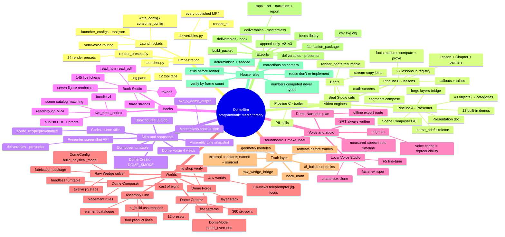
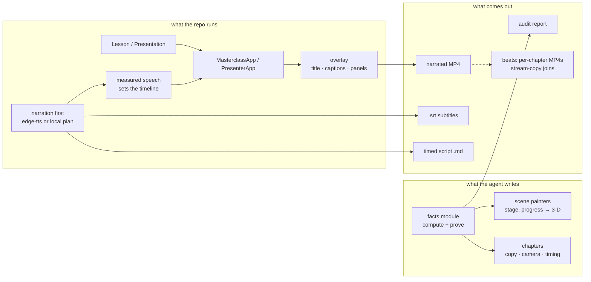

# DomeSim — Agent Utilization Guide: from 3-D worlds to finished books and videos

> A knowledge map of every tool in this repository that contributes to a
> finished **video** or **still/book** project, and the contracts an LLM
> agent must follow to drive them. Companion to `video-engine.md`,
> `authoring-for-llms.md`, `programmatic-video-guide.md` and
> `video-pipeline-reference.md`. Nothing here requires touching the
> interactive tools — everything is reachable through code, launch
> tickets, or the launcher.

---

## 1. The mental model

The repo is a **deterministic media factory**. The core idea, stated in
`docs/video-engine.md`:

> Generative video cannot be asked to be *correct*. This engine can:
> every number on screen is computed by a function that also proves
> itself, and every frame is a pure function of `(stage, progress)`.

There are **three separate video pipelines** that share a house style
(1920x1080, 30 fps, libx264 CRF 18, `+faststart`, an `.srt` sidecar) but
no code:

| Pipeline | Entry point | Picture comes from | Use for |
|---|---|---|---|
| **A — Presenter** | `presenter_studio.py` | Live OpenGL 3-D, one `Presentation` document | Everything; the general engine |
| **B — Masterclass lessons** | `two_v_demo/app.py` → `export_video()` | Live OpenGL 3-D, one `Lesson` per subject | Teaching films, montages, drama |
| **C — Slideshow trailer** | `deliverables/launcher_trailer/build_launcher_trailer.py` | Still PNGs drawn with PIL | Title cards over pre-made renders |

Around them sit the **media support tools**: book pipelines (Book Studio,
`two_trees_codex`), voice tooling (edge-tts, Local Voice Studio), beat
tooling (`beats.py`, Beat Studio), and the interactive **3-D worlds** that
supply geometry, meshes, stills and numbers to everything else.

Every tool is configured through the **launcher** (`launcher.py`), which
writes a one-shot JSON *launch ticket*; no tool parses command-line flags
anymore.

---

## 2. Orchestration: launcher, tickets, presets

### 2.1 Launch tickets (`launcher_common.py`)

```python
import launcher_common as lc
lc.write_config("tool_name", {"action": "shots", "shots": "4,20,38"})
# then run the tool's script with NO arguments; it consumes and deletes the ticket
```

* Ticket files live in `.launcher_configs/<tool>.json`, written by
  `write_config()`, read-and-deleted by `consume_config()` at tool start.
* `python_for(tool)` routes **Local Voice Studio** to `.venv-voice`
  automatically when that venv exists.
* Running a tool directly with no ticket falls back to its plain
  fullscreen default — the scripts stay runnable on their own.

The launcher has 12 tabs: **Dome Creator, Dome Forge, Assembly Line,
Assembly Line (Simple), Presenter Studio, Masterclass, Local Voice
Studio, Dome Composer, Raw Wedge Dome, Beat Studio, Flatten Utility,
Book: 2 Trees** (plus the Codex book tab via `launcher_two_trees_codex.py`).

### 2.2 Action vocabulary (per tool ticket)

| Tool ticket | Script | Actions (and notable keys) |
|---|---|---|
| `two_v_masterclass` | `two_v_masterclass.py` | run · selftest · report · shots · export_video · voice_preview · list_voices · narration_only · script · build_packet · list_lessons · list_deliverables · list_segments · soundboard · render_all · render_beats — keys: `lesson, size, fps, voice, voice_rate, voice_pitch, voice_volume, voice_locale, no_narration, compose_segments, segments_include/exclude, local_narration_plan, ffmpeg, ffprobe, render_fps, video_encoder, video_preset, beats_dir, beats_only, force_rerender, no_join, render_only` |
| `presenter` | `presenter_studio.py` | run · compose · shots · export · export_all · selftest · save_json — keys: `demo, script, prompt, environment, focus, size, fps, overlay, no_narration, export_dir, demos, export, shots, save_json, fullscreen` |
| `dome_forge` | `dome_forge.py` | run · selftest · shots — keys: `size, fullscreen, start, preset, shot_dir` |
| `assembly_line` / `assembly_line_simple` | `assembly_line.py` / `assembly_line_simple.py` | run · selftest · shots — keys: `windowed, shots, shot_dir, shot_speed, shot_panel, seed` |
| `dome_composer` | `dome_composer.py` | run · shots · report · selftest — keys: `set_id, start, load, shots_dir, size` |
| `raw_wedge_dome` | `geodesic_raw_wedge_dome_dihedral.py` | run · validate · fabrication · extract_resources — geometry keys: `wedge_orientation, trunk_diameter_in, radial_splits, long_edge_in, seam_join_mode, spacer_mode, jig_enabled, jig_stage, head_overfit_in, jig_butt_hangoff_in, panel_explode_in, skin_enabled, window_width/height` |
| `local_voice_studio` | `local_voice_studio.py` | run · selftest · diagnose · rap_analyze · rap_preview · rap_produce · rap_selftest — keys: `project`, rap keys |
| `book_studio` | `book_studio.py` | studio · read_html · read_pdf · outline · audit · progress · scaffold · render_figures · export · selftest — keys: `manuscript_dir, export_dir, chapter, strict` |
| `dome_creator` | `dome_creator.py` | (no action field — windowed app; smoke stills via env, §5) |
| `beat_studio` | `beat_studio.py` | (windowed) — keys: `lesson, beats_dir` |
| `flatten` | `flatten.py` | (windowed) — key: `output` |

### 2.3 Render presets (`render_presets.py`)

Twenty-four `RenderPreset` entries (including the `custom` placeholder) encode the **exact field values**
(lesson, action, size, fps, voice, rate, pitch, volume, segment choices)
that produced every published video. The Masterclass tab fills its fields
from a preset dropdown; `validate_render_presets()` (run by the launcher
smoke test) asserts every preset names a real lesson/action and that every
deliverable has a preset. Voice settings are part of the preset because
**chapter durations are measured off synthesized speech**.

`deliverables.py` lists every published MP4 with its lesson key;
`render_all` rebuilds them sequentially (parallelism thrashes the speech
endpoint and buys nothing — speech is endpoint-bound, render is GPU-bound).

---

## 3. The video engines

### 3.1 Pipeline B — the Masterclass lesson engine (`two_v_demo/`)

A `Lesson` binds **copy to painters**; it carries no logic.

```python
Chapter("slug", "01", "Title", "One-line promise",
        ("spoken narration lines",),
        ("fixed equation lines",), 12.0,        # duration FLOOR
        (34.0, 24.0, 16.0),                      # camera yaw°, pitch°, distance
        "scene_stage_key", None,                 # optional overlay: hype/teaching/math
        callouts=(...))                          # voice-timed computed figures
```

* **Scene painter** signature: `def scene(app, opaque, transparent, p)` —
  `p` runs 0→1 across the chapter; **every frame is a pure function of p**.
  Draw with `TriangleBatch` helpers (`cylinder, box, sphere, triangle,
  cone, arrow, disc` — `cylinder(a,b,r,c,3)` is a wedge, `4` square,
  `14+` round); add text with `app.world_labels.append(WorldLabel(...))`.
* **Reusable higher-level kit**: `figure.py` (articulated human),
  `timber.py` (procedural wood), `render_kit.py` (colours, easing),
  `visual_objects.py` + `icons.py` + `lexicon*.py` (named drawings with
  knobs, pictograms, term catalogue).
* **Styles**: `teaching` (headline + card + timeline), `hype`
  (full-frame montage, one line of type), per-chapter `overlay="math"`
  (live picture left + worksheet derivation right, conclusion band).
* **Narration-first timing**: audio is synthesized **before** any frame;
  each chapter's duration = `max(floor, delay + speech + tail)` — pipeline
  B uses `SPEECH_DELAY = 0.55` / `TAIL_PADDING = 0.85`
  (`two_v_demo/audio.py`), the Presenter uses `0.45` / `0.75`
  (`presenter/narrate.py`); captions re-split on sentence boundaries;
  callouts are cued by the measured voice (`chapter_NN.boundaries.jsonl`
  sentence timings, with a character-share fallback). Pipeline B's
  functions are `synthesize_narration` / `_build_mixed_track` +
  `narration.py`'s `subtitle_file` / `write_companion_files`; pipeline A's
  equivalents are `narrate.prepare_narration` / `stretch_durations` /
  `build_track` / `write_srt` — same jobs, different names.
* **27 lessons** live in `lesson_registry.py` (`2v, build, hex, zome,
  line, cuts, franken, hype…hype6, kick, kick2, master, world,
  world_chatgpt, scratch, wedge, why, drama, series, look, harvest,
  why_build, pine_value`), each with a facts module that **computes and
  proves** its figures (e.g. `wedge_geometry.py`, `master_facts.py`,
  `scratch_facts.py`).
* **Segments** (`segments.py`): shared branded pieces — outro, CTAs,
  whoami, party sting — spliced in by `compose()` when
  `compose_segments` is set, so a new film never hand-writes a contact card.
* **Bridging simulator meshes**: `raw_wedge_bridge.py` converts the
  raw-wedge solver's own meshes into lesson geometry
  (`world_batches()`), so films show the real dome, not a sketch.
* `scaffold_lesson.py <key> "Title"` generates a working, self-proving
  facts+lesson pair; the first real work is replacing placeholder facts.

### 3.2 Pipeline A — Presenter Studio (`presenter/`, `presentations/`)

A `Presentation` is **pure data** — the thing an LLM writes.

```
Presentation(title, author, scenes, fps, size, voice, voice_rate)
 └ Scene(slug, title, environment, shots, world)        # free-text env prompt
    └ Shot(slug, duration, lens, perspective, focus, orbit, dolly, yaw,
           pitch, height_bias, narration, caption, panel, actions, xray)
       └ OverlayPanel(title, bullets, equations, stats, position, anchor)
```

* **Lenses**: macro 21° · portrait 34° · wide 58° · ultrawide 92°.
* **Perspectives 1–6**: 1 one-point, 2 two-point, 3 free, 4 cylindrical
  panorama, 5 fisheye, 6 full 360 (modes 4–6 render six cube faces).
* **Animation = interpolate one parameter**:
  `actions=(("wheelchair", "progress", 0.0, 0.30),)`; the camera follows
  any moving named **focus target** for free.
* **43 placeable objects** in `presenter/library.py` (dome, shell layers,
  solar, door, windows, kitchen, loft, stove, tanks, heat pump, deck,
  rain catchment, wheelchair, diagrams…), each with a labelled `ParamSpec`;
  print the live catalogue:
  ```bash
  python -c "import sys;sys.path.insert(0,'.');from presenter.library import OBJECT_SPECS;[print(s.key,[p.key for p in s.params]) for s in OBJECT_SPECS]"
  ```
* **Dome Forge bridge**: every Dome Forge layer is available as
  `forge:<layer>` in the stage, so a film showing the water-harvesting
  dome shows the real modelled dome.
* **13 built-in demos** in `presentations/` (`airflow`, `accessibility`,
  `housing_case`, ten `case_*`); all numbers computed once in
  `presentations/_numbers.py` from `al_build` / `two_v_demo.geometry`.
* **Scene Composer** (`presenter/studio.py`): a real editing suite —
  library / viewport / timeline / inspector — over the pure-functional
  edit API in `presenter/edit.py`; saves and reopens movies as JSON.
* **Prompt scaffolding**: `parse_brief("seven scenes each of three
  shots, a close up, macro and ultra wide shot of elements 1, 2 and 3")`
  drafts a skeleton `Presentation`; `parse_environment("on a beach at
  dusk")` composes terrain/water/sky from 15 regex rules. It is a small
  regex parser, not an LLM — treat its output as scaffolding to edit.

### 3.3 Beats — chapter-scale renders (`two_v_demo/beats.py`)

A long film is divided into **beats** (a chapter or a small group that
only makes sense together — "a claim and the math screen that proves it
are one beat"). `render_beats`:

* skips beats already on disk (**resumable**),
* re-aims a **single GL context** at each sub-lesson (`app.retarget`),
* writes each beat's MP4 + narration + `.srt` + voice cache,
* then **joins** sections and the whole film by stream copy
  (`concat`) — fixing one chapter costs one beat re-render, not 90 minutes.

Layout: `beats/<lesson>/<section>/<beat>.mp4`,
`sections/<section>.mp4`, `<lesson>-full-from-beats.mp4`, `manifest.json`,
and hand-built `cuts/`. **Beat Studio** (`beat_studio.py` →
`two_v_demo/beat_studio_app.py`) is the GUI bench: it populates from
`beats/` on open, reorders, slices at timestamps, builds, and saves cuts
as plain JSON compositions.

---

## 4. The 3-D worlds and how to control their scenes

Every interactive world runs on the same backend: **pygame + moderngl
(OpenGL 3.3 core, GLSL `#version 330`) + numpy**. Two meanings of
"headless" matter for an agent:

1. **Pure model/solver/export paths** (no GL at all): `dome_model` stats
   and BOM, `al_build` economics, the raw-wedge `--validate` /
   `--fabrication` exporters, `dome_forge` selftest, `presenter.world.
   build_frame` / `camera.shot_camera` CPU math. These write CSV / SVG /
   OBJ / JSON / text.
2. **Hidden-GL stills** (still need a working OpenGL 3.3 driver, no
   visible window): `hidden=True` pygame window or
   `moderngl.create_standalone_context()`, then `render(present=False)`
   + `capture()`/`screenshot()`. A software/dummy video driver cannot
   render OpenGL.

The canonical in-repo still-capture pattern is
`two_trees_codex/scene_stills.py:209-237`: build the app `hidden=True`,
`render(present=False)`, `save_screenshot(path)`, and write a
`provenance.json` beside the PNG.

### 4.1 Dome Creator (`dome_creator.py` + `dome_model.py` + `presets.py` + `materials.py`)

The walkable site simulator (RuneScape-style). Programmatic control:

```python
from dome_model import DomeModel, DomeConfig
model = DomeModel()
model.config.panel_overrides[model.panels[0].key] = "Glass Window"
model.rebuild()
print(model.bom_text())
```

* `DomeConfig` dataclass — frequency, radius, strut shape/frame
  material/colour/width, frame style (`Hub & Strut` | `Hubless
  Doubled`), hub style, `default_panel`, `recess_pct`, 3 cladding
  `layers`, foundation, `panel_overrides: dict[str, str]`, 10 room
  `sections`, partitions, `props` (list of dicts), `inventory`.
  `to_dict()`/`from_dict()` serialize names, not indices.
* `panel_overrides` keys are unit-sphere **face centroids**
  (`f"{x:.3f},{y:.3f},{z:.3f}"`) — discover with `model.panels[i].key`;
  helpers `set_panel`, `set_all_panels`, `cycle_panel`, `panel_at`,
  `pick_panel`.
* Presets: `presets.PRESETS` (12 × `(name, config_dict)`) applied as
  `DomeModel(DomeConfig.from_dict(PRESETS[i][1]))`; `presets.SECOND_DOME`.
* Camera: `PlayerCamera` (position/yaw/pitch/roll), `PTZCamera`
  (pan/tilt/fov), orbit rig floats `orbit_yaw/orbit_pitch/orbit_dist`;
  the 360° six-point panorama composites six cube faces in
  `render_six_point()`.
* `materials.py` — every physical constant; `workshop.py` — fit-out and
  the ~39-prop library; `vision.py` — synthetic PTZ object detection;
  `electrical.py` — live battery/solar sim; `overlay_ui.py` — HUD
  widgets; `compare_buildings.py` — reference rectangle buildings from
  the shared `al_build` rate model.
* Persistence: `dome_demo.sqlite3` holds only free-text investor notes;
  design state is JSON (`dome_design.json`), BOM export → `dome_bom.txt`.
* **No headless mode** — the app always opens a fullscreen GL window.
  The only scripted still path is the smoke test: env `DOME_SMOKE=<n>`
  (+ optional `DOME_SHOT_DIR=<dir>`) writes `smoke_<NNN>.png` at a
  hard-coded frame list while driving the model programmatically
  (`_smoke_step()` mutates frequency, frame style, layers, sections,
  props, presets, camera).

### 4.2 Dome Forge (`dome_forge/`)

A single dome made of **layers** (ground pad, hubless triangle frames,
strut frame, hubs, dished panels, micro-drains, seam veins, animated
water, runoff, shell surface, collector ring, downpipe, cistern, rain).

* `layers.py` — `LayerStack` (JSON schema 3, `add/remove/duplicate/move`,
  per-layer opacity/order/params), `default_stack()`,
  `split_log_stack()`; per-triangle `Assignments` fill + per-edge strut
  (18 strut profiles, 19 fills); rolling about axis.
* `build.py` — **`build_scene(stack, t) -> (opaque, translucent)`**
  iterates the visible layers through `EMITTERS` (16 keys: `ground,
  frame, triangle_frames, assemblies, waist_joints, hubs, panels,
  micro_drains, veins, vein_water, panel_runoff, shell, collector_ring,
  downpipe, cistern, rain`); the water animation is pure
  time-parameterization (`phase = (t*speed + rnd) % 1.0`), no
  integrator — a still at any `t` is deterministic. `pick_face`,
  `scene_stats`, seeded `rnd(i, salt)`.
* `jigs.py` — the two-jig shop whose figures are re-measured off the
  assembled 3-D faces by `verify()` (selftest raises on disagreement).
* `patterns.py` — flat developments (strips/fans/darts) that nest on
  sheets and export to print.
* Headless stills — the cleanest programmatic example in the repo:

```python
from dome_forge.app import DomeForgeApp
from dome_forge.layers import LayerStack, default_stack
app = DomeForgeApp(size=(1600, 900), hidden=True)
app.stack = default_stack()
app.yaw, app.pitch, app.distance = 38.0, 22.0, 15.0
app.stack.settings.cut_enabled = False
app.clock_t = 0.0
app.capture(out / "exterior.png")
```

(launcher `shots` action renders exactly this: exterior, cutaway, top,
ground → `dome_forge_shots/`).

### 4.3 Raw Wedge Dome (`geodesic_raw_wedge_dome_dihedral.py`)

One self-contained file: the solver *and* the world for the log-wedge
dome and its twelve-step jig.

* **Solver**: `DomeConfig` (`long_edge_in=72.0`, `trunk_diameter_in`,
  `radial_splits`, `wedge_orientation`, `spacer_mode` rigid|hose|none,
  `seam_join_mode` raw_trapezoid|shaved_flat, `panel_explode_in`,
  `head_overfit_in`, `jig_butt_hangoff_in`, jig dims) →
  `build_2v_hemisphere(long_edge_in)` → `build_physical_model(config)`
  → `validate_physical_model()` (26 vertices / 40 faces / 65 edges /
  120 members / 55 seams). The **four orientations** are
  `point_dome_in, point_panel_in, point_dome_out, point_panel_out`
  (0/90/180/270° about the member axis). The solver raises on invalid
  geometry.
* **Jig stages**: `JIG_STAGES` = 12 `(slug, headline, look, enforces)`
  tuples — `bench, triangle, rails, fences, guides, buttcut, member1,
  member2, member3, closed, flush, panel` — each rendered by
  `build_fabrication_jig(model, panel_index, stage)`.
* **Exports** (headless, no GL): `export_fabrication_package()` writes the
  full shop package — `DOME_BOM.csv`, `ALL_MEMBER_CUT_SCHEDULE.csv`,
  `SEAM_JOIN_SCHEDULE.csv`, `JIG_CUT_SEQUENCE.csv`,
  `BUTT_CUT_SETUPS.csv`, `JIG_WALKTHROUGH.csv`, `panel_jig_svgs/*.svg`,
  `jig_variant_objs/*.obj` — into `fabrication_package/`. Direct CLI
  still works: `--validate`, `--fabrication`, `--extract-resources`.
* **World**: `DomeWorldApp` — `U` cycles orientations, `4` head
  long/flush, `7`/`8` allowance, `9`/`0` walk the jig's twelve steps,
  `L` flies to dynamically-computed jig stations (whole jig + corner
  joints), `F12` screenshots to `exports/dome_screenshot.png`, `E`
  exports OBJ/config. **Raster stills are not headless** — the world
  needs a live GL window; for pixels without GL, export
  `build_world_meshes(model)` (CPU mesh batches) to OBJ.
* `geodesic_raw_wedge_dome_single.py` is the flattened single-file
  edition (same API; the dihedral file adds `seam_join_mode` and the
  sacrificial butt hang-off).
* This file is the geometry **source of truth** for the wedge lessons and
  the book: `two_v_demo/raw_wedge_bridge.py` converts its meshes, and
  `two_v_demo/book_figures.py` renders its named views.

### 4.4 Assembly Line (`assembly_line.py` + `al_build.py` + `site_shed.py`)

The 15-station factory with real per-element economics. Every strut,
pipe, panel and fixture carries material cost + install-labour time;
workers fetch parts at a real stride; dollars and steps accrue live.

* `al_build.py` — editable `ASSUMPTIONS` dict (wages, workers, stride,
  capex, overhead, pricing, BHPH financing, benchmark, QC/yield);
  `random_spec(serial, rng=None)` — **pass a seeded
  `random.Random(seed)`**, the `serial` alone does not seed; the element
  catalogue (`Element` with `weight`, `labor_min`, `centroid`,
  `floor_point`, `material_cost` — the exact interface
  `two_v_demo/energetics.py` costs) via `build_dome_catalog(spec)`;
  `building_comparisons()` for the shed/home benchmarks. Four product
  lines: Dome Home, Storage Shed, Greenhouse, Storm Shelter.
* `site_shed.py` — the independent sub-$10k gable-shed benchmark.
* Persistence: `dome_yard.sqlite3` (`YardDB` with `add`, `mark_sold`,
  `all`, `summary`, `sales_summary`; idempotent column-by-column
  migration; env `AL_DB` overrides).
* Camera modes are four booleans on the app: `follow`,
  `force_cutaway` (shader clip plane), `xray` (translucent shell),
  `cinematic` (auto-orbit); manual orbit via
  `cam_yaw/cam_pitch/cam_dist/cam_target`.
* Still capture: `AssemblyLineApp(headless=True, seed=42)` +
  `render_shots(times, dir)` → `shot_<t:07.1f}s.png` (standalone GL
  context); live `K` → `snapshot()` → `snapshots/dome_<ts>.png`
  (`SNAPSHOT_DIR` env).

### 4.5 Dome Composer (`dome_composer.py` + `two_v_demo/scene_composer.py` + `composer_app.py` + `dome_interiors.py` + `glam_*.py`)

The furnished-room editor and the cast. The **pure rule engine** is GL-free:
`Placement(kind="PROP"|"CAST", ref, x, y, yaw_deg, lift_m, mode, pose_key,
hair_style)` → `check(scene, placement) -> Verdict(ok, reasons,
clearance_m)` applies shell headroom against the *faceted* hemisphere
(`shell_clearance` ray-casts the actual triangles), the wall band,
walk-under clearance, seated-pose seat matching, SAT collision, piece and
floor-share caps — every refusal explains itself. `Scene` serializes as
`domesim.scene/1` JSON; `starter_scene("DOME_HOME"|"DOME_STORE")` builds
furnished scenes as `Placement` literals; `Composer` is the undo/redo
state machine over them. Two sets, ~45 props (`dome_interiors.PROPS`,
`draw_prop`), eight women (`glam_cast.GLAM_CAST`), hair as strands
(`glam_hair.HAIR_STYLES`), clothes lofted from the body's rings
(`glam_wardrobe.OUTFITS`), assembled by **`glam_figure.draw_look(opaque,
look, ...) -> joints`** — the one call that draws a woman. Stills:
`ComposerApp(scene=..., hidden=True).turntable(dir, frames=4)` writes
`{scene}_{i:02d}.png` at 90° yaw steps (CLI `--shots <dir>`);
`screenshot(path)` for one. The `look` lesson plays the whole stack
through the ordinary Masterclass pipeline, and its selftest runs the
entire cast/body/hair/wardrobe stack.

### 4.6 Auxiliary worlds

* `geodesic_2v_114_views.py` — a 114-view atlas (19 pages × 6
  projection/perspective styles) that solves the ring geometry with a
  finite-difference Newton solver so every short edge is exactly
  63.625 in and every long 72 in. `S` saves the current view or page as
  PNG (windowed only).
* `geodesic_wedge_teleprompter.py` — tkinter 5-line teleprompter for
  live presentations (script embedded as a string). No exports.
* `jig_focus_world.py` — launches the raw-wedge engine straight into a
  jig-centric solo-panel view (`JigFocusWorldApp(DomeWorldApp)`, extra
  focus-view shortcuts).
* `flatten.py` — flattens the whole project into one uploadable file for
  LLM context (`dome_flat.md`), with a TOC and per-file markers.

---

## 5. Rendering stills — every mechanism

| Source | Recipe | Output |
|---|---|---|
| **Masterclass lesson** | ticket `two_v_masterclass` `{action:"shots", shots:"8,24,40", lesson:"look"}` or `app.render_shots(times, out)` | `two_v_demo_output/<lesson>/<snapshot_prefix>_<t:07.2f>s.png` |
| **Masterclass contact sheets** | presets `look_stills`, `master_stills`, `scratch_stills`, `world_stills` (batches of individual PNGs) | same dir |
| **Presenter** | ticket `presenter` `{action:"shots", shots:"4,20"}`; programmatic: `app.render(t, present=False); app.screenshot(path)` | `deliverables/presenter/shot_<t>s.png` |
| **Presenter per-scene** | `PresenterApp(pres, headless=True).screenshot("check.png")` | anywhere |
| **Dome Forge** | ticket `dome_forge` `{action:"shots"}` or `DomeForgeApp(hidden=True)` + `capture()` (set `app.yaw/pitch/distance`, `app.clock_t`, cutaway) | `dome_forge_shots/` (exterior, cutaway, top, ground) |
| **Dome Creator** | env `DOME_SMOKE=<n>` + `DOME_SHOT_DIR=<dir>` smoke test only — no stills action | `<dir>/smoke_<fff>.png` |
| **Assembly Line** | ticket `assembly_line` `{action:"shots", shots:"74,97", shot_speed:6, shot_panel:"throughput", seed:42}` or `AssemblyLineApp(headless=True, seed=42).render_shots(times, dir)`; live `K` snapshot | `shots/shot_<t>s.png`; `snapshots/dome_<ts>.png` |
| **Dome Composer** | ticket `dome_composer` `{action:"shots", shots_dir:...}` → `ComposerApp(..., hidden=True).turntable(dir, frames=4)` | 4 PNGs `{scene}_{i:02d}.png` |
| **Raw wedge** | no headless stills — `F12` interactive screenshot, `E` exports OBJ/config; solver SVG/OBJ exporters need no GL | `exports/dome_screenshot.png`, `fabrication_package/` |
| **Book figures** | `book_figures.py` 7 renderers at 300 dpi (matplotlib; no GL needed except `lesson_still`) | `deliverables/book/figures/*.png`, `*.svg` |
| **Codex book scenes** | `two_trees_codex.scene_stills.render_scene_still(scene, out, progress=0.85, overlay='original')` | stills + `scene_recipe` provenance |
| **Frames from finished MP4s** | `two_trees_codex/video_frames.py` `contact_sheet(results, path)` (ffmpeg + PIL) | JPG contact sheet |
| **Any film frame** | `app.capture_rgb()` after `render(t, present=False)` (flip: GL rows are bottom-up) | raw RGB |

House rule: **stills before video** — look at one per chapter/scene
before exporting; most staging bugs are invisible in code and obvious in
a still. Every pixel-still path above needs a working OpenGL 3.3 driver
(hidden window or standalone context); only the CSV/SVG/OBJ/text exports
are truly displayless.

---

## 6. Exporting and composing into usable media

### 6.1 Video export (pipelines A and B)

1. Synthesize/measure all narration first (edge-tts, cached per
   `voice|rate|pitch|volume|text` — pipeline B under
   `<stem>-voice-<slug>/chapter_NN.mp3` (+ `.boundaries.jsonl`), the
   Presenter under `<stem>-voice/seg-NN-<hash>.mp3`); or hand it a
   **local narration plan** (`local_narration_plan`).
2. Rebuild the timeline from measured speech — pipeline B:
   `duration = max(floor, 0.55 + speech + 0.85)`, Presenter:
   `max(floor, 0.45 + speech + 0.75)`.
3. Mix the clips into one AAC track (`-narration.m4a`) — pipeline B uses
   `adelay`/`loudnorm` when the ffmpeg build has them (timed-PCM
   assembly otherwise); the Presenter mixes decoded PCM in numpy and
   uses **no ffmpeg filters at all**. Both keep ancient ffmpeg builds
   working.
4. Pipe every frame `rgb24` into ffmpeg
   (`-vf vflip -c:v libx264 -preset medium -crf 18 -pix_fmt yuv420p
   -movflags +faststart`), mux audio by **stream copy** (`-shortest`).
5. Always write `.srt` and the timed script (`-narration.md`);
   `Action = selftest` also writes a **report** (audit of computed vs
   borrowed figures).
6. Verify the result with `py -3.12 verify_renders.py <mp4>` — it fails
   when `|video − audio| ≥ 2 s`, the frame count is under ~29 fps, or
   the duration is zero (frame-count verification is the house check;
   see `authoring-for-llms.md` §7).

Encode options: `video_encoder=libx264|h264_nvenc`, `video_preset`,
`render_fps`, `size`, `fps`. **Append-only**: `next_version_path()`
forces `-v2/-v3`; never overwrite a finished render.

### 6.2 Composition

* **Segments** — `compose_segments` + `segments_include/exclude` splice
  branded outros/CTAs/stings with renumbering.
* **Beats** — per-chapter MP4s joined by stream copy into sections and
  full films; hand cuts assembled in Beat Studio as JSON.
* **Presenter `export_all`** — every built-in demo, one MP4 each.
* **Overlay level** — `full` / `no_captions` / `titles_only` / `clean`;
  the voice and `.srt` are unaffected, so caption-free renders stay
  subtitleable.
* **Localization** — the house voice
  `en-US-AndrewMultilingualNeural` speaks all ten target languages;
  CJK burned-in text needs a per-language font map (see
  `docs/video-pipeline-reference.md` §7). Numbers stay in `_numbers.py`;
  only words live in a per-language catalog.

### 6.3 Books

**Book Studio** (`book_studio.py` → `two_v_demo/book_app.py`,
manuscript in `book/manuscript/`):

* Writing = plain Markdown chapters using `{{token}}` live figures
  (145 of them from `book_tokens.py`); a misspelt token stops the export.
* The Numbers tab lists every token and drops one into the text.
* Three strands (story / howto / explain / reference) with
  auto-synced chapter numbers (`sync_filenames()`, `BOOK.by_ref()`).
* `read_html` / `read_pdf` / `export` actions produce
  `deliverables/book/2-trees.{md,html,pdf}` — all from one function
  (`book_export.book_html`), so screen and paper cannot differ — plus
  65 figures from seven renderers (`raw_wedge_world`, `raw_wedge_jig`,
  `panel_jig_svg`, `book_plot`, `book_diagram`, `lesson_still`,
  `photo_slot`). Append-only as everywhere.

**two_trees_codex** (the parallel, agent-built edition — starts via
`Start-2-Trees-Codex.cmd` or `python -m two_trees_codex.app`):

* Tk "book desk" over `workspace/project.json` (+ timestamped history
  snapshots), bundle schema `two-trees-book/v1`.
* **Scenes** tab matches chapters to existing lesson scenes (lexical
  evidence scores), then **Render & attach** captures stills with a
  `scene_recipe` (lesson key, chapter slug, progress, camera, overlay)
  and a source audit (code hashes, model settings).
* `publish.py` → dated **PDF + page proofs** (ReportLab/pypdf/
  pypdfium2) and a silent **readthrough MP4** (dwell =
  `max(6 s, words/130 wpm)`; `--fps 1` for static pages) with a
  transcript and JSON chapter timings.

---

## 7. Voice and audio

* **edge-tts** (default): the network service behind
  `two_v_demo/narration.py` / `presenter/narrate.py`; no API key; the
  `<stem>-voice-*` cache is the reproducibility boundary — ship it to
  reproduce bit-for-bit. Export lessons **one at a time**.
* **Local Voice Studio** (`local_voice_studio/`, `.venv-voice`, Python
  3.11): record → curate 24 kHz mono clips → lock a reference profile →
  local Chatterbox Turbo synthesis or faster-whisper transcription;
  F5-TTS dataset export + fine-tune in `.venv-f5`. Every synthetic WAV
  gets a JSON sidecar with model/profile/settings.
* **Dome Narration** tab: generates chapter WAVs, a loudness-normalized
  track, timing JSON and SRT, then passes the **narration plan** to the
  masterclass exporter (`local_narration_plan`) — the fully offline
  route, hardwired to the masterclass pipeline (pipeline B).
* **Soundboard** (`two_v_demo/soundboard.py`): themed repackaging from
  `assets/audio/{drops,stingers,oneshots,beds,loops,voice}` addressed as
  `category/name`; missing sounds are skipped with a warning, never an
  error.
* **Music** (`make_beat.py`): a royalty-free beat bed synthesized from
  arithmetic (decaying-sine kick, filtered-noise snare, noise hat) →
  `assets/audio/beds/frankenbeat.wav`, usable as `beds/frankenbeat`.
  Beds reach films through `Lesson.audio_bed` + `Lesson.audio_bed_gain`
  (the exporter calls `mix_bed_into_track`, which ducks the bed under
  the voice); e.g. `hype6` runs `voice_rate="+18%"` with
  `audio_bed="beds/frankenbeat"`.
* **Rap Studio** (inside Local Voice Studio, `rapkit.py` + beatgrid /
  flow / autotune / mixdown): lyric timing and vocal alignment onto the
  synthesized beat — its own tab with `rap_analyze` / `rap_preview` /
  `rap_produce` ticket actions.

---

## 8. How to instruct an LLM agent

### 8.1 Which contract to hand it

| Agent is asked to make | It writes | It reads first |
|---|---|---|
| A new teaching film | `two_v_demo/<key>_facts.py` + `two_v_demo/lesson_<key>.py` (or `scaffold_lesson.py` first) | `docs/authoring-for-llms.md`, `docs/reference/*.reference.py` |
| A persuasive / explainer film | one `build() -> Presentation` module | `docs/programmatic-video-guide.md` §4 template, the object-catalog dump, the focus-target list |
| A campaign/montage | a lesson with `style="hype"` + segments | `lesson_hype.py` reference |
| A narrative drama | a script JSON for the drama director | `two_v_demo/drama_script.py` |
| A book | `book/manuscript/*.md` with `{{tokens}}` (or Codex pages + scene recipes) | `book/README.md`, the Numbers token list |
| Stills only | ticket files or direct `PresenterApp`/`DomeForgeApp` calls | §5 table |

### 8.2 The non-negotiable rules to state in the prompt

1. **Every number on screen/page is computed by code that also proves
   it.** Borrowed values are named external constants with unit + source,
   printed in the report. Nothing is typed into a caption.
2. **Determinism.** Seed every random generator; frames are pure
   functions of `(stage, progress)` / `t`.
3. **Reuse, don't re-implement.** Reuse `segments.py`, `figure.py`,
   `timber.py`, `visual_objects.py`, the lexicon, the bridges
   (`raw_wedge_bridge.world_batches()`), and the geometry modules —
   check `lexicon.term_map()` before drawing a new thing.
4. **Stills before render.** Render one still per chapter/scene and
   *look at every one*.
5. **Verify by frame count**, not duration
   (`nb_frames ≈ duration × fps`; picture length ≈ audio length).
6. **Append-only output.** Never overwrite a deliverable; new renders
   are `-v2/-v3` (the code enforces it via `next_version_path`).
7. **Corrections are chapters on camera**, not silent re-cuts.
8. **Sequential exports** — never run two voiced exports in parallel.
9. **Camera traps** (from `authoring-for-llms.md` §4): +X is screen
   left at yaw 90; lay rows along X; distance ≈ 2× object size; keep
   the left third clear in `teaching` style; nothing straddles z = 0.
10. **Emit complete files**, not diffs; no imports outside stdlib,
    numpy, or this package.

### 8.3 The authoring loop (hand this to the agent as the plan)

```
scaffold → facts + proofs → painters → chapters → register
→ selftest → stills (LOOK) → export → verify frame count → deliverables.py
```

For Presenter work: pin numbers from `_numbers.py` → write beats →
map beats to scenes (stage/camera/animation/caption/panel/narration) →
emit `build()` → `validate()` → stills → export. A concrete prompt
template ships in `docs/programmatic-video-guide.md` §4.

---

## 9. The knowledge graph



### 9.1 The video processing chain



### 9.2 The book chain

```mermaid
flowchart LR
    MS[book/manuscript<br/>Markdown with {{tokens}}] --> TK[book_tokens<br/>145 live figures]
    MATH[book_math<br/>both sizing methods] --> TK
    MATH --> PLOTS[book_plots<br/>tables + charts]
    DIAG[book_diagrams<br/>line drawings] --> EXP
    PLOTS --> EXP[book_export<br/>HTML · PDF · MD]
    TK --> EXP
    SOLVER[raw wedge solver<br/>meshes via bridge] --> FIG[book_figures<br/>7 renderers · 300 dpi]
    FIG --> EXP
    EXP --> OUT[deliverables/book<br/>append-only]
    LES[existing lesson scenes] --> CS[two_trees_codex scene_stills<br/>recipe + provenance]
    CS --> PUB[publish.py<br/>PDF + proofs + readthrough MP4]
```

### 9.3 The agent loop

```mermaid
flowchart TD
    W[write facts + painters + chapters<br/>or a build() Presentation] --> V[validate / selftest<br/>proofs run before any frame]
    V --> ST[render stills<br/>one per chapter or scene]
    ST --> LOOK{look at every one}
    LOOK -- fixes needed --> W
    LOOK -- good --> E[export<br/>narration → timeline → GL frames → ffmpeg]
    E --> FC[verify frame count<br/>nb_frames ≈ duration × fps]
    FC --> D[register in deliverables.py<br/>add render preset]
    D --> DONE[ship MP4 + SRT + script + report<br/>or PDF + proofs]
```

---

## 10. Cheat sheet — the ten commands an agent will actually run

```powershell
py -3.12 launcher.py                                  # everything, GUI-first
py -3.12 scaffold_lesson.py mysubject "My Subject Masterclass"

# headless actions via tickets (no GUI needed):
py -3.12 -c "import launcher_common as lc; lc.write_config('two_v_masterclass', {'action':'selftest','lesson':'wedge'})"
py -3.12 two_v_masterclass.py
py -3.12 -c "import launcher_common as lc; lc.write_config('two_v_masterclass', {'action':'shots','lesson':'look','shots':'8,24,40','no_narration':True})"
py -3.12 two_v_masterclass.py
py -3.12 -c "import launcher_common as lc; lc.write_config('two_v_masterclass', {'action':'export_video','lesson':'wedge','export_video':'exports/mine/wedge-check.mp4'})"
py -3.12 two_v_masterclass.py
py -3.12 -c "import launcher_common as lc; lc.write_config('presenter', {'action':'shots','demo':'dome_accessibility','shots':'4,20,38'})"
py -3.12 presenter_studio.py
py -3.12 -c "import launcher_common as lc; lc.write_config('dome_forge', {'action':'shots'})"
py -3.12 dome_forge.py
py -3.12 -c "import launcher_common as lc; lc.write_config('book_studio', {'action':'read_html'})"
py -3.12 book_studio.py

# programmatic stills:
py -3.12 -c "import sys;sys.path.insert(0,'.');from presenter.engine import PresenterApp;from presentations.dome_accessibility import build;p=build();p.validate();PresenterApp(p,headless=True).screenshot('check.png')"
py -3.12 -c "import launcher_common as lc; lc.write_config('assembly_line', {'action':'shots','shots':'74,97','shot_speed':6})"
py -3.12 assembly_line.py
py -3.12 -c "import launcher_common as lc; lc.write_config('dome_composer', {'action':'shots'})"
py -3.12 dome_composer.py

# verify a finished render by frame count:
py -3.12 verify_renders.py deliverables/masterclass/why-wedges-no-sawmill.mp4

# book / codex:
py -3.12 -c "from two_v_demo.book import validate_everything; validate_everything()"
python -m two_trees_codex.scene_catalog --query "eight wedges from each six foot trunk section"
python -m two_trees_codex.publish --readthrough
```
