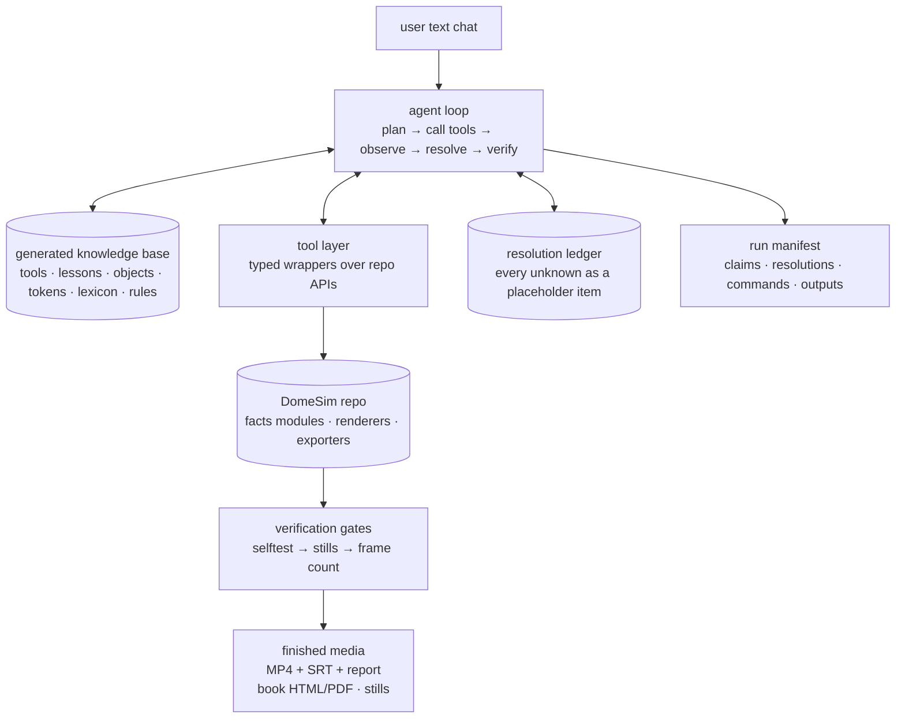

# Project Agent Blueprint — a hyper-specialized media agent for DomeSim

> How to build, from scratch, a small agent that turns plain-text chat
> input (a script, a thesis, a product idea) into this repository's
> finished media — narrated films, stills, and books — by operating the
> existing programmatic tooling, deriving numbers from the existing
> facts modules, and resolving every unknown through an explicit
> placeholder system instead of guessing.
>
> Companion to `agent-utilization-guide.md` (what the tooling does) and
> `docs/authoring-for-llms.md` (the per-artifact contracts). This
> document is the *agent's* design.

> **Status note.** This is the original design document, kept because the
> reasoning in it is still the reasoning the agent runs on. It describes the
> intent, not the current code: the agent was built from this, then hardened,
> and a few contracts moved in the process (backups now live in
> `project_agent/backups/`, launch tickets are locked, paths are confined by a
> single boundary check, registration is structural rather than regex-matched,
> and `py -3.12 -m project_agent selftest` proves all of it).
>
> For what the code actually does today, read **`project-agent-usage.md`** and
> **`../project_agent/README.md`**; where they and this document disagree,
> they are right.

---

## 1. The core insight

Do not train a model on DomeSim. Do not make the agent re-read the
codebase on every request. Build a **narrow orchestrator** whose
intelligence comes from three cheap, explicit things:

1. **A generated knowledge base** — a machine-readable spec of the
   project (tools, actions, objects, tokens, facts modules, lexicon,
   conventions) *dumped from the repo itself* so it can never drift.
   This replaces "massive amounts of inferences on text" with a few
   thousand tokens of ground truth.
2. **A typed tool layer** — ~15 small functions wrapping the repo's real
   programmatic APIs (launch tickets, `render_shots`, `export_video`,
   `screenshot`, book exporters, scene catalog). Each tool has a JSON
   schema and a return contract. The agent's only freedom is *which
   tools to call in which order*.
3. **The repo's own verification machinery as the correctness engine** —
   selftests that prove the numbers, strict token refusal, stills you
   must look at, frame-count verification, append-only outputs. The
   agent does not need to be smart about correctness; it needs to be
   disciplined about running these gates.

The repo already contains a complete worked example of the target
behavior: a prior agent session was handed a pine-value script and
produced `two_v_demo/pine_value_economics.py` (facts + `SOURCES`
provenance table + `validate_pine_value`) and
`two_v_demo/lesson_pine_value.py` (scene painters including the 3-D
value-ladder staircase, chapters, callouts, hype styling). The project
agent is that workflow, industrialized.



---

## 2. Architecture — five components

### 2.1 The knowledge base (what "understanding a limited project set" means)

One `project_spec.yaml` (or JSON), **generated by a sync script, never
hand-written**, assembled from the repo's own dump functions so it
cannot drift from the code:

| Section | Generated by | Contents |
|---|---|---|
| `tools` | `launcher_common` + each `main()` | the ticket tool names, action vocabularies, per-action keys (§2 of the utilization guide) |
| `lessons` | `two_v_demo.lesson_registry.lesson_menu()` | 27 lessons: key, title, chapter count, snapshot prefix, style, voice_rate |
| `presets` | `render_presets.preset_menu()` | 24 reproducible render setups |
| `deliverables` | `deliverables.deliverables_menu()` | every published MP4 + lesson key |
| `presenter_objects` | `presenter.library.OBJECT_SPECS` | 43 objects, 7 categories, per-param `ParamSpec` (min/max/default) |
| `focus_targets` | the `targets` dict names | every name the camera can look at |
| `book_tokens` | `two_v_demo.book_tokens.token_report()` | all 145 `{{tokens}}` with live values and descriptions |
| `figures` | `two_v_demo.book_figures.figure_report()` | the 7 renderers + figure keys |
| `lexicon` | `two_v_demo.lexicon.catalog_markdown()` + `visual_objects.registry()` + `icons.icon_keys()` | every pre-built drawing/pictogram the agent should reuse instead of redrawing |
| `facts` | static list (below) | which module derives what, so the agent knows where numbers come from |
| `stills` | the §5 table of the utilization guide | how to get a PNG from each world |
| `rules` | `CLAUDE.md` + the docs | house rules, camera traps, append-only, verification |

The **facts map** (the "derive and simulate" index) — the agent's first
move on any numeric claim is a lookup here:

| Numbers about | Facts module (compute + prove) |
|---|---|
| 2V geometry, chords, cut list | `two_v_demo.geometry` |
| construction, end cuts, phi amplification | `build_geometry` |
| hex / zome geometry | `hex_geometry`, `zome_geometry` |
| hubless frame, member counts | `hubless_geometry` |
| tree, wedges, pinwheel, board feet | `wedge_geometry`, `wedge_why_facts` |
| dome costing, framing value | `dome_costing`, `franken_economics`, `house_economics` |
| factory economics, labor | `al_build`, `energetics`, `site_shed` |
| pine value ladder | `pine_value_economics` |
| why-build case | `why_build_economics` |
| the book's arithmetic | `two_v_demo.book_math` |
| simulator's solved dome | `geodesic_raw_wedge_dome_dihedral` via `raw_wedge_bridge` |
| world presets' BOMs | `dome_model` / `presets` |
| master presentation figures | `master_facts`, `world_facts`, `scratch_facts` |

The sync command is part of the agent's own toolset (`sync_knowledge`),
so the KB is refreshed on demand and included in the system prompt —
that is the entire "project understanding", and it costs a few thousand
tokens, not a fine-tune.

### 2.2 The tool layer (the hands)

Each tool is a small Python function the agent's runtime exposes as a
function-calling schema. Writes are confined to **authoring paths only**
(`two_v_demo/<key>_facts.py`, `lesson_<key>.py`, `presentations/`,
`book/manuscript/`, `exports/`, a new `project_agent/` package); the
engine code is read-only, and rendered output stays append-only because
the repo enforces it (`next_version_path`).

| Tool | Wraps | Args | Returns |
|---|---|---|---|
| `sync_knowledge` | the dump functions | — | fresh `project_spec` |
| `list_*` (lessons/objects/tokens/lexicon/presets/deliverables) | the menu functions | filter | text listings |
| `query_facts` | any facts module's public functions + `validate_*` | module, fn, args | computed figures (proved) |
| `scaffold_lesson` | `scaffold_lesson.py` | key, title | generated facts+lesson pair |
| `write_file` | stdlib | path (allowlisted), content | written |
| `read_file` | stdlib | path | content |
| `selftest` | `launcher_common.write_config` + spawn | tool, lesson | proof output |
| `render_stills` | ticket `{action:"shots"}` or direct `render_shots`/`screenshot`/`capture` | tool, times, lesson/demo/size | PNG paths |
| `export_video` | ticket `{action:"export_video"}` (+ local narration plan, segments, overlay) | lesson/demo, out, fps, size, voice… | MP4 + companions |
| `render_beats` | ticket `{action:"render_beats"}` | lesson, only | beat MP4s + joins |
| `export_book` | `book_app.run_headless` | action (read_html/read_pdf/export), strict | book files |
| `render_figures` | `book_figures.render_all` | keys | figure PNGs/SVGs |
| `scene_search` | `two_trees_codex.scene_catalog` | query text | chapter↔scene matches + evidence |
| `render_scene_still` | `two_trees_codex.scene_stills.render_scene_still` | scene, progress, overlay | PNG + recipe provenance |
| `declare_constant` | the resolution ledger + `EXTERNAL_CONSTANTS` pattern | name, value, unit, source, status | ledger entry |
| `verify_render` | `verify_renders.py` | mp4 path | frame/audio checks |
| `web_check` | the agent's own web access | query | current market/standard data to *declare* (never to assert silently) |

The tools are the only way the agent touches the repo, which is what
"accurately operate programmatic tool usage" means: no shell
free-for-all, no rewriting the engine, every action observable in the
run manifest.

### 2.3 Claims, gaps, and the resolving system

This is the part the user asked for by name ("finds gaps in
information / knowledge, derives and simulates / uses placeholders where
unknown, easy resolving system"). Model every input as **claims**, and
classify each claim's provenance the way the repo already does:

```
claim            {id, text, kind, source, status}
kind ∈ computed | declared | estimated | placeholder | dropped
status ∈ pending → resolved → verified (by selftest/report)
```

* **computed** — a facts module derives it; the claim is a function
  call, not a number.
* **declared** — an external constant with name + unit + source + date
  (market prices, published standards, the user's own measurements).
  This is the repo's `EXTERNAL_CONSTANTS` / `SOURCES` table pattern,
  and the report prints all of them so the viewer can tell derived from
  borrowed.
* **estimated** — allowed only where the repo's method requires it, and
  labelled on screen as an estimate (the repo already separates
  "measured" from "estimated" tables).
* **placeholder** — genuinely unknown. It is **not guessed**. It
  becomes a `photo_slot`-style marked card in the book, a named
  `UNKNOWN` line in the film's report, a `[?token]` in book preview —
  and a row in the resolution ledger:
  ```
  {id, question, proposal, options: [compute_from_X | ask_user |
   web_check | drop], source, status, injected_into}
  ```
  Resolution is one chat line: `resolve pv-07 cord pickup price = 275
  USD/source: Tuscaloosa listing` — the ledger updates, the constants
  table regenerates, selftest re-runs, and the next export is a new
  append-only version. That is the "easy resolving system": unknowns
  are first-class objects with a command, not silent guesses.
* **dropped** — claims that cannot be sourced are cut, and the drop is
  recorded (the repo's honesty rules already demand this: hedge beats,
  corrections chapters, the "claims this project will not make" list).

Gap-finding is then a mechanical sweep: for every claim, the agent
looks up the facts map; anything not computed and not declared is a gap
and becomes a ledger item before any render starts.

### 2.4 Recipes (the media skills)

The agent doesn't plan media from first principles each time; it
executes one of four fixed recipes, each already proven by the repo:

**Recipe FILM-LESSON** (teaching/argument film):
1. Extract claims + gaps (2.3). Write `_facts.py` (compute + prove) and
   `lesson_<key>.py` (painters → chapters → callouts) —
   `scaffold_lesson` first, then replace placeholders.
2. Register in `lesson_registry.py` (one line).
3. `selftest` → render a still per chapter → **look at each** → fix.
4. `export_video` (voice/rate/size from a preset) → `verify_render`.
5. Add to `deliverables.py` + a `RenderPreset`.

**Recipe FILM-PRESENTER** (persuasive/explainer with moving objects):
1. Pin every number via `query_facts` into a `_numbers.py`-style block.
2. Write beats → map to scenes (stage objects from the catalog, camera
   lens + focus target, one animated parameter, muted-proof caption,
   panel, narration) → emit `build() -> Presentation`.
3. `validate()` → `render_stills` per scene → look → `export_video`.

**Recipe STILLS** (contact sheet / visual check): choose world + times
(§5 stills table) → render → view → done. Also the book's figure
pipeline via `render_figures`.

**Recipe BOOK**: outline → scaffold page plans → write manuscript
`{{tokens}}` only → `unknown_tokens` check → `render_figures` →
`read_html`/`read_pdf` → `validate_everything`.

Each recipe has pre- and post-gates, and every step is a tool call that
lands in the run manifest — so "what did the agent do" is always a
readable file, not a memory.

### 2.5 The loop and the chat surface

```
user text → parse brief (title, thesis, audience, format, claims)
→ load KB → plan (recipe + tool sequence)
→ execute (tools) → observe (outputs, selftest, stills)
→ resolve (any failed gate or ledger item → ask user or web_check)
→ verify (frame count, token strictness) → manifest + deliverable paths
```

Chat UX: every turn ends with (a) what was decided, (b) any resolution
items awaiting the user, (c) the artifacts produced. Two modes:
`chat` (inspect, resolve, ask) and `produce <format> <text>` (run a
recipe end-to-end). The run manifest is the audit log:
```
runs/<ts>-<slug>.json
  brief, claims[], ledger[], tool_calls[], outputs[], gates{pas/fail},
  final files
```

---

## 3. The worked example — your pine script, traced

The repo proves this pipeline end-to-end (`two_v_demo/lesson_pine_value.py`,
`pine_value_economics.py`, `deliverables/masterclass/the-20-dollar-pine-*.md`).
Here is what the project agent does with the pasted pine text:

1. **Brief**: thesis = "a tree's value is where in the conversion chain
   you measure it"; format = film; audience = self-builders.
2. **Claim sweep** (mechanical, from the facts map):
   - 60 ft stem → 37 ft³ solid, 0.35–0.45 cord → **computed**
     (`wedge_geometry`, `pine_value_economics`).
   - 1→2→4→8 splits, 8 × 60 / 6 = **80 blanks** → **computed**.
   - 120-member frame, $4,800 framing value, 6.5 %/30 yr avoided
     payments → **computed** (`dome_costing` / `house_economics`).
   - $17–21/ton Q4 2025, $23.34/ton Q2 2026, USDA 7.5–8.4 BF/ft³,
     Alabama cord 90 ft³ → **declared** externals with source + date.
   - Tuscaloosa $275/$300 per cord → **user-supplied declared
     constant** (the user's local listing — exactly the
     `cord_pickup_usd` / `cord_delivered_usd` `Source(..., AUTHOR)`
     rows that exist in `pine_value_economics.py` today).
   - Anything without a source → ledger item (ask / web_check / drop).
3. **Build**: facts module proves the ladder arithmetic and the
   agreement between methods; the lesson paints the 3-D **value-ladder
   staircase** (`scene_pv_ladder`), the cord visual (`scene_pv_cord`),
   the split sequence, and the mortgage bar — all with
   `{{token}}`-style callouts timed to the narration.
4. **Gates**: `selftest` → stills per chapter → `export_video` →
   `verify_render` → append-only deliverable + preset entry.

The agent's entire added intelligence over a generic LLM is: knowing
*which* facts module owns each number, *which* painter vocabulary draws
each beat, and *which* gate catches which mistake — all of it in the
KB, none of it learned.

---

## 4. Building it — the MVP, in order

A custom Python agent (no framework) is a few hundred lines:

```
project_agent/
  spec.py          # KB dataclasses + sync_knowledge() generator
  tools.py         # the ~15 typed tools (schemas + implementations)
  ledger.py        # claims + resolution ledger (jsonl)
  recipes.py       # FILM-LESSON / FILM-PRESENTER / STILLS / BOOK
  loop.py          # provider function-calling loop + run manifest
  chat.py          # CLI/Tk chat surface (or expose as MCP-style tools)
  runs/            # manifests
```

Order of work:
1. `spec.py` + `sync_knowledge` — the KB is the whole trick; get it
   right first (it is a thin wrapper over the repo's existing menu/dump
   functions listed in §2.1).
2. `tools.py` — wrap the APIs from the utilization guide §5/§6. These
   are all verified and stable; each is ~10–30 lines.
3. `ledger.py` — claims/placeholders; reuse the repo's own provenance
   vocabulary (`Source` tables, `EXTERNAL_CONSTANTS`, report printing).
4. `recipes.py` — encode the four recipes as ordered tool-call plans
   with gates; the recipes *are* the specialization.
5. `loop.py` — the LLM call loop: system prompt = house rules + the KB
   dump + tool schemas; the model's job shrinks to claim extraction,
   recipe selection, and resolution decisions.

Hosting options, cheapest first:
* **Harness mode** — Claude Code / Cursor with `CLAUDE.md` + the docs as
  skills: the repo is already 90 % agent-ready (contracts, scaffold,
  selftests, worked examples). The blueprint's KB + ledger become a
  plugin the harness loads.
* **Custom loop mode** — the `project_agent/` package above with an
  OpenAI/Anthropic-compatible function-calling API. Most control, most
  work.
* **Hybrid** — the custom package exposes its tools as MCP/JSON tools so
  any front-end (this GUI, a chat window, an IDE) can drive them.

Effort for the MVP: the KB and tools are days of work because the repo
does the heavy lifting; the loop and recipes are the same again. The
first vertical slice to prove it: **chat input → `query_facts` +
`render_stills` → viewed stills** — everything else is more of the
same pattern.
