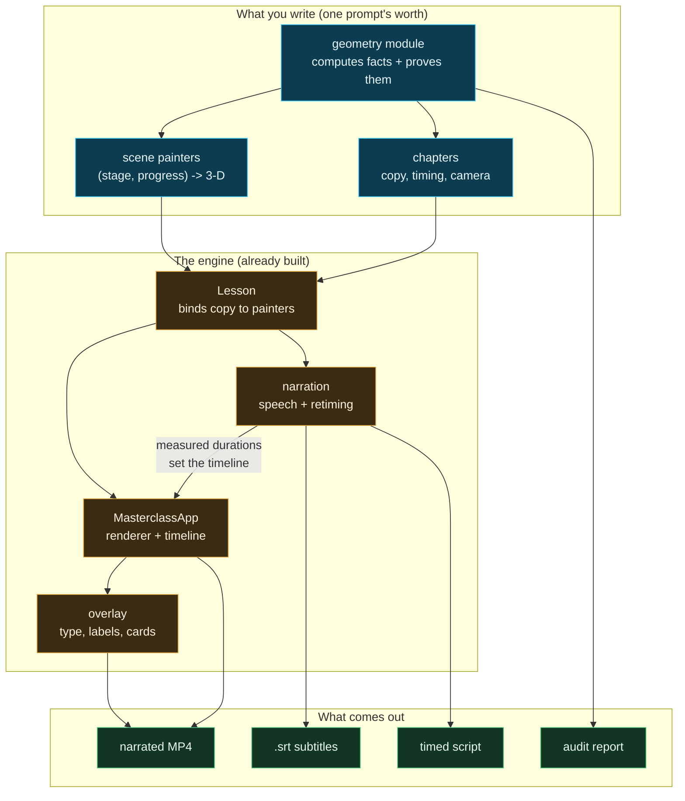
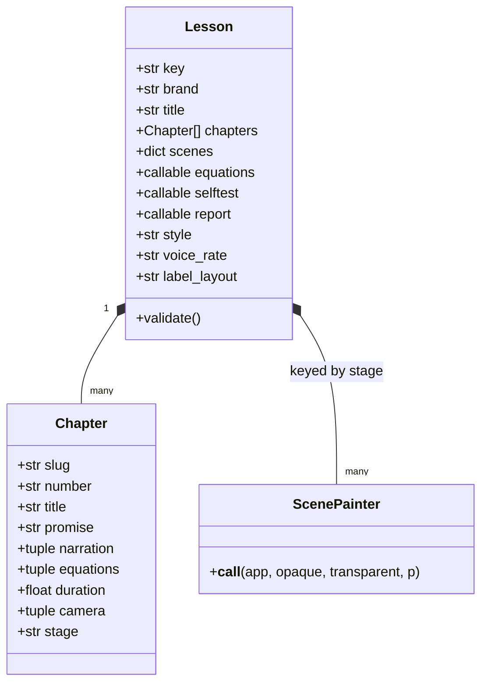
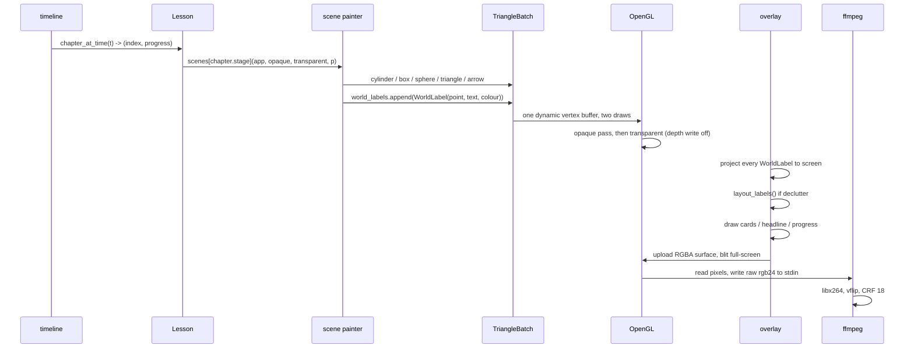
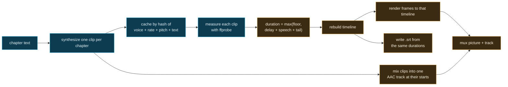
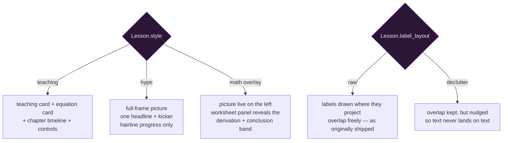
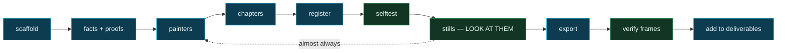

# The teaching-video engine

This started as one lesson about geodesic domes. It is now a general
engine for **programmatic teaching video**: you write a Python module
that computes its own facts and paints its own pictures, and the engine
turns it into a narrated, subtitled, deterministic MP4.

Domes are the first subject, not the point. Nothing in the engine knows
what a dome is.

> **Why programmatic and not generative.** Generative video cannot be
> asked to be *correct*. This engine can: every number on screen is
> computed by a function that also proves itself, and every frame is a
> pure function of `(stage, progress)`, so the same input gives the same
> picture forever. The AI cost is in *writing the module once*, not in
> generating each frame — which is why a whole lesson costs a handful of
> prompts rather than a render farm.

---

## 1. The shape of the thing



---

## 2. What a Lesson is

A `Lesson` is the whole document. It carries no logic — it binds copy to
painters and states its own presentation rules.



**The one rule that makes it work:** `Chapter.stage` is a string, and
`Lesson.scenes[stage]` is the function that paints it. Several chapters
can share a stage and differ only in words and camera. That is how a
36-beat montage runs on 20 painters.

`duration` is a **floor**, not a duration. Measured speech stretches it.

---

## 3. One frame, start to finish



Every frame is a pure function of `t`. Nothing accumulates between
frames, which is why the render is deterministic and why you can render
a still at any moment without playing up to it.

---

## 4. The drawing kit

Scene painters never touch OpenGL. They append to a `TriangleBatch`,
which is a plain list of vertices. `render_kit.py` gives you:

| Call | Makes |
|---|---|
| `cylinder(a, b, r, colour, segments)` | a rod between two points — `segments=3` is a wedge, `4` square, `14+` round |
| `box(centre, size, colour)` | an axis-aligned block |
| `sphere(centre, r, colour, rings, sides)` | a ball |
| `triangle(a, b, c, colour, normal)` | one face |
| `cone(base, tip, r, colour, segments)` | a taper |
| `arrow(from, to, r, colour)` | rod plus cone |
| `disc(centre, r, colour, segments)` | a flat circle |

Two batches per frame: **opaque** and **transparent**. Transparent draws
second with depth-write off, so alpha shells never occlude each other.

Text on screen comes from one call:

```python
app.world_labels.append(WorldLabel(point_3d, "TWO LINES\nOF TEXT", (r, g, b)))
```

The overlay projects the 3-D point to the screen and draws a panel there.
That is the whole mechanism — labels are anchored in the world, so they
track the camera for free.

### Higher-level pieces already built

| Module | Gives you |
|---|---|
| `figure.py` | an articulated human — `POSES`, `walk_pose(phase)`, `joint_positions`, `place_figure`, `draw_figure`, `draw_load`; Winter's segment masses for anything energetic |
| `render_kit.py` | the batch, the colours, `clamp` / `smoothstep` / `ease_in_out` |
| `geometry.py` | icosahedra, subdivision, chord classes |
| `energetics.py` | metabolic cost of a motion, if your subject involves people working |

---

## 5. How narration sets the timeline

This is the part that surprises people: **the audio is made first, and
the video is cut to fit it.**



Consequences worth knowing:

- **The cache is the reproducibility boundary.** With `*-voice-*` present,
  re-rendering is bit-identical. Without it, clips re-synthesize and
  chapter boundaries can move by fractions of a second — which moves
  every frame after them.
- **A montage can suppress the spoken headline.** `speak_promise=False`
  keeps `Chapter.promise` as on-screen type only. The cache key includes
  that flag, so the two variants never collide.
- **Captions are re-split on sentences**, not on source lines, and timed
  by character count — a three-word cue no longer holds the screen as
  long as a full sentence.

---

## 6. Style: teaching vs montage



Both default to the original behaviour, so **re-rendering anything
already published reproduces it, quirks included.** New work opts in.

`math` is a per-chapter overlay (`Chapter.overlay = "math"`) rather than
a lesson style: the picture stays live on the left while a worksheet
panel on the right reveals the chapter's `equations` one line at a time
as the chapter plays. The list is treated as an ordered derivation —
every line before the last is a step, the **last line is held back and
presented in a green conclusion band** once the derivation has landed
(at 80% progress). The panel deliberately ignores the live-equation
merge, so a math chapter shows exactly the derivation its author proved,
in order, and nothing else. The master lesson's thirteen math screens
(`two_v_demo/master_facts.py`) are the worked examples.

---

## 7. Adding a new lesson — the actual steps

The scaffolder does steps 1–3 for you:

```bash
py -3.12 scaffold_lesson.py mysubject "My Subject Masterclass"
```

Then:

1. **Write the facts module first.** Compute everything; prove it in
   `validate_*()`. If a number cannot be computed, it is an external
   constant — name it, source it, and print it in the report. Never type
   a figure into a caption.
2. **Write scene painters.** One per distinct picture. Signature is
   `(app, opaque, transparent, p)` where `p` runs 0→1 across the chapter.
3. **Write chapters.** `promise` is the headline, `narration` is spoken,
   `equations` are the fixed lines on the card.
4. **Register** in `lesson_registry.py`.
5. **Selftest**: `Action = selftest` — runs your proofs *and* writes the
   companion files, which is where late faults hide.
6. **Stills before video.** Render a frame per chapter and look at every
   one. This catches the things nothing else can: objects behind the
   teaching card, labels stacked, a figure at doll-house scale, a saw
   that is not touching the wood.
7. **Export**, then verify by **frame count**, not duration:
   `nb_frames ≈ duration × fps` and picture-length ≈ audio-length. A
   truncated render still reports a plausible duration.
8. **Add it to `deliverables.py`** so `render_all` rebuilds it.



---

## 8. Camera

`Chapter.camera` is `(yaw°, pitch°, distance)`, looking at `(0, 0, 2.25)`.

The trap that cost the most time: **yaw decides which way is "screen
left"**, and it is not intuitive. At yaw 90 the camera sits on +Y, so
+X renders to screen *left* and anything at +Y is *in front of* things
at −Y. Two objects separated along Y are separated in **depth**, not
across the frame — which is how a two-person crew ended up stacked, and
how a rip fence ended up hiding the blade it was supposed to frame.

Rules of thumb, learned the hard way:

- Lay a row of things out along **X**, never Y.
- Scene about **2× the object's size** for distance; a saw ~18 units
  across needs ~24–38, a dome of radius 5 needs ~15.
- Keep anything important out of the left third — the teaching card
  lives there.
- Never build a solid straddling `z = 0`: the ground slab occupies
  −0.34 to −0.06 and the depth buffer will tear both into stripes.

---

## 9. Rendering these diagrams

Mermaid renders natively on GitHub and in most Markdown viewers. To get
image files locally:

```bash
npm install                     # once, installs mermaid-cli into the repo
py -3.12 render_diagrams.py     # every ```mermaid block -> docs/diagrams/*.svg
```

The renderer extracts each fenced block, names it from the nearest
heading, and writes an SVG beside this file.

---

## 10. What this is actually for

The engine has no opinion about subject matter. It wants:

- something you can **compute** and therefore **prove**,
- pictures that are a **function of progress**,
- and words that explain them.

Domes satisfy that. So does anything else with real numbers behind it —
structures, machines, processes, energy, biology, logistics. The
per-lesson cost is one facts module and a handful of painters, and every
lesson written makes the next one cheaper, because painters and helpers
accumulate: the articulated figure built for the assembly line was
reused for the shelter, the crew scenes, and the montage without a line
of new code.

That compounding is the whole design.
